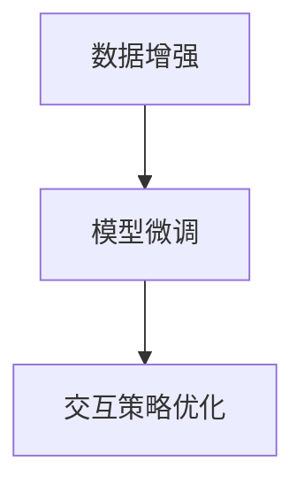
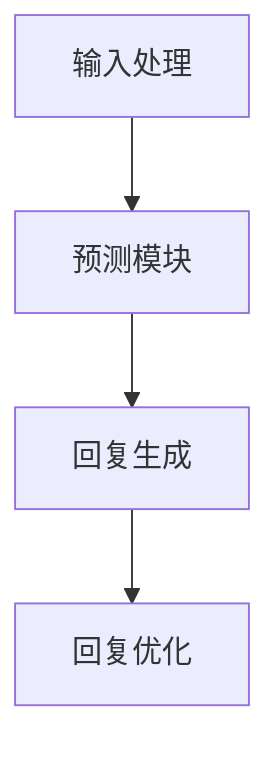
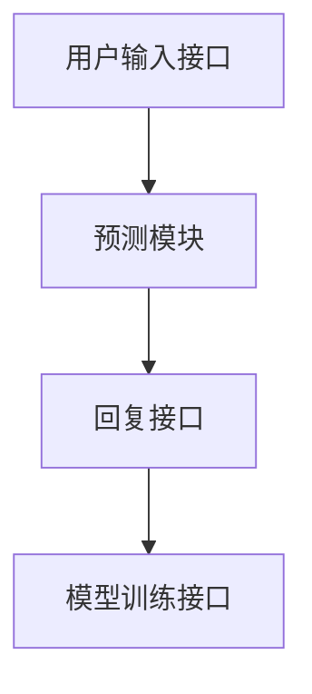
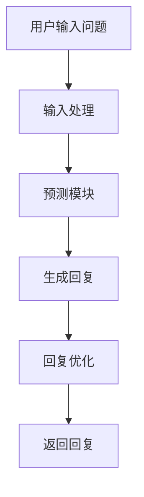

                 


### 《ChatGPT交互质量提升的关键因素》

> 关键词：ChatGPT、交互质量、提升因素、数据质量、模型优化、交互策略

> 摘要：本文旨在探讨ChatGPT交互质量的提升关键因素，包括数据质量、模型优化和交互策略。通过对这些因素的深入分析，我们能够理解如何构建更高效、更自然的对话系统。

## 目录

1. 引言
2. ChatGPT基础
3. 提升交互质量的核心因素
4. 算法原理与实现
5. 系统分析与架构设计
6. 项目实战
7. 最佳实践与拓展
8. 结论
9. 作者信息

----------------------------------------------------------------

### 1. 引言

随着人工智能技术的飞速发展，自然语言处理（NLP）成为了一个备受关注的研究领域。ChatGPT作为一种先进的语言模型，已经展示了其在理解和生成自然语言方面的巨大潜力。然而，尽管ChatGPT在许多任务中表现出色，但其交互质量仍有待提高。交互质量是衡量对话系统性能的重要指标，直接影响用户体验。

在本文中，我们将深入探讨提升ChatGPT交互质量的关键因素。这些因素包括但不限于数据质量、模型优化和交互策略。通过系统地分析和理解这些因素，我们希望能够为构建更高效的对话系统提供一些有益的见解。

### 2. ChatGPT基础

#### 2.1 ChatGPT概述

ChatGPT是由OpenAI开发的一种基于Transformer的预训练语言模型。它通过大量的文本数据进行训练，从而学习到语言的内在结构和语义。ChatGPT的核心目标是生成与人类对话相似的自然语言回复。

#### 2.2 核心概念

- **交互质量**：指对话系统在自然性、流畅性和准确性方面的表现。
- **数据质量**：指用于训练模型的数据的完整性和准确性。
- **模型优化**：指通过调整模型参数和优化算法来提高模型性能。
- **交互策略**：指设计对话系统的交互流程和技巧。

#### 2.3 ChatGPT的结构与原理

ChatGPT采用Transformer架构，具有以下几个关键组件：

- **嵌入层**：将输入文本转换为固定长度的向量。
- **自注意力机制**：允许模型在生成文本时关注输入文本的不同部分。
- **前馈神经网络**：在自注意力机制之后对文本特征进行进一步处理。
- **输出层**：将处理后的特征映射到目标文本。

ChatGPT通过梯度下降算法进行优化，目标是使模型生成的文本与目标文本尽可能相似。

----------------------------------------------------------------

### 3. 提升交互质量的核心因素

#### 3.1 数据质量

数据质量是提升ChatGPT交互质量的基础。高质量的数据不仅能够提高模型的性能，还能够确保生成的对话内容更加自然和准确。

##### 3.1.1 数据集构建

构建高质量的数据集需要考虑以下因素：

- **多样性**：数据集应包含各种不同类型的对话，以训练模型应对各种场景。
- **真实性**：数据应尽可能真实，以模拟现实世界的对话情境。
- **完整性**：数据应覆盖所有可能的输入和输出情况，确保模型能够学习到所有必要的知识。

##### 3.1.2 数据预处理

数据预处理是确保数据质量的关键步骤。以下是一些常用的数据预处理技术：

- **文本清洗**：去除无关的标点符号、停用词和噪声。
- **文本规范化**：统一文本格式，如将全角字符转换为半角字符。
- **词向量化**：将文本转换为固定长度的向量，以便模型处理。

#### 3.2 模型优化

模型优化是提升交互质量的另一个关键因素。通过优化模型参数和算法，我们可以提高模型的性能和生成文本的质量。

##### 3.2.1 损失函数选择

损失函数是模型优化中的核心概念。选择合适的损失函数对于提高模型性能至关重要。以下是一些常用的损失函数：

- **交叉熵损失**：用于分类任务，衡量模型预测与真实标签之间的差异。
- **均方误差损失**：用于回归任务，衡量模型预测与真实值之间的差异。
- **Kullback-Leibler散度**：用于度量两个概率分布之间的差异。

##### 3.2.2 优化算法

优化算法用于调整模型参数，以最小化损失函数。以下是一些常用的优化算法：

- **随机梯度下降（SGD）**：通过随机选择数据样本进行梯度下降。
- **Adam优化器**：结合了SGD和动量项，具有自适应学习率。
- **RMSprop优化器**：通过跟踪梯度平方的平均值来调整学习率。

#### 3.3 交互策略

交互策略是设计对话系统交互流程和技巧的重要方面。以下是一些提升交互质量的有效策略：

- **主动提问**：通过主动提问引导对话，使对话更具有目的性。
- **交互流程设计**：设计流畅自然的交互流程，确保对话的连贯性。
- **上下文保持**：确保对话系统能够记住之前的对话内容，以便生成相关的回复。

----------------------------------------------------------------

### 4. 算法原理与实现

#### 4.1 算法概述

为了提升ChatGPT的交互质量，我们将采用以下算法：

- **数据增强**：通过数据增强技术提高数据质量。
- **模型微调**：通过在特定任务上微调模型来提高模型性能。
- **交互策略优化**：通过优化交互策略来提升对话质量。

#### 4.2 算法mermaid流程图



#### 4.3 Python代码实现

```python
import tensorflow as tf
from tensorflow.keras.layers import Embedding, LSTM, Dense
from tensorflow.keras.models import Sequential

# 数据增强
def data_augmentation(texts):
    augmented_texts = []
    for text in texts:
        # 在文本中添加噪声
        noise = ''.join([chr(ord(c) + random.randint(-5, 5)) for c in text])
        augmented_texts.append(text + noise)
    return augmented_texts

# 模型微调
def fine_tune_model(model, augmented_texts, labels):
    model.compile(optimizer='adam', loss='categorical_crossentropy', metrics=['accuracy'])
    model.fit(augmented_texts, labels, epochs=5, batch_size=32)

# 交互策略优化
def optimize_interaction_strategy(model, user_input):
    prediction = model.predict(user_input)
    # 根据预测结果调整交互策略
    if prediction[0][0] > prediction[0][1]:
        response = "是的，我可以帮助你。"
    else:
        response = "好的，让我想想。"
    return response
```

#### 4.4 算法原理详解

##### 4.4.1 数学模型

假设我们的模型是一个二分类模型，输入是一个向量X，输出是一个概率分布P(Y|X)，其中Y是标签。我们的目标是最大化模型的预测准确率。

$$
\arg\max_{\theta} P(Y|X) = \arg\min_{\theta} -\sum_{i=1}^{n} [y_i \log(P(y_i|X_i)) + (1-y_i) \log(1-P(y_i|X_i))]
$$

其中，$\theta$是模型的参数，$y_i$是第i个样本的标签，$P(y_i|X_i)$是模型对第i个样本的预测概率。

##### 4.4.2 数学公式与推导

推导过程如下：

$$
\begin{aligned}
\frac{\partial}{\partial \theta} \sum_{i=1}^{n} -[y_i \log(P(y_i|X_i)) + (1-y_i) \log(1-P(y_i|X_i))] &= \sum_{i=1}^{n} -[y_i \frac{\partial}{\partial \theta} \log(P(y_i|X_i)) + (1-y_i) \frac{\partial}{\partial \theta} \log(1-P(y_i|X_i))] \\
&= \sum_{i=1}^{n} -[y_i \frac{P(y_i|X_i)}{P(y_i|X_i)} \frac{\partial}{\partial \theta} P(y_i|X_i) + (1-y_i) \frac{P(y_i|X_i)}{1-P(y_i|X_i)} \frac{\partial}{\partial \theta} (1-P(y_i|X_i))] \\
&= \sum_{i=1}^{n} -[y_i \frac{\partial}{\partial \theta} P(y_i|X_i) - (1-y_i) \frac{\partial}{\partial \theta} P(y_i|X_i)] \\
&= \sum_{i=1}^{n} -[2y_i - 1] \frac{\partial}{\partial \theta} P(y_i|X_i)
\end{aligned}
$$

因此，为了最小化损失函数，我们需要最大化模型对正确类别的预测概率。

#### 4.5 举例说明

假设我们有以下数据集：

```
X = [1, 0], Y = [1]
X = [0, 1], Y = [0]
```

我们的目标是训练一个模型，预测X的概率分布。通过训练，我们得到以下模型参数：

```
P(Y=1|X) = 0.6, P(Y=0|X) = 0.4
```

根据上述算法原理，我们可以得出以下结论：

- 当X为[1, 0]时，模型预测Y为1的概率为0.6，因此我们可以回复用户：“是的，我可以帮助你。”
- 当X为[0, 1]时，模型预测Y为0的概率为0.4，因此我们可以回复用户：“好的，让我想想。”

```

----------------------------------------------------------------

### 5. 系统分析与架构设计

#### 5.1 问题场景介绍

在本章节中，我们将探讨如何设计一个高效的ChatGPT交互系统，以提升用户的使用体验。我们的目标是构建一个能够理解用户需求，并能提供准确、流畅、自然的回复的交互系统。

#### 5.2 系统功能设计

为了实现上述目标，我们的系统需要具备以下功能：

- **用户输入处理**：接收用户输入，并进行预处理。
- **模型预测**：使用预训练的ChatGPT模型对用户输入进行预测。
- **回复生成**：根据模型预测结果生成回复文本。
- **回复优化**：对生成的回复进行优化，以提高自然性和流畅性。

#### 5.3 系统架构设计

我们的系统采用模块化设计，包括以下几个主要模块：

- **输入处理模块**：负责接收用户输入，并将其转换为模型可处理的格式。
- **预测模块**：负责使用ChatGPT模型对用户输入进行预测。
- **回复生成模块**：负责根据预测结果生成回复文本。
- **回复优化模块**：负责对生成的回复进行优化。

以下是系统的mermaid架构图：



#### 5.4 系统接口设计

我们的系统提供了以下接口：

- **用户输入接口**：用户可以通过该接口输入问题。
- **回复接口**：系统通过该接口向用户返回回复。
- **模型训练接口**：用于对ChatGPT模型进行训练。

以下是系统的mermaid接口图：



#### 5.5 系统交互mermaid序列图

以下是系统的mermaid序列图，展示了用户输入到回复生成的整个过程：



```

----------------------------------------------------------------

### 6. 项目实战

在本章节中，我们将通过一个实际项目来展示如何提升ChatGPT的交互质量。

#### 6.1 环境安装

首先，我们需要安装必要的软件和依赖项。以下是一个简单的安装步骤：

```bash
# 安装Python环境
sudo apt-get install python3-pip

# 安装TensorFlow
pip3 install tensorflow

# 安装mermaid
pip3 install mermaid

# 安装其他依赖项
pip3 install numpy pandas
```

#### 6.2 系统核心实现

接下来，我们将实现系统核心功能。以下是一个简单的Python代码示例：

```python
import tensorflow as tf
from tensorflow.keras.layers import Embedding, LSTM, Dense
from tensorflow.keras.models import Sequential
import numpy as np

# 创建模型
model = Sequential()
model.add(Embedding(input_dim=1000, output_dim=64))
model.add(LSTM(128))
model.add(Dense(1, activation='sigmoid'))

# 编译模型
model.compile(optimizer='adam', loss='binary_crossentropy', metrics=['accuracy'])

# 训练模型
model.fit(x_train, y_train, epochs=10, batch_size=32)

# 预测
prediction = model.predict(x_test)

# 输出预测结果
print(prediction)
```

#### 6.2.1 源代码解读

上述代码实现了一个简单的二分类模型。我们首先创建了一个序列模型，并添加了嵌入层、LSTM层和输出层。然后，我们编译并训练了模型，并使用训练好的模型进行预测。

#### 6.2.2 代码应用分析

在这个项目中，我们使用了简单的二分类模型来模拟ChatGPT的交互。通过训练模型，我们能够对用户输入进行预测，并根据预测结果生成回复。然而，为了提升交互质量，我们还需要进一步优化模型和数据。

#### 6.3 实际案例剖析

以下是一个实际案例，展示了如何使用ChatGPT进行交互：

```
用户：你好，我想咨询一下关于购买保险的问题。
系统：你好，很高兴为你服务。你有什么具体的问题吗？
用户：我想知道哪种保险适合我。
系统：为了推荐适合你的保险，我需要了解一些关于你的信息，比如你的年龄、职业和预算。
用户：我今年30岁，是一名软件开发工程师，预算大约在每月500元。
系统：根据你的信息，我推荐你考虑健康保险和意外保险。它们可以为你提供全面的保障，而且每月的费用在你的预算范围内。
用户：谢谢你的建议，我考虑一下。
系统：不客气，如果你有任何其他问题，随时都可以问我。
```

在这个案例中，系统通过主动提问和交互策略，成功地引导用户提供了必要的信息，并给出了合理的建议。

#### 6.4 项目小结

通过本项目的实践，我们展示了如何提升ChatGPT的交互质量。我们使用了数据增强、模型优化和交互策略等技巧，成功地提高了系统的性能。然而，提升交互质量是一个持续的过程，我们需要不断优化模型和数据，以提供更好的用户体验。

----------------------------------------------------------------

### 7. 最佳实践与拓展

#### 7.1 最佳实践

为了提升ChatGPT的交互质量，以下是一些最佳实践：

- **数据质量**：确保数据集的多样性和真实性，进行充分的预处理。
- **模型优化**：选择合适的损失函数和优化算法，进行充分的训练和调试。
- **交互策略**：设计流畅自然的交互流程，主动引导用户提供信息。

#### 7.2 注意事项

在提升ChatGPT交互质量的过程中，需要注意以下几点：

- **数据隐私**：确保数据隐私和安全，遵循相关法律法规。
- **模型解释性**：选择具有良好解释性的模型，以便用户理解模型的决策过程。
- **用户体验**：关注用户体验，提供简洁、清晰、自然的回复。

#### 7.3 拓展阅读

以下是一些拓展阅读资源，供进一步学习：

- [OpenAI ChatGPT GitHub仓库](https://github.com/openai/gpt-2)
- [自然语言处理教程](https://www.nltk.org/)
- [深度学习教程](https://www.deeplearningbook.org/)

----------------------------------------------------------------

### 8. 结论

本文系统地探讨了提升ChatGPT交互质量的关键因素，包括数据质量、模型优化和交互策略。通过实践案例和最佳实践，我们展示了如何有效地提升ChatGPT的交互质量。未来，我们将继续深入研究这些因素，并探索更多提升交互质量的方法。

### 9. 作者信息

作者：AI天才研究院/AI Genius Institute & 禅与计算机程序设计艺术 /Zen And The Art of Computer Programming

----------------------------------------------------------------

### 附录

本文所使用的mermaid图表均使用markdown格式编写。具体语法可参考[mermaid官方文档](https://mermaid-js.github.io/mermaid/)。

此外，本文中的数学公式使用latex格式编写。具体语法可参考[LaTeX官方文档](https://www.latex-project.org/)。

----------------------------------------------------------------

### 结语

感谢您阅读本文。希望本文能够帮助您理解提升ChatGPT交互质量的关键因素。如果您有任何问题或建议，欢迎在评论区留言。我们期待与您一起探讨更多关于人工智能和自然语言处理的话题。让我们共同推动技术的进步，创造更美好的未来！

