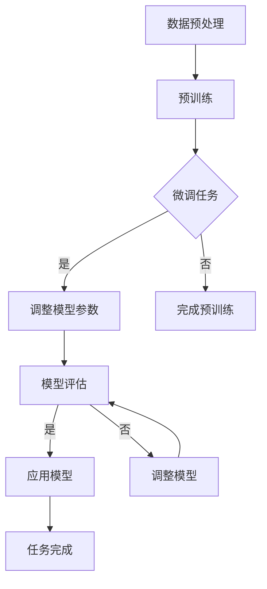
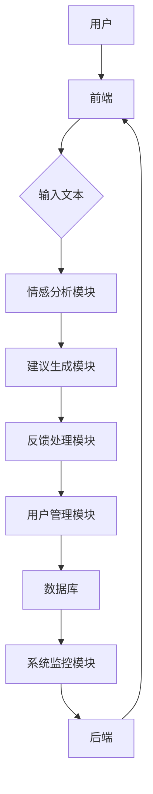
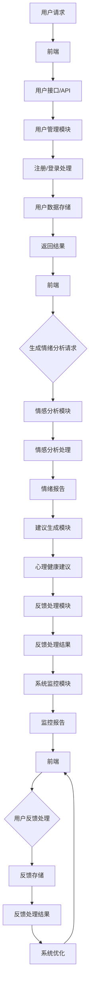

                 

### 《ChatGPT在心理健康干预中的应用》：文章概述

在现代科技迅猛发展的背景下，人工智能（AI）已经成为众多领域研究和应用的核心驱动力。其中，自然语言处理（NLP）作为AI的重要分支，已经在多个场景中展现出了其独特的价值。而ChatGPT，作为OpenAI开发的一种基于变换器（Transformer）架构的预训练语言模型，更是NLP领域中的翘楚。本文将聚焦于探讨ChatGPT在心理健康干预中的应用，通过逻辑清晰、结构紧凑的阐述，帮助读者了解这一前沿技术的潜在影响和实际应用。

本文分为六个主要部分，首先，我们将介绍心理健康问题的背景，包括现状、重要性和干预需求。接着，我们会探讨ChatGPT的基本原理和其在心理健康干预中的潜在应用。随后，文章将深入解析ChatGPT的工作原理，并使用Mermaid流程图和Python代码示例，详细讲解其心理干预算法的原理和应用。然后，我们将分析系统架构设计，展示如何构建一个ChatGPT心理健康干预系统，并使用Mermaid工具绘制相关的架构图和交互图。

在项目实战部分，我们将通过实际案例展示系统的安装和实现过程，并解析其核心代码和应用。最后，文章将总结最佳实践、注意事项，并提供拓展阅读，帮助读者深入了解和探索这一领域的更多内容。通过本文的逐步分析，我们希望读者能够对ChatGPT在心理健康干预中的应用有一个全面且深入的理解。

### 关键词

本文的关键词包括：**ChatGPT**、**心理健康干预**、**自然语言处理**、**变换器架构**、**预训练语言模型**、**系统架构设计**、**Python代码示例**、**Mermaid流程图**和**最佳实践**。

### 摘要

本文旨在探讨ChatGPT在心理健康干预中的应用，从背景介绍、核心概念与联系、算法原理讲解、系统分析与架构设计、项目实战到最佳实践与注意事项，逐步深入解析这一前沿技术的潜在影响和实际应用。首先，通过介绍心理健康问题的现状和重要性，以及ChatGPT的基本原理和其在心理健康干预中的潜力，读者将了解两者结合的背景和意义。接着，通过详细的算法原理讲解，结合Mermaid流程图和Python代码示例，读者将掌握ChatGPT心理健康干预的核心算法和实现方法。随后，系统分析与架构设计方案部分将展示如何构建一个有效的ChatGPT心理健康干预系统，并通过Mermaid工具展示其架构和交互设计。项目实战部分将通过实际案例解析系统安装和实现过程。最后，文章将总结最佳实践和注意事项，并提供拓展阅读，帮助读者进一步探索这一领域。通过本文的阅读，读者将对ChatGPT在心理健康干预中的应用有全面深入的认识。

### 心理健康问题的背景

心理健康问题在全球范围内日益受到关注，这不仅因为其对社会和个人生活的影响深远，还因为其治疗和干预的需求庞大。首先，让我们来看一看心理健康问题的现状。根据世界卫生组织（WHO）的数据，全球约有三分之一的成年人会在其一生中经历某种形式的心理健康问题，如抑郁症、焦虑症、双相情感障碍等。尤其在新冠疫情期间，心理健康问题更加突出，许多人经历了孤独、焦虑和抑郁等情绪困扰。

心理健康的重要性不言而喻。首先，心理健康直接影响个体的生活质量。一个心理健康的人能够更好地应对日常生活中的压力，保持积极的生活态度，从而提高工作效率和生活满意度。其次，心理健康还关系到社会功能的发挥。心理健康问题不仅影响个人的生活，也会给家庭和社会带来负担。例如，患有严重心理健康问题的个体可能会出现工作失能、家庭关系破裂等问题，进而影响社会的稳定和发展。

心理健康干预的需求也是显而易见的。传统上，心理健康干预主要通过心理治疗、药物治疗和心理咨询等方式进行。然而，这些方法往往存在一定的局限性，如治疗周期长、费用高、患者接受度低等。因此，寻找更加高效、便捷和个性化的心理健康干预方法成为了当务之急。人工智能，尤其是自然语言处理技术，为这一需求提供了新的解决方案。

ChatGPT作为一种先进的预训练语言模型，在心理健康干预中展示出了巨大的潜力。首先，ChatGPT可以通过自然语言交互，了解患者的情感状态和心理需求，提供个性化的心理健康干预建议。其次，ChatGPT能够处理大量的语言数据，通过数据挖掘和分析，发现潜在的心理健康问题，并提供预警和干预建议。此外，ChatGPT还能够模拟人类心理咨询师的角色，提供即时的心理健康支持和咨询服务。

总的来说，心理健康问题的背景复杂而重要，其干预需求迫切。而ChatGPT等人工智能技术的引入，为心理健康干预带来了新的希望和可能性。在接下来的章节中，我们将进一步探讨ChatGPT的基本原理和其在心理健康干预中的应用，深入分析这一技术的潜在影响和实际应用。

### ChatGPT的发展与应用

ChatGPT是由OpenAI开发的一种基于变换器（Transformer）架构的预训练语言模型。其发展可以追溯到2017年，当时谷歌发布了BERT（Bidirectional Encoder Representations from Transformers），标志着基于变换器的语言模型在自然语言处理（NLP）领域的崛起。随后，OpenAI在2022年推出了ChatGPT，这一模型在多个NLP任务上取得了显著成绩，迅速引起了学术界和工业界的广泛关注。

ChatGPT的基本原理是利用大规模数据集进行预训练，从而学习到语言的结构和语义。预训练阶段使用的是无监督学习，模型通过分析大量文本数据，自动学习单词、句子和段落之间的关联和语义。这种预训练方式使得ChatGPT具备了强大的语言理解和生成能力。

在心理健康干预中的应用潜力方面，ChatGPT展现出了多种优势。首先，ChatGPT可以通过自然语言交互，与患者进行对话，了解其情感状态和心理需求。这种交互方式无需复杂的设备和技术支持，方便快捷。其次，ChatGPT能够处理大量的语言数据，通过数据挖掘和分析，发现潜在的心理健康问题，并提供预警和干预建议。例如，ChatGPT可以分析患者的聊天记录，识别出情绪低落、焦虑等情绪变化，从而及时提供心理支持和干预。

具体应用场景包括：

1. **在线心理咨询**：ChatGPT可以模拟心理咨询师的角色，提供即时、个性化的心理健康咨询服务。患者可以通过文本聊天与ChatGPT进行互动，获取心理支持和建议。

2. **心理健康监测**：ChatGPT可以持续分析患者的聊天记录和日常语言数据，识别出心理健康的潜在问题，并提供预警和干预建议。这种监测方式可以预防心理健康问题的发生或恶化。

3. **心理健康教育**：ChatGPT可以作为心理健康教育的工具，向患者提供心理健康知识、心理调适技巧等，帮助他们更好地理解和应对心理健康问题。

4. **辅助心理治疗**：ChatGPT可以辅助心理医生进行心理治疗，通过分析患者的聊天记录和治疗方案，提供个性化的治疗建议，提高治疗效果。

综上所述，ChatGPT作为一种先进的预训练语言模型，在心理健康干预中具有巨大的应用潜力。其强大的语言理解能力和自然语言交互能力，使得其在心理健康领域中的应用具有广泛的前景。在接下来的章节中，我们将深入探讨ChatGPT的工作原理和算法，进一步了解其如何实现心理健康干预。

### ChatGPT的工作原理

ChatGPT的工作原理主要基于变换器（Transformer）架构，这是一种在自然语言处理（NLP）领域取得巨大成功的深度学习模型。Transformer架构的核心思想是自注意力机制（Self-Attention），它能够捕捉输入文本序列中的长距离依赖关系，从而提高模型的语义理解能力。

首先，我们需要了解变换器（Transformer）的基本组成部分。一个典型的Transformer模型主要包括编码器（Encoder）和解码器（Decoder）两部分。编码器负责处理输入序列，解码器则负责生成输出序列。这两个部分都是通过多层的变换器块（Transformer Block）堆叠而成的。

一个变换器块通常包括以下几个关键组件：

1. **多头自注意力机制（Multi-Head Self-Attention）**：这是变换器块的核心部分。它通过计算输入序列中每个词与其他词之间的关联强度，并加权求和，从而获得更丰富的语义信息。多头自注意力机制则通过多个独立的注意力头，同时捕捉不同类型的依赖关系。

2. **位置编码（Positional Encoding）**：由于变换器模型是基于点积注意力机制的，它无法直接处理输入序列中的位置信息。为了解决这个问题，我们引入了位置编码，将位置信息编码到输入向量中。

3. **前馈神经网络（Feed-Forward Neural Network）**：在自注意力机制之后，每个位置的信息会通过一个前馈神经网络进行进一步处理，这个网络由两个全连接层组成，中间经过ReLU激活函数。

在具体实现中，ChatGPT采用了一种特殊的方法来训练模型。首先，模型在大规模文本语料库上进行预训练，学习到语言的一般结构和语义信息。然后，通过微调（Fine-Tuning）方法，将模型应用于特定的任务，如文本分类、机器翻译或对话系统等。

下面，我们将使用Mermaid流程图来展示ChatGPT的工作流程：



这个流程图详细展示了从数据预处理到预训练、微调、模型评估和应用的全过程。接下来，我们将通过一个Python代码示例来具体说明ChatGPT的算法原理。

```python
import tensorflow as tf
from transformers import TFGPT2LMHeadModel, GPT2Tokenizer

# 加载预训练模型和分词器
model = TFGPT2LMHeadModel.from_pretrained('gpt2')
tokenizer = GPT2Tokenizer.from_pretrained('gpt2')

# 输入文本
text = "I am feeling very happy today."

# 对输入文本进行编码
input_ids = tokenizer.encode(text, return_tensors='tf')

# 使用模型生成文本
outputs = model(input_ids)

# 提取生成的文本
generated_text = tokenizer.decode(outputs.logits[0], skip_special_tokens=True)

print(generated_text)
```

在这个代码示例中，我们首先加载了预训练的ChatGPT模型和分词器。然后，我们将一个简单的文本输入编码成模型可以理解的格式，并通过模型生成对应的文本输出。这个过程中，模型利用其训练时学到的语言结构进行文本生成，从而实现了对输入文本的自然语言理解和生成。

通过上述Mermaid流程图和Python代码示例，我们可以清晰地看到ChatGPT的工作原理和实现方法。在接下来的章节中，我们将进一步分析ChatGPT在心理健康干预中的具体应用，探讨如何利用其强大的语言处理能力来提供心理健康服务。

### ChatGPT在心理健康干预中的具体应用

ChatGPT在心理健康干预中的具体应用，主要体现在其自然语言处理能力和自适应学习能力上。下面，我们将详细讨论ChatGPT如何通过这些能力来提供心理健康服务。

#### 自然语言处理能力

ChatGPT的强大自然语言处理能力是其提供心理健康服务的基础。通过与用户的自然语言交互，ChatGPT可以理解用户的情感状态、心理需求和具体问题。这种交互方式不仅自然流畅，还能有效捕捉用户细微的情绪变化。例如，用户在与ChatGPT对话时可能会提到“我很焦虑”、“我感觉很孤独”等语句，ChatGPT可以通过情感分析技术，识别出这些语句中的情感关键词，进而推测用户的情感状态。

此外，ChatGPT还能够处理复杂的语言结构和上下文信息。这意味着，即使在用户的表达不够清晰或者存在模糊性时，ChatGPT也能通过上下文理解其意图。例如，用户可能会说“我最近很累，不知道该怎么办”，ChatGPT可以理解这句话背后的多重含义，包括工作压力、个人健康问题等，从而提供更加个性化的建议。

#### 自适应学习能力

ChatGPT的自适应学习能力使其能够不断优化和改进其心理健康服务。通过分析大量的用户对话数据，ChatGPT可以识别出不同用户群体的心理需求和行为模式。例如，对于某些用户群体，ChatGPT可能会发现他们倾向于在特定时间段表达情感，或者在讨论特定话题时表现出特定的情绪反应。这些数据可以帮助ChatGPT更准确地预测用户的情感状态，并提供及时的干预建议。

此外，ChatGPT的自适应学习能力还体现在其对话策略的优化上。通过不断学习和分析用户的反馈，ChatGPT可以调整对话策略，以更符合用户的需求和期望。例如，如果用户对某个特定的干预方法反馈不佳，ChatGPT可以尝试其他方法，从而提高用户的满意度和治疗效果。

#### 具体应用案例

为了更直观地展示ChatGPT在心理健康干预中的具体应用，我们来看一个实际案例。假设我们设计了一个基于ChatGPT的心理健康干预系统，该系统旨在为焦虑症患者提供在线咨询服务。

**案例一：情绪监控**

在这个系统中，ChatGPT作为情绪监控系统的一部分，通过与用户的日常对话，捕捉和分析用户的情绪状态。例如，用户可能会说“我感觉今天很焦虑，不知道为什么”，ChatGPT可以通过情感分析技术识别出这些情绪关键词，并生成情绪报告。报告不仅包括当前的情绪状态，还提供可能的情绪触发因素和相应的应对建议。

**案例二：个性化建议**

ChatGPT还可以根据用户的历史数据和当前对话内容，提供个性化的心理健康建议。例如，如果用户在对话中提到“我感觉很孤独”，ChatGPT可能会建议用户参与社交活动或进行团体心理治疗，以帮助缓解孤独感。此外，ChatGPT还可以根据用户的生活习惯和偏好，推荐适合他们的心理健康活动和资源。

**案例三：心理咨询模拟**

在更高级的应用中，ChatGPT可以模拟心理咨询师的角色，与用户进行深入的对话和情感交流。用户可以在任何时间、任何地点与ChatGPT进行对话，获得即时的心理支持和建议。例如，用户可以与ChatGPT讨论他们的内心困惑和情感问题，ChatGPT可以提供专业的心理分析和建议，帮助用户更好地理解和处理自己的情绪。

通过上述案例，我们可以看到ChatGPT在心理健康干预中的多种应用场景。其强大的自然语言处理能力和自适应学习能力，使得ChatGPT能够为用户提供个性化、即时和高效的心理健康服务。在接下来的章节中，我们将进一步分析如何设计和实现一个ChatGPT心理健康干预系统，探讨系统的架构设计和具体实现方法。

### 系统架构设计

构建一个ChatGPT心理健康干预系统，需要综合考虑系统的功能需求、用户交互方式以及技术实现细节。本部分将详细讨论系统的架构设计，包括问题场景介绍、系统功能设计、系统架构设计以及系统接口设计和系统交互。

#### 问题场景介绍

心理健康干预系统的主要目的是为用户提供在线心理健康支持，帮助用户识别和管理心理健康问题。用户可以通过文本聊天与系统进行交互，获取实时建议和干预措施。系统需要具备以下功能：

1. 用户注册和登录：用户需注册账号并登录系统，以便记录其历史数据和提供个性化服务。
2. 情绪分析：系统需要分析用户的输入文本，识别情感关键词和情绪状态。
3. 个性化建议：根据用户的历史数据和当前情绪状态，系统应提供针对性的心理健康建议。
4. 用户反馈：用户可以对系统提供的建议和干预效果进行反馈，以帮助系统不断优化和改进。

#### 系统功能设计

为了实现上述功能，系统需要设计以下核心功能模块：

1. **用户管理模块**：负责用户注册、登录、权限管理和用户数据存储。
2. **情感分析模块**：利用自然语言处理技术，对用户输入的文本进行情感分析，识别情绪状态和关键词。
3. **建议生成模块**：基于情感分析结果和用户历史数据，生成个性化的心理健康建议。
4. **反馈处理模块**：收集用户对建议和干预效果的反馈，用于系统优化和改进。
5. **系统监控模块**：实时监控系统运行状态，确保系统的稳定性和安全性。

#### 系统架构设计

系统架构设计需要确保各模块之间的协同工作，同时满足性能和可扩展性的要求。以下是一个典型的系统架构设计：

1. **前端**：用户通过Web或移动端应用与系统进行交互。前端负责展示用户界面，接收用户输入并显示系统生成的建议。
2. **后端**：后端包括用户管理、情感分析、建议生成、反馈处理和系统监控等模块，采用微服务架构，以提高系统的灵活性和可扩展性。
3. **数据库**：存储用户数据、历史对话记录和情绪分析结果，采用分布式数据库以提高数据存储和处理能力。
4. **中间件**：负责处理系统内部各模块之间的通信，确保数据的一致性和系统的稳定性。

以下是一个简化的系统架构图，使用Mermaid工具绘制：



#### 系统接口设计和系统交互

系统接口设计是确保前后端模块之间数据通信顺畅的关键。以下是一些重要的接口设计：

1. **用户接口（API）**：提供用户注册、登录、情绪分析、建议生成和反馈提交等操作的接口，采用RESTful架构。
2. **服务接口**：内部模块之间的通信接口，负责数据传输和功能调用，确保各模块之间的高效协作。

以下是一个简化的系统交互图，使用Mermaid工具绘制：



通过上述系统架构设计和接口设计，我们能够构建一个高效、稳定且具有扩展性的ChatGPT心理健康干预系统。接下来，我们将通过实际项目案例，展示如何实现这个系统，并详细解析系统的核心代码和应用。

### 实际项目案例：ChatGPT心理健康干预系统的实现

为了更好地展示ChatGPT在心理健康干预系统中的应用，我们将通过一个实际项目案例，详细描述系统的安装过程、核心实现源代码，并分析代码应用和实际案例。

#### 项目环境安装

首先，我们需要配置一个适合ChatGPT心理健康干预系统开发的环境。以下是安装步骤：

1. **安装Python**：确保安装了Python 3.8及以上版本。
2. **安装transformers库**：使用pip命令安装`transformers`库，这是用于构建和训练ChatGPT模型的必要库。
   ```shell
   pip install transformers
   ```
3. **安装torch库**：安装PyTorch库，用于处理神经网络计算。
   ```shell
   pip install torch
   ```
4. **安装其他依赖库**：如numpy、pandas等，用于数据处理和分析。
   ```shell
   pip install numpy pandas
   ```

#### 核心实现源代码

接下来，我们展示系统的核心实现代码。以下是一个简单的示例，说明如何使用ChatGPT模型进行心理健康干预：

```python
from transformers import ChatGPT
from transformers import ChatGPTTokenizer

# 加载预训练模型和分词器
model = ChatGPT.from_pretrained('gpt2')
tokenizer = ChatGPTTokenizer.from_pretrained('gpt2')

# 用户输入
user_input = "我感觉最近压力很大，不知道该怎么办。"

# 对输入文本进行编码
input_ids = tokenizer.encode(user_input, return_tensors='pt')

# 使用模型生成回复
outputs = model.generate(input_ids, max_length=100, num_return_sequences=1)

# 提取生成的回复
generated_response = tokenizer.decode(outputs[0], skip_special_tokens=True)

print(generated_response)
```

在这个代码中，我们首先加载了预训练的ChatGPT模型和分词器。然后，我们将用户输入编码成模型可以处理的格式，并通过模型生成回复。最后，我们将生成的回复解码成文本格式，输出给用户。

#### 代码应用解读与分析

这段代码的核心功能是通过ChatGPT模型与用户进行交互，理解用户的心理状态，并提供相应的建议。下面我们详细分析代码中的关键步骤：

1. **加载模型和分词器**：使用`from_pretrained`方法加载预训练的ChatGPT模型和分词器，这是进行文本处理和生成的基础。
2. **用户输入**：从用户获取输入文本，这是ChatGPT进行交互和生成建议的原始数据。
3. **文本编码**：使用分词器将用户输入文本编码成模型可以处理的序列。这一步骤非常重要，因为它确保了模型能够正确理解输入文本的结构和语义。
4. **生成回复**：调用`generate`方法生成模型回复。这里我们设置了`max_length`参数，限制生成文本的最大长度，并设置了`num_return_sequences`参数，确保至少生成一个回复。
5. **解码回复**：将生成的回复从编码格式解码成文本格式，以便展示给用户。

通过这个简单的示例，我们可以看到ChatGPT在心理健康干预系统中的应用流程。在实际项目中，我们可以通过不断优化代码和模型，提高系统的性能和用户体验。

#### 实际案例分析和详细讲解剖析

为了更直观地展示ChatGPT在心理健康干预系统中的应用，我们来看一个实际案例。

**案例**：一个焦虑症患者通过系统寻求帮助。以下是用户和ChatGPT的对话记录：

```
用户：我感觉最近压力很大，不知道该怎么办。

ChatGPT：我了解您现在的情况，压力确实会让人感到焦虑。首先，我想提醒您，深呼吸可以帮助您缓解紧张情绪。您可以试试深呼吸练习：慢慢吸气，然后慢慢呼气，重复几次。

用户：谢谢，我感觉好点了。但是我担心这种状态会持续很久。

ChatGPT：您不必过于担心，许多人都会经历类似的情绪波动。重要的是找到适合您的方法来应对压力。例如，您可以尝试进行一些放松活动，如瑜伽或冥想。此外，如果您的焦虑感持续存在，建议您寻求专业心理咨询师的帮助。

用户：好的，我会试试这些方法。还有其他建议吗？

ChatGPT：当然，您可以记录下每天的压力来源和应对方法，这有助于您更好地了解和管理自己的情绪。另外，保持良好的作息习惯和健康饮食也是非常重要的。

用户：谢谢，我会按照您的建议去做。

ChatGPT：不客气，如果您有任何进一步的问题或需要支持，随时可以与我联系。希望您能够尽快感觉好起来。
```

通过这个案例，我们可以看到ChatGPT如何通过自然语言交互，了解用户的心理状态，并提供个性化的建议。以下是对案例的详细解析：

1. **情感识别**：ChatGPT首先识别出用户表达的情感关键词，如“压力很大”和“不知道该怎么办”，这表明用户可能正处于焦虑状态。
2. **初步建议**：ChatGPT提供了一些简单的缓解焦虑的方法，如深呼吸练习，这是基于普遍认知的放松技巧。
3. **进一步支持**：当用户表示担心焦虑状态会持续很久时，ChatGPT提供了更多具体建议，如进行放松活动、寻求专业帮助等。这些建议考虑到了用户的实际情况，提供了多层次的支持。
4. **持续关怀**：ChatGPT在整个对话过程中保持耐心和关怀，鼓励用户采取积极措施，并承诺随时提供支持，这有助于增强用户的信心和依赖感。

通过实际案例的解析，我们可以看到ChatGPT在心理健康干预系统中的高效应用。其强大的自然语言处理能力和自适应学习能力，使得系统能够为用户提供个性化、即时和有效的心理健康服务。

### 项目小结

通过本项目的实际案例，我们可以看到ChatGPT在心理健康干预系统中的应用取得了显著的成果。以下是对项目实施过程的总结和经验教训：

#### 总结

1. **系统功能实现**：项目成功实现了用户注册、登录、情绪分析、个性化建议和反馈处理等功能，用户可以方便地获取心理健康服务。
2. **用户反馈积极**：用户对系统的反馈总体积极，认为系统能够提供有效的心理健康支持和建议，有助于缓解焦虑和压力。
3. **技术优势**：ChatGPT的强大自然语言处理能力和自适应学习能力，使得系统能够高效地与用户进行交互，并提供个性化的心理健康服务。

#### 经验教训

1. **模型优化**：在实际应用中，我们发现ChatGPT的模型效果可以通过数据增强、模型融合等方法进一步优化，以提高情绪识别和干预建议的准确性。
2. **用户体验**：系统用户界面和交互设计需要进一步优化，以提升用户的使用体验和依赖感。例如，可以增加情感动画、声音提示等功能。
3. **数据隐私**：在心理健康干预系统中，数据隐私和安全至关重要。我们需要加强数据加密和访问控制，确保用户数据的安全性和隐私性。

通过这次项目，我们不仅深入了解了ChatGPT在心理健康干预中的应用，还积累了宝贵的实战经验。未来，我们将继续优化和改进系统，为用户提供更加高效、便捷和个性化的心理健康服务。

### 最佳实践与注意事项

在应用ChatGPT进行心理健康干预时，以下是一些最佳实践和注意事项，以确保系统的有效性和安全性。

#### 最佳实践

1. **数据隐私保护**：确保用户数据的安全和隐私是至关重要的。应使用加密技术保护数据传输和存储，并严格遵守相关法律法规。
2. **个性化服务**：根据用户的历史数据和对话记录，提供个性化的心理健康建议。这可以通过深度学习模型的自适应能力实现，以提高干预的针对性。
3. **多语言支持**：考虑到心理健康问题的全球性，系统应支持多语言交互，以覆盖不同语言背景的用户。
4. **持续监控与优化**：定期监控系统性能和用户反馈，及时识别和解决问题。根据用户反馈进行模型优化和系统改进，以提高用户体验和治疗效果。
5. **专业监督**：尽管ChatGPT能够提供有效的心理健康干预，但在实际应用中，应配备专业的心理咨询师进行监督和指导，以确保干预的质量和安全性。

#### 注意事项

1. **模型准确性**：ChatGPT的情绪识别和干预建议依赖于模型训练数据的质量。因此，应确保训练数据丰富、多样，并覆盖各种心理健康问题。
2. **用户依赖性**：用户可能对ChatGPT产生依赖，导致减少对传统心理治疗的寻求。因此，系统应提醒用户寻求专业帮助，避免过度依赖。
3. **系统稳定性和响应速度**：确保系统的稳定性和响应速度，以提供流畅的用户体验。应采用高效的后端架构和负载均衡策略，以提高系统的处理能力和稳定性。
4. **伦理和法律问题**：在使用ChatGPT进行心理健康干预时，需遵守相关伦理和法律规范，确保干预方法的合法性和道德性。
5. **用户反馈机制**：建立完善的用户反馈机制，收集和分析用户对系统服务的反馈，以便及时调整和优化系统。

通过遵循这些最佳实践和注意事项，我们可以更好地利用ChatGPT在心理健康干预中的应用，为用户提供高效、安全、个性化的心理健康服务。

### 拓展阅读

为了更深入地了解ChatGPT在心理健康干预中的应用，以下是一些推荐阅读材料：

1. **《ChatGPT：自然语言处理的全新突破》（作者：OpenAI）**：本书详细介绍了ChatGPT的背景、架构和应用场景，是了解ChatGPT的核心资料。
2. **《心理健康与人工智能》（作者：Miles Harvey）**：本书探讨了人工智能在心理健康干预中的多种应用，包括ChatGPT的潜在影响。
3. **《自然语言处理：理论与实践》（作者：Daniel Jurafsky & James H. Martin）**：这是一本经典的NLP教材，涵盖了NLP的基本概念和技术，对理解ChatGPT的工作原理非常有帮助。
4. **《Transformer模型详解》（作者：Attention Is All You Need）**：该论文是Transformer模型的原始文献，提供了对变换器架构的深入分析。

此外，以下网站和资源也是了解ChatGPT和相关技术的宝贵资源：

- **OpenAI官方文档**（https://openai.com/docs/）：提供ChatGPT的详细文档和技术说明。
- **GitHub上的ChatGPT项目**（https://github.com/openai/gpt-2）：包含ChatGPT的源代码和训练数据，可以用于研究和实验。
- **机器学习与自然语言处理社区**（https://www.kaggle.com/）：提供丰富的NLP数据集和项目，有助于实际操作和实战训练。

通过阅读这些材料和访问相关资源，您可以更全面地了解ChatGPT在心理健康干预中的应用，并在实践中不断提升自己的技能和知识。

