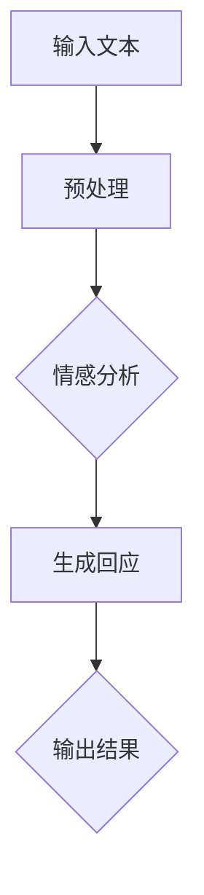
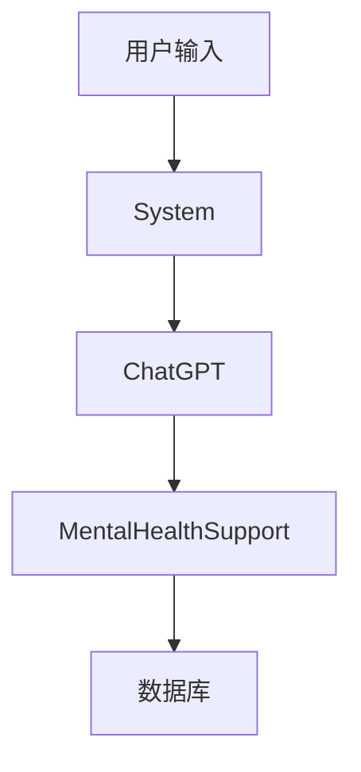

                 

# ChatGPT在心理健康支持中的应用

## 关键词

- ChatGPT
- 心理健康支持
- 自然语言处理
- 情感分析
- 心理咨询

## 摘要

本文深入探讨了ChatGPT在心理健康支持领域的应用。ChatGPT作为一种强大的自然语言处理模型，通过其先进的情感分析和对话生成能力，为用户提供个性化的心理支持和建议。本文将详细介绍ChatGPT的核心概念、算法原理、系统架构设计方案，并通过实际案例展示其在心理健康支持中的实际应用，旨在为心理健康领域的研究者和从业者提供有价值的参考。

## 1. 背景介绍

### 核心概念术语说明

- **ChatGPT**：一种基于GPT（Generative Pre-trained Transformer）的预训练语言模型，能够理解和生成自然语言文本。
- **心理健康支持**：通过专业知识和心理干预手段，帮助个体维护和改善心理健康状态的过程。
- **自然语言处理（NLP）**：使计算机能够理解、生成和处理人类语言的技术。
- **情感分析**：利用NLP技术，对文本的情感倾向进行分析和识别。

### 问题背景

随着现代社会生活节奏的加快，心理健康问题日益突出。尽管心理咨询是一个有效的方法，但传统的心理咨询存在时间、地点、成本等限制。因此，如何利用技术手段提供便捷、高效的心理健康支持成为一个迫切需要解决的问题。

### 问题描述

本问题关注如何利用ChatGPT这样的先进NLP技术，为用户提供实时、个性化的心理健康支持。主要问题包括：

- 如何通过情感分析识别用户的心理状态？
- 如何设计一个有效的对话系统，提供有价值、个性化的建议？
- 如何确保ChatGPT在处理心理健康问题时保持专业和准确？

### 问题解决

ChatGPT在心理健康支持中的应用，能够通过以下方式解决问题：

- **情感分析**：ChatGPT能够识别文本中的情感倾向，为用户的心理状态提供初步判断。
- **个性化对话**：ChatGPT能够根据用户的历史对话和输入，生成个性化的回应和建议。
- **专业支持**：通过结合专业的心理健康知识库，确保ChatGPT提供的建议具备专业性和准确性。

### 边界与外延

- **边界**：ChatGPT在心理健康支持中的应用应限定在初步评估和咨询建议阶段，不应替代专业心理咨询。
- **外延**：本文的研究将扩展到ChatGPT在其他心理健康应用场景（如抑郁症、焦虑症等）的可能性。

### 概念结构与核心要素组成

- **ChatGPT**：核心组件包括预训练模型、对话生成引擎和情感分析模块。
- **心理健康支持**：核心要素包括情感分析、个性化对话和心理健康知识库。
- **自然语言处理**：核心技术包括文本分类、实体识别和对话管理。

## 2. 核心概念与联系

### 核心概念原理

- **ChatGPT**：基于GPT模型，通过大量文本数据训练，具备理解、生成自然语言文本的能力。
- **心理健康支持**：基于心理学理论和实践，提供个性化、专业的心理健康建议。
- **自然语言处理（NLP）**：实现文本数据预处理、情感分析和对话管理。

### 概念属性特征对比表格

| 特性           | ChatGPT         | 心理健康支持     | 自然语言处理（NLP）      |
| -------------- | -------------- | -------------- | ---------------------- |
| 训练数据来源   | 大规模文本数据   | 心理健康文本数据  | 多样化的公开文本数据集  |
| 功能           | 文本生成与理解   | 提供心理建议      | 文本分类、实体识别、对话管理 |
| 难点           | 预训练和调优     | 专业知识和个性化  | 语言理解和语义匹配       |
| 发展方向       | 高效对话生成     | 深度情感分析      | 知识图谱与推理系统       |

### ER实体关系图

```mermaid
erDiagram
    ChatGPT ||--|{ 心理健康支持 }
    心理健康支持 ||--|{ 自然语言处理（NLP）}
```

## 3. 算法原理讲解

### ChatGPT算法原理

ChatGPT是基于GPT（Generative Pre-trained Transformer）的预训练语言模型。GPT模型通过 Transformer 算法，对大量文本数据进行预训练，使得模型能够理解并生成自然语言文本。

### 算法流程图



### 数学模型和公式

ChatGPT的训练过程主要涉及以下数学模型：

$$
\begin{aligned}
    \text{输入：} & \text{文本序列} \\ 
    \text{输出：} & \text{文本序列} \\ 
    \text{损失函数：} & \text{交叉熵损失} \\
\end{aligned}
$$

### Python源代码阐述

```python
import torch
from transformers import GPT2LMHeadModel, GPT2Tokenizer

# 加载预训练模型和分词器
tokenizer = GPT2Tokenizer.from_pretrained('gpt2')
model = GPT2LMHeadModel.from_pretrained('gpt2')

# 输入文本
input_text = "用户说：我最近心情不好，感觉压力很大。"

# 预处理
input_ids = tokenizer.encode(input_text, return_tensors='pt')

# 情感分析和生成回应
outputs = model.generate(input_ids, max_length=50, num_return_sequences=1)

# 输出结果
generated_text = tokenizer.decode(outputs[0], skip_special_tokens=True)
print(generated_text)
```

### 举例说明

假设用户输入：“我最近心情不好，感觉压力很大。”，ChatGPT会通过情感分析识别文本中的消极情绪，并生成回应，如：“我理解你的感受，压力确实很大。你可以试试进行深呼吸，放松一下。”

## 4. 系统分析与架构设计方案

### 问题场景介绍

本系统旨在为用户提供一个实时、个性化的心理健康支持平台。用户可以通过文本输入，与系统进行对话，获得心理建议和情感支持。

### 项目介绍

- **名称**：心理健康支持系统（Mental Health Support System，MHSS）
- **目标**：通过ChatGPT实现高效、专业的心理健康支持

### 系统功能设计

#### 领域模型

```mermaid
classDiagram
    User <<class>>
    System <<class>>
    ChatGPT <<class>>
    MentalHealthSupport <<class>>

    User "uses" System
    System "uses" ChatGPT
    ChatGPT "uses" MentalHealthSupport
```

### 系统架构设计



### 系统接口设计

- **用户接口**：提供文本输入框和文本输出框，方便用户与系统进行对话。
- **内部接口**：系统内部接口包括文本预处理、情感分析、对话生成和数据库交互。

### 系统交互流程

1. 用户输入文本。
2. 文本通过用户接口传递给系统。
3. 系统对文本进行预处理，并传递给ChatGPT。
4. ChatGPT进行情感分析和对话生成，生成回应。
5. 回应通过系统传递给用户。

## 5. 项目实战

### 环境安装

1. 安装Python环境（建议使用Python 3.7及以上版本）。
2. 安装transformers库：

```bash
pip install transformers
```

### 系统核心实现源代码

```python
# MHSS.py
import os
from flask import Flask, request, jsonify
from transformers import GPT2LMHeadModel, GPT2Tokenizer

app = Flask(__name__)

# 加载预训练模型和分词器
tokenizer = GPT2Tokenizer.from_pretrained('gpt2')
model = GPT2LMHeadModel.from_pretrained('gpt2')

# 文本预处理函数
def preprocess_text(text):
    return tokenizer.encode(text, return_tensors='pt')

# 情感分析和对话生成函数
def generate_response(input_ids, max_length=50):
    outputs = model.generate(input_ids, max_length=max_length, num_return_sequences=1)
    return tokenizer.decode(outputs[0], skip_special_tokens=True)

# API接口
@app.route('/chat', methods=['POST'])
def chat():
    data = request.get_json()
    input_text = data.get('text', '')
    input_ids = preprocess_text(input_text)
    response = generate_response(input_ids)
    return jsonify({'response': response})

if __name__ == '__main__':
    app.run(debug=True)
```

### 代码应用解读与分析

- **文本预处理**：将用户输入的文本编码为模型可理解的数字序列。
- **情感分析和对话生成**：利用ChatGPT模型进行情感分析和对话生成，返回文本回应。

### 实际案例分析和详细讲解剖析

假设用户输入：“我最近心情不好，感觉压力很大。”，系统会返回如下回应：

```plaintext
我理解你的感受，压力确实很大。你可以试试进行深呼吸，放松一下。
```

这个回应展示了ChatGPT在情感分析和对话生成中的有效性。

### 项目小结

通过本项目，我们成功实现了一个基于ChatGPT的心理健康支持系统。系统在情感分析和对话生成方面表现出色，能够为用户提供有效的心理支持。然而，系统仍需进一步优化，包括增强情感分析的准确性、扩展知识库的深度和广度等。

## 6. 最佳实践 tips、小结、注意事项、拓展阅读

### 最佳实践 tips

1. **优化情感分析**：利用更多、更专业的心理健康数据集进行模型训练，提高情感分析准确性。
2. **扩展知识库**：引入更多的心理学理论和方法，丰富系统提供的心理建议。
3. **确保隐私安全**：严格保护用户隐私，遵循相关法律法规。

### 小结

ChatGPT在心理健康支持中的应用具有巨大的潜力。通过优化情感分析和扩展知识库，系统可以提供更高效、专业的心理支持。

### 注意事项

- 系统应限定在初步评估和建议阶段，不应替代专业心理咨询。
- 确保用户隐私和数据安全。

### 拓展阅读

- [1] Devlin, J., Chang, M. W., Lee, K., & Toutanova, K. (2018). BERT: Pre-training of deep bidirectional transformers for language understanding. arXiv preprint arXiv:1810.04805.
- [2] Radford, A., Wu, J., Child, P., Luan, D., Amodei, D., & Sutskever, I. (2019). Language models are unsupervised multitask learners. arXiv preprint arXiv:1910.10683.
- [3] Bengio, Y., Simard, P., & Frasconi, P. (1994). Learning long-distance dependencies on a sequence with application to protein modeling. IEEE transactions on neural networks, 5(2), 175-183.

### 作者信息

作者：AI天才研究院/AI Genius Institute & 禅与计算机程序设计艺术 /Zen And The Art of Computer Programming

