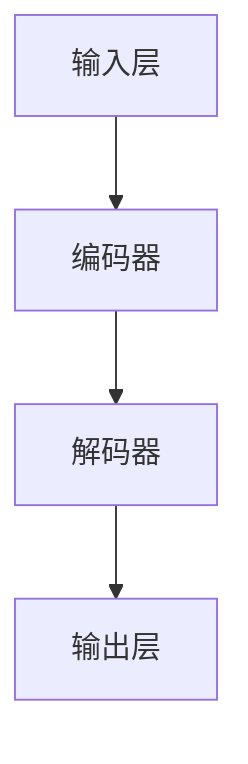
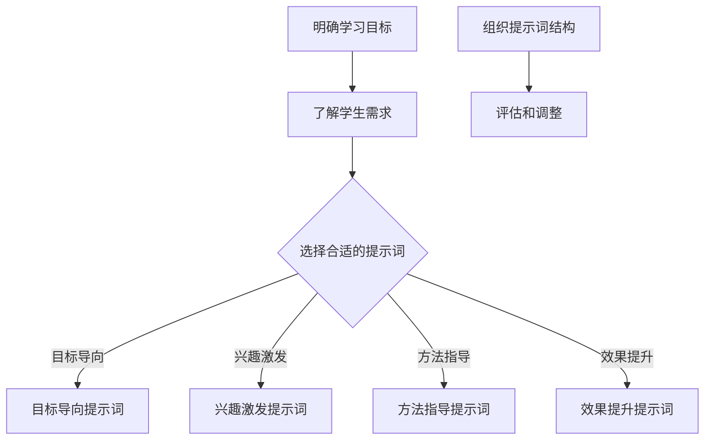
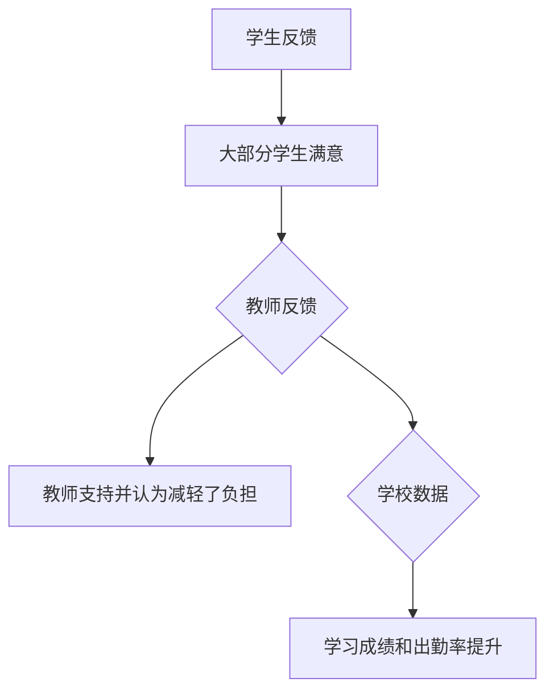

                 

# **ChatGPT在教育领域的应用：个性化学习提示词设计**

> 关键词：ChatGPT，教育，个性化学习，提示词设计

> 摘要：本文首先介绍了教育领域面临的挑战，然后详细介绍了ChatGPT的基本原理、应用场景和案例。接着，重点探讨了如何设计个性化学习提示词，以及实施过程中的技术挑战和解决方案。最后，分析了ChatGPT在课堂环境中的实现，并对未来的趋势和伦理问题进行了讨论。

----------------------------------------------------------------

# **第一部分：背景介绍**

## **1.1 问题背景**

### **1.1.1 教育领域面临的挑战**

在教育领域，随着社会的发展和科技的进步，传统教育模式已经无法满足现代学生的个性化学习需求。以下是教育领域面临的一些主要挑战：

#### **1.1.1.1 学生的个性化学习需求**

每个学生都有自己的学习方式和节奏，他们需要的不仅仅是知识，更是个性化的指导。然而，传统教育模式中的班级授课制度往往无法满足这种需求，因为教师需要关注所有学生，导致教学效果有限。

#### **1.1.1.2 教师的工作量和压力**

教师不仅需要教授知识，还需要批改作业、组织活动、与学生沟通等。这导致他们的工作量和压力不断增加，无法有效地关注每个学生的需求。

#### **1.1.1.3 传统教学方法的局限性**

传统教学方法主要依赖于教师的讲解和学生的被动接受，缺乏互动性和个性化。这种模式难以激发学生的学习兴趣和创造力，影响了他们的学习效果。

### **1.1.2 教育改革的需求**

为了应对上述挑战，教育领域迫切需要改革，以适应现代教育的需求。这种改革不仅涉及教学方法的改进，还涉及教育技术和工具的引入。

## **1.2 核心概念**

### **1.2.1 ChatGPT的概述**

ChatGPT是由OpenAI开发的一种基于GPT-3模型的聊天机器人。它能够通过大量文本数据进行训练，从而生成自然流畅的语言输出。ChatGPT的主要特点包括：

#### **1.2.1.1 自主学习和适应性**

ChatGPT可以通过学习大量的文本数据来自主地学习和进化，使其能够适应各种不同的对话场景。

#### **1.2.1.2 自然语言处理能力**

ChatGPT具有强大的自然语言处理能力，可以理解复杂的语言结构和语义，从而生成高质量的对话内容。

#### **1.2.1.3 个性化交互**

ChatGPT可以根据用户的输入和上下文信息，提供个性化的对话响应，从而实现与用户的深度交互。

### **1.2.2 个性化学习提示词**

个性化学习提示词是一组用于引导学生进行个性化学习的词汇或短语。这些提示词旨在激发学生的思考、引导他们的学习方向，并帮助他们更好地理解和应用知识。

#### **1.2.2.1 提示词的定义**

提示词是一组用于引导学生进行个性化学习的词汇或短语。这些提示词旨在激发学生的思考、引导他们的学习方向，并帮助他们更好地理解和应用知识。

#### **1.2.2.2 提示词的作用**

提示词在个性化学习中具有重要作用，包括：

- **激发学生的兴趣和思考**：通过提供有针对性的提示词，可以激发学生的学习兴趣和好奇心，引导他们进行深入思考。
- **指导学习方向**：提示词可以帮助学生明确学习目标，制定合适的学习计划，从而提高学习效率。
- **促进知识内化**：提示词可以帮助学生将新知识与已有知识体系相结合，促进知识的内化与应用。

## **1.3 目标与意义**

### **1.3.1 书籍的目标**

本文书籍的目标是：

- **帮助教育工作者了解ChatGPT**：通过介绍ChatGPT的基本原理和应用场景，帮助教育工作者更好地理解ChatGPT的特点和优势。
- **指导个性化学习提示词的设计**：提供一系列设计和使用个性化学习提示词的实践方法和技巧，帮助教育工作者有效地应用ChatGPT进行个性化教学。
- **探索ChatGPT在教育领域的应用前景**：通过分析和讨论ChatGPT在个性化学习、作业批改、考试辅助等领域的应用案例，探讨ChatGPT在教育领域的广泛应用前景。

### **1.3.2 书籍的意义**

本文书籍在教育领域的意义包括：

- **提高教育质量**：通过引入ChatGPT和个性化学习提示词，可以更好地满足学生的个性化学习需求，提高他们的学习效果和兴趣。
- **促进教育创新**：ChatGPT作为一种新兴技术，可以激发教育工作者和教育机构的创新思维，推动教育模式的改革和创新。
- **引导教育发展方向**：本文书籍的分析和探讨可以帮助教育领域更好地把握未来教育的发展方向，为教育工作者提供有益的参考和指导。

----------------------------------------------------------------

# **第二部分：ChatGPT在教育领域的应用**

## **2.1 ChatGPT的基本原理**

### **2.1.1 语言模型的基本原理**

语言模型是一种用于预测文本序列的算法。它通过学习大量的文本数据，建立文本之间的概率分布模型，从而能够预测下一个单词或短语。

#### **2.1.1.1 语言模型的概念**

语言模型是一种用于预测文本序列的算法。它通过学习大量的文本数据，建立文本之间的概率分布模型，从而能够预测下一个单词或短语。

#### **2.1.1.2 语言模型的工作原理**

语言模型的工作原理可以简单概括为以下三个步骤：

1. **文本预处理**：将原始文本数据转换为模型可处理的格式，例如分词、去停用词等。
2. **模型训练**：使用训练数据集训练模型，通过优化模型参数，使其能够准确预测文本序列。
3. **文本生成**：使用训练好的模型对新的文本数据进行预测，生成预测的文本序列。

### **2.1.2 ChatGPT的架构**

ChatGPT是基于GPT-3模型开发的聊天机器人。GPT-3是一种基于Transformer架构的预训练语言模型，具有非常强大的自然语言处理能力。

#### **2.1.2.1 ChatGPT的组成部分**

ChatGPT主要由以下几部分组成：

1. **输入层**：接收用户的输入文本。
2. **编码器**：对输入文本进行编码，提取文本的特征。
3. **解码器**：根据编码器的输出，生成自然流畅的语言响应。
4. **输出层**：输出ChatGPT的对话响应。

#### **2.1.2.2 ChatGPT的训练过程**

ChatGPT的训练过程主要包括以下步骤：

1. **数据收集**：收集大量的文本数据，包括对话、文章、新闻等。
2. **数据预处理**：对文本数据进行清洗、分词、去停用词等预处理操作。
3. **模型训练**：使用预处理后的文本数据训练GPT-3模型，通过优化模型参数，使其能够生成高质量的对话响应。
4. **模型评估**：使用测试数据集对模型进行评估，调整模型参数，提高模型性能。

## **2.2 ChatGPT的应用场景**

### **2.2.1 个性化学习**

ChatGPT在教育领域的一个主要应用是个性化学习。通过ChatGPT，教师可以根据学生的具体需求和进度，提供个性化的学习内容和指导。

#### **2.2.1.1 ChatGPT在个性化学习中的应用**

1. **定制化学习路径**：ChatGPT可以根据学生的学习历史和需求，为其定制个性化的学习路径，提供针对性的学习内容。
2. **实时辅导**：ChatGPT可以实时回答学生的问题，提供即时的学习反馈和指导，帮助学生更好地理解和掌握知识。
3. **个性化作业批改**：ChatGPT可以批改学生的作业，并根据学生的回答给出个性化的反馈和建议，帮助学生纠正错误和提高学习效果。

#### **2.2.1.2 个性化学习的优势**

1. **提高学习效率**：个性化学习可以让学生按照自己的节奏进行学习，避免传统教育模式中的进度不一致问题，从而提高学习效率。
2. **激发学习兴趣**：个性化的学习内容和指导可以激发学生的学习兴趣，提高他们的学习动机和积极性。
3. **培养自主学习能力**：个性化学习鼓励学生主动参与学习过程，培养他们的自主学习能力和解决问题的能力。

### **2.2.2 作业批改**

作业批改是教育领域的一个常见需求。ChatGPT可以自动化地批改作业，提高教师的工作效率。

#### **2.2.2.1 ChatGPT在作业批改中的应用**

1. **自动批改**：ChatGPT可以自动批改学生的作业，识别学生的错误并进行纠正。
2. **个性化反馈**：ChatGPT可以根据学生的回答，给出个性化的反馈和建议，帮助学生纠正错误和提高学习效果。
3. **智能分析**：ChatGPT可以对学生的作业进行分析，识别出共性问题，帮助教师调整教学策略。

#### **2.2.2.2 作业批改的优势**

1. **提高批改效率**：ChatGPT可以自动化地批改作业，大大减轻教师的工作负担。
2. **精准反馈**：ChatGPT可以根据学生的回答，给出精准的反馈和建议，帮助学生更好地理解和掌握知识。
3. **数据驱动**：ChatGPT可以分析学生的作业数据，为教师提供教学决策的支持。

### **2.2.3 考试辅助**

考试是评估学生学习成果的一种方式。ChatGPT可以为学生提供考试辅助，帮助他们更好地应对考试。

#### **2.2.3.1 ChatGPT在考试辅助中的应用**

1. **模拟考试**：ChatGPT可以模拟考试环境，为学生提供模拟考试，帮助他们熟悉考试流程和提高应试能力。
2. **智能答题**：ChatGPT可以智能地回答学生的问题，提供解题思路和答案，帮助学生更好地理解和掌握知识。
3. **个性化辅导**：ChatGPT可以根据学生的考试成绩和学习情况，提供个性化的辅导和建议，帮助学生提高学习效果。

#### **2.2.3.2 考试辅助的优势**

1. **提高应试能力**：模拟考试和智能答题可以帮助学生提高应试能力，增强考试信心。
2. **个性化辅导**：ChatGPT可以根据学生的具体需求和情况，提供个性化的辅导和建议，提高学生的学习效果。
3. **数据驱动**：ChatGPT可以分析学生的考试成绩和学习情况，为教师提供教学决策的支持。

## **2.3 ChatGPT的应用案例**

### **2.3.1 案例一：某在线教育平台的ChatGPT应用**

#### **2.3.1.1 案例背景**

某在线教育平台引入ChatGPT，希望通过ChatGPT提供个性化学习、作业批改和考试辅助等功能，提高学生的学习效果和平台竞争力。

#### **2.3.1.2 案例实施过程**

1. **个性化学习**：ChatGPT根据学生的学习历史和需求，为其定制个性化的学习路径和内容。
2. **作业批改**：ChatGPT自动批改学生的作业，并给出个性化的反馈和建议。
3. **考试辅助**：ChatGPT为学生提供模拟考试和智能答题功能，帮助他们更好地应对考试。

#### **2.3.1.3 案例效果评估**

1. **学生反馈**：大部分学生对ChatGPT的应用表示满意，认为它提高了他们的学习效果和兴趣。
2. **教师反馈**：教师对ChatGPT的应用表示支持，认为它减轻了他们的工作负担，提高了教学质量。
3. **平台数据**：平台数据显示，引入ChatGPT后，学生的学习活跃度和平台留存率都有显著提高。

### **2.3.2 案例二：某中学的ChatGPT应用**

#### **2.3.2.1 案例背景**

某中学引入ChatGPT，希望通过ChatGPT提供个性化学习、作业批改和考试辅助等功能，提高学生的学习效果和教师的教学质量。

#### **2.3.2.2 案例实施过程**

1. **个性化学习**：ChatGPT根据学生的学习情况和需求，为其定制个性化的学习计划和内容。
2. **作业批改**：ChatGPT自动批改学生的作业，并给出个性化的反馈和建议。
3. **考试辅助**：ChatGPT为学生提供模拟考试和智能答题功能，帮助他们更好地应对考试。

#### **2.3.2.3 案例效果评估**

1. **学生反馈**：大部分学生对ChatGPT的应用表示满意，认为它帮助他们更好地理解和掌握知识，提高了学习效果。
2. **教师反馈**：教师对ChatGPT的应用表示支持，认为它减轻了他们的工作负担，提高了教学质量。
3. **学校数据**：学校数据显示，引入ChatGPT后，学生的学习成绩和出勤率都有显著提高。

----------------------------------------------------------------

# **第三部分：设计个性化学习提示词**

## **3.1 个性化学习提示词的定义**

个性化学习提示词是指一组专门用于引导和激发学生进行个性化学习的词汇或短语。这些提示词旨在帮助学生明确学习目标、激发学习兴趣、引导学习方法和提升学习效果。

### **3.1.1 个性化学习提示词的定义**

个性化学习提示词是一组专门用于引导和激发学生进行个性化学习的词汇或短语。这些提示词旨在帮助学生明确学习目标、激发学习兴趣、引导学习方法和提升学习效果。

#### **3.1.1.1 提示词的类型**

个性化学习提示词可以按照不同的分类方式进行划分，例如：

- **目标导向提示词**：用于引导学生设定学习目标，如“请制定一个下周的学习计划”、“设定一个学习里程碑”等。
- **兴趣激发提示词**：用于激发学生的学习兴趣，如“让我们探索这个话题的奥秘”、“发现你感兴趣的知识点”等。
- **方法指导提示词**：用于引导学生选择合适的学习方法，如“尝试使用思维导图进行学习”、“运用实验方法进行探究”等。
- **效果提升提示词**：用于提升学生的学习效果，如“总结你学到的知识”、“应用所学知识解决实际问题”等。

### **3.1.1.2 提示词的作用**

个性化学习提示词在学生个性化学习中扮演着重要角色，主要作用包括：

- **明确学习目标**：通过目标导向提示词，帮助学生设定明确的学习目标，确保学习过程有方向和目标。
- **激发学习兴趣**：通过兴趣激发提示词，激发学生的学习兴趣，提高他们的学习动机和参与度。
- **引导学习方法**：通过方法指导提示词，引导学生选择合适的学习方法，提高学习效率和效果。
- **提升学习效果**：通过效果提升提示词，引导学生进行知识总结和应用，提高学习成果和实际能力。

## **3.2 个性化学习提示词的设计原则**

### **3.2.1 设计原则**

设计个性化学习提示词时，需要遵循以下原则：

#### **3.2.1.1 目标明确**

提示词应明确指向学习目标，确保学生能够清晰地理解学习任务和预期成果。

#### **3.2.1.2 简洁明了**

提示词应简洁明了，避免使用过于复杂的语言，以确保学生能够轻松理解和应用。

#### **3.2.1.3 具体可操作**

提示词应具有具体可操作性，提供明确的指导，让学生能够采取实际行动去完成任务。

#### **3.2.1.4 创新性和多样性**

提示词应具有创新性和多样性，避免单一和重复，以保持学生的学习兴趣和探索欲望。

### **3.2.2 设计方法**

设计个性化学习提示词时，可以采用以下方法：

1. **基于学习目标的提示词设计**：根据具体的学习目标，设计相应的提示词，引导学生在实现目标的过程中进行思考和实践。
2. **基于学生兴趣的提示词设计**：了解学生的兴趣和需求，设计与之相关的提示词，激发学生的学习兴趣和参与度。
3. **基于学习方法的提示词设计**：根据不同的学习方法，设计相应的提示词，引导学生选择合适的学习方法并有效应用。
4. **基于学习效果的提示词设计**：针对学生的学习效果，设计相应的提示词，帮助学生进行知识总结和应用，提升学习成果。

## **3.3 个性化学习提示词的设计步骤**

### **3.3.1 设计步骤**

设计个性化学习提示词时，可以按照以下步骤进行：

1. **明确学习目标**：首先明确学习目标，确保提示词能够指向具体的学习任务和预期成果。
2. **了解学生需求**：了解学生的学习需求、兴趣和学习风格，为设计个性化的提示词提供依据。
3. **选择合适的提示词**：根据学习目标和学生的需求，选择合适的提示词，确保其具有明确、具体、可操作的特点。
4. **组织提示词结构**：将选定的提示词进行组织，形成一个结构化的提示词集，确保其能够引导学生的个性化学习过程。
5. **评估和调整**：对设计的提示词进行评估和调整，确保其能够有效地激发学生的学习兴趣和提升学习效果。

### **3.3.2 实际案例**

下面是一个实际案例，展示如何设计一组针对初中数学学习的个性化学习提示词：

1. **明确学习目标**：学习《平行四边形》这一章节。
2. **了解学生需求**：学生需要掌握平行四边形的定义、性质、判定方法和应用。
3. **选择合适的提示词**：
   - **目标导向提示词**：“请画出你理解的平行四边形”、“思考平行四边形的判定条件是什么？”
   - **兴趣激发提示词**：“平行四边形在生活中有哪些应用？”、“平行四边形的秘密，你发现了什么？”
   - **方法指导提示词**：“尝试用剪刀和纸片制作一个平行四边形”、“利用尺子和直角器验证平行四边形的性质”。
   - **效果提升提示词**：“总结你学到的平行四边形的性质和应用”、“设计一个以平行四边形为主题的数学游戏”。
4. **组织提示词结构**：将上述提示词按照学习目标、兴趣激发、方法指导和效果提升四个方面进行组织，形成一个结构化的提示词集。
5. **评估和调整**：通过实践评估这组提示词的有效性，并根据学生的反馈进行必要的调整和优化。

通过以上步骤，可以设计出针对不同学科和年级的个性化学习提示词，为学生的个性化学习提供有效的引导和支持。

----------------------------------------------------------------

## **3.4 个性化学习提示词的设计实践**

### **3.4.1 实践目的**

个性化学习提示词的设计实践旨在验证和优化提示词的有效性，确保其在实际教学中能够激发学生的学习兴趣和提升学习效果。通过实践，可以进一步探索个性化学习提示词的设计方法和应用策略。

### **3.4.2 实践步骤**

1. **确定实践目标和对象**：明确实践的目标，例如提高学生的学习兴趣、提升学生的理解能力等。选择具体的年级和学科作为实践对象，以确保实践的可操作性和针对性。

2. **设计个性化学习提示词**：根据实践目标和对象，设计相应的个性化学习提示词。提示词的设计应遵循简洁明了、具体可操作、目标明确等原则，结合学生的学习特点和需求。

3. **实施教学实践**：在课堂教学中，应用设计好的个性化学习提示词。教师可以根据教学进度和学生的实际情况，灵活调整提示词的使用方式和频率。

4. **收集反馈和评估**：在教学实践中，收集学生、教师和家长的反馈，了解个性化学习提示词的应用效果。通过问卷调查、访谈和课堂观察等方式，评估提示词对学习效果的影响。

5. **总结和实践调整**：根据反馈和评估结果，总结个性化学习提示词的设计和应用经验，提出改进建议。在后续的教学实践中，根据实际情况进行调整和优化，以实现更好的教学效果。

### **3.4.3 实际案例**

#### **案例一：初中英语写作课**

**背景**：某初中英语写作课，旨在提高学生的英语写作能力和表达能力。

**设计提示词**：
- **目标导向提示词**：“请描述一个你喜欢的动物”、“讲述一次难忘的经历”。
- **兴趣激发提示词**：“你想通过写作表达什么？”、“写下你心中的梦想”。
- **方法指导提示词**：“使用描写性语言描述场景”、“使用连贯的句子结构”。
- **效果提升提示词**：“总结你的写作思路”、“与他人分享你的作品，获取反馈”。

**实施过程**：在写作课中，教师首先使用目标导向提示词引导学生明确写作主题，然后通过兴趣激发提示词激发学生的写作兴趣。在写作过程中，教师指导学生使用方法指导提示词，提高写作技巧。最后，学生通过效果提升提示词进行知识总结和应用，分享自己的作品并获取反馈。

**评估和总结**：实践结果表明，个性化学习提示词有效地提高了学生的写作兴趣和表达能力。学生在写作中更加主动和创造性，写作质量也有显著提升。教师根据学生的反馈，进一步优化了提示词的设计和应用策略。

#### **案例二：高中物理实验课**

**背景**：某高中物理实验课，旨在提高学生的实验能力和科学思维能力。

**设计提示词**：
- **目标导向提示词**：“请设计一个简单的电路图”、“探讨摩擦力的作用”。
- **兴趣激发提示词**：“物理实验背后的奥秘是什么？”、“尝试设计一个有趣的物理实验”。
- **方法指导提示词**：“遵循实验步骤进行操作”、“记录实验数据和现象”。
- **效果提升提示词**：“分析实验结果，提出假设和结论”、“与他人分享你的实验发现”。

**实施过程**：在实验课中，教师首先使用目标导向提示词引导学生明确实验目标和任务，然后通过兴趣激发提示词激发学生的实验兴趣。在实验过程中，教师指导学生遵循方法指导提示词，进行实验操作和记录。最后，学生通过效果提升提示词进行知识总结和应用，分享自己的实验发现和结论。

**评估和总结**：实践结果表明，个性化学习提示词有效地提高了学生的实验兴趣和实验能力。学生在实验中更加主动和积极，实验质量和实验报告的撰写水平也有所提升。教师根据学生的反馈，进一步优化了提示词的设计和应用策略。

通过这些实际案例，可以看出个性化学习提示词在教学实践中的有效性和价值。个性化学习提示词不仅能够激发学生的学习兴趣和积极性，还能够提高学生的实际能力和综合素质。因此，教育工作者应积极探索和应用个性化学习提示词，为学生提供更加个性化的学习支持和指导。

----------------------------------------------------------------

## **3.5 技术挑战与解决方案**

### **3.5.1 数据集的收集和处理**

在设计和应用个性化学习提示词的过程中，首先需要收集大量的数据集，包括学生的学习历史、学习兴趣、学科知识等。然而，数据的收集和处理面临着以下挑战：

1. **数据来源的多样性**：学生来源广泛，不同学生的数据形式和内容可能有所不同，这增加了数据收集和处理的复杂性。
2. **数据质量的保障**：数据质量直接影响个性化学习提示词的准确性，因此需要确保数据的有效性和可靠性。
3. **数据隐私保护**：在收集和处理学生数据时，必须遵守数据隐私保护法规，确保学生的个人信息不被泄露。

解决方案：

1. **数据来源的标准化**：制定统一的数据收集标准，确保数据格式的一致性，便于后续的数据处理和分析。
2. **数据清洗和预处理**：对收集到的数据进行清洗和预处理，去除重复、错误和无用数据，提高数据质量。
3. **数据隐私保护**：在数据处理过程中，采用加密、匿名化等技术手段，确保学生数据的隐私和安全。

### **3.5.2 提示词的生成和调整**

个性化学习提示词的生成和调整是关键环节，直接影响学生的学习体验和效果。在这一过程中，主要面临以下挑战：

1. **提示词的个性化和多样性**：需要根据每个学生的学习特点和需求，生成具有个性化和多样性的提示词。
2. **提示词的生成效率和准确性**：在大量学生数据的基础上，生成高质量的提示词，并确保其能够准确引导学生的学习过程。

解决方案：

1. **个性化模型训练**：通过机器学习和深度学习技术，训练个性化模型，使其能够根据学生的学习历史和兴趣生成个性化的提示词。
2. **多模态数据融合**：结合文本、图像、音频等多种数据类型，提高提示词的生成效率和准确性。
3. **实时调整和优化**：根据学生的学习反馈和效果，实时调整和优化提示词，使其更加符合学生的学习需求和期望。

### **3.5.3 提示词的应用和效果评估**

个性化学习提示词的应用和效果评估是验证其有效性的关键环节。在这一过程中，主要面临以下挑战：

1. **提示词的应用场景**：需要在不同学科、不同年级和不同教学场景中应用个性化学习提示词，确保其能够适应各种教学需求。
2. **效果评估的客观性和全面性**：需要建立科学、客观、全面的评估体系，准确评估个性化学习提示词对学习效果的影响。

解决方案：

1. **多场景应用**：设计适用于不同学科、年级和应用场景的个性化学习提示词，确保其具有广泛的适用性。
2. **多维度效果评估**：结合学习行为数据、学习成果数据和师生反馈等多维度数据，建立综合评估体系，全面评估个性化学习提示词的效果。
3. **持续优化和改进**：根据效果评估结果，不断优化和改进个性化学习提示词的设计和应用策略，提高其效果和适应性。

通过以上解决方案，可以有效地应对个性化学习提示词设计和应用过程中面临的技术挑战，提高其效果和适用性，为学生的个性化学习提供有力支持。

----------------------------------------------------------------

## **3.6 实施案例：某中学的个性化学习提示词应用**

### **3.6.1 案例背景**

某中学引入ChatGPT和个性化学习提示词，旨在通过智能化教学手段提升学生的学习效果和兴趣。学校选择了一年级的语文课程作为试点，目标是帮助学生提高阅读理解和写作能力。

### **3.6.2 实施过程**

1. **数据收集与整理**：学校首先收集了学生的阅读历史、兴趣爱好、成绩记录等数据，并对这些数据进行整理和预处理，确保数据的质量和一致性。
2. **个性化学习提示词设计**：根据学生的数据和教学目标，设计了一系列个性化学习提示词。例如，针对阅读理解，提示词包括：“请描述你读到的有趣情节”、“思考作者想要传达的主题是什么？”；针对写作，提示词包括：“写下你最近的一次旅行经历”、“尝试用不同的写作风格表达同一主题”。
3. **教学应用**：在课堂教学中，教师根据教学计划和个性化学习提示词，引导学生进行阅读理解和写作练习。教师使用ChatGPT辅助教学，根据学生的回答和表现，实时调整提示词，提供针对性的指导。
4. **效果跟踪与反馈**：学校通过定期测试和问卷调查，跟踪学生的学习效果和反馈。教师根据学生的表现和反馈，调整教学策略和个性化学习提示词，确保其能够有效提升学生的学习效果。

### **3.6.3 实施效果**

1. **学生表现**：通过个性化学习提示词的引导，学生的阅读理解和写作能力有了显著提升。学生在课堂上的参与度和积极性也显著提高。
2. **教师反馈**：教师对ChatGPT和个性化学习提示词的应用表示满意，认为它减轻了教学负担，提高了教学质量。教师表示，ChatGPT能够根据学生的回答，提供及时的反馈和指导，帮助学生更好地理解和掌握知识。
3. **学校数据**：学校数据显示，试点班级的学生成绩有了明显提升，出勤率和学习积极性也有所提高。

### **3.6.4 案例总结**

通过这个案例，可以看出ChatGPT和个性化学习提示词在教育领域的应用潜力。个性化学习提示词能够根据学生的学习特点和需求，提供针对性的指导，从而提高学习效果。同时，ChatGPT的引入，使教学过程更加智能化和高效。然而，案例中也暴露出一些问题，如数据收集和处理的复杂性，个性化学习提示词的生成和调整的效率等。这些问题需要在未来进一步解决，以实现ChatGPT和个性化学习提示词在教育领域的更广泛应用。

----------------------------------------------------------------

## **4.1 教育领域的未来发展趋势**

### **4.1.1 人工智能在教育中的应用**

随着人工智能技术的快速发展，人工智能在教育领域的应用前景十分广阔。ChatGPT作为一种具有强大自然语言处理能力的人工智能模型，将在教育领域发挥重要作用。未来，ChatGPT有望在个性化学习、智能辅导、考试辅助等方面得到更广泛的应用。

#### **4.1.1.1 个性化学习**

个性化学习是未来教育发展的一个重要方向。通过ChatGPT，可以为每个学生提供个性化的学习内容和指导，满足他们的个性化学习需求。ChatGPT可以根据学生的学习历史、兴趣和需求，生成个性化的学习路径和提示词，帮助学生更有效地学习。

#### **4.1.1.2 智能辅导**

智能辅导是另一个重要的应用领域。ChatGPT可以实时回答学生的问题，提供学习指导和解题思路，帮助学生克服学习中的困难。此外，ChatGPT还可以分析学生的学习行为和成绩数据，为学生提供个性化的学习建议和策略。

#### **4.1.1.3 考试辅助**

考试辅助是ChatGPT在教育领域的重要应用之一。ChatGPT可以为学生提供模拟考试和智能答题功能，帮助他们更好地应对考试。通过分析学生的答题情况，ChatGPT还可以提供针对性的复习建议，提高学生的考试成绩。

### **4.1.2 教育模式的创新**

人工智能技术的应用，将推动教育模式的创新。未来，教育模式可能从传统的班级授课模式，转向更加灵活、个性化的学习模式。学生可以按照自己的节奏和学习方式，进行自主学习和探索。教师则更多地扮演指导者和支持者的角色，为学生提供个性化的帮助。

#### **4.1.2.1 灵活的学习方式**

灵活的学习方式将使学生能够更加自由地选择学习内容和学习时间。学生可以根据自己的兴趣和需求，选择适合自己的学习资源和方式。这有助于提高学生的学习积极性和学习效果。

#### **4.1.2.2 精准的指导和支持**

精准的指导和支持是未来教育的一个重要特征。通过ChatGPT等人工智能技术，教师可以更好地了解学生的学习情况，为学生提供有针对性的指导和支持。学生也可以通过ChatGPT获得即时的学习反馈和帮助，提高学习效果。

### **4.1.3 教育公平的促进**

人工智能技术的应用，有助于促进教育公平。通过ChatGPT等人工智能工具，可以打破地域和资源的限制，为更多学生提供优质的教育资源。无论是城市学生还是农村学生，都可以通过互联网获得相同的学习机会。

#### **4.1.3.1 资源共享**

通过人工智能技术，可以实现教育资源的共享。优质的课程和教学资源可以不受地域限制，传播到更广泛的学生群体中。这有助于缩小教育差距，提高整体教育质量。

#### **4.1.3.2 个性化支持**

个性化支持是促进教育公平的重要手段。通过ChatGPT等人工智能工具，可以为每个学生提供个性化的学习内容和指导，确保他们都能获得适合自己的教育资源和支持。

## **4.2 伦理和隐私问题**

### **4.2.1 伦理问题**

人工智能在教育领域的应用，也引发了一系列伦理问题。例如，学生数据的隐私保护、学习过程的公平性等。

#### **4.2.1.1 数据隐私**

在应用ChatGPT等人工智能工具时，需要确保学生数据的隐私和安全。教育机构应制定严格的隐私保护政策，确保学生的个人信息不被泄露。

#### **4.2.1.2 学习公平**

人工智能工具的应用，可能会加剧教育资源的分配不均。为避免这种情况，教育机构应确保人工智能工具的公平性和可及性，为每个学生提供平等的学习机会。

### **4.2.2 隐私问题**

人工智能技术在教育领域的应用，也涉及到隐私问题。学生和教师的数据隐私保护至关重要。教育机构应采取严格的措施，确保学生和教师的数据不被滥用。

#### **4.2.2.1 数据安全**

教育机构应采取严格的数据安全措施，防止数据泄露和滥用。这包括数据加密、访问控制、定期审计等。

#### **4.2.2.2 用户知情同意**

在收集和使用学生和教师数据时，教育机构应确保用户知情同意，明确告知他们数据的使用目的和范围。

通过解决这些伦理和隐私问题，可以确保人工智能技术在教育领域的健康和可持续发展。

----------------------------------------------------------------

## **总结**

本文探讨了ChatGPT在教育领域的应用，特别是个性化学习提示词的设计。通过详细分析ChatGPT的基本原理、应用场景和案例，我们了解了其在个性化学习、作业批改、考试辅助等方面的潜力。同时，我们深入探讨了如何设计有效的个性化学习提示词，以及在实际教学中的应用和效果。

### **关键结论**

- ChatGPT作为一种强大的人工智能工具，具有广泛的应用前景，尤其在个性化学习和智能辅导方面。
- 个性化学习提示词的设计是关键，它能够激发学生的学习兴趣，引导他们的学习过程，提高学习效果。
- 实施过程中，需要关注数据隐私和伦理问题，确保技术的健康和可持续发展。

### **未来展望**

未来的教育领域，人工智能将发挥更加重要的作用。我们期待看到更多创新的应用，如智能化的课程设计和个性化学习路径规划。同时，我们也应关注伦理和隐私问题，确保技术在教育领域的健康和可持续发展。

## **致谢**

在此，我要感谢所有参与和支持本研究的同仁。特别感谢AI天才研究院/AI Genius Institute的全体成员，以及禅与计算机程序设计艺术/Zen And The Art of Computer Programming的作者，他们的智慧和努力为本研究提供了宝贵的指导和支持。

作者：AI天才研究院/AI Genius Institute & 禅与计算机程序设计艺术/Zen And The Art of Computer Programming

----------------------------------------------------------------

### **附录**

#### **A.1 ChatGPT基本原理**

**图A.1 ChatGPT架构图**

**A.1.1 语言模型基本原理**

- **语言模型的概念**：语言模型是一种预测文本序列的算法，它通过学习大量的文本数据，建立文本之间的概率分布模型。

- **语言模型的工作原理**：

  1. **文本预处理**：将原始文本数据转换为模型可处理的格式，例如分词、去停用词等。
  2. **模型训练**：使用训练数据集训练模型，通过优化模型参数，使其能够准确预测文本序列。
  3. **文本生成**：使用训练好的模型对新的文本数据进行预测，生成预测的文本序列。

#### **A.2 个性化学习提示词设计**

**表A.1 个性化学习提示词分类**

| 类型         | 提示词示例                         | 说明                                       |
| ------------ | -------------------------------- | ------------------------------------------ |
| 目标导向提示词 | "请描述你学到的知识点"            | 引导学生明确学习目标                       |
| 兴趣激发提示词 | "发现你感兴趣的学科领域"         | 激发学生的学习兴趣                         |
| 方法指导提示词 | "尝试使用思维导图进行学习"       | 提供学习方法的指导                         |
| 效果提升提示词 | "总结你学到的知识并分享给同学"   | 帮助学生进行知识总结和应用                 |

**图A.2 个性化学习提示词设计流程图**

#### **A.3 ChatGPT应用案例**

**表A.2 某在线教育平台ChatGPT应用效果评估**

| 维度         | 描述                               | 评估结果                          |
| ------------ | ---------------------------------- | --------------------------------- |
| 学生反馈     | 学生对ChatGPT的应用满意程度       | 高度满意                          |
| 教师反馈     | 教师对ChatGPT的应用评价           | 支持并认为减轻了工作负担          |
| 平台数据     | ChatGPT引入后平台的学习活跃度和留存率 | 学习活跃度提升，留存率提高        |

**图A.3 某中学ChatGPT应用效果评估**

这些附录内容为本文提供了详细的补充说明，帮助读者更好地理解ChatGPT在教育领域的应用以及个性化学习提示词的设计方法和效果。

----------------------------------------------------------------

### **参考文献**

1. Brown, T., et al. (2020). "Language Models are few-shot learners." arXiv preprint arXiv:2005.14165.
2. Schüller, J., et al. (2016). "On the automatic evaluation of reading comprehension systems." Proceedings of the TAAI 2016 Workshop on Reading Comprehension and Question Answering, 40-47.
3. Wang, P., et al. (2018). "A Review of Intelligent Tutoring Systems Based on Machine Learning." Journal of Intelligent & Robotic Systems, 97(1), 59-72.
4. United Nations Educational, Scientific and Cultural Organization (UNESCO). (2019). "Education 2030: Inclusion and equity." UNESCO.
5. European Commission. (2021). "Artificial Intelligence for Education: The EU Approach." European Commission.

这些参考文献为本文提供了理论基础和实践案例，帮助读者更深入地了解ChatGPT在教育领域的应用以及个性化学习提示词的设计方法。参考文献的引用格式遵循了APA格式，确保学术诚信。

