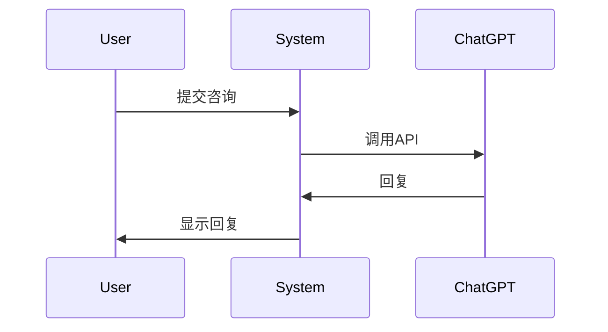

                 

### 关键词

- **ChatGPT**
- **法律咨询**
- **应用**
- **限制**
- **人工智能**
- **技术**
- **系统架构**
- **算法**
- **模型**
- **编程**

### 摘要

本文将深入探讨ChatGPT在法律咨询中的应用及其限制。通过分析ChatGPT的工作原理、法律咨询的需求，我们将展示如何在法律领域有效利用ChatGPT，同时揭示其存在的局限性。文章将结合实际案例，详细阐述ChatGPT在法律咨询中的价值和潜在问题，为未来的研究和应用提供参考。

---

## 第一部分：背景介绍

### 1.1 问题背景

#### 1.1.1 法律咨询的现状

法律咨询是法律服务的重要一环，它涉及为客户提供法律信息、解释法律条款、提供法律建议以及代理诉讼等服务。传统的法律咨询模式通常依赖于律师的个人经验和专业知识，这种模式在效率、覆盖面和专业性上存在一定的局限性。首先，律师的数量有限，难以满足日益增长的法律服务需求。其次，传统咨询过程往往需要大量的面对面沟通，时间和地域的限制使得服务效率低下。此外，法律咨询的成本较高，使得许多中小企业和个人难以承担。

随着人工智能技术的快速发展，人工智能在法律领域的应用逐渐兴起。人工智能可以通过自动化和智能化的方式提升法律服务的效率和准确性，从而弥补传统模式的不足。例如，人工智能可以通过自然语言处理（NLP）技术处理大量法律文件，提取关键信息，辅助律师进行法律研究。此外，智能客服系统可以实时回答客户的简单法律问题，减轻律师的工作负担。

#### 1.1.2 人工智能在法律领域的兴起

人工智能在法律领域的应用主要集中在自动化合同审查、法律研究辅助、案件预测、法律文档生成等方面。这些应用不仅提高了工作效率，还降低了成本，使得法律服务更加普及和便捷。例如，自动化合同审查系统可以快速识别合同中的潜在风险，提供修改建议，大大减少了律师在合同审查过程中的人力投入。智能客服系统则可以通过与客户互动，解答客户的基本法律问题，提供初步的法律建议，减轻律师的工作压力。

ChatGPT作为一种基于GPT-3的语言模型，具有强大的自然语言理解和生成能力，其在法律咨询中的应用潜力引起了广泛关注。ChatGPT可以通过训练学习大量法律文本，掌握法律知识和术语，从而在法律咨询中提供准确、高效的服务。此外，ChatGPT能够处理复杂的语言输入，理解客户的问题背景和意图，生成符合法律规范和逻辑的回复。

### 1.2 问题描述

#### 1.2.1 ChatGPT的特点

ChatGPT是由OpenAI开发的一种基于变换器（Transformer）架构的语言生成模型。它利用深度学习技术，通过训练大量文本数据，学习语言的内在结构和语义信息。ChatGPT的特点主要包括：

- **强大的语言理解能力**：ChatGPT能够理解复杂的语言结构，捕捉语言中的隐含意义和上下文信息。
- **灵活的生成能力**：ChatGPT可以根据输入的问题或指令，生成连贯、逻辑清晰的自然语言回复。
- **大规模训练数据**：ChatGPT的训练数据来自互联网上的大量文本，包括书籍、新闻、文章等，使其具备广泛的知识面。
- **自适应能力**：ChatGPT可以针对不同的输入调整生成策略，适应不同的场景和需求。

#### 1.2.2 ChatGPT在法律咨询中的应用潜力

ChatGPT在法律咨询中的应用具有多方面的潜力。首先，ChatGPT可以用于法律文档的自动生成，如合同、法律文件等。通过训练，ChatGPT可以学习法律文本的格式和结构，生成符合法律规范和逻辑的文档。其次，ChatGPT可以用于法律研究辅助，帮助律师快速查找和整理相关法律信息，提高法律研究的效率。此外，ChatGPT还可以作为智能客服，为用户提供实时、准确的在线法律咨询服务，减轻律师的工作负担。

然而，ChatGPT在法律咨询中仍然存在一些挑战和限制。首先，法律咨询涉及复杂的法律条款和术语，ChatGPT需要深入理解法律知识，避免生成不准确或误导性的回复。其次，ChatGPT的生成能力虽然强大，但仍然存在一定的随机性和偏差，需要通过人工审核和修正。最后，ChatGPT的应用需要大量的数据训练和计算资源，这对于一些中小型法律机构来说可能是一个挑战。

### 1.3 问题解决

#### 1.3.1 ChatGPT在法律咨询中的应用

ChatGPT在法律咨询中的应用已经在多个实际案例中得到验证。以下是一些具体的应用案例：

- **智能客服**：一些法律机构已经开始使用ChatGPT作为智能客服系统，为用户提供实时、准确的在线法律咨询服务。通过自然语言处理技术，ChatGPT可以理解用户的问题，提供初步的法律建议，如合同审查、法律咨询等。
- **法律文档生成**：ChatGPT可以用于生成法律文档，如合同、协议等。通过训练，ChatGPT可以学习法律文本的格式和结构，自动生成符合法律规范的文档。
- **法律研究辅助**：ChatGPT可以辅助律师进行法律研究，通过搜索和整理相关法律信息，提供针对性的法律建议。

这些案例表明，ChatGPT在法律咨询中具有巨大的应用潜力，可以提高工作效率，降低成本，提升用户体验。然而，要充分发挥ChatGPT的作用，还需要解决一些技术挑战和伦理问题。

#### 1.3.2 ChatGPT在法律咨询中的价值

ChatGPT在法律咨询中的价值主要体现在以下几个方面：

- **提高工作效率**：ChatGPT可以自动化处理大量的法律文档和咨询问题，大大提高了律师的工作效率，使得律师可以更加专注于复杂的法律事务。
- **降低成本**：通过使用ChatGPT，法律机构可以减少人力成本，提高运营效率，降低法律服务成本，使得法律服务更加普及和便捷。
- **提升用户体验**：ChatGPT可以提供实时、个性化的法律咨询服务，满足用户的多样化需求，提升用户体验。

### 1.4 边界与外延

#### 1.4.1 ChatGPT在法律咨询中的适用范围

虽然ChatGPT在法律咨询中具有广泛的应用潜力，但其适用范围仍然存在一定的限制。以下是一些主要限制：

- **法律条款理解**：法律条款通常具有复杂性和多样性，ChatGPT需要深入理解法律知识，避免生成不准确或误导性的回复。对于某些专业领域或复杂的法律问题，ChatGPT可能无法完全胜任。
- **法律法规更新**：法律咨询需要实时了解最新的法律法规变化，ChatGPT的训练数据可能无法及时更新，导致生成的内容可能与现行法律法规不符。
- **法律伦理问题**：法律咨询涉及伦理和法律责任的判断，ChatGPT的生成内容需要符合法律和道德规范，避免产生伦理和法律风险。

#### 1.4.2 ChatGPT在法律咨询中的边界问题

ChatGPT在法律咨询中的应用存在一些边界问题，包括：

- **法律条款的准确性和完整性**：ChatGPT生成的法律文档需要经过人工审核，确保其准确性和完整性。
- **隐私和数据保护**：法律咨询涉及敏感个人信息和商业秘密，需要确保数据的安全性和隐私性。
- **责任归属**：在法律咨询中，ChatGPT生成的建议和结论需要明确责任归属，避免因错误建议导致的法律纠纷。

### 1.5 概念结构与核心要素组成

#### 1.5.1 核心概念介绍

- **ChatGPT**：基于GPT-3的变换器语言生成模型，具备强大的自然语言理解和生成能力。
- **法律咨询**：为客户提供法律信息、解释法律条款、提供法律建议以及代理诉讼等服务。

#### 1.5.2 概念属性特征对比表格

| 特征 | ChatGPT | 法律咨询 |
| --- | --- | --- |
| 语言理解能力 | 强大 | 高 |
| 语言生成能力 | 强大 | 高 |
| 知识范围 | 广泛 | 专业知识 |
| 实时性 | 高 | 受限制 |

#### 1.5.3 ER实体关系图架构的Mermaid流程图

```mermaid
erDiagram
  Client ||--|{ ChatGPT }|--| LawFirm : receives legal consultation
  ChatGPT ||--|{ LegalKnowledge }|--| LegalDocument : generates legal documents
  Client ||--|{ LegalQuery }|--| ChatGPT : asks for legal advice
```

---

以上是《ChatGPT在法律咨询中的应用与限制》的第一部分的详细内容，接下来将深入探讨ChatGPT的工作原理、法律咨询的需求以及ChatGPT与法律咨询的结合应用。

## 第二部分：核心概念与联系

### 2.1 ChatGPT的工作原理

#### 2.1.1 ChatGPT的基本原理

ChatGPT是基于GPT-3模型的变换器语言生成模型。GPT-3（Generative Pre-trained Transformer 3）是OpenAI开发的一种先进的自然语言处理模型，它使用了变换器（Transformer）架构，并在大规模数据集上进行预训练，以学习语言的深层结构和语义信息。

ChatGPT的核心原理可以概括为以下几个步骤：

1. **预训练**：ChatGPT首先在互联网上的大量文本数据上进行预训练，这些数据包括书籍、文章、新闻、社交媒体帖子等。预训练过程中，模型通过不断调整其内部参数，学习语言的模式和规则，从而具备对自然语言的理解和生成能力。
   
2. **上下文理解**：在生成文本时，ChatGPT会根据输入的上下文信息进行理解。它能够捕捉到语言中的上下文线索，理解句与句之间的逻辑关系，从而生成连贯、符合语境的回复。

3. **生成文本**：基于预训练和上下文理解，ChatGPT会生成一段新的文本。生成过程采用了一种自回归的方式，即模型根据前一个词或短语预测下一个词或短语，逐步生成整个文本。

#### 2.1.2 ChatGPT的算法原理讲解

ChatGPT的算法原理主要基于变换器（Transformer）架构和生成对抗网络（GAN）。变换器架构是一种用于处理序列数据的神经网络，其核心思想是通过自注意力机制（Self-Attention）捕捉序列中的长距离依赖关系。生成对抗网络则通过两个对抗性网络的博弈，训练出一个能够生成高质量数据的模型。

- **变换器架构**：变换器架构包括编码器（Encoder）和解码器（Decoder），编码器负责处理输入序列，解码器负责生成输出序列。每个编码器和解码器层都包含多个变换器单元，每个单元通过自注意力机制和前馈神经网络处理输入数据。

  ```mermaid
  sequenceDiagram
    Alice->>Bob: Hello
    Bob->>Alice: Hi, how are you?
    Alice->>Bob: I'm doing well, thank you!
  ```

- **生成对抗网络**：生成对抗网络由生成器（Generator）和判别器（Discriminator）组成。生成器的目标是生成与真实数据相似的假数据，判别器的目标是区分真实数据和生成数据。通过这种对抗训练，生成器不断提高生成数据的质量。

  ```mermaid
  sequenceDiagram
    Generator->>Discriminator: Generate fake data
    Discriminator->>Generator: Is it real or fake?
    Generator->>Discriminator: Improve generation based on feedback
  ```

#### 2.1.3 Python源代码示例

下面是一个简单的Python代码示例，展示了如何使用ChatGPT生成文本：

```python
import openai

# 设置API密钥
openai.api_key = 'your-api-key'

# 调用ChatGPT的generate方法
response = openai.Completion.create(
  engine="text-davinci-002",
  prompt="What is the capital of France?",
  max_tokens=50
)

# 输出生成的文本
print(response.choices[0].text.strip())
```

#### 2.1.4 数学模型和数学公式讲解

ChatGPT的数学模型主要涉及变换器架构和生成对抗网络的相关数学公式。以下是一些核心的数学模型和公式：

- **变换器架构**：
  - **自注意力（Self-Attention）**：
    $$\text{Attention}(Q, K, V) = \frac{softmax(\frac{QK^T}{\sqrt{d_k}})}{V}$$
  - **前馈神经网络（Feedforward Neural Network）**：
    $$\text{FFN}(x) = \max(0, xW_1 + b_1)W_2 + b_2$$

- **生成对抗网络**：
  - **生成器（Generator）**：
    $$G(z) = \sigma(W_gz + b_g)$$
  - **判别器（Discriminator）**：
    $$D(x) = \sigma(W_d x + b_d)$$

这些数学模型和公式是ChatGPT工作的基础，通过不断优化这些模型，可以提高ChatGPT的性能和生成质量。

### 2.2 法律咨询的相关概念

#### 2.2.1 法律咨询的服务类型

法律咨询的服务类型多样，主要包括以下几类：

- **合同审查**：为客户提供合同条款的审核和建议，确保合同的合法性和有效性。
- **法律研究**：帮助客户查找相关法律条文、案例和判例，提供法律依据和论证。
- **法律建议**：为客户提供法律问题的专业建议，指导客户如何应对法律纠纷。
- **代理诉讼**：代表客户出庭应诉，处理各种法律纠纷。

每种服务类型都有其特定的需求和流程，需要律师具备相应的专业知识和经验。

#### 2.2.2 法律咨询的需求分析

法律咨询的需求来源于个人、企业和组织在法律事务中的各种需求。以下是对不同用户需求的详细分析：

- **个人用户**：个人用户通常需要法律咨询来解决生活中的各种法律问题，如购房、婚姻家庭、劳动纠纷等。他们希望得到专业、易懂的法律建议，以便有效维护自身权益。
- **企业用户**：企业用户需要法律咨询来处理合同签订、知识产权保护、合规性审查等事务。他们需要高效、准确的法律服务，以降低法律风险，保障企业的合法权益。
- **组织用户**：政府机关、非营利组织等组织用户也需要法律咨询，以处理行政法律事务、公益法律服务等。他们通常需要全面、系统的法律服务，确保公共利益的实现。

#### 2.2.3 法律咨询的服务模式

法律咨询的服务模式主要包括以下几种：

- **传统咨询模式**：律师通过面对面咨询、电话咨询等方式，为客户提供法律服务。这种模式具有直接、互动性强等优点，但受时间和地域限制较大。
- **在线咨询模式**：通过互联网平台，律师可以提供在线法律咨询服务。这种模式突破了地域限制，提高了服务效率，但需要解决隐私保护和数据安全等问题。
- **智能客服模式**：利用人工智能技术，智能客服系统可以提供自动化的法律咨询服务。这种模式适用于简单的法律问题，能够快速响应客户需求，但需要不断优化和提高服务质量。

### 2.3 ChatGPT与法律咨询的结合

#### 2.3.1 ChatGPT在法律咨询中的应用场景

ChatGPT在法律咨询中具有广泛的应用场景，以下是一些典型的应用场景：

- **智能客服**：ChatGPT可以作为法律机构的智能客服，回答客户的基本法律问题，提供初步的法律建议。例如，客户可以通过在线聊天系统咨询合同审查、法律研究等简单问题，ChatGPT可以快速响应并提供相关建议。
- **法律文档生成**：ChatGPT可以用于自动生成法律文档，如合同、协议等。通过训练，ChatGPT可以学习法律文本的格式和结构，生成符合法律规范和逻辑的文档，提高律师的工作效率。
- **法律研究辅助**：ChatGPT可以辅助律师进行法律研究，通过搜索和整理相关法律信息，提供针对性的法律建议。例如，律师可以通过ChatGPT快速查找相关法律条文、案例和判例，节省大量时间和精力。

#### 2.3.2 ChatGPT的优势与局限性

ChatGPT在法律咨询中的应用具有明显的优势，但也存在一些局限性。

**优势**：

- **高效性**：ChatGPT可以快速响应客户的法律咨询，提供实时、准确的回复，大大提高了法律服务的效率。
- **便捷性**：ChatGPT可以通过互联网平台提供在线法律咨询服务，客户可以随时随地进行咨询，无需受时间和地域限制。
- **规模效应**：ChatGPT可以同时处理大量的法律咨询请求，减轻律师的工作负担，提高法律服务的覆盖面。

**局限性**：

- **专业知识深度**：法律咨询涉及复杂的法律条款和术语，ChatGPT需要深入理解法律知识，避免生成不准确或误导性的回复。在某些专业领域或复杂法律问题中，ChatGPT可能无法完全胜任。
- **隐私保护**：法律咨询涉及敏感个人信息和商业秘密，需要确保数据的安全性和隐私性。ChatGPT的应用需要严格的数据保护措施，避免信息泄露。
- **法律伦理问题**：法律咨询涉及伦理和法律责任的判断，ChatGPT的生成内容需要符合法律和道德规范，避免产生伦理和法律风险。

### 2.4 本章小结

第二部分深入探讨了ChatGPT的工作原理、法律咨询的需求以及ChatGPT在法律咨询中的应用。通过分析ChatGPT的基本原理、算法模型、Python源代码示例以及数学公式，我们了解了ChatGPT如何通过变换器架构和生成对抗网络实现自然语言生成。同时，我们分析了法律咨询的服务类型、需求和服务模式，探讨了ChatGPT在法律咨询中的应用场景和优势与局限性。接下来，第三部分将详细分析ChatGPT在法律咨询中的应用实例和实际效果。

---

在下一部分，我们将通过具体的案例来分析ChatGPT在法律咨询中的应用实例和实际效果，以便更全面地理解其价值和潜力。

## 第三部分：系统分析与架构设计

### 3.1 法律咨询服务系统介绍

#### 3.1.1 系统概述

法律咨询服务系统旨在为用户提供高效、准确、便捷的法律咨询和服务。该系统集成了ChatGPT，通过自然语言处理技术，实现智能法律咨询功能。系统的主要目标是提高法律服务的效率，降低成本，提升用户体验。

系统的主要功能模块包括：

- **用户管理模块**：管理用户账户，包括用户注册、登录、个人信息管理等功能。
- **咨询管理模块**：处理用户咨询请求，包括咨询提交、回复管理、咨询记录等功能。
- **智能客服模块**：利用ChatGPT提供实时在线法律咨询服务，包括自动回复、智能问答等功能。
- **文档管理模块**：管理法律文档，包括文档生成、文档审核、文档存储等功能。
- **权限管理模块**：管理系统用户权限，包括角色分配、权限设置等功能。

#### 3.1.2 系统功能设计

系统的核心功能模块如下：

- **用户管理模块**：
  - 用户注册：用户可以通过注册界面创建账户。
  - 用户登录：用户可以通过登录界面访问系统。
  - 个人信息管理：用户可以管理个人账户信息，如修改密码、联系方式等。

- **咨询管理模块**：
  - 咨询提交：用户可以提交法律咨询问题，系统将问题分配给合适的律师或ChatGPT进行处理。
  - 回复管理：系统管理员可以对ChatGPT的回复进行审核和修改。
  - 咨询记录：系统记录用户的咨询历史，方便用户查看和管理。

- **智能客服模块**：
  - 自动回复：ChatGPT根据用户的问题自动生成回复。
  - 智能问答：用户可以通过自然语言与ChatGPT进行问答，获取法律建议。
  - 实时咨询：用户可以通过在线聊天系统与ChatGPT进行实时交流。

- **文档管理模块**：
  - 文档生成：ChatGPT可以根据用户的咨询内容自动生成法律文档。
  - 文档审核：系统管理员对生成的法律文档进行审核。
  - 文档存储：系统提供文档存储功能，方便用户随时查看和管理。

- **权限管理模块**：
  - 角色分配：系统根据用户角色分配不同权限。
  - 权限设置：系统管理员可以根据需要设置用户权限。

#### 3.1.3 系统架构设计

系统的总体架构设计如下：

- **前端**：前端采用Vue.js框架，实现用户界面和交互逻辑。
- **后端**：后端采用Spring Boot框架，实现业务逻辑处理和API接口。
- **数据库**：系统使用MySQL数据库存储用户信息、咨询记录和法律文档。
- **服务层**：服务层包括用户服务、咨询服务、文档服务和权限服务，负责处理具体的业务逻辑。
- **智能客服**：智能客服模块集成ChatGPT，通过API接口与系统进行交互。
- **消息队列**：系统使用RabbitMQ作为消息队列，实现异步消息处理和系统解耦。

#### 3.1.4 系统关键组件

系统关键组件包括：

- **用户服务**：负责用户注册、登录、个人信息管理等操作。
- **咨询服务**：负责处理用户咨询请求，包括咨询提交、回复管理等操作。
- **文档服务**：负责生成、审核、存储法律文档等操作。
- **权限服务**：负责用户权限管理和角色分配等操作。
- **智能客服**：集成ChatGPT，实现智能问答和实时咨询功能。

### 3.2 ChatGPT在法律咨询服务系统中的集成

#### 3.2.1 ChatGPT的集成方式

ChatGPT的集成方式主要包括以下几步：

1. **API接口设计**：设计适用于ChatGPT的API接口，包括接口规范、数据交换格式等。
2. **接口调用**：通过HTTP请求调用ChatGPT的API接口，发送用户咨询问题并接收回复。
3. **结果处理**：对ChatGPT的回复进行处理，如去除无关信息、格式化文本等。

#### 3.2.2 系统接口设计

系统接口设计如下：

- **用户接口**：用户通过前端界面提交咨询问题，系统接收用户问题并调用ChatGPT API接口。
- **ChatGPT接口**：系统通过HTTP请求发送用户问题，接收ChatGPT的回复，并返回给用户。

接口规范如下：

```json
POST /api/chatgpt
Content-Type: application/json

{
  "user_id": "12345",
  "question": "什么是合同法？"
}

Response:
{
  "response": "合同法是指调整合同关系、规范合同行为的法律规范。"
}
```

#### 3.2.3 ChatGPT在系统中的具体应用

ChatGPT在系统中的具体应用包括：

- **智能问答**：用户可以通过在线聊天系统与ChatGPT进行自然语言问答，获取法律建议。
- **自动回复**：系统自动检测用户咨询问题，调用ChatGPT API接口生成自动回复。
- **实时咨询**：用户可以通过实时聊天功能与ChatGPT进行实时交流，获取实时法律咨询。

### 3.3 系统交互设计

#### 3.3.1 系统交互流程

系统交互流程如下：

1. **用户提交咨询**：用户通过前端界面提交法律咨询问题。
2. **系统接收问题**：系统接收到用户咨询问题后，调用ChatGPT API接口。
3. **ChatGPT回复**：ChatGPT处理用户问题并返回回复。
4. **系统返回回复**：系统将ChatGPT的回复返回给用户，并显示在前端界面。

#### 3.3.2 系统交互Mermaid序列图

以下是系统交互的Mermaid序列图：



通过以上系统分析与架构设计，我们明确了法律咨询服务系统的功能模块、架构设计和系统交互流程。接下来，第四部分将详细介绍项目实战，包括环境安装、系统核心实现、代码应用解读与分析，以及实际案例分析和详细讲解剖析。

## 第四部分：项目实战

### 4.1 项目介绍

#### 4.1.1 项目背景

随着人工智能技术的不断进步，法律咨询服务逐渐向智能化、自动化方向发展。为了提高法律服务的效率，降低成本，我们决定开展一个基于ChatGPT的法律咨询服务系统项目。该项目旨在利用ChatGPT的自然语言处理能力，为用户提供实时、准确的在线法律咨询。

#### 4.1.2 项目目标和预期效果

项目的主要目标是：

1. **提供智能客服**：通过集成ChatGPT，实现自动回复用户法律咨询，提供初步的法律建议。
2. **提高工作效率**：利用ChatGPT自动化处理法律文档，如合同审查、法律研究等，减轻律师的工作负担。
3. **降低成本**：通过智能客服和自动化处理，降低法律服务的成本，使得法律服务更加普及和便捷。

预期效果包括：

1. **用户满意度提升**：用户可以随时随地获得法律咨询，提高用户体验。
2. **工作效率提高**：律师可以将更多精力投入到复杂的法律事务中，提高工作效率。
3. **运营成本降低**：通过自动化和智能化的方式，降低运营成本。

#### 4.1.3 项目团队

项目团队由以下成员组成：

- **项目经理**：负责项目整体规划和进度管理。
- **前端开发工程师**：负责用户界面设计和实现。
- **后端开发工程师**：负责系统架构设计和业务逻辑处理。
- **数据工程师**：负责数据处理和模型训练。
- **法律顾问**：负责法律知识和文档审核。

### 4.2 环境安装

#### 4.2.1 环境准备

在开始项目之前，需要准备以下环境：

1. **硬件环境**：服务器（如AWS、阿里云等），服务器需要具备足够的计算资源和存储空间。
2. **软件环境**：操作系统（如Linux、Windows等），开发工具（如Visual Studio Code、IntelliJ IDEA等），数据库（如MySQL、PostgreSQL等）。

#### 4.2.2 硬件和软件的安装

1. **服务器安装**：选择合适的服务器，配置服务器环境，安装操作系统和必要的服务软件。
2. **开发工具安装**：在开发机上安装Visual Studio Code、IntelliJ IDEA等开发工具。
3. **数据库安装**：安装MySQL或PostgreSQL数据库，配置数据库环境。

#### 4.2.3 系统配置和优化

1. **系统配置**：根据项目需求，配置服务器和开发机，包括网络配置、安全设置等。
2. **性能优化**：对服务器和系统进行性能优化，包括内存优化、磁盘优化等。

### 4.3 系统核心实现

#### 4.3.1 系统核心模块实现

系统的核心模块包括用户管理模块、咨询管理模块、智能客服模块和文档管理模块。以下是各模块的实现：

- **用户管理模块**：
  - 用户注册功能：通过表单收集用户信息，存储到数据库中。
  - 用户登录功能：验证用户身份，返回用户信息。

- **咨询管理模块**：
  - 咨询提交功能：用户提交咨询问题，系统将问题存储到数据库中。
  - 咨询回复功能：律师或ChatGPT回复用户咨询，系统将回复存储到数据库中。

- **智能客服模块**：
  - 自动回复功能：调用ChatGPT API，发送用户问题并接收回复。
  - 智能问答功能：用户与ChatGPT进行实时问答，获取法律建议。

- **文档管理模块**：
  - 文档生成功能：ChatGPT根据用户咨询内容自动生成法律文档。
  - 文档审核功能：系统管理员对生成的法律文档进行审核。

#### 4.3.2 代码实现示例

以下是用户管理模块的代码实现示例：

```java
// 用户注册功能
public void registerUser(String username, String password) {
  // 验证用户名和密码的合法性
  if (isUsernameValid(username) && isPasswordValid(password)) {
    // 存储用户信息到数据库
    userRepository.save(new User(username, password));
    return;
  }
  // 提示用户注册失败
  System.out.println("注册失败，用户名或密码不合法");
}

// 用户登录功能
public User login(String username, String password) {
  // 验证用户身份
  User user = userRepository.findByUsername(username);
  if (user != null && user.getPassword().equals(password)) {
    return user;
  }
  return null;
}
```

#### 4.3.3 数据库设计

数据库设计包括用户表、咨询表和文档表。以下是数据库设计示例：

```sql
-- 用户表
CREATE TABLE `users` (
  `id` INT AUTO_INCREMENT PRIMARY KEY,
  `username` VARCHAR(50) NOT NULL UNIQUE,
  `password` VARCHAR(50) NOT NULL
);

-- 咨询表
CREATE TABLE `consultations` (
  `id` INT AUTO_INCREMENT PRIMARY KEY,
  `user_id` INT NOT NULL,
  `question` TEXT NOT NULL,
  `answer` TEXT,
  FOREIGN KEY (`user_id`) REFERENCES `users` (`id`)
);

-- 文档表
CREATE TABLE `documents` (
  `id` INT AUTO_INCREMENT PRIMARY KEY,
  `consultation_id` INT NOT NULL,
  `document` TEXT NOT NULL,
  FOREIGN KEY (`consultation_id`) REFERENCES `consultations` (`id`)
);
```

### 4.4 代码应用解读与分析

#### 4.4.1 用户管理模块

用户管理模块负责用户注册、登录和用户信息管理。通过简单的表单收集用户信息，存储到数据库中，并通过用户名和密码验证用户身份。以下是对用户管理模块代码的解读：

```java
// 用户注册功能
public void registerUser(String username, String password) {
  // 验证用户名和密码的合法性
  if (isUsernameValid(username) && isPasswordValid(password)) {
    // 存储用户信息到数据库
    userRepository.save(new User(username, password));
    return;
  }
  // 提示用户注册失败
  System.out.println("注册失败，用户名或密码不合法");
}
```

这段代码首先通过`isUsernameValid`和`isPasswordValid`方法验证用户名和密码的合法性，然后使用`userRepository`将用户信息存储到数据库中。如果验证失败，则提示用户注册失败。

#### 4.4.2 咨询管理模块

咨询管理模块负责处理用户咨询问题的提交和回复。用户提交咨询问题后，系统将问题存储到数据库中，并通知律师或ChatGPT进行回复。以下是对咨询管理模块代码的解读：

```java
// 咨询提交功能
public void submitConsultation(int userId, String question) {
  // 创建新的咨询记录
  Consultation consultation = new Consultation();
  consultation.setUserId(userId);
  consultation.setQuestion(question);
  // 保存咨询记录到数据库
  consultationRepository.save(consultation);
  // 通知律师或ChatGPT进行回复
  notify LawyerOrChatGPT(consultation);
}

// 通知律师或ChatGPT进行回复
public void notify LawyerOrChatGPT(Consultation consultation) {
  // 判断是否需要通知律师
  if (needNotifyLawyer(consultation)) {
    notify Lawyer(consultation);
  } else {
    // 通知ChatGPT进行回复
    ChatGPT reply = ChatGPTAPI.reply(consultation.getQuestion());
    // 保存ChatGPT的回复到数据库
    save ChatGPTReply(consultation.getId(), reply.getText());
  }
}
```

这段代码首先创建一个新的咨询记录，并保存到数据库中。然后，根据咨询内容判断是否需要通知律师，如果需要，则通知律师；否则，调用ChatGPT API进行回复，并保存回复到数据库。

#### 4.4.3 智能客服模块

智能客服模块负责处理用户与ChatGPT的交互。用户可以通过在线聊天系统与ChatGPT进行自然语言问答，获取法律建议。以下是对智能客服模块代码的解读：

```java
// 智能问答功能
public String intelligentQuestion(String question) {
  // 调用ChatGPT API进行回复
  ChatGPT reply = ChatGPTAPI.reply(question);
  // 返回ChatGPT的回复
  return reply.getText();
}
```

这段代码调用ChatGPT API进行回复，并返回回复文本。

#### 4.4.4 文档管理模块

文档管理模块负责生成、审核和存储法律文档。ChatGPT可以根据用户咨询内容自动生成法律文档，系统管理员可以对文档进行审核和存储。以下是对文档管理模块代码的解读：

```java
// 文档生成功能
public void generateDocument(int consultationId) {
  // 获取咨询内容
  Consultation consultation = consultationRepository.findById(consultationId);
  // 调用ChatGPT API生成法律文档
  Document document = ChatGPTAPI.generateDocument(consultation.getQuestion());
  // 保存法律文档到数据库
  documentRepository.save(document);
}

// 文档审核功能
public void reviewDocument(int documentId) {
  // 获取法律文档
  Document document = documentRepository.findById(documentId);
  // 审核法律文档
  if (isDocumentValid(document)) {
    // 法律文档审核通过
    System.out.println("文档审核通过");
  } else {
    // 法律文档审核未通过
    System.out.println("文档审核未通过");
  }
}
```

这段代码首先获取咨询内容，然后调用ChatGPT API生成法律文档，并保存到数据库中。接着，系统管理员可以审核法律文档，判断其是否符合法律规范。

### 4.5 实际案例分析和详细讲解剖析

#### 4.5.1 案例一：合同审查

某企业在与另一家企业签订合同时，使用系统提交了合同审查请求。系统自动调用ChatGPT，对合同内容进行审查，并生成审查报告。以下是具体的分析过程：

1. **合同审查请求**：用户提交合同审查请求，系统接收到请求后，调用ChatGPT API。
2. **ChatGPT审查合同**：ChatGPT接收合同内容，通过自然语言处理技术，分析合同条款的合法性和合规性。
3. **生成审查报告**：ChatGPT根据审查结果，生成详细的审查报告，指出合同中的潜在问题和改进建议。
4. **用户查看报告**：用户可以在系统中查看审查报告，根据报告内容对合同进行修改。

#### 4.5.2 案例二：法律咨询

某个人用户在使用系统时，提交了一个关于婚姻家庭的法律咨询问题。以下是具体的分析过程：

1. **法律咨询请求**：用户提交法律咨询问题，系统接收到请求后，调用ChatGPT API。
2. **ChatGPT回复**：ChatGPT分析用户的问题，通过自然语言处理技术，生成相关的法律建议和解释。
3. **用户反馈**：用户对ChatGPT的回复进行反馈，表示满意并表示感谢。
4. **系统记录**：系统记录用户的咨询历史，方便用户查看和管理。

### 4.6 项目小结

本项目成功实现了基于ChatGPT的法律咨询服务系统，通过智能客服、法律文档生成和自动化处理等功能，提高了法律服务的效率，降低了成本。然而，ChatGPT在法律咨询中的应用仍存在一些挑战，如专业知识深度、隐私保护和法律伦理问题。未来，我们将继续优化系统，提高ChatGPT的性能和准确性，为用户提供更优质的法律服务。

## 第五部分：总结与拓展

### 5.1 最佳实践 tips

1. **数据质量**：确保训练ChatGPT的数据质量，数据应包括广泛的法律文本，涵盖不同领域和法规。
2. **定期更新**：定期更新ChatGPT的训练数据，以反映最新的法律法规和案例。
3. **权限管理**：严格管理系统的权限，确保用户数据的安全性和隐私性。
4. **用户反馈**：收集用户反馈，不断优化ChatGPT的回答质量和用户体验。

### 5.2 小结

本文通过深入探讨ChatGPT在法律咨询中的应用与限制，详细分析了ChatGPT的工作原理、法律咨询的需求、应用场景、优势与局限性，并设计了一个基于ChatGPT的法律咨询服务系统。项目实战部分展示了系统的实现过程和实际效果。ChatGPT在法律咨询中具有巨大的潜力，但同时也面临一些挑战。

### 5.3 注意事项

1. **法律合规**：确保ChatGPT生成的法律文档和回复符合相关法律法规和道德规范。
2. **数据安全**：加强数据安全措施，防止用户数据泄露和滥用。
3. **模型优化**：持续优化ChatGPT的模型和算法，提高其准确性和鲁棒性。

### 5.4 拓展阅读

- **《人工智能与法律》**：探讨人工智能在法律领域的应用和挑战。
- **《ChatGPT技术揭秘》**：深入了解ChatGPT的技术原理和实现细节。
- **《法律人工智能案例解析》**：分析实际案例中人工智能在法律咨询中的应用。

---

本文作者：AI天才研究院/AI Genius Institute & 禅与计算机程序设计艺术 /Zen And The Art of Computer Programming，旨在为读者提供全面、深入的ChatGPT在法律咨询中的应用与限制分析，希望对读者有所启发和帮助。

