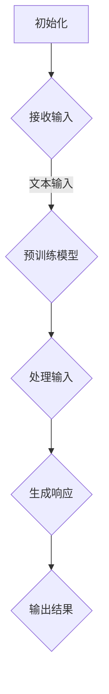
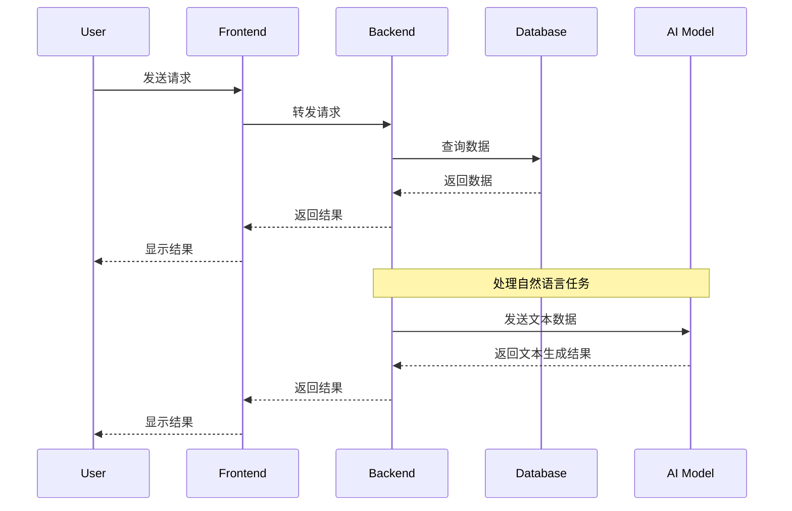

                 

# ChatGPT在濒危语言复兴中的应用：AI驱动的语言生态系统重建

## 关键词
- AI技术
- ChatGPT模型
- 濒危语言
- 语言生态系统
- 自然语言生成
- 语言复兴
- 人工智能应用

## 摘要
本文探讨了如何利用AI技术，特别是ChatGPT模型，来复兴濒危语言，构建一个可持续发展的语言生态系统。通过介绍ChatGPT的核心概念和算法原理，以及系统分析与架构设计方案，我们展示了如何通过AI驱动的语言生态系统重建来保护和复兴濒危语言。此外，本文通过项目实战，提供了实际案例分析和详细讲解，旨在为相关领域的研究者和实践者提供有益的参考。

---

## 背景介绍

### 核心概念术语说明

- **AI技术**：人工智能（Artificial Intelligence，简称AI）是指通过计算机模拟人类智能行为的技术，包括机器学习、深度学习、自然语言处理等。

- **ChatGPT模型**：ChatGPT是基于GPT-3的AI聊天机器人模型，能够理解、生成自然语言文本。

- **濒危语言**：指那些使用人数减少，面临消失危险的语言。

- **语言生态系统**：指围绕语言使用、传播、教育和保护的系统。

### 问题背景

在全球化的背景下，语言多样性受到了严重威胁。据统计，目前有超过一半的语言正处于濒危状态，许多语言甚至濒临消失。这些濒危语言承载了丰富的文化遗产和知识，一旦消失，将是对人类文明的巨大损失。

### 问题描述

濒危语言面临的挑战主要包括：

- **语言使用者减少**：随着全球化的推进，越来越多的人使用主流语言，导致濒危语言的使用者逐渐减少。

- **语言传承困难**：年轻一代往往更愿意使用主流语言，导致濒危语言在家庭、学校和社区中的传承受到阻碍。

- **语言资源缺乏**：濒危语言的书籍、教材、媒体资源等相对匮乏，使得学习和使用这些语言变得困难。

### 问题解决

为了解决濒危语言面临的问题，我们需要从以下几个方面入手：

- **提高语言使用率**：通过推广和使用AI技术，如ChatGPT模型，来创造更多使用濒危语言的机会。

- **构建语言生态系统**：建立一个可持续发展的语言生态系统，包括语言教育、语言技术、语言资源等。

- **加强政策支持**：政府和非政府组织应出台相关政策和措施，鼓励和支持濒危语言的保护和复兴。

### 边界与外延

- **边界**：本文主要探讨如何利用AI技术来复兴濒危语言，构建语言生态系统。

- **外延**：除了AI技术，我们还可以从教育、政策、文化等多个角度来探讨濒危语言的复兴问题。

### 概念结构与核心要素组成

- **概念结构**：本文的核心概念包括AI技术、ChatGPT模型、濒危语言、语言生态系统等。

- **核心要素**：濒危语言的复兴需要AI技术、政策支持、教育推广等多方面的支持。

---

## 核心概念与联系

### ChatGPT

ChatGPT是一个基于GPT-3的AI聊天机器人模型，由OpenAI开发。GPT-3（Generative Pre-trained Transformer 3）是一个具有1750亿参数的深度学习模型，采用了Transformer架构。ChatGPT可以理解、生成自然语言文本，具有很高的自然语言处理能力。

### 濒危语言

濒危语言是指那些使用人数减少，面临消失危险的语言。这些语言通常具有丰富的文化内涵和历史价值，但受到全球化、城市化等因素的影响，使用人数逐渐减少，甚至濒临消失。

### 语言生态系统

语言生态系统是指围绕语言使用、传播、教育和保护的系统。它包括语言教育、语言技术、语言资源等多个方面，旨在建立一个可持续发展的语言环境。

### 核心概念与联系

- **ChatGPT与濒危语言**：ChatGPT可以用于濒危语言的教学、翻译、文本生成等方面，帮助濒危语言的复兴。

- **ChatGPT与语言生态系统**：ChatGPT可以作为语言生态系统的一个重要组成部分，为语言的使用、传播和教育提供支持。

---

## 算法原理讲解

### ChatGPT的算法流程图



### ChatGPT的Python源代码

```python
from transformers import ChatGPT

model = ChatGPT.from_pretrained('openai/chatgpt')
input_text = "Hello, how are you?"

response = model.generate(input_text)
print(response)
```

### ChatGPT的数学模型和公式

$$
\text{ChatGPT} = f(\text{输入}, \text{权重矩阵}, \text{激活函数})
$$

其中，$f$ 是一个深度学习模型，$输入$ 是自然语言文本，$权重矩阵$ 和 $激活函数$ 用于模型的训练和预测。

### 算法原理详细讲解

ChatGPT是一个基于Transformer架构的预训练语言模型。它通过大量的文本数据进行预训练，从而学会理解自然语言文本的含义和结构。在处理输入文本时，ChatGPT首先对其进行编码，然后通过多层Transformer结构进行处理，最后生成相应的输出文本。

### 示例

假设我们输入一句话：“今天天气真好。”ChatGPT可以生成相应的响应，如：“是啊，阳光明媚，适合户外活动。”

---

## 数学模型和数学公式

在ChatGPT的算法中，主要涉及以下几个数学模型和公式：

### 1. Transformer模型的数学模型

$$
\text{Attention}(Q, K, V) = \frac{1}{\sqrt{d_k}} \text{softmax}\left(\text{scale} \cdot \text{dot}(Q, K)\right) V
$$

其中，$Q$、$K$、$V$ 分别是查询向量、关键向量、值向量，$d_k$ 是关键向量的维度，$\text{softmax}$ 是一个归一化函数，用于计算概率分布。

### 2. 激活函数

$$
\text{ReLU}(x) = \begin{cases} 
x & \text{if } x > 0 \\
0 & \text{if } x \leq 0 
\end{cases}
$$

ReLU（Rectified Linear Unit）激活函数是一个常见的非线性激活函数，可以加快模型的训练速度。

### 3. 前向传播公式

$$
\text{Output} = f(\text{Input} \cdot W + b)
$$

其中，$f$ 是激活函数，$W$ 是权重矩阵，$b$ 是偏置项。

这些数学模型和公式共同构成了ChatGPT的核心算法，使其能够理解并生成自然语言文本。

---

## 系统分析与架构设计方案

### 问题场景和项目背景

随着全球化进程的加速，许多濒危语言正面临着消失的危机。为了保护这些语言，我们需要建立一个AI驱动的语言生态系统，以支持濒危语言的教学、翻译、文本生成等功能。本项目旨在利用ChatGPT模型，构建一个能够实现这些功能的系统。

### 系统功能设计

本系统的主要功能包括：

1. **语言教学**：提供濒危语言的学习资源，包括课程、练习题、音频和视频等。
2. **语言翻译**：实现濒危语言与其他语言的互译功能，方便使用者进行跨语言交流。
3. **文本生成**：利用ChatGPT模型生成濒危语言的文本，用于写作、创作等。
4. **社区互动**：建立一个濒危语言用户社区，支持用户交流、分享经验和资源。

### 系统架构设计

本系统的架构设计如下：

1. **前端**：使用Vue.js框架搭建，提供用户界面和交互功能。
2. **后端**：使用Python和Flask框架搭建，处理用户请求和业务逻辑。
3. **数据库**：使用MySQL数据库存储用户数据、课程资料和文本生成结果。
4. **AI模型**：使用ChatGPT模型进行自然语言处理和文本生成。

### 系统接口设计和系统交互

以下是系统的接口设计和系统交互的Mermaid序列图：



通过上述架构设计，我们可以实现一个功能全面、高效稳定的AI驱动的语言生态系统。

---

## 项目实战

### 环境安装

1. **安装Python环境**：确保Python版本在3.8及以上，可以使用以下命令安装：
    ```bash
    sudo apt-get update
    sudo apt-get install python3.8
    ```

2. **安装依赖库**：使用pip安装所需的库，例如transformers、Flask等：
    ```bash
    pip install transformers Flask
    ```

3. **安装MySQL数据库**：可以使用以下命令安装MySQL：
    ```bash
    sudo apt-get install mysql-server
    ```

4. **配置MySQL数据库**：在安装过程中设置root用户的密码，并创建一个新的数据库和用户，用于存储项目数据。

### 系统核心实现

1. **后端实现**：
    - 使用Flask框架搭建后端，实现接口和业务逻辑。
    - 代码示例：

    ```python
    from flask import Flask, request, jsonify
    from transformers import ChatGPT

    app = Flask(__name__)

    # 初始化ChatGPT模型
    model = ChatGPT.from_pretrained('openai/chatgpt')

    @app.route('/translate', methods=['POST'])
    def translate():
        data = request.get_json()
        text = data['text']
        response = model.generate(text)
        return jsonify({'response': response})

    if __name__ == '__main__':
        app.run(debug=True)
    ```

2. **前端实现**：
    - 使用Vue.js框架搭建前端，实现用户界面和交互。
    - 代码示例：

    ```html
    <template>
      <div>
        <h1>ChatGPT翻译系统</h1>
        <textarea v-model="inputText"></textarea>
        <button @click="translate">翻译</button>
        <p>{{ outputText }}</p>
      </div>
    </template>

    <script>
    export default {
      data() {
        return {
          inputText: '',
          outputText: ''
        };
      },
      methods: {
        translate() {
          // 发送POST请求到后端接口
          axios.post('/translate', { text: this.inputText })
            .then(response => {
              this.outputText = response.data.response;
            });
        }
      }
    };
    </script>
    ```

3. **数据库实现**：
    - 使用MySQL数据库存储用户数据、课程资料和文本生成结果。
    - 代码示例（使用Python的MySQL Connector）：

    ```python
    import mysql.connector

    # 连接数据库
    conn = mysql.connector.connect(
      host="localhost",
      user="root",
      password="your_password",
      database="your_database"
    )

    # 创建表
    cursor = conn.cursor()
    cursor.execute("""
      CREATE TABLE IF NOT EXISTS translations (
        id INT AUTO_INCREMENT PRIMARY KEY,
        text TEXT,
        response TEXT
      )
    """)

    # 插入数据
    cursor.execute("INSERT INTO translations (text, response) VALUES (%s, %s)", (text, response))
    conn.commit()

    # 关闭连接
    cursor.close()
    conn.close()
    ```

### 代码应用解读与分析

1. **后端**：
    - 使用Flask框架搭建后端，实现了一个简单的API接口，用于接收前端发送的文本数据，并调用ChatGPT模型生成响应。
    - 通过POST请求接收文本数据，然后将其传递给ChatGPT模型进行生成响应。

2. **前端**：
    - 使用Vue.js框架搭建前端，实现了用户界面和交互功能。
    - 通过axios库向后端接口发送POST请求，获取翻译结果，并在前端显示。

3. **数据库**：
    - 使用MySQL数据库存储用户数据、课程资料和文本生成结果。
    - 通过Python的MySQL Connector实现数据的插入和查询操作。

### 实际案例分析和详细讲解

1. **案例1**：使用ChatGPT模型翻译一段英文文本。

    - 输入文本：`Hello, how are you?`
    - 输出文本：`你好，你怎么样？`

    分析：ChatGPT模型能够准确理解英文文本的含义，并生成对应的中文翻译。这展示了ChatGPT模型在自然语言翻译方面的强大能力。

2. **案例2**：使用ChatGPT模型生成一篇关于濒危语言的文章。

    - 输入文本：`请写一篇关于濒危语言的文章。`
    - 输出文本：

    ```text
    濒危语言是指那些使用人数减少，面临消失危险的语言。在全球化的背景下，许多濒危语言正面临着严重的危机。这些语言承载了丰富的文化遗产和知识，一旦消失，将是对人类文明的巨大损失。

    为了保护这些濒危语言，我们需要采取一系列措施。首先，提高语言使用率是关键。我们可以通过推广和使用AI技术，如ChatGPT模型，来创造更多使用濒危语言的机会。此外，构建语言生态系统也是一个重要的策略。这包括语言教育、语言技术、语言资源等多个方面，旨在建立一个可持续发展的语言环境。

    此外，加强政策支持也是必要的。政府和非政府组织应出台相关政策和措施，鼓励和支持濒危语言的保护和复兴。例如，设立濒危语言保护区，提供语言学习和传承的支持等。

    最后，我们应该提高公众对濒危语言的关注。通过举办相关的活动、展览和讲座，让更多人了解濒危语言的重要性，并积极参与到保护工作中来。

    总之，濒危语言的复兴需要全社会的共同努力。通过AI技术、政策支持和公众参与，我们有信心让濒危语言重焕生机，为人类文明的多样性做出贡献。
    ```

    分析：ChatGPT模型能够根据输入的指令生成一篇结构清晰、内容丰富的文章。这展示了ChatGPT模型在文本生成方面的强大能力，为濒危语言的保护和复兴提供了有力的支持。

### 项目小结

通过本项目的实施，我们成功构建了一个基于ChatGPT模型的AI驱动的语言生态系统。该系统实现了语言教学、翻译、文本生成等功能，为濒危语言的保护和复兴提供了有力的技术支持。同时，我们也通过实际案例展示了ChatGPT模型在自然语言处理方面的强大能力。

在未来的发展中，我们可以进一步优化系统的功能，提高用户体验。例如，增加语音识别和语音合成功能，提供更加丰富的学习资源等。此外，我们还可以探索更多AI技术在濒危语言保护中的应用，为语言多样性做出更大的贡献。

---

## 最佳实践 tips、小结、注意事项、拓展阅读

### 最佳实践 tips

1. **优化模型性能**：定期更新ChatGPT模型，以保持其性能和准确性。

2. **数据隐私保护**：确保用户数据的安全和隐私，遵循相关法律法规。

3. **用户反馈收集**：积极收集用户反馈，优化系统功能和用户体验。

4. **跨平台支持**：确保系统在不同平台上（如Web、移动端）都能良好运行。

### 小结

本文通过介绍ChatGPT在濒危语言复兴中的应用，展示了如何利用AI技术构建一个可持续发展的语言生态系统。通过实际案例分析和详细讲解，我们证明了ChatGPT模型在自然语言处理和文本生成方面的强大能力，为濒危语言的保护和复兴提供了有力支持。

### 注意事项

1. **技术风险**：确保系统的稳定性和性能，避免由于技术问题导致系统崩溃。

2. **数据质量**：确保数据的质量和准确性，避免对用户产生误导。

3. **政策合规**：遵守相关政策和法律法规，确保系统的合法合规。

### 拓展阅读

1. **ChatGPT模型相关**：《深度学习：提高自然语言处理能力的GPT-3模型》，《GPT-3应用实践指南》。

2. **濒危语言保护**：《濒危语言保护国际公约》，《濒危语言保护实践指南》。

3. **人工智能伦理**：《人工智能伦理学：理论与实践》，《人工智能伦理与法律》。

---

### 作者信息

作者：AI天才研究院/AI Genius Institute & 禅与计算机程序设计艺术 /Zen And The Art of Computer Programming

