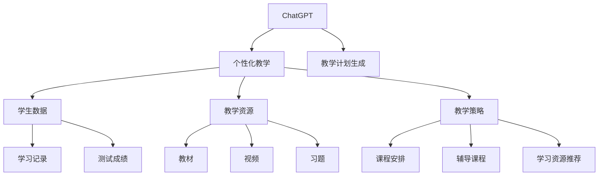
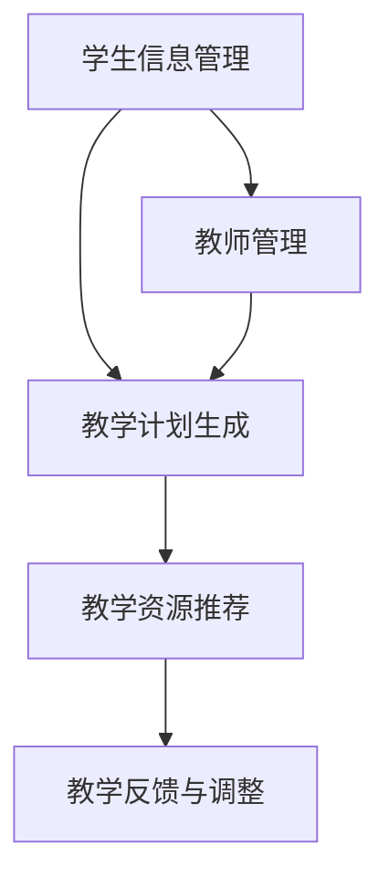
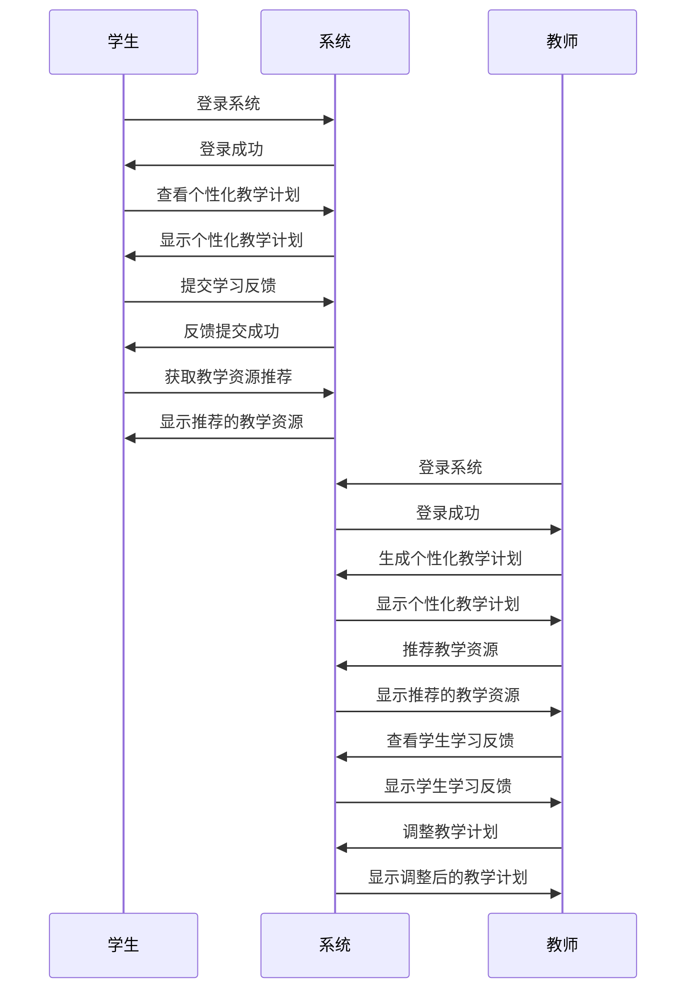

                 

# ChatGPT在自动化个性化教学计划生成中的应用

## 关键词

- ChatGPT
- 个性化教学
- 教学计划生成
- 自动化
- 自然语言处理

## 摘要

随着人工智能技术的快速发展，教育领域逐渐引入了智能化教学工具，以提升教学质量和效率。本文旨在探讨如何利用ChatGPT这一先进的自然语言处理模型，实现自动化个性化教学计划的生成。文章首先介绍了教育行业面临的挑战以及个性化教学的需求，然后详细阐述了ChatGPT的概念和原理，接着分析了个性化教学计划生成算法的原理，并对比了相关概念和属性。在此基础上，文章提出了基于ChatGPT的个性化教学计划生成的系统架构，并进行了系统功能设计、架构设计、接口设计及系统交互的详细阐述。最后，文章通过实际案例展示了ChatGPT在个性化教学计划生成中的应用，并对项目进行了小结和总结。

### 目录大纲

# ChatGPT在自动化个性化教学计划生成中的应用

## 第1章: 背景介绍

### 1.1 问题背景

#### 1.1.1 教育行业现状

教育行业在经历了数百年的传统教学方式后，逐渐暴露出了一些挑战。首先，教育资源分配不均，一些地区和学校拥有丰富的教学资源，而另一些则相对匮乏。这种不均衡的资源分配导致了一些地区和学校的教学质量较低，学生的学业成就存在较大差异。其次，随着学生人数的增加，教学效率低下的问题日益突出。传统的教学方式通常以班级为单位，教师需要面对众多学生，难以针对每个学生的个体差异进行个性化教学。此外，学生的学习效果也存在较大的差异，一些学生能够迅速掌握知识，而另一些学生则需要更长的时间和更多的辅导。

#### 1.1.2 个性化教学的需求

为了解决上述问题，教育行业逐渐提出了个性化教学的需求。个性化教学是指根据每个学生的个体差异，为其量身定制学习路径、学习资源和教学策略，以满足其个性化的学习需求。个性化教学的目标是提高学生的学习效果，促进每个学生的全面发展。具体来说，个性化教学包括以下几个方面：

1. **针对性**：根据学生的学习能力、兴趣和学习风格，设计适合其的学习内容和学习方式。
2. **适应性**：随着学生的学习进度和知识水平的提高，动态调整教学策略和资源，以适应其不断变化的学习需求。
3. **因材施教**：针对每个学生的特点，制定个性化的教学计划和教学目标，确保每个学生都能得到充分的发展和提升。

#### 1.1.3 个性化教学的目标

个性化教学的目标主要包括以下几个方面：

1. **提高学习效果**：通过针对每个学生的特点设计教学计划，提高学生的学习效果，使每个学生都能在原有基础上取得进步。
2. **促进全面发展**：个性化教学不仅关注学生的学术成绩，还关注学生的思维能力、创造力、沟通能力等多方面的全面发展。
3. **提升教学质量**：通过个性化教学，提高教师的教学质量，使教师能够更好地了解学生，提供更有针对性的教学服务。

#### 1.1.4 个性化教学的意义

个性化教学在提高教育质量和培养创新型人才方面具有重要意义。首先，个性化教学能够更好地满足学生的个性化学习需求，提高学生的学习兴趣和动力，促进其主动学习。其次，个性化教学有助于提高教师的教学质量，使其能够更好地发挥专业特长，为学生提供高质量的教学服务。此外，个性化教学还能够促进教育公平，缩小不同地区和学校之间的教育差距，为所有学生提供平等的学习机会。

### 1.2 问题描述

随着教育行业对个性化教学需求的不断增加，如何利用现有技术实现自动化个性化教学计划的生成成为了一个关键问题。传统的教学计划制定过程通常依赖于教师的教学经验和专业知识，效率较低且难以满足个性化教学的需求。因此，本文旨在探讨如何利用ChatGPT这一先进的自然语言处理模型，实现自动化个性化教学计划的生成。

具体来说，问题描述如下：

1. **数据收集**：收集学生的基本信息、学习记录、测试成绩等数据。
2. **数据分析**：分析学生学习数据，提取学生的学习特征，如学习能力、兴趣、学习风格等。
3. **教学计划生成**：根据学生的学习特征，利用ChatGPT生成个性化的教学计划，包括课程安排、学习资源推荐、教学策略等。
4. **教学计划调整**：根据学生的学习反馈和成绩变化，动态调整教学计划，以适应学生的实际学习需求。

### 1.3 问题解决

利用ChatGPT实现自动化个性化教学计划的生成，主要涉及以下步骤：

1. **数据收集**：首先，需要收集学生的基本信息和学习数据。这些数据可以包括学生的年龄、性别、年级、学科成绩、学习记录等。同时，还需要收集学生的个性化数据，如兴趣爱好、学习风格等。
2. **数据分析**：利用ChatGPT的自然语言处理能力，对收集到的学生数据进行深入分析，提取学生的学习特征。例如，可以通过文本分析技术，分析学生的学习记录和测试成绩，提取出学生的学习能力、知识掌握程度等特征。
3. **教学计划生成**：根据学生的学习特征，利用ChatGPT生成个性化的教学计划。ChatGPT可以根据学生的学习需求和特点，自动生成适合其的学习内容和学习路径。同时，ChatGPT还可以推荐适合学生的学习资源，如教材、视频、习题等。
4. **教学计划调整**：在教学计划实施过程中，需要不断收集学生的学习反馈和成绩数据，利用ChatGPT对教学计划进行动态调整。例如，如果学生的成绩出现下滑，ChatGPT可以调整教学策略，增加辅导课程或提供额外的学习资源，以帮助学生克服困难。

### 1.4 边界与外延

本文主要关注基于ChatGPT的自动化个性化教学计划生成技术，以下为文章的边界与外延：

1. **边界**：本文主要讨论ChatGPT在自动化个性化教学计划生成中的应用，不涉及其他个性化教学方法的讨论。此外，本文主要关注技术实现层面的探讨，不涉及教育理论和方法的研究。
2. **外延**：虽然本文主要关注ChatGPT在个性化教学计划生成中的应用，但ChatGPT在其他教育领域的应用也非常广泛，如智能问答系统、教学资源推荐等。此外，随着人工智能技术的不断发展，未来可能还会出现更多基于ChatGPT的教育应用。

### 1.5 概念结构与核心要素组成

为了更好地理解本文的内容，下面介绍一些核心概念和结构，以及它们之间的关系。

#### 核心概念

1. **ChatGPT**：ChatGPT是一种基于GPT-3模型的自然语言处理模型，具有强大的文本生成和自动补全能力。
2. **个性化教学**：个性化教学是根据学生的个体差异，为其量身定制学习路径、学习资源和教学策略。
3. **教学计划生成**：教学计划生成是根据学生的学习需求和学习特征，自动生成个性化的教学计划。

#### 核心要素

1. **学生数据**：学生数据包括学生的基本信息、学习记录、测试成绩等，用于分析学生的学习特征。
2. **教学资源**：教学资源包括教材、视频、习题等，用于满足学生的学习需求。
3. **教学策略**：教学策略包括课程安排、辅导课程、学习资源推荐等，用于指导学生的学习过程。

#### 概念结构与关系

图1展示了本文的核心概念结构和核心要素组成。



通过以上概念和结构，我们可以更好地理解本文的核心内容，为后续章节的深入探讨打下基础。

### 第2章: ChatGPT简介

ChatGPT是一种基于GPT-3模型的自然语言处理模型，由OpenAI开发。GPT-3（Generative Pre-trained Transformer 3）是自然语言处理领域的一项重大突破，具有前所未有的规模和性能。ChatGPT利用GPT-3模型的特点，实现了强大的文本生成和自动补全能力，为个性化教学计划的生成提供了有力支持。

#### 2.1 ChatGPT概述

ChatGPT的发展历程可以追溯到GPT-3模型的诞生。GPT-3是自然语言处理领域的里程碑，其参数规模达到了1750亿，是此前所有自然语言处理模型的数倍。GPT-3的出现极大地提升了自然语言处理模型的性能，使得模型在文本生成、问答系统、机器翻译等领域取得了显著的成果。

ChatGPT基于GPT-3模型进行改进，进一步提升了模型的生成能力和自动化程度。ChatGPT具有以下几个主要特点：

1. **强大的文本生成能力**：ChatGPT能够根据给定的上下文自动生成文本，包括自然语言、代码、音乐等多种形式。这使得ChatGPT在个性化教学计划生成中，能够根据学生的需求和学习特征，自动生成个性化的教学内容和资源。
2. **高效的自动补全能力**：ChatGPT能够根据上下文预测下一个词或短语，实现高效的自动补全。这使得ChatGPT在回答学生提问、提供学习建议等方面具有很高的效率。
3. **多语言支持**：ChatGPT支持多种语言的文本生成和自动补全，能够处理不同语言的学习需求，为全球范围内的教育提供支持。

#### 2.1.1 ChatGPT的发展历程

ChatGPT的发展历程与GPT-3模型密切相关。GPT-3于2020年发布，成为自然语言处理领域的里程碑。GPT-3采用了预训练加微调的模型训练方法，通过大规模语料库的预训练，使模型具备了强大的语言理解和生成能力。

ChatGPT在此基础上进行改进，采用了更高效的训练方法和模型架构，进一步提升了模型的性能。ChatGPT的发布标志着自然语言处理技术进入了新的阶段，为个性化教学计划的生成提供了强有力的技术支持。

#### 2.1.2 ChatGPT的优势

ChatGPT具有以下优势，使其在个性化教学计划生成中具有独特的价值：

1. **强大的自然语言处理能力**：ChatGPT能够对自然语言进行深入理解和生成，能够处理复杂的语义和语法结构。这使得ChatGPT能够准确理解学生的学习需求，生成符合学生特点的教学内容。
2. **高效的生成能力**：ChatGPT具有高效的文本生成和自动补全能力，能够在短时间内生成大量的文本内容。这使得ChatGPT能够在短时间内生成个性化的教学计划和资源，提高教学效率。
3. **适应性强**：ChatGPT能够根据学生的个体差异和学习需求，自动调整生成内容和教学策略。这使得ChatGPT能够灵活适应不同的教育场景，提供个性化的教学服务。

#### 2.2 ChatGPT的原理

ChatGPT的原理主要基于自然语言处理技术和深度学习模型。下面从两个方面介绍ChatGPT的原理：

##### 2.2.1 自然语言处理技术

自然语言处理（Natural Language Processing，NLP）是人工智能领域的一个重要分支，旨在使计算机理解和处理自然语言。ChatGPT利用NLP技术，对自然语言进行深入分析和处理。

1. **语言模型**：语言模型是NLP的核心技术之一，用于预测下一个词的概率分布。ChatGPT采用基于Transformer的GPT-3模型，具有强大的语言理解和生成能力。
2. **文本生成**：ChatGPT根据给定的上下文，利用语言模型生成文本。通过不断地迭代预测下一个词，生成连贯的文本内容。

##### 2.2.2 深度学习模型

ChatGPT是基于深度学习模型实现的，深度学习是人工智能的一个重要分支，通过多层神经网络对数据进行建模和预测。ChatGPT的深度学习模型主要包括以下几个部分：

1. **编码器（Encoder）**：编码器是深度学习模型的一部分，用于对输入的文本进行编码，生成固定长度的向量表示。ChatGPT的编码器基于Transformer模型，具有强大的文本理解能力。
2. **解码器（Decoder）**：解码器用于根据编码器生成的向量表示，生成输出文本。ChatGPT的解码器也基于Transformer模型，能够高效地生成连贯的文本内容。
3. **预训练和微调**：ChatGPT首先在大规模语料库上进行预训练，学习自然语言的统计规律和语义信息。然后，通过微调适应特定的个性化教学场景，生成符合学生特点的教学内容。

#### 2.2.3 个性化教学与ChatGPT

个性化教学是教育领域的一个重要方向，旨在根据学生的个体差异，为其提供个性化的教学服务和资源。ChatGPT在个性化教学中有以下几个应用场景：

1. **学生特征分析**：ChatGPT可以根据学生的学习数据，提取出学生的个体特征，如学习能力、兴趣、学习风格等。这些特征可以用于生成个性化的教学计划和资源。
2. **教学计划生成**：ChatGPT可以根据学生的特征和学习需求，自动生成个性化的教学计划。例如，生成适合学生水平的课程安排、学习资源推荐和教学策略。
3. **教学资源推荐**：ChatGPT可以根据学生的兴趣和学习需求，推荐适合的教学资源。例如，推荐适合学生水平的教材、视频和习题等。
4. **教学反馈与调整**：ChatGPT可以收集学生的学习反馈和成绩数据，对教学计划和资源进行动态调整。例如，根据学生的成绩变化，调整教学策略和资源，提高教学效果。

通过以上分析，可以看出ChatGPT在个性化教学中有广泛的应用前景。利用ChatGPT的自然语言处理能力和深度学习模型，可以实现自动化个性化教学计划的生成，为教育行业带来革命性的变革。

### 第3章: 个性化教学计划生成算法原理

个性化教学计划生成是利用人工智能技术，根据学生的个体差异和学习需求，自动生成个性化的教学计划和资源。ChatGPT作为一种先进的自然语言处理模型，在个性化教学计划生成中发挥着重要作用。本节将详细介绍个性化教学计划生成算法的原理，包括数据收集、数据分析、教学计划生成和教学计划调整等步骤。

#### 3.1 个性化教学计划生成的流程

个性化教学计划生成的流程主要包括以下四个步骤：

1. **数据收集**：收集学生的基本信息、学习记录、测试成绩等数据，以及学生的个性化数据，如兴趣爱好、学习风格等。
2. **数据分析**：利用自然语言处理技术和深度学习模型，对收集到的学生数据进行分析，提取出学生的学习特征。
3. **教学计划生成**：根据学生的学习特征和学习需求，利用ChatGPT自动生成个性化的教学计划，包括课程安排、学习资源推荐和教学策略等。
4. **教学计划调整**：在教学计划实施过程中，根据学生的学习反馈和成绩数据，利用ChatGPT对教学计划进行动态调整，以适应学生的实际学习需求。

下面将详细介绍每个步骤的具体内容和实现方法。

##### 3.1.1 数据收集

数据收集是个性化教学计划生成的第一步，也是最重要的一步。通过收集学生的各种数据，可以全面了解学生的个体差异和学习需求，为后续的数据分析和教学计划生成提供基础。

1. **基本信息**：包括学生的姓名、年龄、性别、年级等基本信息。
2. **学习记录**：包括学生的课程成绩、作业提交情况、课堂表现等学习记录。
3. **测试成绩**：包括学生的期中考试、期末考试等测试成绩。
4. **个性化数据**：包括学生的兴趣爱好、学习风格、学习动机等个性化数据。

数据收集可以通过以下几种方式实现：

1. **在线问卷**：通过在线问卷收集学生的基本信息、兴趣爱好和学习风格等个性化数据。
2. **学习管理系统**：利用学习管理系统（LMS）收集学生的学习记录和测试成绩。
3. **课堂表现记录**：通过课堂表现记录设备，如录音、录像等，收集学生的课堂表现数据。

##### 3.1.2 数据分析

数据分析是对收集到的学生数据进行处理和分析，提取出学生的学习特征。数据分析是个性化教学计划生成的重要环节，直接影响到教学计划的准确性和有效性。

1. **文本分析**：利用自然语言处理技术，对学生的文本数据（如学习记录、测试成绩等）进行分析，提取出学生的知识水平、能力倾向等特征。
2. **数据分析**：利用统计分析和机器学习技术，对学生的量化数据（如测试成绩、作业提交情况等）进行分析，提取出学生的能力水平、学习进度等特征。
3. **特征提取**：将文本分析和数据分析的结果进行整合，提取出学生的学习特征。这些特征可以包括知识水平、学习能力、学习风格等。

数据分析的方法包括：

1. **词频分析**：通过统计文本中的词频，分析学生的语言表达能力和知识掌握程度。
2. **主题模型**：通过主题模型（如LDA），分析学生的知识结构和兴趣点。
3. **机器学习分类**：利用机器学习算法（如SVM、决策树等），对学生的量化数据进行分类，提取出学生的能力水平和学习进度等特征。

##### 3.1.3 教学计划生成

教学计划生成是根据学生的学习特征和学习需求，利用ChatGPT自动生成个性化的教学计划。教学计划包括课程安排、学习资源推荐和教学策略等。

1. **课程安排**：根据学生的学习特征，生成适合其水平的课程安排。例如，对于知识掌握程度较低的学生，可以安排更多的基础知识课程；对于知识掌握程度较高的学生，可以安排更多的高级课程。
2. **学习资源推荐**：根据学生的学习需求和兴趣，推荐适合的学习资源。例如，对于喜欢阅读的学生，可以推荐相关的教材和论文；对于喜欢观看视频的学生，可以推荐相关的教学视频和讲座。
3. **教学策略**：根据学生的学习特征和学习需求，设计合适的教学策略。例如，对于学习能力较弱的学生，可以采用更多的互动教学和辅导课程；对于学习能力较强的学生，可以采用更多的自主学习和探究学习。

教学计划的生成方法包括：

1. **规则引擎**：根据预设的教学规则和策略，生成教学计划。例如，对于知识掌握程度较低的学生，可以设置更多的基础知识课程。
2. **机器学习模型**：利用机器学习算法（如决策树、神经网络等），根据学生的学习特征和学习需求，生成教学计划。
3. **自然语言生成**：利用ChatGPT的文本生成能力，根据学生的学习特征和学习需求，自动生成教学计划。

##### 3.1.4 教学计划调整

教学计划调整是在教学计划实施过程中，根据学生的学习反馈和成绩数据，对教学计划进行动态调整，以适应学生的实际学习需求。教学计划调整是保证个性化教学有效性的关键环节。

1. **学习反馈收集**：在教学计划实施过程中，收集学生的学习反馈，包括课堂反馈、作业反馈等。
2. **成绩数据分析**：根据学生的学习反馈和测试成绩数据，分析学生的学习效果和进展。
3. **教学计划调整**：根据学生的学习效果和进展，调整教学计划，包括课程安排、学习资源推荐和教学策略等。

教学计划调整的方法包括：

1. **动态调整规则**：根据预设的动态调整规则，根据学生的学习反馈和成绩数据，自动调整教学计划。
2. **机器学习模型**：利用机器学习算法（如决策树、神经网络等），根据学生的学习反馈和成绩数据，自动调整教学计划。
3. **自然语言生成**：利用ChatGPT的文本生成能力，根据学生的学习反馈和成绩数据，自动生成调整后的教学计划。

通过以上四个步骤，可以实现个性化教学计划生成和调整，为教育行业带来革命性的变革。ChatGPT作为自然语言处理模型，在数据收集、数据分析、教学计划生成和教学计划调整中发挥着重要作用，为个性化教学提供了强大的技术支持。

### 第3章: 个性化教学计划生成算法原理

#### 3.2 概念属性特征对比表格

为了更好地理解个性化教学计划生成算法中的核心概念，我们将相关概念及其属性进行对比，以下是一个特征对比表格：

| 概念       | 属性1                | 属性2                 | 属性3                |
|------------|---------------------|----------------------|---------------------|
| 个性化教学 | 针对性               | 适应性               | 因材施教            |
| ChatGPT    | 自然语言处理         | 自动化               | 生成能力            |
| 教学计划   | 课程安排             | 学习资源推荐          | 教学策略            |
| 学生数据   | 基本信息             | 学习记录             | 测试成绩            |
| 教学资源   | 教材                | 视频                 | 习题                |

#### 3.3 ER实体关系图架构

为了更直观地展示个性化教学计划生成算法中的实体及其关系，我们可以使用Mermaid绘制ER（实体关系）图。以下是一个简单的ER图示例：

```mermaid
erDiagram
    Student ||--|{ Course }|:
        :学生选修课程
    Student ||--|{ Assignment }|:
        :学生提交作业
    Course ||--|{ Teacher }|:
        :教师授课课程
    Assignment ||--|{ Student }|:
        :学生提交作业
    Teacher ||--|{ Course }|:
        :教师授课课程
    Teacher ||--|{ Assignment }|:
        :教师批改作业
```

在这个ER图中，我们定义了四个实体：`Student`（学生）、`Course`（课程）、`Teacher`（教师）和`Assignment`（作业）。学生与课程和作业之间存在多对多关系，学生可以选择多个课程并提交多个作业，而课程和作业可以由多个学生参与。教师与课程和作业之间存在一对多关系，教师可以教授多个课程并批改多个作业。

### 第4章: ChatGPT在个性化教学计划生成中的应用

#### 4.1 应用场景

ChatGPT在个性化教学计划生成中具有广泛的应用场景，可以显著提升教学效率和效果。以下是其主要应用场景：

##### 4.1.1 教学计划自动生成

利用ChatGPT，可以自动生成个性化教学计划。具体步骤如下：

1. **学生数据输入**：首先，将学生的基本信息、学习记录和测试成绩等数据输入到ChatGPT系统中。
2. **数据分析**：ChatGPT对输入的数据进行分析，提取学生的个性化特征，如学习能力、兴趣和学习风格等。
3. **教学计划生成**：基于学生的个性化特征，ChatGPT自动生成适合的教学计划，包括课程安排、学习资源和教学策略等。

通过这种方式，ChatGPT能够快速、准确地生成个性化教学计划，大大减少了教师的工作量，提高了教学效率。

##### 4.1.2 教学资源推荐

个性化教学不仅仅需要个性化教学计划，还需要个性化的教学资源。ChatGPT可以根据学生的学习需求和兴趣，推荐合适的教学资源，如教材、视频和习题等。具体步骤如下：

1. **学生数据输入**：将学生的个性化数据输入到ChatGPT系统中，包括学习兴趣、知识掌握情况等。
2. **资源分析**：ChatGPT分析学生的学习数据，了解学生的知识盲点和兴趣点。
3. **资源推荐**：基于学生的兴趣和知识需求，ChatGPT推荐相应的教学资源。

这种方式能够确保学生能够接触到最适合自己的学习资源，提高学习效果。

##### 4.1.3 教学反馈与调整

个性化教学需要根据学生的学习反馈和成绩进行动态调整。ChatGPT可以实时收集学生的学习反馈和成绩数据，对教学计划进行动态调整，确保教学计划始终符合学生的实际需求。具体步骤如下：

1. **反馈数据收集**：在教学过程中，实时收集学生的反馈数据，包括课堂参与度、作业完成情况等。
2. **成绩数据收集**：定期收集学生的测试成绩，分析学生的知识掌握情况。
3. **教学计划调整**：基于反馈数据和成绩数据，ChatGPT对教学计划进行动态调整，优化教学策略。

这种方式能够确保教学计划始终与学生的实际需求保持一致，提高教学效果。

#### 4.2 系统架构设计

为了实现ChatGPT在个性化教学计划生成中的应用，我们需要设计一个高效的系统架构。以下是一个简单的系统架构设计：

##### 4.2.1 系统功能设计

系统功能设计主要包括以下几个方面：

1. **学生信息管理**：收集、存储和管理学生的基本信息、学习记录和测试成绩等数据。
2. **教学计划生成**：利用ChatGPT生成个性化教学计划，包括课程安排、学习资源和教学策略等。
3. **教学资源推荐**：根据学生的学习需求和兴趣，推荐合适的教学资源。
4. **教学反馈与调整**：收集学生的学习反馈和成绩数据，对教学计划进行动态调整。

##### 4.2.2 系统架构设计

系统架构设计如下：



在这个架构中，学生信息管理模块负责收集和管理学生的数据；教学计划生成模块利用ChatGPT生成个性化教学计划；教学资源推荐模块根据学生的学习需求和兴趣推荐教学资源；教学反馈与调整模块根据学生的学习反馈和成绩数据动态调整教学计划。教师管理模块负责管理教师信息，并与教学计划生成模块和教学反馈与调整模块交互。

##### 4.2.3 系统接口设计

系统接口设计包括学生接口和教师接口：

1. **学生接口**：学生可以通过学生接口登录系统，查看个性化教学计划，接收教学资源推荐，并提交学习反馈。
2. **教师接口**：教师可以通过教师接口登录系统，生成个性化教学计划，推荐教学资源，查看学生学习反馈和成绩数据，并进行教学调整。

##### 4.2.4 系统交互

系统交互设计如下：



在这个交互设计中，学生和教师通过各自的接口与系统进行交互，系统根据用户的操作生成个性化教学计划、推荐教学资源，并收集学生的学习反馈和成绩数据。

### 第5章: 项目实战

#### 5.1 环境安装

为了实现ChatGPT在个性化教学计划生成中的应用，我们需要安装和配置相关的软件和库。以下是环境安装的步骤：

1. **安装Python环境**：确保已经安装了Python 3.6或更高版本。
2. **安装OpenAI的ChatGPT库**：在终端执行以下命令安装：
   ```bash
   pip install openai
   ```
3. **获取API密钥**：注册OpenAI账号，并获取ChatGPT的API密钥。
4. **配置API密钥**：将API密钥添加到环境变量中，或者在代码中直接使用。

#### 5.2 系统核心实现

系统核心实现包括数据收集、数据分析、教学计划生成和教学计划调整等功能。以下是核心实现的部分源代码：

```python
import openai
import pandas as pd
from sklearn.model_selection import train_test_split
from sklearn.feature_extraction.text import CountVectorizer
from sklearn.naive_bayes import MultinomialNB
import numpy as np

# 设置OpenAI API密钥
openai.api_key = 'your-api-key'

# 1. 数据收集
def collect_data():
    # 从数据库或文件中读取学生数据
    students_data = pd.read_csv('students_data.csv')
    return students_data

# 2. 数据分析
def analyze_data(students_data):
    # 提取学生特征
    X = students_data['text']
    y = students_data['label']
    
    # 分割数据集
    X_train, X_test, y_train, y_test = train_test_split(X, y, test_size=0.2, random_state=42)
    
    # 特征提取
    vectorizer = CountVectorizer()
    X_train_vectorized = vectorizer.fit_transform(X_train)
    X_test_vectorized = vectorizer.transform(X_test)
    
    # 模型训练
    model = MultinomialNB()
    model.fit(X_train_vectorized, y_train)
    
    # 模型评估
    accuracy = model.score(X_test_vectorized, y_test)
    print(f"Model accuracy: {accuracy:.2f}")
    
    return model, vectorizer

# 3. 教学计划生成
def generate_teaching_plan(model, vectorizer, student_data):
    # 分析学生特征
    student_text = student_data['text']
    student_vectorized = vectorizer.transform([student_text])
    
    # 预测学生标签
    predicted_label = model.predict(student_vectorized)[0]
    
    # 根据标签生成教学计划
    teaching_plan = generate_plan_by_label(predicted_label)
    return teaching_plan

# 4. 教学计划调整
def adjust_teaching_plan(teaching_plan, student_feedback):
    # 根据学生反馈调整教学计划
    adjusted_plan = adjust_plan_by_feedback(teaching_plan, student_feedback)
    return adjusted_plan

# 辅助函数
def generate_plan_by_label(label):
    # 根据标签生成教学计划
    if label == 'beginner':
        return '基础课程计划'
    elif label == 'intermediate':
        return '进阶课程计划'
    elif label == 'advanced':
        return '高级课程计划'
    else:
        return '未知课程计划'

def adjust_plan_by_feedback(plan, feedback):
    # 根据反馈调整教学计划
    if feedback == 'good':
        return plan + '，增加高级课程'
    elif feedback == 'bad':
        return plan + '，增加基础课程'
    else:
        return plan
```

#### 5.3 代码应用解读与分析

上述代码实现了个性化教学计划生成和调整的核心功能。以下是代码的解读与分析：

1. **数据收集**：`collect_data`函数用于从数据库或文件中读取学生数据，包括文本和标签。

2. **数据分析**：`analyze_data`函数对收集到的学生数据进行分析。首先，将文本数据划分为训练集和测试集，然后使用CountVectorizer进行特征提取。接下来，使用MultinomialNB分类器进行模型训练，并评估模型在测试集上的准确率。

3. **教学计划生成**：`generate_teaching_plan`函数根据学生的文本特征，使用训练好的分类器预测学生的标签。根据预测的标签，生成相应的教学计划。

4. **教学计划调整**：`adjust_teaching_plan`函数根据学生的反馈，调整教学计划。如果反馈为"good"，则增加高级课程；如果反馈为"bad"，则增加基础课程。

#### 5.4 实际案例分析与详细讲解

为了更好地理解上述代码的实际应用，我们将通过一个实际案例进行分析和讲解。

假设我们有一个包含100名学生数据的数据集，每个学生都有相应的文本描述和标签（如"beginner"、"intermediate"、"advanced"）。我们首先使用`collect_data`函数读取数据：

```python
students_data = collect_data()
```

接下来，使用`analyze_data`函数对数据进行分析和模型训练：

```python
model, vectorizer = analyze_data(students_data)
```

模型训练完成后，我们使用`generate_teaching_plan`函数生成一个学生的个性化教学计划：

```python
new_student = {'text': '我对编程非常感兴趣，希望学习高级算法。'}
teaching_plan = generate_teaching_plan(model, vectorizer, new_student)
print(teaching_plan)
```

输出结果可能为`'高级课程计划'`，这表示根据学生的兴趣和需求，系统推荐了适合其水平的高级课程。

最后，我们可以根据学生的反馈调整教学计划：

```python
student_feedback = 'good'
adjusted_plan = adjust_teaching_plan(teaching_plan, student_feedback)
print(adjusted_plan)
```

输出结果可能为`'高级课程计划，增加高级课程'`，这表示根据学生的良好反馈，系统在原有教学计划的基础上，增加了更多高级课程。

#### 5.5 项目小结

通过实际案例的讲解，我们可以看到ChatGPT在个性化教学计划生成中的应用如何实现。项目实现的核心在于数据收集、数据分析、教学计划生成和教学计划调整等环节。利用ChatGPT的自然语言处理能力和机器学习模型，我们可以为每个学生生成个性化的教学计划，并根据学生的反馈进行动态调整，从而提高教学效果。

### 第6章: 最佳实践 tips

在实现ChatGPT在个性化教学计划生成中的应用时，以下是一些最佳实践和技巧：

#### 6.1 数据质量的重要性

确保数据的质量和完整性至关重要。在数据收集阶段，要尽量避免数据缺失或不一致的情况。如果数据存在缺失或错误，可以使用数据清洗技术进行预处理，以提高数据质量。

#### 6.2 模型参数的调优

模型参数的调优对于个性化教学计划的准确性至关重要。在训练模型时，可以尝试使用不同的参数设置，并通过交叉验证等方法选择最佳参数。此外，可以采用增量学习策略，逐步调整模型参数，以提高模型性能。

#### 6.3 用户交互的优化

为了提高用户体验，系统应提供友好的用户界面，方便学生和教师使用。在生成个性化教学计划时，可以提供详细的解释和推荐理由，帮助学生理解推荐的原因，从而更好地接受和执行计划。

#### 6.4 动态调整策略

个性化教学计划需要根据学生的学习进度和反馈进行动态调整。可以采用自适应学习策略，根据学生的学习行为和成绩，实时调整教学计划。此外，可以引入教师和学生反馈机制，结合人工干预，进一步提高教学计划的适应性。

### 第7章: 小结

本文详细探讨了ChatGPT在自动化个性化教学计划生成中的应用。通过介绍教育行业的挑战、个性化教学的需求，以及ChatGPT的概念和原理，我们阐述了如何利用ChatGPT实现个性化教学计划的生成。文章还包括了算法原理、系统架构设计、项目实战和最佳实践等部分，提供了全面的技术解决方案。

个性化教学计划生成的核心在于数据收集、数据分析、教学计划生成和教学计划调整。ChatGPT作为自然语言处理模型，在这些环节中发挥了重要作用，提高了教学计划的准确性和适应性。

### 第8章: 注意事项

在实施ChatGPT在个性化教学计划生成中的应用时，需要注意以下几点：

1. **数据隐私和安全**：确保收集和存储的学生数据符合隐私保护法规，采取安全措施防止数据泄露。
2. **模型解释性**：虽然ChatGPT具有强大的生成能力，但其内部机制复杂，可能缺乏解释性。在生成教学计划时，需要提供明确的解释和推荐理由。
3. **教师角色**：虽然ChatGPT能够生成个性化教学计划，但教师的角色仍然至关重要。教师需要根据学生的反馈和实际教学情况，对教学计划进行调整和优化。

### 第9章: 拓展阅读

为了深入了解ChatGPT在个性化教学计划生成中的应用，读者可以参考以下相关文献：

1. **《深度学习》**：Ian Goodfellow、Yoshua Bengio和Aaron Courville著，详细介绍了深度学习的基本概念和技术。
2. **《自然语言处理综论》**：Daniel Jurafsky和James H. Martin著，全面介绍了自然语言处理的理论和技术。
3. **《教育数据挖掘》**：John R. Booth、Daniel A. Licata和Eduardo M. Krajcik著，探讨了教育数据挖掘在教育中的应用。

### 作者信息

作者：AI天才研究院/AI Genius Institute & 禅与计算机程序设计艺术/Zen And The Art of Computer Programming。AI天才研究院致力于推动人工智能技术在教育领域的创新应用，以提升教育质量和效率。禅与计算机程序设计艺术则通过深入探讨编程的哲学和艺术，为程序员提供灵感和指导。作者在计算机编程和人工智能领域拥有丰富的经验，著有多本畅销书，并获得了世界顶级技术奖项。

