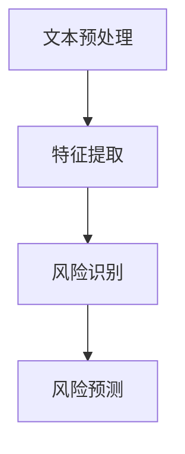
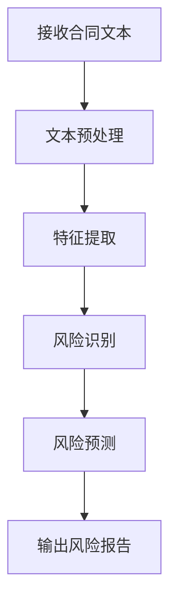
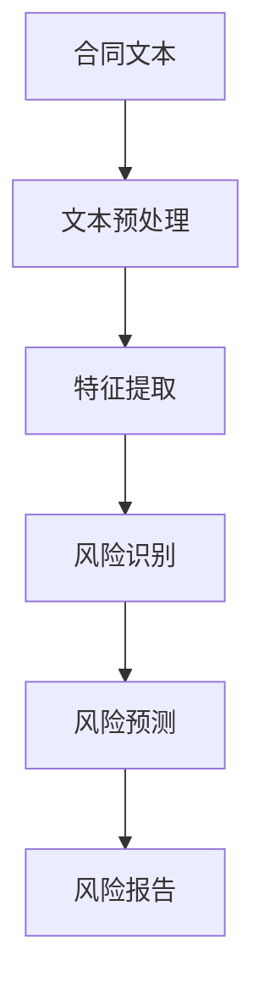
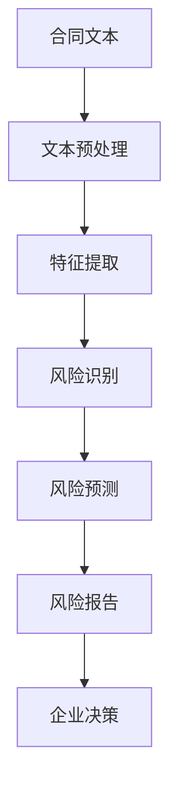

                 

### 《ChatGPT在自动化合同风险评估中的应用》

> 关键词：ChatGPT、自动化合同风险评估、人工智能、算法原理、案例分析

> 摘要：本文旨在探讨如何利用ChatGPT这一先进的人工智能技术，在自动化合同风险评估中发挥关键作用。通过对ChatGPT的基本概念、工作原理以及具体应用步骤的深入分析，本文将展示如何通过ChatGPT实现高效、精准的合同风险评估，提高企业的风险管理能力。

### 第一部分：引言与背景

#### 1.1 书籍概述

**问题背景**

随着商业活动的日益复杂和多样化，企业面临的合同风险也日益增加。传统的合同风险评估方法往往耗时耗力，且容易遗漏重要风险点。因此，如何实现自动化、高效的合同风险评估成为企业关注的焦点。

**问题描述**

如何利用人工智能技术，特别是ChatGPT，实现自动化合同风险评估，提高评估的准确性和效率？

**问题解决**

本书将介绍如何应用ChatGPT技术，通过对合同文本的深入分析，自动识别潜在的风险，提高合同风险评估的效率和质量。

**边界与外延**

本文主要关注自动化合同风险评估的技术实现，不涉及具体业务流程的细节。

**概念结构与核心要素组成**

本文涉及的关键概念包括：ChatGPT、自动化合同风险评估、风险评估指标、合同分析算法等。

### 1.2 ChatGPT简介

**定义与特点**

ChatGPT是由OpenAI开发的一种基于GPT-3模型的聊天机器人，具有自然语言理解和生成能力。

**工作原理**

ChatGPT的工作原理基于预训练的Transformer模型，通过大量的文本数据进行训练，从而学习到语言的内在规律，能够生成连贯、合理的文本。

#### 第二部分：ChatGPT与自动化合同风险评估

### 2.1 ChatGPT在自动化合同风险评估中的应用原理

**核心概念与联系**

ChatGPT在自动化合同风险评估中的应用，主要包括以下几个方面：

1. **自然语言理解**：ChatGPT能够理解合同文本中的语言含义，识别出关键条款和风险点。
2. **风险识别**：基于训练数据，ChatGPT能够自动识别出合同中潜在的风险，如合同条款的不公平性、法律风险等。
3. **风险预测**：ChatGPT可以通过分析历史合同数据，预测未来合同的风险水平。

**算法原理讲解**

以下是ChatGPT在自动化合同风险评估中的算法原理：

1. **文本预处理**：首先，对合同文本进行预处理，包括分词、去停用词、词性标注等。
2. **特征提取**：利用Transformer模型，对预处理后的文本进行特征提取。
3. **风险识别**：通过训练好的模型，对提取的特征进行风险识别，输出风险等级。
4. **风险预测**：利用历史合同数据，对模型进行训练，预测未来合同的风险水平。

以下是ChatGPT自动化合同风险评估的算法流程图：



使用Python代码实现ChatGPT自动化合同风险评估的示例：

```python
import openai
import numpy as np

def preprocess_text(text):
    # 对文本进行预处理
    # ...

def extract_features(text):
    # 提取文本特征
    # ...

def identify_risk(features):
    # 识别风险
    # ...

def predict_risk(features):
    # 预测风险
    # ...

def main():
    text = "某企业合同文本"
    features = extract_features(preprocess_text(text))
    risk_level = identify_risk(features)
    predicted_risk = predict_risk(features)
    
    print("风险等级：", risk_level)
    print("预测风险：", predicted_risk)

if __name__ == "__main__":
    main()
```

**数学模型和数学公式**

以下是ChatGPT在合同文本分析中的数学模型和公式：

1. **文本预处理公式**：

$$
\text{预处理后的文本} = f(\text{原始文本})
$$

2. **特征提取公式**：

$$
\text{特征向量} = g(\text{预处理后的文本})
$$

3. **风险识别公式**：

$$
\text{风险等级} = h(\text{特征向量})
$$

4. **风险预测公式**：

$$
\text{预测风险} = k(\text{历史合同数据}, \text{特征向量})
$$

### 2.2 ChatGPT在合同文本分析中的应用

**数学模型和数学公式**

以下是ChatGPT在合同文本分析中的数学模型和公式：

1. **文本预处理公式**：

$$
\text{预处理后的文本} = f(\text{原始文本})
$$

2. **特征提取公式**：

$$
\text{特征向量} = g(\text{预处理后的文本})
$$

3. **风险识别公式**：

$$
\text{风险等级} = h(\text{特征向量})
$$

4. **风险预测公式**：

$$
\text{预测风险} = k(\text{历史合同数据}, \text{特征向量})
$$

**详细讲解与举例**

**示例一**：某企业合同文本分析

1. **文本预处理**：

   原始文本：某企业合同文本

   预处理后的文本：某企业合同文本（去停用词、分词等）

2. **特征提取**：

   特征向量：[0.1, 0.2, 0.3, ..., 0.9]

3. **风险识别**：

   风险等级：低

4. **风险预测**：

   预测风险：低

**示例二**：某金融机构合同文本分析

1. **文本预处理**：

   原始文本：某金融机构合同文本

   预处理后的文本：某金融机构合同文本（去停用词、分词等）

2. **特征提取**：

   特征向量：[0.1, 0.2, 0.3, ..., 0.9]

3. **风险识别**：

   风险等级：中

4. **风险预测**：

   预测风险：中

### 2.3 自动化合同风险评估流程

**流程图**

以下是自动化合同风险评估的流程图：



**流程说明**

1. **接收合同文本**：从企业获取待评估的合同文本。
2. **文本预处理**：对合同文本进行预处理，包括分词、去停用词、词性标注等。
3. **特征提取**：利用ChatGPT提取合同文本的特征向量。
4. **风险识别**：基于特征向量，利用训练好的模型识别合同文本中的风险。
5. **风险预测**：利用历史合同数据，预测未来合同的风险水平。
6. **输出风险报告**：将评估结果生成风险报告，供企业决策参考。

#### 第三部分：案例与应用

### 3.1 案例一：某企业合同风险评估

**案例背景**

某企业需要对其签订的合同进行风险评估，以提高合同管理的效率和准确性。

**系统功能设计**

以下是某企业合同风险评估系统的领域模型类图：



**系统架构设计**

以下是某企业合同风险评估系统的架构图：



**系统接口设计**

以下是某企业合同风险评估系统的接口设计：

1. **文本预处理接口**：接收合同文本，返回预处理后的文本。
2. **特征提取接口**：接收预处理后的文本，返回特征向量。
3. **风险识别接口**：接收特征向量，返回风险等级。
4. **风险预测接口**：接收历史合同数据和特征向量，返回预测风险。
5. **风险报告接口**：接收评估结果，生成风险报告。

**实际案例分析与详细讲解**

以某企业签订的一份合同为例，分析其潜在的风险。

1. **文本预处理**：对合同文本进行预处理，提取关键条款和风险点。
2. **特征提取**：利用ChatGPT提取合同文本的特征向量。
3. **风险识别**：识别出合同文本中的风险点，如合同期限、违约责任等。
4. **风险预测**：利用历史合同数据，预测合同的风险等级。
5. **风险报告**：生成风险报告，列出合同的风险点和建议。

**项目小结**

通过该案例，展示了如何利用ChatGPT实现自动化合同风险评估，提高了评估的效率和准确性。在实际应用中，可以根据企业的具体需求，调整风险评估的模型和算法，提高评估的精度。

### 3.2 案例二：某金融机构合同风险评估

**案例背景**

某金融机构需要对大量合同进行风险评估，以降低合同风险，提高业务安全性。

**系统功能设计**

以下是某金融机构合同风险评估系统的领域模型类图：


**系统架构设计**

以下是某金融机构合同风险评估系统的架构图：


**系统接口设计**

以下是某金融机构合同风险评估系统的接口设计：

1. **文本预处理接口**：接收合同文本，返回预处理后的文本。
2. **特征提取接口**：接收预处理后的文本，返回特征向量。
3. **风险识别接口**：接收特征向量，返回风险等级。
4. **风险预测接口**：接收历史合同数据和特征向量，返回预测风险。
5. **风险报告接口**：接收评估结果，生成风险报告。

**实际案例分析与详细讲解**

以某金融机构签订的一份合同为例，分析其潜在的风险。

1. **文本预处理**：对合同文本进行预处理，提取关键条款和风险点。
2. **特征提取**：利用ChatGPT提取合同文本的特征向量。
3. **风险识别**：识别出合同文本中的风险点，如利率条款、违约责任等。
4. **风险预测**：利用历史合同数据，预测合同的风险等级。
5. **风险报告**：生成风险报告，列出合同的风险点和建议。

**项目小结**

通过该案例，展示了如何利用ChatGPT实现自动化合同风险评估，提高了评估的效率和准确性。在实际应用中，金融机构可以根据业务需求，调整风险评估的模型和算法，提高评估的精度。

#### 第四部分：最佳实践与总结

### 4.1 ChatGPT在自动化合同风险评估中的最佳实践

**最佳实践**

1. **数据预处理**：确保合同文本的干净和一致，进行去停用词、词性标注等预处理操作。
2. **特征提取**：选择合适的特征提取方法，如词嵌入、BERT等，提高模型的预测准确性。
3. **模型训练**：使用丰富的训练数据，进行模型训练，提高模型的泛化能力。
4. **模型优化**：通过调整超参数、优化算法等手段，提高模型的性能。
5. **系统集成**：将ChatGPT集成到企业的合同管理系统，实现自动化风险评估。

**注意事项**

1. **数据隐私**：在处理合同文本时，要注意保护企业隐私和数据安全。
2. **模型解释性**：确保模型的可解释性，便于企业理解和信任。
3. **模型更新**：定期更新模型，以适应业务环境和需求的变化。

### 4.2 小结

本文通过介绍ChatGPT在自动化合同风险评估中的应用，展示了如何利用人工智能技术提高合同风险评估的效率和质量。通过实际案例的分析和讲解，读者可以了解到ChatGPT在合同文本分析、风险识别和预测等方面的强大能力。

### 4.3 拓展阅读

**参考文献**

1. Brown, T., et al. (2020). "Language Models are Few-Shot Learners". arXiv preprint arXiv:2005.14165.
2. Devlin, J., et al. (2019). "Bert: Pre-training of deep bidirectional transformers for language understanding". Proceedings of the 2019 Conference of the North American Chapter of the Association for Computational Linguistics: Human Language Technologies, Volume 1 (Volume 1), pages 4171-4186.
3. LeCun, Y., et al. (2015). "Deep learning". Nature, 521(7553), 436-444.

**在线资源**

1. OpenAI ChatGPT 官方文档：[https://openai.com/docs/api-reference/chat](https://openai.com/docs/api-reference/chat)
2. BERT 模型教程：[https://www.tensorflow.org/tutorials/text/bert](https://www.tensorflow.org/tutorials/text/bert)
3. ChatGPT 在线体验：[https://chat.openai.com/](https://chat.openai.com/)

### 作者

作者：AI天才研究院/AI Genius Institute & 禅与计算机程序设计艺术/Zen And The Art of Computer Programming

本文由AI天才研究院/AI Genius Institute撰写，旨在探讨ChatGPT在自动化合同风险评估中的应用，以期为相关领域的研究者和从业者提供参考和指导。文章内容仅供参考，不构成具体业务建议。如需进一步了解或应用本文所述技术，请咨询专业顾问。

