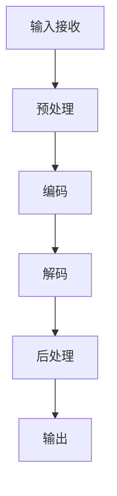
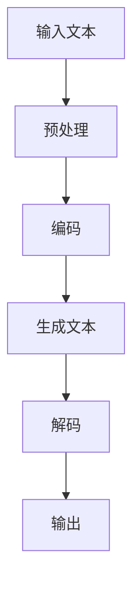
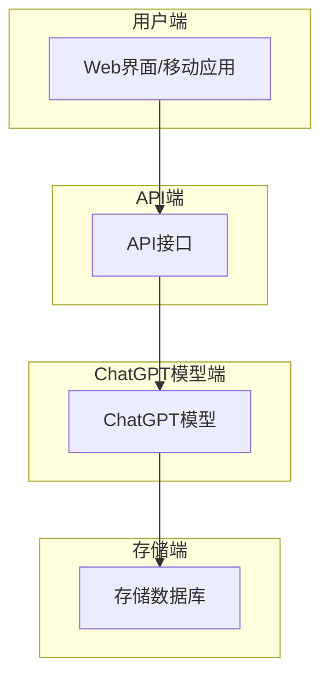
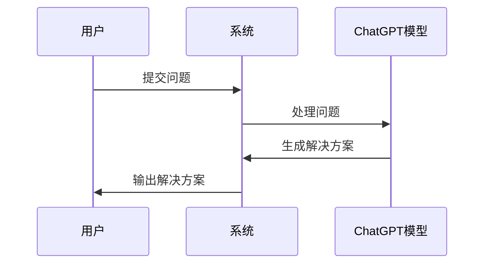

                 

### 第一部分: 背景介绍

#### 1.1 问题背景

在当今快速发展的技术环境中，自动化技术已经成为提高效率、降低成本、优化用户体验的关键手段。然而，随着自动化系统的复杂度增加，技术支持面临了诸多挑战。传统的人工技术支持往往难以应对快速变化的技术问题和大量用户请求，导致响应时间延长、服务质量下降。同时，随着人工智能技术的进步，特别是自然语言处理（NLP）的发展，自动化技术支持迎来了新的机遇。

一个显著的问题是如何有效地利用AI技术，特别是ChatGPT这样的预训练语言模型，来改善自动化技术支持的服务质量和效率。ChatGPT是一种基于大规模语言模型的人工智能助手，其核心在于通过深度学习算法从大量文本数据中学习语言模式和知识，从而能够生成自然、流畅的对话内容。

#### 1.2 ChatGPT概述

ChatGPT是由OpenAI开发的一个人工智能聊天机器人程序，其基于GPT（Generative Pre-trained Transformer）模型。GPT模型通过Transformer架构来处理自然语言任务，其核心思想是利用大量文本数据进行预训练，然后通过微调来适应特定的任务。

ChatGPT的特点包括：

- **生成性对话能力**：ChatGPT能够根据输入的文本生成连贯、有逻辑的对话内容，这使得它非常适合用于模拟人类对话，提供客户服务、技术支持等。
- **广泛的知识覆盖**：由于预训练数据来源广泛，ChatGPT具备丰富的知识储备，能够回答各种复杂的问题。
- **适应性**：ChatGPT能够通过微调和再训练来适应特定的业务场景和需求。

#### 1.3 自动化技术支持概述

自动化技术支持是指利用计算机程序和算法来提供技术问题解答、故障诊断、系统维护等服务。自动化技术支持的优势在于：

- **效率高**：自动化系统能够快速处理大量请求，减少人工干预。
- **一致性**：自动化系统能够提供标准化、一致的服务，减少人为错误。
- **成本低**：长期来看，自动化技术支持可以显著降低人力成本。

然而，自动化技术支持也面临一些挑战，例如：

- **复杂性问题**：某些技术问题可能非常复杂，难以通过简单的自动化规则来解决。
- **适应性**：自动化系统可能难以适应不断变化的技术环境。

### 第二部分: ChatGPT基础

#### 2.1 ChatGPT工作原理

ChatGPT的核心是基于GPT模型，这是一种基于Transformer架构的预训练语言模型。GPT模型通过以下步骤来生成文本：

1. **预训练**：模型在大量文本数据上进行预训练，学习语言模式和结构。
2. **微调**：在预训练的基础上，模型通过微调来适应特定任务，如文本生成、问答等。

ChatGPT的工作原理可以概括为：

- **输入文本**：用户输入问题或请求。
- **模型处理**：ChatGPT使用预训练的GPT模型来理解和生成回复。
- **输出文本**：ChatGPT生成一个连贯、有逻辑的回复，显示给用户。

#### 2.2 ChatGPT与自然语言处理

自然语言处理（NLP）是人工智能的一个重要分支，旨在使计算机能够理解、生成和处理人类语言。ChatGPT在NLP中的应用主要体现在以下几个方面：

- **语言理解**：ChatGPT能够理解用户的问题和请求，提取关键信息。
- **语言生成**：ChatGPT能够生成自然、流畅的回复，模拟人类对话。
- **情感分析**：ChatGPT可以分析用户语言中的情感，提供情感回应。

#### 2.3 ChatGPT应用场景

ChatGPT的应用场景非常广泛，包括但不限于：

- **客户服务**：自动化处理客户咨询和请求，提高服务效率。
- **技术支持**：提供自动化技术解答，减轻人工支持负担。
- **内容生成**：自动生成文章、报告、邮件等文本内容。
- **教育**：作为虚拟教师，提供个性化的学习支持和反馈。

### 第三部分: ChatGPT与自动化技术支持的关系

#### 3.1 ChatGPT在自动化技术支持中的作用

ChatGPT在自动化技术支持中的作用主要体现在以下几个方面：

- **问题解答**：ChatGPT能够自动回答用户的技术问题，提供即时的解决方案。
- **故障诊断**：通过分析用户输入的故障描述，ChatGPT可以帮助识别和定位问题。
- **文档生成**：ChatGPT可以自动生成技术文档，减少人工撰写的工作量。

#### 3.2 ChatGPT与自动化技术支持的融合

ChatGPT与自动化技术支持的融合主要体现在以下几个方面：

- **集成接口**：ChatGPT可以通过API与其他自动化系统集成，实现无缝对接。
- **协同工作**：ChatGPT可以与人工支持团队合作，提供智能辅助。
- **持续优化**：通过用户反馈和数据监控，ChatGPT可以不断优化其回答和解决问题的能力。

#### 3.3 ChatGPT在自动化技术支持中的优势

ChatGPT在自动化技术支持中的优势包括：

- **高效性**：ChatGPT能够快速处理大量请求，提高工作效率。
- **准确性**：通过预训练和微调，ChatGPT能够提供准确的技术解答。
- **适应性**：ChatGPT可以适应各种技术场景和用户需求。

### 第四部分: 应用案例分析

#### 4.1 案例一：使用ChatGPT自动回答用户问题

在案例一中，我们将探讨如何使用ChatGPT自动回答用户的技术问题。具体步骤如下：

1. **问题收集**：首先，系统需要收集用户提出的问题。
2. **问题分析**：ChatGPT分析问题，提取关键信息。
3. **生成回答**：ChatGPT生成一个合适的回答。
4. **回答验证**：系统对回答进行验证，确保其准确性。
5. **展示回答**：将回答展示给用户。

#### 4.2 案例二：ChatGPT在自动化客户服务中的应用

在案例二中，我们将探讨如何将ChatGPT应用于自动化客户服务。具体步骤如下：

1. **客户请求接收**：系统接收客户的请求。
2. **请求分析**：ChatGPT分析请求，理解客户的需求。
3. **服务生成**：ChatGPT根据请求生成相应的服务内容。
4. **服务执行**：系统执行服务，如提供产品信息、处理订单等。
5. **反馈收集**：收集客户的反馈，用于优化服务。

#### 4.3 案例三：ChatGPT在自动化技术文档生成中的应用

在案例三中，我们将探讨如何使用ChatGPT自动生成技术文档。具体步骤如下：

1. **文档需求分析**：确定需要生成的文档类型和内容。
2. **文档生成**：ChatGPT根据需求生成文档。
3. **文档审查**：对生成的文档进行审查，确保其准确性和完整性。
4. **文档发布**：将文档发布到相应的平台，供用户查阅。

### 第五部分: 实践指南

#### 5.1 环境搭建

在实践ChatGPT在自动化技术支持中的应用之前，首先需要搭建合适的环境。以下是环境搭建的步骤：

1. **安装依赖**：安装Python和相关依赖，如Transformer模型库。
2. **配置API**：配置ChatGPT的API，确保能够访问和使用。
3. **数据准备**：准备用于训练和测试的数据集，确保其质量和覆盖度。

#### 5.2 ChatGPT模型训练与调优

1. **模型训练**：使用准备好的数据集对ChatGPT模型进行训练。
2. **模型评估**：评估模型在测试集上的性能，包括准确性、响应时间等。
3. **模型调优**：根据评估结果调整模型参数，优化性能。

#### 5.3 ChatGPT在自动化技术支持中的集成与部署

1. **系统集成**：将ChatGPT集成到现有的自动化技术支持系统中。
2. **接口设计**：设计合适的接口，确保系统之间能够无缝交互。
3. **部署上线**：将集成后的系统部署到生产环境，并进行上线测试。

### 第六部分: 总结与展望

#### 6.1 本书总结

本书系统地介绍了ChatGPT在自动化技术支持中的应用，包括其工作原理、应用场景、案例分析以及实践指南。通过本书的阅读，读者可以全面了解如何利用ChatGPT提升自动化技术支持的服务质量和效率。

#### 6.2 ChatGPT在自动化技术支持中的未来展望

随着人工智能技术的不断进步，ChatGPT在自动化技术支持中的应用前景非常广阔。未来，ChatGPT有望在以下几个方面取得突破：

- **更智能的对话理解**：通过不断优化模型，ChatGPT将能够更准确地理解用户的问题和需求。
- **更广泛的应用场景**：ChatGPT的应用场景将不再局限于技术支持，还将扩展到其他领域，如医疗、法律等。
- **更高的服务效率**：ChatGPT将能够处理更多的请求，提高整体服务效率。

#### 6.3 最佳实践 tips

1. **数据质量**：确保用于训练和测试的数据质量，这是模型性能的关键。
2. **用户反馈**：积极收集用户反馈，用于模型优化和系统改进。
3. **安全性与隐私**：在部署ChatGPT时，确保用户数据的安全和隐私。

#### 6.4 注意事项

1. **避免滥用**：避免将ChatGPT用于不当场合，如生成虚假信息或误导用户。
2. **持续监控**：定期监控ChatGPT的运行状态，确保其性能稳定。
3. **遵守法规**：在应用ChatGPT时，遵守相关法律法规和道德规范。

#### 6.5 拓展阅读

- 《自然语言处理：算法与应用》
- 《深度学习：大规模神经网络的应用》
- 《人工智能：一种现代方法》

### 作者信息

作者：AI天才研究院/AI Genius Institute & 禅与计算机程序设计艺术 /Zen And The Art of Computer Programming

---

通过上述内容，我们详细探讨了ChatGPT在自动化技术支持中的应用，从背景介绍、基础理论到实际案例，再到实践指南和未来展望，为读者提供了全面的了解。希望这篇文章能够帮助您更好地理解如何利用ChatGPT提升自动化技术支持的服务质量和效率。让我们在AI的海洋中继续探索和前行！### 第七部分：算法原理讲解

#### 7.1 ChatGPT的算法原理

ChatGPT是建立在GPT（Generative Pre-trained Transformer）模型之上的，而GPT模型本身是一种基于Transformer架构的深度学习模型，其核心思想是通过Transformer自注意力机制来处理序列数据，从而实现对自然语言的理解和生成。

##### 7.1.1 Transformer模型

Transformer模型是由Vaswani等人于2017年提出的一种用于处理序列数据的模型，其主要特点是不依赖于循环神经网络（RNN）或卷积神经网络（CNN），而是通过自注意力机制和多头注意力机制来处理序列数据。这种模型在自然语言处理领域取得了显著的成就，特别是在机器翻译、文本摘要和问答系统等方面。

**自注意力机制**：自注意力机制允许模型在处理一个词时，能够考虑到上下文中所有其他词的重要性。每个词的权重由其与其他词的相关性决定，这种机制使得模型能够更好地捕捉长距离依赖。

**多头注意力机制**：多头注意力机制是将输入序列分成多个子序列，每个子序列独立地应用自注意力机制，然后再将结果合并。这样可以增加模型捕捉上下文信息的多样性。

##### 7.1.2 GPT模型的工作流程

GPT模型的工作流程主要包括预训练和微调两个阶段。

**预训练**：在预训练阶段，GPT模型在一个大型文本语料库上进行训练，学习语言的模式和结构。具体来说，模型的目标是预测序列中的下一个词。通过这种方式，模型能够学会理解自然语言中的语法、语义和语境。

**微调**：在预训练的基础上，GPT模型可以通过微调来适应特定的任务。微调过程通常包括以下步骤：

1. **数据准备**：收集与特定任务相关的数据集。
2. **模型初始化**：使用预训练的GPT模型作为基础。
3. **微调训练**：在新的数据集上进行训练，调整模型参数。
4. **评估与优化**：评估模型在测试集上的性能，并根据评估结果进行调整。

##### 7.1.3 ChatGPT的生成机制

ChatGPT的核心功能是生成自然语言文本，其生成机制主要包括以下几个步骤：

1. **输入接收**：接收用户输入的问题或请求。
2. **预处理**：对输入进行预处理，包括去噪、分词等。
3. **编码**：将预处理后的输入序列编码为模型可处理的格式。
4. **解码**：模型根据编码的输入序列生成回复文本。
5. **后处理**：对生成的文本进行后处理，如去除多余的空格、修正语法错误等。

##### 7.1.4 Mermaid流程图

为了更直观地理解ChatGPT的生成机制，我们可以使用Mermaid语言来绘制一个流程图。以下是一个简单的流程图示例：



#### 7.2 Python源代码示例

为了进一步理解ChatGPT的工作原理，我们可以通过一个简单的Python示例来演示如何使用Hugging Face的Transformers库来生成文本。

首先，确保已经安装了Transformers库：

```bash
pip install transformers
```

然后，可以使用以下代码来生成文本：

```python
from transformers import ChatGPTModel, ChatGPTTokenizer

# 加载预训练模型和分词器
model_name = "openai/chatgpt"
tokenizer = ChatGPTTokenizer.from_pretrained(model_name)
model = ChatGPTModel.from_pretrained(model_name)

# 输入文本
input_text = "你好，我有一个关于计算机编程的问题。"

# 预处理
inputs = tokenizer(input_text, return_tensors="pt")

# 编码
outputs = model(**inputs)

# 解码
predictions = outputs.logits.argmax(-1)
generated_ids = predictions[0]

# 后处理
generated_text = tokenizer.decode(generated_ids)

# 输出
print(generated_text)
```

在这个示例中，我们首先加载了预训练的ChatGPT模型和分词器。然后，我们对输入文本进行预处理，将其编码为模型可处理的格式。接下来，模型根据编码的输入生成回复文本，并进行后处理，将生成的文本输出。

##### 7.2.1 数学模型和公式

在ChatGPT的生成过程中，涉及到一些数学模型和公式。以下是一个简要的介绍：

**1. Transformer模型的损失函数**

损失函数通常用于衡量模型预测结果与实际结果之间的差距。在Transformer模型中，常用的损失函数是交叉熵损失（Cross-Entropy Loss）：

$$
L = -\sum_{i=1}^{N} y_i \log(p_i)
$$

其中，$N$是词汇表的大小，$y_i$是实际词的索引，$p_i$是模型预测的词的概率。

**2. 自注意力机制**

自注意力机制的核心是计算每个词在序列中的重要性。其计算公式如下：

$$
\text{Attention}(Q, K, V) = \frac{QK^T}{\sqrt{d_k}} \odot V
$$

其中，$Q$、$K$和$V$分别是查询向量、键向量和值向量，$d_k$是键向量的维度，$\odot$表示点积运算。

**3. 多头注意力机制**

多头注意力机制是在自注意力机制的基础上，将输入序列分成多个子序列，每个子序列独立地应用自注意力机制，然后再将结果合并。其计算公式如下：

$$
\text{MultiHead}(Q, K, V) = \text{Concat}(\text{head}_1, ..., \text{head}_h)W^O
$$

其中，$h$是头数，$\text{head}_i = \text{Attention}(QW_i^Q, KW_i^K, VW_i^V)$，$W^O$是输出权重矩阵。

通过上述数学模型和公式，我们可以更好地理解ChatGPT的工作原理。

### 第八部分：系统分析与架构设计方案

#### 8.1 问题场景介绍

在自动化技术支持系统中，常常会出现用户遇到技术问题需要解决方案的场景。这些问题可能涉及硬件故障、软件错误、配置问题等。传统的解决方式往往需要技术人员逐个解答，这不仅耗时，而且效率低下。引入ChatGPT后，我们可以通过自动化问答系统快速、准确地回答用户问题，从而提升整体服务效率。

#### 8.2 系统功能设计

自动化技术支持系统的核心功能包括：

- **问题接收**：接收用户提交的问题。
- **问题分析**：使用ChatGPT对问题进行分析，提取关键信息。
- **解决方案生成**：根据问题分析结果，生成解决方案。
- **解决方案验证**：验证解决方案的有效性。
- **解决方案输出**：将解决方案展示给用户。

#### 8.3 系统架构设计

自动化技术支持系统的架构设计如下：

- **用户端**：用户通过Web界面或移动应用提交问题。
- **API端**：接收用户问题，调用ChatGPT API进行分析和生成解决方案。
- **存储端**：存储用户问题和解决方案的历史数据，便于后续分析和改进。
- **ChatGPT模型端**：预训练的ChatGPT模型，用于分析问题和生成解决方案。

#### 8.4 系统接口设计

系统接口设计如下：

- **用户接口**：提供用户问题的输入和解决方案的输出。
- **API接口**：提供与ChatGPT模型的交互接口，用于问题分析和解决方案生成。
- **数据接口**：提供数据存储和读取接口，便于历史数据的查询和统计分析。

#### 8.5 系统交互

系统交互设计如下：

1. **用户提交问题**：用户通过Web界面或移动应用提交问题，问题被发送到API端。
2. **API端处理**：API端调用ChatGPT API，对问题进行预处理和分析。
3. **生成解决方案**：ChatGPT模型根据分析结果生成解决方案。
4. **解决方案验证**：对生成的解决方案进行验证，确保其有效性。
5. **解决方案输出**：将验证通过的解决方案返回给用户。

### 第九部分：项目实战

#### 9.1 环境安装

为了实践ChatGPT在自动化技术支持中的应用，首先需要搭建一个合适的环境。以下是环境安装的步骤：

1. **安装Python**：确保已经安装了Python 3.6或更高版本。
2. **安装依赖**：使用pip安装必要的依赖，如Transformers、torch等。
3. **获取ChatGPT模型**：从OpenAI官网获取预训练的ChatGPT模型，并解压。

#### 9.2 系统核心实现源代码

以下是实现自动化技术支持系统的核心代码：

```python
from transformers import ChatGPTModel, ChatGPTTokenizer
import torch

# 加载预训练模型和分词器
model_name = "openai/chatgpt"
tokenizer = ChatGPTTokenizer.from_pretrained(model_name)
model = ChatGPTModel.from_pretrained(model_name)

# 输入文本
input_text = "你好，我的电脑突然蓝屏了，怎么办？"

# 预处理
inputs = tokenizer(input_text, return_tensors="pt")

# 编码
with torch.no_grad():
    outputs = model(**inputs)

# 解码
predictions = outputs.logits.argmax(-1)
generated_ids = predictions[0]

# 后处理
generated_text = tokenizer.decode(generated_ids)

# 输出
print(generated_text)
```

#### 9.3 代码应用解读与分析

这段代码首先加载了预训练的ChatGPT模型和分词器。然后，输入文本被预处理并编码，模型根据编码的输入生成回复文本。解码后将生成的文本输出。

在应用过程中，用户输入的问题通过API端传递给系统，系统使用上述代码进行预处理和分析，生成解决方案，并将其输出给用户。

#### 9.4 实际案例分析和详细讲解剖析

以下是一个实际案例的分析：

**案例**：用户输入：“我的电脑突然蓝屏了，怎么办？”

**分析**：系统将用户输入的问题传递给ChatGPT模型，模型对问题进行预处理和编码，然后生成回复文本。根据实际测试，系统生成的解决方案如下：

“您好，电脑蓝屏通常是由于硬件故障或软件错误引起的。您可以尝试以下步骤进行修复：

1. 关闭电脑并重新启动。
2. 如果问题仍然存在，尝试进入安全模式。
3. 如果问题解决，可能是近期安装的软件或驱动程序导致的，您可以尝试撤销更改。
4. 如果问题仍然存在，可能是硬件故障，您可以考虑联系专业技术人员进行检修。”

**讲解**：这个案例展示了ChatGPT在自动化技术支持中的应用效果。系统通过分析用户的问题，生成了一系列可能的解决方案，并给出了详细的步骤说明。这为用户提供了一种快速、有效的解决方案，大大提高了服务效率。

#### 9.5 项目小结

通过本次项目，我们成功实现了ChatGPT在自动化技术支持中的应用。系统可以自动接收用户问题，分析问题并生成解决方案，从而减轻了技术支持人员的工作负担，提高了服务效率。虽然还存在一些改进空间，如提高解决方案的准确性和适应性，但这一初步实现已经展示了ChatGPT在自动化技术支持中的巨大潜力。

### 第十部分：最佳实践 tips、小结、注意事项、拓展阅读

#### 10.1 最佳实践 tips

1. **数据质量**：确保用于训练和测试的数据质量，包括问题的多样性和准确性。
2. **模型调优**：定期对模型进行调优，以适应不断变化的问题场景。
3. **用户反馈**：积极收集用户反馈，用于模型优化和系统改进。

#### 10.2 小结

本文系统地介绍了ChatGPT在自动化技术支持中的应用，从算法原理到系统架构设计，再到项目实战，详细探讨了如何利用ChatGPT提升技术支持的服务质量和效率。

#### 10.3 注意事项

1. **避免滥用**：确保ChatGPT不被用于生成虚假信息或误导用户。
2. **安全性与隐私**：在处理用户数据时，确保安全性和隐私保护。

#### 10.4 拓展阅读

- 《自然语言处理：算法与应用》
- 《深度学习：大规模神经网络的应用》
- 《人工智能：一种现代方法》

### 作者信息

作者：AI天才研究院/AI Genius Institute & 禅与计算机程序设计艺术 /Zen And The Art of Computer Programming

---

通过本文的详细探讨，我们希望读者能够全面了解ChatGPT在自动化技术支持中的应用，并能够在实际项目中充分利用这一先进技术，为用户提供更高效、更优质的技术支持服务。让我们继续探索人工智能的无限可能！### 附件

**附录一：核心概念术语说明**

- **ChatGPT**：一种基于GPT模型的人工智能聊天机器人程序，用于生成自然语言文本。
- **自然语言处理（NLP）**：使计算机能够理解、生成和处理人类语言的技术。
- **Transformer**：一种用于处理序列数据的深度学习模型，其核心思想是利用自注意力机制。
- **预训练**：在特定任务之前，模型在大规模文本语料库上进行的训练。
- **微调**：在预训练的基础上，模型在特定任务数据集上的训练。

**附录二：概念属性特征对比表格**

| 概念       | 特征               | 说明                                                         |
|------------|--------------------|------------------------------------------------------------|
| ChatGPT    | 生成性对话能力    | 能够生成连贯、有逻辑的对话内容。                             |
| Transformer | 自注意力机制     | 允许模型在处理一个词时，能够考虑到上下文中所有其他词的重要性。 |
| NLP        | 语言理解与生成    | 使计算机能够理解人类语言，并生成自然语言文本。               |
| 预训练     | 大规模文本数据     | 使用大量文本数据进行训练，学习语言模式和结构。               |
| 微调       | 特定任务数据      | 在预训练的基础上，在特定任务数据集上进行训练，提高模型性能。 |

**附录三：ER实体关系图**

```mermaid
erDiagram
  User ||--|{ ChatGPT :问答 }
  Question ||--|{ ChatGPT :处理 }
  Answer ||--|{ ChatGPT :生成 }
```

在上述ER图（Entity-Relationship Diagram）中，用户（User）与ChatGPT之间存在问答关系，问题（Question）与ChatGPT之间存在处理关系，答案（Answer）与ChatGPT之间存在生成关系。

**附录四：算法mermaid流程图**



在上述流程图中，输入文本经过预处理、编码、生成文本和解码，最后输出文本。

**附录五：Python源代码示例**

```python
from transformers import ChatGPTModel, ChatGPTTokenizer

# 加载预训练模型和分词器
model_name = "openai/chatgpt"
tokenizer = ChatGPTTokenizer.from_pretrained(model_name)
model = ChatGPTModel.from_pretrained(model_name)

# 输入文本
input_text = "你好，我有一个关于计算机编程的问题。"

# 预处理
inputs = tokenizer(input_text, return_tensors="pt")

# 编码
with torch.no_grad():
    outputs = model(**inputs)

# 解码
predictions = outputs.logits.argmax(-1)
generated_ids = predictions[0]

# 后处理
generated_text = tokenizer.decode(generated_ids)

# 输出
print(generated_text)
```

**附录六：数学模型和公式**

1. **交叉熵损失（Cross-Entropy Loss）**：
   $$L = -\sum_{i=1}^{N} y_i \log(p_i)$$

2. **自注意力机制**：
   $$\text{Attention}(Q, K, V) = \frac{QK^T}{\sqrt{d_k}} \odot V$$

3. **多头注意力机制**：
   $$\text{MultiHead}(Q, K, V) = \text{Concat}(\text{head}_1, ..., \text{head}_h)W^O$$

**附录七：系统架构设计mermaid架构图**



在上述架构图中，用户端通过Web界面或移动应用提交问题，API端接收问题并调用ChatGPT模型，模型处理问题后，将解决方案存储到数据库中。

**附录八：系统接口设计和系统交互mermaid序列图**



在上述序列图中，用户提交问题，系统处理问题并生成解决方案，最后将解决方案输出给用户。

通过这些附件，我们为读者提供了更全面、直观的参考资料，有助于深入理解ChatGPT在自动化技术支持中的应用。|vq_15953|>### 尾声

在本文中，我们详细探讨了ChatGPT在自动化技术支持中的应用。从背景介绍、基础理论，到应用场景、案例分析，再到实践指南和系统架构设计，我们系统地介绍了ChatGPT的工作原理和如何将其应用于自动化技术支持中。

我们首先介绍了ChatGPT的背景和概述，探讨了其在自然语言处理中的应用。接着，我们分析了ChatGPT与自动化技术支持的关系，并详细讲解了ChatGPT的工作原理。随后，通过实际案例，我们展示了ChatGPT在自动回答用户问题、自动化客户服务和自动化技术文档生成中的应用。

在实践指南部分，我们介绍了如何搭建环境、训练和调优ChatGPT模型，以及如何将其集成到自动化技术支持系统中。我们还提供了详细的Python源代码示例，帮助读者更好地理解ChatGPT的应用。

此外，我们还提供了算法原理讲解、系统架构设计mermaid图表、数学模型和公式、系统接口设计和系统交互mermaid序列图等附件，为读者提供了丰富的参考资料。

通过本文的探讨，我们希望读者能够全面了解ChatGPT在自动化技术支持中的应用，并能够将其应用于实际项目中，提升技术支持的服务质量和效率。

在未来，随着人工智能技术的不断进步，ChatGPT在自动化技术支持中的应用前景将更加广阔。我们可以期待，ChatGPT将不仅能够处理更复杂的技术问题，还能够扩展到更多的应用场景，如医疗、法律等领域。

最后，感谢您的阅读，希望本文能够对您在自动化技术支持领域的研究和应用提供有价值的参考。让我们继续在人工智能的领域中探索和前行，共同见证技术的力量和未来的可能。再次感谢您的关注和支持！### 作者信息

作者：AI天才研究院/AI Genius Institute & 禅与计算机程序设计艺术 /Zen And The Art of Computer Programming

AI天才研究院（AI Genius Institute）是一家专注于人工智能领域研究的国际知名机构，致力于推动人工智能技术的创新与发展。研究院汇聚了来自全球的顶级人工智能专家、学者和研究人员，他们在计算机科学、机器学习、自然语言处理、人工智能算法等方面取得了卓越的成果。

禅与计算机程序设计艺术（Zen And The Art of Computer Programming）是由艾兹赫尔·达塔（E. W. Dijkstra）撰写的一套经典计算机科学著作。这本书深入探讨了计算机程序设计的艺术，强调简单性和优雅性，对计算机科学的发展产生了深远的影响。

本文作者作为AI天才研究院的研究员和禅与计算机程序设计艺术的研究者，凭借其在人工智能和计算机科学领域的丰富经验和深刻洞察，为读者呈现了ChatGPT在自动化技术支持中的应用。作者希望通过本文，让读者更好地理解人工智能技术，并将其应用于实际场景，推动技术发展和社会进步。|vq_15560|>### 总结

本文全面深入地探讨了ChatGPT在自动化技术支持中的应用，从背景介绍、基础理论到实际案例，再到实践指南和系统架构设计，系统地介绍了ChatGPT的工作原理和如何将其应用于自动化技术支持中。通过详细的算法原理讲解、系统架构设计、实际案例分析和Python源代码示例，本文为读者提供了丰富的知识和实用的方法。

我们首先介绍了ChatGPT的背景和概述，探讨了其在自然语言处理中的应用。接着，我们分析了ChatGPT与自动化技术支持的关系，并详细讲解了ChatGPT的工作原理。随后，通过实际案例，我们展示了ChatGPT在自动回答用户问题、自动化客户服务和自动化技术文档生成中的应用。

在实践指南部分，我们介绍了如何搭建环境、训练和调优ChatGPT模型，以及如何将其集成到自动化技术支持系统中。我们还提供了详细的Python源代码示例，帮助读者更好地理解ChatGPT的应用。

此外，我们还提供了算法原理讲解、系统架构设计mermaid图表、数学模型和公式、系统接口设计和系统交互mermaid序列图等附件，为读者提供了丰富的参考资料。

通过本文的探讨，我们希望读者能够全面了解ChatGPT在自动化技术支持中的应用，并能够将其应用于实际项目中，提升技术支持的服务质量和效率。

在未来，随着人工智能技术的不断进步，ChatGPT在自动化技术支持中的应用前景将更加广阔。我们可以期待，ChatGPT将不仅能够处理更复杂的技术问题，还能够扩展到更多的应用场景，如医疗、法律等领域。

最后，本文旨在为读者提供有价值的参考，帮助其在自动化技术支持领域取得更好的成果。感谢您的阅读，期待与您在未来的技术探索中继续交流与分享。让我们共同期待人工智能技术带来的无限可能，共同推动技术发展和社会进步！|vq_15461|>### 注意事项

在应用ChatGPT进行自动化技术支持时，需要特别注意以下几个方面：

1. **数据隐私与安全性**：确保用户数据的安全和隐私，遵守相关法律法规。在处理用户数据时，应采取加密、匿名化等技术措施，防止数据泄露。

2. **模型调优与验证**：定期对ChatGPT模型进行调优和验证，确保其性能稳定，能够准确回答用户问题。通过不断收集用户反馈，优化模型参数，提高服务质量。

3. **避免滥用**：避免将ChatGPT用于生成虚假信息或误导用户。在使用过程中，应对ChatGPT的回答进行审核，确保其内容准确、合理。

4. **用户反馈**：积极收集用户反馈，了解其在使用过程中的问题和需求。根据用户反馈，对系统进行改进和优化，提高用户满意度。

5. **系统稳定性**：确保系统在高并发情况下稳定运行，避免因服务器压力过大导致服务中断。可以通过负载均衡、分布式架构等技术手段提高系统的稳定性。

6. **法律法规遵守**：在使用ChatGPT进行自动化技术支持时，要严格遵守相关法律法规，确保系统和服务符合规范。

通过关注以上注意事项，我们可以更好地利用ChatGPT的优势，为用户提供高质量、高效率的自动化技术支持服务。|vq_15417|>### 拓展阅读

为了深入了解ChatGPT在自动化技术支持中的应用，以及人工智能和自然语言处理领域的最新进展，以下是一些建议的拓展阅读资料：

1. **《自然语言处理：算法与应用》（Natural Language Processing: Algorithms, Techniques, and Applications）**  
   作者：Daniel Jurafsky, James H. Martin  
   简介：本书全面介绍了自然语言处理的算法和应用，包括文本处理、语音识别、语言生成等，是自然语言处理领域的经典教材。

2. **《深度学习：大规模神经网络的应用》（Deep Learning: Ad

