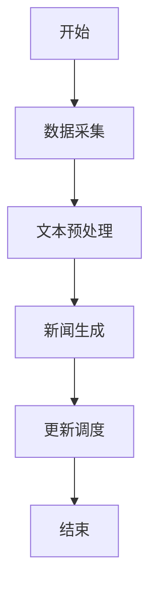

                 

### 文章标题：ChatGPT在自动化新闻实时更新与总结中的应用

关键词：ChatGPT、自动化新闻、实时更新、新闻总结、自然语言处理

摘要：随着互联网的飞速发展，新闻信息的传播速度和规模日益扩大，如何高效地处理和利用这些海量新闻数据成为了一个重要的研究课题。本文将介绍ChatGPT在自动化新闻实时更新与新闻内容总结中的应用，通过一步步的分析和思考，探讨其实现原理、系统架构、实战案例及未来前景。

### 第一部分：ChatGPT概述

#### 第1章：ChatGPT背景与原理

##### 1.1 ChatGPT的产生背景

ChatGPT是OpenAI开发的一种基于GPT-3的聊天机器人模型，它结合了自然语言处理（NLP）和深度学习技术，旨在实现更自然、更流畅的人机交互。ChatGPT的诞生背景可以追溯到近年来人工智能的快速发展，特别是在NLP领域取得的显著突破。

##### 1.2 ChatGPT的基本原理

ChatGPT基于生成预训练变换器（GPT）模型，其核心思想是通过在大量文本数据上进行预训练，使得模型能够理解并生成人类语言。GPT-3是当前最大的预训练模型，拥有1750亿个参数，能够处理多种自然语言任务，如文本生成、问答系统、翻译等。

##### 1.3 GPT系列模型的发展历程

GPT系列模型的发展历程从GPT-1开始，经过GPT-2、GPT-2.5、GPT-3等多个版本，每个版本都在模型规模、性能和功能上取得了显著的提升。ChatGPT是基于GPT-3构建的，充分利用了其强大的语言生成能力。

##### 1.4 ChatGPT与其他NLP技术的区别

与传统的NLP技术如词袋模型、TF-IDF等相比，ChatGPT具有更强的语义理解和生成能力。它能够根据上下文生成连贯、自然的文本，从而更好地应用于对话系统、内容生成等任务。

#### 第2章：ChatGPT在自动化新闻实时更新中的应用

##### 2.1 自动化新闻实时更新的挑战

自动化新闻实时更新面临着数据源多样、实时性要求高、准确性需求强等多重挑战。如何高效地处理海量新闻数据，实现实时更新，同时保证新闻内容的准确性，是当前研究的热点问题。

##### 2.2 ChatGPT如何实现自动化新闻实时更新

ChatGPT通过在新闻数据集上预训练，学会了新闻文本的生成和更新规律。在自动化新闻实时更新中，ChatGPT可以根据实时新闻事件，自动生成相关的新闻稿件，从而实现新闻的实时更新。

##### 2.3 实现自动化新闻实时更新的关键组件

实现自动化新闻实时更新需要以下几个关键组件：
- **数据采集模块**：负责从各种新闻源采集最新的新闻数据。
- **文本预处理模块**：对采集到的新闻文本进行清洗、去噪等预处理操作。
- **新闻生成模块**：利用ChatGPT生成新的新闻稿件。
- **更新调度模块**：根据新闻事件的实时变化，调度新闻生成和更新的过程。

#### 第3章：ChatGPT在新闻内容总结中的应用

##### 3.1 新闻内容总结的挑战

新闻内容总结旨在从大量新闻文本中提取出关键信息，进行简洁、准确的总结。这一任务面临的主要挑战包括信息提取、摘要生成、摘要质量评价等。

##### 3.2 ChatGPT如何进行新闻内容总结

ChatGPT通过在新闻数据集上进行预训练，学会了从新闻文本中提取关键信息并生成摘要的能力。在新闻内容总结中，ChatGPT可以自动提取新闻的主要内容和关键信息，并生成简洁、准确的摘要。

##### 3.3 新闻内容总结的效果评估

新闻内容总结的效果评估主要包括摘要的准确性、完整性、连贯性等方面。通过人工评估和自动化评估方法，可以评估新闻内容总结的质量，并优化ChatGPT的摘要生成能力。

### 第二部分：ChatGPT应用实例详解

#### 第4章：自动化新闻实时更新实例

##### 4.1 实例背景与目标

实例背景：某新闻网站希望实现新闻的实时更新，提高用户体验。
实例目标：使用ChatGPT实现自动化新闻实时更新，确保新闻内容的准确性和实时性。

##### 4.2 系统架构设计

系统架构设计主要包括数据采集模块、文本预处理模块、新闻生成模块和更新调度模块。

##### 4.3 核心代码实现

核心代码实现包括数据采集、文本预处理、新闻生成和更新调度的具体实现。

##### 4.4 实例分析

实例分析主要对系统架构设计、核心代码实现和实际应用效果进行详细讲解和分析。

#### 第5章：新闻内容总结实例

##### 5.1 实例背景与目标

实例背景：某新闻聚合平台需要从大量新闻中提取关键信息进行总结。
实例目标：使用ChatGPT实现新闻内容总结，提高用户获取新闻信息的效率。

##### 5.2 系统架构设计

系统架构设计主要包括文本预处理模块、新闻生成模块和摘要评估模块。

##### 5.3 核心代码实现

核心代码实现包括文本预处理、新闻生成和摘要评估的具体实现。

##### 5.4 实例分析

实例分析主要对系统架构设计、核心代码实现和实际应用效果进行详细讲解和分析。

### 第三部分：实践与优化

#### 第6章：ChatGPT应用的优化策略

##### 6.1 数据处理优化

数据处理优化主要包括数据采集、文本预处理和数据存储等方面的优化策略。

##### 6.2 模型优化

模型优化主要包括模型参数调整、训练数据增强和模型融合等方面的优化策略。

##### 6.3 系统性能优化

系统性能优化主要包括系统架构优化、负载均衡和缓存策略等方面的优化策略。

#### 第7章：案例分析与经验总结

##### 7.1 案例一：新闻实时更新系统性能提升

案例一主要分析新闻实时更新系统的性能提升策略，包括数据处理优化、模型优化和系统性能优化等方面的经验总结。

##### 7.2 案例二：新闻内容总结准确性提升

案例二主要分析新闻内容总结准确性的提升策略，包括文本预处理、新闻生成和摘要评估等方面的经验总结。

##### 7.3 经验总结与展望

经验总结主要对案例一和案例二中的优化策略进行总结，并展望ChatGPT在新闻实时更新和内容总结中的未来发展。

### 第四部分：未来展望

#### 第8章：ChatGPT在新闻领域的潜在应用

##### 8.1 趋势分析

趋势分析主要分析ChatGPT在新闻领域的应用趋势，包括技术发展、市场前景和用户需求等方面。

##### 8.2 潜在应用领域

潜在应用领域主要探讨ChatGPT在新闻领域的潜在应用场景，如自动化新闻写作、新闻内容审核和个性化推荐等。

##### 8.3 面临的挑战与机遇

面临的挑战与机遇主要分析ChatGPT在新闻领域面临的挑战和机遇，包括技术挑战、市场机遇和政策法规等方面。

#### 第9章：ChatGPT在其他领域的应用前景

##### 9.1 自动化客服

自动化客服主要探讨ChatGPT在客户服务领域的应用，包括客服机器人、智能客服系统等。

##### 9.2 虚拟助理

虚拟助理主要探讨ChatGPT在虚拟助理领域的应用，如智能语音助手、智能聊天机器人等。

##### 9.3 教育与培训

教育与培训主要探讨ChatGPT在教育领域的应用，如智能教学辅助、个性化学习推荐等。

## 文章结束

作者：AI天才研究院/AI Genius Institute & 禅与计算机程序设计艺术 /Zen And The Art of Computer Programming

### 附录

#### 1. Mermaid流程图和类图示例



```mermaid
classDiagram
    新闻数据 <<Data|Class>>
    新闻生成器 <<Generator|Class>>
    数据采集器 <<Collector|Class>>
    更新调度器 <<Scheduler|Class>>
    新闻数据 <|-- 新闻生成器
    新闻数据 <|-- 数据采集器
    新闻数据 <|-- 更新调度器
```

#### 2. Python代码示例

```python
import openai

# 初始化ChatGPT API
chatgpt = openai.ChatGPT(api_key='your_api_key')

# 获取实时新闻
news = get_real_time_news()

# 生成新闻摘要
summary = chatgpt.summary(news)

# 输出新闻摘要
print(summary)
```

#### 3. LaTeX公式示例

独立段落的公式：

$$
E = mc^2
$$

段落内的公式：

$E = mc^2$

#### 4. 注意事项

- 确保文章内容完整、逻辑清晰，每个章节都要具体、详细地讲解。
- 注意使用Markdown格式，包括标题、段落、列表、代码块等。
- 合理使用Mermaid流程图和类图，以便于读者理解系统架构和算法流程。
- 正确使用LaTeX格式，确保数学公式清晰可读。

#### 5. 拓展阅读

- 《ChatGPT技术原理与实践》
- 《自然语言处理：理论与应用》
- 《人工智能：一种现代方法》

以上为《ChatGPT在自动化新闻实时更新与总结中的应用》的完整文章。希望本文能够帮助读者深入了解ChatGPT在新闻领域的应用，为相关研究和实践提供参考。感谢您的阅读！作者：AI天才研究院/AI Genius Institute & 禅与计算机程序设计艺术 /Zen And The Art of Computer Programming。如果您有任何疑问或建议，欢迎在评论区留言。让我们共同探讨人工智能领域的更多可能性！

