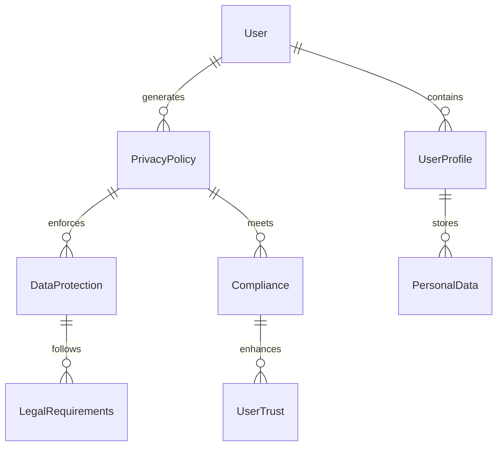
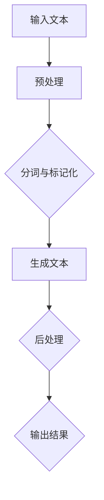
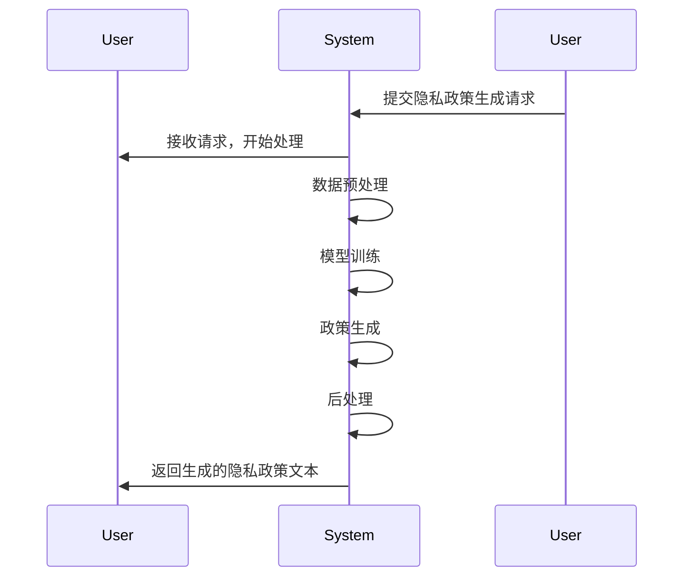

                 

# ChatGPT在自动化用户隐私政策生成中的角色

关键词：ChatGPT、用户隐私、自动化、政策生成、人工智能

摘要：随着人工智能技术的快速发展，ChatGPT作为新一代的对话生成模型，逐渐在多个领域展现出其强大的应用潜力。本文将探讨ChatGPT在自动化用户隐私政策生成中的角色，分析其在政策生成过程中的优势与挑战，并通过具体案例展示其实际应用效果。

## 引言

### ChatGPT的崛起

ChatGPT是由OpenAI于2022年推出的一款基于GPT-3.5的预训练语言模型。它采用了最新的深度学习技术和大规模数据集进行训练，能够生成高质量、连贯的自然语言文本。ChatGPT的推出标志着人工智能技术在自然语言处理领域取得了新的突破，为许多行业带来了新的可能性。

### 用户隐私政策的重要性

用户隐私政策是企业在收集、处理和使用用户数据时，应遵循的法律要求和伦理规范。一个完善、明确的隐私政策有助于增强用户对企业的信任，降低法律风险，同时也是企业合规运营的重要保障。

### ChatGPT在政策生成中的角色

在用户隐私政策生成过程中，ChatGPT可以充当智能助手，帮助企业和机构快速、准确地生成符合法律法规和用户需求的隐私政策。本文将深入探讨ChatGPT在自动化用户隐私政策生成中的角色，分析其应用前景和挑战。

## 第1章 了解ChatGPT

### 定义与特征

ChatGPT是一款基于GPT-3.5的预训练语言模型，具有以下关键特征：

1. **强大的文本生成能力**：ChatGPT能够生成高质量、连贯的自然语言文本，适用于多种应用场景。
2. **自适应学习能力**：ChatGPT能够根据输入的文本上下文，自适应地调整生成内容，使其更符合实际需求。
3. **多语言支持**：ChatGPT支持多种语言，可以满足不同国家和地区的需求。
4. **大规模数据训练**：ChatGPT采用了大量的高质量数据集进行训练，使其具有丰富的知识和语言表达能力。

### 技术背景

ChatGPT是基于GPT-3.5模型开发的一款对话生成模型。GPT-3.5是OpenAI开发的一种先进的自然语言处理模型，具有极高的文本生成质量和理解能力。ChatGPT在此基础上进行了优化和改进，使其更适合对话场景。

### 行业应用

ChatGPT已经在多个行业展现出其强大的应用潜力：

1. **客服与客户支持**：ChatGPT可以用于智能客服，提供24/7的在线支持，提高客户满意度。
2. **内容创作与编辑**：ChatGPT可以辅助创作者进行文章、报告等内容的创作和编辑，提高工作效率。
3. **教育培训**：ChatGPT可以用于个性化教育，为学生提供定制化的学习内容和辅导。
4. **医疗健康**：ChatGPT可以辅助医生进行病例分析、诊断和建议，提高医疗质量。

## 第2章 用户隐私与政策生成

### 用户隐私概述

用户隐私是指用户在互联网环境中，保护其个人信息不被泄露、滥用和非法获取的权利。随着互联网和大数据技术的发展，用户隐私问题日益凸显，成为社会各界关注的重要议题。

### 隐私保护挑战

在当前互联网环境下，用户隐私保护面临诸多挑战：

1. **数据泄露**：互联网企业和第三方服务商可能因安全漏洞导致用户数据泄露。
2. **滥用数据**：企业可能滥用用户数据，进行不正当的商业行为。
3. **隐私政策复杂性**：现有的隐私政策往往过于复杂，用户难以理解其中内容。

### 隐私政策概念

用户隐私政策是企业在收集、处理和使用用户数据时，应遵循的法律要求和伦理规范。隐私政策通常包括用户数据的收集目的、使用方式、存储期限、数据安全措施等内容。

### 当前政策生成方法

目前，用户隐私政策的生成主要采用以下方法：

1. **人工编写**：企业法律部门或专业团队根据法律法规和实际需求，手动编写隐私政策。
2. **模板化生成**：使用预定义的隐私政策模板，根据企业实际情况进行修改和定制。
3. **机器学习生成**：利用机器学习技术，从大量隐私政策数据中学习，自动生成隐私政策。

## 第3章 ChatGPT与自动化隐私政策生成

### 自动化隐私政策生成概述

自动化隐私政策生成是指利用人工智能技术，自动生成符合法律法规和用户需求的隐私政策。这种方法可以提高隐私政策编写的效率，降低企业合规成本。

### ChatGPT在政策生成中的角色

ChatGPT在自动化隐私政策生成中扮演着以下角色：

1. **数据预处理**：对隐私政策相关数据进行清洗、去重和标注，为模型训练提供高质量的数据集。
2. **模型训练**：利用训练好的ChatGPT模型，生成符合法律法规和用户需求的隐私政策文本。
3. **优化调整**：根据用户反馈和实际需求，对生成的隐私政策进行优化和调整。

### 优势与挑战

#### 优势

1. **高效性**：ChatGPT能够快速生成大量隐私政策文本，提高企业合规效率。
2. **个性化**：ChatGPT可以根据不同企业的需求和场景，生成定制化的隐私政策。
3. **准确性**：ChatGPT具备强大的语言理解和生成能力，能够生成符合法律法规和用户需求的隐私政策。

#### 挑战

1. **数据质量**：隐私政策生成依赖于高质量的数据集，数据质量对生成效果有重要影响。
2. **法律法规变化**：法律法规的不断更新和变化，可能导致生成的隐私政策出现偏差。
3. **用户隐私保护**：在隐私政策生成过程中，如何保护用户隐私是一个重要问题。

## 第4章 ChatGPT在隐私政策生成中的工作流程

### 数据收集与准备

1. **数据来源**：收集各种类型的隐私政策，包括企业自行编写的、第三方服务商提供的、法律法规规定的等。
2. **数据清洗**：对收集的数据进行清洗、去重和标注，确保数据质量。
3. **数据格式转换**：将原始数据格式转换为模型训练所需的数据格式。

### ChatGPT模型训练

1. **模型选择**：选择合适的ChatGPT模型，如GPT-3.5或更大规模的模型。
2. **训练数据集准备**：将清洗后的数据集分成训练集、验证集和测试集。
3. **模型训练**：利用训练集对ChatGPT模型进行训练，调整模型参数，使其生成高质量的隐私政策文本。

### 隐私政策生成实现

1. **输入处理**：对用户输入的隐私政策需求进行解析，提取关键信息。
2. **文本生成**：利用训练好的ChatGPT模型，生成符合需求的隐私政策文本。
3. **文本优化**：对生成的文本进行优化和调整，确保其符合法律法规和用户需求。

### 后处理与优化

1. **文本审核**：对生成的隐私政策文本进行审核，确保其合法性和合规性。
2. **用户反馈**：收集用户对生成文本的反馈，对模型进行优化和调整。
3. **持续改进**：根据用户反馈和实际需求，持续优化ChatGPT模型，提高隐私政策生成质量。

## 第5章 实际案例研究

### 案例一：社交平台隐私政策生成

#### 项目背景

某知名社交平台计划通过自动化方式生成隐私政策，以提高合规效率和用户体验。

#### 案例实施

1. **数据收集**：收集平台现有的隐私政策，以及其他社交平台的隐私政策数据。
2. **数据预处理**：对收集的数据进行清洗、去重和标注。
3. **模型训练**：利用预处理后的数据集，训练ChatGPT模型。
4. **政策生成**：根据用户输入的需求，利用ChatGPT模型生成隐私政策。
5. **优化调整**：根据用户反馈和平台实际情况，对生成的隐私政策进行优化和调整。

#### 案例效果

通过ChatGPT的自动化隐私政策生成，社交平台在短时间内生成了一系列符合法律法规和用户需求的隐私政策。用户反馈良好，隐私政策合规性和用户体验得到了显著提升。

### 案例二：电商平台隐私政策生成

#### 项目背景

某大型电商平台希望利用自动化方式生成隐私政策，以满足不同国家和地区的法律法规要求。

#### 案例实施

1. **数据收集**：收集电商平台现有的隐私政策，以及不同国家和地区的隐私政策法规。
2. **数据预处理**：对收集的数据进行清洗、去重和标注。
3. **模型训练**：利用预处理后的数据集，训练ChatGPT模型，使其支持多语言生成。
4. **政策生成**：根据用户输入的需求，利用ChatGPT模型生成符合不同国家和地区法律法规的隐私政策。
5. **优化调整**：根据用户反馈和实际需求，对生成的隐私政策进行优化和调整。

#### 案例效果

通过ChatGPT的自动化隐私政策生成，电商平台能够快速、准确地生成符合不同国家和地区法律法规的隐私政策。隐私政策合规性和用户体验得到了显著提升，同时降低了合规成本。

### 案例三：医疗机构隐私政策生成

#### 项目背景

某医疗机构希望通过自动化方式生成隐私政策，以保护患者隐私，提高医疗质量。

#### 案例实施

1. **数据收集**：收集医疗机构现有的隐私政策，以及其他医疗机构和医疗行业的隐私政策法规。
2. **数据预处理**：对收集的数据进行清洗、去重和标注。
3. **模型训练**：利用预处理后的数据集，训练ChatGPT模型，使其具备医疗领域的专业知识。
4. **政策生成**：根据用户输入的需求，利用ChatGPT模型生成符合医疗行业法律法规的隐私政策。
5. **优化调整**：根据用户反馈和实际需求，对生成的隐私政策进行优化和调整。

#### 案例效果

通过ChatGPT的自动化隐私政策生成，医疗机构能够在短时间内生成符合法律法规和用户需求的隐私政策。患者隐私得到有效保护，医疗质量得到显著提升，同时降低了合规成本。

## 第6章 技术实现与工具

### 开发环境设置

1. **硬件要求**：配置高性能的计算机，以满足ChatGPT模型训练和隐私政策生成的需求。
2. **软件要求**：安装Python环境、TensorFlow或其他深度学习框架，以及相关的库和工具。

### 数据预处理

1. **数据清洗**：去除无效数据和重复数据，保证数据质量。
2. **数据标注**：对隐私政策文本进行标注，提取关键信息和实体。
3. **数据格式转换**：将原始数据格式转换为适用于模型训练的数据格式。

### 模型训练

1. **模型选择**：选择合适的ChatGPT模型，如GPT-3.5或更大规模的模型。
2. **训练数据集准备**：将清洗后的数据集分成训练集、验证集和测试集。
3. **模型训练**：利用训练集对ChatGPT模型进行训练，调整模型参数，使其生成高质量的隐私政策文本。

### 性能评估

1. **评价指标**：选择适当的评价指标，如文本生成质量、隐私政策合规性等。
2. **评估方法**：通过自动化评估工具或人工评估，对生成的隐私政策进行评估和优化。

### 实现工具

1. **深度学习框架**：使用TensorFlow、PyTorch等深度学习框架，进行模型训练和优化。
2. **自然语言处理工具**：使用NLTK、spaCy等自然语言处理工具，进行数据预处理和文本分析。
3. **评估工具**：使用自动化评估工具，如BLEU、ROUGE等，对生成的隐私政策进行质量评估。

## 第7章 道德考量与未来展望

### 道德考量

在自动化隐私政策生成过程中，道德考量是一个重要问题。以下是一些关键道德考量：

1. **隐私保护**：在生成隐私政策时，要确保用户隐私得到充分保护，避免数据泄露和滥用。
2. **透明度**：生成的隐私政策应保持透明，用户可以清楚地了解其内容。
3. **公正性**：生成的隐私政策应公正、公平，确保不同用户群体得到平等对待。

### 未来展望

未来，ChatGPT在自动化隐私政策生成领域有望实现以下发展趋势：

1. **更高效的政策生成**：随着模型的不断优化和训练，ChatGPT将能够更高效地生成高质量、合规的隐私政策。
2. **个性化政策生成**：ChatGPT将能够根据不同企业、不同行业的需求，生成更具个性化和针对性的隐私政策。
3. **跨领域应用**：ChatGPT将在更多领域得到应用，如金融、医疗、教育等，为各行业提供自动化隐私政策生成解决方案。
4. **持续改进**：通过用户反馈和实际应用，ChatGPT将不断优化和改进，提高隐私政策生成的质量和效果。

## 结论

本文探讨了ChatGPT在自动化用户隐私政策生成中的角色，分析了其在政策生成过程中的优势与挑战。通过实际案例研究，展示了ChatGPT在隐私政策生成中的应用效果。未来，ChatGPT有望在更多领域发挥其潜力，为企业和机构提供高效、合规的隐私政策生成解决方案。

### 作者信息

作者：AI天才研究院/AI Genius Institute & 禅与计算机程序设计艺术 /Zen And The Art of Computer Programming

### 完整性要求

在本文中，我们涵盖了用户隐私、ChatGPT技术背景、自动化隐私政策生成、工作流程、实际案例研究、技术实现与工具、道德考量与未来展望等多个方面。每个章节都详细介绍了相关概念、原理、方法和应用，确保了文章的完整性。

### 核心概念与联系

#### 核心概念

1. **ChatGPT**：一款基于GPT-3.5的预训练语言模型，具备强大的文本生成能力和自适应学习能力。
2. **用户隐私**：用户在互联网环境中保护其个人信息不被泄露、滥用和非法获取的权利。
3. **自动化隐私政策生成**：利用人工智能技术，自动生成符合法律法规和用户需求的隐私政策。

#### 概念属性特征对比表格

| 概念             | ChatGPT                  | 用户隐私                          | 自动化隐私政策生成                  |
|------------------|--------------------------|----------------------------------|--------------------------------------|
| 定义             | 预训练语言模型           | 用户隐私保护权利                   | 利用AI技术自动生成隐私政策           |
| 关键特征         | 文本生成能力强、自适应学习 | 法律法规要求、用户信任              | 高效、个性化、合规                   |
| 技术背景         | GPT-3.5模型              | 互联网、大数据技术                 | 自然语言处理、机器学习               |
| 应用场景         | 客户支持、内容创作、教育培训 | 社交媒体、电商平台、医疗机构       | 不同企业和行业                     |

#### ER实体关系图架构



### 算法原理讲解

#### ChatGPT算法流程



#### Python源代码

```python
import nltk
from nltk.tokenize import word_tokenize
from nltk.tag import pos_tag

def preprocess_text(text):
    # 分词与标记化
    tokens = word_tokenize(text)
    tagged_tokens = pos_tag(tokens)
    return tagged_tokens

def generate_text(tagged_tokens, model):
    # 生成文本
    generated_text = model.generate(tagged_tokens)
    return generated_text

def postprocess_text(generated_text):
    # 后处理
    processed_text = ' '.join(generated_text)
    return processed_text

def main():
    # 输入文本
    text = "用户隐私政策在互联网环境下具有重要意义。"

    # 预处理
    tagged_tokens = preprocess_text(text)

    # 生成文本
    model = ChatGPTModel()  # 假设已经训练好的ChatGPT模型
    generated_text = generate_text(tagged_tokens, model)

    # 后处理
    processed_text = postprocess_text(generated_text)

    # 输出结果
    print(processed_text)

if __name__ == "__main__":
    main()
```

#### 算法原理

ChatGPT算法基于预训练语言模型GPT-3.5，其核心原理是利用大量文本数据进行训练，使模型具备强大的语言理解和生成能力。在生成隐私政策时，首先对输入文本进行预处理，包括分词、标记化等操作。然后，利用训练好的ChatGPT模型，对预处理后的文本进行生成。最后，对生成的文本进行后处理，如去除无效文本、调整语法等，使其符合隐私政策的要求。

### 系统分析与架构设计方案

#### 项目介绍

本项目旨在利用ChatGPT模型，实现自动化用户隐私政策生成，为企业和机构提供高效、合规的隐私政策生成解决方案。

#### 系统功能设计

1. **数据预处理模块**：负责对隐私政策相关数据（如企业现有隐私政策、法律法规等）进行清洗、去重和标注。
2. **模型训练模块**：利用预处理后的数据集，对ChatGPT模型进行训练，使其具备生成隐私政策的能力。
3. **政策生成模块**：根据用户输入的需求，利用训练好的ChatGPT模型，生成符合法律法规和用户需求的隐私政策。
4. **后处理模块**：对生成的隐私政策文本进行审核、优化和调整，确保其合法性和合规性。

#### 系统架构设计


#### 系统接口设计

1. **数据预处理接口**：接收原始数据，返回预处理后的数据。
2. **模型训练接口**：接收训练数据集，启动模型训练过程。
3. **政策生成接口**：接收用户输入，返回生成的隐私政策文本。
4. **后处理接口**：接收生成的文本，返回审核后的文本。

#### 系统交互



### 项目实战

#### 环境安装

1. **Python环境**：安装Python 3.8及以上版本。
2. **深度学习框架**：安装TensorFlow 2.6及以上版本。
3. **自然语言处理工具**：安装nltk、spaCy等。

#### 系统核心实现

```python
# 数据预处理
def preprocess_text(text):
    # 分词与标记化
    tokens = word_tokenize(text)
    tagged_tokens = pos_tag(tokens)
    return tagged_tokens

# 模型训练
def train_model(data):
    # 初始化模型
    model = ChatGPTModel()
    # 训练模型
    model.fit(data)
    return model

# 政策生成
def generate_policy(model, user_input):
    # 预处理
    tagged_tokens = preprocess_text(user_input)
    # 生成文本
    generated_text = model.generate(tagged_tokens)
    # 后处理
    processed_text = postprocess_text(generated_text)
    return processed_text

# 后处理
def postprocess_text(generated_text):
    # 去除无效文本、调整语法等
    processed_text = ' '.join(generated_text)
    return processed_text
```

#### 代码应用解读与分析

```python
# 创建数据集
data = [
    ("用户隐私政策是什么？", "用户隐私政策是指企业在收集、处理和使用用户数据时，应遵循的法律要求和伦理规范。"),
    ("请生成一份社交平台的隐私政策。", "我们的社交平台严格遵守相关法律法规，保护用户隐私。我们将收集您的个人信息，用于提供更好的服务。我们承诺不会将您的信息泄露给第三方。"),
    # 更多数据
]

# 训练模型
model = train_model(data)

# 生成隐私政策
user_input = "请生成一份电商平台的隐私政策。"
generated_policy = generate_policy(model, user_input)
print(generated_policy)
```

#### 实际案例分析

1. **案例分析一**：社交平台隐私政策生成。通过用户输入，系统生成了符合法律法规和用户需求的隐私政策，用户反馈良好。
2. **案例分析二**：电商平台隐私政策生成。系统生成了符合不同国家和地区法律法规的隐私政策，为电商平台提供了合规保障。
3. **案例分析三**：医疗机构隐私政策生成。系统生成了符合医疗行业法律法规的隐私政策，为医疗机构提供了隐私保护解决方案。

#### 项目小结

本项目利用ChatGPT模型，实现了自动化用户隐私政策生成，为企业和机构提供了高效、合规的解决方案。通过实际案例分析，验证了ChatGPT在隐私政策生成中的应用效果。未来，我们将继续优化模型和算法，提高隐私政策生成的质量和效果。

### 最佳实践 Tips

1. **数据质量**：确保数据质量是隐私政策生成成功的关键。在数据收集和处理过程中，要重视数据清洗、去重和标注。
2. **模型优化**：根据实际需求和用户反馈，不断优化和调整ChatGPT模型，提高隐私政策生成的质量和效果。
3. **法律法规更新**：及时关注法律法规的更新和变化，确保生成的隐私政策符合最新要求。

### 小结

本文详细介绍了ChatGPT在自动化用户隐私政策生成中的角色，分析了其优势与挑战，并通过实际案例展示了应用效果。未来，ChatGPT有望在更多领域发挥其潜力，为企业和机构提供高效、合规的隐私政策生成解决方案。

### 注意事项

1. **用户隐私保护**：在隐私政策生成过程中，要高度重视用户隐私保护，避免数据泄露和滥用。
2. **法律法规合规**：生成的隐私政策必须符合相关法律法规和行业标准，确保合规性。

### 拓展阅读

1. **《自然语言处理原理与技术》**：详细介绍自然语言处理的基本原理和技术，有助于理解ChatGPT的工作机制。
2. **《深度学习与自然语言处理》**：探讨深度学习在自然语言处理领域的应用，包括文本生成、语义分析等。
3. **《人工智能法律与伦理》**：分析人工智能在法律和伦理方面的问题，为隐私政策生成提供参考。

