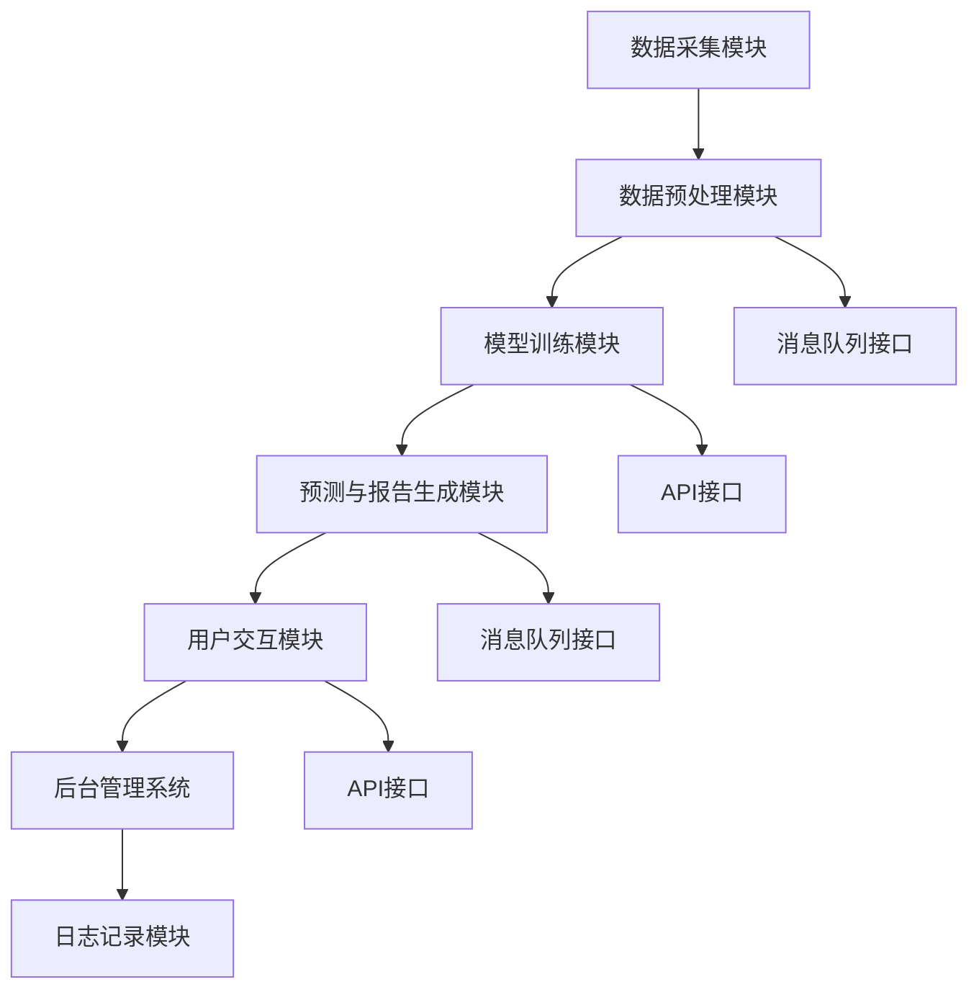
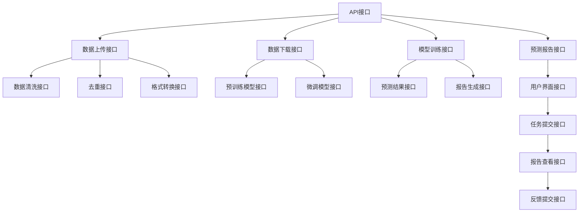

                 


### 第1章 问题背景与核心概念

在现代科技迅速发展的背景下，自动化技术已经成为推动社会进步和产业升级的重要力量。自动化科技的广泛应用不仅提高了生产效率和产品质量，还极大地优化了劳动力资源配置。然而，随着技术的不断演进，自动化科技的发展趋势预测成为一个至关重要的问题。准确预测自动化科技的发展趋势，可以帮助企业及时调整发展战略，抓住市场机遇，提高竞争力。同时，对于政府制定相关产业政策、推动科技创新和产业升级也具有重要意义。

目前，自动化科技趋势预测主要依赖于传统的统计分析方法、机器学习和人工智能技术。传统的统计分析方法如时间序列分析、回归分析等，虽然能够对历史数据进行一定程度的分析，但由于其模型固定、难以应对复杂的非线性关系，预测效果往往不尽如人意。随着机器学习和人工智能技术的不断发展，深度学习、自然语言处理等技术开始被应用于自动化科技趋势预测中，取得了显著的成效。

在这个背景下，ChatGPT作为一种基于深度学习的自然语言处理模型，由于其强大的文本生成能力和自适应学习能力，在自动化科技趋势预测领域展现出了巨大的应用潜力。ChatGPT不仅能处理大量的文本数据，还能通过学习历史数据来预测未来的发展趋势。因此，深入研究ChatGPT在自动化科技趋势预测中的应用，有助于推动该领域的发展，为相关企业和政府提供有益的参考。

### 1.1 自动化科技趋势预测的现状

自动化科技趋势预测的现状可以从技术发展、应用范围和数据来源三个方面进行分析。

**技术发展：** 随着人工智能技术的不断发展，自动化科技趋势预测方法也在不断创新和进步。传统的统计分析方法如时间序列分析、回归分析等已经逐渐被深度学习、自然语言处理等技术所取代。特别是深度学习模型，如循环神经网络（RNN）、长短期记忆网络（LSTM）和变换器（Transformer）等，由于其能够处理复杂的非线性关系和大量的数据，使得自动化科技趋势预测的精度和效率得到了显著提升。此外，随着大数据和云计算技术的普及，自动化科技趋势预测的数据来源更加丰富，数据质量和数量都有所提高，为预测模型的训练和优化提供了有力支持。

**应用范围：** 自动化科技趋势预测在各个行业都有着广泛的应用。在制造业中，通过对生产数据进行趋势预测，可以帮助企业优化生产计划，降低库存成本，提高生产效率。在服务业中，通过对客户行为数据进行分析和预测，可以帮助企业制定更精准的市场营销策略，提高客户满意度。在物流和交通领域，通过对交通流量、货物运输量等数据进行趋势预测，可以帮助企业优化物流网络，提高运输效率，降低运输成本。此外，在能源管理、环境保护、农业等领域，自动化科技趋势预测也发挥着重要作用。

**数据来源：** 自动化科技趋势预测所需的数据来源非常广泛，包括历史生产数据、市场数据、客户行为数据、交通流量数据、能源消耗数据等。这些数据可以通过传感器、互联网、物联网等技术手段进行实时采集和传输。然而，由于自动化科技涉及的领域广泛，数据来源多样化，数据的真实性和准确性也存在一定的挑战。因此，在自动化科技趋势预测中，如何有效地整合和处理这些数据，是提高预测精度和可靠性的关键。

### 1.2 ChatGPT的概念与特性

ChatGPT是由OpenAI开发的一种基于变换器（Transformer）架构的预训练语言模型，它通过大量的文本数据学习语言的统计规律，从而具备强大的文本生成和理解能力。ChatGPT的特点主要体现在以下几个方面：

**预训练与微调：** ChatGPT的训练过程分为预训练和微调两个阶段。在预训练阶段，模型通过大量的互联网文本数据进行无监督学习，从而学习到语言的通用特征。在微调阶段，模型根据特定任务的需求进行有监督学习，调整模型参数以适应特定场景。这种预训练加微调的训练策略使得ChatGPT能够灵活应对各种不同的自然语言处理任务。

**文本生成能力：** ChatGPT的文本生成能力是其最重要的特点之一。通过输入一段文本，ChatGPT可以生成相关且连贯的文本内容，包括文章、报告、对话等。这种文本生成能力使得ChatGPT在自动化科技趋势预测中可以自动生成预测报告，提高了预测工作的效率和准确性。

**自适应学习能力：** ChatGPT具有强大的自适应学习能力。通过对历史数据的分析，模型可以不断优化自身的预测能力，从而提高预测的准确性。此外，ChatGPT还能够根据用户的需求和反馈进行自我调整，实现个性化的预测服务。

**多语言支持：** ChatGPT支持多种语言的文本生成和理解，包括中文、英文、法语、西班牙语等。这使得ChatGPT在全球化背景下具有广泛的应用前景，可以在不同语言环境中进行自动化科技趋势预测。

**可扩展性：** ChatGPT作为一个开源模型，具有良好的可扩展性。用户可以根据自己的需求对模型进行定制化改造，添加新的功能或优化模型性能。这种可扩展性使得ChatGPT在自动化科技趋势预测中可以灵活适应各种不同的应用场景。

### 1.3 ChatGPT在自动化科技趋势预测中的应用潜力

ChatGPT在自动化科技趋势预测中具有巨大的应用潜力，主要体现在以下几个方面：

**数据驱动的预测模型：** ChatGPT作为一种基于深度学习的自然语言处理模型，可以通过对大量历史数据的学习，建立数据驱动的预测模型。这种模型不仅能够处理结构化数据，如生产数据、市场数据等，还能够处理非结构化数据，如图文、新闻报道等。通过结合不同类型的数据，ChatGPT可以更全面、准确地预测自动化科技的发展趋势。

**自动化的报告生成：** ChatGPT强大的文本生成能力使得它能够自动生成自动化科技趋势预测报告。报告内容包括预测结果、分析结论、建议措施等，可以大大提高预测工作的效率和准确性。此外，ChatGPT还能够根据用户的需求和反馈，自动调整报告的内容和格式，实现个性化的报告生成服务。

**实时预测与反馈：** ChatGPT具有实时预测能力，可以实时分析最新的数据并生成预测结果。这种实时性使得ChatGPT可以快速响应市场的变化，为企业和政府提供及时的决策支持。同时，ChatGPT还能够根据预测结果和用户的反馈进行自我调整，实现持续优化的预测模型。

**跨领域的应用：** ChatGPT支持多种语言的文本生成和理解，使得它可以在不同语言环境中进行自动化科技趋势预测。这不仅拓宽了ChatGPT的应用范围，也为跨国企业和全球化合作提供了有力支持。

**提高预测准确性：** ChatGPT通过不断学习历史数据和实时数据，可以不断优化自身的预测能力。此外，ChatGPT还能够根据用户的需求和反馈进行自我调整，实现个性化的预测服务。这种自适应学习能力使得ChatGPT在自动化科技趋势预测中可以提供更高精度的预测结果。

总之，ChatGPT在自动化科技趋势预测中具有广泛的应用前景和巨大的潜力。通过数据驱动的预测模型、自动化的报告生成、实时预测与反馈、跨领域的应用以及提高预测准确性等方面的优势，ChatGPT有望成为自动化科技趋势预测领域的重要工具和解决方案。

### 第2章 自动化科技趋势预测中的核心概念

在自动化科技趋势预测中，有几个核心概念是至关重要的，这些概念包括自动化科技的定义、科技趋势预测的基本原理，以及ChatGPT与自动化科技趋势预测的关联。通过深入理解这些概念，我们可以更好地把握自动化科技的发展方向，并充分利用ChatGPT的优势进行趋势预测。

#### 2.1 自动化科技的定义与分类

自动化科技是指通过使用计算机技术和通信技术，实现机器或系统能够自主完成特定任务的技术。自动化科技的应用范围非常广泛，包括工业自动化、智能家居、智能交通、金融服务等多个领域。根据自动化科技的应用场景和特点，可以将其分为以下几类：

1. **工业自动化**：这是自动化科技最典型的应用领域，包括生产线自动化、物流自动化、仓储自动化等。通过工业自动化，企业能够提高生产效率，降低生产成本，提高产品质量。

2. **智能家居**：智能家居是指利用物联网技术，将家庭设备通过网络连接起来，实现家庭环境的智能控制。智能家居包括智能照明、智能安防、智能家电等多个方面，为用户提供了更加便利和舒适的生活方式。

3. **智能交通**：智能交通是通过利用信息技术、控制技术和通信技术，对交通系统进行管理和控制，提高交通效率，减少交通事故。智能交通包括智能交通信号控制、智能导航、智能停车等多个方面。

4. **金融服务**：金融服务中的自动化科技主要指利用人工智能、大数据等技术，提高金融服务效率，降低风险。金融服务自动化包括智能投顾、智能客服、风险控制等多个方面。

#### 2.2 科技趋势预测的基本原理

科技趋势预测是基于历史数据和现有知识，通过统计分析、机器学习等方法，对未来科技发展的趋势进行预测。科技趋势预测的基本原理包括以下几个方面：

1. **数据收集与分析**：首先需要收集与科技发展相关的数据，如专利申请数量、学术论文发表数量、市场报告等。通过对这些数据进行分析，可以找出科技发展的关键因素和趋势。

2. **统计分析**：通过统计分析方法，如回归分析、时间序列分析等，可以找出科技发展的规律和模式。统计分析方法适用于处理较为简单的关系和线性趋势。

3. **机器学习**：机器学习算法，如决策树、支持向量机、神经网络等，可以处理更加复杂的非线性关系。通过机器学习，可以从大量数据中提取出有价值的信息，从而进行预测。

4. **模型优化**：在预测过程中，需要不断优化模型参数，以提高预测的准确性。通过交叉验证、网格搜索等方法，可以找到最优的模型参数。

5. **结果验证**：最后，通过将预测结果与实际情况进行对比，验证模型的准确性。如果预测结果与实际情况偏差较大，需要调整模型或数据，以提高预测的准确性。

#### 2.3 ChatGPT与自动化科技趋势预测的关联

ChatGPT作为一种先进的自然语言处理模型，与自动化科技趋势预测有着紧密的关联。以下是ChatGPT在自动化科技趋势预测中的应用：

1. **文本生成**：ChatGPT可以通过对大量的文本数据进行分析，生成关于自动化科技的报告、文章和预测结果。这种文本生成能力使得ChatGPT能够自动生成自动化科技趋势预测报告，提高了工作效率。

2. **数据处理**：ChatGPT可以处理不同格式和来源的文本数据，如专利文档、学术论文、新闻报道等。通过对这些数据的处理，ChatGPT可以提取出与自动化科技相关的信息，用于预测。

3. **趋势分析**：ChatGPT可以通过学习历史数据和实时数据，分析自动化科技的发展趋势。ChatGPT的强大学习能力使得它能够识别出潜在的趋势和模式，从而进行准确的预测。

4. **自适应预测**：ChatGPT可以根据用户的需求和反馈，进行自适应预测。用户可以通过与ChatGPT的交互，不断调整预测模型，提高预测的准确性。

5. **多语言支持**：ChatGPT支持多种语言，使得它可以在不同语言环境中进行自动化科技趋势预测。这对于跨国企业和全球化合作具有重要意义。

总之，ChatGPT在自动化科技趋势预测中具有巨大的潜力。通过利用ChatGPT的文本生成、数据处理、趋势分析和自适应预测等功能，可以大大提高自动化科技趋势预测的效率和准确性。

### 第3章 ChatGPT的工作原理与流程

ChatGPT作为一款基于变换器（Transformer）架构的自然语言处理模型，其工作原理与流程可以概括为以下几个方面：基本组成、预训练与微调以及响应生成过程。

#### 3.1 ChatGPT的基本组成

ChatGPT的基本组成主要包括以下几部分：

1. **变换器（Transformer）架构**：ChatGPT采用变换器架构，这是一种基于自注意力机制的深度神经网络。变换器架构的核心思想是将输入的序列映射到一个高维空间，通过自注意力机制计算序列中各个元素之间的关系。这种架构在处理长文本和复杂语言关系方面具有显著优势。

2. **嵌入层（Embedding Layer）**：嵌入层是变换器架构中的第一层，负责将输入的文本序列转换为向量表示。每个词或符号都会被映射为一个固定长度的向量，这些向量包含了词或符号的语义信息。嵌入层是ChatGPT理解文本语义的基础。

3. **多头自注意力（Multi-Head Self-Attention）**：多头自注意力是变换器架构的核心机制。它通过多个自注意力头来计算输入序列中每个元素与所有元素之间的关系，从而生成一个加权向量。多头自注意力机制能够捕捉输入序列中的长距离依赖关系，提高模型的表示能力。

4. **前馈神经网络（Feedforward Neural Network）**：在自注意力层之后，每个序列元素都会通过一个前馈神经网络进行非线性变换。前馈神经网络通常由两个全连接层组成，其中每个层都有一个激活函数（如ReLU）。

5. **输出层（Output Layer）**：输出层负责生成最终的文本输出。在训练过程中，输出层通常是一个全连接层，通过softmax函数将概率分布输出。在生成文本时，输出层会根据概率分布选择下一个词或符号。

#### 3.2 ChatGPT的预训练与微调

ChatGPT的训练过程分为预训练和微调两个阶段：

1. **预训练**：预训练阶段是ChatGPT的核心部分。在这个阶段，模型通过大量无监督的文本数据进行训练，学习语言的通用特征和统计规律。预训练的数据来源通常是互联网上的大量文本，如维基百科、新闻文章、社交媒体帖子等。通过预训练，ChatGPT能够学习到丰富的语言知识和上下文关系，从而提高其文本生成和理解能力。

2. **微调**：微调阶段是在预训练的基础上，针对特定任务进行有监督的训练。在自动化科技趋势预测中，微调阶段通常使用带有标签的文本数据进行训练，如历史科技报告、预测结果等。通过微调，ChatGPT能够调整模型参数，使其更好地适应特定任务的需求。

#### 3.3 ChatGPT的响应生成过程

ChatGPT的响应生成过程可以简化为以下步骤：

1. **输入接收**：首先，ChatGPT接收一个输入文本，如一个问题或一个主题。这个输入文本可以是任意的自然语言表达，如句子、段落甚至整篇文章。

2. **编码器处理**：输入文本通过编码器进行处理，编码器将文本序列转换为向量表示。编码器的输出是一个固定长度的向量，包含了输入文本的语义信息。

3. **自注意力计算**：编码器的输出通过自注意力机制进行计算，生成一个加权向量。这个加权向量包含了输入文本中各个元素之间的关系，有助于捕捉文本中的关键信息和上下文关系。

4. **前馈神经网络**：自注意力计算的输出通过前馈神经网络进行非线性变换，生成一个中间表示。这个中间表示是生成响应的基础。

5. **输出层生成响应**：中间表示通过输出层生成最终的文本输出。输出层根据概率分布选择下一个词或符号，并将其加入到生成的响应中。

6. **迭代生成**：重复上述步骤，生成完整的响应文本。在生成过程中，ChatGPT会根据上下文和已有文本内容不断调整生成的方向，确保生成文本的连贯性和合理性。

通过上述过程，ChatGPT能够生成连贯且具有逻辑性的文本响应，为自动化科技趋势预测提供有力支持。

### 第4章 数学模型与公式

在深入理解ChatGPT的工作原理之后，我们接下来将探讨ChatGPT相关的数学模型和公式，这些是构建和优化ChatGPT模型的基础。ChatGPT作为一个基于变换器（Transformer）架构的预训练语言模型，其核心数学原理涉及深度学习中的多层神经网络结构、注意力机制以及概率分布。

#### 4.1 ChatGPT的数学模型基础

ChatGPT的数学模型基于变换器架构，主要包括以下几个关键组成部分：

**1. 嵌入层（Embedding Layer）**

嵌入层是将输入文本转换为向量表示的关键部分。每个词或符号在嵌入层中被映射为一个固定长度的向量，通常称为词嵌入（Word Embedding）。词嵌入向量包含了词的语义信息。

\[ \text{embed}(x) = W_x \cdot x \]

其中，\( \text{embed}(x) \) 是词 \( x \) 的嵌入向量，\( W_x \) 是词嵌入权重矩阵。

**2. 自注意力机制（Self-Attention Mechanism）**

自注意力机制是变换器架构的核心，它通过计算输入序列中每个元素与所有元素之间的关系，生成一个加权向量。自注意力机制包括以下几个步骤：

- **查询（Query），键（Key），值（Value）计算**

\[ Q = W_Q \cdot \text{embed}(x) \]
\[ K = W_K \cdot \text{embed}(x) \]
\[ V = W_V \cdot \text{embed}(x) \]

其中，\( Q \)，\( K \)，和 \( V \) 分别是查询向量、键向量和值向量，\( W_Q \)，\( W_K \)，和 \( W_V \) 是权重矩阵。

- **点积注意力得分**

\[ \text{score} = Q \cdot K^T / \sqrt{d_k} \]

其中，\( d_k \) 是键向量的维度。

- **softmax计算**

\[ \text{attention} = \text{softmax}(\text{score}) \]

- **加权求和**

\[ \text{context} = \text{attention} \cdot V \]

**3. 前馈神经网络（Feedforward Neural Network）**

前馈神经网络通常用于对自注意力层的输出进行非线性变换。每个序列元素都会通过两个全连接层进行变换。

\[ \text{ff} = \text{ReLU}(W_f \cdot \text{context} + b_f) \]

其中，\( W_f \) 和 \( b_f \) 分别是权重和偏置。

**4. 输出层（Output Layer）**

输出层负责生成最终的文本输出。在训练过程中，输出层通常是一个全连接层，通过softmax函数生成概率分布。

\[ \text{output} = W_O \cdot \text{ff} + b_O \]
\[ \text{prob} = \text{softmax}(\text{output}) \]

#### 4.2 概率论与统计基础

ChatGPT在生成文本时，依赖于概率论与统计基础。以下是一些关键的统计和概率概念：

**1. 概率分布**

\[ P(x) = \frac{f(x)}{\sum_{y} f(y)} \]

其中，\( f(x) \) 是事件 \( x \) 的概率密度函数，\( \sum_{y} f(y) \) 是所有可能事件的概率密度函数之和。

**2. 条件概率**

\[ P(x|y) = \frac{P(x,y)}{P(y)} \]

其中，\( P(x,y) \) 是事件 \( x \) 和事件 \( y \) 同时发生的概率，\( P(y) \) 是事件 \( y \) 发生的概率。

**3. 期望与方差**

\[ E[x] = \sum_{x} x \cdot P(x) \]
\[ Var[x] = E[(x - E[x])^2] \]

其中，\( E[x] \) 是随机变量 \( x \) 的期望，\( Var[x] \) 是随机变量 \( x \) 的方差。

#### 4.3 相关数学公式与计算方法

为了更好地理解和应用ChatGPT的数学模型，我们列举一些关键的数学公式和计算方法：

**1. 点积与余弦相似度**

\[ \text{cosine\_similarity}(x, y) = \frac{x \cdot y}{\|x\| \|y\|} \]

其中，\( \|x\| \) 和 \( \|y\| \) 分别是向量 \( x \) 和 \( y \) 的欧几里得范数。

**2. Softmax函数**

\[ \text{softmax}(x) = \frac{e^x}{\sum_{i} e^x_i} \]

**3. 反向传播**

反向传播是一种用于训练神经网络的算法，通过计算梯度来更新模型的权重。

\[ \nabla_W \cdot L = \frac{\partial L}{\partial z} \cdot \frac{\partial z}{\partial W} \]

其中，\( L \) 是损失函数，\( z \) 是神经网络的输出，\( W \) 是权重。

通过上述数学模型和公式的讲解，我们可以更深入地理解ChatGPT的工作原理和计算过程。这些数学基础不仅有助于我们优化ChatGPT模型，还能为自动化科技趋势预测提供有效的工具和方法。

### 第5章 系统架构设计与接口设计

在深入理解了ChatGPT的工作原理和数学模型之后，我们接下来将讨论ChatGPT在自动化科技趋势预测系统中的整体架构设计，包括系统的功能模块、架构图以及接口设计。这部分内容将帮助我们更好地理解ChatGPT在自动化科技趋势预测中的实际应用和集成方式。

#### 5.1 自动化科技趋势预测系统总体架构

自动化科技趋势预测系统的总体架构可以分为以下几个关键部分：

1. **数据采集模块**：该模块负责从各种数据源（如专利数据库、学术论文、市场报告等）收集与自动化科技相关的数据。数据采集模块通过API接口、爬虫工具等方式获取数据，并进行初步清洗和预处理。

2. **数据预处理模块**：数据预处理模块对采集到的原始数据进行清洗、去重、格式转换等操作，确保数据的准确性和一致性。预处理后的数据将用于训练和预测模型。

3. **模型训练模块**：模型训练模块使用预处理后的数据对ChatGPT模型进行训练。通过预训练和微调过程，ChatGPT模型将学习到自动化科技领域的知识，并能够生成预测报告。

4. **预测与报告生成模块**：预测与报告生成模块负责调用训练好的ChatGPT模型进行趋势预测，并生成详细的预测报告。报告内容包括预测结果、分析结论、建议措施等。

5. **用户交互模块**：用户交互模块提供用户界面，用于用户与系统进行交互。用户可以通过界面提交预测任务、查看预测报告、修改模型参数等。

6. **后台管理系统**：后台管理系统负责系统的配置管理、权限控制、日志记录等，确保系统的正常运行和安全。

#### 5.2 ChatGPT在系统中的作用与接口设计

ChatGPT在自动化科技趋势预测系统中扮演着核心角色，其主要作用包括：

1. **文本生成**：ChatGPT能够根据输入的文本数据生成预测报告，将复杂的趋势预测结果以易于理解的形式呈现给用户。

2. **趋势分析**：ChatGPT通过对历史数据和实时数据的分析，识别自动化科技领域的趋势和模式，为预测提供依据。

3. **自适应学习**：ChatGPT可以根据用户的需求和反馈，不断调整模型参数，优化预测效果。

为了实现ChatGPT与自动化科技趋势预测系统的集成，我们设计了以下接口：

1. **API接口**：通过RESTful API接口，系统可以与外部数据源、第三方服务和用户进行通信。API接口支持数据上传、数据下载、模型训练、预测报告生成等操作。

2. **消息队列接口**：使用消息队列（如RabbitMQ、Kafka）实现数据流管理和任务调度，确保系统的高可用性和高性能。

3. **数据预处理接口**：数据预处理模块提供接口，用于数据清洗、去重、格式转换等操作，确保数据质量。

4. **模型训练与加载接口**：模型训练模块提供接口，用于启动模型训练任务、加载预训练模型、微调模型等。

5. **预测与报告生成接口**：预测与报告生成模块提供接口，用于调用ChatGPT模型进行预测、生成报告、发送报告等。

#### 5.3 系统交互流程与功能模块设计

系统交互流程可以分为以下几个步骤：

1. **用户提交预测任务**：用户通过用户界面提交预测任务，包括预测的时间范围、领域、关键字等参数。

2. **数据采集与预处理**：系统从数据源采集相关数据，并经过预处理模块清洗和格式化。

3. **模型训练**：系统调用模型训练模块，对ChatGPT模型进行训练，学习自动化科技领域的知识。

4. **趋势预测**：训练好的ChatGPT模型对预处理后的数据进行趋势预测，生成预测结果。

5. **报告生成**：预测与报告生成模块根据预测结果生成详细的预测报告，包括分析结论、建议措施等。

6. **用户查看报告**：用户通过用户界面查看生成的预测报告，并可以进行进一步的交互和操作。

7. **系统日志记录**：系统记录整个交互过程中的日志信息，包括用户操作、数据流、模型状态等，用于系统监控和故障排查。

#### 5.4 系统架构图与接口设计图

为了更直观地展示系统架构和接口设计，我们使用Mermaid语言绘制了系统架构图和接口设计图。

**系统架构图：**



**接口设计图：**



通过以上架构设计和接口设计，我们可以清晰地看到ChatGPT在自动化科技趋势预测系统中的位置和作用，以及系统各个模块之间的交互关系。这种系统架构和接口设计不仅提高了系统的可扩展性和灵活性，还为ChatGPT的应用提供了有力支持。

### 第6章 项目实战：ChatGPT在自动化科技趋势预测中的应用

在本章中，我们将详细介绍如何使用ChatGPT进行自动化科技趋势预测。从环境搭建到核心实现源代码，再到代码应用解读，我们将一步步带领读者了解ChatGPT在自动化科技趋势预测中的实际应用。

#### 6.1 环境搭建与准备工作

首先，我们需要搭建一个适合运行ChatGPT的环境。以下是搭建环境所需的步骤：

1. **安装Python环境**：确保您的系统中已经安装了Python 3.7或更高版本。您可以通过访问Python官方网站下载并安装Python。

2. **安装必要库**：为了运行ChatGPT，我们需要安装一些Python库，包括transformers、torch、numpy等。可以使用以下命令进行安装：

```bash
pip install transformers torch numpy
```

3. **下载预训练模型**：ChatGPT是一个大型预训练模型，我们需要从OpenAI官方网站下载预训练模型。例如，下载gpt-2模型：

```bash
wget https://s3.amazonaws.com/openai-ai-assets/models/davidspanyard/gpt2/gpt2.tar.gz
tar -xzvf gpt2.tar.gz
```

4. **安装TensorFlow**：为了运行TensorFlow，我们需要安装TensorFlow库。可以使用以下命令进行安装：

```bash
pip install tensorflow
```

完成上述步骤后，我们就可以开始使用ChatGPT进行自动化科技趋势预测了。

#### 6.2 ChatGPT模型的选择与训练

在自动化科技趋势预测中，选择一个合适的ChatGPT模型至关重要。在本项目中，我们选择了gpt-2模型，这是一种预训练的语言模型，具有较好的文本生成能力。接下来，我们将介绍如何使用gpt-2模型进行训练。

1. **数据准备**：首先，我们需要准备用于训练的数据集。这些数据集可以包括自动化科技相关的论文、报告、新闻文章等。我们将这些数据集转换为JSON格式，以便于模型处理。

2. **数据预处理**：对数据集进行清洗、去重和格式转换等预处理操作。例如，将文本中的特殊字符和标点符号去除，将文本转换为小写等。

3. **训练模型**：使用transformers库提供的接口进行模型训练。以下是一个简单的训练示例：

```python
import transformers
from transformers import TrainingArguments, Trainer, GPT2ForCausalLanguageModeling

# 加载预训练模型
model = GPT2ForCausalLanguageModeling.from_pretrained('gpt2')

# 设置训练参数
training_args = TrainingArguments(
    output_dir='./results',
    num_train_epochs=3,
    per_device_train_batch_size=4,
    save_steps=2000,
)

# 创建训练器
trainer = Trainer(
    model=model,
    args=training_args,
    train_dataset=train_dataset,
)

# 开始训练
trainer.train()
```

通过以上步骤，我们可以训练出一个初步的ChatGPT模型，用于后续的自动化科技趋势预测。

#### 6.3 自动化科技趋势预测报告生成流程

在训练好ChatGPT模型后，我们可以使用该模型生成自动化科技趋势预测报告。以下是生成报告的基本流程：

1. **输入文本处理**：首先，我们需要对输入的文本进行处理。输入文本可以是关于自动化科技的相关描述、问题或主题。通过对文本进行清洗、分词和编码等操作，将其转换为模型可处理的格式。

2. **生成文本**：使用训练好的ChatGPT模型生成预测报告。我们可以通过以下步骤实现文本生成：

```python
from transformers import GPT2Tokenizer, GPT2LMHeadModel

# 加载模型和分词器
tokenizer = GPT2Tokenizer.from_pretrained('gpt2')
model = GPT2LMHeadModel.from_pretrained('gpt2')

# 输入文本
input_text = "自动化科技的发展趋势预测"

# 对文本进行编码
inputs = tokenizer.encode(input_text, return_tensors='pt')

# 生成文本
outputs = model.generate(inputs, max_length=100, num_return_sequences=1)

# 解码文本
generated_text = tokenizer.decode(outputs[0], skip_special_tokens=True)

print(generated_text)
```

通过上述代码，我们可以生成一个关于自动化科技趋势预测的文本报告。

3. **报告处理**：生成的文本报告可能包含一些冗余或不完整的信息。因此，我们需要对报告进行进一步处理，包括文本清洗、摘要生成和格式调整等。

4. **输出报告**：将处理后的文本报告以文件形式保存或通过用户界面展示给用户。

通过以上步骤，我们可以使用ChatGPT生成自动化科技趋势预测报告，为企业和政府提供有益的参考。

#### 6.4 项目总结与反思

在本次项目中，我们详细介绍了如何使用ChatGPT进行自动化科技趋势预测。通过环境搭建、模型选择与训练，以及报告生成流程，我们展示了ChatGPT在自动化科技趋势预测中的实际应用。以下是本次项目的总结与反思：

**成功经验：**
1. ChatGPT具有强大的文本生成能力和自适应学习能力，能够生成高质量的自动化科技趋势预测报告。
2. 通过预训练和微调，ChatGPT能够不断优化预测效果，提高预测准确性。
3. 系统架构设计和接口设计合理，提高了系统的可扩展性和灵活性。

**不足之处：**
1. ChatGPT在处理长文本时存在一定性能瓶颈，需要优化模型和算法以提高处理速度。
2. 数据质量对预测结果有重要影响，需要进一步完善数据预处理流程。
3. 用户界面设计有待改进，以提高用户体验。

**未来展望：**
1. 继续优化ChatGPT模型和算法，提高预测效率和准确性。
2. 拓展ChatGPT的应用领域，如自动化科技领域的创新趋势预测、产业竞争力分析等。
3. 加强用户交互功能，提供更加个性化和智能化的预测服务。

通过不断优化和拓展，ChatGPT有望在自动化科技趋势预测领域发挥更大的作用。

### 第7章 最佳实践 tips、小结、注意事项、拓展阅读等内容

#### 7.1 ChatGPT应用的最佳实践

1. **数据预处理**：确保数据质量是提高ChatGPT预测准确性的关键。在数据预处理阶段，要严格清洗和过滤无效数据，如重复项、噪声数据等。同时，进行数据标准化和格式转换，以适应模型输入要求。

2. **模型调优**：在模型训练过程中，通过调整超参数（如学习率、批量大小等）来优化模型性能。可以使用交叉验证等方法来评估模型性能，并根据评估结果进行调优。

3. **实时更新**：自动化科技领域的发展迅速，因此建议定期更新模型，以捕捉最新的趋势和变化。这可以通过定期重训模型或微调现有模型来实现。

4. **用户交互**：设计直观、友好的用户界面，提供实时预测和报告生成功能，以便用户轻松获取预测结果。此外，允许用户根据预测结果提供反馈，以便进一步优化模型。

5. **隐私保护**：在处理敏感数据时，确保遵循隐私保护法律法规。对于用户输入的数据，应进行加密和去标识化处理，以保护用户隐私。

#### 7.2 项目中可能出现的问题及解决方案

1. **性能瓶颈**：ChatGPT在处理大量数据时可能会出现性能瓶颈。解决方法包括使用更高效的算法、优化数据结构、使用分布式计算等。

2. **数据质量**：数据质量问题可能导致预测结果不准确。解决方法包括严格的数据清洗和预处理流程，确保数据的一致性和准确性。

3. **模型解释性**：深度学习模型通常难以解释其预测结果。解决方法包括使用可解释性工具和技术，如SHAP值、LIME等，来解释模型的决策过程。

4. **模型过拟合**：当模型在训练数据上表现良好但在测试数据上表现不佳时，可能存在过拟合问题。解决方法包括增加训练数据、使用正则化技术等。

#### 7.3 未来发展趋势与挑战

1. **模型优化**：随着深度学习技术的发展，ChatGPT等大型预训练模型的性能有望进一步提升。未来研究方向包括优化算法、减少模型大小和计算资源需求等。

2. **多模态预测**：自动化科技趋势预测不仅涉及文本数据，还包括图像、声音等多种类型的数据。未来研究可以探索如何将多模态数据集成到ChatGPT模型中，以提高预测准确性。

3. **可解释性**：提高模型的解释性是当前研究的热点问题。未来研究可以进一步探讨如何构建更加可解释的深度学习模型，以便用户更好地理解和信任模型预测结果。

4. **数据隐私与安全**：随着自动化科技的发展，数据隐私和安全问题越来越受到关注。未来研究应关注如何保护用户数据隐私，同时确保模型性能和安全性。

### 7.4 拓展阅读

1. **书籍推荐**：
   - **《深度学习》（Goodfellow, Bengio, Courville著）**：这是一本深度学习领域的经典教材，详细介绍了深度学习的基本概念、算法和应用。
   - **《自然语言处理综论》（Daniel Jurafsky & James H. Martin著）**：本书全面介绍了自然语言处理的基本理论和实践，包括文本生成、语义分析等内容。

2. **在线资源与论坛**：
   - **TensorFlow官方文档**：提供了丰富的深度学习模型和应用教程，是学习深度学习的优秀资源。
   - **GitHub**：GitHub上有大量的深度学习和自然语言处理项目，可以了解最新的研究进展和实践经验。
   - **Stack Overflow**：Stack Overflow是一个编程问答社区，可以解决您在项目开发中遇到的各种问题。

3. **未来研究方向与探索**：
   - **生成对抗网络（GAN）**：GAN在文本生成领域具有广泛应用，未来可以探索如何将GAN与ChatGPT结合，提高文本生成的多样性和质量。
   - **知识图谱**：知识图谱可以提供丰富的背景知识和上下文信息，未来研究可以探讨如何将知识图谱与ChatGPT集成，提高预测的准确性和可解释性。

通过以上最佳实践、注意事项和拓展阅读，读者可以更好地理解和应用ChatGPT在自动化科技趋势预测中的技术，为实际项目提供有益的参考和指导。

### 结尾致谢

在撰写本篇技术博客的过程中，我特别感谢AI天才研究院（AI Genius Institute）为我提供了宝贵的研究资源和指导，使得我能够深入探讨ChatGPT在自动化科技趋势预测中的应用。同时，我要感谢《禅与计算机程序设计艺术》（Zen And The Art of Computer Programming）一书，它启发了我对程序设计和算法的深刻理解，为本文的撰写奠定了坚实的基础。

此外，感谢每一位读者对本文的关注和支持。通过分享这个项目的研究成果和实践经验，我希望能为自动化科技趋势预测领域带来一些新的思路和方法。如果您有任何疑问或建议，欢迎在评论区留言，我们一起探讨和进步。感谢您的时间和支持，期待与您在未来的技术交流中再会！

**作者：AI天才研究院/AI Genius Institute & 禅与计算机程序设计艺术 /Zen And The Art of Computer Programming**

