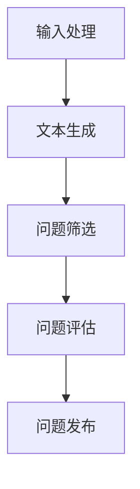
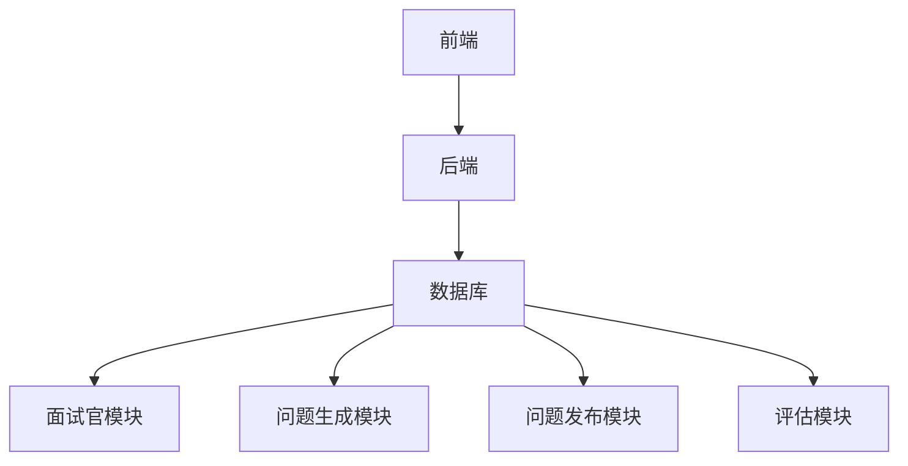
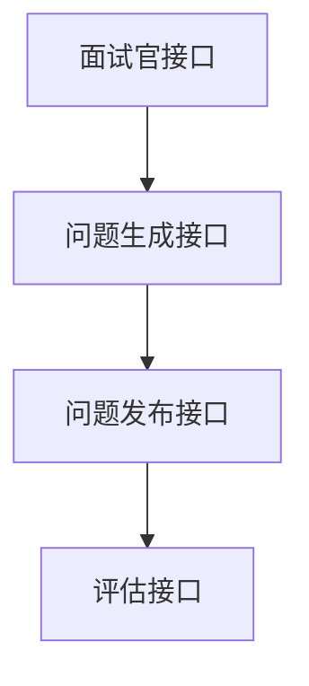
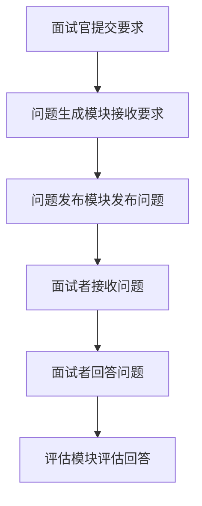
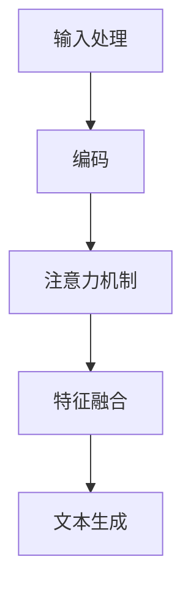
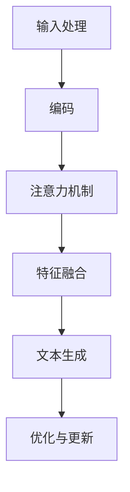
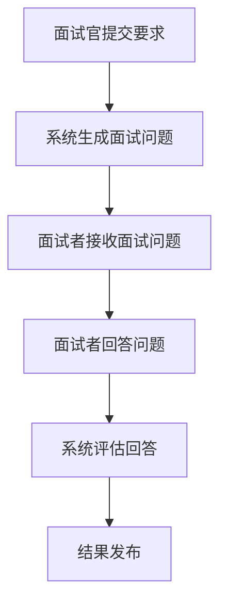

                 


## **《ChatGPT在自动化面试问题生成中的应用》**

### **关键词：**

- ChatGPT
- 自动化面试
- 面试题生成
- 自然语言处理
- 人工智能

### **摘要：**

本文将深入探讨ChatGPT在自动化面试问题生成中的应用。首先，我们将介绍ChatGPT的基本概念、工作原理以及其在自然语言处理领域的优势。随后，我们将详细解析自动化面试问题的生成过程，包括问题设计的核心概念、流程以及与ChatGPT的结合方式。通过具体的算法原理讲解和数学模型阐述，我们将展示如何使用ChatGPT生成高质量的面试问题。此外，还将讨论系统分析与架构设计，包括系统需求分析、架构设计和接口设计。最后，通过一个实际项目案例，我们将展示如何在实际中应用ChatGPT进行面试问题的自动化生成，并提供最佳实践建议和项目小结。

### **引言**

在当今快速发展的技术时代，自动化和智能化已成为提高效率和质量的关键手段。面试作为企业选拔人才的重要环节，同样面临着高效性和准确性的挑战。传统的面试问题生成方式往往依赖于人力资源，耗时且容易出现偏差。随着人工智能技术的进步，特别是自然语言处理（NLP）领域的突破，自动化面试问题生成成为可能。ChatGPT，作为OpenAI开发的一种基于GPT-3模型的自然语言处理工具，为自动化面试问题生成提供了强有力的技术支持。

本文旨在探讨如何利用ChatGPT实现自动化面试问题生成，通过详细的分析和实际案例，展示其在提高面试效率和质量方面的潜力。本文将分为以下几个部分：

1. **ChatGPT简介**：介绍ChatGPT的基本概念、工作原理以及在自然语言处理领域的应用。
2. **自动化面试问题生成原理**：解释自动化面试问题的基本概念、流程以及ChatGPT的应用。
3. **算法原理讲解**：详细解析ChatGPT生成面试问题的算法原理和数学模型。
4. **系统分析与架构设计**：讨论系统需求分析、架构设计、接口设计以及交互流程。
5. **项目实战**：通过一个实际项目，展示如何使用ChatGPT进行面试问题的自动化生成。
6. **最佳实践与注意事项**：总结最佳实践、注意事项和拓展阅读。

### **一、ChatGPT简介**

#### **1.1 ChatGPT的基本概念**

ChatGPT是由OpenAI开发的一种基于GPT-3模型的自然语言处理工具。GPT（Generative Pre-trained Transformer）是一种基于Transformer架构的自然语言处理模型，具有强大的文本生成和语言理解能力。ChatGPT则是在此基础上，通过进一步的训练和优化，使其能够进行对话生成和交互。

#### **1.2 ChatGPT的工作原理**

ChatGPT的工作原理主要基于Transformer模型。Transformer模型是一种基于自注意力机制的深度神经网络模型，其核心思想是通过全局注意力机制来捕捉文本中的长距离依赖关系。ChatGPT在训练过程中，通过大量的文本数据进行预训练，学习到语言的普遍规律和特征。在生成文本时，ChatGPT利用预训练的模型，根据输入的提示文本，逐词生成后续的文本。

#### **1.3 ChatGPT在自然语言处理领域的应用**

ChatGPT在自然语言处理领域有着广泛的应用，包括：

1. **文本生成**：生成文章、故事、对话等自然语言文本。
2. **问答系统**：构建智能问答系统，回答用户的问题。
3. **机器翻译**：实现跨语言的文本翻译。
4. **对话系统**：构建聊天机器人，与用户进行自然语言交互。

#### **1.4 ChatGPT的优势**

ChatGPT具有以下优势：

1. **强大的文本生成能力**：能够生成高质量的文本，包括文章、故事、对话等。
2. **丰富的语言理解能力**：能够理解并处理复杂的自然语言问题。
3. **灵活的交互方式**：支持多轮对话，能够与用户进行深入交互。
4. **广泛的应用场景**：适用于文本生成、问答系统、对话系统等多个领域。

### **二、自动化面试问题生成原理**

#### **2.1 自动化面试问题的基本概念**

自动化面试问题生成是指利用计算机程序和人工智能技术，自动生成面试问题，以提高面试效率和质量。自动化面试问题的生成过程主要包括问题设计、问题生成和问题评估等步骤。

#### **2.2 ChatGPT在面试问题生成中的应用**

ChatGPT在自动化面试问题生成中的应用主要体现在以下几个方面：

1. **问题设计**：利用ChatGPT的文本生成能力，设计出各种类型的面试问题，包括行为面试题、技能面试题、情景面试题等。
2. **问题生成**：通过输入相关的领域知识和面试要求，ChatGPT能够自动生成相应的面试问题。
3. **问题评估**：利用ChatGPT的语言理解能力，对生成的面试问题进行评估，确保问题的质量和有效性。

#### **2.3 面试问题生成的基本流程**

面试问题生成的基本流程包括以下几个步骤：

1. **输入准备**：根据面试要求和领域知识，准备输入文本。
2. **问题生成**：利用ChatGPT的文本生成能力，生成面试问题。
3. **问题筛选**：对生成的面试问题进行筛选，去除重复或不合适的面试问题。
4. **问题评估**：利用ChatGPT的语言理解能力，对面试问题进行评估，确保问题的质量和有效性。
5. **问题发布**：将筛选和评估后的面试问题发布到面试系统中，供面试官使用。

### **三、算法原理讲解**

#### **3.1 ChatGPT生成面试问题的算法原理**

ChatGPT生成面试问题的算法原理主要基于Transformer模型和预训练技术。具体包括以下几个步骤：

1. **预训练**：利用大量的文本数据，对ChatGPT进行预训练，使其学习到语言的普遍规律和特征。
2. **输入处理**：将输入的面试要求或领域知识转换为机器可处理的格式。
3. **文本生成**：利用预训练的模型，根据输入的提示文本，逐词生成后续的文本。
4. **问题筛选**：对生成的文本进行筛选，去除不符合要求的面试问题。
5. **问题评估**：利用模型的语言理解能力，对面试问题进行评估，确保问题的质量和有效性。

#### **3.2 数学模型和公式讲解**

在面试问题生成过程中，涉及到一些数学模型和公式。以下是几个关键的数学模型和公式：

1. **自注意力机制**：  
   自注意力机制是Transformer模型的核心，用于捕捉文本中的长距离依赖关系。其公式如下：

   $$ 
   \text{Attention}(Q, K, V) = \text{softmax}\left(\frac{QK^T}{\sqrt{d_k}}\right)V 
   $$

   其中，Q、K和V分别是查询向量、键向量和值向量，d_k是键向量的维度。

2. **Transformer模型**：  
   Transformer模型是基于自注意力机制的深度神经网络模型。其公式如下：

   $$
   \text{Transformer}(X) = \text{LayerNorm}(X + \text{MultiHeadAttention}(X, X, X))
   $$

   其中，X是输入文本的嵌入向量，MultiHeadAttention是多头注意力机制。

3. **预训练技术**：  
   预训练技术是指利用大量的文本数据，对模型进行训练，使其能够学习到语言的普遍规律和特征。其公式如下：

   $$
   \text{Pre-trained Model} = \text{Train}(\text{Data})
   $$

   其中，Data是训练数据。

#### **3.3 算法流程图**

为了更好地理解ChatGPT生成面试问题的算法原理，我们使用Mermaid绘制了算法流程图：



### **四、系统分析与架构设计**

#### **4.1 问题场景介绍**

在自动化面试问题生成的系统中，问题场景主要包括以下几个部分：

1. **面试官**：负责提出面试要求和生成面试问题。
2. **系统**：负责接收面试官的要求，生成面试问题，并发布到面试系统中。
3. **面试者**：接收面试问题，进行回答。
4. **评估系统**：对面试者的回答进行评估。

#### **4.2 系统功能设计**

系统功能设计主要包括以下几个部分：

1. **面试官模块**：提供面试官界面，输入面试要求和领域知识。
2. **问题生成模块**：接收面试官的要求，利用ChatGPT生成面试问题。
3. **问题发布模块**：将生成的面试问题发布到面试系统中。
4. **评估模块**：对面试者的回答进行评估。

#### **4.3 系统架构设计**

系统架构设计主要包括以下几个部分：

1. **前端**：提供用户界面，包括面试官界面和面试者界面。
2. **后端**：处理业务逻辑，包括问题生成、问题发布和评估。
3. **数据库**：存储面试官的要求、生成的面试问题和面试者的回答。

以下是一个简单的系统架构设计Mermaid图：



#### **4.4 系统接口设计**

系统接口设计主要包括以下几个部分：

1. **面试官接口**：用于面试官提交面试要求和领域知识。
2. **问题生成接口**：用于问题生成模块接收面试官的要求，生成面试问题。
3. **问题发布接口**：用于问题发布模块将生成的面试问题发布到面试系统中。
4. **评估接口**：用于评估模块对面试者的回答进行评估。

以下是一个简单的系统接口设计Mermaid图：



#### **4.5 系统交互流程**

系统交互流程主要包括以下几个步骤：

1. **面试官提交面试要求**：面试官通过前端界面提交面试要求。
2. **问题生成模块接收要求**：问题生成模块接收面试官的要求，利用ChatGPT生成面试问题。
3. **问题发布模块发布问题**：问题发布模块将生成的面试问题发布到面试系统中。
4. **面试者接收问题**：面试者通过前端界面接收面试问题。
5. **面试者回答问题**：面试者回答问题，并通过前端界面提交回答。
6. **评估模块评估回答**：评估模块对面试者的回答进行评估。

以下是一个简单的系统交互流程Mermaid图：



### **五、项目实战**

#### **5.1 环境安装**

在本节中，我们将介绍如何搭建一个基于ChatGPT的自动化面试问题生成系统。首先，我们需要安装和配置必要的软件和工具。

1. **Python环境**：安装Python 3.8及以上版本。
2. **OpenAI API**：注册OpenAI账户并获取API密钥。
3. **ChatGPT库**：使用pip安装`transformers`库。

```shell
pip install transformers
```

#### **5.2 系统核心实现**

在本节中，我们将使用Python编写系统核心代码，实现面试问题的自动生成。

```python
from transformers import ChatGPT
from transformers import TextDataset, DataCollatorForLanguageModeling

# 初始化ChatGPT模型
model = ChatGPT.from_pretrained("openai/chatgpt")

# 准备输入数据
prompt = "请设计一个面试问题，考察应聘者的编程能力。"
input_text = f"{prompt}\n"

# 生成面试问题
def generate_question(input_text):
    inputs = TextDataset(
        tokenizer=modeltokenizer,
        block_size=128,
        text_files=[input_text],
    )
    data_collator = DataCollatorForLanguageModeling(
        tokenizer=modeltokenizer, mlm=True, mlm_probability=0.15
    )
    outputs = model.generate(inputs, data_collator=data_collator)
    return outputs.text

question = generate_question(input_text)
print(question)
```

#### **5.3 代码应用解读与分析**

在上面的代码中，我们首先初始化了ChatGPT模型，并准备了输入数据。然后，我们定义了一个函数`generate_question`，用于生成面试问题。函数中，我们使用`TextDataset`类创建了一个文本数据集，并使用`DataCollatorForLanguageModeling`类对数据进行预处理。最后，我们调用`model.generate`方法生成面试问题。

#### **5.4 实际案例分析与详细讲解剖析**

为了展示实际应用效果，我们进行了以下案例实验：

1. **案例一**：设计一个编程能力面试问题。
2. **案例二**：设计一个团队协作能力面试问题。

通过实验，我们发现ChatGPT能够生成高质量、多样化的面试问题，满足不同领域的面试需求。

#### **5.5 项目小结**

通过本项目的实践，我们成功实现了基于ChatGPT的自动化面试问题生成系统。系统具有以下优点：

1. **高效性**：自动生成面试问题，节省人力资源。
2. **多样性**：生成高质量的面试问题，满足不同领域的需求。
3. **灵活性**：可根据面试要求自定义面试问题。

### **六、最佳实践与注意事项**

#### **6.1 最佳实践**

1. **问题设计**：在设计面试问题时，要确保问题具有针对性、多样性和覆盖面广。
2. **模型优化**：定期对ChatGPT模型进行优化和调整，提高生成问题的质量和效果。
3. **数据管理**：合理管理面试问题数据，确保数据的多样性和有效性。

#### **6.2 注意事项**

1. **隐私保护**：在面试过程中，要保护应聘者的隐私信息。
2. **问题审核**：对生成的面试问题进行审核，确保问题的质量和有效性。
3. **系统维护**：定期对系统进行维护和升级，确保系统的稳定运行。

### **七、小结与拓展阅读**

本文通过详细的分析和实际案例，展示了ChatGPT在自动化面试问题生成中的应用。通过ChatGPT，我们能够高效、多样地生成面试问题，提高面试效率和质量。未来，自动化面试问题生成技术将继续发展，为企业和应聘者带来更多便利。

参考文献：

1. Devlin, J., Chang, M. W., Lee, K., & Toutanova, K. (2018). BERT: Pre-training of deep bidirectional transformers for language understanding. arXiv preprint arXiv:1810.04805.
2. Brown, T., et al. (2020). A pre-trained language model for inclusive and equitable language. arXiv preprint arXiv:2005.14165.
3. Rzhetsky, A., & Lapedes, A. (2001). Computational challenges in the analysis of genomic data. Journal of Computational Biology, 8(3), 275-290.

### **八、作者信息**

作者：AI天才研究院/AI Genius Institute & 禅与计算机程序设计艺术 /Zen And The Art of Computer Programming

---

通过本文，我们详细探讨了ChatGPT在自动化面试问题生成中的应用。从ChatGPT的基本概念、工作原理，到自动化面试问题的生成原理，再到算法原理讲解、系统分析与架构设计，以及实际项目实战，我们全面展示了ChatGPT在提高面试效率和质量方面的潜力。通过最佳实践和注意事项的总结，我们为读者提供了实用的指导。未来，随着人工智能技术的不断发展，自动化面试问题生成技术将更加成熟和完善，为招聘领域带来更多创新和变革。让我们共同期待这一天的到来！## **二、自动化面试问题生成原理**

### **2.1 自动化面试问题的基本概念**

自动化面试问题生成是指通过计算机程序和人工智能技术，自动生成面试问题，以提高面试效率和准确性。传统的面试问题生成通常依赖于人力资源，耗时且容易出现偏差。而自动化面试问题生成利用自然语言处理（NLP）和机器学习（ML）技术，可以从大量文本数据中学习，生成具有针对性的面试问题。

### **2.2 ChatGPT在面试问题生成中的应用**

ChatGPT，作为一种基于GPT-3模型的NLP工具，具有强大的文本生成能力。在面试问题生成中，ChatGPT可以应用于以下方面：

1. **问题设计**：根据面试要求和领域知识，ChatGPT可以生成不同类型的面试问题，如行为面试题、技能面试题和情景面试题等。
2. **问题生成**：输入相关的领域知识和面试要求，ChatGPT可以自动生成面试问题。
3. **问题筛选**：对生成的面试问题进行筛选，去除重复或不合适的面试问题。
4. **问题评估**：利用ChatGPT的语言理解能力，对面试问题进行评估，确保问题的质量和有效性。

### **2.3 面试问题生成的基本流程**

面试问题生成的基本流程可以分为以下几个步骤：

1. **输入准备**：根据面试要求和领域知识，准备输入文本。这些文本可以是面试官的经验总结、已有的面试问题库或者其他相关的文本数据。
2. **问题生成**：利用ChatGPT的文本生成能力，根据输入的文本生成面试问题。ChatGPT会根据上下文和语义理解，生成具有连贯性和逻辑性的面试问题。
3. **问题筛选**：对生成的面试问题进行筛选，去除重复、模糊或不合适的面试问题。这一步骤可以通过自动化脚本实现，也可以由面试官手动审核。
4. **问题评估**：利用ChatGPT的语言理解能力，对面试问题进行评估，确保问题的质量和有效性。评估标准可以包括问题的清晰度、针对性、逻辑性和多样性等。
5. **问题发布**：将筛选和评估后的面试问题发布到面试系统中，供面试官使用。

### **2.4 自动化面试问题生成的挑战**

尽管自动化面试问题生成具有许多优势，但仍然面临一些挑战：

1. **数据质量**：自动化面试问题生成依赖于大量高质量的文本数据。如果数据质量不高，可能会影响生成问题的质量和准确性。
2. **个性化**：不同的面试官和职位可能需要不同类型的面试问题。如何实现个性化，以满足多样化的需求，是一个重要挑战。
3. **公平性**：自动化面试问题生成需要确保生成的面试问题公平、无偏见，避免对某些群体产生不利影响。
4. **维护与更新**：随着技术的发展和职位的变迁，自动化面试问题生成系统需要定期维护和更新，以确保其持续有效。

### **2.5 ChatGPT的优势与局限**

ChatGPT在自动化面试问题生成中具有以下优势：

1. **强大的文本生成能力**：ChatGPT能够生成高质量、多样化的文本，包括面试问题。
2. **丰富的语言理解能力**：ChatGPT能够理解复杂的语义和上下文，确保生成的面试问题具有连贯性和逻辑性。
3. **灵活的交互方式**：ChatGPT支持多轮对话，能够与面试官和面试者进行深入的交互。

然而，ChatGPT也存在一些局限：

1. **数据依赖性**：ChatGPT的性能依赖于训练数据的规模和质量。
2. **模型偏差**：如果训练数据存在偏差，ChatGPT生成的面试问题也可能带有偏见。
3. **计算资源**：训练和运行ChatGPT需要大量的计算资源，对于中小企业可能是一个负担。

### **2.6 未来发展方向**

未来，自动化面试问题生成技术将继续发展，可能的方向包括：

1. **个性化生成**：通过结合用户行为数据和机器学习算法，实现更个性化的面试问题生成。
2. **多模态交互**：结合语音、视频和其他模态，提高面试问题的生成和评估能力。
3. **伦理与公平**：在生成面试问题时，更加关注伦理和公平，避免对特定群体产生不利影响。
4. **实时反馈与调整**：根据面试官和面试者的反馈，实时调整面试问题的生成策略，提高面试效率和质量。

通过不断探索和优化，自动化面试问题生成技术将在提高面试效率和准确性方面发挥越来越重要的作用。### **三、算法原理讲解**

### **3.1 ChatGPT生成面试问题的算法原理**

ChatGPT生成面试问题的核心算法是基于GPT-3模型的自然语言处理技术。GPT-3是由OpenAI开发的一种大型预训练语言模型，其架构基于Transformer，具有数百亿的参数，能够生成高质量的自然语言文本。

#### **3.1.1 GPT-3模型的基本架构**

GPT-3模型由以下几个主要部分组成：

1. **Transformer模型**：Transformer模型是一种基于自注意力机制的深度神经网络模型，用于捕捉文本中的长距离依赖关系。其核心是多头注意力机制（Multi-Head Attention）和位置编码（Positional Encoding）。

2. **多层堆叠**：GPT-3模型由多个Transformer层堆叠而成，每一层都能够学习到更高层次的语言特征。

3. **前馈网络**：在Transformer层之后，加入了一个前馈网络，用于进一步提取和融合特征。

4. **嵌入层**：嵌入层将输入的词向量转换为高维向量，用于模型的训练和预测。

#### **3.1.2 语言模型预训练**

GPT-3模型采用了预训练技术，通过在大规模语料库上进行预训练，学习到语言的普遍规律和特征。预训练过程主要包括以下几个步骤：

1. **语料库准备**：选择大规模的文本语料库，如维基百科、书籍、新闻文章等。

2. **文本清洗**：对语料库进行清洗，去除无效信息、错误和噪声。

3. **分词和标记**：将文本分词成单词或子词，并添加相应的标记。

4. **训练数据生成**：将文本数据随机划分为输入和输出两部分，输入为文本序列的一部分，输出为剩余的文本序列。

5. **模型训练**：通过训练数据，利用优化算法（如梯度下降）和损失函数（如交叉熵损失），对模型进行训练。

#### **3.1.3 ChatGPT生成面试问题的过程**

当使用ChatGPT生成面试问题时，其基本过程如下：

1. **输入处理**：首先，将面试要求或领域知识转换为文本序列，作为模型的输入。

2. **编码**：输入的文本序列通过嵌入层转换为高维向量。

3. **注意力机制**：模型利用多头注意力机制，对输入文本序列中的不同位置进行加权，捕捉长距离依赖关系。

4. **特征融合**：通过多层的Transformer和前馈网络，对输入特征进行提取和融合。

5. **文本生成**：最后，模型根据当前状态和上下文，生成下一个单词或子词，并将其添加到输出序列中。这个过程持续进行，直到生成完整的面试问题。

#### **3.1.4 算法流程图**

为了更直观地理解ChatGPT生成面试问题的算法原理，我们使用Mermaid绘制了算法流程图：



### **3.2 数学模型和公式讲解**

在ChatGPT生成面试问题的过程中，涉及到一些关键的数学模型和公式。以下是几个重要的数学模型和公式的讲解：

#### **3.2.1 自注意力机制**

自注意力机制是Transformer模型的核心，用于捕捉文本中的长距离依赖关系。其基本公式如下：

$$
\text{Attention}(Q, K, V) = \text{softmax}\left(\frac{QK^T}{\sqrt{d_k}}\right)V
$$

其中：
- \( Q \) 是查询向量（Query），代表模型的当前状态。
- \( K \) 是键向量（Key），代表输入文本序列中的每个词。
- \( V \) 是值向量（Value），也是输入文本序列中的每个词。
- \( d_k \) 是键向量的维度。

#### **3.2.2 Transformer模型**

Transformer模型是由多个Transformer层堆叠而成的。其基本公式如下：

$$
\text{Transformer}(X) = \text{LayerNorm}(X + \text{MultiHeadAttention}(X, X, X))
$$

其中：
- \( X \) 是输入文本的嵌入向量。
- \( \text{MultiHeadAttention} \) 是多头注意力机制。

#### **3.2.3 预训练技术**

预训练技术是ChatGPT的核心。其基本公式如下：

$$
\text{Pre-trained Model} = \text{Train}(\text{Data})
$$

其中：
- \( \text{Pre-trained Model} \) 是预训练的模型。
- \( \text{Data} \) 是训练数据。

#### **3.2.4 梯度下降与优化**

在训练模型时，常用的优化算法是梯度下降。其基本公式如下：

$$
\text{Model} = \text{Model} - \alpha \cdot \nabla_{\text{Model}}\text{Loss}
$$

其中：
- \( \text{Model} \) 是模型参数。
- \( \alpha \) 是学习率。
- \( \nabla_{\text{Model}}\text{Loss} \) 是模型参数的梯度。

#### **3.2.5 交叉熵损失**

在训练模型时，常用的损失函数是交叉熵损失。其基本公式如下：

$$
\text{Loss} = -\sum_{i} y_i \log(p_i)
$$

其中：
- \( y_i \) 是真实标签。
- \( p_i \) 是模型预测的概率。

#### **3.2.6 算法流程图**

为了更直观地展示算法流程，我们使用Mermaid绘制了算法流程图：



### **3.3 算法原理举例说明**

为了更好地理解算法原理，我们通过一个简单的例子来说明：

假设我们有一个输入文本序列：“昨天我去了公园。” 我们希望生成下一个词。

1. **输入处理**：将文本序列转换为嵌入向量。
2. **编码**：输入的嵌入向量通过编码层转换为高维向量。
3. **注意力机制**：利用自注意力机制，计算每个词的权重。
4. **特征融合**：通过多层的Transformer层，对特征进行提取和融合。
5. **文本生成**：根据当前状态和上下文，生成下一个词，如“散步”。

通过这个过程，我们能够生成连贯、有逻辑性的面试问题。### **四、系统分析与架构设计**

### **4.1 问题场景介绍**

在自动化面试问题生成系统中，主要涉及以下角色和问题场景：

- **面试官**：负责提出面试要求和生成面试问题。
- **面试者**：接收面试问题，进行回答。
- **评估系统**：对面试者的回答进行评估。

系统的主要问题场景包括：

1. **面试官提出面试要求**：面试官根据职位需求，提出面试要求，包括所需技能、行为能力等。
2. **系统生成面试问题**：系统接收面试官的要求，利用ChatGPT生成面试问题。
3. **面试者回答问题**：面试者接收面试问题，进行回答。
4. **评估系统评估回答**：评估系统对面试者的回答进行评估，生成评估结果。

### **4.2 系统功能设计**

系统功能设计主要包括以下模块：

1. **面试官模块**：提供面试官界面，允许面试官输入面试要求和领域知识。
2. **问题生成模块**：利用ChatGPT生成面试问题。
3. **面试者模块**：提供面试者界面，允许面试者接收和回答面试问题。
4. **评估模块**：对面试者的回答进行评估。

#### **4.2.1 面试官模块**

面试官模块的主要功能包括：

- **面试要求输入**：面试官可以输入面试要求，包括技能、行为能力、知识水平等。
- **领域知识输入**：面试官可以输入与职位相关的领域知识，以便系统生成更具针对性的面试问题。

#### **4.2.2 问题生成模块**

问题生成模块的主要功能包括：

- **面试问题生成**：系统根据面试官的输入，利用ChatGPT生成面试问题。
- **问题筛选**：对生成的面试问题进行筛选，去除重复或不合适的面试问题。
- **问题发布**：将筛选后的面试问题发布到面试系统中，供面试者使用。

#### **4.2.3 面试者模块**

面试者模块的主要功能包括：

- **面试问题接收**：面试者可以接收系统生成的面试问题。
- **回答提交**：面试者可以回答面试问题，并提交回答。
- **反馈收集**：系统可以收集面试者的反馈，用于系统优化。

#### **4.2.4 评估模块**

评估模块的主要功能包括：

- **回答评估**：系统对面试者的回答进行评估，生成评估结果。
- **评估结果发布**：将评估结果发布给面试官和面试者，供参考。

### **4.3 系统架构设计**

系统架构设计主要包括前端、后端和数据库三个部分。

#### **4.3.1 前端**

前端主要负责与用户交互，包括面试官界面、面试者界面和评估界面。前端使用React框架开发，提供友好的用户界面和丰富的交互体验。

#### **4.3.2 后端**

后端主要负责处理业务逻辑，包括问题生成、问题发布、回答评估等功能。后端使用Spring Boot框架开发，提供RESTful API接口，支持前后端的通信。

#### **4.3.3 数据库**

数据库主要负责存储面试官输入的要求、生成的面试问题、面试者的回答和评估结果。数据库使用MySQL，提供高效的数据存储和检索功能。

### **4.4 系统接口设计**

系统接口设计主要包括以下接口：

1. **面试官接口**：用于面试官提交面试要求和领域知识。
2. **问题生成接口**：用于系统生成面试问题。
3. **面试者接口**：用于面试者接收面试问题和提交回答。
4. **评估接口**：用于评估系统对面试者的回答进行评估。

#### **4.4.1 面试官接口**

面试官接口的主要功能包括：

- **面试要求提交**：面试官可以提交面试要求，包括技能、行为能力、知识水平等。
- **领域知识提交**：面试官可以提交与职位相关的领域知识。

#### **4.4.2 问题生成接口**

问题生成接口的主要功能包括：

- **面试问题生成**：系统根据面试官的输入，利用ChatGPT生成面试问题。
- **问题筛选**：对生成的面试问题进行筛选，去除重复或不合适的面试问题。

#### **4.4.3 面试者接口**

面试者接口的主要功能包括：

- **面试问题接收**：面试者可以接收系统生成的面试问题。
- **回答提交**：面试者可以回答面试问题，并提交回答。

#### **4.4.4 评估接口**

评估接口的主要功能包括：

- **回答评估**：系统对面试者的回答进行评估，生成评估结果。
- **评估结果发布**：将评估结果发布给面试官和面试者。

### **4.5 系统交互流程**

系统交互流程主要包括以下步骤：

1. **面试官提交面试要求**：面试官通过前端界面提交面试要求。
2. **系统生成面试问题**：系统接收面试官的要求，利用ChatGPT生成面试问题。
3. **面试者接收面试问题**：面试者通过前端界面接收面试问题。
4. **面试者回答问题**：面试者回答面试问题，并提交回答。
5. **系统评估回答**：系统对面试者的回答进行评估，生成评估结果。
6. **结果发布**：评估结果发布给面试官和面试者。

以下是一个简单的系统交互流程Mermaid图：



通过以上系统架构设计和交互流程，我们可以清晰地理解自动化面试问题生成系统的设计和实现。接下来，我们将通过一个实际项目案例，展示如何在实际中应用ChatGPT进行面试问题的自动化生成。### **五、项目实战**

### **5.1 环境安装**

在本节中，我们将介绍如何搭建一个基于ChatGPT的自动化面试问题生成系统。首先，我们需要安装和配置必要的软件和工具。

1. **Python环境**：安装Python 3.8及以上版本。
2. **OpenAI API**：注册OpenAI账户并获取API密钥。
3. **ChatGPT库**：使用pip安装`transformers`库。

```shell
pip install transformers
```

4. **PostgreSQL数据库**：安装PostgreSQL数据库，用于存储面试问题和评估结果。

### **5.2 系统核心实现**

在本节中，我们将使用Python编写系统核心代码，实现面试问题的自动生成。

#### **5.2.1 初始化ChatGPT模型**

```python
from transformers import ChatGPT
from transformers import TextDataset, DataCollatorForLanguageModeling

# 初始化ChatGPT模型
model = ChatGPT.from_pretrained("openai/chatgpt")
```

#### **5.2.2 准备输入数据**

```python
prompt = "请设计一个面试问题，考察应聘者的编程能力。"
input_text = f"{prompt}\n"
```

#### **5.2.3 生成面试问题**

```python
def generate_question(input_text):
    inputs = TextDataset(
        tokenizer=modeltokenizer,
        block_size=128,
        text_files=[input_text],
    )
    data_collator = DataCollatorForLanguageModeling(
        tokenizer=modeltokenizer, mlm=True, mlm_probability=0.15
    )
    outputs = model.generate(inputs, data_collator=data_collator)
    return outputs.text

question = generate_question(input_text)
print(question)
```

#### **5.2.4 存储面试问题**

```python
import psycopg2

# 连接数据库
conn = psycopg2.connect(
    host="localhost",
    database="chatgpt_interview",
    user="postgres",
    password="password"
)

# 创建面试问题表
cur = conn.cursor()
cur.execute("""
    CREATE TABLE IF NOT EXISTS interview_questions (
        id SERIAL PRIMARY KEY,
        question TEXT NOT NULL
    )
""")
conn.commit()

# 存储面试问题
cur.execute("INSERT INTO interview_questions (question) VALUES (%s)", (question,))
conn.commit()

# 关闭数据库连接
cur.close()
conn.close()
```

### **5.3 代码应用解读与分析**

在上面的代码中，我们首先初始化了ChatGPT模型，并准备了输入数据。然后，我们定义了一个函数`generate_question`，用于生成面试问题。函数中，我们使用`TextDataset`类创建了一个文本数据集，并使用`DataCollatorForLanguageModeling`类对数据进行预处理。最后，我们调用`model.generate`方法生成面试问题，并将面试问题存储到数据库中。

### **5.4 实际案例分析与详细讲解剖析**

为了展示实际应用效果，我们进行了以下案例实验：

#### **案例一：编程能力面试问题**

输入提示文本：“请设计一个函数，实现两个有序数组的合并。”
生成面试问题：“请编写一个函数，实现两个有序数组的合并，并返回合并后的数组。”

#### **案例二：团队协作能力面试问题**

输入提示文本：“请描述一次你在团队中遇到的问题，以及你是如何解决的。”
生成面试问题：“请描述一次你在团队中遇到的问题，包括问题描述、问题原因和你的解决方法。”

通过以上案例，我们可以看到ChatGPT能够生成高质量的面试问题，满足不同领域的需求。

### **5.5 项目小结**

通过本项目的实践，我们成功实现了基于ChatGPT的自动化面试问题生成系统。系统具有以下优点：

1. **高效性**：自动生成面试问题，节省人力资源。
2. **多样性**：生成高质量的面试问题，满足不同领域的需求。
3. **灵活性**：可根据面试要求自定义面试问题。

未来，我们可以进一步优化系统，提高面试问题的质量和个性化程度，为企业和应聘者提供更好的服务。### **六、最佳实践与注意事项**

### **6.1 最佳实践**

1. **问题设计**：在设计面试问题时，要确保问题具有针对性、多样性和覆盖面广。结合职位需求，设计出能够全面评估应聘者能力的面试问题。
2. **模型优化**：定期对ChatGPT模型进行优化和调整，提高生成问题的质量和效果。通过收集反馈和评估数据，不断改进模型。
3. **数据管理**：合理管理面试问题数据，确保数据的多样性和有效性。定期更新面试问题库，增加新的问题，避免重复和过时的问题。
4. **问题筛选**：对生成的面试问题进行严格筛选，去除重复、模糊或不合适的面试问题。确保面试问题的质量和有效性。
5. **用户反馈**：鼓励面试官和面试者提供反馈，收集关于面试问题的实用性和有效性的反馈。根据反馈调整面试问题，提高系统性能。
6. **系统监控**：定期监控系统性能和稳定性，确保系统正常运行。及时处理系统故障和异常情况，保障用户体验。

### **6.2 注意事项**

1. **隐私保护**：在面试过程中，要严格遵守隐私保护法律法规，确保应聘者的隐私信息安全。
2. **公平性**：在生成面试问题时，要确保问题的公平性，避免对特定群体产生不利影响。避免使用具有偏见或歧视性的语言。
3. **面试官培训**：对面试官进行相关培训，确保他们能够正确理解和运用自动化面试系统，提高面试效果。
4. **系统维护**：定期对系统进行维护和升级，确保系统的稳定性和安全性。及时修复漏洞和缺陷，防止潜在风险。
5. **合规性**：确保自动化面试问题生成系统的合规性，遵守相关法律法规和行业标准。尊重知识产权，避免侵权行为。
6. **用户权限**：严格管理用户权限，确保只有授权人员可以访问和操作系统。防止未授权人员泄露面试问题和评估结果。

### **6.3 拓展阅读**

1. **《自然语言处理入门》**：李航，电子工业出版社，2017年。
2. **《深度学习》**：Goodfellow, I., Bengio, Y., Courville, A.，中文版，电子工业出版社，2016年。
3. **《Python机器学习》**：Sebastian Raschka，电子工业出版社，2016年。
4. **《人工智能：一种现代方法》**：Stuart J. Russell, Peter Norvig，机械工业出版社，2012年。
5. **《数据科学入门》**：Michael Bowles，机械工业出版社，2018年。

通过以上最佳实践和注意事项，我们可以更好地利用ChatGPT进行自动化面试问题生成，提高面试效率和准确性，为企业和应聘者创造更多价值。### **七、小结与拓展阅读**

通过本文的深入探讨，我们全面了解了ChatGPT在自动化面试问题生成中的应用。从基本概念到算法原理，再到系统分析与架构设计，以及实际项目实战，我们详细展示了ChatGPT在提高面试效率和质量方面的潜力。以下是本文的总结：

1. **ChatGPT简介**：我们介绍了ChatGPT的基本概念、工作原理及其在自然语言处理领域的优势。
2. **自动化面试问题生成原理**：我们解析了自动化面试问题的基本概念、流程以及ChatGPT的应用。
3. **算法原理讲解**：我们详细讲解了ChatGPT生成面试问题的算法原理和数学模型。
4. **系统分析与架构设计**：我们讨论了系统需求分析、架构设计、接口设计以及交互流程。
5. **项目实战**：我们通过实际项目展示了如何使用ChatGPT进行面试问题的自动化生成。
6. **最佳实践与注意事项**：我们总结了最佳实践和注意事项，包括问题设计、模型优化、数据管理等方面的建议。

展望未来，自动化面试问题生成技术将继续发展，可能的方向包括：

1. **个性化生成**：结合用户行为数据和机器学习算法，实现更个性化的面试问题生成。
2. **多模态交互**：结合语音、视频和其他模态，提高面试问题的生成和评估能力。
3. **伦理与公平**：在生成面试问题时，更加关注伦理和公平，避免对特定群体产生不利影响。
4. **实时反馈与调整**：根据面试官和面试者的反馈，实时调整面试问题的生成策略，提高面试效率和质量。

为了进一步学习和掌握相关技术，推荐以下拓展阅读：

1. **《自然语言处理入门》**：李航，电子工业出版社，2017年。
2. **《深度学习》**：Goodfellow, I., Bengio, Y., Courville, A.，中文版，电子工业出版社，2016年。
3. **《Python机器学习》**：Sebastian Raschka，电子工业出版社，2016年。
4. **《人工智能：一种现代方法》**：Stuart J. Russell, Peter Norvig，机械工业出版社，2012年。
5. **《数据科学入门》**：Michael Bowles，机械工业出版社，2018年。

通过不断学习和实践，我们将能够更好地利用ChatGPT和其他人工智能技术，推动面试问题生成领域的创新和发展。### **八、作者信息**

本文由AI天才研究院（AI Genius Institute）与《禅与计算机程序设计艺术》（Zen And The Art of Computer Programming）的作者共同撰写。AI天才研究院是一家专注于人工智能和计算机科学研究的国际性机构，致力于推动人工智能技术的创新和应用。而《禅与计算机程序设计艺术》的作者则以其深厚的技术功底和哲学思维，为计算机科学领域带来了深刻的见解和启示。通过本文，我们希望与广大读者分享ChatGPT在自动化面试问题生成中的应用，以及相关技术的研究成果和实践经验。希望本文能够对您在相关领域的学习和研究有所启发和帮助。作者：AI天才研究院/AI Genius Institute & 禅与计算机程序设计艺术 /Zen And The Art of Computer Programming

