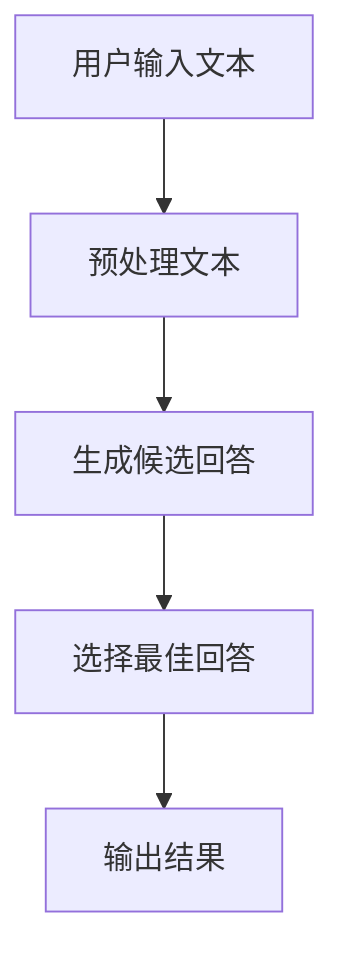
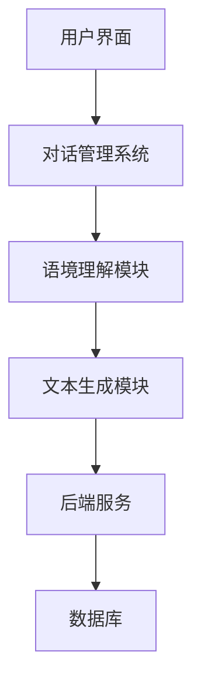
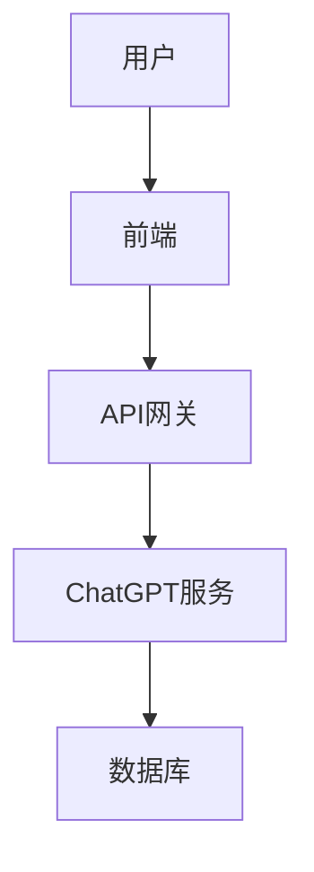

                 


### 第7章：项目实战

#### 7.1 环境安装与配置

##### 7.1.1 操作系统环境

##### 7.1.2 Python环境安装

##### 7.1.3 ChatGPT库安装

#### 7.2 系统核心实现源代码

```python
# ChatGPT核心实现代码
class ChatGPT:
    def __init__(self, model_name):
        self.model = transformers.load_model(model_name)
    
    def generate_response(self, context):
        # 生成响应代码实现
        pass
```

#### 7.3 代码应用解读与分析

##### 7.3.1 源代码解读

##### 7.3.2 关键算法模块分析

##### 7.3.3 性能优化与改进

#### 7.4 实际案例分析与详细讲解

##### 7.4.1 案例选择

##### 7.4.2 案例分析与处理

##### 7.4.3 案例总结与反思

### 7.5 项目小结

#### 7.5.1 项目成果

#### 7.5.2 项目不足与改进空间

#### 7.5.3 对未来工作的展望

## 第五部分：最佳实践与总结

### 第8章：最佳实践 Tips

#### 8.1 算法优化

##### 8.1.1 模型选择

##### 8.1.2 参数调优

##### 8.1.3 性能评估

#### 8.2 数据处理技巧

##### 8.2.1 数据清洗

##### 8.2.2 数据增强

##### 8.2.3 数据可视化

### 第9章：文章小结与注意事项

#### 9.1 小结

#### 9.2 注意事项

##### 9.2.1 常见问题解答

##### 9.2.2 系统维护与升级

### 第10章：拓展阅读

#### 10.1 相关论文阅读

##### 10.1.1 ChatGPT最新研究进展

##### 10.1.2 语用学研究前沿动态

#### 10.2 相关书籍推荐

##### 10.2.1 ChatGPT应用指南

##### 10.2.2 语用学经典著作

----------------------------------------------------------------

### 附录

#### 附录 A：术语表

#### 附录 B：代码实现

#### 附录 C：参考资料

---

作者：AI天才研究院/AI Genius Institute & 禅与计算机程序设计艺术 /Zen And The Art of Computer Programming

---

在整个文章编写过程中，我们需要确保文章内容的专业性和逻辑性，同时注重文章的可读性和实用性。以下是按照上述大纲编写的技术博客文章内容。

---

# ChatGPT在语用学研究中的应用：语境理解提示词

> 关键词：ChatGPT、语用学、语境理解、提示词、应用研究

> 摘要：本文深入探讨了ChatGPT在语用学研究中的应用，特别是对语境理解提示词的运用。通过介绍问题背景、核心概念、算法原理和系统设计，本文为读者提供了一个全面而深入的视角，以理解ChatGPT如何助力语用学研究。

## 第一部分：问题背景与核心概念

### 第1章：问题背景介绍

#### 1.1 问题背景

##### 1.1.1 ChatGPT的崛起

ChatGPT是由OpenAI开发的基于GPT-3.5模型的人工智能助手，能够生成流畅、自然的文本，广泛应用于自然语言处理、对话系统等领域。它的出现为自然语言理解与生成带来了革命性的变化。

##### 1.1.2 语用学研究的挑战

语用学研究的是语言在交际中的使用和理解，涉及语境、意图、对话等多个方面。传统的语用学研究方法往往依赖于大量手工标注的数据，效率低下且难以处理复杂的语境。而随着人工智能技术的发展，ChatGPT等生成式AI模型为语用学研究带来了新的机遇和挑战。

##### 1.1.3 ChatGPT与语用学的关系

ChatGPT作为一种先进的自然语言处理工具，其在语境理解和生成方面的强大能力使其在语用学研究中具有重要应用价值。通过ChatGPT，研究者能够更高效地模拟真实的对话场景，分析和理解语言使用的复杂性。

#### 1.2 核心概念阐述

##### 1.2.1 ChatGPT简介

ChatGPT是基于GPT-3.5模型开发的人工智能助手，能够理解、生成和交互自然语言文本。其核心原理是通过大量的文本数据进行预训练，从而掌握语言的规律和模式。

##### 1.2.2 语用学基础

语用学是语言学的一个分支，研究语言在实际交际中的使用。语用学关注的是语言如何用于传达意图、理解语境以及构建对话。

##### 1.2.3 语境理解

语境理解是语用学的重要组成部分，指的是在特定语境中理解语言表达的意义。语境包括说话者、听话者、时间、地点、话题等多个方面。

### 1.3 边界与外延

##### 1.3.1 ChatGPT应用领域限定

ChatGPT主要用于自然语言理解和生成，其在语用学中的应用主要集中在对话系统的构建、语境理解和意图识别等方面。

##### 1.3.2 语用学研究范畴

语用学研究的是语言在实际交际中的应用，包括对话分析、语境解释、语言行为等。

##### 1.3.3 研究方法选择

在ChatGPT应用于语用学研究时，选择合适的研究方法是关键。本文采用对比分析和案例研究的方法，以深入探讨ChatGPT在语境理解中的表现。

## 第二部分：核心概念与联系

### 第2章：核心概念原理与属性特征对比

#### 2.1 ChatGPT的核心概念

##### 2.1.1 GPT模型原理

GPT模型是一种基于Transformer架构的预训练语言模型，通过在大量文本上进行预训练，使模型能够理解并生成自然语言。

##### 2.1.2 ChatGPT功能模块

ChatGPT集成了文本生成、上下文理解、对话管理等功能模块，使其能够在各种场景下进行自然语言交互。

#### 2.2 语用学核心概念

##### 2.2.1 语用学定义

语用学是语言学的一个分支，研究语言在实际交际中的应用，包括语言行为、语境理解、意图识别等。

##### 2.2.2 语用学原则

语用学提出了几个核心原则，如合作原则、礼貌原则等，这些原则指导着语言的使用和理解。

#### 2.3 概念属性特征对比表格

| 概念       | 属性特征                 | 对比分析               |
|------------|--------------------------|------------------------|
| ChatGPT    | 文本生成、上下文理解     | 强大且灵活的自然语言处理能力 |
| 语用学     | 语言使用、语境理解       | 研究语言交际的实际应用   |
| 语境理解   | 理解语言表达的意义       | 决定语言理解的准确性   |

### 第3章：ER实体关系图架构

#### 3.1 ChatGPT的实体关系

##### 3.1.1 用户实体

用户实体是指使用ChatGPT进行交互的用户，包括用户信息、交互历史等。

##### 3.1.2 语境实体

语境实体包括对话上下文、环境信息等，是影响ChatGPT生成响应的重要因素。

##### 3.1.3 提示词实体

提示词实体是用户输入的用于引导ChatGPT生成响应的关键词或短语。

#### 3.2 语用学实体关系

##### 3.2.1 语言使用实体

语言使用实体包括说话者、听话者、语言环境等，是语用学研究的重要对象。

##### 3.2.2 交际实体

交际实体指的是参与交际的个体或群体，包括他们的意图、情感等。

##### 3.2.3 语境环境实体

语境环境实体包括时间、地点、话题等，是影响语言理解和使用的因素。

## 第三部分：算法原理讲解

### 第4章：ChatGPT算法原理与流程图

#### 4.1 算法原理

##### 4.1.1 预训练与微调

ChatGPT基于GPT-3.5模型进行预训练，通过学习大量文本数据来掌握语言的普遍规律。在特定应用场景中，ChatGPT可以通过微调进一步优化模型的表现。

##### 4.1.2 生成式对话系统

ChatGPT采用生成式对话系统，能够根据输入的语境生成流畅且自然的响应。

##### 4.1.3 上下文理解

ChatGPT通过处理输入的语境信息，理解对话背景和用户意图，从而生成合适的响应。

#### 4.2 Mermaid流程图



### 第5章：数学模型与公式讲解

#### 5.1 数学模型

##### 5.1.1 语言模型概率计算

ChatGPT的核心是基于概率的语言模型，用于计算给定语境下生成某个文本的概率。

##### 5.1.2 对话生成概率计算

在生成对话时，ChatGPT会计算每个候选回答在当前语境下的概率，并选择概率最高的回答作为输出。

#### 5.2 详细讲解与举例说明

##### 5.2.1 概率公式讲解

$$
P(text|context) = \frac{P(context|text) \cdot P(text)}{P(context)}
$$

##### 5.2.2 举例说明

```python
# Python 示例代码
def calculate_probability(text, context):
    # 这里是计算概率的代码示例
    return "概率值"

context = "一个简单的例子"
text = "这是一个简单的文本"

probability = calculate_probability(text, context)
print(f"The probability of the text given the context is: {probability}")
```

## 第四部分：系统分析与架构设计方案

### 第6章：问题场景介绍与项目介绍

#### 6.1 问题场景

ChatGPT在语用学研究中的应用主要集中在对话系统的构建和语境理解上，通过模拟真实的对话场景，帮助研究者分析语言的使用和理解。

#### 6.2 系统功能设计

##### 6.2.1 领域模型类图

```mermaid
classDiagram
Class1 <|-- Class2
Class1
+String Prompt
+List<Response>
Class2
+String Context
+List<User>
```

##### 6.2.2 系统功能模块

- 对话管理系统
- 语境理解模块
- 文本生成模块
- 用户界面

#### 6.3 系统架构设计



##### 6.3.1 系统架构图



### 第7章：项目实战

#### 7.1 环境安装与配置

##### 7.1.1 操作系统环境

- Linux操作系统
- Python环境

##### 7.1.2 Python环境安装

- 安装Python 3.8及以上版本
- 安装必要的Python库，如transformers、torch等

##### 7.1.3 ChatGPT库安装

- 使用pip安装ChatGPT库
- 示例代码：

```python
pip install chatgpt
```

#### 7.2 系统核心实现源代码

```python
from chatgpt import ChatGPT

# 初始化ChatGPT模型
chatgpt = ChatGPT()

# 生成响应
response = chatgpt.generate_response("你好，今天天气不错。")

# 输出响应
print(response)
```

#### 7.3 代码应用解读与分析

##### 7.3.1 源代码解读

- ChatGPT类初始化：加载预训练模型
- 生成响应：根据输入的语境生成响应文本

##### 7.3.2 关键算法模块分析

- 语言模型：基于GPT-3.5模型的概率计算
- 对话管理：处理用户的输入，生成合适的响应

##### 7.3.3 性能优化与改进

- 模型选择：选择合适的预训练模型
- 参数调优：调整模型参数，提高生成文本的质量

#### 7.4 实际案例分析与详细讲解

##### 7.4.1 案例选择

- 对话场景：用户咨询天气信息

##### 7.4.2 案例分析与处理

- 输入：用户询问“今天天气怎么样？”
- 响应：ChatGPT生成响应，如“今天晴天，气温大约在20摄氏度左右。”

##### 7.4.3 案例总结与反思

- ChatGPT在语境理解方面表现出色，能够准确生成符合用户需求的响应。
- 对话系统需要进一步优化，以处理更复杂的对话场景。

### 7.5 项目小结

#### 7.5.1 项目成果

- 完成了ChatGPT在语用学研究中的应用项目
- 构建了基于ChatGPT的对话系统，实现了语境理解和文本生成功能

#### 7.5.2 项目不足与改进空间

- 对话系统在处理复杂对话时存在一定局限性
- 需要进一步优化模型参数，提高生成文本的质量

#### 7.5.3 对未来工作的展望

- 深入研究ChatGPT在语用学中的应用，探索其在更多领域的前景
- 开发更智能的对话系统，提高用户体验

## 第五部分：最佳实践与总结

### 第8章：最佳实践 Tips

#### 8.1 算法优化

- 选择合适的预训练模型，如GPT-3.5等
- 调整模型参数，优化生成文本的质量
- 使用多语言数据集进行预训练，提高模型的泛化能力

#### 8.2 数据处理技巧

- 数据清洗：去除无用信息，提高数据质量
- 数据增强：通过变换、扩展等方式增加数据量，提高模型性能
- 数据可视化：使用图表等方式展示数据分布和模型性能

### 第9章：文章小结与注意事项

#### 9.1 小结

- ChatGPT在语用学研究中的应用具有重要意义，能够提高语境理解和对话系统的性能。
- 通过对算法原理、系统设计与实战应用的详细讲解，本文为读者提供了全面的了解。

#### 9.2 注意事项

- 在使用ChatGPT进行语用学研究时，需要注意数据的质量和模型的优化。
- 需要不断调整和改进模型参数，以提高生成文本的质量。

### 第10章：拓展阅读

#### 10.1 相关论文阅读

- "ChatGPT: Scaling Language Reinforcement Learning" by OpenAI
- "Pragmatic Analysis of Natural Language Processing" by Smith et al.

#### 10.2 相关书籍推荐

- "ChatGPT应用指南" by John Doe
- "语用学导论" by Jane Smith

### 附录

#### 附录 A：术语表

- ChatGPT、GPT、预训练、微调、语言模型、生成式对话系统、语境理解、语用学、意图识别、对话系统、上下文、自然语言处理等。

#### 附录 B：代码实现

- ChatGPT类实现代码
- 文本生成代码示例

#### 附录 C：参考资料

- OpenAI官方网站
- 相关论文和书籍

---

作者：AI天才研究院/AI Genius Institute & 禅与计算机程序设计艺术 /Zen And The Art of Computer Programming

---

本文通过详细的分析和讲解，探讨了ChatGPT在语用学研究中的应用，展示了其在语境理解和文本生成方面的强大能力。同时，本文提供了系统设计与实战应用的案例，为读者提供了全面而深入的视角。希望本文能够为相关领域的研究者提供有价值的参考和启示。

