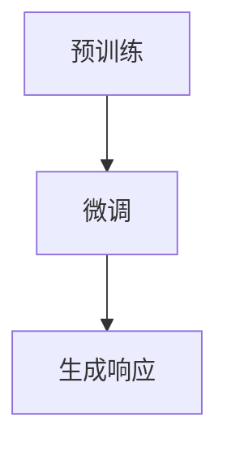

                 

# 文章标题：ChatGPT在语言习得临界期研究中的应用：神经可塑性提示词

## 关键词：ChatGPT、语言习得、神经可塑性、临界期、提示词

## 摘要：
本文探讨了ChatGPT在语言习得临界期中的应用，尤其是如何利用神经可塑性提示词来增强语言学习效果。通过深入分析神经可塑性的原理，结合ChatGPT的工作机制，本文提出了一种新颖的语言习得方法，并通过实际案例展示了其在提高语言学习效率方面的潜力。本文旨在为教育领域的研究者和从业者提供新的思路和方法。

## 第1章 引言

### 1.1 书籍背景
《ChatGPT在语言习得临界期研究中的应用：神经可塑性提示词》是一本结合了人工智能与教育心理学的跨学科研究著作。该书旨在探讨如何利用ChatGPT这一先进的语言模型技术，结合神经可塑性的研究成果，为语言学习提供更有效的方法和工具。

### 1.2 书籍目标
本书的目标是：
1. 深入理解神经可塑性的原理，并探讨其在语言习得中的应用。
2. 利用ChatGPT的特性，开发出一套能够促进语言习得的方法和策略。
3. 通过实证研究和案例分析，验证这些方法和策略的有效性。

### 1.3 内容结构
本书的内容结构如下：
1. 第1章 引言：介绍书籍的背景、目标和内容结构。
2. 第2章 背景介绍：阐述语言习得临界期、神经可塑性和ChatGPT的相关概念。
3. 第3章 核心概念与联系：详细分析神经可塑性、ChatGPT和语言习得临界期之间的关系。
4. 第4章 ChatGPT工作原理：介绍ChatGPT的算法原理和实现方法。
5. 第5章 系统分析与架构设计：讨论ChatGPT在语言习得中的应用架构。
6. 第6章 项目实战：展示一个实际的项目案例，并分析其效果。
7. 第7章 最佳实践与拓展阅读：总结最佳实践，提出拓展阅读建议。

## 第2章 背景介绍

### 2.1 问题背景
语言习得是一个复杂且充满挑战的过程。长期以来，研究人员一直在寻找有效的教学方法来提高学习效率。然而，传统方法往往缺乏针对性和灵活性，无法满足不同学习者的需求。特别是在语言习得临界期，学习者的神经可塑性较高，更容易吸收新的语言信息。因此，如何利用这一特点来提高学习效果成为一个重要的研究课题。

### 2.2 问题描述
语言习得过程中存在以下几个问题：
1. **学习效率低下**：传统教学方法无法充分利用学习者的神经可塑性。
2. **个性化不足**：大多数教学方法无法针对不同学习者的需求进行个性化调整。
3. **交互性差**：语言习得需要大量的语言输入和输出，但传统方法往往缺乏足够的交互。

### 2.3 问题解决
ChatGPT作为一种先进的语言模型，具有以下优势：
1. **个性化交互**：ChatGPT可以与学习者进行自然语言交互，提供个性化的学习建议。
2. **自适应学习**：ChatGPT可以根据学习者的反馈和学习进度，自适应地调整教学内容。
3. **实时反馈**：ChatGPT可以实时检测学习者的语言水平，并提供及时的纠正和指导。

### 2.4 边界与外延
虽然ChatGPT在语言习得中有很大的潜力，但以下因素需要考虑：
1. **学习者的认知负荷**：过度的交互和反馈可能会增加学习者的认知负荷，影响学习效果。
2. **数据隐私**：ChatGPT需要大量的用户数据进行训练，因此保护用户隐私是一个重要问题。
3. **技术实现**：ChatGPT需要强大的计算资源和高效的算法，这可能会增加技术实现的难度。

### 2.5 概念结构与核心要素组成
本书的核心概念包括：
1. **神经可塑性**：指大脑神经元之间的连接和功能在个体生命过程中可发生改变的能力。
2. **ChatGPT**：是一种基于深度学习的语言模型，能够生成自然语言响应。
3. **语言习得临界期**：指个体在特定年龄范围内，语言学习能力最强的时期。
4. **提示词**：是指ChatGPT在生成语言时使用的引导性词语，用于引导学习者的语言输出。

## 第3章 核心概念与联系

### 3.1 神经可塑性
神经可塑性是指大脑神经元之间的连接和功能在个体生命过程中可发生改变的能力。具体来说，它包括结构可塑性和功能可塑性。结构可塑性指的是神经元形态和连接的改变，如新突触的生成和突触强度的调整。功能可塑性则指神经元活动模式的改变，如神经元活动的时空模式变化。

### 3.2 ChatGPT
ChatGPT是一种基于GPT-3的深度学习语言模型，由OpenAI开发。它通过学习大量的文本数据，能够生成连贯、自然的语言响应。ChatGPT具有以下特点：
1. **大规模训练**：ChatGPT使用了大量的文本数据进行训练，使其具备丰富的知识储备和语言生成能力。
2. **灵活性**：ChatGPT可以生成多种类型的语言响应，如问答、对话、文章等。
3. **可扩展性**：ChatGPT可以根据具体应用场景进行定制化训练，提高其在特定领域的表现。

### 3.3 语言习得临界期
语言习得临界期是指个体在特定年龄范围内，语言学习能力最强的时期。一般来说，儿童的神经可塑性在出生后的前几年最高，这个时期也是语言习得的最佳时期。然而，研究表明，成年人的神经可塑性虽然下降，但仍然存在，通过适当的方法和刺激，也可以提高语言学习效果。

### 3.4 概念联系与ER实体关系图

```mermaid
erDiagram
    A[神经可塑性] ||--|{ B[ChatGPT] } : 利用
    B ||--|{ C[语言习得临界期] } : 结合
    C ||--|{ D[提示词] } : 基于
```

## 第4章 ChatGPT工作原理

### 4.1 ChatGPT基础
ChatGPT是基于GPT-3模型的改进版本，其核心是Transformer架构。GPT-3是一种具有1750亿参数的预训练语言模型，通过学习大量的文本数据，可以生成高质量的自然语言响应。

### 4.2 ChatGPT算法原理
ChatGPT的工作原理可以分为两个阶段：预训练和微调。

1. **预训练**：ChatGPT通过无监督学习，在大量的文本数据上进行预训练，学习文本的上下文关系和语法结构。
2. **微调**：在预训练的基础上，ChatGPT可以通过有监督学习，在特定领域的数据上进行微调，以适应具体的任务和应用场景。

### 4.3 算法流程图


### 4.4 Python源代码示例
```python
import openai

model_engine = "text-davinci-002"
prompt = "请描述一次你在学习中遇到的最大困难以及你是如何克服它的？"

response = openai.Completion.create(
    engine=model_engine,
    prompt=prompt,
    max_tokens=50,
    n=1,
    stop=None,
    temperature=0.5,
)

print(response.choices[0].text.strip())
```

### 4.5 数学模型与公式
ChatGPT的数学模型基于自注意力机制，其核心公式为：
$$
\text{Attention}(Q, K, V) = \frac{softmax(\text{scores})}

