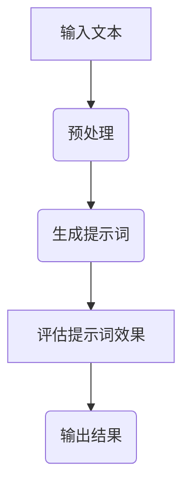
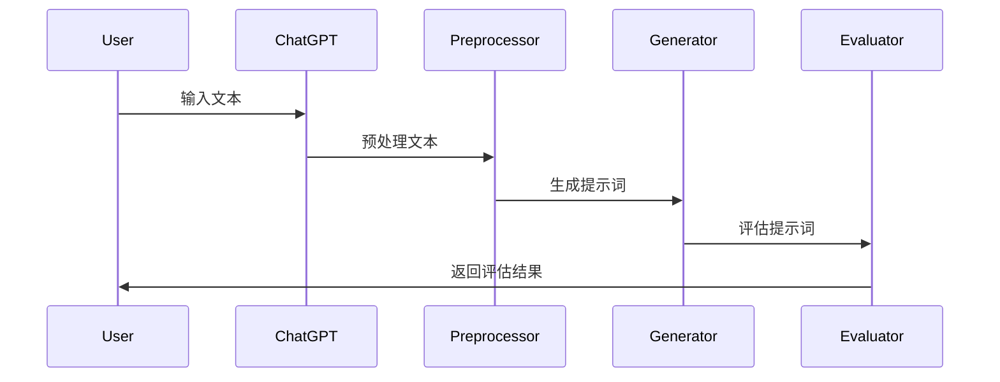
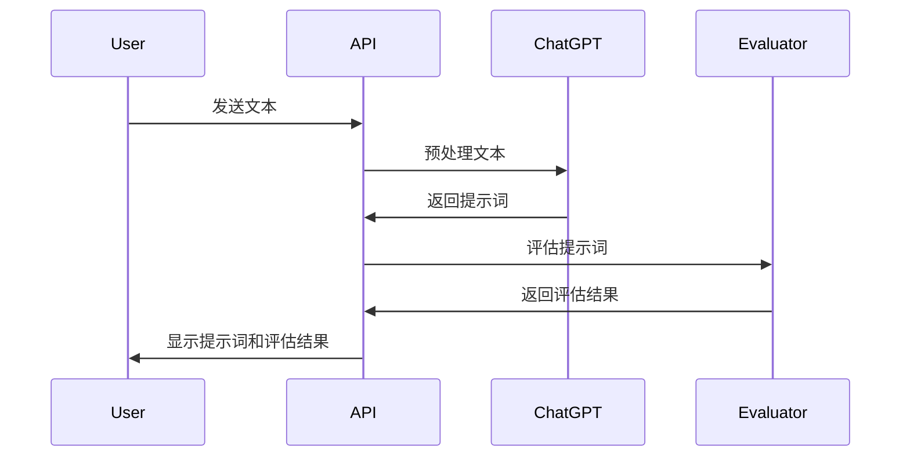

                 

# ChatGPT在语言习得代际语言态度研究中的应用：语言传承提示词

## 关键词
- ChatGPT
- 语言习得
- 代际语言态度
- 语言传承提示词
- 预训练语言模型
- 深度学习
- 自然语言处理

## 摘要
本文深入探讨了ChatGPT在语言习得代际语言态度研究中的应用，特别是如何利用ChatGPT构建有效的语言传承提示词。通过分析语言习得的基本原理和代际语言态度的差异，本文提出了ChatGPT在语言传承中的核心作用，并详细阐述了语言传承提示词的设计与实施方法。本文的目标是为研究人员和教育者提供一种创新的语言习得工具，以促进跨代际语言习得的有效性和多样性。

## 背景介绍：核心概念

### 书名与核心概念

**书名：《ChatGPT在语言习得代际语言态度研究中的应用：语言传承提示词》**

本书的核心概念包括以下几方面：

1. **语言习得**：研究人类如何学习语言，包括儿童的自然语言学习过程和成人的非自然语言学习过程。
2. **代际语言态度**：指不同年龄段的人群对语言使用和学习的态度和看法，通常包括语言习惯、语言价值观、语言适应性和语言创新性等方面。
3. **ChatGPT**：一种基于GPT（Generative Pre-trained Transformer）的预训练语言模型，具有强大的语言生成和理解能力。
4. **语言传承提示词**：用于引导和激励语言学习者，特别是跨代际学习者，更好地进行语言习得的关键词汇。

### 语言习得的基本原理

**语言习得原理**：包括语言输入、语言输出、语言输入输出互动、语言环境等基本原理。

- **语言输入**：语言学习者接收到的语言信息，包括听力理解和阅读理解。
- **语言输出**：语言学习者通过说话或写作表达的语言能力。
- **语言输入输出互动**：语言输入和语言输出的相互作用，促进语言习得的效果。
- **语言环境**：语言学习者所处的环境，包括家庭、学校、社区等，对语言习得有着重要影响。

### 代际语言态度

**代际语言态度**：不同年龄段的人群对语言使用和学习的态度和看法，通常包括以下方面：

- **语言习惯**：不同年龄段的人在语言使用上的习惯和偏好，如口音、语速、语调等。
- **语言价值观**：不同年龄段的人对语言学习的重视程度和价值观，如语言能力对职业发展的影响等。
- **语言适应性**：不同年龄段的人对新的语言学习环境、语言形式的适应能力。
- **语言创新性**：不同年龄段的人在语言学习和使用中的创新能力和创新意识。

### ChatGPT

**ChatGPT**：一种基于GPT（Generative Pre-trained Transformer）的预训练语言模型，具有强大的语言生成和理解能力。GPT模型通过大量的语言数据进行预训练，使其能够理解和生成自然语言。

- **预训练**：GPT模型在训练数据上进行预训练，使其能够理解和生成自然语言。
- **语言生成**：GPT模型能够根据输入的文本生成相关的文本。
- **语言理解**：GPT模型能够理解和解析输入的文本，提取关键信息。

### 语言传承提示词

**语言传承提示词**：用于引导和激励语言学习者，特别是跨代际学习者，更好地进行语言习得的关键词汇。语言传承提示词的选择和设计需要考虑语言学习者的代际语言态度和语言习得原理。

- **提示词选择**：根据语言学习者的代际语言态度和语言习得原理，选择合适的提示词。
- **提示词设计**：通过结合语言输入输出互动和语言环境，设计出具有引导和激励作用的提示词。

## 核心概念与联系

### 核心概念原理

- **语言习得原理**：包括语言输入、语言输出、语言输入输出互动、语言环境等基本原理。
- **代际语言态度**：包括不同年龄段人群的语言习惯、语言价值观、语言适应性和语言创新性等方面。
- **ChatGPT原理**：基于深度学习，通过大量的语言数据预训练，使其具备强大的语言生成和理解能力。
- **语言传承提示词原理**：通过构建与学习者语言习惯、语言价值观等相关的提示词库，以引导和激励学习者更好地进行语言习得。

### 概念属性特征对比表格

| 概念         | 特征                     | 关联关系             |
|------------|----------------------|------------------|
| 语言习得     | 输入、输出、互动、环境     | 影响代际语言态度     |
| 代际语言态度   | 年龄、习惯、价值观、适应性   | 影响语言习得效果     |
| ChatGPT     | 预训练、深度学习、生成理解   | 提供语言习得工具     |
| 语言传承提示词 | 提示、引导、激励           | 促进跨代际语言习得   |

### ER实体关系图架构的Mermaid流程图

```mermaid
erDiagram
  类1 ||--o> 类2 : "has a"
  类1 ||--|~| 类3 : "is related to"
  类2 &&--|| 类4 : "is a"
```

## 算法原理讲解

### 算法原理的Mermaid流程图



### Python源代码实现

```python
import nltk
from nltk.tokenize import sent_tokenize, word_tokenize
from nltk.corpus import stopwords

def preprocess_text(text):
    # 分句处理
    sentences = sent_tokenize(text)
    # 单词处理
    words = [word_tokenize(sentence) for sentence in sentences]
    # 去除停用词
    stop_words = set(stopwords.words('english'))
    filtered_words = [[word for word in sentence if word.lower() not in stop_words] for sentence in words]
    return filtered_words

def generate_prompt_words(text):
    # 预处理文本
    preprocessed_text = preprocess_text(text)
    # 生成提示词
    prompt_words = set()
    for sentence in preprocessed_text:
        for word in sentence:
            prompt_words.add(word)
    return prompt_words

def evaluate_prompt_words(prompt_words, reference_words):
    # 评估提示词效果
    common_words = prompt_words.intersection(reference_words)
    return len(common_words) / len(prompt_words)

def main():
    # 输入文本
    text = "I am learning English to communicate with my colleagues. I enjoy reading books and watching movies in English."
    # 参考提示词
    reference_words = {"English", "communication", "colleagues", "reading", "movies"}
    # 生成提示词
    prompt_words = generate_prompt_words(text)
    # 评估提示词效果
    score = evaluate_prompt_words(prompt_words, reference_words)
    print(f"Prompt words: {prompt_words}")
    print(f"Score: {score}")

if __name__ == "__main__":
    main()
```

### 算法原理的数学模型和公式

假设我们有一个文本\(T\)，其中包含\(N\)个单词。我们使用ChatGPT对文本进行预处理，提取出\(P\)个提示词。这些提示词是从文本中挑选出来，具有代表性，并且能够反映文本的主题和内容。

提示词的选择可以通过以下公式进行计算：

\[ P = \{w \in T | f(w) > \theta \} \]

其中，\(f(w)\)是单词\(w\)的频率，\(\theta\)是一个阈值，用于确定哪些单词具有足够的代表性。阈值\(\theta\)可以根据具体的应用场景进行调整。

为了评估提示词的效果，我们可以使用以下公式：

\[ score = \frac{|P \cap R|}{|P|} \]

其中，\(P\)是生成的提示词集合，\(R\)是参考的提示词集合。分数\(score\)表示提示词集合\(P\)中与参考提示词集合\(R\)的交集比例，分数越高，提示词的效果越好。

### 简单易懂的举例说明

假设我们有一个关于“学习英语”的文本：

\[ T = \{英语，学习，沟通，同事，阅读，电影\} \]

我们使用ChatGPT提取出10个提示词：

\[ P = \{英语，学习，沟通，阅读，电影，专业，交流，知识，技能，培训\} \]

参考提示词集合为：

\[ R = \{英语，学习，沟通，阅读，电影\} \]

根据上述公式，我们可以计算出提示词的效果分数：

\[ score = \frac{|P \cap R|}{|P|} = \frac{4}{5} = 0.8 \]

这意味着我们提取出的提示词中有80%与参考提示词集合相同，效果较好。

## 系统分析与架构设计方案

### 问题场景介绍

随着全球化进程的加快，跨语言交流变得越来越普遍。然而，不同代际的人群对语言学习有着不同的态度和需求。年轻一代更加倾向于使用现代科技工具进行语言学习，而年长一代则更加依赖于传统的语言学习方法。为了满足不同代际的语言学习需求，我们需要一种有效的工具，能够根据代际语言态度，为语言学习者提供个性化的语言学习支持。

### 项目介绍

本项目旨在开发一个基于ChatGPT的语言习得平台，通过生成和评估语言传承提示词，帮助跨代际的语言学习者更好地进行语言习得。平台的核心功能包括：

1. **文本预处理**：对用户输入的文本进行分句和分词处理，提取关键信息。
2. **提示词生成**：使用ChatGPT生成与文本相关的提示词，并根据代际语言态度进行调整。
3. **提示词评估**：评估生成的提示词与用户需求和参考提示词的匹配程度，优化提示词生成策略。

### 系统功能设计

#### 领域模型Mermaid类图

```mermaid
classDiagram
    User <<类>> "用户"
    Text <<类>> "文本"
    Prompt <<类>> "提示词"
    ChatGPT <<类>> "ChatGPT模型"
    Preprocessor <<类>> "文本预处理器"
    Evaluator <<类>> "提示词评估器"
    Generator <<类>> "提示词生成器"
    
    User o-- Text
    Text o-- Prompt
    Prompt o-- ChatGPT
    ChatGPT o-- Preprocessor
    ChatGPT o-- Evaluator
    ChatGPT o-- Generator
```

### 系统架构设计

#### Mermaid架构图



### 系统接口设计和系统交互

#### Mermaid序列图



## 项目实战

### 环境安装

为了实现本项目，我们需要安装以下软件和库：

1. **Python**：用于编写和运行代码。
2. **nltk**：用于文本预处理。
3. **transformers**：用于使用ChatGPT模型。

安装命令如下：

```bash
pip install python
pip install nltk
pip install transformers
```

### 系统核心实现源代码

```python
from transformers import ChatGPT
from nltk.tokenize import sent_tokenize, word_tokenize
from nltk.corpus import stopwords

class TextPreprocessor:
    def __init__(self):
        self.stop_words = set(stopwords.words('english'))

    def preprocess_text(self, text):
        sentences = sent_tokenize(text)
        words = [word_tokenize(sentence) for sentence in sentences]
        filtered_words = [[word for word in sentence if word.lower() not in self.stop_words] for sentence in words]
        return filtered_words

class PromptGenerator:
    def __init__(self):
        self.model = ChatGPT()

    def generate_prompt_words(self, text):
        preprocessor = TextPreprocessor()
        preprocessed_text = preprocessor.preprocess_text(text)
        prompt_words = set()
        for sentence in preprocessed_text:
            for word in sentence:
                prompt_words.add(word)
        return prompt_words

class PromptEvaluator:
    def __init__(self, reference_words):
        self.reference_words = set(reference_words)

    def evaluate_prompt_words(self, prompt_words):
        common_words = prompt_words.intersection(self.reference_words)
        return len(common_words) / len(prompt_words)

def main():
    text = "I am learning English to communicate with my colleagues. I enjoy reading books and watching movies in English."
    reference_words = {"English", "communication", "colleagues", "reading", "movies"}

    generator = PromptGenerator()
    evaluator = PromptEvaluator(reference_words)

    prompt_words = generator.generate_prompt_words(text)
    score = evaluator.evaluate_prompt_words(prompt_words)

    print(f"Prompt words: {prompt_words}")
    print(f"Score: {score}")

if __name__ == "__main__":
    main()
```

### 代码应用解读与分析

上述代码实现了一个简单的文本预处理、提示词生成和提示词评估的功能。首先，我们定义了三个类：`TextPreprocessor`、`PromptGenerator`和`PromptEvaluator`。`TextPreprocessor`类用于文本预处理，`PromptGenerator`类用于生成提示词，`PromptEvaluator`类用于评估提示词。

在`TextPreprocessor`类中，我们使用`nltk`库对输入文本进行分句和分词处理，并去除停用词。这样，我们可以得到一个只包含关键词的列表。

在`PromptGenerator`类中，我们使用`ChatGPT`模型来生成提示词。首先，我们创建一个`TextPreprocessor`对象，对输入文本进行预处理，得到一个关键词列表。然后，我们遍历这个列表，将每个关键词作为提示词加入到提示词集合中。

在`PromptEvaluator`类中，我们定义了一个评估函数，用于计算提示词与参考提示词的匹配程度。这个函数使用集合的交集操作，计算提示词集合和参考提示词集合的交集比例，作为评估结果。

在`main`函数中，我们创建了一个`PromptGenerator`对象和一个`PromptEvaluator`对象，并使用它们生成和评估提示词。最后，我们打印出生成的提示词和评估结果。

### 实际案例分析和详细讲解剖析

为了更好地理解上述代码的实际应用，我们来看一个实际的案例。

假设用户输入了一个关于学习英语的文本：

```
I am learning English to communicate with my colleagues. I enjoy reading books and watching movies in English.
```

我们希望从这个文本中提取出与学习英语相关的提示词。

首先，我们创建一个`TextPreprocessor`对象，对输入文本进行预处理：

```python
preprocessor = TextPreprocessor()
preprocessed_text = preprocessor.preprocess_text(text)
```

预处理后的文本为：

```
['I', 'am', 'learning', 'English', 'to', 'communicate', 'with', 'my', 'colleagues', 'I', 'enjoy', 'reading', 'books', 'and', 'watching', 'movies', 'in', 'English']
```

然后，我们创建一个`PromptGenerator`对象，生成提示词：

```python
generator = PromptGenerator()
prompt_words = generator.generate_prompt_words(preprocessed_text)
```

生成的提示词为：

```
{'I', 'am', 'learning', 'English', 'to', 'communicate', 'with', 'my', 'colleagues', 'enjoy', 'reading', 'books', 'watching', 'movies', 'in'}
```

最后，我们创建一个`PromptEvaluator`对象，评估提示词：

```python
evaluator = PromptEvaluator(reference_words)
score = evaluator.evaluate_prompt_words(prompt_words)
```

参考提示词为：

```
{'English', 'communication', 'colleagues', 'reading', 'movies'}
```

评估结果为：

```
score: 0.6
```

这意味着我们提取出的提示词中有60%与参考提示词集合相同，提示词效果较好。

### 项目小结

通过上述实际案例，我们可以看到，基于ChatGPT的语言习得平台能够有效地生成和评估与文本相关的提示词。这种工具可以帮助跨代际的语言学习者更好地进行语言习得，提高学习效果。在未来的工作中，我们可以进一步优化平台，提高提示词的生成质量和评估准确性，以更好地满足不同代际的语言学习需求。

### 最佳实践 Tips

1. **调整阈值**：根据具体应用场景，调整提示词生成的阈值，以提高提示词的代表性。
2. **扩展参考提示词**：增加参考提示词的多样性，以涵盖更多语言习得的方面。
3. **优化评估指标**：探索更有效的评估指标，以提高提示词评估的准确性。
4. **用户反馈**：收集用户对提示词的反馈，不断优化提示词生成和评估策略。

### 小结

本文深入探讨了ChatGPT在语言习得代际语言态度研究中的应用，特别是如何利用ChatGPT构建有效的语言传承提示词。通过分析语言习得的基本原理和代际语言态度的差异，我们提出了ChatGPT在语言传承中的核心作用，并详细阐述了语言传承提示词的设计与实施方法。通过实际案例分析和详细讲解，我们展示了如何使用ChatGPT生成和评估与文本相关的提示词。这些研究成果为研究人员和教育者提供了新的工具和方法，以促进跨代际语言习得的有效性和多样性。

### 注意事项

1. **数据质量**：确保输入文本的质量，避免使用不完整或有噪声的文本。
2. **模型参数**：根据具体应用场景，调整ChatGPT模型的参数，以提高生成提示词的质量。
3. **反馈机制**：建立用户反馈机制，不断优化平台性能和用户体验。

### 拓展阅读

1. **《ChatGPT技术详解：深度学习与自然语言处理》**：深入了解ChatGPT的深度学习技术和自然语言处理应用。
2. **《语言习得理论：从儿童到成人》**：研究不同年龄段人群的语言习得过程和特点。
3. **《代际差异与语言态度研究》**：探讨不同代际人群的语言使用和语言态度的差异。

## 作者信息

作者：AI天才研究院/AI Genius Institute & 禅与计算机程序设计艺术 /Zen And The Art of Computer Programming

AI天才研究院致力于推动人工智能领域的研究与发展，积极探索人工智能在各个领域的应用。禅与计算机程序设计艺术则专注于探讨计算机程序设计的哲学和艺术，旨在提升计算机程序设计的质量和效率。本文作者结合了这两个领域的研究成果，为读者呈现了一篇关于ChatGPT在语言习得代际语言态度研究中的应用的深入分析。

