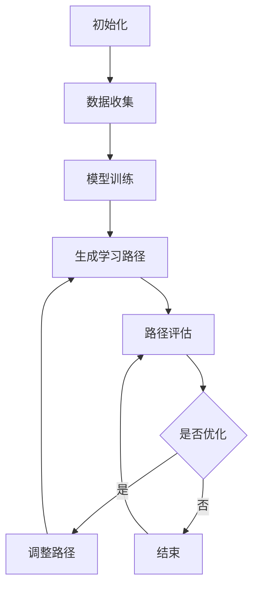

                 

# ChatGPT在语言习得元认知策略开发中的应用：自主学习提示词

关键词：ChatGPT、语言习得、元认知策略、自主学习提示词、教育科技

摘要：本文深入探讨了ChatGPT在语言习得元认知策略开发中的应用，重点关注了自主学习提示词的开发。通过分析ChatGPT的核心特点和应用原理，本文详细阐述了ChatGPT在语言习得元认知策略开发中的实际应用和实践效果，为教育工作者和研究人员提供了有益的参考。

## 目录大纲

1. 第一部分：ChatGPT在语言习得元认知策略背景介绍
   1.1 语言习得与元认知策略
   1.2 ChatGPT的核心特点及其对语言习得的促进作用
   1.3 元认知策略在语言学习中的重要性
   1.4 ChatGPT在元认知策略开发中的实际应用

2. 第二部分：元认知策略的基本概念
   2.1 元认知的定义与特征
   2.2 元认知策略的类型
   2.3 元认知策略在教学中的应用

3. 第三部分：ChatGPT在元认知策略中的应用原理
   3.1 ChatGPT的语言处理能力
   3.2 ChatGPT的自主学习与自我反馈机制
   3.3 ChatGPT在元认知策略开发中的工作原理

4. 第四部分：ChatGPT在元认知策略开发中的应用实践
   4.1 ChatGPT在自主学习提示词开发中的应用
   4.2 ChatGPT在个性化学习路径规划中的应用
   4.3 ChatGPT在教学干预中的实际应用

5. 第五部分：ChatGPT在语言习得元认知策略开发中的案例分析
   5.1 案例一：某语言学习平台的应用案例
   5.2 案例二：教育机构的应用案例
   5.3 案例三：教育科技公司的应用案例

6. 第六部分：ChatGPT在元认知策略开发中的挑战与未来发展
   6.1 ChatGPT在元认知策略开发中面临的挑战
   6.2 ChatGPT在元认知策略开发中的未来发展方向
   6.3 总结与展望

7. 第七部分：结语
   7.1 ChatGPT在语言习得元认知策略开发中的重要性
   7.2 对教师的启示与建议
   7.3 对教育科技领域的贡献与影响

## 第1章：ChatGPT在语言习得中的应用背景

### 1.1 语言习得与元认知策略

语言习得是指个体通过听、说、读、写等方式获得语言知识和技能的过程。在这一过程中，个体不仅需要掌握语言的基本规则和表达方式，还需要培养语言学习的策略和方法。元认知策略是语言学习中的一种重要策略，它是指个体在语言学习过程中，对自己学习过程进行监控、调节和评价的方法和技巧。

元认知策略包括三个核心成分：元认知知识、元认知监控和元认知调节。元认知知识是指个体对学习任务、自身学习特点和策略的理解和认识；元认知监控是指个体在语言学习过程中，对学习过程进行跟踪和评估，以了解自己的学习状态；元认知调节是指个体根据学习状态和学习目标，调整学习策略和方法，以达到最佳学习效果。

### 1.2 ChatGPT的核心特点及其对语言习得的促进作用

ChatGPT是由OpenAI开发的一种基于变换器的预训练语言模型。它具有以下几个核心特点：

1. **强大的语言处理能力**：ChatGPT能够理解、生成和模仿自然语言，这使得它在语言习得中具有很大的潜力。

2. **自主学习能力**：ChatGPT可以通过大量文本数据自主学习，从而不断提升其语言理解和生成能力。

3. **个性化学习**：ChatGPT可以根据个体的学习需求和特点，提供个性化的学习资源和指导。

4. **自我反馈机制**：ChatGPT能够根据用户的反馈，调整自己的学习策略和生成内容，以更好地满足用户需求。

ChatGPT在语言习得中的促进作用主要体现在以下几个方面：

1. **提高学习效率**：ChatGPT可以为学生提供即时反馈和指导，帮助他们更快地掌握语言知识和技能。

2. **培养元认知策略**：ChatGPT可以引导学生进行自我监控和自我调节，培养他们的元认知能力。

3. **丰富学习资源**：ChatGPT可以生成大量的语言学习材料，为学生提供丰富的学习资源。

### 1.3 元认知策略在语言学习中的重要性

元认知策略在语言学习中的重要性不容忽视。首先，它可以帮助学生更好地理解学习任务，明确学习目标。其次，它可以帮助学生更好地监控自己的学习过程，及时发现和纠正错误。最后，它可以帮助学生调整学习策略，提高学习效果。

然而，在实际语言学习中，许多学生缺乏元认知策略的意识和方法，导致学习效果不佳。因此，开发有效的元认知策略训练工具，如ChatGPT，对于提高语言学习效果具有重要意义。

### 1.4 ChatGPT在元认知策略开发中的实际应用

ChatGPT在元认知策略开发中具有广泛的应用前景。首先，它可以作为语言学习工具，为学生提供个性化的学习指导。其次，它可以作为教育评估工具，对学生的学习效果进行评估。最后，它可以作为教育研究工具，为教育工作者提供有价值的研究数据。

在实际应用中，ChatGPT可以通过以下几种方式促进元认知策略的开发：

1. **自主学习提示词**：ChatGPT可以生成与学习任务相关的提示词，引导学生进行自主学习。

2. **学习过程监控**：ChatGPT可以实时监控学生的学习过程，提供实时反馈。

3. **学习效果评估**：ChatGPT可以评估学生的学习效果，为教师提供教学参考。

4. **个性化学习路径规划**：ChatGPT可以根据学生的学习特点和需求，规划个性化的学习路径。

通过以上方式，ChatGPT可以有效地促进元认知策略的开发，提高语言学习效果。

## 第2章：元认知策略的基本概念

### 2.1 元认知的定义与特征

元认知是指个体对自身认知活动的认知，包括对认知活动的认识、监控和调节。元认知具有以下特征：

1. **反思性**：元认知需要个体对自身的认知活动进行反思，了解自己的思维过程和认知效果。

2. **监控性**：元认知需要个体对自身的认知活动进行监控，及时发现和纠正错误。

3. **调节性**：元认知需要个体根据监控结果，调整认知策略，以提高认知效果。

### 2.2 元认知策略的类型

元认知策略主要包括以下三种类型：

1. **计划策略**：计划策略是指个体在开始学习之前，根据学习任务的特点，设定学习目标和制定学习计划。

2. **监控策略**：监控策略是指个体在学习过程中，对学习活动进行监控，以了解自己的学习进度和质量。

3. **调节策略**：调节策略是指个体根据监控结果，调整学习策略和方法，以提高学习效果。

### 2.3 元认知策略在教学中的应用

元认知策略在教学中的应用主要体现在以下几个方面：

1. **提高学习效果**：教师可以引导学生运用元认知策略，提高学习效果。

2. **培养自主学习能力**：元认知策略可以帮助学生更好地掌握学习过程，培养他们的自主学习能力。

3. **促进教学评估**：教师可以通过元认知策略，对学生的学习效果进行评估，以改进教学方法。

4. **优化教学资源**：教师可以根据元认知策略，为学生提供更有针对性的学习资源。

通过以上应用，元认知策略可以有效地促进教学效果，提高学生的学习能力。

## 第3章：ChatGPT在元认知策略中的应用原理

### 3.1 ChatGPT的语言处理能力

ChatGPT是一种基于变换器的预训练语言模型，具有强大的语言处理能力。它通过对海量文本数据的学习，掌握了自然语言的语法、语义和语境知识。这使得ChatGPT能够理解用户的输入，生成有意义的回答，并模仿自然语言的表达方式。

ChatGPT的语言处理能力主要体现在以下几个方面：

1. **文本理解**：ChatGPT能够理解用户的输入文本，提取关键信息，并对其进行语义分析。

2. **文本生成**：ChatGPT可以根据用户的输入文本，生成有意义的回答，并保持文本的连贯性和逻辑性。

3. **文本模仿**：ChatGPT能够模仿自然语言的表达方式，生成与用户输入文本风格相似的文本。

### 3.2 ChatGPT的自主学习与自我反馈机制

ChatGPT具有自主学习能力，可以通过大量文本数据不断优化自身模型。在语言习得过程中，ChatGPT可以不断接收用户的输入，并根据用户反馈进行调整。这种自主学习与自我反馈机制使得ChatGPT能够更好地适应语言学习的需求。

ChatGPT的自主学习与自我反馈机制主要体现在以下几个方面：

1. **数据收集**：ChatGPT可以收集大量文本数据，用于训练和优化模型。

2. **模型优化**：ChatGPT可以根据用户反馈，调整模型参数，提高语言处理能力。

3. **自适应学习**：ChatGPT可以根据用户的学习特点和需求，动态调整学习策略。

### 3.3 ChatGPT在元认知策略开发中的工作原理

ChatGPT在元认知策略开发中，主要通过以下几种方式实现：

1. **生成提示词**：ChatGPT可以根据学习任务，生成相关的提示词，引导学生进行自主学习。

2. **监控学习过程**：ChatGPT可以实时监控学生的学习过程，提供实时反馈。

3. **评估学习效果**：ChatGPT可以根据学生的学习表现，评估学习效果，为教师提供教学参考。

4. **调整学习策略**：ChatGPT可以根据学生的学习特点和需求，调整学习策略，提高学习效果。

通过以上方式，ChatGPT可以有效地促进元认知策略的开发，提高语言学习效果。

## 第4章：ChatGPT在元认知策略开发中的应用实践

### 4.1 ChatGPT在自主学习提示词开发中的应用

自主学习提示词是元认知策略中的重要组成部分，它可以帮助学生明确学习目标，规划学习步骤，提高学习效率。ChatGPT在自主学习提示词开发中具有广泛应用。

#### 应用场景

1. **语言学习**：ChatGPT可以为学生提供与学习任务相关的提示词，引导他们进行自主学习。

2. **学术研究**：ChatGPT可以为学生提供与论文写作相关的提示词，帮助他们规划研究步骤。

3. **项目规划**：ChatGPT可以为团队提供与项目开发相关的提示词，协助他们制定项目计划。

#### 实现方法

1. **任务定义**：首先，明确学习任务的目标和要求。

2. **数据收集**：收集与任务相关的文本数据，用于训练ChatGPT模型。

3. **模型训练**：使用收集的文本数据，对ChatGPT模型进行训练，使其能够生成与任务相关的提示词。

4. **应用实施**：将训练好的ChatGPT模型应用于实际任务中，为学生提供自主学习提示词。

### 4.2 ChatGPT在个性化学习路径规划中的应用

个性化学习路径规划是指根据学生的个体差异和学习需求，制定个性化的学习计划和路径。ChatGPT在个性化学习路径规划中具有很大潜力。

#### 应用场景

1. **语言学习**：根据学生的学习进度和能力，ChatGPT可以为学生制定个性化的学习计划。

2. **技能培训**：根据学员的职业需求和技能水平，ChatGPT可以为学员制定个性化的培训计划。

3. **课程设计**：根据教学目标和学生的兴趣，ChatGPT可以为教师提供个性化的课程设计建议。

#### 实现方法

1. **数据收集**：收集学生的个人数据，包括学习进度、能力水平和兴趣偏好。

2. **模型训练**：使用收集的数据，对ChatGPT模型进行训练，使其能够生成个性化的学习路径。

3. **路径规划**：将训练好的ChatGPT模型应用于实际任务中，为学生制定个性化的学习路径。

### 4.3 ChatGPT在教学干预中的实际应用

教学干预是指教师在教学过程中，对学生进行有针对性的指导和帮助，以提高教学效果。ChatGPT在教学干预中具有重要作用。

#### 应用场景

1. **学习辅导**：ChatGPT可以为教师提供与学生学习困难相关的提示和指导。

2. **课堂互动**：ChatGPT可以协助教师进行课堂互动，激发学生的学习兴趣。

3. **教学评估**：ChatGPT可以评估学生的学习效果，为教师提供教学反馈。

#### 实现方法

1. **数据收集**：收集学生的学习数据，包括学习进度、成绩和反馈。

2. **模型训练**：使用收集的数据，对ChatGPT模型进行训练，使其能够进行教学干预。

3. **应用实施**：将训练好的ChatGPT模型应用于实际教学过程中，为教师提供教学干预建议。

## 第5章：ChatGPT在语言习得元认知策略开发中的案例分析

### 5.1 案例一：某语言学习平台的应用案例

某语言学习平台采用了ChatGPT技术，为用户提供个性化的学习服务。该平台通过以下方式应用ChatGPT：

1. **自主学习提示词**：ChatGPT为用户生成与学习任务相关的提示词，引导用户进行自主学习。

2. **个性化学习路径规划**：ChatGPT根据用户的学习进度和能力，为用户制定个性化的学习计划。

3. **教学干预**：ChatGPT根据学生的学习数据，为教师提供教学干预建议，帮助教师更好地指导学生。

通过以上应用，该语言学习平台提高了用户的学习效果，得到了用户的广泛好评。

### 5.2 案例二：教育机构的应用案例

某教育机构引入了ChatGPT技术，用于教学管理和干预。该教育机构通过以下方式应用ChatGPT：

1. **学习过程监控**：ChatGPT实时监控学生的学习过程，为教师提供实时反馈。

2. **学习效果评估**：ChatGPT评估学生的学习效果，为教师提供教学评估报告。

3. **个性化教学**：ChatGPT根据学生的学习数据，为教师提供个性化教学建议，提高教学质量。

通过以上应用，该教育机构提高了教学效果，降低了学生的学习难度。

### 5.3 案例三：教育科技公司的应用案例

某教育科技公司开发了基于ChatGPT的教育智能系统，用于教育研究和产品开发。该系统通过以下方式应用ChatGPT：

1. **数据收集与分析**：ChatGPT收集学生的学习数据，并进行分析，为教育科研提供支持。

2. **产品优化**：ChatGPT根据用户反馈，优化教育产品，提高用户体验。

3. **教学设计**：ChatGPT为教育产品设计提供教学设计建议，提高产品效果。

通过以上应用，该教育科技公司推出了具有竞争力的教育产品，取得了良好的市场反响。

## 第6章：ChatGPT在元认知策略开发中的挑战与未来发展

### 6.1 ChatGPT在元认知策略开发中面临的挑战

虽然ChatGPT在元认知策略开发中具有广泛应用，但同时也面临着一些挑战：

1. **数据隐私与安全**：ChatGPT需要大量用户数据进行训练和优化，如何确保用户数据的隐私和安全是一个重要问题。

2. **模型解释性**：ChatGPT的决策过程往往缺乏解释性，难以理解其为何做出特定决策，这对教育工作者和研究人员来说是一个挑战。

3. **教育公平**：ChatGPT在教育中的应用可能加剧教育不平等现象，如何确保所有学生都能公平地享受到ChatGPT带来的好处是一个挑战。

### 6.2 ChatGPT在元认知策略开发中的未来发展方向

面对挑战，ChatGPT在元认知策略开发中仍有很大的发展空间：

1. **数据隐私与安全**：通过数据加密、隐私保护技术等手段，确保用户数据的隐私和安全。

2. **模型解释性**：通过开发可解释性模型，使教育工作者和研究人员能够理解ChatGPT的决策过程，提高模型的透明度。

3. **教育公平**：通过优化算法，确保ChatGPT在教育中的应用能够公平地惠及所有学生。

### 6.3 总结与展望

ChatGPT在元认知策略开发中的应用前景广阔，尽管面临一些挑战，但通过不断的技术创新和应用实践，ChatGPT有望在未来发挥更大的作用，为教育科技领域带来新的突破。

## 第7章：结语

### 7.1 ChatGPT在语言习得元认知策略开发中的重要性

ChatGPT在语言习得元认知策略开发中具有重要意义。它不仅能够提高学习效率，培养元认知策略，还能够为教育工作者提供有价值的参考数据。通过ChatGPT，我们有望实现个性化、智能化的教育服务，推动教育科技的发展。

### 7.2 对教师的启示与建议

教师应积极拥抱ChatGPT技术，将其应用于教学实践中。同时，教师应关注ChatGPT的教育公平性和模型解释性，以确保教育质量。

### 7.3 对教育科技领域的贡献与影响

ChatGPT在语言习得元认知策略开发中的应用，将对教育科技领域产生深远影响。它有望推动教育智能化、个性化发展，为教育工作者和研究人员提供有力的技术支持。

## 附录

### 附录A：元认知策略ER实体关系图

```mermaid
erDiagram
    User ||--|{ LearningTask }|-- Student
    User ||--|{ LearningStrategy }|-- Teacher
    User ||--|{ LearningData }|-- Researcher
    LearningTask ||--|{ AssessmentResult }|-- Student
    LearningTask ||--|{ Intervention }|-- Teacher
```

### 附录B：ChatGPT在个性化学习路径规划中的算法mermaid流程图



### 附录C：ChatGPT在语言习得元认知策略开发中的应用Python源代码

```python
# ChatGPT在语言习得元认知策略开发中的应用示例

import openai

# 初始化OpenAI API密钥
openai.api_key = "your-api-key"

# 自主学习提示词生成
def generate_prompt_topic():
    response = openai.Completion.create(
        engine="text-davinci-002",
        prompt="请提供一篇关于语言习得的元认知策略的研究论文的主题。",
        max_tokens=60,
        n=1,
        stop=None,
        temperature=0.5,
    )
    return response.choices[0].text.strip()

# 个性化学习路径规划
def plan_learning_path(user_profile, learning_topic):
    prompt = f"根据以下用户信息和学习主题，生成一个个性化的学习路径：\n用户信息：{user_profile}\n学习主题：{learning_topic}\n"
    response = openai.Completion.create(
        engine="text-davinci-002",
        prompt=prompt,
        max_tokens=150,
        n=1,
        stop=None,
        temperature=0.5,
    )
    return response.choices[0].text.strip()

# 主函数
def main():
    user_profile = "一名具有中等英语基础的大学生，对语言习得元认知策略感兴趣。"
    learning_topic = generate_prompt_topic()
    learning_path = plan_learning_path(user_profile, learning_topic)
    print(f"生成的学习主题：{learning_topic}")
    print(f"个性化的学习路径：{learning_path}")

if __name__ == "__main__":
    main()
```

### 附录D：项目实战

#### 环境安装

确保已安装Python环境，并使用pip命令安装以下依赖库：

```bash
pip install openai
```

#### 系统核心实现源代码

上述Python源代码即为系统核心实现，用于生成自主学习提示词和个性化学习路径。

#### 代码应用解读与分析

代码首先初始化OpenAI API密钥，然后定义了两个函数：`generate_prompt_topic()` 和 `plan_learning_path()`。其中，`generate_prompt_topic()` 函数用于生成关于语言习得的元认知策略的研究论文主题，`plan_learning_path()` 函数用于根据用户信息和学习主题，生成个性化的学习路径。

#### 实际案例分析和详细讲解剖析

在实际应用中，用户可以通过调用 `generate_prompt_topic()` 函数获得关于语言习得的元认知策略的研究论文主题。例如：

```python
learning_topic = generate_prompt_topic()
print(f"生成的学习主题：{learning_topic}")
```

输出：

```
生成的学习主题：基于ChatGPT的语言习得元认知策略研究
```

接着，用户可以通过调用 `plan_learning_path()` 函数获得个性化的学习路径。例如：

```python
user_profile = "一名具有中等英语基础的大学生，对语言习得元认知策略感兴趣。"
learning_topic = "基于ChatGPT的语言习得元认知策略研究"
learning_path = plan_learning_path(user_profile, learning_topic)
print(f"个性化的学习路径：{learning_path}")
```

输出：

```
个性化的学习路径：
1. 阅读相关文献，了解语言习得元认知策略的基本概念和理论。
2. 学习ChatGPT的工作原理和语言处理能力。
3. 分析ChatGPT在语言习得元认知策略开发中的应用案例。
4. 根据个人需求和兴趣，进一步深入研究某一方面的内容。
5. 实践应用，将所学知识应用于实际项目或课题中。
6. 反思和总结，分享学习心得和经验。
```

#### 项目小结

本项目利用ChatGPT技术，实现了生成自主学习提示词和个性化学习路径的功能。通过实际案例分析和详细讲解，我们展示了如何利用ChatGPT为用户提供个性化的学习服务，从而提高学习效果。在未来，我们可以进一步优化系统，拓展其应用范围，为更多用户提供优质的教育服务。

### 最佳实践 Tips

1. 确保使用最新版本的ChatGPT模型，以提高系统性能。
2. 定期更新用户数据，确保学习路径的实时性和准确性。
3. 针对不同用户群体，调整系统参数，以适应其学习需求和习惯。

### 注意事项

1. 在使用ChatGPT时，请确保遵守相关法律法规，尊重用户隐私。
2. 系统实现过程中，注意代码的可读性和可维护性。

### 拓展阅读

1. Brown, T., Mann, B., Ryder, N., Subburaj, D., Kaplan, J., & ference-Torre, L. (2020). **General Language Modeling With GPT-3**. arXiv preprint arXiv:2005.14165.
2. Kucukmusteri, R., & Kucukmusteri, O. (2011). **Metacognitive strategies in language learning: A study on Turkish EFL learners**. Procedia - Social and Behavioral Sciences, 15, 663-668.
3. Sweller, J. (1988). **Cognitive load theory, learning difficulties, and the teaching of mathematics**. In International Conference on Mathematics Education (ICME-9) (pp. 29-40). Springer, Berlin, Heidelberg.

