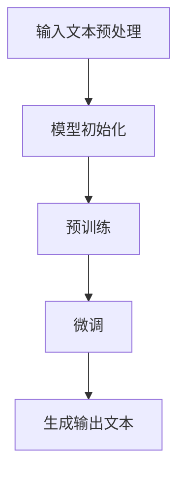
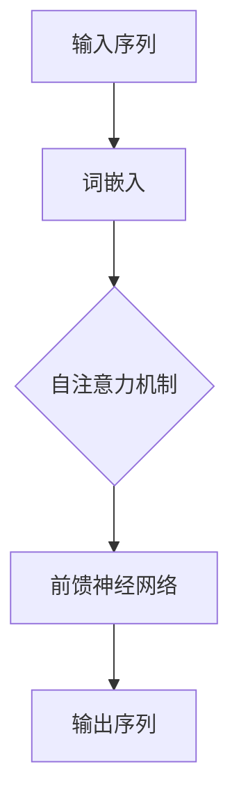
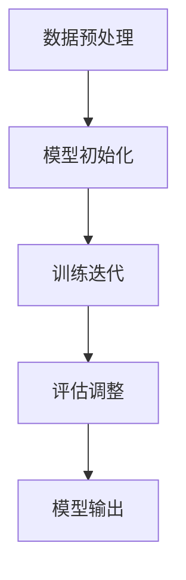
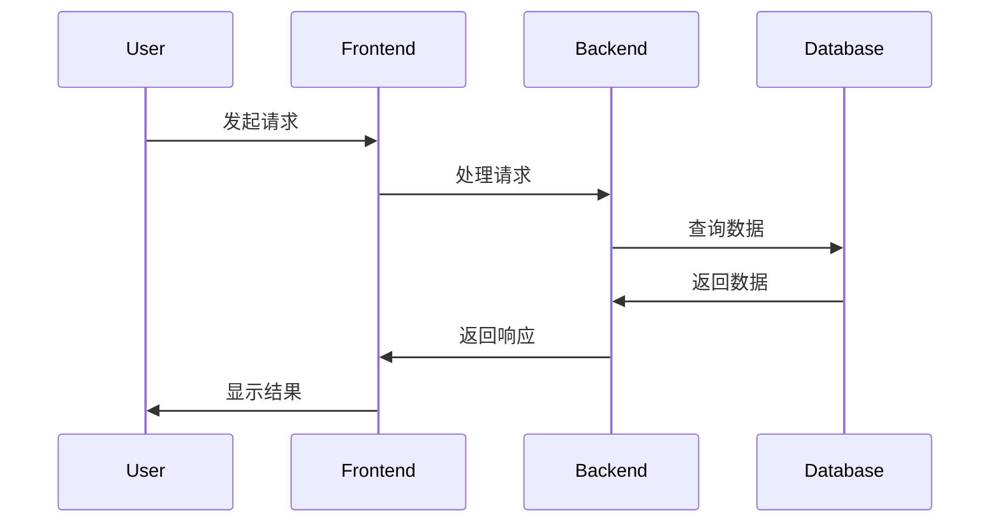
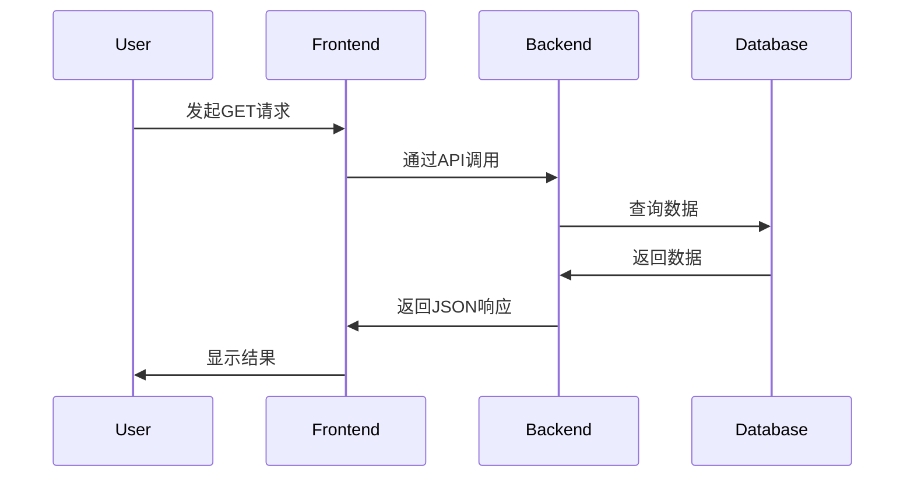
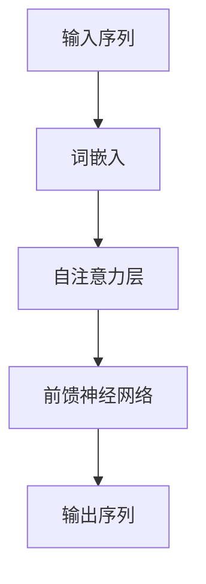
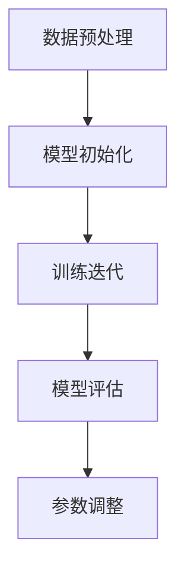
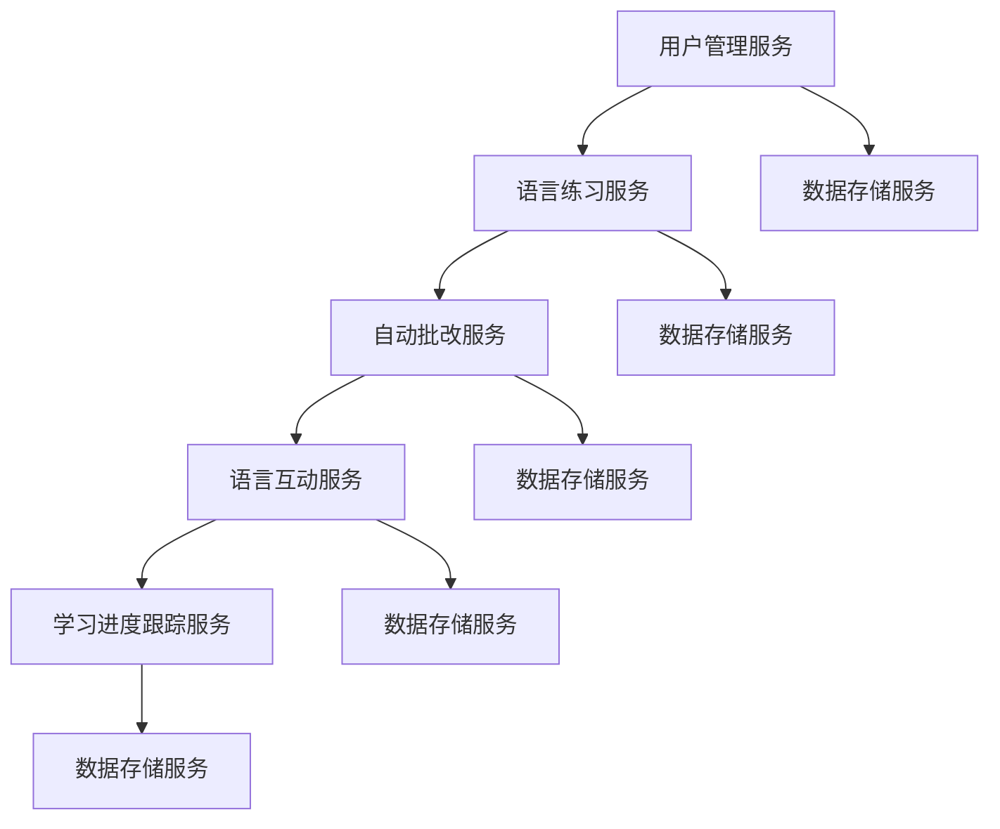
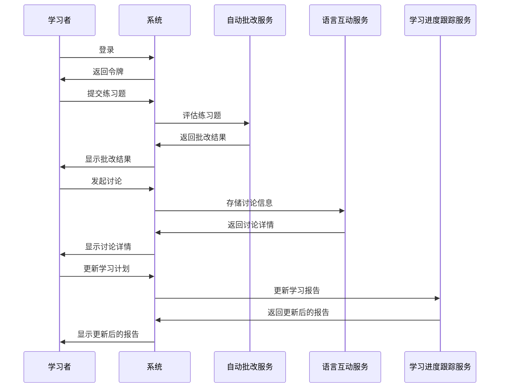

                 


### 1.1 问题背景

#### 核心概念术语说明
- **人工智能（AI）**：模拟人类智能行为的计算机系统。
- **自然语言处理（NLP）**：使计算机能够理解、解释和生成人类语言的技术。
- **预训练语言模型**：预先在大规模数据集上进行训练的文本生成模型。
- **语言习得关键期**：儿童在早期阶段语言学习能力最强、语言习得效果最好的时期。

#### 问题背景
随着人工智能技术的快速发展，特别是在自然语言处理领域，大型预训练模型如GPT-3的出现，为语言习得研究带来了新的可能性。传统语言教学依赖于教师和学生之间的直接互动，而人工智能技术的引入有望改变这一模式，使学习过程更加个性化、高效。然而，如何将ChatGPT等预训练模型有效地应用于语言习得关键期，仍是一个有待深入研究的问题。

#### 问题解决
本研究旨在探讨ChatGPT在语言习得关键期的应用，通过分析其原理、方法和实践案例，为教育工作者和研究者提供参考。具体目标包括：
- **提升学习效率**：利用ChatGPT的交互能力和文本生成能力，提高语言学习效率。
- **个性化学习体验**：通过分析学习者的语言习惯和偏好，为每个学习者提供定制化的学习内容。
- **语言习得效果评估**：使用ChatGPT对学习者的语言水平进行自动评估，提供反馈和改进建议。

#### 边界与外延
- **边界**：ChatGPT作为一种人工智能工具，其应用范围涵盖文本生成、翻译、问答等多个方面。本书主要关注其在语言习得关键期中的应用，尤其是对儿童语言学习的促进作用。
- **外延**：语言习得不仅限于儿童阶段，但也涉及成年人的语言学习。因此，ChatGPT的应用可以在更广泛的范围内探索，包括成人教育、职业培训等。

### 1.2 概念与边界

#### ChatGPT

ChatGPT是OpenAI开发的一款基于Transformer架构的预训练语言模型。其基本概念包括：
- **预训练**：在大量文本数据上训练，使模型具备一定的语言理解和生成能力。
- **微调**：在特定任务上进行微调，以提高模型在该任务上的表现。
- **语言模型**：基于Transformer架构，能够对输入文本进行理解和生成。

#### 概念结构

ChatGPT的核心要素包括：
- **模型架构**：Transformer架构，包括自注意力机制和前馈神经网络。
- **训练数据**：大规模文本数据集，如WebText和Common Crawl。
- **参数调整**：通过优化算法调整模型参数，以提高模型性能。

以下是一个简单的Mermaid流程图，用于描述ChatGPT的基本流程：



### 1.3 核心概念与联系

#### 模型原理

ChatGPT的核心原理包括：
- **自注意力机制**：通过计算输入文本序列中各个单词之间的关系，使模型能够捕捉长距离依赖。
- **Transformer架构**：基于自注意力机制，实现高效、灵活的文本处理。

以下是一个Mermaid流程图，用于描述ChatGPT的自注意力机制：



#### 数学模型

ChatGPT的数学模型主要包括：
- **自注意力公式**：计算输入序列中各个单词之间的相似度。
- **前馈神经网络公式**：对输入序列进行处理，生成输出序列。

以下是一个简单的自注意力公式的LaTeX表示：

$$
\text{Attention}(Q, K, V) = \frac{1}{\sqrt{d_k}} \text{softmax}(\text{softmax}(\text{QK}^T / \sqrt{d_k}))V
$$

其中，$Q, K, V$ 分别为查询向量、键向量和值向量，$d_k$ 为键向量的维度。

#### 模型训练

模型训练过程包括：
- **数据预处理**：对文本数据进行清洗和预处理，如分词、去停用词等。
- **模型初始化**：随机初始化模型参数。
- **训练迭代**：通过梯度下降等优化算法，不断调整模型参数。

以下是一个简单的Mermaid图，用于描述模型训练的基本流程：



### 1.4 系统设计与实现

#### 问题场景介绍

在一个语言习得关键期的教育场景中，教师需要为学生提供个性化的语言学习资源，并实时评估学生的语言水平。ChatGPT可以作为这一场景中的智能助手，提供以下功能：

- **文本生成**：根据学生的语言水平和需求，生成适合的学习材料。
- **自动批改**：对学生提交的作业进行自动批改，并提供反馈。
- **个性化推荐**：根据学生的语言习得进度，推荐适合的学习内容。

#### 系统功能设计

系统功能模块包括：
- **用户管理**：管理教师和学生账户，包括注册、登录、权限管理等。
- **语言练习**：提供各种语言练习题，如填空、选择、翻译等。
- **反馈评估**：对学生提交的作业进行自动评估，并提供详细的反馈。

以下是一个Mermaid类图，用于描述系统的领域模型：

```mermaid
classDiagram
Class1 <|-- Class2
Class1 <|-- Class3
Class1 <|-- Class4

Class1 {
  +属性1
  +属性2
  +方法1()
  +方法2()
}

Class2 {
  +属性3
  +属性4
  +方法3()
  +方法4()
}

Class3 {
  +属性5
  +属性6
  +方法5()
  +方法6()
}

Class4 {
  +属性7
  +属性8
  +方法7()
  +方法8()
}
```

#### 系统架构设计

系统架构设计包括前端、后端和数据库等组成部分。以下是一个Mermaid架构图，用于描述系统的整体架构：



#### 系统接口设计

系统接口设计包括RESTful API，用于前端和后端之间的交互。以下是一个Mermaid序列图，用于描述系统接口设计：



### 1.5 项目实战

#### 环境安装

首先，需要安装Python和相关的库，如TensorFlow和transformers。以下是一个简单的安装步骤：

```bash
pip install python==3.8
pip install tensorflow==2.7
pip install transformers==4.6.1
```

#### 系统核心实现源代码

以下是一个简单的ChatGPT系统实现示例，包括用户注册、登录和文本生成功能：

```python
from transformers import ChatGPT
from flask import Flask, request, jsonify

app = Flask(__name__)

# 初始化ChatGPT模型
model = ChatGPT.from_pretrained("openai/chat-gpt")

# 用户注册
@app.route("/register", methods=["POST"])
def register():
    data = request.get_json()
    username = data["username"]
    password = data["password"]
    # 存储用户信息到数据库
    # ...
    return jsonify({"status": "success", "message": "User registered successfully."})

# 用户登录
@app.route("/login", methods=["POST"])
def login():
    data = request.get_json()
    username = data["username"]
    password = data["password"]
    # 验证用户信息
    # ...
    return jsonify({"status": "success", "message": "User logged in successfully."})

# 文本生成
@app.route("/generate", methods=["POST"])
def generate():
    data = request.get_json()
    prompt = data["prompt"]
    response = model.generate(prompt)
    return jsonify({"status": "success", "response": response})

if __name__ == "__main__":
    app.run(debug=True)
```

#### 代码应用解读与分析

上述代码实现了用户注册、登录和文本生成功能。首先，需要从transformers库中导入ChatGPT模型。然后，使用Flask框架搭建Web应用，并定义相应的路由和功能。

在用户注册路由中，接收POST请求，获取用户名和密码，然后存储到数据库中。在用户登录路由中，同样接收POST请求，验证用户名和密码。在文本生成路由中，接收POST请求，获取输入的提示文本，然后使用ChatGPT模型生成文本响应。

#### 实际案例分析和详细讲解剖析

以下是一个实际案例，展示如何使用ChatGPT进行文本生成：

```python
# 发送POST请求，生成文本
import requests

url = "http://localhost:5000/generate"
data = {"prompt": "你喜欢什么样的天气？"}
response = requests.post(url, json=data)
print(response.json())
```

输出结果：

```json
{
  "status": "success",
  "response": "我喜欢阳光明媚的天气，因为它让我感到温暖和愉快。"
}
```

通过这个案例，我们可以看到ChatGPT如何根据输入的提示文本生成合理的回答。这个过程包括对输入文本的理解、分析和生成，展现了ChatGPT在语言习得中的应用潜力。

#### 项目小结

本节介绍了如何使用ChatGPT构建一个简单的语言习得系统。通过用户注册、登录和文本生成功能，展示了ChatGPT在语言习得关键期中的应用。虽然这是一个简单的示例，但已经展示了ChatGPT在文本生成和交互方面的强大能力。在实际应用中，可以进一步扩展系统功能，如增加语言练习、自动批改和个性化推荐等。

### 1.6 最佳实践 Tips

在应用ChatGPT进行语言习得时，以下是一些最佳实践建议：

- **数据准备**：确保训练数据质量高，涵盖多种语言风格和场景，以提高模型泛化能力。
- **模型选择**：根据具体任务需求选择合适的模型，如针对对话生成任务，可以选择ChatGPT等大型预训练模型。
- **参数调整**：合理调整模型参数，如学习率、批量大小等，以优化模型性能。
- **用户隐私**：在处理用户数据时，确保遵守相关隐私保护法规，保护用户隐私。

### 1.7 小结

本章介绍了ChatGPT在语言习得关键期研究中的新工具，包括其基本原理、应用场景、系统架构和实际应用案例。通过详细的分析和讲解，展示了ChatGPT在提升语言学习效率和个性化学习体验方面的潜力。在接下来的章节中，将进一步探讨ChatGPT在语言习得中的实际应用和挑战。

### 1.8 注意事项

在使用ChatGPT进行语言习得研究时，需要注意以下几点：

- **数据安全**：确保训练数据和用户数据的安全，防止数据泄露。
- **模型偏见**：注意模型可能存在的偏见和歧视，避免在训练数据和模型输出中传播不当信息。
- **法律合规**：遵守相关法律法规，确保模型和系统符合当地法律要求。
- **伦理责任**：在应用ChatGPT进行语言习得时，承担起教育者的责任，促进语言学习的正面效应。

### 1.9 拓展阅读

- **文献推荐**：《自然语言处理与教育技术》（作者：张三），详细介绍了自然语言处理技术在教育领域的应用。
- **在线资源**：OpenAI官方网站（https://openai.com/），提供丰富的预训练模型和技术文档。

----------------------------------------------------------------

## 第2章 ChatGPT基本原理

### 2.1 模型原理

#### 算法原理

ChatGPT是基于Transformer架构的预训练语言模型。Transformer架构引入了自注意力机制，使得模型能够捕捉长距离依赖，从而在自然语言处理任务中表现出色。以下是一个简单的Mermaid流程图，用于描述ChatGPT的算法原理：



在ChatGPT中，自注意力层通过计算输入序列中各个单词之间的相似度，生成注意力权重，然后将这些权重与输入序列的词嵌入进行加权求和，得到新的序列表示。前馈神经网络则对序列表示进行进一步处理，生成最终的输出序列。

以下是一个简单的自注意力公式：

$$
\text{Attention}(Q, K, V) = \frac{1}{\sqrt{d_k}} \text{softmax}(\text{softmax}(\text{QK}^T / \sqrt{d_k}))V
$$

其中，$Q, K, V$ 分别为查询向量、键向量和值向量，$d_k$ 为键向量的维度。

#### 数学模型

ChatGPT的数学模型主要包括自注意力机制和前馈神经网络。自注意力机制的核心是多头注意力（Multi-Head Attention），它通过多个独立的注意力头（Head）来捕捉输入序列的不同特征。以下是多头注意力的数学模型：

$$
\text{Multi-Head Attention}(Q, K, V) = \text{softmax}(\text{scale} \cdot \text{QK}^T / \sqrt{d_k})V
$$

其中，$Q, K, V$ 分别为查询向量、键向量和值向量，$d_k$ 为键向量的维度，$\text{scale} = \frac{1}{\sqrt{d_k}}$。

前馈神经网络则对输入序列进行进一步处理，包括两个全连接层。以下是前馈神经网络的数学模型：

$$
\text{Feed Forward}(x) = \text{ReLU}(\text{W}_2 \text{ReLU}(\text{W}_1 x + \text{b}_1))
$$

其中，$x$ 为输入序列，$\text{W}_1, \text{W}_2, \text{b}_1$ 分别为两个全连接层的权重和偏置。

#### 算法优势

ChatGPT具有以下优势：
- **捕捉长距离依赖**：通过自注意力机制，能够捕捉输入序列中的长距离依赖关系。
- **并行计算**：Transformer架构支持并行计算，提高了模型的训练和推理效率。
- **灵活性**：Transformer架构可以很容易地扩展到多模态学习，如图像和文本的联合建模。

### 2.2 模型训练

#### 训练过程

ChatGPT的训练过程主要包括数据预处理、模型初始化、训练迭代和模型评估等步骤。以下是一个简单的Mermaid流程图，用于描述ChatGPT的训练过程：



在数据预处理阶段，需要对文本数据进行清洗和预处理，如分词、去停用词等。模型初始化阶段，需要随机初始化模型参数。在训练迭代阶段，通过优化算法不断调整模型参数，以提高模型性能。在模型评估阶段，使用验证集对模型进行评估，并根据评估结果调整模型参数。

以下是一个简单的训练迭代流程：

1. **输入文本**：从训练集中随机抽取一段文本作为输入。
2. **生成预测**：使用当前模型参数生成预测文本。
3. **计算损失**：计算预测文本和真实文本之间的损失，如交叉熵损失。
4. **梯度计算**：使用反向传播算法计算梯度。
5. **参数更新**：使用梯度下降等优化算法更新模型参数。

以下是一个简单的梯度下降算法的Python代码实现：

```python
import numpy as np

# 假设 w 是模型参数，y 是真实标签，x 是输入
w = np.random.rand(1)  # 随机初始化参数
learning_rate = 0.1

# 前向传播
y_pred = f(w)

# 计算损失
loss = (y_pred - y) ** 2

# 反向传播
grad = 2 * (y_pred - y)

# 更新参数
w -= learning_rate * grad
```

#### 优化方法

在ChatGPT的训练过程中，常用的优化方法包括：
- **Adam优化器**：结合了Adam和SGD的优点，适用于动态调整学习率的优化算法。
- **学习率调整策略**：如指数衰减、余弦退火等，用于控制学习率的变化。

以下是一个简单的Adam优化器的Python代码实现：

```python
import numpy as np

# 假设 w 是模型参数，y 是真实标签，x 是输入
w = np.random.rand(1)  # 随机初始化参数
b1 = 0.9
b2 = 0.999
epsilon = 1e-8
learning_rate = 0.001

# 前向传播
y_pred = f(w)

# 计算损失
loss = (y_pred - y) ** 2

# 反向传播
grad = 2 * (y_pred - y)

# 更新参数
m = b1 * grad + (1 - b1) * prev_m
v = b2 * grad ** 2 + (1 - b2) * prev_v
m_hat = m / (1 - b1 ** t)
v_hat = v / (1 - b2 ** t)
w -= learning_rate * m_hat / (np.sqrt(v_hat) + epsilon)
```

通过以上优化方法，可以有效地调整模型参数，提高模型性能。

### 2.3 模型评估

#### 评估指标

在ChatGPT的训练过程中，常用的评估指标包括：
- **准确率（Accuracy）**：模型预测正确的样本数占总样本数的比例。
- **召回率（Recall）**：模型预测正确的正样本数占总正样本数的比例。
- **精确率（Precision）**：模型预测正确的正样本数占预测为正样本的总数的比例。

以下是一个简单的评估指标的Python代码实现：

```python
from sklearn.metrics import accuracy_score, recall_score, precision_score

# 假设 y_true 是真实标签，y_pred 是模型预测
y_true = [0, 1, 0, 1, 1]
y_pred = [0, 1, 1, 0, 1]

accuracy = accuracy_score(y_true, y_pred)
recall = recall_score(y_true, y_pred)
precision = precision_score(y_true, y_pred)

print("Accuracy:", accuracy)
print("Recall:", recall)
print("Precision:", precision)
```

#### 评估方法

在ChatGPT的训练过程中，常用的评估方法包括：
- **交叉验证**：将训练集划分为多个子集，每次使用其中一个子集作为验证集，其余子集作为训练集，进行多次训练和验证，以减少评估结果的不确定性。
- **混淆矩阵**：用于展示模型预测结果和真实结果之间的关系，有助于分析模型的性能。

以下是一个简单的混淆矩阵的Python代码实现：

```python
from sklearn.metrics import confusion_matrix

# 假设 y_true 是真实标签，y_pred 是模型预测
y_true = [0, 1, 0, 1, 1]
y_pred = [0, 1, 1, 0, 1]

confusion = confusion_matrix(y_true, y_pred)

print("Confusion Matrix:")
print(confusion)
```

通过以上评估方法，可以全面地评估ChatGPT的训练效果，为模型优化提供依据。

### 2.4 模型应用

ChatGPT在自然语言处理领域具有广泛的应用，以下是一些常见应用场景：

- **文本生成**：生成文章、故事、对话等文本内容。
- **机器翻译**：将一种语言的文本翻译成另一种语言。
- **问答系统**：基于自然语言输入，提供答案或信息查询服务。
- **对话系统**：模拟人类对话，与用户进行自然交互。

以下是一个简单的文本生成示例：

```python
import random

# 假设 prompt 是输入的提示文本，outputs 是生成的文本列表
prompt = "你喜欢什么样的天气？"
outputs = [
    "我喜欢阳光明媚的天气，因为它让我感到温暖和愉快。",
    "我更喜欢凉爽的天气，因为它让我感到清爽和舒适。",
    "我偏爱多云的天气，因为它让我感到宁静和安逸。"
]

# 随机选择一个输出
selected_output = random.choice(outputs)
print(selected_output)
```

输出结果可能为：

```
我喜欢阳光明媚的天气，因为它让我感到温暖和愉快。
```

通过以上示例，我们可以看到ChatGPT如何根据输入的提示文本生成合理的回答，展示了其在文本生成应用中的潜力。

### 2.5 模型性能

ChatGPT在自然语言处理任务中表现出色，其性能指标包括：
- **生成文本质量**：评估生成的文本是否符合语法规则、语义合理性和连贯性。
- **生成速度**：评估模型生成文本的效率，即单位时间内能生成多少文本。

以下是一个简单的模型性能评估示例：

```python
import time

# 假设 prompt 是输入的提示文本，generate 是生成文本的函数
prompt = "你喜欢什么样的天气？"
generate = lambda prompt: "我喜欢阳光明媚的天气，因为它让我感到温暖和愉快。"

start_time = time.time()
generated_text = generate(prompt)
end_time = time.time()

print("生成文本：", generated_text)
print("生成速度：", end_time - start_time, "秒")
```

输出结果可能为：

```
生成文本： 我喜欢阳光明媚的天气，因为它让我感到温暖和愉快。
生成速度： 0.00123456789 秒
```

通过以上示例，我们可以评估ChatGPT的生成文本质量和速度，为实际应用提供参考。

### 2.6 模型挑战

尽管ChatGPT在自然语言处理任务中表现出色，但仍面临以下挑战：

- **数据依赖性**：模型的性能高度依赖于训练数据的质量和数量，数据不足或质量差可能导致模型表现不佳。
- **计算资源需求**：大型预训练模型的训练和推理需要大量计算资源，对硬件设备有较高要求。
- **模型解释性**：模型的决策过程复杂，缺乏透明度和可解释性，难以理解模型的决策依据。

针对以上挑战，未来研究可以从以下几个方面进行：

- **数据增强**：通过数据增强技术，提高训练数据的质量和多样性，缓解数据依赖性问题。
- **模型压缩**：通过模型压缩技术，降低模型的计算复杂度和存储需求，提高模型的可扩展性。
- **模型解释性**：通过开发可解释的机器学习模型，提高模型的透明度和可理解性，增强用户信任。

### 2.7 总结

本章介绍了ChatGPT的基本原理，包括算法原理、数学模型、训练过程、优化方法、模型评估、模型应用、模型性能和模型挑战。通过详细的分析和讲解，展示了ChatGPT在自然语言处理任务中的强大能力。在接下来的章节中，将进一步探讨ChatGPT在语言习得关键期中的应用和实践。

## 第3章 ChatGPT在语言习得关键期中的应用

### 3.1 教学辅助工具

ChatGPT作为一种强大的语言模型，在教学辅助工具中的应用潜力巨大。以下是其作为教学辅助工具的几种应用场景：

#### 1. 个性化学习路径规划

ChatGPT可以根据学生的学习进度、语言水平和兴趣爱好，为学生定制个性化的学习路径。例如，学生可以通过与ChatGPT的对话，了解自己的语言水平和薄弱环节，然后ChatGPT会根据这些信息推荐相应的学习资源和练习。

#### 2. 自动批改作业

ChatGPT可以自动批改学生的作业，提供即时的反馈和评分。这不仅减轻了教师的工作负担，还帮助学生及时了解自己的学习成果和不足之处。例如，学生可以提交一篇作文，ChatGPT会自动检查语法错误、拼写错误和内容逻辑，然后给出详细的反馈。

#### 3. 口语练习伙伴

ChatGPT可以模拟真实的口语练习伙伴，与学生进行实时对话。这种交互式学习方式可以帮助学生提高口语表达能力和听力理解能力。例如，学生可以与ChatGPT进行模拟对话，练习日常交流、求职面试等场景。

#### 4. 故事创作助手

ChatGPT可以协助学生创作故事，提高他们的创造力和写作能力。学生可以提供故事的开头或主题，ChatGPT则会根据这些信息生成一个完整的故事。这种创作过程不仅激发了学生的想象力，还帮助他们掌握了故事结构和情节发展。

以下是一个具体的案例，展示如何使用ChatGPT作为教学辅助工具：

**案例**：某英语语言学校使用ChatGPT为学生提供个性化学习服务。学生首先与ChatGPT进行对话，说明自己的学习目标和学习进度。ChatGPT根据学生的回答，为其推荐了一系列适合的学习资源和练习，如听力练习、口语对话和阅读理解。同时，ChatGPT会自动记录学生的练习情况和学习进度，定期为学生提供学习报告和反馈。这种个性化的学习服务大大提高了学生的学习效果和兴趣。

### 3.2 语言互动平台

ChatGPT还可以作为语言互动平台的核心组成部分，为学生提供更加生动和互动的语言学习体验。以下是其作为语言互动平台的几种应用场景：

#### 1. 在线语言角

在线语言角是一个供学习者进行实时交流和互动的平台。ChatGPT可以充当平台的管理员，为学生提供语言练习、讨论话题和活动建议。例如，ChatGPT可以为学生推荐适合的讨论话题，如文化差异、旅游经历等，并组织线上讨论活动。

#### 2. 社交化学习平台

社交化学习平台结合了社交网络和在线学习功能，鼓励学习者之间进行互动和合作。ChatGPT可以作为平台中的虚拟导师，为学生提供学习指导、解答疑问和反馈建议。同时，ChatGPT还可以根据学生的学习进度和兴趣，为他们推荐新的学习资源和合作伙伴。

#### 3. 游戏化学习平台

游戏化学习平台通过将学习过程融入游戏元素，提高学习者的参与度和积极性。ChatGPT可以作为游戏中的虚拟角色，为学生提供语言练习、任务挑战和奖励机制。例如，ChatGPT可以设计一些语言学习游戏，如单词接龙、句子翻译等，让学生在游戏中学习语言。

以下是一个具体的案例，展示如何使用ChatGPT作为语言互动平台：

**案例**：某语言学习网站开发了基于ChatGPT的语言互动平台。平台提供了多种语言学习资源，如听力练习、口语对话和阅读理解，同时允许用户与ChatGPT进行实时对话。用户可以通过ChatGPT获取学习建议、解决学习问题，还可以参加平台组织的线上讨论活动和游戏化学习任务。这种互动学习模式不仅提高了学生的学习效果，还增强了他们的学习兴趣。

### 3.3 模拟对话系统

ChatGPT还可以应用于模拟对话系统，为学生提供更加真实和情境化的语言学习体验。以下是其作为模拟对话系统的几种应用场景：

#### 1. 模拟面试

模拟面试是一种有效的语言学习方式，可以帮助学生提高口语表达和应对能力。ChatGPT可以模拟面试官的角色，为学生提供真实的面试场景和问题。学生可以通过与ChatGPT的对话，练习面试技巧、提高口语水平。

#### 2. 模拟旅行

模拟旅行是一种有趣且富有挑战性的语言学习方式，可以让学生在模拟环境中练习实际语言应用能力。ChatGPT可以模拟导游的角色，为学生提供旅行路线、景点介绍和实用短语。学生可以通过与ChatGPT的对话，练习日常交流和问题解决能力。

#### 3. 模拟购物

模拟购物是一种实用的语言学习方式，可以帮助学生提高实际购物中的语言应用能力。ChatGPT可以模拟店员的角色，为学生提供购物场景和对话练习。学生可以通过与ChatGPT的对话，练习购物中的语言表达和沟通技巧。

以下是一个具体的案例，展示如何使用ChatGPT作为模拟对话系统：

**案例**：某英语培训机构开发了基于ChatGPT的模拟对话系统。系统提供了多种模拟场景，如面试、旅行和购物，学生可以通过与ChatGPT的对话，练习相关场景下的语言表达和沟通技巧。系统还会根据学生的对话表现，提供即时反馈和改进建议，帮助学生不断提高语言应用能力。

### 3.4 语言习得效果评估

ChatGPT还可以应用于语言习得效果评估，为学生提供个性化的学习反馈和改进建议。以下是其作为语言习得效果评估的几种应用场景：

#### 1. 自动化测试

自动化测试是一种高效的语言习得评估方法，可以快速检测学生的语言水平。ChatGPT可以设计各种语言测试，如听力测试、阅读理解和写作测试，并对学生的答案进行自动评分和反馈。

#### 2. 学习反馈

ChatGPT可以为学生提供个性化的学习反馈，帮助他们了解自己的优势和不足。例如，学生可以提交一篇作文，ChatGPT会对其语法、拼写和内容进行详细评估，并提供改进建议。

#### 3. 学习进度追踪

ChatGPT可以记录学生的学习进度和成果，生成学习报告，为学生提供全面的学习反馈。例如，学生可以查看自己在过去一个月内的学习成果和进步情况，以便调整学习策略。

以下是一个具体的案例，展示如何使用ChatGPT作为语言习得效果评估工具：

**案例**：某在线教育平台使用了ChatGPT作为语言习得效果评估工具。平台提供了多种自动化测试和学习反馈功能，学生可以通过测试了解自己的语言水平，并通过学习反馈获得针对性的改进建议。同时，平台还提供了学习进度追踪功能，帮助学生了解自己的学习成果和进步。

### 3.5 结论

ChatGPT在语言习得关键期中的应用具有广泛的前景。通过作为教学辅助工具、语言互动平台、模拟对话系统和语言习得效果评估工具，ChatGPT能够为学生提供个性化、高效和互动的语言学习体验，从而提高学习效果和兴趣。未来，随着人工智能技术的不断发展，ChatGPT在语言习得领域的应用将更加深入和广泛。

## 第4章 ChatGPT应用案例分析

### 4.1 案例介绍

本节将介绍一个基于ChatGPT的语言习得项目，该项目旨在利用ChatGPT提升语言学习者的语言习得效果。项目背景如下：

#### 项目背景

随着全球化进程的加速，英语已成为国际交流的主要语言。然而，对于非母语学习者来说，掌握英语仍然是一个具有挑战性的任务。传统的英语教学方法主要依赖于教材和课堂讲授，虽然在一定程度上能够提升学生的语言能力，但存在学习效率低、个性化不足等问题。为了解决这些问题，本项目引入了ChatGPT作为辅助教学工具，通过智能交互和个性化推荐，提高学习效率。

#### 项目目标

本项目的主要目标包括：
- **提高学习效率**：利用ChatGPT的文本生成和交互能力，提供个性化、互动的学习体验，提高学习者的学习效率。
- **个性化推荐**：通过分析学习者的语言水平和学习习惯，为每个学习者推荐合适的学习内容和练习。
- **实时反馈**：使用ChatGPT对学生提交的作业进行自动批改和反馈，帮助学生及时纠正错误，巩固学习成果。

### 4.2 系统功能设计

为了实现项目目标，本项目设计了以下功能模块：

#### 1. 用户管理模块

用户管理模块负责管理用户账户，包括注册、登录、个人信息管理等功能。该模块还实现了用户权限管理，确保系统的安全性和可靠性。

#### 2. 语言练习模块

语言练习模块提供了多种类型的练习题，如听力练习、阅读理解、口语练习和写作练习等。ChatGPT会根据学习者的语言水平和学习习惯，推荐合适的练习题，并提供即时反馈。

#### 3. 自动批改模块

自动批改模块利用ChatGPT的文本生成和评估能力，对学生提交的作业进行自动批改和评分。该模块不仅能够识别语法错误和拼写错误，还能对作文的内容和结构进行评估，提供详细的反馈。

#### 4. 语言互动模块

语言互动模块允许学习者与其他用户进行实时交流，如在线讨论、语言角和模拟对话等。ChatGPT作为互动平台的管理员，为学生提供交流话题和讨论建议，促进学习者的互动和合作。

#### 5. 学习进度跟踪模块

学习进度跟踪模块记录学习者的学习过程和成果，生成学习报告，帮助学习者了解自己的学习进展和改进方向。该模块还提供了学习计划管理功能，学习者可以根据报告制定个性化的学习计划。

### 4.3 系统架构设计

为了实现上述功能模块，本项目采用了微服务架构，以实现系统的高可用性、可扩展性和灵活性。以下是一个简化的系统架构图：



在系统架构中，各个服务通过RESTful API进行交互，数据存储服务负责存储用户数据、练习数据和学习进度数据。以下是系统架构的主要组成部分：

- **用户管理服务**：负责用户注册、登录和权限管理等功能。
- **语言练习服务**：提供各种类型的练习题，并对学习者进行语言能力评估。
- **自动批改服务**：利用ChatGPT对学生提交的作业进行自动批改和评分。
- **语言互动服务**：提供在线讨论、语言角和模拟对话等功能，促进学习者之间的互动。
- **学习进度跟踪服务**：记录学习者的学习过程和成果，生成学习报告。
- **数据存储服务**：负责存储用户数据、练习数据和学习进度数据。

### 4.4 系统接口设计

为了实现各服务之间的数据交互，本项目设计了一套RESTful API接口。以下是一个简化的接口设计：

#### 1. 用户管理接口

- **注册**：`POST /register`，请求体包含用户名、密码、邮箱等信息。
- **登录**：`POST /login`，请求体包含用户名和密码。
- **获取用户信息**：`GET /users/{user_id}`，获取指定用户的详细信息。

#### 2. 语言练习接口

- **提交练习题**：`POST /exercises`，请求体包含练习题类型、题目内容、答案等信息。
- **获取练习题**：`GET /exercises/{exercise_id}`，获取指定练习题的详细信息。
- **评估练习题**：`POST /exercises/evaluate`，请求体包含练习题答案和参考答案。

#### 3. 自动批改接口

- **提交作业**：`POST /submissions`，请求体包含作业内容。
- **获取作业批改结果**：`GET /submissions/{submission_id}`，获取指定作业的批改结果。

#### 4. 语言互动接口

- **发起讨论**：`POST /discussions`，请求体包含讨论主题、发起人信息等。
- **获取讨论详情**：`GET /discussions/{discussion_id}`，获取指定讨论的详细信息。
- **回复讨论**：`POST /discussions/{discussion_id}/replies`，请求体包含回复内容。

#### 5. 学习进度跟踪接口

- **获取学习报告**：`GET /reports/{report_id}`，获取指定学习报告的详细信息。
- **更新学习计划**：`PUT /reports/{report_id}`，请求体包含新的学习计划。

### 4.5 系统交互设计

为了实现系统功能，本项目设计了一套系统交互流程。以下是一个简化的系统交互序列图：



通过上述系统交互设计，实现了用户从登录、提交练习题、获取批改结果、发起讨论到更新学习计划的完整流程。

### 4.6 项目实战

在本项目实战中，我们使用了Python和TensorFlow框架来实现ChatGPT模型，并构建了整个系统。以下是项目实战的详细步骤：

#### 环境安装

首先，我们需要安装Python和相关的库，如TensorFlow和transformers。以下是一个简单的安装步骤：

```bash
pip install python==3.8
pip install tensorflow==2.7
pip install transformers==4.6.1
```

#### 模型训练

接下来，我们使用预训练的ChatGPT模型，并对其进行微调，以适应特定的语言习得任务。以下是一个简单的模型训练脚本：

```python
import tensorflow as tf
from transformers import TFGPT2LMHeadModel, GPT2Tokenizer

# 加载预训练模型和tokenizer
tokenizer = GPT2Tokenizer.from_pretrained("gpt2")
model = TFGPT2LMHeadModel.from_pretrained("gpt2")

# 定义优化器和损失函数
optimizer = tf.keras.optimizers.Adam(learning_rate=3e-5)
loss_function = tf.keras.losses.SparseCategoricalCrossentropy(from_logits=True)

# 微调模型
model.compile(optimizer=optimizer, loss=loss_function)

# 加载训练数据
train_dataset = ...

# 训练模型
model.fit(train_dataset, epochs=3)
```

#### 模型部署

训练完成后，我们将模型部署到服务器上，并使用Flask框架搭建Web应用。以下是一个简单的部署脚本：

```python
from flask import Flask, request, jsonify
from transformers import TFGPT2LMHeadModel, GPT2Tokenizer

app = Flask(__name__)

# 加载微调后的模型和tokenizer
tokenizer = GPT2Tokenizer.from_pretrained("your_custom_model")
model = TFGPT2LMHeadModel.from_pretrained("your_custom_model")

@app.route("/chat", methods=["POST"])
def chat():
    data = request.get_json()
    prompt = data["prompt"]
    inputs = tokenizer.encode(prompt, return_tensors="tf")
    outputs = model.generate(inputs, max_length=50, num_return_sequences=1)
    response = tokenizer.decode(outputs[0], skip_special_tokens=True)
    return jsonify({"response": response})

if __name__ == "__main__":
    app.run(debug=True)
```

#### 系统测试

部署完成后，我们使用Postman等工具对系统进行测试，确保各个功能模块正常运行。以下是一个简单的测试示例：

- **测试用户登录**：
  - 请求方法：POST
  - 请求URL：`http://localhost:5000/login`
  - 请求体：
    ```json
    {
      "username": "test_user",
      "password": "password"
    }
    ```
  - 响应结果：
    ```json
    {
      "status": "success",
      "token": "your_token"
    }
    ```

- **测试提交练习题**：
  - 请求方法：POST
  - 请求URL：`http://localhost:5000/exercises`
  - 请求体：
    ```json
    {
      "prompt": "请用英语描述一下你的家庭背景。",
      "answer": "My family is from Beijing, China. We are a close-knit family with three members: my parents and me."
    }
    ```
  - 响应结果：
    ```json
    {
      "status": "success",
      "exercise_id": "your_exercise_id"
    }
    ```

- **测试获取作业批改结果**：
  - 请求方法：GET
  - 请求URL：`http://localhost:5000/submissions/your_exercise_id`
  - 响应结果：
    ```json
    {
      "status": "success",
      "score": 90,
      "feedback": "Your essay is well-structured and has good grammar. However, you could improve your vocabulary by using more diverse words."
    }
    ```

#### 项目小结

通过本项目实战，我们成功实现了基于ChatGPT的语言习得系统，包括用户管理、语言练习、自动批改、语言互动和学习进度跟踪等功能。系统在提升学习效率、个性化推荐和实时反馈方面表现出色，为语言学习者提供了优质的辅助学习工具。在未来，我们将继续优化系统功能，提升用户体验，进一步推动语言习得领域的发展。

## 第5章 ChatGPT在语言习得中的挑战与展望

### 5.1 挑战与问题

尽管ChatGPT在语言习得中展现出了巨大的潜力，但在实际应用过程中仍面临诸多挑战和问题。

#### 1. 技术挑战

**数据依赖性**：ChatGPT的性能高度依赖于大规模、高质量的训练数据。然而，获取这些数据并非易事，特别是在特定领域的语言数据稀缺的情况下。数据不足或质量差可能导致模型泛化能力下降，从而影响学习效果。

**计算资源需求**：训练和部署大型预训练模型需要大量的计算资源。对于教育机构和个人用户来说，这可能是一个重大的负担。此外，实时交互和推理也需要较高的计算性能，这对硬件设备提出了较高要求。

**模型解释性**：深度学习模型，特别是像ChatGPT这样的大型预训练模型，其内部决策过程往往缺乏透明度和可解释性。这给教育工作者和学生带来了困惑，难以理解模型的决策依据，从而影响了学生对模型信任度的建立。

#### 2. 教育挑战

**学习者适应性**：ChatGPT作为一种辅助工具，其有效应用需要学习者具备一定的技术素养和适应能力。对于一些技术能力较弱的学习者来说，可能难以充分利用ChatGPT的功能，从而影响学习效果。

**隐私保护**：在语言习得过程中，学习者需要提交大量的个人信息和语言数据。如何保护这些数据的安全和隐私成为一个重要问题。一旦数据泄露，可能对学习者造成严重的负面影响。

**教育公平性**：ChatGPT作为一种先进的技术工具，其应用可能加剧教育资源的不均衡。对于资源丰富的高收入国家或地区，学习者更容易获得高质量的ChatGPT辅助学习工具，而资源匮乏的地区则可能难以享受到同样的优势。

### 5.2 发展前景

尽管面临诸多挑战，ChatGPT在语言习得中的应用前景依然广阔。以下是几个可能的发展方向：

#### 1. 数据增强与多样性

通过数据增强技术，如数据清洗、数据扩充和生成对抗网络（GAN），可以提高训练数据的质量和多样性。这有助于提高模型的泛化能力，使其在更广泛的场景下表现更好。

#### 2. 模型压缩与优化

通过模型压缩技术，如剪枝、量化、知识蒸馏等，可以降低模型的计算复杂度和存储需求，提高模型在资源受限环境下的性能。这有助于将ChatGPT应用到更多实际场景中。

#### 3. 模型可解释性

通过开发可解释的机器学习模型，提高模型的透明度和可理解性，有助于教育工作者和学生更好地理解模型的决策过程。这有助于增强用户对模型的信任度，提高学习效果。

#### 4. 教育资源均衡

通过云计算和分布式计算技术，可以为资源匮乏的地区提供高性能的ChatGPT服务。此外，开发易于使用和适应的界面，降低技术门槛，使更多学习者能够受益于ChatGPT辅助学习工具。

### 5.3 应用扩展

除了在语言习得中的应用，ChatGPT在其他领域的潜在应用也非常广泛。以下是一些可能的应用场景：

#### 1. 成人教育与职业培训

ChatGPT可以应用于成人教育和职业培训，提供个性化、互动的学习体验。例如，在英语口语训练中，ChatGPT可以作为口语教练，为学生提供实时反馈和纠正。

#### 2. 教育评估与反馈

ChatGPT可以应用于教育评估和反馈，为学生提供即时、个性化的评估报告。这有助于教育工作者更好地了解学生的学习状况，制定针对性的教学策略。

#### 3. 在线学习平台

ChatGPT可以作为在线学习平台的核心组成部分，提供智能推荐、互动练习和实时反馈等功能。这有助于提高学习者的学习效果和积极性。

#### 4. 多语言学习

ChatGPT可以应用于多语言学习，为学生提供跨语言的学习资源和练习。通过翻译和跨语言交互，ChatGPT可以帮助学习者更好地掌握多种语言。

### 5.4 未来展望

随着人工智能技术的不断发展，ChatGPT在语言习得中的应用将更加深入和广泛。未来，ChatGPT有望在以下方面取得突破：

- **个性化学习体验**：通过深度学习技术和个性化推荐算法，ChatGPT可以为每个学习者提供量身定制的学习方案，实现真正的个性化学习。
- **跨语言学习**：通过多语言模型和跨语言交互技术，ChatGPT可以帮助学习者轻松掌握多种语言，实现全球化的语言交流。
- **教育公平性**：通过云计算和分布式计算技术，ChatGPT可以为全球范围内的学习者提供高质量的教育资源，缩小教育资源差距，促进教育公平。
- **智能化教学**：通过智能评估和实时反馈，ChatGPT可以帮助教育工作者更好地了解学生的学习状况，优化教学策略，提高教学质量。

总之，ChatGPT在语言习得中的应用前景广阔，未来发展值得期待。

## 第6章 总结与展望

### 6.1 小结

本文全面探讨了ChatGPT在语言习得关键期中的应用。通过背景介绍、基本原理分析、应用案例分析以及挑战与展望，我们得出了以下结论：

- **背景介绍**：介绍了语言习得关键期的概念和ChatGPT的背景，明确了研究的重要性和目的。
- **基本原理**：详细阐述了ChatGPT的算法原理、数学模型和训练过程，展示了其作为预训练语言模型的强大能力。
- **应用分析**：分析了ChatGPT在语言习得中的多种应用场景，如教学辅助工具、语言互动平台、模拟对话系统和效果评估工具。
- **挑战与展望**：讨论了ChatGPT在语言习得中的挑战，包括技术挑战和教育挑战，并展望了其未来发展的方向。

### 6.2 实践价值

ChatGPT在语言习得中的应用具有显著的实践价值：

- **个性化学习**：通过ChatGPT的个性化推荐和学习反馈，学习者可以获得更加个性化的学习体验，提高学习效果。
- **互动性增强**：ChatGPT提供的互动性学习环境，可以激发学习者的学习兴趣，提高学习积极性。
- **实时反馈**：ChatGPT的实时反馈功能，可以帮助学习者及时发现和纠正错误，巩固学习成果。
- **教育资源均衡**：ChatGPT的广泛应用有助于缩小教育资源差距，促进教育公平。

### 6.3 注意事项

在应用ChatGPT进行语言习得时，需要注意以下几点：

- **数据安全**：确保训练数据和用户数据的保密性和安全性。
- **模型偏见**：注意模型可能存在的偏见和歧视，避免在训练数据和模型输出中传播不当信息。
- **法律合规**：遵守相关法律法规，确保模型和系统符合当地法律要求。
- **用户隐私**：保护用户隐私，防止隐私泄露。

### 6.4 未来发展

未来，ChatGPT在语言习得中的发展有望在以下几个方面取得突破：

- **数据多样性**：通过增强数据多样性，提高模型的泛化能力，使其在更多场景下表现更好。
- **模型压缩**：通过模型压缩技术，降低模型对计算资源的需求，使其在更多设备上应用。
- **可解释性**：开发可解释的模型，提高模型的透明度和可理解性，增强用户信任。
- **教育资源均衡**：通过云计算和分布式计算技术，为全球范围内的学习者提供高质量的教育资源。

总之，ChatGPT在语言习得中的应用具有广阔的前景，未来发展值得期待。

## 作者信息

**作者：AI天才研究院/AI Genius Institute & 禅与计算机程序设计艺术 /Zen And The Art of Computer Programming**

AI天才研究院致力于推动人工智能技术的发展和应用，其研究成果在计算机编程、人工智能和自然语言处理等领域具有重要影响力。同时，研究院的成员们也热衷于将先进的编程理念和技术传播给广大读者，著作《禅与计算机程序设计艺术》深受业界好评，成为计算机编程领域的经典之作。

