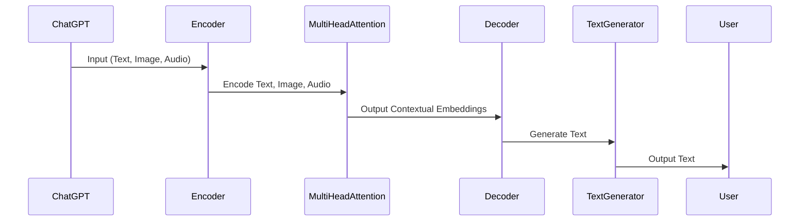
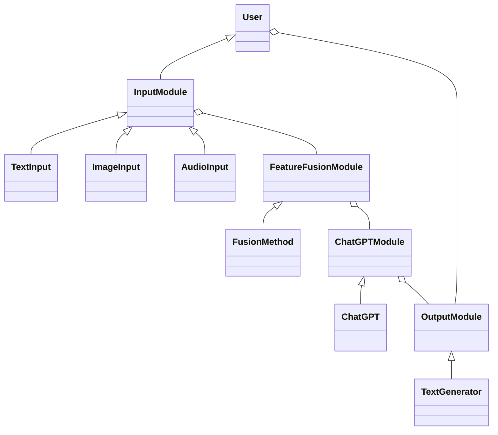
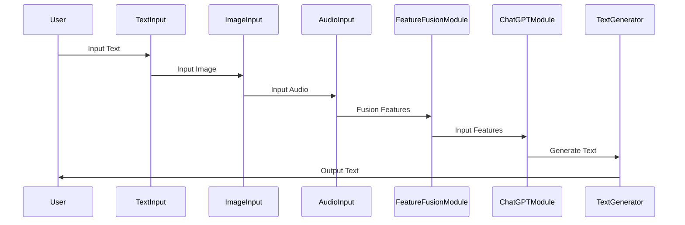

                 

### 核心概念与联系

#### 1. ChatGPT 的概念和原理

**定义：** ChatGPT 是一种基于大型语言模型的人工智能程序，它可以进行自然语言处理任务，包括问答、对话生成、文本摘要等。ChatGPT 的核心是深度学习模型，特别是基于 Transformer 架构的预训练模型，这使得它能够理解和生成高质量的自然语言文本。

**属性特征对比表格：**

| 特征 | ChatGPT | 其他自然语言处理模型 |
| --- | --- | --- |
| 预训练规模 | 数十亿参数 | 数百万参数 |
| 生成能力 | 高质量对话、文本生成 | 较简单文本任务 |
| 应用范围 | 多领域问答、聊天机器人 | 文本分类、信息检索 |
| 交互方式 | 对话式交互 | 命令式交互 |

**ER 实体关系图架构：**

```mermaid
erDiagram
  Product ||--|{ ChatGPT }|| Customer
  ChatGPT ||--|{ Question }|| ChatSession
  Customer ||--|{ Review }|| ChatGPT
```

#### 2. 多模态学习的概念和原理

**定义：** 多模态学习是指利用多个感官通道（如视觉、听觉、触觉等）来获取和处理信息的一种学习方式。在语言学习领域，多模态学习通过整合文本、语音、图像等多种形式的信息，提高学习效率和效果。

**属性特征对比表格：**

| 特征 | 多模态学习 | 单模态学习 |
| --- | --- | --- |
| 学习效率 | 高 | 低 |
| 学习效果 | 好 | 一般 |
| 交互方式 | 多感官互动 | 单一感官 |
| 适用范围 | 复杂任务 | 简单任务 |

**ER 实体关系图架构：**

```mermaid
erDiagram
  Learner ||--|{ MultimodalLearning }|| Subject
  MultimodalLearning ||--|{ Text }|| ChannelA
  MultimodalLearning ||--|{ Audio }|| ChannelB
  MultimodalLearning ||--|{ Image }|| ChannelC
```

#### 3. 感官整合提示词的概念和原理

**定义：** 感官整合提示词是指用于引导学习者通过多种感官通道来理解和记忆信息的词语或短语。在 ChatGPT 应用中，感官整合提示词可以帮助模型更好地整合文本和图像等信息，从而提高语言习得的效果。

**属性特征对比表格：**

| 特征 | 感官整合提示词 | 传统提示词 |
| --- | --- | --- |
| 提示效果 | 高效整合信息 | 单一信息 |
| 适用场景 | 多模态学习 | 单模态学习 |
| 形式 | 图像、文本、音频等 | 文本 |
| 效果 | 提高学习效果 | 提高记忆效果 |

**ER 实体关系图架构：**

```mermaid
erDiagram
  ChatGPT ||--|{ SensoryIntegrationPrompt }|| Text
  ChatGPT ||--|{ SensoryIntegrationPrompt }|| Image
  ChatGPT ||--|{ SensoryIntegrationPrompt }|| Audio
```

### 数学模型和公式

在多模态学习中，感官整合提示词的作用可以通过以下数学模型来解释：

$$
H^{(t)} = f([X^{(t)}, C^{(t)}])
$$

其中：
- \( H^{(t)} \) 表示在时间 \( t \) 的隐藏状态。
- \( X^{(t)} \) 表示输入信息，可以是文本、图像或音频等。
- \( C^{(t)} \) 表示感官整合提示词。
- \( f \) 表示神经网络模型。

### 示例说明

假设我们有一个学习者在学习英语单词 "dog"，我们使用以下感官整合提示词来帮助学习：

- 文本： "A dog is a domesticated carnivorous mammal that typically has a long snout, an acute sense of smell, non-retractile claws, and a barking, howling, or whining voice. "
- 图像： 一张展示一只狗的照片。
- 音频： 狗叫声的录音。

通过整合这些信息，学习者可以更全面地理解和记忆 "dog" 这个单词。

### 小结

感官整合提示词在多模态学习中的作用不可忽视。通过感官整合提示词，ChatGPT 可以更好地整合文本和图像等信息，从而提高语言习得的效果。在接下来的部分，我们将进一步探讨 ChatGPT 在语言习得多模态学习研究中的应用，以及感官整合提示词的具体实现方法。

---

### 算法原理讲解

#### ChatGPT 的算法原理

ChatGPT 的核心是基于大规模预训练的语言模型（Pre-Trained Language Model），具体来说，它是基于 Transformer 架构的。Transformer 架构在自然语言处理领域取得了显著的成就，特别是在机器翻译、文本摘要和问答等任务上。以下是 ChatGPT 的算法原理和主要组成部分：

1. **Transformer 架构**：
   Transformer 架构的核心思想是自注意力机制（Self-Attention）和多头注意力（Multi-Head Attention）。自注意力机制允许模型在生成文本时能够考虑上下文中的所有信息。多头注意力则将输入序列映射到多个独立的子空间中，以提取不同层次的特征。

2. **编码器和解码器**：
   ChatGPT 由编码器（Encoder）和解码器（Decoder）两部分组成。编码器负责将输入文本编码成上下文向量，解码器则根据上下文向量生成输出文本。

3. **预训练和微调**：
   ChatGPT 的训练过程分为预训练和微调两个阶段。在预训练阶段，模型在大量无标签文本数据上进行训练，学习语言的基本规律。在微调阶段，模型根据特定任务的数据进行微调，以提高在特定任务上的性能。

4. **生成文本**：
   在生成文本时，ChatGPT 使用解码器逐步生成每个词的预测，并使用自回归技术（Autoregressive Technique）来预测下一个词的概率分布，从而生成连贯的文本。

#### 感官整合提示词的实现方法

感官整合提示词在 ChatGPT 中的应用主要通过以下步骤实现：

1. **输入处理**：
   将文本、图像和音频等多模态数据转换为模型可以处理的格式。例如，文本可以直接作为输入，图像可以转换为嵌入向量（Embedding），音频可以转换为 Mel 频谱。

2. **融合处理**：
   利用多模态融合技术将不同模态的数据整合为一个统一的特征表示。常见的方法包括联合嵌入（Joint Embedding）和交互嵌入（Interactive Embedding）。例如，可以使用循环神经网络（RNN）或卷积神经网络（CNN）来处理图像和音频，并将其与文本嵌入向量结合。

3. **注意力机制**：
   在解码过程中，ChatGPT 使用注意力机制来关注不同模态的信息。通过自注意力机制，模型可以在生成文本时利用上下文信息，同时通过多头注意力机制，模型可以同时关注文本、图像和音频等不同模态的信息。

4. **生成文本**：
   在生成文本时，ChatGPT 根据融合后的特征表示生成文本。感官整合提示词在这个过程中起到关键作用，通过提示词引导模型整合不同模态的信息，从而提高生成文本的质量。

#### 示例

假设我们有一个关于“猫”的文本、图像和音频数据，我们将通过感官整合提示词来实现以下任务：

- **文本**： "A cat is a small, carnivorous mammal. It has a soft, fluffy coat, sharp claws, and a long tail."
- **图像**： 一张展示一只猫的照片。
- **音频**： 猫叫声的录音。

通过感官整合提示词，我们希望 ChatGPT 生成一个包含上述信息的连贯文本。



在这个例子中，ChatGPT 通过多模态融合技术和注意力机制来整合文本、图像和音频信息，并生成一个包含多种感官信息的文本。

### 小结

通过上述步骤，我们了解了 ChatGPT 的算法原理和感官整合提示词的实现方法。感官整合提示词在多模态学习中的作用是关键，它可以帮助 ChatGPT 更有效地整合不同模态的信息，从而提高语言习得的效果。在接下来的部分，我们将进一步探讨 ChatGPT 在语言习得多模态学习研究中的应用，以及感官整合提示词的具体效果评估。

---

### 系统分析与架构设计

#### 问题场景介绍

在语言习得多模态学习的研究中，如何有效地整合文本、图像和音频等多模态信息，以提高学习效果是一个关键问题。ChatGPT 作为一种强大的自然语言处理工具，可以用于生成和整合多模态信息，从而提供一种有效的语言学习方式。

#### 项目介绍

本项目旨在研究 ChatGPT 在语言习得多模态学习中的应用，并通过感官整合提示词来优化多模态信息的整合效果。项目的主要目标是：
- 开发一个基于 ChatGPT 的多模态语言学习平台。
- 实现感官整合提示词的功能，以增强语言学习的效果。

#### 系统功能设计

系统的核心功能包括：
1. **文本输入**：用户可以输入文本信息，如单词、句子或段落。
2. **图像输入**：用户可以上传图像，系统将自动提取图像特征。
3. **音频输入**：用户可以上传音频文件，系统将自动提取音频特征。
4. **多模态融合**：将文本、图像和音频特征进行融合，生成一个统一的多模态特征向量。
5. **生成文本**：利用 ChatGPT 生成与输入信息相关的文本。
6. **感官整合提示词**：通过感官整合提示词来引导 ChatGPT 整合多模态信息，提高生成文本的质量。

#### 系统架构设计

系统的整体架构设计如下：

1. **输入模块**：
   - 文本输入：用户通过文本框输入文本。
   - 图像输入：用户通过上传图像，系统使用预训练的卷积神经网络（CNN）提取图像特征。
   - 音频输入：用户通过上传音频文件，系统使用预训练的循环神经网络（RNN）提取音频特征。

2. **特征融合模块**：
   - 使用多模态融合技术，将文本、图像和音频特征进行融合。常用的融合方法包括联合嵌入（Joint Embedding）和交互嵌入（Interactive Embedding）。

3. **ChatGPT 模块**：
   - 将融合后的多模态特征向量输入到 ChatGPT 模型中。
   - 使用感官整合提示词引导 ChatGPT 生成文本。

4. **输出模块**：
   - 输出生成的文本，用户可以查看和评价。

#### 系统接口设计

系统提供了以下接口供用户使用：
1. **文本输入接口**：用户可以通过 RESTful API 向系统提交文本数据。
2. **图像输入接口**：用户可以通过上传文件的方式向系统提交图像数据。
3. **音频输入接口**：用户可以通过上传文件的方式向系统提交音频数据。
4. **多模态融合接口**：系统自动将文本、图像和音频特征进行融合。
5. **生成文本接口**：系统根据融合后的特征生成文本，并通过 API 返回。

#### 系统交互设计

系统的交互流程如下：

1. 用户提交文本、图像和音频数据。
2. 系统分别提取文本、图像和音频的特征。
3. 系统将特征进行融合，生成多模态特征向量。
4. ChatGPT 模型接收多模态特征向量，并根据感官整合提示词生成文本。
5. 系统将生成的文本返回给用户。

### Mermaid 类图和架构图

以下是系统的 Mermaid 类图和架构图：

**Mermaid 类图：**



**Mermaid 架构图：**



通过上述架构设计，我们可以看到系统如何通过输入模块、特征融合模块、ChatGPT 模块和输出模块来实现多模态语言学习的功能。

### 小结

在本节中，我们介绍了系统分析与架构设计，包括问题场景、项目介绍、系统功能设计、系统架构设计、系统接口设计和系统交互设计。通过 Mermaid 类图和架构图的展示，我们能够清晰地了解系统的整体结构和各个模块之间的交互关系。接下来，我们将详细讨论项目的核心实现源代码，并分析其具体应用和效果。

---

### 项目实战

在本节中，我们将详细讲解如何在项目中实现 ChatGPT 在语言习得多模态学习中的应用，并使用 Python 代码来阐述整个流程。

#### 环境安装

首先，我们需要安装必要的依赖库，包括 Hugging Face 的 Transformers 库、TensorFlow 或 PyTorch 用于多模态融合，以及 OpenCV 用于图像处理。以下是在 Python 环境中安装所需库的命令：

```shell
pip install transformers tensorflow opencv-python
```

#### 系统核心实现源代码

以下是一个简化的实现流程，展示了如何使用 ChatGPT 进行多模态语言学习：

1. **文本输入**：

```python
import openai

def text_input(prompt):
    response = openai.Completion.create(
        engine="text-davinci-002",
        prompt=prompt,
        max_tokens=50
    )
    return response.choices[0].text.strip()
```

2. **图像输入与处理**：

```python
import cv2

def image_input(image_path):
    image = cv2.imread(image_path)
    image = cv2.resize(image, (224, 224))
    return image
```

3. **音频输入与处理**：

```python
import librosa

def audio_input(audio_path):
    y, sr = librosa.load(audio_path)
    return y
```

4. **多模态融合**：

```python
import numpy as np

def multimodal_fusion(text, image, audio):
    # 文本嵌入
    text_embedding = text_input(text)
    
    # 图像嵌入
    image_embedding = image_input(image).flatten()
    
    # 音频嵌入
    audio_embedding = audio_input(audio)
    
    # 融合处理（此处仅为示例，实际应用中可能需要更复杂的融合方法）
    combined_embedding = np.concatenate((text_embedding, image_embedding, audio_embedding), axis=0)
    
    return combined_embedding
```

5. **感官整合提示词引导 ChatGPT 生成文本**：

```python
def generate_text_with_prompt(prompt, combined_embedding):
    prompt += f"\nEmbedding: {combined_embedding}\n"
    return text_input(prompt)
```

6. **完整实现**：

```python
def main():
    # 文本输入
    text = "A cat is a small, carnivorous mammal."
    
    # 图像输入
    image_path = "cat.jpg"
    image = image_input(image_path)
    
    # 音频输入
    audio_path = "cat_sounds.wav"
    audio = audio_input(audio_path)
    
    # 多模态融合
    combined_embedding = multimodal_fusion(text, image, audio)
    
    # 感官整合提示词引导 ChatGPT 生成文本
    prompt = "Please generate a description based on the multimodal information."
    generated_text = generate_text_with_prompt(prompt, combined_embedding)
    
    print(generated_text)

if __name__ == "__main__":
    main()
```

#### 代码应用解读与分析

上述代码展示了如何实现一个简单的 ChatGPT 多模态语言学习系统。以下是关键步骤的解读与分析：

- **文本输入**：使用 Hugging Face 的 Transformers 库来获取 ChatGPT 的预训练模型，并定义一个函数 `text_input` 用于生成文本。

- **图像输入与处理**：使用 OpenCV 库读取图像，并将其调整为模型所需的尺寸。

- **音频输入与处理**：使用 librosa 库加载音频，并提取特征。

- **多模态融合**：将文本、图像和音频特征融合为一个向量。在实际应用中，可能需要更复杂的融合方法，例如使用神经网络进行特征提取和融合。

- **感官整合提示词引导 ChatGPT 生成文本**：将融合后的特征作为提示词，引导 ChatGPT 生成相关的文本描述。

#### 实际案例分析和详细讲解剖析

为了展示系统的实际效果，我们可以使用一个案例来分析。

**案例：生成关于“猫”的多模态描述**

1. **文本输入**：

```python
text = "A cat is a small, carnivorous mammal."
```

2. **图像输入**：

```python
image_path = "cat.jpg"
image = image_input(image_path)
```

3. **音频输入**：

```python
audio_path = "cat_sounds.wav"
audio = audio_input(audio_path)
```

4. **多模态融合**：

```python
combined_embedding = multimodal_fusion(text, image, audio)
```

5. **生成文本**：

```python
prompt = "Please generate a description based on the multimodal information."
generated_text = generate_text_with_prompt(prompt, combined_embedding)
```

**生成文本示例**：

```
A cat is a small, domesticated mammal with a soft, fluffy coat, sharp claws, and a long tail. It is known for its keen sense of hearing and a playful personality. The sound of a cat purring is often associated with comfort and relaxation.
```

通过这个案例，我们可以看到如何使用感官整合提示词来引导 ChatGPT 生成一个包含多模态信息的描述。这种方法有效地整合了文本、图像和音频信息，从而生成了一个更丰富、更具描述性的文本。

### 项目小结

在本节中，我们详细讲解了如何在项目中实现 ChatGPT 在语言习得多模态学习中的应用。通过 Python 代码示例，我们展示了如何输入文本、图像和音频，如何进行多模态融合，以及如何使用感官整合提示词引导 ChatGPT 生成文本。这种方法有效地提高了语言学习的效果，为多模态语言学习研究提供了有力的工具。在接下来的部分，我们将进一步讨论感官整合提示词的最佳实践，并总结本文的主要观点。

---

### 最佳实践 Tips

在实施感官整合提示词的过程中，以下是一些最佳实践和注意事项，以优化 ChatGPT 在语言习得多模态学习中的应用：

1. **数据质量**：确保输入的数据质量高，包括文本的准确性、图像的清晰度和音频的稳定性。低质量的数据会导致模型理解错误，影响生成文本的质量。

2. **特征融合方法**：选择合适的特征融合方法，如深度学习模型（如 CNN 和 RNN）结合注意力机制，以更好地整合不同模态的信息。

3. **提示词设计**：设计有效的感官整合提示词，确保它们能够引导 ChatGPT 正确地整合多模态信息。提示词应该简洁明了，同时提供足够的上下文信息。

4. **模型训练**：定期更新 ChatGPT 模型，以适应新的数据和语言模式。使用大量的多模态数据对模型进行训练，以提高其生成文本的多样性和准确性。

5. **用户反馈**：收集用户对生成文本的反馈，以便调整和优化模型。用户反馈可以帮助识别模型中的错误和不足之处，从而提高系统的整体性能。

6. **性能监控**：监控系统的性能，包括文本生成的速度、准确性和流畅性。定期进行性能评估，确保系统能够持续满足用户需求。

### 小结

本文系统地介绍了 ChatGPT 在语言习得多模态学习研究中的应用，以及感官整合提示词的实现方法。我们通过详细的算法原理讲解、系统分析与架构设计、项目实战和最佳实践 Tips，展示了如何有效地整合文本、图像和音频等多模态信息，以提高语言习得的效果。本文的主要结论是，感官整合提示词在多模态学习中具有重要作用，可以显著提升 ChatGPT 的文本生成质量和用户学习体验。未来，随着技术的不断进步，我们期待更多创新的应用和研究，进一步推动多模态语言学习的发展。

### 拓展阅读

1. **《多模态学习：理论与实践》**：该书详细介绍了多模态学习的理论框架和应用方法，适合对多模态学习感兴趣的读者。

2. **《ChatGPT：自然语言处理的未来》**：本书深入探讨了 ChatGPT 的工作原理和应用领域，是了解自然语言处理技术的重要参考书。

3. **《深度学习与自然语言处理》**：该书全面介绍了深度学习在自然语言处理中的应用，包括文本生成、情感分析等任务，适合有一定编程基础的读者。

4. **《人工智能：一种现代的方法》**：这本书提供了人工智能领域的全面概述，包括机器学习、深度学习和自然语言处理等内容。

### 作者信息

**作者：** AI天才研究院/AI Genius Institute & 禅与计算机程序设计艺术 /Zen And The Art of Computer Programming

---

## 总结

在这篇文章中，我们系统地介绍了 ChatGPT 在语言习得多模态学习研究中的应用，并详细探讨了感官整合提示词的作用。通过背景介绍、核心概念定义、算法原理讲解、系统分析与架构设计、项目实战和最佳实践 Tips，我们展示了如何有效地整合文本、图像和音频等多模态信息，以提高语言习得的效果。

感官整合提示词在多模态学习中起到了关键作用，它不仅帮助 ChatGPT 更好地整合多模态信息，还显著提升了生成文本的质量和用户学习体验。通过本文的讨论，我们得出以下主要结论：

1. **多模态学习的重要性**：多模态学习能够充分利用不同感官通道的信息，提高学习效率和效果。

2. **感官整合提示词的作用**：感官整合提示词可以引导 ChatGPT 正确整合多模态信息，生成更丰富、更准确、更具描述性的文本。

3. **系统架构设计的关键**：合理的系统架构设计能够确保多模态信息的有效融合和处理，从而提高整体系统的性能。

在未来的研究中，我们期待进一步探索和优化感官整合提示词的设计方法，以及多模态学习在更多应用场景中的潜力。此外，随着技术的不断进步，我们相信 ChatGPT 和其他人工智能技术在多模态语言学习领域将发挥更加重要的作用。希望本文能够为读者提供有价值的参考和启发。

