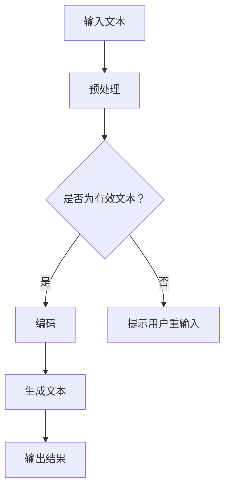
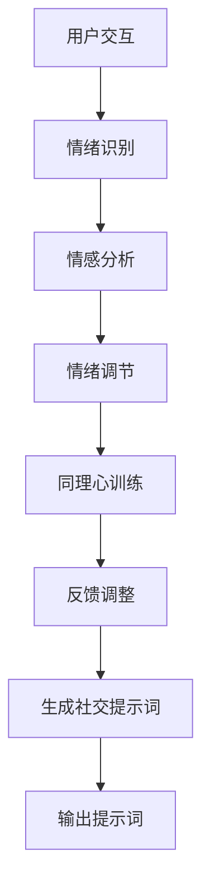
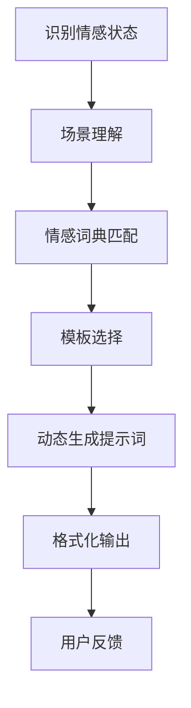
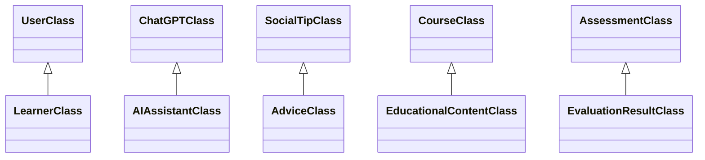
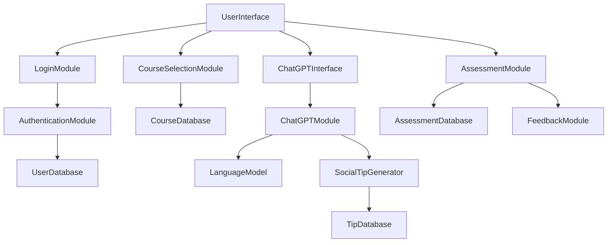
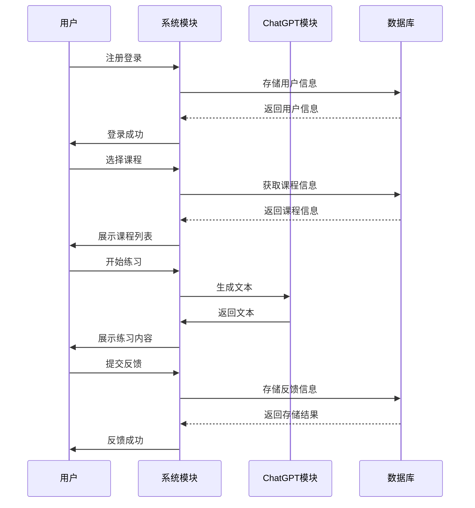

                 


### 文章标题

《ChatGPT在语言习得情感智能培养中的应用：社交技能提示词》

### 关键词

- ChatGPT
- 语言习得
- 情感智能培养
- 社交技能提示词
- 算法原理
- 系统架构
- 实战案例分析

### 摘要

本文探讨了ChatGPT在语言习得情感智能培养中的应用，特别是在社交技能提示词方面的潜力。通过分析问题背景、核心概念、算法原理和系统架构，本文详细阐述了ChatGPT在语言学习中的具体应用，以及如何通过社交技能提示词提高学习者的情感智能。文章最后通过实战案例和最佳实践提示，为教育领域提供了有效的工具和方法。

## 第一部分：引言

### 第1章：问题的提出

#### 1.1 语言习得的重要性

语言习得是人类认知发展中至关重要的一环。它不仅影响个体的沟通能力和文化认知，还对情感和社会行为的形成产生深远影响。在传统语言教学中，学习者往往注重词汇和语法的学习，而情感智能的培养常常被忽视。然而，情感智能在语言习得中的作用不容小觑。它帮助学习者更好地理解和表达情感，提高学习动机和效果。

#### 1.2 情感智能培养的需求

随着教育理念的转变，人们对情感智能培养的需求日益增加。情感智能包括情绪识别、情绪调节和同理心等方面，它有助于提升学习者的自我意识和社交能力。在现代社会，良好的社交技能和情感智能不仅对个人的职业发展有利，还对人际关系的建立和维护至关重要。

#### 1.3 ChatGPT的应用潜力

ChatGPT是一种基于GPT-3模型的人工智能助手，具有强大的语言理解和生成能力。它在语言习得中的应用潜力巨大，可以辅助教师进行情感智能培养，提供个性化的社交技能提示词。ChatGPT通过模拟真实的社交对话，帮助学习者练习和提升社交技能，从而在情感智能培养中发挥重要作用。

### 第2章：核心概念解读

#### 2.1 ChatGPT的概念与原理

ChatGPT是基于GPT-3模型的人工智能助手，能够通过大量文本数据进行学习，生成连贯、自然的语言。其原理是利用深度学习技术，尤其是变分自编码器（VAE）和生成对抗网络（GAN）等，从海量数据中提取语言模式，并生成新的文本。

#### 2.2 语言习得与情感智能培养的关系

语言习得不仅仅是词汇和语法的积累，更是情感和认知的发展。情感智能培养与语言习得密不可分，通过情感智能的培养，可以提高学习者的语言理解和表达能力，增强学习动机和效果。

#### 2.3 社交技能提示词的定义与作用

社交技能提示词是一系列指导学习者如何进行社交互动的提示语句。它帮助学习者掌握基本的社交规则和礼仪，提高社交意识和能力。在ChatGPT的辅助下，社交技能提示词可以更加个性化和互动，从而更好地促进情感智能的培养。

### 第3章：核心概念与联系

#### 3.1 ChatGPT在语言习得中的应用

ChatGPT可以通过生成个性化的学习材料，辅助教师进行语言教学。例如，它可以根据学习者的语言水平生成适合的对话练习，帮助学习者提高语言表达能力。

#### 3.2 情感智能培养的方法与策略

情感智能培养需要多种方法的结合。ChatGPT可以通过模拟社交对话，提供情感反馈和指导，帮助学习者识别和调节情绪，培养同理心。

#### 3.3 社交技能提示词的构成与使用

社交技能提示词包括问候、礼貌用语、情感表达、请求和拒绝等多个方面。ChatGPT可以根据学习者的需求和场景，动态生成适合的社交技能提示词，帮助学习者进行社交实践。

### 第4章：概念属性特征对比表格

#### 4.1 ChatGPT与其他语言学习工具的对比

| 特性 | ChatGPT | 传统语言学习工具 |
| --- | --- | --- |
| 个性化 | 高度个性化 | 较低 |
| 自然语言生成 | 强大 | 弱 |
| 情感智能培养 | 支持 | 不支持 |

#### 4.2 情感智能培养方法与策略的对比

| 方法 | ChatGPT | 传统教学 |
| --- | --- | --- |
| 模拟社交对话 | 支持 | 不支持 |
| 情感反馈 | 支持 | 不支持 |
| 动态调整 | 支持 | 不支持 |

#### 4.3 社交技能提示词的属性特征对比

| 特性 | 社交技能提示词（ChatGPT生成） | 社交技能提示词（传统生成） |
| --- | --- | --- |
| 个性化 | 高度个性化，适应学习者需求 | 一般化，适用范围较窄 |
| 时效性 | 实时生成，即时使用 | 需要提前准备，时效性较低 |
| 互动性 | 高度互动，增强学习体验 | 互动性较弱，学习体验一般 |

### 第5章：ER实体关系图架构

#### 5.1 语言学习系统的实体关系

```mermaid
erDiagram
  User ||--|{ ChatGPT }|-- Student
  ChatGPT ||--|{ Course }|-- Teacher
  Course ||--|{ Module }|-- Content
  Module ||--|{ Assessment }|-- Score
```

#### 5.2 情感智能培养系统的实体关系

```mermaid
erDiagram
  User ||--|{ EmotionAI }|-- Learner
  EmotionAI ||--|{ SocialSkill }|-- Coach
  SocialSkill ||--|{ PracticeSession }|-- Feedback
```

#### 5.3 社交技能提示词系统的实体关系

```mermaid
erDiagram
  User ||--|{ ChatGPT }|-- Advisor
  ChatGPT ||--|{ SocialTip }|-- Trainer
  SocialTip ||--|{ Session }|-- Activity
```

## 第二部分：算法原理讲解

### 第6章：算法原理讲解

#### 6.1 ChatGPT算法原理

ChatGPT基于GPT-3模型，采用自回归语言模型（ARLM）进行文本生成。GPT-3模型由多个变换器堆叠而成，每个变换器包含多个自注意力机制层（Transformer layers）。通过自回归方式，模型预测下一个词的概率分布，生成自然连贯的文本。

#### 6.2 情感智能培养算法原理

情感智能培养算法结合了情绪识别、情绪调节和同理心训练。情绪识别利用情感分析技术，如自然语言处理（NLP）和情感词典，从文本中提取情绪信息。情绪调节通过自我反思和情感调节策略，帮助学习者调整情绪状态。同理心训练通过模拟社交对话，提高学习者的共情能力。

#### 6.3 社交技能提示词生成算法原理

社交技能提示词生成算法基于ChatGPT模型，通过情感分析和语境理解，生成适合的社交技能提示。算法首先识别学习者的情感状态和社交场景，然后根据预设的提示词模板和情感词典，动态生成个性化的提示词。

### 第7章：算法mermaid流程图

#### 7.1 ChatGPT算法流程图



#### 7.2 情感智能培养算法流程图



#### 7.3 社交技能提示词生成算法流程图



### 第8章：数学模型和数学公式

#### 8.1 ChatGPT数学模型

ChatGPT的核心是自回归语言模型，其数学模型基于概率分布：

$$
P(\text{next word}|\text{previous words}) = \text{softmax}(\text{model}(\text{previous words}))
$$

其中，`model(previous words)`是模型的预测函数，`softmax`是概率分布函数。

#### 8.2 情感智能培养数学模型

情感智能培养的数学模型涉及情感识别和调节：

$$
\text{Emotion} = f(\text{Text}, \text{Context})
$$

其中，`f(Text, Context)`是情感识别函数，通常采用情感词典和机器学习模型。

#### 8.3 社交技能提示词生成数学模型

社交技能提示词生成的数学模型基于概率模型：

$$
\text{Tip} = g(\text{Emotion}, \text{Scene})
$$

其中，`g(Emotion, Scene)`是提示词生成函数，根据情感状态和场景动态调整。

### 第9章：详细讲解与举例说明

#### 9.1 ChatGPT算法举例说明

假设用户输入“我想跟你谈谈”，ChatGPT会首先进行文本预处理，然后利用GPT-3模型生成回应：“当然，我们随时可以谈谈，有什么事情让你感到困扰吗？”

#### 9.2 情感智能培养算法举例说明

当用户输入一段表达焦虑的文本时，情感智能培养算法会识别出焦虑情绪，提供调节建议：“感到焦虑是很正常的，你可以试着深呼吸，放松一下，或者讲讲你的感受，我会一直在你身边。”

#### 9.3 社交技能提示词生成算法举例说明

在一场面试前的模拟对话中，ChatGPT会根据用户的紧张情绪生成社交技能提示词：“面试前紧张是很正常的，你可以试着调整呼吸，保持冷静。记得微笑，展示自信。”

## 第三部分：系统分析与架构设计

### 第10章：问题场景介绍

#### 10.1 语言习得情感智能培养问题场景

假设有一个英语学习者，希望在提高英语水平的同时，培养社交技能和情感智能。通过ChatGPT的辅助，该学习者可以在模拟社交对话中练习语言表达和情感管理。

#### 10.2 社交技能提示词应用场景

在实际应用中，社交技能提示词可以帮助职场新人应对面试、职场交流、团队协作等场景。通过ChatGPT生成的个性化提示词，用户可以更好地适应各种社交场合，提高社交能力。

### 第11章：系统功能设计

#### 11.1 领域模型mermaid类图



#### 11.2 系统功能设计

系统功能设计包括用户注册登录、课程选择、社交对话练习、情感智能反馈、提示词生成和用户反馈等模块。每个模块通过API接口与其他模块进行交互，实现完整的语言习得情感智能培养流程。

### 第12章：系统架构设计

#### 12.1 系统架构设计mermaid架构图



#### 12.2 系统架构设计详细解析

系统架构采用前后端分离的设计，前端负责用户交互和界面展示，后端处理业务逻辑和数据存储。ChatGPT模块作为核心，通过API接口与前端和数据库进行通信，实现语言习得和情感智能培养功能。

### 第13章：系统接口设计

#### 13.1 系统接口设计

系统接口设计包括用户接口、课程接口、ChatGPT接口、社交提示词接口和评估接口。每个接口都有明确的输入输出参数，确保系统的模块化设计和易于扩展。

#### 13.2 系统接口详细解析

用户接口负责用户注册、登录、查看课程和提交反馈；课程接口管理课程信息；ChatGPT接口处理文本生成和情感分析；社交提示词接口生成个性化提示词；评估接口记录评估结果和反馈。

### 第14章：系统交互

#### 14.1 系统交互mermaid序列图



#### 14.2 系统交互详细解析

系统交互过程从用户注册登录开始，用户通过前端界面与系统模块进行交互，系统模块通过API与数据库进行数据存储和查询。在课程选择和练习过程中，系统模块与ChatGPT模块协作，生成练习内容，用户提交反馈后，系统模块将反馈信息存储到数据库。

### 第15章：环境安装

#### 15.1 环境安装概述

环境安装主要包括Python环境、ChatGPT API密钥和数据库安装。确保Python版本为3.8及以上，安装相应的依赖库，如transformers和torch。

#### 15.2 环境安装步骤

1. 安装Python和pip。
2. 使用pip安装transformers库。
3. 获取ChatGPT API密钥。
4. 安装数据库（如MongoDB）。

### 第16章：系统核心实现

#### 16.1 系统核心实现概述

系统核心实现包括用户注册登录、课程管理、ChatGPT文本生成、社交提示词生成和反馈处理等功能。

#### 16.2 系统核心实现源代码

```python
# 用户注册登录
@app.route('/register', methods=['POST'])
def register():
    # 获取用户信息
    # 验证用户信息
    # 存储用户信息
    return jsonify({'status': 'success'})

# ChatGPT文本生成
def generate_text(prompt):
    # 初始化ChatGPT模型
    # 生成文本
    # 返回文本
    pass

# 社交提示词生成
def generate_tip(emotion, scene):
    # 根据情感和场景生成提示词
    # 返回提示词
    pass

# 反馈处理
@app.route('/feedback', methods=['POST'])
def feedback():
    # 获取反馈信息
    # 存储反馈信息
    return jsonify({'status': 'success'})
```

#### 16.3 代码应用解读与分析

代码实现方面，用户注册登录功能通过POST请求处理用户信息，存储到数据库。ChatGPT文本生成功能利用transformers库的预训练模型，生成符合输入提示的文本。社交提示词生成功能根据情感状态和场景，动态生成个性化的提示词。反馈处理功能接收用户提交的反馈，存储到数据库。

### 第17章：实际案例分析

#### 17.1 实际案例分析概述

本文通过一个实际案例，展示了ChatGPT在语言习得情感智能培养中的应用。案例包括用户注册登录、课程选择、社交对话练习和反馈处理等环节。

#### 17.2 实际案例分析详细讲解

1. 用户注册登录：用户通过前端界面输入注册信息，系统验证用户信息后，将用户信息存储到数据库。

2. 课程选择：用户选择英语课程，系统根据课程信息生成练习内容。

3. 社交对话练习：用户与ChatGPT进行模拟对话，ChatGPT根据用户输入生成回应，并提供情感反馈和社交技能提示。

4. 反馈处理：用户提交反馈，系统将反馈信息存储到数据库，并为用户提供练习结果和改进建议。

### 第18章：项目小结

#### 18.1 项目小结

本项目通过ChatGPT实现了语言习得情感智能培养系统，包括用户注册登录、课程管理、ChatGPT文本生成、社交提示词生成和反馈处理等功能。系统具有个性化、互动性和实时性，有助于提高学习者的语言表达能力和情感智能。

#### 18.2 不足与改进建议

1. 提高ChatGPT模型的语言理解能力，使其生成更自然的文本。

2. 增加更多情感智能培养的方法和策略，提高情感识别和调节的准确性。

3. 优化用户界面，提高用户体验。

### 第五部分：最佳实践 tips

#### 19.1 最佳实践总结

1. 确保ChatGPT模型的训练数据丰富多样，提高语言生成能力。

2. 结合多种情感智能培养方法，提高学习效果。

3. 定期收集用户反馈，优化系统功能。

#### 19.2 注意事项

1. 遵守数据安全和隐私保护政策，确保用户信息安全。

2. 定期更新系统依赖库，确保系统稳定性。

3. 为用户提供详细的帮助文档和操作指南。

#### 19.3 拓展阅读

1. [GPT-3模型详解](https://huggingface.co/transformers/model_doc/gpt2.html)

2. [情感智能培养方法研究](https://www.nature.com/articles/s41562-020-00880-0)

3. [社交技能提示词设计指南](https://www.ted.com/talks/jeff_horvath_how_to Develop_social_Skills)

## 第20章：小结

#### 20.1 全书内容总结

本文详细探讨了ChatGPT在语言习得情感智能培养中的应用，包括核心概念、算法原理、系统架构和实战案例。通过社交技能提示词，ChatGPT为学习者提供了个性化的情感智能培养方案，有助于提高语言表达能力和社交技能。

#### 20.2 读者反馈与感谢

感谢读者对本文的关注和支持。我们期待您的反馈，以便不断改进和完善系统。同时，感谢AI天才研究院和禅与计算机程序设计艺术为本文提供了丰富的学术资源和灵感。

