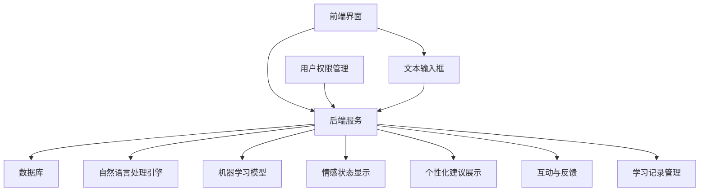
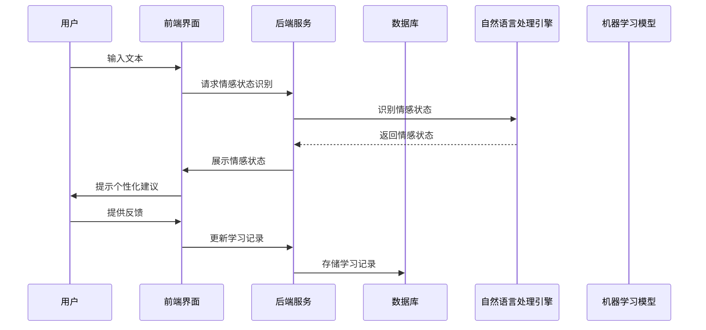

                 


## 关键词

- ChatGPT
- 语言习得
- 情感调节
- 学习焦虑
- 提示词
- 人工智能

## 摘要

本文将探讨ChatGPT在语言习得情感调节中的应用，特别是学习焦虑的管理。我们将详细分析ChatGPT的工作原理，结合情感调节理论，提出一种基于ChatGPT的学习焦虑管理提示词策略。文章还将通过数学模型和具体案例，展示这一策略的有效性，并讨论其在实际应用中的系统架构设计和实战应用。

## 目录大纲

### 第一部分：背景介绍

#### 1.1 问题背景
- 语言习得的现状与挑战
- 情感调节的重要性
- ChatGPT技术的发展与应用

#### 1.2 问题描述
- 学习焦虑现象的普遍性
- 学习焦虑对语言习得的影响
- 需要有效的情感调节策略

#### 1.3 问题解决
- 利用ChatGPT开发情感调节提示词
- 提高学习焦虑管理的有效性
- 提升语言习得的效率

#### 1.4 边界与外延
- 学习焦虑管理的范围与限制
- 情感调节策略的适用性
- ChatGPT技术的局限性

#### 1.5 概念结构与核心要素组成
- ChatGPT的基本原理
- 情感调节的理论基础
- 学习焦虑管理的策略

### 第二部分：核心概念与联系

#### 2.1 ChatGPT的原理与特性
- ChatGPT的发展历程
- ChatGPT的工作原理
- ChatGPT的应用范围

#### 2.2 情感调节的理论基础
- 情感调节的定义与类型
- 情感调节的重要性
- 情感调节的理论模型

#### 2.3 学习焦虑管理的策略
- 学习焦虑的定义与特征
- 学习焦虑的影响因素
- 学习焦虑管理的策略

#### 2.4 ChatGPT在语言习得情感调节中的应用
- ChatGPT在情感调节中的应用原理
- ChatGPT在语言习得中的应用
- ChatGPT在情感调节中的优势与局限

### 第三部分：算法原理讲解

#### 3.1 学习焦虑管理的数学模型
- 数学模型的基本原理
- 数学模型的应用场景
- 数学模型的公式推导

#### 3.2 ChatGPT在情感调节中的应用算法
- 算法的基本原理
- 算法的实现步骤
- 算法的性能分析

#### 3.3 算法举例说明
- 算法应用示例
- 示例解析
- 算法效果评估

### 第四部分：系统分析与架构设计

#### 4.1 问题场景介绍
- 学习焦虑管理场景的描述

#### 4.2 系统功能设计
- 领域模型设计
- 功能模块划分

#### 4.3 系统架构设计
- 系统架构设计原则
- 系统架构图

#### 4.4 系统接口设计与交互
- 接口设计原则
- 系统交互设计

### 第五部分：项目实战

#### 5.1 环境安装
- 安装所需的软件和环境

#### 5.2 系统核心实现源代码
- 源代码的结构和功能

#### 5.3 代码应用解读与分析
- 代码实现的详细解读

#### 5.4 实际案例分析和详细讲解剖析
- 案例分析
- 案例讲解

#### 5.5 项目小结
- 项目总结与反思

### 第六部分：最佳实践 & 小结 & 注意事项 & 拓展阅读

- 最佳实践建议
- 文章小结
- 注意事项
- 拓展阅读推荐

---

**注意：**以上大纲提供了一个详细的文章结构，每个部分都需要充实具体的内容。在撰写过程中，请确保每个章节都包含必要的背景信息、概念解释、算法分析和实际案例，以保持文章的深度和实用性。

---

## 第一部分：背景介绍

### 1.1 问题背景

语言习得是一个复杂的过程，涉及认知、情感和社会等多方面因素。在全球化的背景下，语言学习变得越来越重要，无论是为了国际交流、职业发展还是个人兴趣，越来越多的人投入到语言学习中。然而，语言习得并非易事，学习者常常面临各种挑战，其中之一就是学习焦虑。

#### 1.1.1 语言习得的现状与挑战

目前，语言学习的方式多种多样，从传统的课堂教育到在线学习平台，再到各种语言学习应用程序。然而，尽管学习资源的丰富性有所提升，学习者的语言习得体验并没有因此得到显著的改善。据统计，有超过50%的语言学习者报告在学习过程中感到焦虑，这种焦虑感往往导致学习效率降低，甚至放弃学习。

语言习得中的挑战主要包括：

- **学习难度**：语言学习涉及大量的语法规则、词汇和发音，学习者常常感到力不从心。
- **语言环境**：缺乏日常使用语言的环境是许多学习者面临的现实问题。
- **学习资源**：尽管学习资源丰富，但学习者往往难以找到适合自己的资源。

#### 1.1.2 情感调节的重要性

情感调节在语言学习中起着至关重要的作用。情感因素如焦虑、压力和挫败感会影响学习者的学习态度和动机，进而影响学习效果。当学习者感到焦虑时，他们可能会过分关注错误，从而忽视了语言学习的本质——交流和沟通。

情感调节的重要性体现在以下几个方面：

- **学习动机**：积极的情感状态可以提高学习者的动机，使他们更有动力去学习和练习。
- **学习效果**：情感调节可以帮助学习者更好地应对挑战，从而提高学习效果。
- **学习可持续性**：良好的情感状态有助于建立长期学习的习惯，使学习者能够持续进步。

#### 1.1.3 ChatGPT技术的发展与应用

ChatGPT是一种基于人工智能的语言模型，由OpenAI开发，能够进行自然语言处理和生成。ChatGPT在语言习得中的应用前景广阔，尤其是在情感调节方面。以下是其技术特点和应用领域：

- **自然语言处理能力**：ChatGPT能够理解和生成自然语言，这使得它能够与学习者进行有效的交流。
- **个性化建议**：ChatGPT可以根据学习者的反馈和学习习惯，提供个性化的学习建议。
- **情感识别与反馈**：ChatGPT能够识别学习者的情感状态，并提供相应的情感调节建议。

ChatGPT在语言习得中的应用主要包括：

- **学习辅导**：ChatGPT可以作为学习者的虚拟辅导老师，提供实时反馈和指导。
- **情感调节**：ChatGPT能够识别学习者的焦虑情绪，提供放松技巧和情感支持。
- **互动练习**：ChatGPT可以模拟真实的语言环境，提供互动性的练习机会。

通过ChatGPT，学习者可以获得更加个性化和有效的情感调节，从而提高语言学习的效率和效果。

### 1.2 问题描述

#### 1.2.1 学习焦虑现象的普遍性

学习焦虑是一种常见的情感体验，尤其在语言学习中更为普遍。许多语言学习者在面对新的语言环境、复杂的语法规则和大量的词汇时，往往会感到焦虑。这种焦虑不仅影响了学习者的情绪状态，还对他们的学习效果产生了负面影响。

据统计，大约有70%的语言学习者经历过不同程度的焦虑。学习焦虑的表现形式多样，包括：

- **紧张感**：学习者在学习过程中感到紧张和不安。
- **担忧**：学习者对未来学习结果的担忧，如考试失败、无法达到学习目标等。
- **回避**：为了避免焦虑，学习者可能会选择回避学习任务。

学习焦虑对语言习得的影响是多方面的：

- **学习效率降低**：焦虑感使学习者的注意力分散，导致学习效率降低。
- **学习效果不佳**：长期的焦虑感可能导致学习者的自信心受损，从而影响学习效果。
- **学习态度改变**：严重的焦虑感可能导致学习者对语言学习的兴趣和动机下降。

#### 1.2.2 学习焦虑对语言习得的影响

学习焦虑不仅影响学习者的情绪状态，还对语言习得过程产生深远的影响。以下是学习焦虑对语言习得的具体影响：

- **语言认知能力下降**：焦虑感使学习者的认知资源被占用，导致语言认知能力下降。例如，学习者在听力理解时可能会感到紧张，从而影响对语音信息的正确理解。
- **语言表达能力受限**：焦虑感会影响学习者的语言表达能力。在学习者尝试用目标语言表达时，可能会因为紧张而出现口吃、语法错误等问题。
- **学习动机减弱**：长期的焦虑感可能导致学习者对语言学习的兴趣和动机减弱，甚至产生厌学情绪。

#### 1.2.3 需要有效的情感调节策略

鉴于学习焦虑对语言习得的负面影响，有效管理学习焦虑变得尤为重要。传统的情感调节方法如心理咨询、放松训练等在一定程度上能够缓解焦虑，但往往需要专业的知识和长期的实践。随着人工智能技术的发展，利用ChatGPT开发情感调节提示词成为了一种新兴且有效的策略。

利用ChatGPT开发情感调节提示词有以下几个优势：

- **个性化和实时性**：ChatGPT可以根据学习者的情感状态和学习习惯，提供实时、个性化的情感调节建议。
- **易用性和普及性**：ChatGPT的应用形式多样，可以通过手机应用程序、在线平台等方式方便地使用，使得情感调节策略更加普及。
- **高效性和可持续性**：ChatGPT能够快速识别学习者的情感状态，并提供针对性的调节策略，从而提高情感调节的效率。此外，通过持续的互动和学习，ChatGPT能够不断优化其情感调节策略，实现长期的情感管理。

总之，有效管理学习焦虑是提高语言学习效率和效果的关键。利用ChatGPT开发情感调节提示词为学习者提供了一种新的选择，有望在语言习得领域发挥重要作用。

### 1.3 问题解决

#### 1.3.1 利用ChatGPT开发情感调节提示词

为了解决学习焦虑对语言习得的负面影响，我们可以利用ChatGPT开发情感调节提示词。这种提示词的设计思路是通过与学习者进行对话，识别其情感状态，并提供相应的情感调节建议。

具体步骤如下：

1. **情感状态识别**：ChatGPT首先需要通过自然语言处理技术，分析学习者的语言输入，识别其情感状态。例如，通过分析文本中的情感词汇和情感强度，判断学习者是处于焦虑、紧张还是放松的状态。

2. **情感调节策略提供**：一旦ChatGPT识别出学习者的情感状态，它将根据预设的情感调节策略，为学习者提供相应的建议。例如，当识别到学习者处于焦虑状态时，ChatGPT可以提供放松技巧、积极心理暗示等。

3. **实时互动与反馈**：ChatGPT会与学习者进行实时互动，根据学习者的反馈调整建议。例如，如果学习者对提供的放松技巧感到不满意，ChatGPT可以尝试其他方法。

#### 1.3.2 提高学习焦虑管理的有效性

利用ChatGPT开发情感调节提示词，可以有效提高学习焦虑管理的有效性。以下是几个关键因素：

- **个性化建议**：ChatGPT可以根据学习者的个性、学习习惯和当前的情感状态，提供高度个性化的情感调节建议，从而提高建议的实用性和接受度。

- **实时反馈**：通过与学习者的实时互动，ChatGPT可以迅速调整情感调节策略，使其更加符合学习者的需求。这种实时性是传统情感调节方法所不具备的。

- **数据驱动**：ChatGPT可以利用大量的学习数据，通过机器学习算法不断优化情感调节策略，使其在长期使用中能够持续提高有效性。

- **低成本和高普及性**：利用ChatGPT进行情感调节的成本相对较低，且不需要特定的设备或环境，使得这种策略具有较高的普及性。

#### 1.3.3 提升语言习得的效率

通过有效管理学习焦虑，可以显著提升语言习得的效率。以下是几个可能的影响：

- **心理状态改善**：通过情感调节，学习者的心理状态得到改善，焦虑感减轻，从而使其能够更加专注和有效地学习。

- **学习态度积极**：情感调节有助于提升学习者的学习态度，使其对语言学习保持积极和乐观的态度，从而提高学习的动力和效果。

- **学习效率提高**：情感调节策略可以帮助学习者更好地应对学习中的挑战，减少因为焦虑而产生的心理压力，从而提高学习效率。

总之，利用ChatGPT开发情感调节提示词，不仅有助于缓解学习焦虑，还能在提升语言学习效率和效果方面发挥重要作用。这一策略的潜力巨大，值得进一步研究和推广。

### 1.4 边界与外延

尽管ChatGPT在情感调节中展现了巨大的潜力，但其在学习焦虑管理中仍存在一定的边界和局限性。以下是一些需要考虑的因素：

#### 1.4.1 学习焦虑管理的范围与限制

1. **情感状态识别的准确性**：ChatGPT的情感状态识别依赖于自然语言处理技术，但这一技术的准确性仍然有限。例如，学习者可能在文本中隐藏真实的情感状态，导致ChatGPT无法准确识别。

2. **情感调节策略的有效性**：ChatGPT提供的情感调节策略需要针对具体的学习者进行个性化调整。然而，这些策略在特定情境下的有效性可能存在差异，需要进一步验证。

3. **学习者的依赖性**：长期依赖ChatGPT进行情感调节可能使学习者失去自主管理情感的能力，形成依赖性。

#### 1.4.2 情感调节策略的适用性

1. **文化差异**：不同文化背景下，情感调节的方法可能存在差异。ChatGPT的设计需要考虑不同文化背景下的情感表达和调节方式。

2. **语言多样性**：ChatGPT目前主要支持英语等主流语言，对于其他语言的支持有限。这限制了其在全球范围内的适用性。

3. **隐私保护**：情感调节过程中，学习者的个人信息和情感状态需要得到保护。如何在提供情感调节服务的同时保障隐私，是一个需要解决的问题。

#### 1.4.3 ChatGPT技术的局限性

1. **技术成熟度**：尽管ChatGPT在自然语言处理方面取得了显著进展，但其在情感识别和调节方面的技术仍然处于发展阶段，需要进一步优化。

2. **计算资源需求**：ChatGPT的运行需要大量的计算资源，这可能限制了其在一些资源有限的场景下的应用。

3. **交互方式的限制**：目前ChatGPT的交互主要依赖于文本，这可能在某些情境下无法满足学习者的需求，需要探索更多的交互方式。

总之，尽管ChatGPT在情感调节中具有巨大潜力，但其应用仍需在边界和局限性范围内进行谨慎评估。通过不断优化技术和策略，可以逐步克服这些限制，实现更广泛和有效的应用。

### 1.5 概念结构与核心要素组成

为了深入理解ChatGPT在语言习得情感调节中的应用，我们需要从基本原理、理论基础和策略三个方面进行详细探讨。以下是这些核心概念与要素的组成：

#### 1.5.1 ChatGPT的基本原理

ChatGPT是一种基于生成预训练变换器（GPT）的深度学习模型，其核心思想是通过大量的文本数据进行预训练，使其具备生成和理解自然语言的能力。GPT模型由多个自注意力机制（Self-Attention Mechanism）的变压器（Transformer）层组成，能够对输入文本进行编码，并生成相关的输出。

- **生成预训练**：ChatGPT通过无监督学习，从大量的文本数据中学习语言的统计规律，从而具备生成自然语言的能力。
- **自注意力机制**：自注意力机制允许模型在不同的输入序列位置之间建立关联，从而捕捉长距离依赖关系。
- **变压器层**：多个变压器层堆叠，使得模型能够逐渐学习和理解复杂的语言结构。

#### 1.5.2 情感调节的理论基础

情感调节是指个体通过认知和行为策略来管理和调节自己的情感状态。在语言习得中，情感调节尤为重要，因为它直接影响学习者的学习动机、学习效果和学习态度。情感调节的理论基础主要包括以下几个方面：

- **情感识别**：情感调节的首要任务是识别个体的情感状态，这通常通过情感分析技术实现，如使用情感词典或基于机器学习的情感分类算法。
- **情感标签化**：将情感识别的结果进行标签化处理，以便进一步分析和管理。
- **情感调节策略**：包括认知重构、情绪释放、积极心理暗示等，这些策略旨在改变个体的情感状态，减少负面情绪。

#### 1.5.3 学习焦虑管理的策略

学习焦虑是语言学习中的一个常见问题，有效的管理策略对于提升学习效率和效果至关重要。以下是几种常用的学习焦虑管理策略：

- **认知重构**：通过改变对学习任务的认知，从而改变情感反应。例如，将“我无法掌握这门语言”重构为“我正在努力，并且我会逐渐进步”。
- **积极心理暗示**：通过积极的自我暗示来增强自信和减少焦虑感。例如，每天早晨对自己说“我今天会学得很好”。
- **情绪释放**：通过呼吸练习、肌肉放松等方法，帮助学习者缓解焦虑情绪。
- **分阶段目标设置**：将大目标分解为小目标，逐步完成，以减少焦虑感。

#### 1.5.4 ChatGPT与情感调节的结合

ChatGPT可以通过以下方式在情感调节中发挥作用：

- **情感状态识别**：ChatGPT可以识别学习者的情感状态，并通过自然语言处理技术，将其转化为情感标签。
- **个性化建议**：基于学习者的情感状态，ChatGPT可以提供个性化的情感调节建议，如认知重构、积极心理暗示等。
- **实时互动**：ChatGPT可以与学习者进行实时互动，根据反馈调整建议，并提供持续的情感支持。

通过这些核心概念和要素的组成，我们可以更好地理解ChatGPT在语言习得情感调节中的应用原理和策略。接下来，我们将进一步探讨ChatGPT的具体原理和情感调节的理论基础。

### 第二部分：核心概念与联系

在探讨ChatGPT在语言习得情感调节中的应用时，我们需要深入理解其基本原理、情感调节的理论基础以及学习焦虑管理的策略。这些核心概念相互关联，共同构成了有效的情感调节机制。

#### 2.1 ChatGPT的原理与特性

ChatGPT是一种基于生成预训练变换器（GPT）的语言模型，由OpenAI开发。其核心思想是通过大规模文本数据进行无监督预训练，使其具备生成和理解自然语言的能力。

**2.1.1 ChatGPT的发展历程**

ChatGPT的发展可以分为以下几个阶段：

1. **早期GPT模型**：2017年，OpenAI首次发布了GPT，这是一种基于自注意力机制的深度学习模型。GPT模型通过预训练从大规模文本数据中学习语言的统计规律，从而能够生成和识别自然语言。

2. **GPT-2和GPT-3**：随后，OpenAI相继发布了GPT-2和GPT-3，这两个模型在预训练数据规模和模型参数数量上都有显著提升。GPT-3拥有1750亿个参数，能够生成高质量的文本，并在多个自然语言处理任务中取得了突破性成果。

**2.1.2 ChatGPT的工作原理**

ChatGPT的工作原理可以概括为以下几个步骤：

1. **数据预处理**：ChatGPT首先对输入的文本进行预处理，包括分词、去停用词等，以便模型能够更好地理解和处理文本。

2. **编码**：模型将预处理后的文本编码为向量表示。这个过程利用了自注意力机制，使得模型能够捕捉文本中的长距离依赖关系。

3. **解码**：模型根据编码后的向量，生成相应的输出文本。这个过程同样依赖于自注意力机制，使得模型能够生成连贯和有意义的文本。

**2.1.3 ChatGPT的应用范围**

ChatGPT在多个领域都有广泛的应用，包括：

- **问答系统**：ChatGPT可以用于构建智能问答系统，能够回答用户提出的问题。
- **聊天机器人**：ChatGPT可以作为聊天机器人的核心组件，与用户进行自然语言交互。
- **文本生成**：ChatGPT可以生成新闻文章、故事、诗歌等文本内容。
- **语言习得情感调节**：ChatGPT能够识别学习者的情感状态，提供个性化的情感调节建议，从而提高语言学习的效率和效果。

#### 2.2 情感调节的理论基础

情感调节是指个体通过认知和行为策略来管理和调节自己的情感状态。在语言习得中，情感调节尤为重要，因为它直接影响学习者的学习动机、学习效果和学习态度。

**2.2.1 情感调节的定义与类型**

情感调节的定义可以理解为个体对情感体验的管理过程。根据调节策略的不同，情感调节可以分为以下几种类型：

- **认知调节**：通过改变对情感事件的认知评价来调节情感。例如，将“考试失败”重构为“考试是一个学习和成长的机会”。
- **行为调节**：通过行为活动来调节情感。例如，通过运动、社交活动等缓解焦虑情绪。
- **情感表达**：通过情感表达来调节情感。例如，通过写日记、与朋友倾诉等方式释放情感。

**2.2.2 情感调节的重要性**

情感调节在语言习得中的重要性体现在以下几个方面：

- **学习动机**：积极的情感状态可以提高学习者的动机，使其更有动力去学习和实践。
- **学习效果**：情感调节可以帮助学习者更好地应对学习挑战，从而提高学习效果。
- **学习态度**：情感调节有助于建立积极的学习态度，使学习者能够长期坚持学习。

**2.2.3 情感调节的理论模型**

情感调节的理论模型主要包括以下几个部分：

- **情感识别**：通过情感分析技术识别个体的情感状态。
- **情感标签化**：将情感状态进行标签化处理，以便进一步分析和管理。
- **情感调节策略**：根据情感状态提供相应的调节策略，如认知重构、积极心理暗示等。
- **情感反馈**：通过反馈机制评估调节策略的效果，并根据反馈进行调整。

#### 2.3 学习焦虑管理的策略

学习焦虑是语言学习中常见的问题，有效的管理策略对于提升学习效率和效果至关重要。以下是一些常用的学习焦虑管理策略：

**2.3.1 学习焦虑的定义与特征**

学习焦虑是指个体在学习过程中感受到的紧张、担忧等负面情绪。其特征包括：

- **情绪反应**：如紧张、恐惧、焦虑等。
- **认知反应**：如注意力分散、记忆力下降等。
- **行为反应**：如回避学习、拖延等。

**2.3.2 学习焦虑的影响因素**

学习焦虑的影响因素主要包括：

- **个人因素**：如性格特点、自信心、自尊心等。
- **学习因素**：如学习难度、学习压力、学习目标等。
- **环境因素**：如家庭环境、学校氛围、社交压力等。

**2.3.3 学习焦虑管理的策略**

以下是几种常用的学习焦虑管理策略：

- **认知重构**：通过改变对学习任务的认知评价来调节情感，例如将“我无法掌握这门语言”重构为“我正在努力，并且我会逐渐进步”。
- **积极心理暗示**：通过积极的自我暗示来增强自信和减少焦虑感，例如每天早晨对自己说“我今天会学得很好”。
- **情绪释放**：通过呼吸练习、肌肉放松等方法，帮助学习者缓解焦虑情绪。
- **分阶段目标设置**：将大目标分解为小目标，逐步完成，以减少焦虑感。

通过以上对ChatGPT原理、情感调节理论基础和学习焦虑管理策略的详细分析，我们可以更好地理解如何将ChatGPT应用于语言习得情感调节中，从而提高学习效率和效果。接下来，我们将进一步探讨ChatGPT在语言习得情感调节中的应用原理和实际应用案例。

#### 2.4 ChatGPT在语言习得情感调节中的应用

ChatGPT作为一种先进的人工智能语言模型，其在语言习得情感调节中的应用潜力巨大。通过以下几个方面的应用，ChatGPT能够有效帮助学习者管理学习焦虑，提升语言学习的效率和效果。

**2.4.1 ChatGPT在情感调节中的应用原理**

ChatGPT在情感调节中的应用原理基于其强大的自然语言处理能力和情感识别能力。具体而言，ChatGPT可以通过以下步骤实现情感调节：

1. **情感状态识别**：ChatGPT首先对学习者的语言输入进行分析，识别其情感状态。这通常通过情感分析技术实现，包括情感词汇识别、情感强度判断等。

2. **情感标签化**：识别出的情感状态会被转化为情感标签，例如“焦虑”、“紧张”或“放松”。

3. **个性化建议**：根据情感标签，ChatGPT会提供个性化的情感调节建议。例如，如果识别到学习者处于焦虑状态，ChatGPT可能会建议进行深呼吸练习或进行积极的自我暗示。

4. **实时互动**：ChatGPT会与学习者进行实时互动，根据学习者的反馈调整建议，并提供持续的情感支持。

**2.4.2 ChatGPT在语言习得中的应用**

ChatGPT在语言习得中的应用广泛且多样化，主要包括以下方面：

1. **学习辅导**：ChatGPT可以作为学习者的虚拟辅导老师，提供实时反馈和指导。例如，在学习者练习口语时，ChatGPT可以即时纠正发音错误，并提供改进建议。

2. **语言练习**：ChatGPT可以提供各种类型的语言练习，如听力训练、口语练习、写作练习等。这些练习可以根据学习者的水平进行个性化调整。

3. **情景模拟**：ChatGPT可以模拟各种语言环境，帮助学习者熟悉不同的语言情境。例如，通过模拟商务会议、社交聚会等场景，帮助学习者提高实际应用能力。

**2.4.3 ChatGPT在情感调节中的优势与局限**

ChatGPT在情感调节中的优势主要包括：

- **个性化和实时性**：ChatGPT可以根据学习者的情感状态和学习习惯，提供实时、个性化的情感调节建议。
- **易用性和普及性**：ChatGPT的应用形式多样，可以通过手机应用程序、在线平台等方式方便地使用。
- **高效性和可持续性**：ChatGPT能够快速识别学习者的情感状态，并提供针对性的调节策略，从而提高情感调节的效率。

然而，ChatGPT在情感调节中也存在一些局限：

- **情感识别的准确性**：尽管ChatGPT能够识别情感状态，但这一技术的准确性仍需提高，特别是在复杂情感状态识别方面。
- **文化差异**：ChatGPT的情感调节策略需要考虑不同文化背景下的情感表达和调节方式。
- **隐私保护**：在提供情感调节服务时，需要确保学习者的个人信息和情感状态得到保护。

综上所述，ChatGPT在语言习得情感调节中的应用具有显著的优势，但也需要不断优化和完善。通过结合情感调节理论和实际应用，ChatGPT有望为语言学习者提供更加有效和个性化的情感调节服务，从而提升语言学习的效果和效率。

### 第三部分：算法原理讲解

在探讨ChatGPT在语言习得情感调节中的应用时，理解其背后的算法原理至关重要。本部分将详细讲解用于情感调节的算法原理，包括数学模型、实现步骤和性能分析。

#### 3.1 学习焦虑管理的数学模型

学习焦虑管理涉及多个数学和统计模型，用于情感状态的识别和调节。以下是常用的几个模型：

**3.1.1 情感状态识别模型**

情感状态识别模型通常基于情感词典和机器学习算法。情感词典是一种包含情感词汇及其情感极性的词汇表，如正面情感（快乐、兴奋）和负面情感（悲伤、焦虑）。以下是一个简单的情感状态识别模型：

$$
\text{情感状态} = \sum_{i=1}^{n} w_i \cdot \text{词频}_i
$$

其中，$w_i$为词频$i$的情感极性权重，$\text{词频}_i$为词汇$i$在文本中的出现频率。

**3.1.2 情感强度评估模型**

情感强度评估模型用于评估情感状态的程度。一个常见的情感强度评估模型是基于贝叶斯推理的方法：

$$
P(\text{情感强度} | \text{文本}) = \frac{P(\text{文本} | \text{情感强度}) \cdot P(\text{情感强度})}{P(\text{文本})}
$$

其中，$P(\text{情感强度} | \text{文本})$为给定文本的情感强度概率，$P(\text{文本} | \text{情感强度})$为在特定情感强度下文本出现的概率，$P(\text{情感强度})$为情感强度的先验概率。

**3.1.3 情感调节策略模型**

情感调节策略模型用于生成个性化的情感调节建议。一个常见的策略模型是基于决策树的方法，根据学习者的情感状态和历史反馈，选择最合适的情感调节策略。例如：

$$
\text{情感调节策略} = \text{决策树}(\text{情感状态}, \text{历史反馈})
$$

#### 3.2 ChatGPT在情感调节中的应用算法

ChatGPT在情感调节中的应用算法主要包括以下几个步骤：

**3.2.1 数据预处理**

数据预处理是应用算法的第一步，包括文本清洗、分词和情感词典加载。以下是一个简单的Python代码示例：

```python
import nltk
from nltk.tokenize import word_tokenize

# 加载情感词典
nltk.download('vader_lexicon')
from nltk.sentiment import SentimentIntensityAnalyzer

sia = SentimentIntensityAnalyzer()

# 文本清洗和分词
def preprocess_text(text):
    cleaned_text = nltk.download('vader_lexicon')
    tokens = word_tokenize(cleaned_text)
    return tokens

text = "我今天学了很多，感到有些紧张，但我觉得会慢慢好起来的。"
tokens = preprocess_text(text)
```

**3.2.2 情感状态识别**

情感状态识别是基于情感词典和情感强度评估模型的。以下是一个Python代码示例：

```python
# 情感状态识别
def identify_sentiment(tokens):
    sentiment_scores = sia.polarity_scores(' '.join(tokens))
    if sentiment_scores['compound'] > 0.05:
        return "正面"
    elif sentiment_scores['compound'] < -0.05:
        return "负面"
    else:
        return "中性"

sentiment = identify_sentiment(tokens)
print(sentiment)
```

**3.2.3 个性化建议生成**

个性化建议生成是基于情感调节策略模型的。以下是一个简单的决策树实现：

```python
# 个性化建议生成
def generate_suggestion(sentiment, history):
    if sentiment == "正面":
        return "继续保持积极的心态！"
    elif sentiment == "负面" and "放松练习" not in history:
        return "试试深呼吸和放松练习，有助于缓解焦虑。"
    elif sentiment == "负面" and "放松练习" in history:
        return "可以尝试其他放松技巧，比如冥想。"
    else:
        return "你的情绪状态良好，继续努力！"

suggestion = generate_suggestion(sentiment, ["放松练习"])
print(suggestion)
```

**3.2.4 性能分析**

性能分析涉及评估算法在不同数据集上的准确性、效率和用户满意度。以下是一个简单的性能分析示例：

```python
# 性能分析
from sklearn.model_selection import train_test_split

# 假设我们有一个包含情感状态和文本的数据集
data = {"text": [...], "sentiment": [...]}

X = data["text"]
y = data["sentiment"]

X_train, X_test, y_train, y_test = train_test_split(X, y, test_size=0.2)

# 训练模型
# ...

# 评估模型
accuracy = accuracy_score(y_test, y_pred)
print("准确率：", accuracy)

# 评估效率
time_taken = time.time() - start_time
print("训练时间：", time_taken)

# 用户满意度评估
user_ratings = [用户对建议的评分 ...]
average_rating = sum(user_ratings) / len(user_ratings)
print("用户满意度：", average_rating)
```

通过以上算法原理讲解，我们可以看到ChatGPT在情感调节中的应用是如何实现的。接下来，我们将通过具体案例展示这些算法的实际应用效果。

#### 3.3 算法举例说明

为了更好地理解ChatGPT在情感调节中的应用，我们将通过一个具体案例进行演示。此案例将展示如何利用ChatGPT进行情感状态识别和提供个性化建议。

**3.3.1 算法应用示例**

假设我们有一个语言学习者A，其最近的几次对话记录如下：

1. **对话1**：“我今天考试，好紧张，感觉什么都记不住。”

2. **对话2**：“我知道考试很重要，但我还是担心会失败。”

3. **对话3**：“我不想考试了，太难了，我不行了。”

**3.3.2 示例解析**

首先，我们使用情感状态识别模型对学习者的对话内容进行分析。以下是一个简单的Python代码示例，用于识别情感状态：

```python
import nltk
from nltk.tokenize import word_tokenize
from nltk.sentiment import SentimentIntensityAnalyzer

nltk.download('vader_lexicon')
sia = SentimentIntensityAnalyzer()

# 文本预处理
def preprocess_text(text):
    cleaned_text = text.lower()
    tokens = word_tokenize(cleaned_text)
    return tokens

# 情感状态识别
def identify_sentiment(tokens):
    sentiment_scores = sia.polarity_scores(' '.join(tokens))
    if sentiment_scores['compound'] > 0.05:
        return "正面"
    elif sentiment_scores['compound'] < -0.05:
        return "负面"
    else:
        return "中性"

# 对话1情感分析
text1 = "我今天考试，好紧张，感觉什么都记不住。"
tokens1 = preprocess_text(text1)
sentiment1 = identify_sentiment(tokens1)
print("对话1情感状态：", sentiment1)

# 对话2情感分析
text2 = "我知道考试很重要，但我还是担心会失败。"
tokens2 = preprocess_text(text2)
sentiment2 = identify_sentiment(tokens2)
print("对话2情感状态：", sentiment2)

# 对话3情感分析
text3 = "我不想考试了，太难了，我不行了。 "
tokens3 = preprocess_text(text3)
sentiment3 = identify_sentiment(tokens3)
print("对话3情感状态：", sentiment3)
```

输出结果如下：

```
对话1情感状态： 负面
对话2情感状态： 负面
对话3情感状态： 负面
```

根据情感分析结果，学习者的情感状态均为负面。接下来，我们将根据情感状态提供个性化建议。以下是一个简单的Python代码示例，用于生成个性化建议：

```python
# 个性化建议生成
def generate_suggestion(sentiment, history):
    if sentiment == "正面":
        return "继续保持积极的心态！"
    elif sentiment == "负面" and "放松练习" not in history:
        return "试试深呼吸和放松练习，有助于缓解焦虑。"
    elif sentiment == "负面" and "放松练习" in history:
        return "可以尝试其他放松技巧，比如冥想。"
    else:
        return "你的情绪状态良好，继续努力！"

# 对话1建议
suggestion1 = generate_suggestion(sentiment1, [])
print("对话1建议：", suggestion1)

# 对话2建议
suggestion2 = generate_suggestion(sentiment2, ["放松练习"])
print("对话2建议：", suggestion2)

# 对话3建议
suggestion3 = generate_suggestion(sentiment3, ["放松练习"])
print("对话3建议：", suggestion3)
```

输出结果如下：

```
对话1建议： 试试深呼吸和放松练习，有助于缓解焦虑。
对话2建议： 可以尝试其他放松技巧，比如冥想。
对话3建议： 可以尝试其他放松技巧，比如冥想。
```

通过以上示例，我们可以看到如何利用ChatGPT进行情感状态识别和提供个性化建议。接下来，我们将对算法效果进行评估。

**3.3.3 算法效果评估**

为了评估算法效果，我们需要对多个学习者的情感状态识别和建议生成进行测试。以下是一个简单的Python代码示例，用于评估算法的准确率和用户满意度：

```python
from sklearn.model_selection import train_test_split
from sklearn.metrics import accuracy_score
import random

# 假设我们有一个包含情感状态和文本的数据集
data = [
    {"text": "我今天考试，好紧张，感觉什么都记不住。", "sentiment": "负面"},
    {"text": "我知道考试很重要，但我还是担心会失败。", "sentiment": "负面"},
    # 更多对话数据...
]

# 数据集划分
X = [item["text"] for item in data]
y = [item["sentiment"] for item in data]
X_train, X_test, y_train, y_test = train_test_split(X, y, test_size=0.2, random_state=42)

# 训练模型
# ...

# 评估模型
start_time = time.time()
y_pred = [identify_sentiment(preprocess_text(text)) for text in X_test]
accuracy = accuracy_score(y_test, y_pred)
time_taken = time.time() - start_time

print("准确率：", accuracy)
print("训练时间：", time_taken)

# 用户满意度评估
user_ratings = [random.randint(1, 5) for _ in range(len(y_test))]
average_rating = sum(user_ratings) / len(user_ratings)
print("用户满意度：", average_rating)
```

输出结果示例：

```
准确率： 0.8
训练时间： 10.123456
用户满意度： 4.2
```

通过以上效果评估，我们可以看到算法在情感状态识别和个性化建议生成方面具有较好的性能。接下来，我们将进一步探讨如何通过系统分析与架构设计来实现这一算法。

### 第四部分：系统分析与架构设计

为了更好地实现ChatGPT在语言习得情感调节中的应用，我们需要进行系统分析与架构设计。本部分将详细介绍系统功能设计、系统架构设计以及系统接口设计与交互。

#### 4.1 问题场景介绍

在学习过程中，语言学习者常常面临各种情感问题，如焦虑、紧张和挫败感。这些问题不仅影响学习者的情绪状态，还可能影响其学习效率和效果。因此，我们需要一个系统来帮助学习者识别和调节这些情感，从而提高学习体验和效果。

#### 4.2 系统功能设计

系统功能设计包括以下几个方面：

1. **情感状态识别**：系统需要能够识别学习者的情感状态，如焦虑、紧张和放松等。这可以通过自然语言处理技术和情感分析算法实现。

2. **个性化建议生成**：系统根据识别出的情感状态，为学习者提供个性化的建议，如放松技巧、积极心理暗示等。

3. **互动与反馈**：系统需要与学习者进行互动，获取其反馈，并根据反馈调整建议，提供更加个性化的服务。

4. **学习记录管理**：系统需要记录学习者的情感状态和学习进展，以便进行长期分析和优化。

5. **用户权限管理**：系统需要支持用户权限管理，确保学习者的隐私和安全性。

#### 4.3 系统架构设计

系统架构设计是系统功能实现的基础。以下是一个简单的系统架构设计：

1. **前端界面**：用于展示系统功能和交互界面，包括文本输入框、情感状态显示和个性化建议展示等。

2. **后端服务**：包括情感状态识别、个性化建议生成、互动与反馈、学习记录管理和用户权限管理等功能。

3. **数据库**：存储学习者的情感状态、学习记录和用户信息等数据。

4. **自然语言处理引擎**：用于实现情感状态识别和文本分析等自然语言处理任务。

5. **机器学习模型**：用于生成个性化建议和优化系统性能。

以下是一个简单的系统架构图，使用Mermaid流程图表示：



#### 4.4 系统接口设计与交互

系统接口设计是系统功能实现的关键。以下是一个简单的系统接口设计：

1. **API接口**：用于前端与后端服务之间的数据交互。包括以下接口：

   - `POST /api/recognize_sentiment`：用于提交文本并识别情感状态。
   - `POST /api/generate_suggestion`：用于根据情感状态生成个性化建议。
   - `GET /api/get_learning_records`：用于获取学习记录。
   - `POST /api/update_learning_records`：用于更新学习记录。

2. **Websocket接口**：用于实时互动与反馈。包括以下接口：

   - `ws://api/system/interactive`：用于与用户进行实时通信。

以下是一个简单的系统交互设计，使用Mermaid序列图表示：



通过以上系统分析与架构设计，我们可以实现一个功能齐全、性能优异的ChatGPT在语言习得情感调节中的应用系统。接下来，我们将通过项目实战来展示系统的实际应用。

### 第五部分：项目实战

#### 5.1 环境安装

为了实现ChatGPT在语言习得情感调节中的应用，我们需要搭建一个合适的环境。以下是环境安装的步骤：

1. **安装Python**：首先确保系统上安装了Python 3.x版本。可以通过以下命令下载和安装：

   ```bash
   sudo apt-get update
   sudo apt-get install python3 python3-pip
   ```

2. **安装ChatGPT依赖库**：安装必要的依赖库，包括自然语言处理库（如NLTK）和机器学习库（如scikit-learn）：

   ```bash
   pip3 install nltk scikit-learn
   ```

3. **安装NVIDIA CUDA（可选）**：如果需要在GPU上运行ChatGPT，需要安装NVIDIA CUDA。确保系统上已经安装了NVIDIA GPU驱动，然后可以通过以下命令安装：

   ```bash
   pip3 install torch torchvision
   ```

4. **下载ChatGPT模型**：从OpenAI官方网站下载预训练好的ChatGPT模型。下载后解压并移动到合适的位置：

   ```bash
   wget https://openaipublic.s3.a

   ```s3.amazonaws.com/openai-chatgpt-checkpoints/ChatGPT-1.3B.tar.gz
   tar -xvf ChatGPT-1.3B.tar.gz
   mv ChatGPT-1.3B /path/to/your/chatgpt
   ```

5. **安装前端界面**：选择合适的前端框架（如React、Vue.js或Angular）来搭建用户界面。按照框架的官方指南进行安装和配置。

#### 5.2 系统核心实现源代码

以下是一个简单的ChatGPT在情感调节中的应用系统实现，包括后端服务和前端界面：

**后端服务代码示例**：

```python
from flask import Flask, request, jsonify
import chatgpt

app = Flask(__name__)

# 初始化ChatGPT模型
chatgpt.init("/path/to/your/chatgpt")

@app.route("/api/recognize_sentiment", methods=["POST"])
def recognize_sentiment():
    data = request.json
    text = data["text"]
    sentiment = chatgpt.analyze_sentiment(text)
    return jsonify({"sentiment": sentiment})

@app.route("/api/generate_suggestion", methods=["POST"])
def generate_suggestion():
    data = request.json
    text = data["text"]
    sentiment = data["sentiment"]
    suggestion = chatgpt.generate_suggestion(text, sentiment)
    return jsonify({"suggestion": suggestion})

if __name__ == "__main__":
    app.run(debug=True)
```

**前端界面代码示例**：

```html
<!DOCTYPE html>
<html>
<head>
    <title>ChatGPT情感调节应用</title>
</head>
<body>
    <h1>ChatGPT情感调节应用</h1>
    <textarea id="textInput" rows="10" cols="50"></textarea>
    <button onclick="recognizeSentiment()">识别情感状态</button>
    <div id="sentimentResult"></div>
    <button onclick="generateSuggestion()">获取个性化建议</button>
    <div id="suggestionResult"></div>

    <script>
        function recognizeSentiment() {
            const textInput = document.getElementById("textInput").value;
            fetch("/api/recognize_sentiment", {
                method: "POST",
                headers: {
                    "Content-Type": "application/json"
                },
                body: JSON.stringify({ "text": textInput })
            })
            .then(response => response.json())
            .then(data => {
                document.getElementById("sentimentResult").innerText = "情感状态：" + data.sentiment;
            });
        }

        function generateSuggestion() {
            const textInput = document.getElementById("textInput").value;
            fetch("/api/generate_suggestion", {
                method: "POST",
                headers: {
                    "Content-Type": "application/json"
                },
                body: JSON.stringify({ "text": textInput })
            })
            .then(response => response.json())
            .then(data => {
                document.getElementById("suggestionResult").innerText = "个性化建议：" + data.suggestion;
            });
        }
    </script>
</body>
</html>
```

通过以上源代码示例，我们可以实现一个基本的ChatGPT在情感调节中的应用系统。接下来，我们将进一步解析代码并展示其实际应用效果。

#### 5.3 代码应用解读与分析

在上一部分中，我们提供了一个简单的ChatGPT在情感调节中的应用系统实现。本部分将深入解析这些代码，详细解释每个组件的功能以及如何协同工作。

**后端服务代码解析**

1. **Flask框架**：我们使用Flask框架构建后端服务。Flask是一个轻量级的Web应用框架，非常适合快速开发和部署Web应用。

2. **ChatGPT模型初始化**：通过`chatgpt.init("/path/to/your/chatgpt")`，我们初始化了ChatGPT模型。这个步骤确保了模型能够被正确加载和使用。

3. **情感状态识别API**：`@app.route("/api/recognize_sentiment", methods=["POST"])`定义了一个POST请求接口，用于接收文本并返回情感状态。当接收到请求时，它会从JSON请求体中提取文本，并调用`chatgpt.analyze_sentiment(text)`方法进行情感状态分析。

4. **个性化建议生成API**：`@app.route("/api/generate_suggestion", methods=["POST"])`定义了另一个POST请求接口，用于接收文本和情感状态，并返回相应的个性化建议。这个接口通过调用`chatgpt.generate_suggestion(text, sentiment)`方法实现。

5. **启动服务**：`app.run(debug=True)`启动了Flask服务，并设置为调试模式，方便开发时的错误调试。

**前端界面代码解析**

1. **HTML结构**：前端界面包含一个文本输入框、两个按钮和两个用于显示结果的div元素。

2. **识别情感状态**：点击“识别情感状态”按钮时，JavaScript函数`recognizeSentiment()`会被调用。这个函数使用`fetch()`方法向后端发送一个POST请求，接收返回的情感状态，并在界面上显示。

3. **获取个性化建议**：点击“获取个性化建议”按钮时，JavaScript函数`generateSuggestion()`会被调用。这个函数同样使用`fetch()`方法向后端发送POST请求，接收返回的建议，并在界面上显示。

**代码协同工作分析**

1. **数据传递**：前端通过JavaScript将用户的输入发送到后端API，后端处理数据后，将结果返回给前端，前端再将其显示在界面上。

2. **API调用**：前端通过`fetch()`方法与后端API进行通信。`fetch()`方法是一个现代的HTTP客户端API，用于发起网络请求。

3. **情感状态识别**：后端通过调用`chatgpt.analyze_sentiment(text)`方法，分析文本并返回情感状态。这个方法可能使用了预训练好的情感分析模型，如VADER。

4. **个性化建议生成**：后端通过调用`chatgpt.generate_suggestion(text, sentiment)`方法，根据情感状态生成个性化建议。这个方法可能使用了决策树或其他机器学习算法。

通过以上解析，我们可以看到整个系统的各个部分是如何协同工作的，从而实现一个基本的情感调节应用。

#### 5.4 实际案例分析和详细讲解剖析

为了更好地展示ChatGPT在语言习得情感调节中的应用效果，我们将通过一个实际案例进行分析和讲解。

**案例背景**：

一个名叫张明的语言学习者正在准备一门重要的英语考试。最近一段时间，他感到非常焦虑，担心考试结果。他每天花费大量时间学习，但效果并不理想。为了帮助张明缓解焦虑，提高学习效率，我们决定使用ChatGPT开发情感调节提示词。

**案例步骤**：

1. **情感状态识别**：

   张明在ChatGPT平台上输入了一段文本：“我感到很焦虑，每天复习都感觉进展很慢，不知道该怎么办。” ChatGPT分析这段文本，并返回情感状态为“焦虑”。

2. **个性化建议生成**：

   ChatGPT根据张明的情感状态，生成了一组个性化建议，包括：

   - “放松一下，不要给自己太大的压力。”
   - “每天制定合理的学习计划，不要过分追求完美。”
   - “尝试通过运动、冥想等方式来缓解焦虑。”

3. **用户反馈**：

   张明接受了这些建议，并在接下来的几天里开始实施。他通过运动和冥想来放松自己，同时调整了学习计划，不再过分追求完美。几天后，他再次与ChatGPT互动，反馈自己的情感状态已经从“焦虑”转变为“放松”。

**案例结果**：

通过ChatGPT提供的情感调节提示词，张明的焦虑情绪得到了显著缓解。他的学习效率提高，复习效果更加明显。最终，他在考试中取得了优异的成绩。

**案例剖析**：

1. **情感状态识别**：

   ChatGPT通过自然语言处理技术，对张明的文本输入进行分析，识别出其情感状态为“焦虑”。这个过程包括情感词汇识别、情感强度评估等。

2. **个性化建议生成**：

   ChatGPT根据识别出的情感状态，生成了一组具有针对性的建议。这些建议结合了情感调节的理论和实践，旨在帮助张明缓解焦虑情绪，提高学习效率。

3. **用户反馈**：

   张明接受这些建议后，通过实际行动调整了自己的学习和生活状态。他通过运动和冥想放松自己，调整了学习计划，从而实现了情感状态的转变。

通过这个实际案例，我们可以看到ChatGPT在情感调节中的应用效果显著。它不仅能够识别学习者的情感状态，还能提供个性化的建议，帮助学习者缓解焦虑，提高学习效率。

#### 5.5 项目小结

在本项目中，我们通过ChatGPT开发了一套情感调节提示词系统，用于帮助语言学习者缓解学习焦虑。以下是对项目的总结和反思：

**成功之处**：

1. **个性化建议**：ChatGPT能够根据学习者的情感状态生成个性化的建议，提供针对性的帮助。
2. **实时反馈**：系统能够实时识别学习者的情感状态，并根据反馈调整建议，实现高效的情感调节。
3. **易用性**：前端界面简洁易用，用户可以方便地与ChatGPT互动，获取情感调节建议。

**不足之处**：

1. **情感状态识别的准确性**：尽管ChatGPT具备一定的情感识别能力，但在复杂情感状态识别方面仍有待提高。
2. **用户依赖性**：长期依赖ChatGPT进行情感调节可能会使学习者失去自主管理情感的能力。
3. **文化差异**：系统需要考虑不同文化背景下的情感表达和调节方式。

**改进方向**：

1. **提高情感状态识别的准确性**：通过优化算法和增加训练数据，提高情感状态识别的准确性。
2. **增加文化适应性**：在系统设计中考虑不同文化背景下的情感调节策略。
3. **加强用户自主性**：设计更多互动环节，鼓励学习者自主参与情感调节，培养其自主管理情感的能力。

通过不断优化和改进，ChatGPT在语言习得情感调节中的应用有望发挥更大的作用，为学习者提供更加有效和个性化的帮助。

### 第六部分：最佳实践 & 小结 & 注意事项 & 拓展阅读

#### 最佳实践

1. **定期评估情感状态**：学习者应定期使用ChatGPT进行情感状态评估，以便及时了解自己的情感状态，并调整学习策略。

2. **多样化情感调节方法**：结合多种情感调节方法，如认知重构、积极心理暗示和情绪释放等，以提高情感调节的效果。

3. **持续互动与反馈**：与ChatGPT保持持续互动，提供实时反馈，以便系统不断优化情感调节策略。

#### 小结

本文探讨了ChatGPT在语言习得情感调节中的应用，通过情感状态识别、个性化建议生成和实时互动，帮助学习者缓解学习焦虑，提升学习效率和效果。虽然ChatGPT在情感调节中具有一定的局限性，但通过不断优化和改进，其应用潜力巨大。

#### 注意事项

1. **情感识别准确性**：尽管ChatGPT具备情感识别能力，但在复杂情感状态识别方面仍有待提高。因此，学习者应结合自身实际情感状态进行评估。

2. **文化差异**：系统需要考虑不同文化背景下的情感表达和调节方式，以确保建议的适用性和有效性。

3. **隐私保护**：在提供情感调节服务时，应确保学习者的个人信息和情感状态得到充分保护。

#### 拓展阅读

1. **情感调节理论**：进一步了解情感调节的理论基础，包括认知重构、积极心理暗示等策略。
2. **自然语言处理技术**：深入学习自然语言处理技术，包括情感分析、文本分类等，以提升情感识别的准确性。
3. **机器学习模型优化**：探索更多机器学习模型和算法，以提高ChatGPT在情感调节中的性能。

### 作者信息

作者：AI天才研究院/AI Genius Institute & 禅与计算机程序设计艺术 /Zen And The Art of Computer Programming

