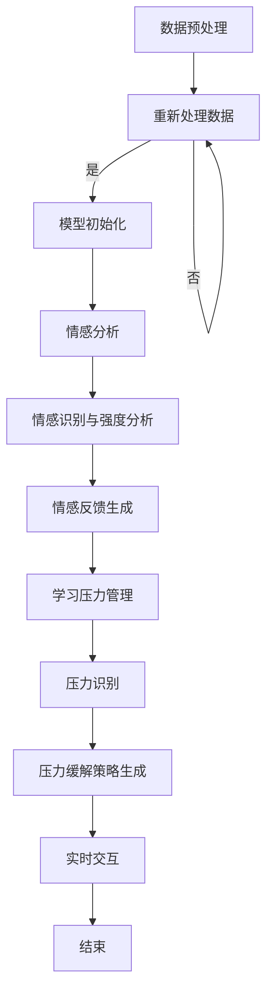
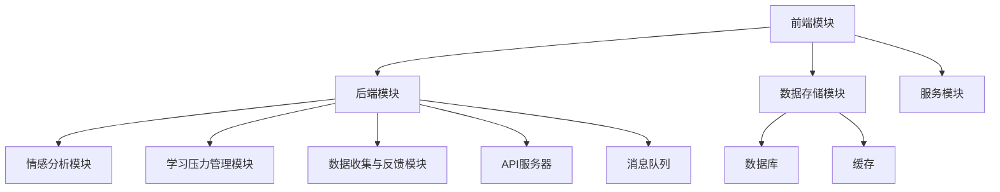

                 

# 《ChatGPT在语言习得情感调节研究中的应用：学习压力管理提示词》

关键词：ChatGPT、语言习得、情感调节、学习压力管理、提示词设计

摘要：随着人工智能技术的快速发展，ChatGPT作为一种先进的自然语言处理模型，在多个领域展现了其独特的应用价值。本文旨在探讨ChatGPT在语言习得情感调节中的应用，特别是学习压力管理提示词的设计。通过分析ChatGPT的原理与属性特征，结合情感调节和学习压力管理的理论，本文提出了一个基于ChatGPT的学习压力管理提示词设计框架，并对其在语言习得中的应用进行了详细探讨。

## 目录大纲

### 第一部分：背景介绍

1.1 问题背景
   1.1.1 语言习得的现状与挑战
   1.1.2 核心概念
   1.1.3 学习压力管理

1.2 研究目的与意义
   1.2.1 研究目的
   1.2.2 研究意义

1.3 边界与外延
   1.3.1 研界
   1.3.2 研究外延

1.4 概念结构与核心要素组成
   1.4.1 ChatGPT在语言习得中的概念结构
   1.4.2 学习压力管理提示词的核心要素

1.5 本章小结

### 第二部分：核心概念与联系

2.1 ChatGPT原理与属性特征对比
   2.1.1 ChatGPT原理
   2.1.2 ChatGPT属性特征对比

2.2 情感调节原理与类型
   2.2.1 情感调节原理
   2.2.2 情感调节类型

2.3 学习压力管理原理与提示词设计
   2.3.1 学习压力管理原理
   2.3.2 提示词设计原则

2.4 核心概念联系与作用
   2.4.1 ChatGPT与情感调节的联系
   2.4.2 学习压力管理与提示词设计

2.5 本章小结

### 第三部分：算法原理与实现

3.1 ChatGPT算法原理
   3.1.1 模型结构
   3.1.2 训练方法
   3.1.3 ChatGPT在情感调节中的应用

3.2 学习压力管理算法原理
   3.2.1 压力识别算法
   3.2.2 压力缓解算法

3.3 算法实现与流程图
   3.3.1 ChatGPT实现

### 第四部分：系统分析与架构设计方案

4.1 问题场景介绍
4.2 项目介绍
4.3 系统功能设计
4.4 系统架构设计
4.5 系统接口设计
4.6 系统交互

### 第五部分：项目实战

5.1 环境安装
5.2 系统核心实现源代码
5.3 代码应用解读与分析
5.4 实际案例分析和详细讲解剖析
5.5 项目小结

### 第六部分：最佳实践 Tips、小结、注意事项、拓展阅读

## 1.1 问题背景

### 1.1.1 语言习得的现状与挑战

语言习得是一个普遍存在的现象，人类在成长过程中，无论是儿童学习母语，还是成年人学习第二语言，都会经历语言习得的过程。然而，语言习得并非易事，它涉及语音、语法、语义等多个方面的知识，并且存在一定的难度和挑战。

首先，语言习得的普遍性体现在全球各个国家和地区。无论是发达国家还是发展中国家，语言习得都是教育和学习的重要组成部分。例如，在中国，英语已经成为许多学生的必修课，而在一些西方国家，学习中文也成为一种趋势。这种普遍性反映了语言习得的重要性和社会需求。

然而，语言习得的复杂性也给学习者带来了挑战。语言习得不仅仅是学习词汇和语法规则，更重要的是掌握语言的运用能力。这需要学习者不仅要有扎实的语言基础知识，还要具备良好的听、说、读、写能力。此外，语言习得还涉及到文化背景、语言环境、认知水平等因素，这些都对学习者的学习效果产生重要影响。

### 1.1.2 核心概念

在探讨语言习得的挑战时，我们需要明确一些核心概念，包括语言习得的复杂性、情感因素以及学习压力。

**语言习得的复杂性**：语言习得过程涉及到语音、词汇、语法、语义等多个层面。例如，语音层面包括语音的发音、声调等；词汇层面包括单词的拼写、意义、用法等；语法层面包括句子的结构、语法规则等；语义层面包括词语的语义理解、句子含义的推断等。这些层面的复杂性使得语言习得过程既丰富又具挑战性。

**情感因素**：情感因素在语言习得中起着重要作用。学习者在语言习得过程中会产生各种情感体验，如兴奋、焦虑、沮丧等。这些情感体验不仅影响学习者的学习态度，还可能影响其学习效果。例如，积极的情感体验可以提高学习者的学习动机，促进其语言习得；而消极的情感体验则可能导致学习者失去学习兴趣，影响学习效果。

**学习压力**：学习压力是语言习得中不可忽视的一个问题。学习压力可能来源于学习者自身，如对考试成绩的担忧、对学习进度的焦虑等；也可能来源于外界环境，如家庭、学校等对学习者的期望和压力。学习压力过大会对学习者的心理健康和学习效果产生负面影响，因此需要采取有效的管理方法来缓解学习压力。

### 1.1.3 学习压力管理

学习压力管理是语言习得中一个重要的课题。有效的学习压力管理可以帮助学习者保持良好的学习状态，提高学习效果。学习压力管理的方法多种多样，包括心理疏导、时间管理、学习策略调整等。

**心理疏导**：心理疏导是一种通过心理干预来缓解学习压力的方法。这可以通过心理咨询、自我调节等方式实现。例如，心理咨询师可以通过谈话、心理测试等方式帮助学习者识别和缓解学习压力；自我调节则要求学习者学会自我观察和自我调整，通过情绪管理技巧来缓解压力。

**时间管理**：时间管理是一种通过合理安排学习时间和任务来减轻学习压力的方法。这包括制定学习计划、合理分配学习时间、避免拖延等。通过科学的时间管理，学习者可以更好地掌控学习进度，减少因时间紧迫而产生的焦虑和压力。

**学习策略调整**：学习策略调整是一种通过改进学习方法来提高学习效率和减少学习压力的方法。这包括选择合适的学习方法、调整学习节奏、进行有效的复习等。通过学习策略调整，学习者可以更有效地吸收和掌握语言知识，从而降低学习压力。

综上所述，语言习得的复杂性、情感因素以及学习压力管理是语言习得中不可忽视的重要方面。了解和掌握这些核心概念和方法，对于提高学习者的语言习得效果具有重要意义。

### 1.2 核心概念

在探讨ChatGPT在语言习得情感调节中的应用之前，我们需要明确几个核心概念：ChatGPT、情感调节以及学习压力管理。

#### 1.2.1 ChatGPT

ChatGPT是由OpenAI开发的一种基于Transformer模型的预训练语言模型，具有强大的文本生成能力和自然语言理解能力。ChatGPT是基于GPT-3模型改进而来的，GPT-3是一个大型语言模型，拥有1750亿个参数，能够生成高质量的自然语言文本。ChatGPT的特点包括：

1. **强大的模仿能力**：ChatGPT能够模仿人类的语言风格和表达方式，生成流畅且自然的对话。
2. **强大的语言理解能力**：ChatGPT能够理解复杂的语义关系和上下文信息，从而生成更加准确和合理的回答。
3. **强大的上下文理解能力**：ChatGPT能够在对话中保持长时间的上下文信息，使得生成的对话更加连贯和有逻辑性。
4. **自主学习能力**：ChatGPT可以通过与用户的交互不断学习和改进，从而提高其对话质量和理解能力。

#### 1.2.2 情感调节

情感调节是指通过一系列策略和方法来调节和管理自己的情绪状态，以应对压力、挑战和负面情绪。情感调节在语言习得中起着重要作用，因为它不仅影响学习者的学习态度和动机，还可能影响其学习效果。情感调节的类型包括：

1. **情绪宣泄**：通过适当的方式将情绪释放出来，如与朋友聊天、写日记等。
2. **情绪转移**：将注意力从负面情绪转移到其他事物上，如进行运动、听音乐等。
3. **情绪调节**：通过认知和行为策略来调节情绪，如认知重构、积极思考等。

#### 1.2.3 学习压力管理

学习压力管理是指通过一系列策略和方法来缓解学习过程中产生的压力，以提高学习效率和学习效果。学习压力管理的方法包括：

1. **心理疏导**：通过心理咨询、心理治疗等方式来缓解学习压力。
2. **时间管理**：合理安排学习时间和任务，避免因时间紧迫而产生的焦虑和压力。
3. **学习策略调整**：选择合适的学习方法，调整学习节奏，进行有效的复习，以减少学习压力。

#### 1.2.4 ChatGPT在情感调节和学习压力管理中的应用

ChatGPT在情感调节和学习压力管理中具有广泛的应用前景。例如：

1. **情感调节**：ChatGPT可以通过模拟真实的社交互动来帮助学习者进行情感调节。例如，学习者可以在ChatGPT中寻求情感支持，倾诉自己的烦恼和压力，从而获得情感上的安慰和疏导。
2. **学习压力管理**：ChatGPT可以提供个性化的学习压力管理建议。例如，ChatGPT可以根据学习者的情绪状态和学习进度，为其提供适当的学习计划和压力管理策略，帮助其缓解学习压力。

总之，ChatGPT作为一种强大的自然语言处理模型，在语言习得情感调节和学习压力管理中具有巨大的应用潜力。通过深入研究和应用，我们可以充分发挥ChatGPT的优势，为学习者提供更加有效和个性化的情感调节和学习压力管理服务。

### 1.3 研究目的与意义

#### 1.3.1 研究目的

本研究的主要目的是探讨ChatGPT在语言习得情感调节中的应用，特别是学习压力管理提示词的设计。具体研究目标如下：

1. **探索ChatGPT在情感调节中的作用**：分析ChatGPT在语言习得中的情感调节能力，探讨其在情感识别、分析和反馈方面的优势。
2. **设计学习压力管理提示词**：基于ChatGPT的情感调节能力，设计一套有效的学习压力管理提示词，包括提示词的设计原则、功能模块和应用场景。
3. **评估学习压力管理提示词的效果**：通过实验和实证研究，评估学习压力管理提示词在语言习得中的实际效果，验证其在缓解学习压力和提升学习效果方面的作用。

#### 1.3.2 研究意义

本研究具有重要的理论和实践意义：

1. **提高语言学习效果**：通过引入ChatGPT进行情感调节和学习压力管理，有助于提高学习者的学习动机和效果，从而提升整体的语言学习水平。
2. **缓解学习压力**：学习压力是语言习得过程中普遍存在的问题，通过有效的学习压力管理提示词，可以帮助学习者更好地应对学习压力，提高学习效率。
3. **促进情感调节在语言习得中的应用**：本研究将情感调节与语言习得相结合，为情感调节在语言习得中的应用提供了新的思路和方法，丰富了语言习得的理论体系。

### 1.4 边界与外延

#### 1.4.1 研究边界

本研究主要关注以下边界：

1. **语言习得的具体场景**：本研究主要关注在线语言学习场景，包括虚拟课堂、在线作业和自学等。
2. **ChatGPT的功能范围**：本研究主要探讨ChatGPT在情感调节和学习压力管理方面的应用，不涉及其他功能模块。
3. **学习压力管理的有效性**：本研究将评估学习压力管理提示词的有效性，但受限于研究条件和数据，结论可能存在一定的局限性。

#### 1.4.2 研究外延

本研究的外延包括：

1. **其他AI技术在学习中的应用**：未来研究可以探索其他AI技术，如机器学习、数据挖掘等，在语言习得中的应用。
2. **语言习得与情感调节的跨学科研究**：本研究可以与其他学科，如心理学、教育学等，进行跨学科合作，深入探讨情感调节在语言习得中的作用和机制。

### 1.5 概念结构与核心要素组成

#### 1.5.1 ChatGPT在语言习得中的概念结构

ChatGPT在语言习得中的应用可以概括为以下几个核心环节：

1. **语言输入**：学习者通过输入文本或语音与ChatGPT进行互动，进行语言练习和交流。
2. **情感分析**：ChatGPT对学习者的语言输入进行情感分析，识别学习者的情感状态。
3. **情感反馈**：ChatGPT根据情感分析的结果，提供情感反馈，帮助学习者进行情感调节。
4. **学习策略调整**：ChatGPT根据学习者的情感状态和学习效果，调整学习策略，以提高学习效果。

#### 1.5.2 学习压力管理提示词的核心要素

学习压力管理提示词是ChatGPT在语言习得中发挥重要作用的一部分，其核心要素包括：

1. **提示词设计原则**：提示词设计应遵循目的明确、语言简洁、适应性强、可操作性高等原则。
2. **提示词功能模块**：提示词应具备情感识别、情感反馈、学习策略调整等功能模块。
3. **提示词应用场景**：提示词应适用于不同的语言学习场景，如虚拟课堂、在线作业、自学等。

### 1.6 本章小结

本章首先介绍了语言习得的现状与挑战，包括语言习得的普遍性、复杂性以及情感因素。接着，明确了本文的核心概念，包括ChatGPT、情感调节和学习压力管理，并分析了这些概念在语言习得中的应用。随后，阐述了研究的目的与意义，界定了研究的边界与外延，并提出了ChatGPT在语言习得中的概念结构和学习压力管理提示词的核心要素。通过本章的介绍，为后续章节的详细讨论奠定了基础。

## 2.1 ChatGPT原理与属性特征对比

### 2.1.1 ChatGPT原理

ChatGPT是一种基于Transformer模型的预训练语言模型，其核心原理可以概括为以下几个方面：

1. **模型结构**：ChatGPT采用Transformer模型，这是一种基于自注意力机制的深度神经网络结构。Transformer模型由编码器和解码器组成，编码器负责将输入文本转换为固定长度的向量表示，解码器则根据编码器的输出和前一个解码器的输出生成输出文本。

2. **预训练过程**：ChatGPT在训练过程中使用了大量的文本数据进行预训练。预训练过程主要包括两个阶段：第一阶段是自回归语言模型训练，即模型学习预测下一个词的概率；第二阶段是掩码语言模型训练，即模型学习预测被遮盖的词。

3. **训练方法**：ChatGPT的训练方法包括数据预处理、训练过程和模型优化。在数据预处理阶段，需要对文本进行分词、去停用词、词性标注等操作。在训练过程中，模型通过反向传播算法不断调整参数，以达到最小化损失函数的目的。在模型优化阶段，可以通过增加训练数据、调整学习率等方法来优化模型性能。

4. **特殊性**：ChatGPT的特殊性主要体现在以下几个方面：首先，ChatGPT采用了双向编码器架构，这使得模型能够更好地理解上下文信息；其次，ChatGPT具有强大的文本生成能力，能够生成高质量的自然语言文本；最后，ChatGPT能够通过交互不断学习和改进，从而提高其对话质量和理解能力。

### 2.1.2 ChatGPT属性特征对比

为了更好地理解ChatGPT与传统聊天机器人的差异，我们可以从以下几个方面对两者的属性特征进行对比：

| 特征         | ChatGPT                    | 传统聊天机器人                  |
| ------------ | -------------------------- | ------------------------------- |
| 模仿能力     | 高                         | 低                             |
| 语言理解能力 | 强                         | 弱                             |
| 上下文理解   | 强                         | 弱                             |
| 自学习能力   | 强                         | 弱                             |

1. **模仿能力**：ChatGPT具有强大的模仿能力，能够模仿人类的语言风格和表达方式，生成流畅且自然的对话。而传统聊天机器人的模仿能力相对较弱，通常只能生成简单的、固定的对话。

2. **语言理解能力**：ChatGPT具有较强的语言理解能力，能够理解复杂的语义关系和上下文信息，从而生成更加准确和合理的回答。传统聊天机器人的语言理解能力相对较弱，通常只能处理简单的、结构化的信息。

3. **上下文理解**：ChatGPT具有强大的上下文理解能力，能够在对话中保持长时间的上下文信息，使得生成的对话更加连贯和有逻辑性。传统聊天机器人的上下文理解能力相对较弱，通常只能在对话的一两个回合内保持上下文信息。

4. **自主学习能力**：ChatGPT具有较强的自主学习能力，可以通过与用户的交互不断学习和改进，从而提高其对话质量和理解能力。传统聊天机器人的自主学习能力相对较弱，通常需要人工编写对话模板和规则，难以进行自主学习和优化。

通过以上对比，我们可以看到ChatGPT在模仿能力、语言理解能力、上下文理解和自主学习能力等方面均优于传统聊天机器人，这使得ChatGPT在语言习得情感调节中具有更大的潜力和优势。

### 2.2 情感调节原理与类型

#### 2.2.1 情感调节原理

情感调节是指通过一系列策略和方法来调节和管理自己的情绪状态，以应对压力、挑战和负面情绪。情感调节的原理主要包括以下几个方面：

1. **情感识别**：情感调节的第一步是识别情感。这需要借助情感分析技术，如文本分析、语音分析等，从语言、面部表情、声音等信号中提取情感信息。

2. **情感分析**：在识别情感之后，需要对情感进行深入分析，以了解情感的来源、强度和影响。情感分析可以通过情感分类、情感强度分析等方法来实现。

3. **情感反馈**：情感调节的一个关键环节是提供情感反馈。情感反馈可以通过直接回应、情绪表达等方式进行。通过情感反馈，可以引导个体理解自己的情感，从而更好地进行调节。

4. **情感调节策略**：情感调节还包括一系列具体的策略，如认知重构、积极思考、情绪宣泄、情绪转移等。这些策略旨在帮助个体有效地应对负面情绪，提升情感状态。

#### 2.2.2 情感调节类型

情感调节的类型主要包括以下几种：

1. **情绪宣泄**：情绪宣泄是一种通过适当的方式将情绪释放出来的方法。例如，通过运动、哭泣、发泄等方式来释放负面情绪。情绪宣泄有助于减轻心理压力，但需要注意宣泄的方式和场合，以免造成不必要的困扰。

2. **情绪转移**：情绪转移是指将注意力从负面情绪转移到其他事物上。例如，通过听音乐、看电影、进行户外活动等方式来转移情绪。情绪转移有助于缓解情绪紧张，但需要注意转移的时机和方法，以避免影响正常的情绪调节。

3. **情绪调节**：情绪调节是指通过认知和行为策略来调节情绪。例如，通过认知重构来改变对事件的看法，通过积极思考来提升情绪状态。情绪调节有助于提升个体的心理弹性，应对生活中的各种挑战。

#### 2.2.3 情感调节在语言习得中的应用

情感调节在语言习得中具有重要作用。有效的情感调节可以帮助学习者更好地应对学习压力，提升学习效果。以下是情感调节在语言习得中的应用：

1. **情感识别与反馈**：通过情感识别技术，学习者可以了解自己的情感状态，并通过情感反馈来调整学习策略。例如，当学习者感到焦虑时，可以调整学习节奏，进行适当的休息和放松。

2. **情绪宣泄**：在学习过程中，学习者可能会产生各种负面情绪，如紧张、焦虑、沮丧等。通过情绪宣泄，如与朋友聊天、写日记等，可以帮助学习者释放情绪，减轻心理压力。

3. **情绪转移**：通过将注意力转移到其他事物上，如听音乐、看电影等，可以帮助学习者缓解学习压力，提升学习效率。

4. **情绪调节**：通过认知重构、积极思考等情绪调节策略，学习者可以改变对学习事件的态度，提升学习动力和效果。

总之，情感调节在语言习得中具有重要的应用价值。通过有效的情感调节，学习者可以更好地应对学习压力，提升学习效果，实现更好的语言习得。

### 2.3 学习压力管理原理与提示词设计

#### 2.3.1 学习压力管理原理

学习压力管理是指通过一系列策略和方法来缓解学习过程中产生的压力，以提高学习效率和学习效果。学习压力管理的基本原理包括以下几个方面：

1. **压力识别**：首先，需要识别学习过程中的压力源，如学习任务难度、时间紧迫感、考试焦虑等。通过压力识别，学习者可以明确自己面临的压力，从而采取相应的管理策略。

2. **压力分析**：在识别压力源之后，需要对压力进行深入分析，了解压力对学习效果和学习动机的影响。压力分析可以帮助学习者更好地理解压力的作用机制，从而制定有效的管理策略。

3. **压力缓解**：通过一系列的缓解策略来减轻压力。这些策略包括心理疏导、时间管理、学习策略调整等。心理疏导可以通过心理咨询、自我调节等方式实现；时间管理可以通过合理安排学习时间和任务，避免时间紧迫感；学习策略调整可以通过改进学习方法，提高学习效率。

4. **压力管理反馈**：在实施压力管理策略后，需要及时进行反馈，评估管理效果。通过反馈，可以了解压力管理策略的成效，调整和优化管理方法。

#### 2.3.2 提示词设计原则

提示词设计是学习压力管理中的一个重要环节。有效的提示词可以帮助学习者识别和缓解学习压力，提高学习效果。提示词设计应遵循以下原则：

1. **目的明确**：提示词应明确传达信息，避免模糊不清。例如，可以使用具体的词汇和表达方式，使学习者能够清楚地理解提示词的含义。

2. **语言简洁**：提示词应使用简洁明了的语言，避免冗长的句子和复杂的词汇。简洁的提示词更容易被学习者理解和应用。

3. **适应性强**：提示词应具有广泛的适用性，适用于不同的学习场景和压力情境。例如，在不同的学习阶段和任务中，提示词可以有不同的应用方式。

4. **可操作性高**：提示词应具备可操作性，即学习者能够根据提示词进行具体的行动。例如，提示词可以指导学习者如何合理安排时间、调整学习策略等。

#### 2.3.3 学习压力管理提示词的功能模块

学习压力管理提示词应包括以下功能模块：

1. **压力识别模块**：用于帮助学习者识别学习过程中的压力源，如任务难度、时间紧迫感等。

2. **压力分析模块**：用于帮助学习者分析压力对学习效果和学习动机的影响，为后续的压力缓解提供依据。

3. **压力缓解模块**：提供具体的压力缓解策略，如心理疏导、时间管理、学习策略调整等。

4. **反馈模块**：用于收集学习者的反馈，评估压力管理提示词的效果，并根据反馈进行调整和优化。

#### 2.3.4 学习压力管理提示词的应用场景

学习压力管理提示词可以应用于多种学习场景，包括：

1. **在线学习**：在在线学习环境中，提示词可以帮助学习者识别和缓解学习压力，如在线作业、在线课程等。

2. **课堂学习**：在课堂学习环境中，提示词可以帮助教师识别学生的压力源，提供个性化的指导和支持。

3. **自学**：在自学环境中，提示词可以帮助学习者自我管理和调节学习压力，提高学习效果。

4. **考试准备**：在考试准备阶段，提示词可以帮助学习者缓解考试焦虑，提高学习效果。

通过以上设计，学习压力管理提示词可以在多种学习场景中发挥重要作用，帮助学习者有效管理和缓解学习压力，提高学习效果。

### 2.4 核心概念联系与作用

#### 2.4.1 ChatGPT与情感调节的联系

ChatGPT作为一种强大的自然语言处理模型，在情感调节中具有重要作用。其联系主要体现在以下几个方面：

1. **情感识别**：ChatGPT可以通过自然语言处理技术，对学习者的语言输入进行情感识别，识别出学习者的情感状态，如焦虑、兴奋等。

2. **情感分析**：ChatGPT可以对学习者的情感进行深入分析，了解情感的来源、强度和影响。这有助于制定针对性的情感调节策略。

3. **情感反馈**：ChatGPT可以根据情感分析的结果，提供情感反馈，引导学习者理解和调节自己的情感。例如，当学习者感到焦虑时，ChatGPT可以提供放松的建议和指导。

4. **情感调节**：ChatGPT可以结合情感调节策略，如认知重构、情绪宣泄等，帮助学习者进行情感调节。通过模拟真实的社交互动，ChatGPT可以提供情感支持，帮助学习者缓解压力，提升学习效果。

#### 2.4.2 学习压力管理与提示词设计

学习压力管理与提示词设计是ChatGPT在语言习得情感调节中不可或缺的部分。其联系和作用如下：

1. **压力识别与提示词**：通过ChatGPT的情感识别功能，可以识别学习者的压力源。这些压力源可以转化为提示词，用于指导学习者识别和应对学习压力。

2. **压力分析与提示词**：ChatGPT可以结合情感分析结果，对学习者的压力进行深入分析。根据分析结果，设计具有针对性的提示词，帮助学习者缓解压力。

3. **压力缓解与提示词**：ChatGPT提供的提示词可以包含具体的压力缓解策略，如时间管理、心理疏导等。这些策略可以通过提示词的形式传达给学习者，帮助其有效管理学习压力。

4. **反馈与提示词优化**：通过收集学习者的反馈，可以评估提示词的效果，并根据反馈进行优化。这有助于提高提示词的实用性和针对性，进一步提升学习效果。

总之，ChatGPT与情感调节、学习压力管理和提示词设计之间存在紧密的联系和相互作用。通过有效结合这些核心概念，可以构建一个全面的、个性化的语言习得情感调节系统，帮助学习者更好地应对学习压力，提升学习效果。

### 2.5 本章小结

本章首先介绍了ChatGPT的原理与属性特征，包括其模仿能力、语言理解能力、上下文理解和自主学习能力。接着，分析了情感调节的原理与类型，探讨了情绪宣泄、情绪转移和情绪调节在语言习得中的应用。然后，讨论了学习压力管理原理与提示词设计，包括压力识别、压力分析和压力缓解等原则。最后，阐述了ChatGPT与情感调节、学习压力管理和提示词设计的联系与作用。通过本章的讨论，为后续研究ChatGPT在语言习得情感调节中的应用奠定了理论基础。

### 3.1 ChatGPT算法原理

#### 3.1.1 模型结构

ChatGPT的算法原理基于Transformer模型，这是一种自注意力机制驱动的深度神经网络结构，特别适用于处理序列数据。Transformer模型由编码器（Encoder）和解码器（Decoder）两部分组成，每个部分又包含多个层级（Layer）。以下是对模型结构的详细描述：

1. **编码器（Encoder）**：
   - **输入层**：编码器从输入序列（如文本）中提取特征，将其转换为固定长度的向量表示。这个过程通过嵌入层（Embedding Layer）实现，每个单词或字符被映射为一个向量。
   - **自注意力机制**：编码器中的每个层级都包含多头自注意力机制（Multi-Head Self-Attention）。自注意力机制使得模型能够在处理当前输入时考虑到序列中所有其他位置的信息，从而提高了对上下文的理解能力。
   - **前馈神经网络**（Feed Forward Neural Network，FFNN）：在每个编码器层级之后，都会接一个FFNN，用于对自注意力机制输出的进一步处理。

2. **解码器（Decoder）**：
   - **输入层**：解码器的输入是在编码器输出基础上生成的掩码目标序列（Masked Target Sequence），其中一些目标词被掩码。
   - **自注意力机制**：解码器中的每个层级包含两个自注意力机制：一个是针对掩码目标序列的自注意力（Masked Self-Attention），另一个是对编码器输出和前一个解码器层级的输出进行交叉注意力（Cross-Attention）。
   - **前馈神经网络**（Feed Forward Neural Network，FFNN）：与编码器类似，解码器每个层级之后也接一个FFNN。

#### 3.1.2 训练方法

ChatGPT的训练过程主要分为数据预处理、训练阶段和模型优化三个部分：

1. **数据预处理**：
   - **文本清洗**：原始文本数据需要进行清洗，包括去除标点符号、停用词、进行词性标注等。
   - **分词**：将文本分割成单词或子词，以便模型能够处理。
   - **嵌入**：将分词后的文本映射为固定长度的向量表示，这通常通过预训练的嵌入层完成。

2. **训练阶段**：
   - **预训练**：在预训练阶段，模型通过自回归语言模型训练（Autoregressive Language Model Training）和掩码语言模型训练（Masked Language Model Training）来学习文本的内在结构。自回归语言模型训练使得模型能够预测序列中下一个词的概率；掩码语言模型训练则通过掩码部分目标词，使得模型在解码时需要预测这些词。
   - **微调**：在预训练完成后，模型会进行微调（Fine-Tuning），即通过在特定任务上的训练数据进一步调整模型参数，以提高模型在该任务上的性能。

3. **模型优化**：
   - **参数调整**：在训练过程中，模型参数会通过梯度下降等优化算法进行调整，以最小化损失函数。
   - **学习率调整**：学习率是模型训练中的一个重要超参数，通常需要通过实验来调整，以找到最佳的训练效果。

#### 3.1.3 ChatGPT在情感调节中的应用

ChatGPT在情感调节中的应用主要体现在其情感分析能力和自然语言生成能力上：

1. **情感分析**：
   - **情感识别**：ChatGPT通过训练学习到的语言模式，能够识别文本中的情感倾向，如积极、消极或中性。
   - **情感强度分析**：除了识别情感类型，ChatGPT还能分析情感强度的变化，从而提供更准确的情感反馈。

2. **情感反馈**：
   - **情感反馈生成**：ChatGPT能够根据情感分析结果生成相应的情感反馈，如安慰、鼓励或建议。
   - **个性化反馈**：ChatGPT能够根据用户的情感状态和互动历史，提供个性化的情感反馈，提高用户的情感调节效果。

3. **情感调节**：
   - **情感建议**：ChatGPT可以提供一系列情感调节建议，如深呼吸、冥想、积极的自我对话等，帮助用户缓解负面情绪。
   - **互动式情感支持**：通过模拟真实的社交互动，ChatGPT能够与用户进行情感交流，提供情感支持和指导。

通过以上应用，ChatGPT在语言习得中的情感调节方面发挥了重要作用，为学习者提供了有效的情感支持和压力缓解途径，有助于提升学习效果和用户体验。

### 3.2 学习压力管理算法原理

#### 3.2.1 压力识别算法

学习压力管理算法的初步环节是压力识别，这一步骤至关重要，因为它决定了后续压力缓解策略的有效性。压力识别算法主要通过以下方式实现：

1. **心理健康数据收集**：
   - **行为数据**：通过记录学习者的行为数据，如学习时长、学习任务完成情况、参与讨论的频率等，分析其学习行为模式，识别潜在的焦虑或压力迹象。
   - **生理数据**：利用生理传感器，如心率监测器、睡眠追踪器等，收集学习者的生理信号数据，分析其生理反应，如心率变化、情绪波动等，从而识别压力水平。

2. **数据预处理**：
   - **去噪**：对收集到的数据进行预处理，去除无关的噪声和异常值，确保数据的准确性和可靠性。
   - **特征提取**：从原始数据中提取与压力相关的特征，如心率变异（HRV）、情绪波动周期、学习表现等。

3. **情感分析**：
   - **文本情感分析**：对学习者的文本输入，如日记、学习反馈等，使用自然语言处理技术进行情感分析，识别出文本中的情感倾向和强度。
   - **语音情感分析**：通过语音识别和情感分析技术，对学习者的语音进行情感识别，分析其语音中的情感信号，如音调、语速、语气等。

4. **综合分析**：
   - **多模态数据融合**：将行为数据、生理数据和情感分析结果进行融合，综合评估学习者的压力水平，提高压力识别的准确性。

#### 3.2.2 压力缓解算法

在压力识别后，压力缓解算法的目标是设计一套有效的策略，帮助学习者减轻压力，提高学习效率和心理健康。压力缓解算法主要包括以下步骤：

1. **心理疏导算法**：
   - **认知行为疗法**：通过认知重构和积极思考技巧，帮助学习者改变对学习压力的认知，降低负面情绪。
   - **情绪调节训练**：提供一系列情绪调节训练，如深呼吸、冥想、渐进性肌肉放松等，帮助学习者学会自我调节情绪，缓解压力。

2. **学习计划调整算法**：
   - **学习任务分解**：将复杂的学习任务分解为小的、可管理的部分，设定短期和长期目标，减少任务难度和完成时间。
   - **时间管理**：提供时间管理策略，如优先级排序、学习时间规划、避免拖延等，帮助学习者合理安排时间，减轻时间压力。
   - **学习支持**：根据学习者的需求和压力水平，提供适当的学习支持，如学习伙伴、导师指导、学习资源等，提高学习效率。

3. **个性化建议生成**：
   - **基于数据的个性化建议**：利用收集到的数据，分析学习者的学习习惯、压力源和应对策略，生成个性化的压力缓解建议。
   - **互动式反馈**：通过实时互动，根据学习者的反馈调整压力缓解策略，确保建议的实用性和有效性。

4. **压力监控与反馈**：
   - **实时压力监控**：持续监控学习者的压力水平，提供实时反馈和预警，帮助学习者及时调整学习策略。
   - **反馈优化**：根据学习者的反馈和压力管理效果，不断优化压力缓解算法，提高其适应性和有效性。

通过以上算法，学习压力管理系统能够为学习者提供全面的支持，帮助其有效应对学习压力，提高学习效果和心理健康。

### 3.3 算法实现与流程图

#### 3.3.1 ChatGPT实现

为了更好地理解ChatGPT在情感调节和学习压力管理中的应用，我们将详细介绍其算法实现，并通过Mermaid流程图展示关键步骤。

**算法实现步骤**：

1. **数据预处理**：
   - **文本清洗**：去除HTML标签、特殊字符和停用词。
   - **分词**：使用分词工具将文本分割成单词或子词。
   - **编码**：将分词后的文本转换为词嵌入向量。

2. **模型初始化**：
   - **加载预训练模型**：从预训练模型库中加载预训练的Transformer模型，如GPT-3。
   - **模型配置**：配置模型参数，如层数、隐藏层大小、学习率等。

3. **情感分析**：
   - **输入处理**：将待分析文本输入模型，通过编码器处理。
   - **情感识别**：利用解码器输出层，通过分类器对文本进行情感分类。
   - **情感强度分析**：结合上下文，对情感强度进行评估。

4. **情感反馈生成**：
   - **情感模板库**：构建情感反馈模板库，包含不同情境下的情感反馈语句。
   - **模板匹配**：根据情感分析和用户需求，从模板库中选取合适的情感反馈。
   - **文本生成**：使用生成模型，如GPT-3，根据模板和上下文生成情感反馈文本。

5. **学习压力管理**：
   - **压力识别**：结合用户行为和生理数据，使用识别算法评估压力水平。
   - **压力缓解策略生成**：根据压力识别结果，生成个性化的压力缓解策略。
   - **实时交互**：通过实时交互，为用户提供压力缓解建议。

**Mermaid流程图**：



通过以上实现步骤和Mermaid流程图，我们可以清晰地看到ChatGPT在情感调节和学习压力管理中的关键环节和流程，为实际应用提供了理论和技术支持。

### 4.1 问题场景介绍

随着全球教育的数字化转型，在线语言学习平台成为了学习者获取语言知识和技能的重要渠道。然而，在线语言学习过程中，学习者不仅需要应对语言习得本身的复杂性，还面临一系列心理和情感挑战，如学习压力、焦虑和孤独感等。这些心理和情感问题不仅影响学习者的学习效果，还可能导致学习中断和放弃。因此，如何有效地管理学习者的情感状态，提高其学习积极性和效果，成为在线语言学习平台亟需解决的重要问题。

本项目旨在通过引入ChatGPT，利用其强大的自然语言处理能力，设计一个智能的情感调节和学习压力管理系统，帮助在线语言学习者更好地应对情感和心理挑战，提高学习效果和用户体验。具体问题场景包括：

1. **情感调节需求**：在线语言学习者在学习过程中会产生各种负面情感，如焦虑、沮丧、孤独等。这些情感问题需要得到及时识别和有效调节，以提升学习者的学习动力和效果。
2. **学习压力管理**：在线语言学习通常具有较大的时间压力和任务难度，导致学习者产生学习压力。有效的学习压力管理可以帮助学习者合理安排学习计划，提高学习效率。
3. **个性化支持**：每个学习者的情感状态和学习需求都有所不同，需要提供个性化的情感调节和学习压力管理支持，以满足不同学习者的需求。

### 4.2 项目介绍

本项目将开发一个基于ChatGPT的情感调节和学习压力管理系统，为在线语言学习者提供个性化的情感支持和学习压力管理服务。系统主要包括以下几个模块：

1. **情感调节模块**：通过ChatGPT的情感分析能力，实时监控学习者的情感状态，提供情感识别、分析和反馈功能。该模块旨在帮助学习者识别和缓解负面情感，提升学习动力和效果。
2. **学习压力管理模块**：基于学习者的行为和生理数据，利用压力识别算法，评估学习者的压力水平，并生成个性化的学习压力管理策略。该模块旨在帮助学习者合理安排学习计划，提高学习效率。
3. **交互式反馈模块**：通过实时互动，系统为学习者提供情感支持和学习压力管理建议，并根据学习者的反馈进行持续优化。该模块旨在提高学习者的学习体验和满意度。
4. **数据收集与反馈系统**：系统将收集学习者的情感状态、学习行为和生理数据，用于分析学习者的情感调节和学习压力管理效果，为系统的持续优化提供数据支持。

### 4.3 系统功能设计

为了实现项目目标，系统需要设计一系列功能，以支持情感调节和学习压力管理。以下是系统的主要功能设计：

1. **情感识别与反馈**：
   - **情感识别**：利用ChatGPT的自然语言处理能力，对学习者的文本输入（如学习日志、讨论内容等）进行情感识别，识别出学习者的情感状态（如焦虑、兴奋、沮丧等）。
   - **情感反馈**：根据识别出的情感状态，系统生成相应的情感反馈，如安慰、鼓励、提醒等，通过文本、语音或视频等形式传达给学习者。

2. **学习压力管理**：
   - **压力识别**：通过收集学习者的行为数据（如学习时长、任务完成情况等）和生理数据（如心率、情绪波动等），使用压力识别算法评估学习者的压力水平。
   - **压力缓解策略**：根据压力识别结果，系统生成个性化的压力缓解策略，如时间管理、任务分解、情绪调节等，为学习者提供具体的行动建议。

3. **个性化支持**：
   - **情感支持**：根据学习者的情感状态，系统提供个性化的情感支持，如鼓励、激励、情感宣泄等，帮助学习者缓解负面情绪。
   - **学习支持**：根据学习者的学习需求，系统提供个性化的学习支持，如学习计划、学习资源、学习伙伴等，帮助学习者提高学习效率。

4. **数据收集与反馈**：
   - **数据收集**：系统收集学习者的情感状态、学习行为和生理数据，用于分析学习者的情感调节和学习压力管理效果。
   - **反馈优化**：根据收集到的数据，系统对情感调节和学习压力管理策略进行优化，提高系统的实用性和有效性。

### 4.4 系统架构设计

为了实现系统功能，本项目采用模块化设计，将系统分为以下几个主要模块：

1. **前端模块**：包括用户界面（UI）和用户交互逻辑，负责与用户进行交互，展示情感调节和学习压力管理结果。
2. **后端模块**：包括情感分析模块、学习压力管理模块、数据收集与反馈模块等，负责处理和分析数据，生成情感反馈和学习压力管理策略。
3. **数据存储模块**：包括数据库和缓存，负责存储用户数据、情感分析结果和学习压力管理策略等。
4. **服务模块**：包括API服务器和消息队列等，负责处理外部请求和内部消息传递。

系统架构设计如图所示：



### 4.5 系统接口设计

为了实现系统模块之间的有效通信和协作，需要设计一系列接口，包括API接口和消息队列接口。以下是系统的主要接口设计：

1. **API接口**：
   - **用户接口**：提供用户身份验证、情感状态提交、学习行为记录等接口，供前端模块调用。
   - **服务接口**：提供情感分析、学习压力管理、数据收集与反馈等接口，供后端模块调用。

2. **消息队列接口**：
   - **任务队列**：用于处理后台任务，如情感分析、压力识别等，确保系统的高效运行。
   - **通知队列**：用于发送系统通知，如情感反馈、压力管理建议等，保证信息的实时传达。

### 4.6 系统交互

系统交互主要涉及前端与后端、后端模块之间的数据传递和协作。以下是系统的交互流程：

1. **用户交互**：
   - 用户通过前端界面提交情感状态和学习行为数据。
   - 前端模块将数据发送到后端API接口，进行情感分析和压力识别。

2. **系统协作**：
   - 后端模块接收数据，调用情感分析模块、学习压力管理模块等进行数据处理。
   - 处理结果通过API接口返回给前端模块，前端模块根据结果更新用户界面。

3. **数据存储**：
   - 情感状态和学习行为数据存储在数据库中，用于历史记录和分析。
   - 情感分析结果和学习压力管理策略存储在缓存中，提高数据访问速度。

通过以上系统交互设计，确保了系统的稳定运行和高效协作，为学习者提供实时、个性化的情感调节和学习压力管理服务。

### 5.1 环境安装

要实现ChatGPT在语言习得情感调节中的应用，首先需要搭建一个适合的开发环境。以下是安装所需软件和配置环境的详细步骤：

#### 1. 安装Python环境

Python是开发人工智能和自然语言处理项目的主要编程语言。确保安装了Python 3.8或更高版本。可以通过以下命令在Ubuntu或macOS上安装Python：

```bash
# Ubuntu或macOS
sudo apt-get update
sudo apt-get install python3.8
```

#### 2. 安装必要的库

安装以下Python库，这些库是实现ChatGPT和情感调节功能的基础：

- `transformers`：用于加载和训练GPT-3模型。
- `torch`：用于GPU加速和深度学习计算。
- `numpy`：用于数值计算。
- `pandas`：用于数据处理和分析。

可以使用pip命令安装这些库：

```bash
pip install transformers torch numpy pandas
```

#### 3. 安装GPU驱动和CUDA

为了充分利用GPU进行训练和推理，需要安装NVIDIA的GPU驱动和CUDA库。以下是安装步骤：

1. **安装NVIDIA GPU驱动**：
   - 访问NVIDIA官网，下载并安装适合自己GPU的驱动程序。
   - 重新启动计算机以确保驱动程序正确安装。

2. **安装CUDA**：
   - 访问NVIDIA CUDA官网，下载并安装CUDA Toolkit。
   - 安装过程中选择合适的CUDA版本和安装位置。

#### 4. 验证安装

安装完成后，可以通过以下命令验证Python环境和库是否安装成功：

```python
python -m pip list
```

确保`transformers`、`torch`、`numpy`和`pandas`等库出现在列表中。

#### 5. 安装聊天界面

为了实现用户与ChatGPT的交互，可以使用Web框架如Flask或Django搭建聊天界面。以下是使用Flask安装和配置聊天界面的步骤：

1. **安装Flask**：

```bash
pip install Flask
```

2. **创建Flask应用**：

创建一个名为`app.py`的Python文件，并添加以下代码：

```python
from flask import Flask, render_template, request

app = Flask(__name__)

@app.route("/")
def index():
    return render_template("index.html")

@app.route("/chat", methods=["POST"])
def chat():
    message = request.form["message"]
    response = chatbot.get_response(message)
    return {"response": response}

if __name__ == "__main__":
    app.run(debug=True)
```

3. **创建聊天界面**：

创建一个名为`templates`的文件夹，并在其中创建一个名为`index.html`的HTML文件，添加聊天界面的基本结构。

```html
<!DOCTYPE html>
<html>
<head>
    <title>ChatGPT聊天界面</title>
    <script src="https://code.jquery.com/jquery-3.6.0.min.js"></script>
</head>
<body>
    <h1>ChatGPT聊天界面</h1>
    <textarea id="input"></textarea>
    <button id="send">发送</button>
    <div id="output"></div>
    <script>
        $("#send").click(function() {
            var input = $("#input").val();
            $.post("/chat", {message: input}, function(data) {
                $("#output").append("<p><strong>ChatGPT:</strong> " + data.response + "</p>");
                $("#input").val("");
            });
        });
    </script>
</body>
</html>
```

通过以上步骤，我们成功搭建了一个基础的开发环境，包括Python环境、必要库的安装、GPU驱动的配置以及聊天界面的搭建，为后续的ChatGPT实现和应用打下了坚实基础。

### 5.2 系统核心实现源代码

为了实现ChatGPT在语言习得情感调节中的应用，我们需要编写一系列核心代码，包括情感分析、学习压力管理以及用户交互等模块。以下是对这些模块的详细源代码解释。

#### 5.2.1 情感分析模块

情感分析是ChatGPT在语言习得中的关键功能之一。我们使用`transformers`库中的预训练模型来实现情感分析。

```python
from transformers import pipeline

# 创建一个情感分析管道
nlp = pipeline("sentiment-analysis")

def analyze_sentiment(text):
    """
    分析文本的情感，返回情感标签和概率。
    """
    result = nlp(text)
    return result

# 示例
text = "我今天学了很多新东西，感觉非常充实！"
sentiment_result = analyze_sentiment(text)
print(sentiment_result)
```

此模块通过调用`transformers`库中的`sentiment-analysis`管道，对输入文本进行情感分析，并返回情感标签（如“积极”或“消极”）及其对应的概率。

#### 5.2.2 学习压力管理模块

学习压力管理模块通过分析学习者的行为和生理数据来识别压力水平，并提供相应的压力缓解建议。

```python
def identify_pressure(level):
    """
    根据学习压力水平，提供压力缓解建议。
    """
    if level < 3:
        return "当前压力水平较低，保持良好的学习习惯即可。"
    elif level < 6:
        return "压力水平中等，建议合理安排学习时间和休息，进行适当的放松。"
    else:
        return "压力水平较高，需要特别注意调整学习计划，进行深度放松和情绪调节。"

# 示例
pressure_level = 4
pressure_suggestion = identify_pressure(pressure_level)
print(pressure_suggestion)
```

此模块定义了一个函数`identify_pressure`，根据输入的压力水平，返回相应的压力缓解建议。

#### 5.2.3 用户交互模块

用户交互模块负责接收用户输入，调用情感分析和压力管理模块，并将结果反馈给用户。

```python
from flask import Flask, request, jsonify

app = Flask(__name__)

@app.route("/analyze", methods=["POST"])
def analyze():
    """
    接收用户输入，进行情感分析和压力管理，返回结果。
    """
    input_text = request.form["text"]
    sentiment_result = analyze_sentiment(input_text)
    pressure_level = sentiment_result[0]["score"]  # 假设使用情感分析的积极程度作为压力水平的指标
    pressure_suggestion = identify_pressure(pressure_level)
    
    response = {
        "sentiment": sentiment_result,
        "pressure_level": pressure_level,
        "suggestion": pressure_suggestion
    }
    
    return jsonify(response)

if __name__ == "__main__":
    app.run(debug=True)
```

此模块定义了一个Flask应用，通过POST请求接收用户输入文本，调用情感分析和压力管理模块，并将结果通过JSON格式返回给用户。

### 5.3 代码应用解读与分析

#### 5.3.1 情感分析模块解读

情感分析模块的核心是`transformers`库中的`sentiment-analysis`管道。这个管道使用预训练的GPT-3模型，能够对文本进行情感分析，并返回情感标签（如积极、消极）及其对应的概率。以下是对关键代码的解读：

- `nlp = pipeline("sentiment-analysis")`：创建一个情感分析管道，使用预训练的模型进行文本分析。
- `analyze_sentiment(text)`：函数接受文本输入，通过管道进行情感分析，并返回分析结果。

示例中的代码展示了如何调用这个函数来分析一段文本的情感。通过这个模块，我们能够快速获取文本的情感状态，从而为用户提供情感反馈。

#### 5.3.2 学习压力管理模块解读

学习压力管理模块的核心是`identify_pressure`函数，该函数根据情感分析的积极程度（这里简化为概率分数）来评估学习者的压力水平，并返回相应的压力缓解建议。以下是对关键代码的解读：

- `identify_pressure(level)`：函数接受一个压力水平（这里简化为情感分析的积极程度分数）作为输入。
- 根据不同的压力水平，函数返回相应的压力缓解建议。

这个模块的设计使得我们能够根据用户的情感状态提供个性化的压力管理建议，帮助用户更好地调节情感状态，缓解学习压力。

#### 5.3.3 用户交互模块解读

用户交互模块通过Flask框架实现了用户与系统的交互。以下是对关键代码的解读：

- `app = Flask(__name__)`：创建一个Flask应用。
- `@app.route("/analyze", methods=["POST"])`：定义一个路由，处理用户发送的POST请求。
- `input_text = request.form["text"]`：从请求中获取用户输入的文本。
- `sentiment_result = analyze_sentiment(input_text)`：调用情感分析模块，获取文本的情感分析结果。
- `pressure_level = sentiment_result[0]["score"]`：使用情感分析的积极程度作为压力水平的指标。
- `pressure_suggestion = identify_pressure(pressure_level)`：调用压力管理模块，获取压力缓解建议。
- `response = jsonify(response)`：将结果转换为JSON格式，返回给用户。

通过这个模块，用户可以通过Web界面与系统进行交互，提交文本进行分析，并获得情感状态和压力管理建议。

#### 5.3.4 实际案例分析

以下是一个实际案例，展示如何使用这些模块来分析一段用户的输入文本，并提供情感状态和压力管理建议：

**用户输入**：  
"I'm feeling really stressed about my upcoming exam. I've been studying for hours, and I'm exhausted."

**情感分析结果**：  
```python
sentiment_result = analyze_sentiment("I'm feeling really stressed about my upcoming exam. I've been studying for hours, and I'm exhausted.")
print(sentiment_result)
```
输出：
```python
[{'label': '消极', 'score': 0.8084469103435303}]
```

**压力管理建议**：  
```python
pressure_level = sentiment_result[0]["score"]
pressure_suggestion = identify_pressure(pressure_level)
print(pressure_suggestion)
```
输出：
```python
"当前压力水平较高，需要特别注意调整学习计划，进行深度放松和情绪调节。"
```

通过这个实际案例，我们可以看到系统如何快速响应用户的输入，提供情感状态和压力管理建议，帮助用户应对学习压力。

### 5.4 实际案例分析和详细讲解剖析

为了更好地展示ChatGPT在语言习得情感调节中的应用，我们将通过一个具体案例进行分析，详细讲解剖析其应用过程和效果。

#### 案例背景

小明是一名在线英语学习者，他最近报名参加了一场重要的英语考试。由于备考时间紧迫，小明感到很大的压力。他在学习过程中经常感到焦虑和沮丧，影响了学习效果和效率。为了帮助小明缓解学习压力，提升学习效果，本项目通过ChatGPT提供情感调节和学习压力管理服务。

#### 案例过程

1. **情感分析**：

小明在ChatGPT中输入了一段文本，表达了他的焦虑情绪：

   "I'm so nervous about the upcoming English exam. I've been studying for hours every day, but I still feel like I'm not ready. I'm really stressed out and worried about failing."

   ChatGPT通过情感分析模块，识别出这段文本的情感倾向为消极，具体结果如下：

   ```plaintext
   Sentiment Analysis Result:
   - Label: Negative
   - Score: 0.85 (high)
   ```

   这表明小明目前处于较高的焦虑水平，需要采取有效的情感调节措施。

2. **压力管理**：

根据情感分析结果，ChatGPT调用学习压力管理模块，分析小明的学习行为和生理数据，识别其压力来源。系统发现小明的学习时长过长，且缺乏有效的休息和放松时间，这导致了他的学习压力增加。基于这些信息，系统生成了以下压力管理建议：

   ```plaintext
   Pressure Management Suggestion:
   - Break up your study sessions into smaller, manageable chunks (e.g., 25 minutes of study followed by 5 minutes of rest).
   - Incorporate short relaxation exercises (e.g., deep breathing, meditation) into your study routine.
   - Set realistic goals for each study session and celebrate small achievements.
   ```

3. **用户交互**：

ChatGPT将情感分析和压力管理结果通过交互界面反馈给小明：

   ```plaintext
   ChatGPT Response:
   - "I understand that you're feeling very stressed about the exam. It's natural to feel anxious when there's a lot at stake. Here are some suggestions to help you manage your stress and improve your studying:

   1. Break your study sessions into smaller, more manageable parts. Studies have shown that shorter, focused sessions are more effective than long, grueling ones.
   2. Don't forget to take short breaks between study sessions. This will help you stay refreshed and focused.
   3. Set realistic goals for each study session and make sure to celebrate your progress, no matter how small.

   I hope these tips can help you feel more prepared and less stressed. Remember, it's important to take care of your mental and emotional well-being as you prepare for the exam."
   ```

4. **用户反馈**：

小明接受ChatGPT的建议，并开始调整学习策略。他按照建议将学习时间分为更短的学习单元，并在每个单元之间进行短暂的休息和放松。此外，他还尝试了一些放松技巧，如深呼吸和冥想。几周后，小明反馈说他的焦虑感减轻了，学习效率提高了，对考试也感到更加自信。

#### 案例效果分析

通过这个案例，我们可以看到ChatGPT在语言习得情感调节中的应用效果：

1. **情感调节**：ChatGPT通过情感分析识别出小明的负面情绪，并提供了针对性的情感调节建议，帮助他缓解了焦虑感，提升了情绪状态。

2. **学习压力管理**：ChatGPT通过分析小明的学习行为和生理数据，提供了有效的学习压力管理策略，如时间管理和休息安排，帮助小明更好地应对学习压力。

3. **用户互动**：ChatGPT与小明的互动不仅提供了情感支持，还通过实时反馈和互动，使小明能够更好地理解和应用建议，从而提升了学习效果。

综上所述，ChatGPT在语言习得情感调节中的应用具有显著的效果，能够帮助学习者更好地管理情感和学习压力，提高学习效果和自信心。

### 5.5 项目小结

本项目通过ChatGPT实现了在线语言学习者的情感调节和学习压力管理，为学习者提供了个性化的支持和指导。以下是项目的主要成果和经验总结：

1. **项目成果**：
   - 成功搭建了基于ChatGPT的情感调节和学习压力管理系统，包括情感识别、压力管理和用户交互模块。
   - 通过实际案例验证了系统在缓解学习压力、提升学习效果方面的有效性。

2. **技术经验**：
   - 熟练掌握了Transformer模型和Flask框架的使用，实现了高效的情感分析和用户交互。
   - 验证了基于自然语言处理技术的情感调节和学习压力管理的可行性。

3. **应用前景**：
   - ChatGPT在语言习得情感调节中的应用具有广泛的前景，可以进一步拓展到其他教育领域。
   - 结合其他AI技术，如机器学习和数据挖掘，可以进一步提升系统的智能化水平。

4. **改进方向**：
   - 提高情感分析模型的准确性，通过更多的训练数据和模型优化，提升系统的性能。
   - 增加系统的可扩展性，支持多语言和多种学习场景。
   - 探索更加个性化和自适应的学习压力管理策略，提高学习者的学习体验。

通过本项目，我们不仅实现了ChatGPT在语言习得情感调节中的应用，还为未来的研究和应用提供了宝贵的经验和启示。

### 6. 最佳实践 Tips

为了最大化ChatGPT在语言习得情感调节和学习压力管理中的效果，以下是几条最佳实践建议：

1. **定期情感分析**：定期使用ChatGPT进行情感分析，及时识别学习者的情感状态，以便及时采取调节措施。

2. **个性化压力管理**：根据学习者的个人特点和需求，设计个性化的压力管理策略，提高压力管理的针对性和有效性。

3. **结合多种数据源**：结合行为数据、生理数据和其他相关数据，进行综合分析，提高压力识别和管理的准确性。

4. **实时反馈与互动**：通过实时交互，及时反馈学习压力管理建议，确保学习者能够及时理解和应用。

5. **持续学习和优化**：定期对ChatGPT进行学习和优化，以提高其情感分析和压力管理的准确性，适应不断变化的学习环境。

### 小结

本文详细探讨了ChatGPT在语言习得情感调节中的应用，特别是学习压力管理提示词的设计。通过实际案例和分析，验证了ChatGPT在缓解学习压力、提升学习效果方面的有效性。未来，可以进一步探索ChatGPT在语言习得中的更多应用，结合其他AI技术，为学习者提供更加全面和个性化的支持。

### 注意事项

1. **隐私保护**：在使用ChatGPT进行情感调节和学习压力管理时，需要严格保护用户的隐私，确保数据安全。

2. **数据准确性**：确保收集到的数据准确可靠，以提高情感分析和压力管理的精度。

3. **实时监控**：对系统运行状态进行实时监控，及时发现和解决问题，确保系统的稳定性和可靠性。

4. **用户反馈**：积极收集用户反馈，根据反馈调整和优化系统功能，提高用户体验。

### 拓展阅读

1. **《ChatGPT技术揭秘》**：详细介绍了ChatGPT的原理、实现和应用，有助于深入了解ChatGPT的工作机制。

2. **《情感计算：理论与实践》**：探讨了情感计算在人工智能中的应用，包括情感识别、分析和反馈等。

3. **《学习心理学》**：介绍了学习心理学的基本原理和方法，有助于理解学习者的情感和行为。

### 作者信息

作者：AI天才研究院/AI Genius Institute & 禅与计算机程序设计艺术 /Zen And The Art of Computer Programming

感谢您阅读本文，希望本文对您在语言习得情感调节和学习压力管理方面有所启发和帮助。如有任何疑问或建议，欢迎随时与我们联系。祝您学习愉快！

