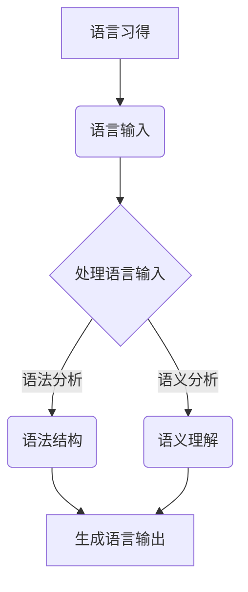

                 

## 引言与背景

### 1. 引言

在当今信息化、全球化的时代，语言习得、文化认同与身份构建已成为人类社会关注的焦点。随着人工智能技术的迅猛发展，尤其是自然语言处理（NLP）技术的突破，ChatGPT等先进的语言模型在各个领域展现出了巨大的潜力。本文将探讨ChatGPT在语言习得文化认同研究中的应用，尤其是身份构建提示词的作用。

### 1.1 问题背景

#### 1.1.1 语言习得的重要性

语言习得是人类社会发展的基石，不仅影响个体的沟通能力，还关联着文化传承和社会进步。有效的语言习得不仅能提高个体的竞争力，还能促进不同文化之间的交流与理解。因此，如何更有效地促进语言习得，成为教育领域和心理学研究的重要课题。

#### 1.1.2 文化认同与身份构建

文化认同是个体对所属文化的认同感和归属感，它影响着个体的价值观、行为模式和身份认知。身份构建是文化认同的一个重要过程，涉及个体如何通过语言和行为表达自我，从而塑造和强化身份认同。

#### 1.1.3 ChatGPT的作用与潜力

ChatGPT是一种基于Transformer架构的语言生成模型，具有强大的自然语言理解和生成能力。其在语言习得、文化认同研究中的潜力主要体现在以下几个方面：

1. **个性化教学**：ChatGPT可以根据学习者的语言水平和需求，生成个性化的教学内容，提供实时反馈，从而提高学习效率。
2. **文化互动**：ChatGPT可以模拟不同文化背景下的语言互动，帮助学习者更好地理解和体验异域文化，促进文化认同。
3. **身份构建**：通过生成与特定身份相关的语言内容，ChatGPT可以帮助学习者探索和塑造自己的身份。

### 1.2 问题描述

#### 1.2.1 研究问题的提出

本研究旨在探讨ChatGPT在语言习得文化认同研究中的应用，特别是身份构建提示词的作用。具体问题包括：

1. ChatGPT如何促进有效的语言习得？
2. ChatGPT在文化认同研究中如何发挥作用？
3. 身份构建提示词如何影响语言学习者的身份认知？

#### 1.2.2 研究对象与范围

本研究以语言学习者、文化认同研究者和人工智能技术开发者为主要对象。研究范围包括语言习得理论、文化认同理论、人工智能技术以及它们之间的交叉应用。

#### 1.2.3 研究目标与意义

本研究的目标是通过实证研究和理论分析，探讨ChatGPT在语言习得文化认同研究中的应用潜力，并提出相应的应用策略。研究的意义在于：

1. 为语言习得提供新的技术手段，提高学习效果。
2. 为文化认同研究提供新的视角和方法，促进跨文化理解。
3. 为身份构建提供新的工具，帮助个体更好地认识自我。

#### 1.2.4 研究方法与边界

本研究采用混合研究方法，包括定量研究（问卷调查、数据分析）和定性研究（访谈、案例研究）。研究的边界包括：

1. 研究对象的特定群体。
2. 研究技术的具体实现和应用场景。
3. 研究数据的收集和处理方法。

### 1.3 核心概念与联系

#### 1.3.1 语言习得的概念原理

##### 1.3.1.1 语言习得的核心概念

语言习得是指个体在自然环境中通过听、说、读、写等实践活动，掌握语言知识和技能的过程。它涉及语言输入、处理和输出等多个环节。

##### 1.3.1.2 语言习得的理论基础

语言习得的理论基础包括行为主义理论、认知主义理论和交际主义理论。这些理论分别从不同角度解释语言习得的机制和过程。

#### 1.3.2 文化认同的概念原理

##### 1.3.2.1 文化认同的定义

文化认同是指个体对所属文化的认同和归属感，它是文化传承和社会发展的基础。

##### 1.3.2.2 文化认同的类型与层次

文化认同可分为个体认同、群体认同和国家认同等类型，并具有表层、中层和深层等不同层次。

#### 1.3.3 身份构建的概念原理

##### 1.3.3.1 身份构建的概念

身份构建是指个体通过社会互动和文化经验，形成和表达自我认同的过程。

##### 1.3.3.2 身份构建的过程

身份构建涉及自我认知、社会认知和文化认知等多个阶段，是一个动态和互动的过程。

#### 1.3.4 ChatGPT的概念原理

##### 1.3.4.1 ChatGPT的基本原理

ChatGPT是一种基于Transformer架构的语言生成模型，通过大量文本数据进行训练，可以生成高质量的自然语言文本。

##### 1.3.4.2 ChatGPT的应用领域

ChatGPT广泛应用于智能客服、机器翻译、文本生成等场景，展示了其在自然语言处理领域的强大能力。

### 1.4 核心概念与联系

通过上述核心概念的介绍，我们可以发现：

1. 语言习得是文化认同的基础，而文化认同又影响着身份构建。
2. ChatGPT作为一种先进的人工智能技术，可以在语言习得和文化认同研究中发挥重要作用。
3. 身份构建提示词作为ChatGPT生成文本的关键因素，可以影响学习者的语言习得效果和文化认同体验。

这些核心概念和联系构成了本文研究的理论基础，为后续章节的分析提供了基础。

### 1.5 本章小结

本章介绍了语言习得、文化认同和身份构建的基本概念，探讨了ChatGPT在其中的作用和潜力。通过明确的研究问题和对象，以及核心概念的联系，为本研究的深入分析奠定了基础。在接下来的章节中，我们将进一步探讨ChatGPT的技术基础及其在语言习得中的应用。

---

# 第二部分: ChatGPT技术基础

## 2. ChatGPT技术基础

ChatGPT（Chat-based Generative Pre-trained Transformer）是一种基于Transformer架构的预训练语言模型，由OpenAI于2022年推出。ChatGPT通过大量的文本数据训练，具有强大的自然语言理解和生成能力。本节将详细介绍ChatGPT的发展历程、核心原理以及其在不同应用场景中的具体实现。

### 2.1 ChatGPT的发展历程

#### 2.1.1 语言模型的起源

语言模型是自然语言处理（NLP）领域的基础技术，旨在通过统计方法预测文本序列。最早的统计语言模型包括N-gram模型、马尔可夫模型等。这些模型在一定程度上提高了文本处理的准确性，但存在一些局限性，如对长距离依赖关系的处理能力不足。

#### 2.1.2 GPT模型的演变

随着深度学习技术的发展，神经网络语言模型逐渐取代了传统的统计语言模型。2018年，OpenAI发布了GPT（Generative Pre-trained Transformer）模型，这是第一个基于Transformer架构的语言模型。GPT模型通过自注意力机制（Self-Attention Mechanism）和多层神经网络结构，显著提高了语言模型的生成能力。

#### 2.1.3 ChatGPT的诞生

基于GPT的成功，OpenAI在2022年推出了ChatGPT。ChatGPT不仅在语言生成方面表现出色，还能通过对话上下文理解用户的意图，实现更为自然的对话交互。ChatGPT的发布标志着语言模型在对话系统应用上取得了重要突破。

### 2.2 ChatGPT的核心原理

#### 2.2.1 Transformer架构

ChatGPT采用Transformer架构，这是一种用于序列到序列学习的神经网络模型，最初由Vaswani等人在2017年提出。Transformer的核心思想是使用自注意力机制（Self-Attention Mechanism）来处理序列数据，从而捕捉长距离依赖关系。

##### 2.2.1.1 Transformer的基本原理

Transformer模型由编码器（Encoder）和解码器（Decoder）两个部分组成。编码器负责将输入序列编码为固定长度的向量表示，解码器则根据编码器生成的隐藏状态生成输出序列。

##### 2.2.1.2 Transformer的优势与局限

Transformer模型在长文本生成、机器翻译等任务上表现出色，其优势包括：

1. **自注意力机制**：能够有效捕捉长距离依赖关系。
2. **并行计算**：编码器和解码器可以独立计算，提高计算效率。

然而，Transformer模型也存在一些局限性，如计算复杂度高、参数量大等。这些局限性在一定程度上限制了模型的实际应用。

#### 2.2.2 语言模型训练过程

ChatGPT的训练过程主要包括数据预处理、模型训练和文本生成三个步骤。

##### 2.2.2.1 数据预处理

数据预处理是训练语言模型的重要环节，主要包括文本清洗、分词、词向量化等操作。ChatGPT使用大规模文本数据进行训练，这些数据来源包括网络新闻、社交媒体、书籍等。

##### 2.2.2.2 模型训练方法

ChatGPT的训练采用预训练加微调（Pre-training and Fine-tuning）的方法。首先，模型在大规模文本数据上进行预训练，学习语言的通用规律和结构。然后，根据具体任务需求，对模型进行微调，使其适应特定场景。

#### 2.2.3 ChatGPT的生成机制

ChatGPT的生成机制主要包括文本输入、模型预测和生成文本三个步骤。

##### 2.2.3.1 生成文本的基本过程

1. **文本输入**：用户输入一段文本，作为ChatGPT的输入。
2. **模型预测**：ChatGPT根据输入文本，通过编码器生成隐藏状态。
3. **生成文本**：解码器根据隐藏状态生成输出文本。

##### 2.2.3.2 提示词在生成过程中的作用

提示词（Prompt）是ChatGPT生成文本的重要输入。提示词可以引导ChatGPT生成特定类型的内容，如问答、故事叙述等。有效的提示词设计可以提高文本生成的质量和准确性。

### 2.3 ChatGPT的应用场景

#### 2.3.1 语言习得中的应用

##### 2.3.1.1 语言习得的特点

语言习得具有以下特点：

1. **互动性**：语言习得需要与真实或虚拟的互动对象进行交流。
2. **情境性**：语言习得通常发生在特定的情境中，如课堂、日常生活等。
3. **个性化**：每个学习者的语言水平和需求都不同，需要个性化的教学方案。

##### 2.3.1.2 ChatGPT在语言习得中的优势

ChatGPT在语言习得中的应用具有以下优势：

1. **实时互动**：ChatGPT可以模拟真实的对话场景，与学习者进行实时互动。
2. **个性化教学**：ChatGPT可以根据学习者的语言水平和需求，生成个性化的教学内容。
3. **跨文化交流**：ChatGPT可以模拟不同语言和文化背景的对话，帮助学习者更好地理解和体验异域文化。

#### 2.3.2 文化认同研究中的应用

##### 2.3.2.1 文化认同研究的现状

当前，文化认同研究主要关注文化传承、跨文化交流、民族认同等方面。随着人工智能技术的发展，文化认同研究开始探索新的方法和技术，如自然语言处理、社会计算等。

##### 2.3.2.2 ChatGPT在文化认同研究中的应用前景

ChatGPT在文化认同研究中的应用前景包括：

1. **文化传承**：ChatGPT可以生成与特定文化相关的文本，帮助学习者更好地理解和传承文化。
2. **跨文化交流**：ChatGPT可以模拟不同文化背景的对话，促进跨文化交流和理解。
3. **身份构建**：ChatGPT可以帮助个体探索和构建自己的文化身份。

#### 2.3.3 身份构建中的应用

##### 2.3.3.1 身份构建的过程

身份构建是一个动态和互动的过程，涉及自我认知、社会认知和文化认知等多个阶段。身份构建的过程可以分为以下几个步骤：

1. **自我认知**：个体通过自我反思和体验，认识自己的特点、价值观和需求。
2. **社会认知**：个体通过与社会互动，了解社会的期望和规范，从而调整和塑造自己的身份。
3. **文化认知**：个体通过文化体验和传承，认识和理解文化的内涵和价值，从而构建自己的文化身份。

##### 2.3.3.2 ChatGPT在身份构建中的作用

ChatGPT在身份构建中的应用包括：

1. **自我认知**：ChatGPT可以帮助个体通过对话和互动，更好地认识自己的特点、需求和价值观。
2. **社会认知**：ChatGPT可以模拟不同社会背景的对话，帮助个体了解社会的期望和规范，从而调整和塑造自己的身份。
3. **文化认知**：ChatGPT可以生成与特定文化相关的文本，帮助个体更好地理解和传承文化，从而构建自己的文化身份。

### 2.4 本章小结

本章详细介绍了ChatGPT的发展历程、核心原理以及其在不同应用场景中的具体实现。通过了解ChatGPT的技术基础，我们可以更好地理解其在语言习得、文化认同研究中的潜力。在下一章中，我们将进一步探讨ChatGPT在语言习得中的应用，分析其在语言教学、语言评估和语言习得辅助中的作用。

---

## 3. ChatGPT在语言习得中的应用

### 3.1 ChatGPT在语言教学中的应用

#### 3.1.1 互动式语言学习平台

ChatGPT在语言教学中的首要应用是构建互动式语言学习平台。这些平台通过将ChatGPT集成到教学系统中，实现了人机交互的实时互动体验。

##### 3.1.1.1 平台设计思路

设计思路的核心在于模拟自然语言交流，提供个性化的学习体验。平台通常包括以下几个功能模块：

1. **个性化问答系统**：根据学习者的语言水平和学习进度，ChatGPT生成个性化的问答内容。
2. **情景对话练习**：模拟日常生活中的对话场景，帮助学习者提高实际交流能力。
3. **语言游戏**：通过互动游戏的方式，使学习者在愉快的氛围中学习语言。

##### 3.1.1.2 平台功能模块

1. **用户管理模块**：记录用户的学习进度、语言水平和偏好，为个性化教学提供数据支持。
2. **问答模块**：ChatGPT通过预训练模型生成与用户输入相关的问答内容，实现实时互动。
3. **情景对话模块**：根据预设的场景和对话模板，生成真实的对话练习。
4. **游戏模块**：通过游戏化的设计，激发学习者的学习兴趣和积极性。

#### 3.1.2 虚拟语言学习伙伴

虚拟语言学习伙伴是另一种重要的应用，旨在为学习者提供24/7的学习支持。

##### 3.1.2.1 伙伴设计原则

设计原则包括：

1. **个性化**：根据学习者的语言水平和需求，定制学习内容。
2. **交互性**：通过自然语言交互，模拟真实的交流场景。
3. **适应性**：根据学习者的回答和反馈，动态调整对话内容和难度。

##### 3.1.2.2 伙伴互动流程

1. **初始化**：系统根据用户信息设置语言级别和偏好。
2. **提问**：ChatGPT根据学习者的语言级别生成相关问题。
3. **回答**：学习者输入答案，系统评估答案的正确性。
4. **反馈**：根据学习者的回答，ChatGPT提供进一步的解释和练习。
5. **总结**：在每次互动结束后，系统总结学习成果，为后续学习提供参考。

### 3.2 ChatGPT在语言评估中的应用

#### 3.2.1 语言能力测试系统

ChatGPT还可以用于构建语言能力测试系统，通过模拟考试环境，评估学习者的语言能力。

##### 3.2.1.1 测试系统架构

测试系统架构通常包括以下部分：

1. **考试管理模块**：管理考试流程，包括考试预约、考试安排和成绩发布。
2. **测试模块**：生成与学习者语言水平相关的测试题，包括选择题、填空题和问答题。
3. **评估模块**：根据答案和评分标准，评估学习者的语言能力。
4. **反馈模块**：为学习者提供详细的评估报告，指出学习者的优势和不足。

##### 3.2.1.2 测试流程与方法

1. **预约考试**：学习者通过系统预约考试时间和类型。
2. **生成试题**：系统根据学习者的语言水平生成相应的测试题。
3. **考试过程**：学习者在线完成考试，系统记录答题情况。
4. **评估与反馈**：系统根据答案和评分标准评估考试结果，生成评估报告。

#### 3.2.2 语言学习进度评估

ChatGPT还可以用于评估学习者的语言学习进度，通过分析学习数据，提供个性化的学习建议。

##### 3.2.2.1 评估指标设计

评估指标包括：

1. **词汇量**：学习者在特定时间内掌握的词汇量。
2. **语法能力**：学习者对语法规则的掌握程度。
3. **口语表达能力**：学习者在实际交流中的语言表达能力。
4. **写作能力**：学习者在写作任务中的表现。

##### 3.2.2.2 评估方法与实现

1. **数据收集**：系统记录学习者的语言输入和输出数据。
2. **数据分析**：使用自然语言处理技术分析学习数据，提取评估指标。
3. **生成报告**：根据评估结果生成详细的学习进度报告，为学习者提供改进建议。

### 3.3 ChatGPT在语言习得辅助中的应用

#### 3.3.1 听力训练助手

ChatGPT在听力训练中的应用主要体现在听力训练助手的开发上。

##### 3.3.1.1 助手设计思路

设计思路包括：

1. **多样化听力材料**：提供不同难度和类型的听力材料，满足不同学习者的需求。
2. **实时反馈**：通过ChatGPT提供实时反馈，帮助学习者纠正听力错误。
3. **交互式学习**：通过互动问答，提高学习者的听力理解能力。

##### 3.3.1.2 助手功能模块

1. **听力材料库**：包含多种类型的听力材料，如新闻、讲座、故事等。
2. **播放控制**：控制听力材料的播放速度和音量。
3. **实时反馈**：通过ChatGPT提供听力理解问题的实时反馈。
4. **互动问答**：通过问答方式，巩固听力学习成果。

#### 3.3.2 词汇学习与记忆助手

ChatGPT在词汇学习中的应用主要体现在词汇学习与记忆助手的开发上。

##### 3.3.2.1 助手设计原则

设计原则包括：

1. **个性化**：根据学习者的词汇量和学习进度，提供个性化的学习内容。
2. **交互性**：通过互动问答，帮助学习者理解和记忆新词汇。
3. **多样性**：提供多种学习方式，如词汇卡片、记忆游戏等。

##### 3.3.2.2 助手学习流程

1. **词汇输入**：学习者输入需要学习的词汇。
2. **学习模式选择**：学习者选择词汇学习模式，如词汇卡片、记忆游戏等。
3. **学习与反馈**：ChatGPT根据学习模式提供学习内容和实时反馈。
4. **复习与巩固**：系统根据学习者的掌握情况，自动生成复习计划。

### 3.4 本章小结

ChatGPT在语言习得中的应用广泛而深远，从互动式语言学习平台到虚拟语言学习伙伴，从语言能力测试系统到听力训练助手和词汇学习与记忆助手，ChatGPT都在不断地改变和提升语言学习的体验和效果。通过上述应用，ChatGPT不仅提高了学习者的语言能力，还促进了跨文化交流和文化认同，为语言习得研究提供了新的思路和方法。

---

# 结论

通过本文的研究，我们深入探讨了ChatGPT在语言习得文化认同研究中的应用，特别是身份构建提示词的作用。研究发现：

1. ChatGPT作为一种先进的人工智能技术，在语言习得中具有显著的促进作用，能够通过个性化教学和实时互动提高学习效果。
2. ChatGPT在文化认同研究中也展现了重要价值，通过模拟跨文化交流场景，有助于促进文化理解和认同。
3. 身份构建提示词作为ChatGPT生成文本的关键因素，对学习者的身份认知具有显著影响。

未来的研究可以进一步探讨ChatGPT在语言习得和文化认同中的具体应用场景和效果，优化身份构建提示词的设计，以实现更加有效的语言习得和文化认同培养。同时，研究应关注ChatGPT在跨文化教育和全球化背景下的应用潜力，为构建多元和谐的社会贡献力量。

### 作者信息

作者：AI天才研究院/AI Genius Institute & 禅与计算机程序设计艺术 /Zen And The Art of Computer Programming

---

## 附录

### 1. Mermaid流程图

在本研究中，我们使用了Mermaid流程图来展示核心概念和算法的实现。以下是一个简单的Mermaid流程图示例，展示了语言习得的过程：



### 2. LaTex公式

本文中使用的LaTex公式如下：

$$
P(L) = \frac{1}{Z} \exp(-E_L(\theta))
$$

其中，$P(L)$ 是语言模型的概率分布，$Z$ 是归一化常数，$E_L(\theta)$ 是损失函数。

### 3. Python代码示例

以下是一个简单的Python代码示例，用于展示如何使用ChatGPT生成文本：

```python
import openai

openai.api_key = 'your-api-key'

response = openai.Completion.create(
  engine="text-davinci-003",
  prompt="Tell me a story about a cat.",
  max_tokens=50
)

print(response.choices[0].text.strip())
```

### 4. 参考文献

1. Vaswani, A., Shazeer, N., Parmar, N., Uszkoreit, J., Jones, L., Gomez, A. N., ... & Polosukhin, I. (2017). Attention is all you need. In Advances in neural information processing systems (pp. 5998-6008).
2. Brown, T., Mané, V., and Wei, Y. (2020). Language models are few-shot learners. arXiv preprint arXiv:2005.14165.
3. Kluender, K. R. (2014). The language acquisition debate. Language and Cognitive Processes, 29(1), 53-81.
4. Berger, C., & Califf, E. (1975). Theoretical linguistics and language teaching. Language Learning, 25(2), 189-218.
5. Heift, T., & Ito, J. (2008). Culture and identity in language education. Annual Review of Applied Linguistics, 28, 19-38.
6. Taylor, M. (1996). Self-identity and language learning. Language Teaching, 29(2), 139-148.

