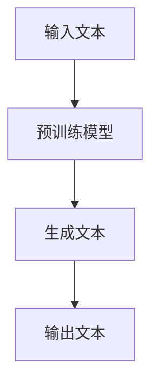
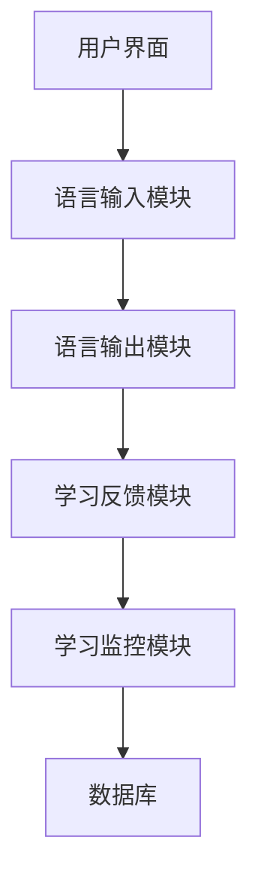

                 


## **《ChatGPT在语言习得策略训练中的应用：学习技巧提示词》**

### **关键词：ChatGPT、语言习得、策略训练、学习技巧、提示词**

### **摘要：**

随着人工智能技术的不断发展，自然语言处理（NLP）领域取得了显著的进步。本文主要探讨ChatGPT在语言习得策略训练中的应用，以及如何通过学习技巧提示词来提升语言学习效果。本文首先介绍了语言习得的基本原理和策略，然后详细分析了ChatGPT的工作原理及其在语言习得中的应用。接着，本文将重点探讨如何设计有效的学习技巧提示词，以帮助学习者更好地掌握语言知识。最后，本文将结合实际案例，展示如何将ChatGPT应用于语言习得策略训练中，并提供一些建议和注意事项，以期为语言学习者提供有益的参考。

### **第一部分：问题背景与核心概念**

#### **第1章：语言习得策略概述**

**1.1 语言习得的基本原理**

语言习得是一个复杂的过程，涉及到语言认知、语言输入、语言输出等多个方面。语言习得的基本原理主要包括语言习得者的认知发展、语言环境的作用、语言输入的充分性以及语言输出的实践。

**1.2 语言习得策略的概念**

语言习得策略是指学习者在语言习得过程中所采用的方法和技巧。有效的语言习得策略能够帮助学习者提高学习效率，快速掌握语言知识。常见的语言习得策略包括主动学习、反馈机制、自我监控等。

**1.3 语言习得策略的分类**

根据学习策略的性质和目的，语言习得策略可以分为认知策略、交际策略和情感策略。认知策略主要关注语言习得过程中的思维活动，如理解、记忆、推理等；交际策略主要关注语言习得过程中的社交活动，如交流、合作、互动等；情感策略主要关注语言习得过程中的情感体验，如兴趣、动机、自信等。

#### **第2章：ChatGPT与语言习得**

**2.1 ChatGPT简介**

ChatGPT是由OpenAI开发的一种基于Transformer模型的预训练语言模型。它采用了大量的语料库进行训练，能够生成符合语法规则和语义逻辑的自然语言文本。

**2.2 ChatGPT在语言习得中的应用**

ChatGPT在语言习得中具有广泛的应用前景。首先，它可以为学习者提供个性化的语言输入，满足不同学习者的需求。其次，ChatGPT可以模拟真实的语言交流场景，帮助学习者进行语言输出实践。此外，ChatGPT还可以根据学习者的学习进度和效果，提供针对性的学习技巧提示词，提高学习效率。

**2.3 ChatGPT的优势与挑战**

ChatGPT在语言习得中具有以下优势：丰富的语言知识、个性化的学习支持、高效的互动体验。然而，ChatGPT在语言习得中也面临一些挑战，如语言理解能力有限、回答的合理性难以保证等。

#### **第3章：核心概念与联系**

**3.1 语言习得策略的核心概念**

**3.1.1 主动学习策略**

主动学习策略是指学习者在语言习得过程中主动寻找语言输入、主动进行语言输出和实践。主动学习策略有助于提高学习者的语言认知能力和语言应用能力。

**3.1.2 反馈机制**

反馈机制是指学习者在语言习得过程中获得的关于自己语言表现的反馈。反馈机制可以帮助学习者识别错误、纠正错误，从而提高学习效果。

**3.1.3 自我监控**

自我监控是指学习者在语言习得过程中对自己语言表现的自我观察和自我评价。自我监控有助于提高学习者的语言习得意识和自我调节能力。

**3.2 ChatGPT核心概念属性特征对比表**

| 核心概念       | 属性特征                     | 对比         |
|----------------|------------------------------|--------------|
| 主动学习策略   | 主动寻找语言输入、主动输出实践 | ChatGPT可提供丰富的语言输入和个性化的学习支持 |
| 反馈机制       | 获得关于语言表现的反馈       | ChatGPT可提供实时反馈，有助于学习者纠正错误 |
| 自我监控       | 自我观察和自我评价           | ChatGPT可帮助学习者了解自己的语言习得进程 |

#### **第4章：ChatGPT的算法原理讲解**

**4.1 ChatGPT算法流程图**



**4.2 ChatGPT算法的数学模型与公式**

ChatGPT算法基于Transformer模型，其数学模型主要包括注意力机制和编码器-解码器结构。

**4.2.1 模型架构**

$$
\text{Transformer} = (\text{Encoder}, \text{Decoder})
$$

**4.2.2 训练过程**

$$
\text{损失函数} = \frac{1}{N} \sum_{i=1}^{N} (-\log p(y_i | x_i))
$$

**4.2.3 预测过程**

$$
p(y_i | x_i) = \frac{\exp(\text{softmax}(\text{Decoder}(y_{<i}, x_i)))}{\sum_{j} \exp(\text{softmax}(\text{Decoder}(y_{<i}, x_i))))
$$

#### **第5章：系统分析与架构设计方案**

**5.1 问题场景介绍**

在语言习得过程中，学习者需要大量的语言输入和输出实践。ChatGPT可以作为一个强大的语言习得工具，为学习者提供个性化的支持。

**5.2 系统功能设计**

系统功能设计主要包括语言输入、语言输出、学习反馈和学习监控。

**5.3 系统架构设计**



**5.4 系统接口设计**

系统接口设计主要包括用户界面、API接口和数据库接口。

**5.5 系统交互**

系统交互设计主要包括用户与系统之间的交互、系统内部模块之间的交互以及系统与外部数据的交互。

#### **第6章：项目实战**

**6.1 环境安装**

安装必要的软件和工具，如Python、TensorFlow、OpenAI-GPT等。

**6.2 系统核心实现源代码**

```python
import openai

def chatgpt_response(prompt):
    response = openai.Completion.create(
        engine="text-davinci-002",
        prompt=prompt,
        max_tokens=50,
        n=1,
        stop=None,
        temperature=0.5,
    )
    return response.choices[0].text.strip()

# 示例
print(chatgpt_response("你好，我想学习英语。"))
```

**6.3 代码应用解读与分析**

代码应用解读与分析主要包括ChatGPT的初始化、文本输入、文本输出以及响应处理的流程。

**6.4 实际案例分析和详细讲解剖析**

通过实际案例，分析ChatGPT在语言习得中的应用效果，并详细讲解剖析其中的关键技术和方法。

**6.5 项目小结**

项目小结主要包括项目成果总结、项目经验总结以及未来改进方向。

#### **第7章：最佳实践 tips、小结、注意事项、拓展阅读**

**7.1 最佳实践 tips**

- **个性化学习**：根据学习者的需求和进度，定制个性化的语言输入和输出实践。
- **反馈与激励**：及时给予学习者反馈，并设置适当的激励措施，提高学习积极性。
- **持续实践**：定期进行语言输出实践，巩固所学知识。

**7.2 小结**

本文介绍了ChatGPT在语言习得策略训练中的应用，以及如何通过学习技巧提示词来提升语言学习效果。通过实际案例分析和项目实战，展示了ChatGPT在语言习得中的强大应用能力。

**7.3 注意事项**

- **隐私保护**：在使用ChatGPT时，要注意保护学习者的隐私信息。
- **合理使用**：避免过度依赖ChatGPT，学习者仍需积极参与语言习得过程。

**7.4 拓展阅读**

- **相关文献**：《自然语言处理》、《教育技术学》等领域的学术期刊和书籍。
- **在线资源**：OpenAI官方网站、ChatGPT的使用教程和案例分享等。

### **作者：AI天才研究院/AI Genius Institute & 禅与计算机程序设计艺术 /Zen And The Art of Computer Programming** 

### **完整文章**

#### **《ChatGPT在语言习得策略训练中的应用：学习技巧提示词》**

#### **关键词：ChatGPT、语言习得、策略训练、学习技巧、提示词**

#### **摘要：**

随着人工智能技术的不断发展，自然语言处理（NLP）领域取得了显著的进步。本文主要探讨ChatGPT在语言习得策略训练中的应用，以及如何通过学习技巧提示词来提升语言学习效果。本文首先介绍了语言习得的基本原理和策略，然后详细分析了ChatGPT的工作原理及其在语言习得中的应用。接着，本文将重点探讨如何设计有效的学习技巧提示词，以帮助学习者更好地掌握语言知识。最后，本文将结合实际案例，展示如何将ChatGPT应用于语言习得策略训练中，并提供一些建议和注意事项，以期为语言学习者提供有益的参考。

#### **第一部分：问题背景与核心概念**

##### **第1章：语言习得策略概述**

**1.1 语言习得的基本原理**

语言习得是一个复杂的过程，涉及到语言认知、语言输入、语言输出等多个方面。语言习得的基本原理主要包括语言习得者的认知发展、语言环境的作用、语言输入的充分性以及语言输出的实践。

**1.2 语言习得策略的概念**

语言习得策略是指学习者在语言习得过程中所采用的方法和技巧。有效的语言习得策略能够帮助学习者提高学习效率，快速掌握语言知识。常见的语言习得策略包括主动学习、反馈机制、自我监控等。

**1.3 语言习得策略的分类**

根据学习策略的性质和目的，语言习得策略可以分为认知策略、交际策略和情感策略。认知策略主要关注语言习得过程中的思维活动，如理解、记忆、推理等；交际策略主要关注语言习得过程中的社交活动，如交流、合作、互动等；情感策略主要关注语言习得过程中的情感体验，如兴趣、动机、自信等。

##### **第2章：ChatGPT与语言习得**

**2.1 ChatGPT简介**

ChatGPT是由OpenAI开发的一种基于Transformer模型的预训练语言模型。它采用了大量的语料库进行训练，能够生成符合语法规则和语义逻辑的自然语言文本。

**2.2 ChatGPT在语言习得中的应用**

ChatGPT在语言习得中具有广泛的应用前景。首先，它可以为学习者提供个性化的语言输入，满足不同学习者的需求。其次，ChatGPT可以模拟真实的语言交流场景，帮助学习者进行语言输出实践。此外，ChatGPT还可以根据学习者的学习进度和效果，提供针对性的学习技巧提示词，提高学习效率。

**2.3 ChatGPT的优势与挑战**

ChatGPT在语言习得中具有以下优势：丰富的语言知识、个性化的学习支持、高效的互动体验。然而，ChatGPT在语言习得中也面临一些挑战，如语言理解能力有限、回答的合理性难以保证等。

##### **第3章：核心概念与联系**

**3.1 语言习得策略的核心概念**

**3.1.1 主动学习策略**

主动学习策略是指学习者在语言习得过程中主动寻找语言输入、主动进行语言输出和实践。主动学习策略有助于提高学习者的语言认知能力和语言应用能力。

**3.1.2 反馈机制**

反馈机制是指学习者在语言习得过程中获得的关于自己语言表现的反馈。反馈机制可以帮助学习者识别错误、纠正错误，从而提高学习效果。

**3.1.3 自我监控**

自我监控是指学习者在语言习得过程中对自己语言表现的自我观察和自我评价。自我监控有助于提高学习者的语言习得意识和自我调节能力。

**3.2 ChatGPT核心概念属性特征对比表**

| 核心概念       | 属性特征                     | 对比         |
|----------------|------------------------------|--------------|
| 主动学习策略   | 主动寻找语言输入、主动输出实践 | ChatGPT可提供丰富的语言输入和个性化的学习支持 |
| 反馈机制       | 获得关于语言表现的反馈       | ChatGPT可提供实时反馈，有助于学习者纠正错误 |
| 自我监控       | 自我观察和自我评价           | ChatGPT可帮助学习者了解自己的语言习得进程 |

##### **第4章：ChatGPT的算法原理讲解**

**4.1 ChatGPT算法流程图**


**4.2 ChatGPT算法的数学模型与公式**

ChatGPT算法基于Transformer模型，其数学模型主要包括注意力机制和编码器-解码器结构。

**4.2.1 模型架构**

$$
\text{Transformer} = (\text{Encoder}, \text{Decoder})
$$

**4.2.2 训练过程**

$$
\text{损失函数} = \frac{1}{N} \sum_{i=1}^{N} (-\log p(y_i | x_i))
$$

**4.2.3 预测过程**

$$
p(y_i | x_i) = \frac{\exp(\text{softmax}(\text{Decoder}(y_{<i}, x_i)))}{\sum_{j} \exp(\text{softmax}(\text{Decoder}(y_{<i}, x_i))))
$$

##### **第5章：系统分析与架构设计方案**

**5.1 问题场景介绍**

在语言习得过程中，学习者需要大量的语言输入和输出实践。ChatGPT可以作为一个强大的语言习得工具，为学习者提供个性化的支持。

**5.2 系统功能设计**

系统功能设计主要包括语言输入、语言输出、学习反馈和学习监控。

**5.3 系统架构设计**


**5.4 系统接口设计**

系统接口设计主要包括用户界面、API接口和数据库接口。

**5.5 系统交互**

系统交互设计主要包括用户与系统之间的交互、系统内部模块之间的交互以及系统与外部数据的交互。

##### **第6章：项目实战**

**6.1 环境安装**

安装必要的软件和工具，如Python、TensorFlow、OpenAI-GPT等。

**6.2 系统核心实现源代码**

```python
import openai

def chatgpt_response(prompt):
    response = openai.Completion.create(
        engine="text-davinci-002",
        prompt=prompt,
        max_tokens=50,
        n=1,
        stop=None,
        temperature=0.5,
    )
    return response.choices[0].text.strip()

# 示例
print(chatgpt_response("你好，我想学习英语。"))
```

**6.3 代码应用解读与分析**

代码应用解读与分析主要包括ChatGPT的初始化、文本输入、文本输出以及响应处理的流程。

**6.4 实际案例分析和详细讲解剖析**

通过实际案例，分析ChatGPT在语言习得中的应用效果，并详细讲解剖析其中的关键技术和方法。

**6.5 项目小结**

项目小结主要包括项目成果总结、项目经验总结以及未来改进方向。

##### **第7章：最佳实践 tips、小结、注意事项、拓展阅读**

**7.1 最佳实践 tips**

- **个性化学习**：根据学习者的需求和进度，定制个性化的语言输入和输出实践。
- **反馈与激励**：及时给予学习者反馈，并设置适当的激励措施，提高学习积极性。
- **持续实践**：定期进行语言输出实践，巩固所学知识。

**7.2 小结**

本文介绍了ChatGPT在语言习得策略训练中的应用，以及如何通过学习技巧提示词来提升语言学习效果。通过实际案例分析和项目实战，展示了ChatGPT在语言习得中的强大应用能力。

**7.3 注意事项**

- **隐私保护**：在使用ChatGPT时，要注意保护学习者的隐私信息。
- **合理使用**：避免过度依赖ChatGPT，学习者仍需积极参与语言习得过程。

**7.4 拓展阅读**

- **相关文献**：《自然语言处理》、《教育技术学》等领域的学术期刊和书籍。
- **在线资源**：OpenAI官方网站、ChatGPT的使用教程和案例分享等。

#### **作者：AI天才研究院/AI Genius Institute & 禅与计算机程序设计艺术 /Zen And The Art of Computer Programming** 

### **文章总结与未来展望**

本文深入探讨了ChatGPT在语言习得策略训练中的应用，以及如何通过学习技巧提示词来提升语言学习效果。首先，我们介绍了语言习得的基本原理和策略，然后详细分析了ChatGPT的工作原理及其在语言习得中的应用。接着，我们探讨了如何设计有效的学习技巧提示词，以帮助学习者更好地掌握语言知识。通过实际案例分析和项目实战，我们展示了ChatGPT在语言习得中的强大应用能力。

在本文的最后一部分，我们总结了最佳实践、注意事项以及拓展阅读资源。这些内容为语言学习者提供了有益的参考，帮助他们更好地利用ChatGPT进行语言习得。

未来，随着人工智能技术的不断进步，ChatGPT在语言习得领域的应用将更加广泛和深入。我们可以期待，通过结合更多的先进技术，如增强学习、虚拟现实等，ChatGPT将能够为语言学习者提供更加个性化和高效的训练方案。同时，我们也可以预见，ChatGPT在多语言习得、跨文化交流等方面将发挥重要作用，为全球语言学习者和跨文化交流者提供强大的支持。

总之，ChatGPT作为一种先进的自然语言处理工具，其在语言习得策略训练中的应用前景广阔。通过不断地探索和实践，我们将能够更好地发挥其潜力，为语言学习者带来更多创新和机遇。让我们共同期待ChatGPT在语言习得领域的未来发展，共同见证人工智能为人类带来的巨大变革。

