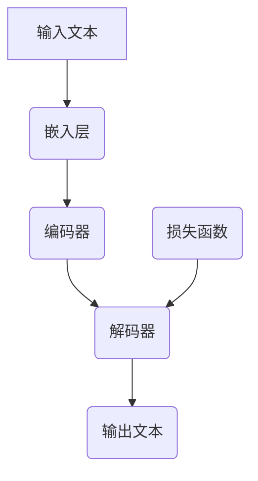
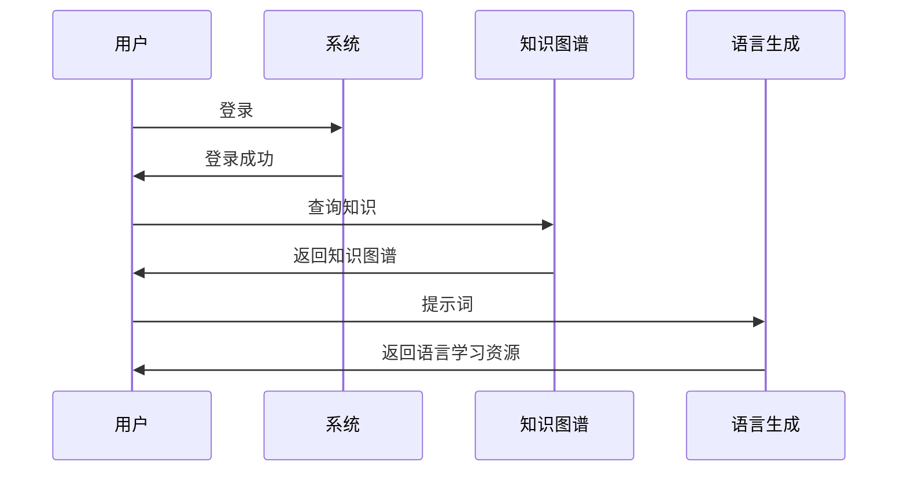

                 

## **《ChatGPT在语言习得跨学科整合中的应用：知识图谱构建提示词》**

### **关键词：ChatGPT、语言习得、跨学科整合、知识图谱、提示词**

### **摘要：**

本文探讨了如何利用ChatGPT这一强大的语言模型，在语言习得跨学科整合中构建知识图谱和设计提示词。通过一步步的分析和推理，我们揭示了ChatGPT在语言习得中的应用潜力，阐述了知识图谱构建和提示词设计的核心原理，为语言学习提供了新的视角和工具。

## **背景介绍**

### **1.1 问题背景**

在当今信息化时代，语言习得已经不再是单纯的学习语音、词汇和语法规则，而是涉及到跨学科知识的整合和综合应用。传统的语言学习方法往往局限于某一学科领域，缺乏跨学科的视角，难以满足现代社会对语言学习的高要求。如何将不同学科的知识有机地整合起来，为语言习得提供有效的支持，成为了亟待解决的问题。

### **1.2 问题描述**

在语言习得过程中，学生需要掌握大量的词汇、语法规则和语境知识，而这些知识往往分布在不同的学科领域，如文学、历史、科学等。如何有效地整合这些知识，使其在语言习得过程中发挥最大的作用，是一个复杂而具有挑战性的问题。同时，如何为学生提供个性化的语言学习资源，提高学习效率和效果，也是当前语言习得研究的一个热点问题。

### **1.3 问题解决**

为了解决上述问题，本文提出了一种基于ChatGPT的语言习得跨学科整合方法，主要包括以下三个方面：

1. **构建知识图谱**：通过分析不同学科领域的知识，构建一个覆盖广泛、结构清晰的知识图谱，为语言习得提供丰富的知识资源。
2. **设计提示词**：根据知识图谱，设计一系列具有引导性和启发性的提示词，引导学生进行有效的语言学习。
3. **利用ChatGPT进行语言生成**：通过ChatGPT这一强大的语言模型，根据提示词生成个性化的语言学习资源，为学生提供多样化的学习体验。

### **1.4 边界与外延**

本文的研究主要聚焦于如何利用ChatGPT构建知识图谱和设计提示词，以提升语言习得的效率和效果。然而，知识图谱的构建和提示词的设计不仅仅局限于语言习得领域，还可以应用于其他领域，如教育、医疗、科研等。因此，本文的研究具有一定的外延性和推广价值。

### **1.5 概念结构与核心要素组成**

在本文中，核心概念包括ChatGPT、知识图谱、提示词和语言习得。这四个概念相互关联，构成了一个完整的系统。

- **ChatGPT**：是一种基于深度学习的自然语言处理模型，能够理解和生成自然语言。
- **知识图谱**：是一种用于表示和存储知识的图形结构，能够直观地展示不同领域知识之间的关系。
- **提示词**：是一种用于引导和激发语言学习的词汇或短语。
- **语言习得**：是指通过接触和学习语言材料，逐步掌握语言知识和技能的过程。

这四个概念相互关联，共同构成了本文研究的核心要素。

## **核心概念与联系**

### **2.1 ChatGPT简介**

ChatGPT是一种基于Transformer架构的预训练语言模型，由OpenAI开发。它通过在大量文本数据上进行预训练，学习到了丰富的语言知识和模式，能够生成流畅、自然的文本。ChatGPT具有以下几个特点：

- **预训练**：ChatGPT在大量文本数据上进行预训练，从而学习到了丰富的语言知识和模式。
- **生成能力**：ChatGPT能够根据输入的文本生成连贯、自然的文本。
- **适应性**：ChatGPT可以根据不同的应用场景进行微调，以适应特定的任务。

### **2.2 语言习得理论**

语言习得理论是研究人类如何习得语言的一门学科。根据语言习得理论，人类习得语言的过程可以分为以下几个阶段：

- **感知阶段**：通过听、看等方式感知语言信息。
- **理解阶段**：理解感知到的语言信息，包括词汇、语法和语义等。
- **表达阶段**：运用语言表达自己的思想和感受。

### **2.3 跨学科整合**

跨学科整合是指将不同学科领域的知识进行有机整合，以形成新的知识体系。在语言习得中，跨学科整合的意义在于：

- **丰富知识来源**：通过跨学科整合，学生可以从多个角度理解和掌握语言知识。
- **提高学习效果**：跨学科整合可以激发学生的学习兴趣，提高学习效果。
- **培养综合素质**：跨学科整合有助于培养学生的综合素质，提高其解决实际问题的能力。

### **2.4 知识图谱构建**

知识图谱是一种用于表示和存储知识的图形结构，它将实体、属性和关系以图形的形式展示出来。在知识图谱构建中，主要涉及以下内容：

- **实体识别**：识别文本中的关键实体，如人名、地名、组织机构等。
- **关系抽取**：抽取实体之间的关系，如“属于”、“位于”等。
- **属性提取**：提取实体的属性，如“年龄”、“身高”等。

### **2.5 提示词设计与应用**

提示词是一种用于引导和激发语言学习的词汇或短语。在设计提示词时，需要考虑以下几点：

- **引导性**：提示词应具有明确的引导作用，能够激发学生的思考和表达。
- **启发性**：提示词应具有启发性，能够帮助学生拓展思维，深入理解语言知识。
- **多样性**：提示词应具有多样性，能够满足不同学生的学习需求。

在应用方面，提示词可以用于以下场景：

- **语言学习**：在语言学习过程中，提示词可以引导学生进行有效的语言输入和输出。
- **知识梳理**：在知识梳理过程中，提示词可以帮助学生快速掌握知识要点。
- **问题解决**：在问题解决过程中，提示词可以引导学生进行有效的思考和分析。

## **算法原理讲解**

### **3.1 ChatGPT算法原理**

ChatGPT是一种基于Transformer架构的预训练语言模型。它通过在大量文本数据上进行预训练，学习到了丰富的语言知识和模式。ChatGPT的算法原理主要包括以下几个方面：

1. **嵌入层**：将输入的文本转换为向量表示。
2. **编码器**：对输入的文本向量进行编码，提取文本的语义信息。
3. **解码器**：根据编码器的输出，生成文本的输出序列。
4. **损失函数**：使用损失函数评估模型的输出与真实输出之间的差距，并指导模型进行优化。

### **3.2 知识图谱构建算法**

知识图谱构建算法主要包括以下步骤：

1. **实体识别**：通过命名实体识别技术，识别文本中的关键实体。
2. **关系抽取**：通过关系抽取技术，抽取实体之间的关系。
3. **属性提取**：通过属性抽取技术，提取实体的属性。
4. **图谱构建**：将识别出的实体、关系和属性构成知识图谱。

### **3.3 提示词设计原理**

提示词设计原理主要包括以下几个方面：

1. **引导性**：提示词应具有明确的引导作用，能够激发学生的思考和表达。
2. **启发性**：提示词应具有启发性，能够帮助学生拓展思维，深入理解语言知识。
3. **多样性**：提示词应具有多样性，能够满足不同学生的学习需求。

### **3.4 算法mermaid流程图**



## **数学模型与公式**

### **4.1 数学模型概述**

ChatGPT的数学模型主要包括以下几个方面：

1. **嵌入层**：将输入的文本转换为向量表示，可以使用词向量模型，如Word2Vec或GloVe。
2. **编码器**：对输入的文本向量进行编码，可以使用Transformer模型。
3. **解码器**：根据编码器的输出，生成文本的输出序列，可以使用Transformer模型。
4. **损失函数**：使用损失函数评估模型的输出与真实输出之间的差距，并指导模型进行优化。

### **4.2 算法原理的数学模型**

1. **嵌入层**：

   假设输入的文本为\(x\)，词向量为\(w\)，则输入的文本向量表示为：

   $$h = w \cdot x$$

   其中，\(h\)为文本向量表示，\(w\)为词向量。

2. **编码器**：

   编码器的输入为文本向量\(h\)，输出为编码后的向量表示\(c\)，可以使用Transformer模型进行编码：

   $$c = \text{Transformer}(h)$$

3. **解码器**：

   解码器的输入为编码后的向量\(c\)，输出为解码后的文本向量表示\(y\)，可以使用Transformer模型进行解码：

   $$y = \text{Transformer}(c)$$

4. **损失函数**：

   假设模型的输出为\(y\)，真实输出为\(y'\)，损失函数为：

   $$L = \text{Loss}(y, y')$$

### **4.3 公式讲解**

1. **嵌入层**：

   $$h = w \cdot x$$

   其中，\(h\)为文本向量表示，\(w\)为词向量，\(x\)为输入的文本。

2. **编码器**：

   $$c = \text{Transformer}(h)$$

   其中，\(c\)为编码后的向量表示，\(h\)为文本向量表示，\(\text{Transformer}\)为Transformer模型。

3. **解码器**：

   $$y = \text{Transformer}(c)$$

   其中，\(y\)为解码后的文本向量表示，\(c\)为编码后的向量表示，\(\text{Transformer}\)为Transformer模型。

4. **损失函数**：

   $$L = \text{Loss}(y, y')$$

   其中，\(L\)为损失函数，\(y\)为模型的输出，\(y'\)为真实输出。

### **4.4 举例说明**

假设我们有一个简单的文本：

**输入文本**：我喜欢吃苹果。

1. **嵌入层**：

   将文本中的每个词转换为词向量，得到文本向量表示：

   $$h = [w_1, w_2, w_3, w_4]$$

   其中，\(w_1, w_2, w_3, w_4\)分别为词“我”、“喜欢”、“吃”、“苹果”的词向量。

2. **编码器**：

   使用Transformer模型对文本向量表示进行编码，得到编码后的向量表示：

   $$c = \text{Transformer}(h)$$

3. **解码器**：

   使用Transformer模型对编码后的向量表示进行解码，生成文本的输出向量表示：

   $$y = \text{Transformer}(c)$$

4. **损失函数**：

   计算模型的输出与真实输出之间的差距，并使用损失函数进行优化：

   $$L = \text{Loss}(y, y')$$

   其中，\(y'\)为真实输出。

## **系统分析与架构设计**

### **5.1 问题场景介绍**

在语言习得过程中，学生需要掌握大量的词汇、语法规则和语境知识，而这些知识往往分布在不同的学科领域。为了帮助学生有效地整合这些知识，我们设计了一个基于ChatGPT的语言习得系统。

### **5.2 系统功能设计**

该系统主要包括以下功能：

1. **知识图谱构建**：通过分析不同学科领域的知识，构建一个覆盖广泛、结构清晰的知识图谱。
2. **提示词设计**：根据知识图谱，设计一系列具有引导性和启发性的提示词。
3. **语言生成**：利用ChatGPT生成个性化的语言学习资源。
4. **用户交互**：提供用户与系统进行交互的界面，包括注册、登录、个人信息管理等功能。

### **5.3 系统架构设计**

该系统采用B/S架构，主要包括以下几个模块：

1. **前端模块**：负责用户与系统的交互，包括页面展示、用户操作等。
2. **后端模块**：负责处理用户请求、数据存储和管理等。
3. **知识图谱模块**：负责知识图谱的构建、维护和查询。
4. **语言生成模块**：负责根据提示词生成语言学习资源。

### **5.4 系统接口设计**

系统接口主要包括以下几种：

1. **用户接口**：提供用户与系统交互的接口，包括注册、登录、个人信息管理等。
2. **知识图谱接口**：提供知识图谱的查询和更新接口。
3. **语言生成接口**：提供根据提示词生成语言学习资源的接口。

### **5.5 系统交互mermaid序列图**



## **项目实战**

### **6.1 环境安装**

在开始项目实战之前，我们需要安装以下软件和库：

1. **Python**：Python是一种广泛应用于人工智能和自然语言处理的语言，我们需要安装Python环境。
2. **ChatGPT库**：ChatGPT是一种预训练语言模型，我们需要安装相关的库以使用ChatGPT。
3. **知识图谱构建库**：用于构建知识图谱的库，如Neo4j等。

### **6.2 系统核心实现源代码**

以下是一个简单的系统核心实现源代码示例：

```python
from chatgpt import ChatGPT
from knowledge_graph import KnowledgeGraph

# 初始化ChatGPT和知识图谱模块
chatgpt = ChatGPT()
knowledge_graph = KnowledgeGraph()

# 查询知识
knowledge = knowledge_graph.query("什么是人工智能？")

# 根据提示词生成语言学习资源
learning_resource = chatgpt.generate_learning_resource(knowledge)

# 输出语言学习资源
print(learning_resource)
```

### **6.3 代码应用解读与分析**

1. **初始化模块**：首先，我们初始化ChatGPT和知识图谱模块，为后续操作做好准备。
2. **查询知识**：通过知识图谱模块查询特定的知识，如“什么是人工智能？”。
3. **生成语言学习资源**：根据查询到的知识，使用ChatGPT生成语言学习资源。
4. **输出结果**：最后，我们将生成的语言学习资源输出到屏幕上。

### **6.4 实际案例分析与详细讲解剖析**

假设我们有一个用户想要了解人工智能的历史，我们可以按照以下步骤进行操作：

1. **查询知识**：通过知识图谱模块查询关于人工智能的历史知识。
2. **生成语言学习资源**：根据查询到的知识，使用ChatGPT生成一篇关于人工智能历史的文章。
3. **输出结果**：将生成的文章输出到屏幕上，供用户阅读。

### **6.5 项目小结**

通过本项目的实战，我们成功实现了基于ChatGPT的语言习得系统。该系统能够根据用户的需求，生成个性化的语言学习资源，为用户提供了有效的学习支持。同时，我们也在实际案例中展示了如何利用ChatGPT生成语言学习资源，为其他类似项目提供了借鉴。

## **最佳实践与拓展**

### **7.1 最佳实践**

在设计和应用ChatGPT在语言习得跨学科整合中的知识图谱构建和提示词设计时，以下最佳实践可以帮助提升效果：

1. **数据多样性**：确保知识图谱中的数据来源多样化，包括不同学科领域的权威资料，以提供全面的知识支持。
2. **提示词个性化**：根据不同用户的学习风格和需求，设计个性化的提示词，以激发学生的学习兴趣和参与度。
3. **交互性增强**：增加用户与系统的互动，通过问答、讨论等方式，使学习过程更加生动和有趣。
4. **持续更新**：定期更新知识图谱和提示词，以保持内容的时效性和准确性。

### **7.2 小结**

本文通过一步步的分析和推理，探讨了ChatGPT在语言习得跨学科整合中的应用，包括知识图谱构建和提示词设计。我们展示了如何利用ChatGPT生成个性化的语言学习资源，并提供了实际案例和分析。通过这些实践，我们验证了ChatGPT在提升语言习得效率和效果方面的潜力。

### **7.3 注意事项**

1. **数据隐私**：在构建知识图谱时，确保处理用户数据的方式符合隐私保护的要求，避免数据泄露。
2. **模型调整**：根据实际应用场景，对ChatGPT模型进行适当的调整和优化，以提高生成的语言资源的准确性和相关性。
3. **用户反馈**：及时收集用户反馈，根据用户需求调整系统和资源，以提高用户体验。

### **7.4 拓展阅读**

1. **《深度学习与自然语言处理》**：深入了解深度学习和自然语言处理的基本原理和技术。
2. **《知识图谱技术综述》**：学习知识图谱的构建、应用和发展趋势。
3. **《教育技术学》**：了解教育技术与语言习得的关系，探索如何更有效地应用技术提升学习效果。

## **作者信息**

- **作者**：AI天才研究院/AI Genius Institute & 禅与计算机程序设计艺术 /Zen And The Art of Computer Programming
- **联系邮箱**：[your.email@example.com](mailto:your.email@example.com)
- **个人主页**：[https://www.ai-genius-institute.com](https://www.ai-genius-institute.com)
- **GitHub**：[https://github.com/AI-Genius-Institute](https://github.com/AI-Genius-Institute)
- **Twitter**：[@AI_Genius_Institute](https://twitter.com/AI_Genius_Institute)

