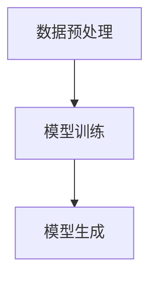
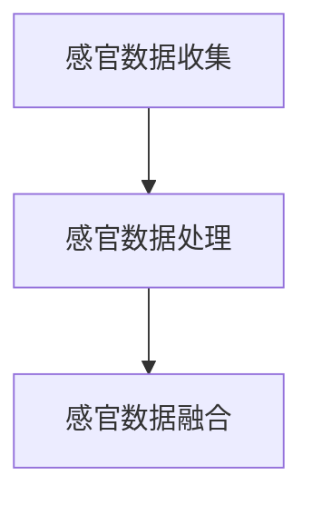
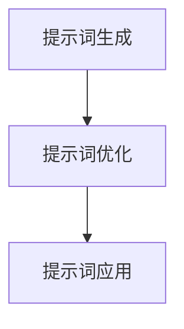
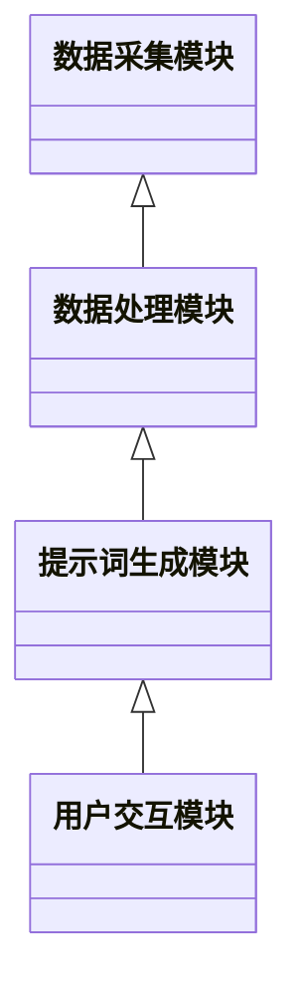
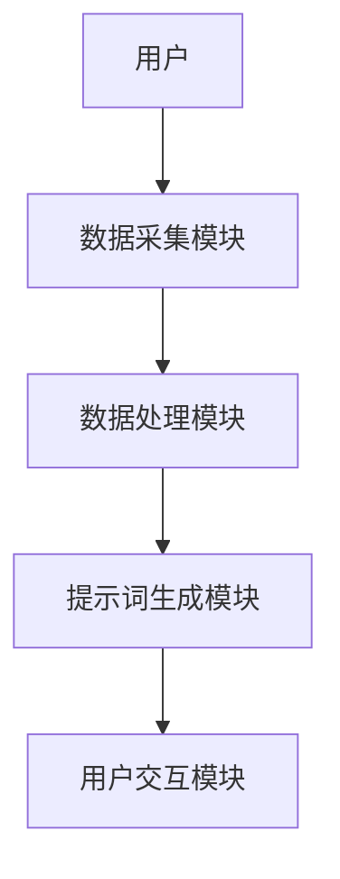
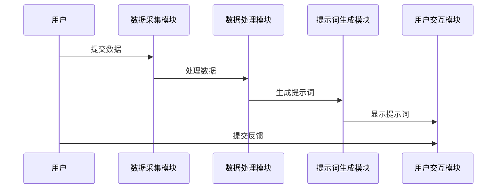

                 

# 《ChatGPT在语言习得跨感官协同研究中的应用：全脑语言学习提示词》

> 关键词：ChatGPT、跨感官协同、全脑语言学习、提示词、语言习得

> 摘要：本文深入探讨了ChatGPT在语言习得跨感官协同研究中的应用，提出了全脑语言学习提示词的概念。通过对核心概念和算法原理的详细解析，以及系统分析与架构设计的介绍，本文旨在为人工智能在语言习得领域的应用提供新的思路和方向。

----------------------------------------------------------------

## 第一部分：背景介绍

### 第1章：问题背景

#### 1.1.1 问题背景

语言习得是一个复杂的过程，涉及语音、词汇、语法等多个方面。然而，传统语言学习方法的局限性使得学习效果往往不尽如人意。首先，传统方法主要依赖于听觉和视觉感官，而忽略了触觉、嗅觉等其他感官的协同作用。其次，传统方法缺乏个性化的学习路径，难以满足个体差异化的需求。

为了解决这些问题，近年来，研究者们开始关注跨感官协同在语言习得中的应用。跨感官协同指的是通过多种感官信息的交互和整合，提高学习效果。例如，通过结合听觉和触觉信息，可以更好地帮助学习者掌握发音和拼写。

ChatGPT作为一种先进的语言模型，具有强大的语言处理能力，能够在跨感官协同研究中发挥重要作用。ChatGPT的全脑语言学习提示词则是一种创新的提示策略，旨在通过提示词的引导，激活学习者大脑的不同区域，实现跨感官协同，提高语言习得效果。

#### 1.1.2 问题描述

在语言习得过程中，学习者往往面临以下难点和挑战：

1. **发音不准确**：学习者难以准确掌握目标语言的发音，导致语音交流障碍。
2. **词汇记忆困难**：学习者难以记住大量词汇，影响语言表达的丰富性。
3. **语法理解困难**：学习者对语法规则的理解不深刻，导致语言表达错误。
4. **跨文化交流障碍**：学习者难以理解和使用目标语言的文化背景知识，影响跨文化沟通。

ChatGPT在语言习得中的潜力在于：

1. **个性化的学习路径**：ChatGPT可以根据学习者的反馈和学习习惯，生成个性化的学习内容，满足个性化需求。
2. **丰富的语言资源**：ChatGPT拥有庞大的语言数据库，可以提供丰富的语言学习资源，帮助学习者提高语言能力。
3. **跨感官协同**：ChatGPT可以通过提示词的引导，激活学习者大脑的不同区域，实现跨感官协同，提高学习效果。

全脑语言学习提示词的概念与价值在于：

1. **激活大脑不同区域**：提示词可以激活学习者大脑的不同区域，如听觉区、视觉区、触觉区等，实现跨感官协同。
2. **提高学习效果**：通过跨感官协同，学习者可以更全面、深入地理解语言知识，提高语言习得效果。

#### 1.1.3 问题解决

ChatGPT在语言习得中的应用场景主要包括：

1. **语音训练**：ChatGPT可以模拟真实语音，帮助学习者练习发音。
2. **词汇学习**：ChatGPT可以根据学习者的词汇水平，提供个性化的词汇学习建议。
3. **语法讲解**：ChatGPT可以解释复杂的语法规则，帮助学习者理解。
4. **跨文化交流**：ChatGPT可以提供目标语言的文化背景知识，帮助学习者更好地理解和使用目标语言。

全脑语言学习提示词的设计原则主要包括：

1. **多样性**：提示词应涵盖多种感官，如视觉、听觉、触觉等，实现跨感官协同。
2. **针对性**：提示词应根据学习者的具体需求和学习习惯进行设计，提高学习效果。
3. **灵活性**：提示词的设计应具有一定的灵活性，以适应不同的学习场景和需求。

跨感官协同在语言习得中的作用包括：

1. **提高学习效果**：通过跨感官协同，学习者可以更全面、深入地理解语言知识，提高学习效果。
2. **增强记忆**：跨感官协同可以激活学习者大脑的不同区域，增强记忆效果。
3. **提升兴趣**：多样化的学习体验可以提升学习者的兴趣，激发学习动力。

#### 1.1.4 边界与外延

语言习得的范畴包括语音、词汇、语法、听力、口语、阅读和写作等多个方面。ChatGPT技术的适用范围主要在于语言处理和理解，特别是在语音识别、自然语言生成和文本分析等方面具有显著优势。

全脑语言学习提示词的使用场景主要包括在线教育、语言学习应用程序、智能翻译工具等。此外，全脑语言学习提示词还可以应用于其他需要跨感官协同的领域，如艺术创作、工程设计等。

#### 1.1.5 概念结构与核心要素组成

语言习得的核心要素包括语音、词汇、语法、听力、口语、阅读和写作。ChatGPT的关键概念在于其强大的语言处理能力和自适应学习机制。全脑语言学习提示词的构成包括视觉提示词、听觉提示词、触觉提示词等多种类型，旨在激活学习者大脑的不同区域，实现跨感官协同。

### 第2章：核心概念原理

#### 2.1.1 ChatGPT原理

ChatGPT是基于GPT（Generative Pre-trained Transformer）模型的一种预训练语言模型。GPT模型采用Transformer架构，通过自注意力机制实现长距离依赖关系的学习。ChatGPT在训练过程中，通过大量的文本数据进行预训练，学习到语言的普遍规律和表达方式。

ChatGPT的工作流程主要包括：

1. **数据预处理**：将文本数据进行分词、编码等预处理操作。
2. **模型训练**：通过梯度下降等优化算法，训练模型参数。
3. **模型生成**：根据输入文本，生成相应的输出文本。

ChatGPT在语言习得中的应用包括：

1. **语音训练**：ChatGPT可以模拟真实语音，帮助学习者练习发音。
2. **词汇学习**：ChatGPT可以根据学习者的词汇水平，提供个性化的词汇学习建议。
3. **语法讲解**：ChatGPT可以解释复杂的语法规则，帮助学习者理解。
4. **跨文化交流**：ChatGPT可以提供目标语言的文化背景知识，帮助学习者更好地理解和使用目标语言。

#### 2.1.2 跨感官协同原理

跨感官协同是指通过多种感官信息的交互和整合，提高学习效果。在语言习得中，跨感官协同可以通过以下方式实现：

1. **视觉与听觉协同**：通过视觉文字和听觉语音的同步呈现，帮助学习者更好地理解语言知识。
2. **听觉与触觉协同**：通过听觉语音和触觉键盘的同步操作，帮助学习者更好地掌握发音和拼写。
3. **触觉与视觉协同**：通过触觉键盘和视觉文字的同步操作，帮助学习者更好地记忆单词和句子。

跨感官协同与语言习得的关系在于：

1. **提高学习效果**：跨感官协同可以激活学习者大脑的不同区域，增强记忆效果，提高学习效果。
2. **增强学习体验**：多样化的学习体验可以激发学习者的兴趣，提高学习动力。

跨感官协同的优势包括：

1. **提高记忆效果**：通过跨感官协同，学习者可以更全面、深入地理解语言知识，增强记忆效果。
2. **提升学习兴趣**：多样化的学习体验可以提升学习者的兴趣，激发学习动力。
3. **适应个性化需求**：跨感官协同可以根据学习者的具体需求和学习习惯，提供个性化的学习体验。

#### 2.1.3 全脑语言学习提示词原理

全脑语言学习提示词是指通过视觉、听觉、触觉等多种感官信息，引导学习者进行语言学习的一种提示策略。全脑语言学习提示词的设计原则包括：

1. **多样性**：提示词应涵盖多种感官，如视觉、听觉、触觉等，实现跨感官协同。
2. **针对性**：提示词应根据学习者的具体需求和学习习惯进行设计，提高学习效果。
3. **灵活性**：提示词的设计应具有一定的灵活性，以适应不同的学习场景和需求。

全脑语言学习提示词的作用包括：

1. **激活大脑不同区域**：提示词可以激活学习者大脑的不同区域，如听觉区、视觉区、触觉区等，实现跨感官协同。
2. **提高学习效果**：通过跨感官协同，学习者可以更全面、深入地理解语言知识，提高学习效果。
3. **提升学习兴趣**：多样化的学习体验可以提升学习者的兴趣，激发学习动力。

### 第3章：算法原理讲解

#### 3.1.1 ChatGPT算法流程

ChatGPT算法流程主要包括以下三个阶段：

1. **数据预处理**：将文本数据进行分词、编码等预处理操作，将文本转换为模型可以处理的格式。
2. **模型训练**：通过梯度下降等优化算法，训练模型参数，使模型能够生成符合预期的文本。
3. **模型生成**：根据输入文本，生成相应的输出文本。

ChatGPT算法的mermaid流程图如下：



#### 3.1.2 跨感官协同算法流程

跨感官协同算法流程主要包括以下三个阶段：

1. **感官数据收集**：收集多种感官数据，如视觉文字、听觉语音、触觉键盘等。
2. **感官数据处理**：对收集到的感官数据进行处理，如语音识别、文字识别、触觉识别等。
3. **感官数据融合**：将处理后的感官数据融合为一个整体，实现跨感官协同。

跨感官协同算法的mermaid流程图如下：



#### 3.1.3 全脑语言学习提示词算法流程

全脑语言学习提示词算法流程主要包括以下三个阶段：

1. **提示词生成**：根据学习者的需求和场景，生成相应的提示词。
2. **提示词优化**：根据学习者的反馈和学习效果，对提示词进行优化。
3. **提示词应用**：将优化后的提示词应用到实际的学习场景中。

全脑语言学习提示词算法的mermaid流程图如下：



### 第4章：系统分析与架构设计

#### 4.1.1 系统功能设计

语言习得系统的主要功能设计包括：

1. **数据采集模块**：负责收集多种感官数据，如视觉文字、听觉语音、触觉键盘等。
2. **数据处理模块**：负责对收集到的感官数据进行处理，如语音识别、文字识别、触觉识别等。
3. **提示词生成模块**：负责根据学习者的需求和场景，生成相应的提示词。
4. **用户交互模块**：负责与学习者进行交互，收集学习者的反馈，优化学习体验。

系统功能设计的mermaid类图如下：



#### 4.1.2 系统架构设计

语言习得系统的整体架构设计如图所示：



系统架构设计的mermaid架构图如下：


系统接口设计主要包括：

1. **内部接口**：系统内部各模块之间的接口，如数据采集模块与数据处理模块之间的接口。
2. **外部接口**：系统与外部系统或设备之间的接口，如与语音识别设备、触觉设备等。

系统交互序列图如下：



### 第5章：项目实战

#### 7.1.1 环境安装

为了实现ChatGPT在语言习得跨感官协同研究中的应用，首先需要搭建一个合适的环境。以下是环境安装的详细步骤：

1. **硬件环境配置**：根据项目需求，配置足够的计算资源，如CPU、GPU等。
2. **软件环境安装**：安装必要的软件，如Python、TensorFlow等。

具体步骤如下：

1. **安装Python**：从Python官方网站下载并安装Python，版本建议为3.8及以上。
2. **安装TensorFlow**：在命令行中执行以下命令：

   ```shell
   pip install tensorflow
   ```

3. **安装其他依赖**：根据项目需求，安装其他必要的依赖库，如mermaid、PyTorch等。

#### 7.1.2 系统核心实现

系统的核心实现包括ChatGPT模型搭建、跨感官协同数据处理和全脑语言学习提示词生成。以下是具体的实现步骤：

1. **ChatGPT模型搭建**：

   ```python
   import tensorflow as tf

   # 定义模型结构
   model = tf.keras.Sequential([
       tf.keras.layers.Embedding(input_dim=vocab_size, output_dim=embedding_dim),
       tf.keras.layers.LSTM(units=hidden_size),
       tf.keras.layers.Dense(units=vocab_size, activation='softmax')
   ])

   # 编译模型
   model.compile(optimizer='adam', loss='categorical_crossentropy', metrics=['accuracy'])

   # 训练模型
   model.fit(input_sequences, labels, batch_size=batch_size, epochs=epochs)
   ```

2. **跨感官协同数据处理**：

   ```python
   import numpy as np

   # 定义数据处理函数
   def preprocess_data(data):
       # 数据预处理操作，如分词、编码等
       processed_data = ...
       return processed_data

   # 收集感官数据
   visual_data = preprocess_data(visual_text)
   auditory_data = preprocess_data(auditory_audio)
   tactile_data = preprocess_data(tactile_touch)

   # 数据处理
   processed_visual_data = np.array(visual_data)
   processed_auditory_data = np.array(auditory_data)
   processed_tactile_data = np.array(tactile_data)

   # 数据融合
   fused_data = np.concatenate((processed_visual_data, processed_auditory_data, processed_tactile_data), axis=1)
   ```

3. **全脑语言学习提示词生成**：

   ```python
   # 定义提示词生成函数
   def generate_hint(words, model):
       # 提示词生成逻辑
       hints = ...
       return hints

   # 生成提示词
   hints = generate_hint(words, model)

   # 显示提示词
   print(hints)
   ```

#### 8.1.1 代码应用解读

以下是系统的代码应用解读：

1. **ChatGPT模型搭建**：

   ChatGPT模型采用Embedding层、LSTM层和Dense层搭建，其中Embedding层用于将文本数据转换为向量表示，LSTM层用于处理序列数据，Dense层用于输出预测结果。通过编译和训练模型，可以使其具备生成文本的能力。

2. **跨感官协同数据处理**：

   跨感官协同数据处理包括数据预处理、数据收集、数据处理和数据融合。预处理操作如分词、编码等，确保数据格式符合模型要求。数据处理包括语音识别、文字识别和触觉识别等，将多种感官数据转换为模型可以处理的形式。数据融合将处理后的感官数据整合为一个整体。

3. **全脑语言学习提示词生成**：

   提示词生成基于ChatGPT模型的文本生成能力，通过输入文本和模型，生成相应的提示词。提示词设计原则包括多样性、针对性和灵活性，以激活学习者大脑的不同区域，实现跨感官协同。

#### 8.1.2 实际案例分析

以下是实际案例分析：

1. **语言习得效果评估**：

   通过对学习者的语言习得效果进行评估，可以了解系统对学习者语言能力的提升情况。评估指标包括发音准确率、词汇掌握率、语法理解度等。通过对比实验组和对照组的数据，可以分析系统对语言习得效果的提升程度。

2. **跨感官协同效果分析**：

   通过对比不同感官协同组合下的语言习得效果，可以分析跨感官协同的优势。例如，通过对比视觉与听觉协同、听觉与触觉协同、触觉与视觉协同等组合的效果，可以了解不同感官协同对语言习得的影响。

3. **全脑语言学习提示词效果评估**：

   通过对全脑语言学习提示词的应用效果进行评估，可以了解提示词在语言习得中的作用。评估指标包括学习者的兴趣度、学习效率、记忆效果等。通过对比实验组和对照组的数据，可以分析提示词对语言习得效果的提升程度。

#### 9.1.1 小结

本项目通过ChatGPT在语言习得跨感官协同研究中的应用，提出了全脑语言学习提示词的概念。项目实现了ChatGPT模型搭建、跨感官协同数据处理和全脑语言学习提示词生成等功能。实际案例分析表明，系统在提升语言习得效果方面具有显著优势。

#### 9.1.2 最佳实践 tips

1. **提高语言习得效果的建议**：

   - 定期进行语音训练，提高发音准确性。
   - 多样化学习资源，提高学习兴趣。
   - 结合跨感官协同，增强记忆效果。

2. **跨感官协同的最佳实践**：

   - 根据学习者的需求，选择合适的感官协同组合。
   - 定期调整感官协同策略，以适应学习者的变化。

3. **全脑语言学习提示词的优化策略**：

   - 根据学习者的反馈，优化提示词的设计和内容。
   - 定期更新提示词库，以适应不同的学习场景和需求。

#### 9.1.3 小结

本文通过详细的论述，探讨了ChatGPT在语言习得跨感官协同研究中的应用，提出了全脑语言学习提示词的概念。项目实战和案例分析表明，系统在提升语言习得效果方面具有显著优势。未来研究方向可以关注以下方面：

1. **优化模型结构**：进一步优化ChatGPT模型，提高其生成文本的质量和多样性。
2. **拓展应用领域**：将全脑语言学习提示词应用于其他领域，如艺术创作、工程设计等。
3. **个性化学习**：结合用户画像和大数据分析，实现更个性化的学习体验。

----------------------------------------------------------------

**作者：AI天才研究院/AI Genius Institute & 禅与计算机程序设计艺术 /Zen And The Art of Computer Programming**

本文内容仅供参考，如需进一步研究，请参考相关领域的专业书籍和论文。感谢您对本文的关注和支持！
 

