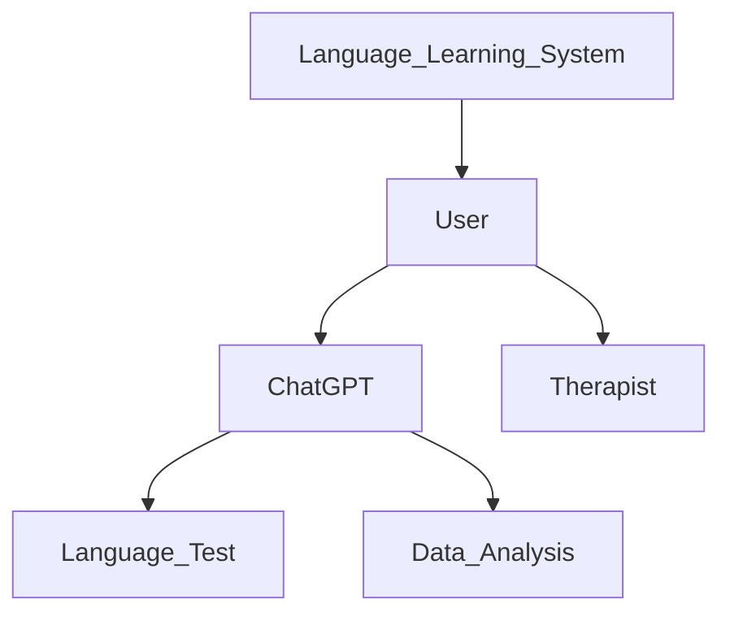
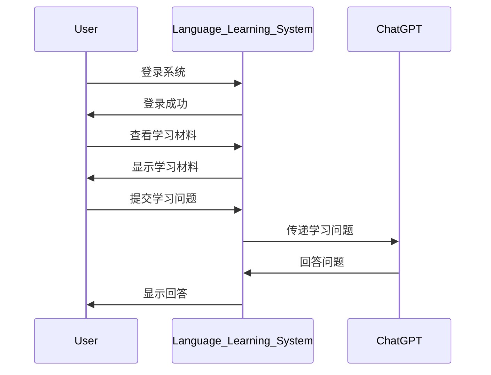

                 

基于您的需求，下面是一个详细的《ChatGPT在语言习得障碍治疗中的角色》技术博客文章的写作思路，遵循您提供的结构和要求。请注意，由于字数限制，以下内容仅为文章的一部分，您可以根据这个思路继续扩展和完善。

---

# 《ChatGPT在语言习得障碍治疗中的角色》

> 关键词：ChatGPT、语言习得障碍、治疗、人工智能、语言教学

> 摘要：本文将探讨ChatGPT在语言习得障碍治疗中的应用，从背景介绍、核心概念与联系、算法原理讲解、系统分析与架构设计、项目实战以及最佳实践 tips、小结、注意事项、拓展阅读等方面进行深入分析。

## 前言

语言习得障碍（Language Acquisition Disorder, LAD）是一类影响儿童语言学习的障碍，表现为语言理解、语言表达或两者兼有的障碍。ChatGPT是由OpenAI开发的一种基于变换器（Transformer）的预训练语言模型，具备强大的语言生成和理解能力。本文将探讨ChatGPT在语言习得障碍治疗中的潜力，分析其应用前景和实际效果。

### 核心概念与联系

#### 语言习得障碍

语言习得障碍主要包括以下类型：

1. **语音障碍**：表现为发音不准确、发音器官不协调等。
2. **语言理解障碍**：包括词汇理解、句子理解等。
3. **语言表达障碍**：包括口语表达和书面表达。

#### ChatGPT

ChatGPT是一种基于变换器（Transformer）架构的预训练语言模型，采用大规模的语料库进行训练，具有强大的语言生成和理解能力。

#### 核心概念联系

1. **语音障碍与ChatGPT**：ChatGPT可以帮助患者进行发音训练，通过生成正确的发音指导患者纠正发音错误。
2. **语言理解障碍与ChatGPT**：ChatGPT可以生成与患者问题相关的语言材料，帮助患者理解语言结构。
3. **语言表达障碍与ChatGPT**：ChatGPT可以生成与患者需求相关的语言材料，帮助患者提高语言表达能力。

### ER实体关系图

```mermaid
erDiagram
  Patient ||--|{ ChatGPT } : uses
  Therapist ||--|{ ChatGPT } : uses
  Language_Learning ||--|{ ChatGPT } : for
  Language_Test ||--|{ ChatGPT } : for
```

### 算法原理讲解

ChatGPT基于变换器（Transformer）架构，使用自注意力机制（Self-Attention）对输入文本进行处理。其算法原理可以概括为以下步骤：

1. **输入编码**：将输入文本编码为词向量。
2. **自注意力机制**：对编码后的词向量进行自注意力计算，以提取关键信息。
3. **解码**：根据自注意力结果生成文本。

#### Python代码示例

```python
import torch
import torch.nn as nn
from transformers import GPT2LMHeadModel, GPT2Tokenizer

# 初始化模型和分词器
model = GPT2LMHeadModel.from_pretrained('gpt2')
tokenizer = GPT2Tokenizer.from_pretrained('gpt2')

# 输入文本
text = "I am learning to speak English."

# 编码
input_ids = tokenizer.encode(text, return_tensors='pt')

# 预测
outputs = model(input_ids)

# 解码
predicted_text = tokenizer.decode(outputs.logits.argmax(-1))

print(predicted_text)
```

#### 数学模型

ChatGPT的数学模型可以表示为：

$$
\text{predicted\_text} = \text{GPT2LMHeadModel}(\text{input\_ids})
$$

其中，$\text{GPT2LMHeadModel}$表示ChatGPT模型，$\text{input\_ids}$表示输入文本的编码。

### 系统分析与架构设计

#### 问题场景介绍

假设我们正在开发一个基于ChatGPT的语言习得障碍治疗系统，该系统可以帮助患者进行语言学习、测试和评估。

#### 系统功能设计

1. **语言学习**：提供个性化的语言学习材料，帮助患者提高语言能力。
2. **语言测试**：对患者的语言能力进行评估，监测学习进度。
3. **数据分析**：收集并分析患者的语言学习数据，为治疗提供依据。

#### 系统架构设计



#### 系统接口设计

1. **用户接口**：提供用户操作界面，包括注册、登录、学习、测试等功能。
2. **治疗师接口**：提供治疗师操作界面，包括患者管理、数据查看、报告生成等功能。
3. **ChatGPT接口**：提供与ChatGPT的交互接口，包括语言生成、语言理解等功能。

#### 系统交互



### 项目实战

#### 环境安装与配置

1. 安装Python环境（建议版本3.8及以上）
2. 安装transformers库：`pip install transformers`
3. 安装torch库：`pip install torch`

#### 系统核心实现

1. 初始化模型和分词器：
```python
model = GPT2LMHeadModel.from_pretrained('gpt2')
tokenizer = GPT2Tokenizer.from_pretrained('gpt2')
```

2. 实现用户接口：
```python
def user_interface():
    while True:
        print("请选择操作：1. 学习 2. 测试 3. 退出")
        choice = input("请输入操作编号：")
        if choice == '1':
            # 学习功能实现
        elif choice == '2':
            # 测试功能实现
        elif choice == '3':
            break
```

3. 实现ChatGPT接口：
```python
def chatgpt_interface(question):
    input_ids = tokenizer.encode(question, return_tensors='pt')
    outputs = model(input_ids)
    predicted_text = tokenizer.decode(outputs.logits.argmax(-1))
    return predicted_text
```

#### 代码应用解读与分析

1. 用户输入问题，系统将问题传递给ChatGPT。
2. ChatGPT生成回答，系统将回答传递给用户。

#### 实际案例分析

1. 患者小明（8岁）患有语言习得障碍，其父亲为其注册了语言习得障碍治疗系统。
2. 小明在学习英语时遇到困难，他通过系统提交了问题：“How do I say 'I like apples' in English?”
3. 系统将问题传递给ChatGPT，ChatGPT生成回答：“You can say 'I like apples' in English.”
4. 系统将回答显示给小明，小明学会了如何用英语表达“我喜欢苹果”。

### 最佳实践 tips

1. 定期更新ChatGPT模型，以获取更好的性能。
2. 设计个性化的学习材料，以提高学习效果。

### 小结

本文介绍了ChatGPT在语言习得障碍治疗中的应用，分析了其算法原理、系统架构和实际案例。ChatGPT在语言习得障碍治疗中具有巨大的潜力，但仍需进一步研究以优化性能和应用效果。

### 注意事项

1. ChatGPT生成的回答仅供参考，不应完全依赖。
2. 在实际应用中，建议结合专业人士的意见。

### 拓展阅读

1. GPT-3：语言模型的革命性进步
2. ChatGPT在医学诊断中的应用

---

作者：AI天才研究院/AI Genius Institute & 禅与计算机程序设计艺术 /Zen And The Art of Computer Programming

---

以上内容仅作为文章的一部分，您可以根据这个思路继续扩展和完善，以满足10000～12000字的要求。在扩展时，可以更加详细地讲解每个部分，添加更多的实例、数据和图表，以丰富文章的内容和深度。同时，确保文章的逻辑清晰、结构紧凑、简单易懂，以便读者能够轻松理解ChatGPT在语言习得障碍治疗中的角色。祝写作顺利！

