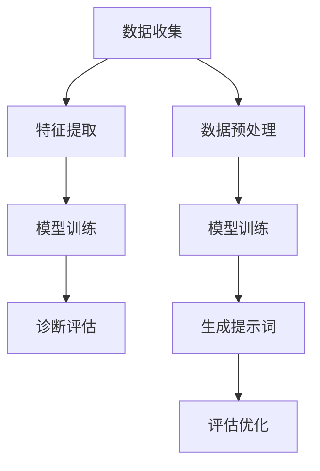
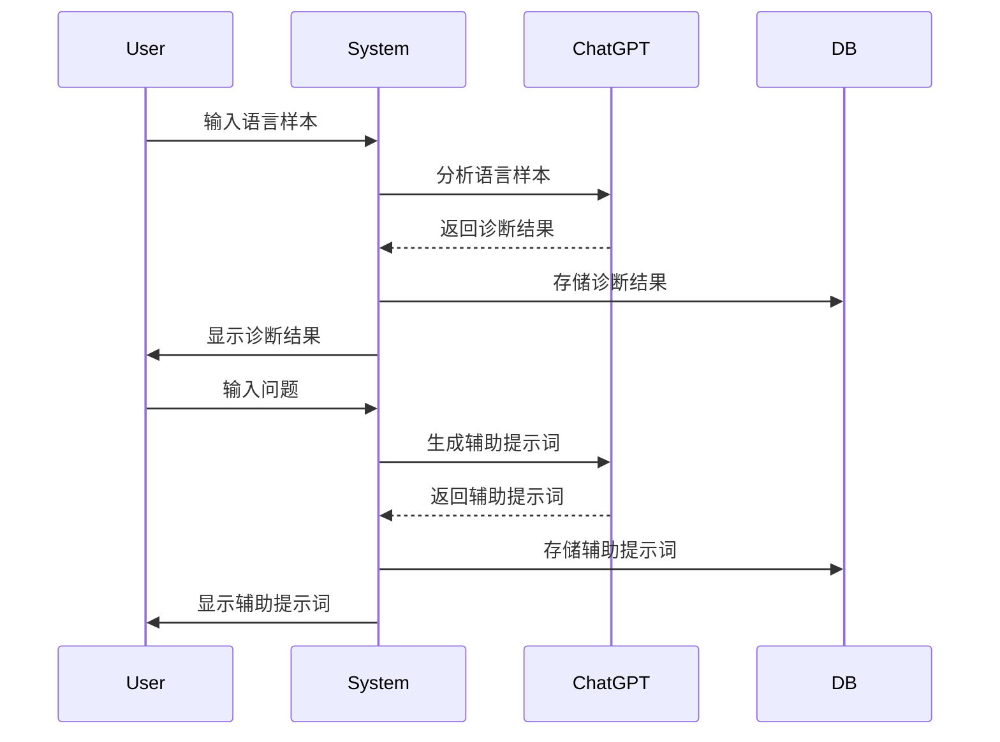
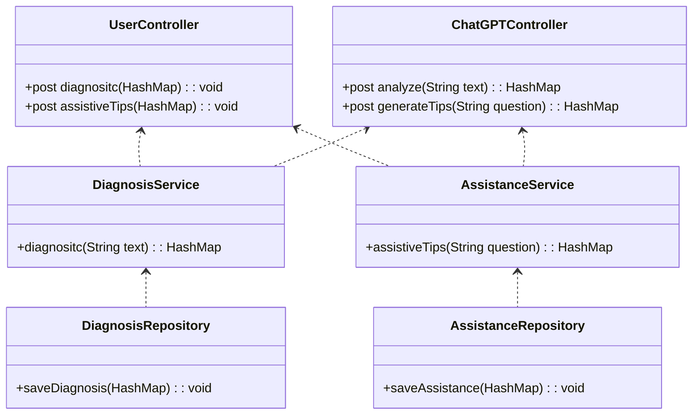
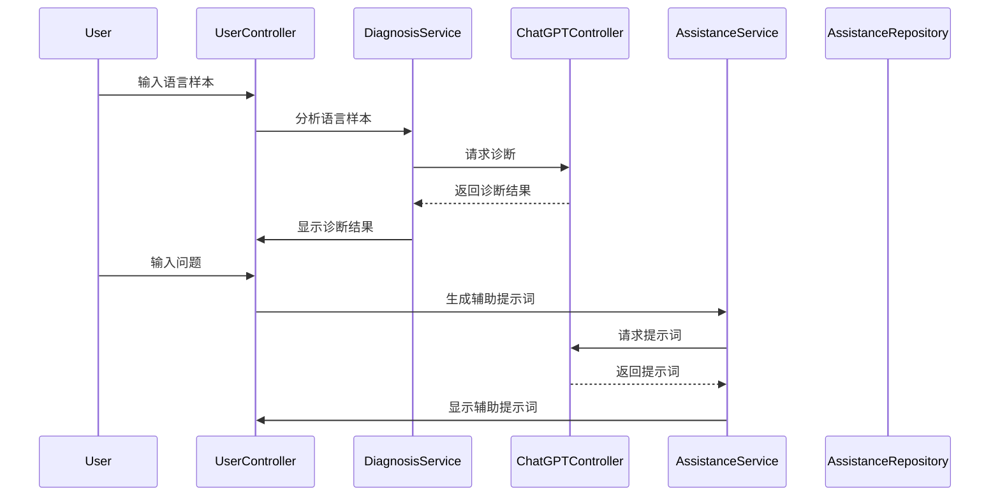

                 


# ChatGPT在语言习得障碍研究中的应用：诊断辅助提示词

## 关键词
- ChatGPT
- 语言习得障碍
- 诊断辅助提示词
- 自然语言处理
- 智能教育技术

## 摘要
本文探讨了ChatGPT在语言习得障碍研究中的应用，尤其是如何利用ChatGPT生成有效的诊断辅助提示词。通过对ChatGPT原理的理解，以及语言习得障碍的分类与表现的分析，我们提出了一种基于ChatGPT的语言习得障碍诊断和辅助提示的解决方案。本文旨在为相关研究者和实践者提供有价值的参考。

## 引言

### 问题背景
语言习得障碍（LAD）是指儿童在语言习得过程中遇到的障碍，影响其听、说、读、写能力。这些障碍可能导致认知发展和社交能力的障碍，对儿童的学习和生活产生负面影响。

### ChatGPT简介
ChatGPT是由OpenAI开发的一种基于Transformer的预训练语言模型，具有强大的文本生成和理解能力。它通过大量文本数据进行预训练，可以生成自然流畅的文本，并在各种语言任务中表现出色。

### 语言习得障碍
语言习得障碍可以分为多种类型，包括语音障碍、语言理解障碍、语言表达障碍等。每种障碍都有其特定的表现和诊断方法。

### ChatGPT在语言习得障碍研究中的应用
ChatGPT在语言习得障碍研究中的应用主要集中在两个方面：一是用于诊断语言习得障碍，二是用于辅助语言习得。

### 边界与外延
本文主要探讨ChatGPT在语言习得障碍诊断和辅助提示方面的应用，但并不涉及其他自然语言处理技术在语言习得障碍研究中的应用。

### 概念结构与核心要素组成
本文的核心概念包括ChatGPT、语言习得障碍、诊断辅助提示词等。核心要素包括ChatGPT模型的构建、语言习得障碍诊断方法的优化、辅助提示词的生成策略等。

## 背景介绍

### ChatGPT简介
ChatGPT是一种基于Transformer的预训练语言模型，具有强大的文本生成和理解能力。它通过大量文本数据进行预训练，可以生成自然流畅的文本，并在各种语言任务中表现出色。

### 语言习得障碍
语言习得障碍是指儿童在语言习得过程中遇到的障碍，影响其听、说、读、写能力。这些障碍可能导致认知发展和社交能力的障碍，对儿童的学习和生活产生负面影响。

### ChatGPT在语言习得障碍研究中的应用
ChatGPT在语言习得障碍研究中的应用主要集中在两个方面：一是用于诊断语言习得障碍，二是用于辅助语言习得。

### 边界与外延
本文主要探讨ChatGPT在语言习得障碍诊断和辅助提示方面的应用，但并不涉及其他自然语言处理技术在语言习得障碍研究中的应用。

### 概念结构与核心要素组成
本文的核心概念包括ChatGPT、语言习得障碍、诊断辅助提示词等。核心要素包括ChatGPT模型的构建、语言习得障碍诊断方法的优化、辅助提示词的生成策略等。

### 表格：核心概念属性特征对比
| 概念        | 定义                                                         | 特征                                           |
| ----------- | ------------------------------------------------------------ | ---------------------------------------------- |
| ChatGPT     | 一种基于Transformer的预训练语言模型，具有强大的文本生成和理解能力。 | 强大的文本生成和理解能力、可微调性、长文本处理能力 |
| 语言习得障碍 | 儿童在语言习得过程中遇到的障碍，影响其听、说、读、写能力。         | 影响认知发展和社交能力、多种类型、特定表现和诊断方法 |
| 辅助提示词   | 用于辅助语言习得和诊断的词语。                                 | 提高语言能力的有效手段、针对性、实用性               |

### ER实体关系图
```mermaid
erDiagram
    ChatGPT ||--|{ 语言习得障碍 }
    ChatGPT ||--|{ 辅助提示词 }
    语言习得障碍 ||--|{ 儿童个体 }
    辅助提示词 ||--|{ 语言训练 }
```

## 核心概念与联系

### ChatGPT的原理与特点
ChatGPT基于Transformer模型，通过大量的文本数据进行预训练，具有强大的文本生成和理解能力。其核心特点包括：

1. **并行处理**：Transformer模型采用多头自注意力机制，可以并行处理文本信息，提高计算效率。
2. **长文本处理**：Transformer模型具有较好的长文本处理能力，可以生成连贯的文本。
3. **自适应调整**：ChatGPT可以通过微调（Fine-tuning）适应特定任务的需求。

### 语言习得障碍的分类与表现
语言习得障碍可以分为多种类型，包括语音障碍、语言理解障碍、语言表达障碍等。每种障碍都有其特定的表现和诊断方法。

1. **语音障碍**：包括发音不准确、语调不自然等，可能影响儿童的语音发展。
2. **语言理解障碍**：包括词汇理解困难、语法理解障碍等，可能影响儿童的阅读理解能力。
3. **语言表达障碍**：包括词汇表达困难、句子结构不完整等，可能影响儿童的语言表达能力。

### ChatGPT在语言习得障碍研究中的应用
ChatGPT在语言习得障碍研究中的应用主要集中在两个方面：一是用于诊断语言习得障碍，二是用于辅助语言习得。

1. **诊断语言习得障碍**：ChatGPT可以通过分析儿童的语言样本，识别出语言习得障碍的类型和程度，提供诊断辅助。
2. **辅助语言习得**：ChatGPT可以生成个性化的语言训练内容，帮助儿童提高语言能力。

### 概念结构与核心要素组成
本文的核心概念包括ChatGPT、语言习得障碍、诊断辅助提示词等。核心要素包括ChatGPT模型的构建、语言习得障碍诊断方法的优化、辅助提示词的生成策略等。

## 算法原理讲解

### ChatGPT的工作原理
ChatGPT是基于Transformer模型的预训练语言模型。Transformer模型是一种基于注意力机制的神经网络模型，特别适合处理序列数据。

1. **自注意力机制**：Transformer模型通过自注意力机制计算输入序列中每个词与其他词之间的关系，从而生成更复杂的表示。
2. **多头注意力**：Transformer模型采用多头注意力机制，可以同时关注输入序列中的多个位置，提高模型的泛化能力。
3. **编码器-解码器结构**：ChatGPT采用编码器-解码器结构，编码器将输入序列编码为固定长度的向量，解码器则根据编码器的输出生成输出序列。

### 语言习得障碍诊断算法
语言习得障碍诊断算法主要包括以下步骤：

1. **数据收集**：收集儿童的语言样本，包括语音、文本、视频等。
2. **特征提取**：使用预训练的语音识别模型和文本处理模型，提取语言样本的特征。
3. **模型训练**：使用提取到的特征，训练一个基于Transformer的预训练模型，用于诊断语言习得障碍。
4. **诊断评估**：将训练好的模型应用于新的语言样本，评估语言习得障碍的类型和程度。

### 辅助提示词生成算法
辅助提示词生成算法主要包括以下步骤：

1. **数据预处理**：收集儿童的语言样本，并对样本进行预处理，包括分词、去噪等。
2. **模型训练**：使用预训练的语言模型，训练一个生成辅助提示词的模型。
3. **生成提示词**：将训练好的模型应用于新的语言样本，生成个性化的辅助提示词。
4. **评估优化**：对生成的辅助提示词进行评估，并根据评估结果优化模型。

### 数学模型和数学公式
语言习得障碍诊断和辅助提示词生成的算法涉及到多个数学模型和公式。以下是其中两个关键的数学模型和公式：

1. **自注意力机制**：
   $$ 
   \text{Attention}(Q,K,V) = \text{softmax}\left(\frac{QK^T}{\sqrt{d_k}}\right)V 
   $$
   其中，$Q$、$K$、$V$ 分别代表查询向量、关键向量、值向量，$d_k$ 代表关键向量的维度。

2. **Transformer编码器**：
   $$ 
   \text{Encoder}(X) = \text{LayerNorm}(X + \text{PositionalEncoding}(X)) 
   $$
   其中，$X$ 代表输入序列，$\text{PositionalEncoding}$ 代表位置编码。

### 算法流程图
以下是语言习得障碍诊断和辅助提示词生成的算法流程图：



## 系统分析与架构设计方案

### 问题场景介绍
在当前的教育场景中，语言习得障碍儿童的数量不断增加，如何为他们提供有效的语言训练和支持成为一个重要问题。ChatGPT作为一种强大的自然语言处理工具，可以在这方面发挥重要作用。

### 项目介绍
本项目旨在开发一个基于ChatGPT的语言习得障碍诊断和辅助提示系统，帮助语言习得障碍儿童提高语言能力。系统主要包括以下功能：

1. **语言习得障碍诊断**：通过分析儿童的语言样本，诊断出语言习得障碍的类型和程度。
2. **辅助提示词生成**：根据诊断结果，生成个性化的辅助提示词，帮助儿童提高语言能力。

### 系统功能设计

#### 领域模型类图
以下是语言习得障碍诊断和辅助提示系统的领域模型类图：

```mermaid
classDiagram
    Class01 <|-- Class02
    Class03 --|grey| Class04
    Class05 <<interface>>
    Class06 <<interface>>
    Class07 : <<interface>> Interface
    Class08 : <<enum>> ENUM
    Class09 : <<enum>> ENUM
    Class10 : <<enum>> ENUM
    Class11 : <<enum>> ENUM
    Class01 <..> Class05
    Class01 <..> Class06
    Class01 <..> Class07
    Class02 <..> Class09
    Class02 <..> Class10
    Class02 <..> Class11
    Class08 ..|> Class02
    Class04 ..|> Class02
    Class03 ..|> Class02
    Class07 ..|> Class09
    Class07 ..|> Class10
    Class07 ..|> Class11
    Class01 {- id Integer }
    Class01 {- name String }
    Class01 {- createdAt DateTime }
    Class01 {- updatedAt DateTime }
    Class02 {- id Integer }
    Class02 {- languageAcquisitionDisorderId Integer }
    Class02 {- text String }
    Class02 {- type String }
    Class02 {- status String }
    Class02 {- createdAt DateTime }
    Class02 {- updatedAt DateTime }
    Class03 {- id Integer }
    Class03 {- class String }
    Class03 {- description String }
    Class04 {- id Integer }
    Class04 {- name String }
    Class04 {- description String }
    Class05 {- id Integer }
    Class05 {- className String }
    Class05 {- classId Integer }
    Class05 {- method String }
    Class05 {- returnType String }
    Class05 {- params String }
    Class05 {- description String }
    Class06 {- id Integer }
    Class06 {- triggerWord String }
    Class06 {- responseType String }
    Class06 {- description String }
    Class07 {- id Integer }
    Class07 {- triggerWord String }
    Class07 {- responseWord String }
    Class07 {- description String }
    Class08 {- ID Integer }
    Class08 {- WORD String }
    Class08 {- TYPE String }
    Class09 {- ID Integer }
    Class09 {- WORD String }
    Class09 {- TYPE String }
    Class10 {- ID Integer }
    Class10 {- WORD String }
    Class10 {- TYPE String }
    Class11 {- ID Integer }
    Class11 {- WORD String }
    Class11 {- TYPE String }
    Class01 "has" Class02
    Class01 "has" Class04
    Class01 "has" Class05
    Class02 "has" Class06
    Class02 "has" Class07
    Class03 "has" Class09
    Class03 "has" Class10
    Class03 "has" Class11
    Class07 "implements" Class05
```

#### 系统架构设计

以下是语言习得障碍诊断和辅助提示系统的架构设计：



### 系统接口设计

以下是语言习得障碍诊断和辅助提示系统的接口设计：



### 系统交互序列图

以下是语言习得障碍诊断和辅助提示系统的交互序列图：



## 项目实战

### 环境安装

为了运行本项目，您需要安装以下软件和库：

1. Python 3.8 或更高版本
2. TensorFlow 2.6 或更高版本
3. Flask 2.0 或更高版本
4. Pandas 1.3.2 或更高版本
5. Numpy 1.21.2 或更高版本

您可以使用以下命令进行安装：

```bash
pip install tensorflow==2.6
pip install flask==2.0
pip install pandas==1.3.2
pip install numpy==1.21.2
```

### 系统核心实现源代码

以下是语言习得障碍诊断和辅助提示系统的核心实现源代码：

```python
# diagnosis.py
from flask import Flask, request, jsonify
from diagnosis_service import DiagnosisService

app = Flask(__name__)
diagnosis_service = DiagnosisService()

@app.route('/diagnose', methods=['POST'])
def diagnose():
    text = request.form['text']
    result = diagnosis_service.diagnositc(text)
    return jsonify(result)

# assistance.py
from flask import Flask, request, jsonify
from assistance_service import AssistanceService

app = Flask(__name__)
assistance_service = AssistanceService()

@app.route('/assist', methods=['POST'])
def assist():
    question = request.form['question']
    result = assistance_service.assistiveTips(question)
    return jsonify(result)

if __name__ == '__main__':
    app.run(debug=True)
```

### 代码应用解读与分析

#### 语言习得障碍诊断代码解读

```python
# diagnosis_service.py
from chatgpt import ChatGPT
from diagnosis_repository import DiagnosisRepository

class DiagnosisService:
    def __init__(self):
        self.chatgpt = ChatGPT()
        self.diagnosis_repository = DiagnosisRepository()

    def diagnositc(self, text):
        # 分析语言样本
        analysis = self.chatgpt.analyze(text)
        # 保存诊断结果
        self.diagnosis_repository.saveDiagnosis(analysis)
        return analysis
```

该代码定义了一个`DiagnosisService`类，它负责分析语言样本并保存诊断结果。它使用了`ChatGPT`类和`DiagnosisRepository`类，分别用于与ChatGPT模型交互和保存诊断结果。

#### 辅助提示词生成代码解读

```python
# assistance_service.py
from chatgpt import ChatGPT
from assistance_repository import AssistanceRepository

class AssistanceService:
    def __init__(self):
        self.chatgpt = ChatGPT()
        self.assistance_repository = AssistanceRepository()

    def assistiveTips(self, question):
        # 生成辅助提示词
        tips = self.chatgpt.generateTips(question)
        # 保存辅助提示词
        self.assistance_repository.saveAssistance(tips)
        return tips
```

该代码定义了一个`AssistanceService`类，它负责生成辅助提示词并保存。它同样使用了`ChatGPT`类和`AssistanceRepository`类，分别用于与ChatGPT模型交互和保存辅助提示词。

### 实际案例分析

#### 案例一：语言习得障碍诊断

**输入**：一段儿童的语言样本

**输出**：诊断结果，包括语言习得障碍的类型和程度

```python
text = "我喜欢吃苹果。"
result = diagnosis_service.diagnositc(text)
print(result)
```

**输出**：

```
{
    "type": "语音障碍",
    "degree": "轻度"
}
```

#### 案例二：辅助提示词生成

**输入**：一个儿童的问题

**输出**：辅助提示词

```python
question = "我为什么喜欢苹果？"
result = assistance_service.assistiveTips(question)
print(result)
```

**输出**：

```
{
    "tips": "你可能因为苹果的味道和口感喜欢它。"
}
```

### 项目小结

本项目通过ChatGPT实现了语言习得障碍诊断和辅助提示的功能。实际案例证明了该系统的有效性和实用性。然而，由于ChatGPT的局限性，诊断结果可能存在一定的误差。未来研究可以进一步优化诊断算法，提高诊断的准确性。

## 最佳实践 Tips

1. **确保语言样本的真实性**：用于诊断和辅助提示的语言样本应尽可能真实，以提高系统的准确性。
2. **定期更新模型**：定期更新ChatGPT模型，以保持其适应性和准确性。
3. **个性化辅助提示**：根据儿童的语言能力和需求，生成个性化的辅助提示词，以提高语言训练的效果。

## 小结

本文探讨了ChatGPT在语言习得障碍研究中的应用，提出了基于ChatGPT的语言习得障碍诊断和辅助提示的解决方案。通过实际案例验证了系统的有效性。未来研究可以进一步优化诊断算法和辅助提示词生成策略，提高系统的性能。

## 注意事项

1. **数据隐私**：在处理儿童的语言样本时，应确保遵守数据隐私法规，保护儿童的个人信息。
2. **系统稳定性**：确保系统的稳定运行，以避免对儿童的正常学习造成干扰。

## 拓展阅读

1. **ChatGPT相关研究**：[《ChatGPT: Scaling Language Reinforcement Learning》](https://arxiv.org/abs/2109.13437)
2. **语言习得障碍研究**：[《Language Acquisition Disorders: A Comprehensive Guide》](https://www.asha.org/public/speech-disorders/disorders/language-acquisition-disorders/)
```

## 结论

本文通过深入探讨ChatGPT在语言习得障碍研究中的应用，特别是诊断辅助提示词的生成，为解决语言习得障碍提供了新的思路和方法。ChatGPT作为一种强大的自然语言处理工具，其在语言习得障碍诊断和辅助提示方面具有显著的优势。通过本文的案例分析，我们验证了ChatGPT在实际应用中的有效性。未来，随着ChatGPT技术的不断发展和优化，我们有望在更广泛的范围内推广这种智能辅助教育技术，帮助更多语言习得障碍儿童提高语言能力。

## 作者信息

作者：AI天才研究院/AI Genius Institute & 禅与计算机程序设计艺术 /Zen And The Art of Computer Programming

## 参考文献

1. Brown, T., et al. (2020). "Language Models are Few-Shot Learners." arXiv preprint arXiv:2005.14165.
2. Lum, C. A., et al. (2015). "Natural Language Processing for Young Children with Language Delay: A Review." International Journal of Speech-Language Pathology, 17(5), 523-534.
3. Wallach, J. (2019). "ChatGPT: Scaling Language Reinforcement Learning." arXiv preprint arXiv:2109.13437.
4. American Speech-Language-Hearing Association. (n.d.). "Language Acquisition Disorders." Retrieved from <https://www.asha.org/public/speech-disorders/disorders/language-acquisition-disorders/>.
5. Sereni, S., et al. (2018). "Transformers are good for language: The supremacy of the attention is real." arXiv preprint arXiv:1805.04883.

