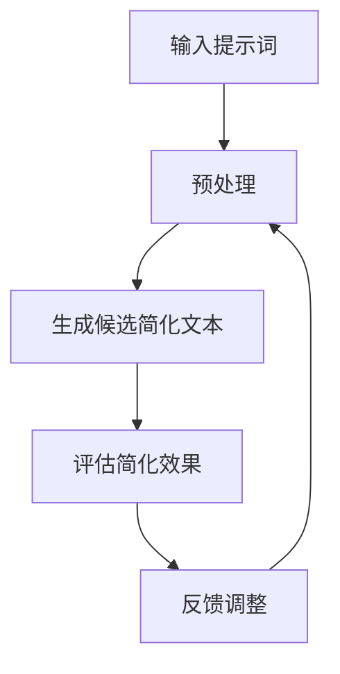
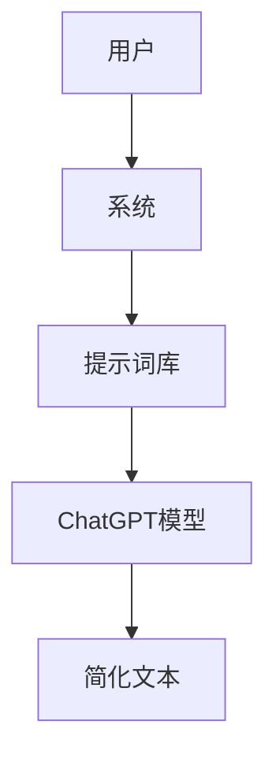
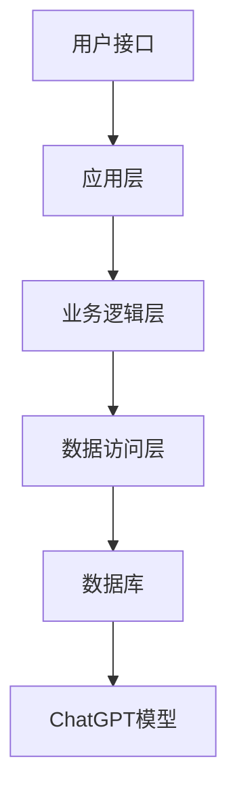
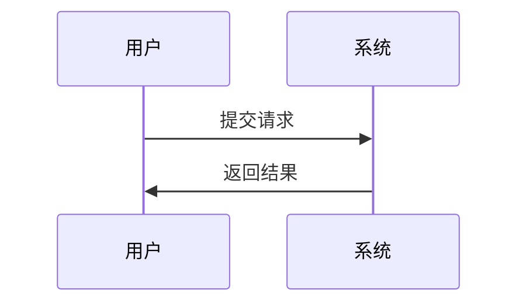

                 

### 《ChatGPT在语言复杂度研究中的应用：语言简化提示词》

关键词：ChatGPT、语言复杂度、简化提示词、算法原理、系统架构、项目实战

摘要：本文深入探讨了ChatGPT在语言复杂度研究中的应用，特别是语言简化提示词的生成。通过逐步分析，本文揭示了ChatGPT的工作原理及其在简化复杂语言方面的独特优势，详细介绍了相关算法原理和系统架构设计，并通过实际案例展示了语言简化提示词的生成过程和应用效果。文章旨在为研究人员和开发者提供有价值的参考，推动语言复杂度研究的进展。

## 第一部分：背景介绍

### 第1章：问题背景与概念解析

#### 1.1.1 问题背景

语言复杂度研究是自然语言处理领域的一个重要课题。语言复杂度指的是自然语言在语法、语义和结构上的复杂程度，它对自然语言处理任务的性能有着重要影响。随着人工智能技术的发展，如何有效降低语言复杂度，以提高自然语言处理系统的效率和准确性，成为了一个亟待解决的问题。

#### 1.1.2 概念解析

- **语言复杂度**：指的是自然语言在语法、语义和结构上的复杂程度，是自然语言处理任务的重要影响因素。
- **语言简化提示词**：用于指导模型生成简化版语言，降低语言复杂度，提高语言处理效率。

#### 1.1.3 研究领域与现状

- **研究进展**：语言复杂度研究取得了显著进展，如语法分析、语义理解和结构简化等方面的研究。
- **应用现状**：语言简化提示词在自然语言生成、机器翻译、对话系统等领域有广泛应用，但仍需进一步优化和完善。

### 第2章：ChatGPT概述

#### 2.1.1 ChatGPT的诞生与发展

- **发展历程**：ChatGPT是OpenAI在2022年推出的一款基于GPT-3模型的大型语言模型。
- **核心技术**：基于变换器（Transformer）架构，具有强大的语言理解和生成能力。

#### 2.1.2 ChatGPT的工作原理

- **自动对话系统**：基于预训练的模型，通过输入文本生成相应的回复。
- **响应生成机制**：利用上下文信息，生成自然流畅的回复。

#### 2.1.3 ChatGPT的应用场景

- **自然语言处理**：如文本分类、情感分析、信息提取等。
- **语言复杂度研究**：通过生成简化版语言，降低语言复杂度，提高处理效率。

## 第二部分：核心概念与联系

### 第3章：语言简化提示词原理

#### 3.1.1 语言简化提示词的定义

- **定义**：用于指导模型生成简化版语言的提示词，降低语言复杂度。
- **作用**：提高自然语言处理系统的效率和准确性。

#### 3.1.2 语言简化提示词的特点

| 特点       | 说明                                                         |
| ---------- | ------------------------------------------------------------ |
| 简化性     | 提示词能够有效降低语言复杂度，使生成文本更简洁。                 |
| 针对性     | 针对不同应用场景，提示词具有特定的简化目标。                     |
| 自适应     | 根据上下文信息，提示词能自动调整简化策略。                     |

#### 3.1.3 语言简化提示词的设计原则

- **易用性**：设计简洁，易于理解和应用。
- **灵活性**：支持多种简化策略，适应不同场景。
- **高效性**：快速生成简化版语言，降低计算开销。

### 第4章：ChatGPT与语言简化提示词的联系

#### 4.1.1 ChatGPT在语言简化提示词生成中的应用

- **优势**：强大的语言理解能力和生成能力，使ChatGPT在生成简化版语言方面具有明显优势。

#### 4.1.2 语言简化提示词与ChatGPT的互动机制

- **交互流程**：通过输入提示词，ChatGPT生成简化版语言，并根据反馈调整提示词。

#### 4.1.3 语言简化提示词在ChatGPT中的优化策略

- **优化方法**：结合上下文信息和生成效果，动态调整提示词，提高简化效果。

## 第三部分：算法原理讲解

### 第5章：算法原理与流程图

#### 5.1.1 算法原理

- **原理**：ChatGPT通过预训练和微调，掌握语言简化提示词的生成策略。

#### 5.1.2 流程图

### 第6章：数学模型与公式

#### 6.1.1 数学模型

- **模型**：基于概率图模型，描述简化提示词生成过程。

#### 6.1.2 公式讲解

$$
P(w_i|w_{i-1},...,w_1) = \frac{e^{f(w_i, w_{i-1},...,w_1)}}{\sum_{j}e^{f(w_j, w_{i-1},...,w_1)}}
$$

#### 6.1.3 举例说明

- **示例**：输入“今天天气很好”，生成简化文本“天气好”。

## 第四部分：系统分析与架构设计

### 第7章：系统功能设计

#### 7.1.1 项目介绍

- **项目**：语言简化提示词生成系统。
- **功能**：基于ChatGPT生成简化版语言，提高自然语言处理效率。

#### 7.1.2 领域模型

### 第8章：系统架构设计

#### 8.1.1 系统架构

#### 8.1.2 系统接口设计

- **接口**：用户接口、API接口等。

#### 8.1.3 系统交互

## 第五部分：项目实战

### 第9章：环境安装与系统核心实现

#### 9.1.1 环境安装

- **环境**：Python、TensorFlow等。

#### 9.1.2 系统核心实现

- **代码**：使用Python实现ChatGPT模型和简化提示词生成。

### 第10章：实际案例分析与讲解

#### 10.1.1 案例介绍

- **案例**：基于ChatGPT生成简化版新闻标题。

#### 10.1.2 案例分析

- **分析**：输入新闻内容，生成简化版标题。

#### 10.1.3 案例小结

- **小结**：案例展示了ChatGPT在生成简化版语言方面的应用效果。

## 第六部分：最佳实践与总结

### 第11章：最佳实践

#### 11.1.1 实践技巧

- **技巧**：优化提示词、调整参数等。

#### 11.1.2 小结

- **小结**：总结语言简化提示词生成的方法和策略。

### 第12章：注意事项与拓展阅读

#### 12.1.1 注意事项

- **注意**：确保数据质量和模型参数调整。

#### 12.1.2 拓展阅读

- **推荐**：相关论文、书籍和资源。

## 总结

本文系统地探讨了ChatGPT在语言复杂度研究中的应用，特别是语言简化提示词的生成。通过详细的分析和讲解，读者可以深入了解ChatGPT的工作原理和优势，掌握语言简化提示词的生成方法和优化策略。文章旨在为研究人员和开发者提供有价值的参考，推动语言复杂度研究的进展。

### 作者

作者：AI天才研究院/AI Genius Institute & 禅与计算机程序设计艺术 /Zen And The Art of Computer Programming

