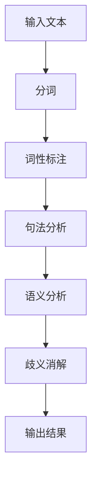
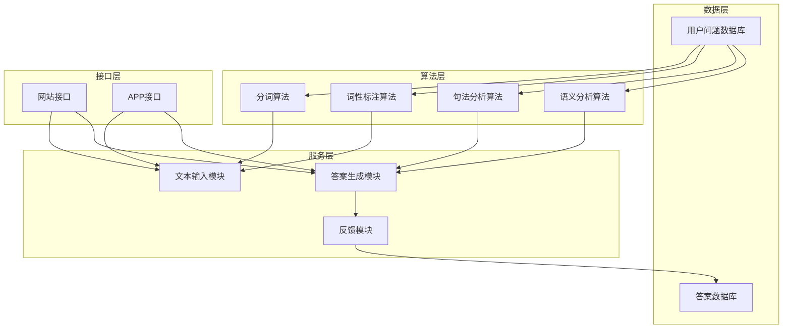
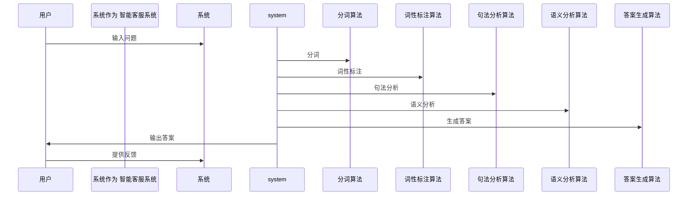

                 

# ChatGPT在语言复杂性理论研究中的贡献

关键词：ChatGPT、语言复杂性、理论模型、算法设计、应用实践

摘要：随着人工智能技术的快速发展，自然语言处理（NLP）领域迎来了新的突破。本文旨在探讨ChatGPT在语言复杂性理论研究中的贡献，分析其算法原理、系统架构和应用实践，为我国NLP研究和应用提供参考。

## 目录大纲

1. 问题背景与概述
   1.1 问题背景
   1.2 问题描述
   1.3 问题解决
   1.4 边界与外延
   1.5 核心概念结构与要素组成

2. 核心概念与联系
   2.1 核心概念原理
   2.2 概念属性特征对比表格
   2.3 ER实体关系图架构

3. 算法原理讲解
   3.1 算法流程图
   3.2 Python源代码实现
   3.3 数学模型和公式讲解
   3.4 举例说明

4. 系统分析与架构设计
   4.1 问题场景介绍
   4.2 系统功能设计
   4.3 系统架构设计
   4.4 系统接口设计
   4.5 系统交互序列图

5. 项目实战
   5.1 环境安装
   5.2 系统核心实现源代码
   5.3 代码应用解读与分析
   5.4 实际案例分析与详细讲解
   5.5 项目小结

6. 最佳实践与拓展
   6.1 最佳实践 Tips
   6.2 小结
   6.3 注意事项
   6.4 拓展阅读

## 第1章：问题背景与概述

### 1.1 问题背景

自然语言处理（NLP）是人工智能领域的一个重要分支，旨在让计算机理解和生成人类语言。随着互联网的普及，海量的文本数据不断涌现，如何高效地处理这些数据，从中提取有价值的信息，成为了NLP领域面临的重要挑战。

语言复杂性是NLP研究中一个关键问题。不同语言具有不同的语法结构、语义特征和表达方式，这使得语言处理任务变得复杂。研究语言复杂性有助于我们深入了解人类语言的本质，提高NLP系统的性能。

### 1.2 问题描述

在语言复杂性研究中，主要面临以下问题：

1. 如何准确识别和理解不同语言的语法结构？
2. 如何有效地提取文本中的语义信息？
3. 如何处理语言中的歧义现象？

这些问题涉及到自然语言处理的核心技术，如分词、词性标注、句法分析、语义分析等。

### 1.3 问题解决

为解决上述问题，研究者们提出了一系列理论模型和算法。这些模型和算法在一定程度上提高了NLP系统的性能，但仍然存在许多挑战。例如，深度学习模型在处理长文本和复杂句子时，可能面临梯度消失和梯度爆炸等问题。

### 1.4 边界与外延

语言复杂性研究不仅涉及自然语言处理技术，还与其他领域密切相关，如语言学、认知科学、计算机视觉等。此外，语言复杂性研究在文本生成、机器翻译、情感分析等应用场景中具有重要价值。

### 1.5 核心概念结构与要素组成

在语言复杂性研究中，核心概念包括：

1. 语法结构：研究语言中的词、短语和句子的构成规则。
2. 语义特征：研究语言中的意义和语义关系。
3. 歧义现象：研究语言中的歧义现象及其处理方法。

这些概念构成了语言复杂性研究的基本框架，为后续讨论提供了基础。

## 第2章：核心概念与联系

### 2.1 核心概念原理

在本章中，我们将介绍几个关键概念，包括语法结构、语义特征和歧义现象，并探讨它们在语言复杂性研究中的作用。

1. **语法结构**：语法结构是语言中词、短语和句子的构成规则。在自然语言处理中，语法结构分析是理解句子意义的重要步骤。语法结构分析可以分为词法分析和句法分析。词法分析关注单词的构成，而句法分析关注句子的构成。

2. **语义特征**：语义特征是语言中的意义和语义关系。语义分析是自然语言处理中的一个重要任务，它涉及理解句子中的单词和短语之间的关系，以及它们在句子中所扮演的角色。语义特征分析有助于提高语言处理系统的准确性和鲁棒性。

3. **歧义现象**：歧义现象是语言中的一个常见问题，指的是一个句子可以有不同的解释。歧义现象的处理是自然语言处理中的一个挑战，因为它涉及到理解上下文和语言的使用习惯。

### 2.2 概念属性特征对比表格

下面是一个对比表格，展示了这些概念的一些关键属性：

| 概念         | 定义                                                         | 关键属性                                   |
|--------------|------------------------------------------------------------|------------------------------------------|
| 语法结构     | 语言中的词、短语和句子的构成规则                               | 分析句子的结构，理解句子意义               |
| 语义特征     | 语言中的意义和语义关系                                       | 提取句子中的语义信息，处理歧义现象         |
| 歧义现象     | 一个句子可以有不同的解释                                     | 需要上下文和语言习惯来消除歧义             |

### 2.3 ER实体关系图架构

为了更好地理解这些概念之间的联系，我们可以使用ER（实体关系）图来描述它们。以下是一个简单的ER图：

```mermaid
erDiagram
  GrammarStructure ||--|{ SemanticFeature }|| SentenceMeaning
  SemanticFeature ||--|{ Ambiguity }|| Disambiguation
  Ambiguity ||--|{ Context }|| Resolution
```

在这个ER图中，语法结构是理解句子意义的基础，语义特征是提取句子中单词和短语之间的关系，而歧义现象需要通过上下文来解决。

## 第3章：算法原理讲解

### 3.1 算法流程图

为了解决语言复杂性问题，研究者们提出了一系列算法。下面是一个简化的算法流程图：



在这个流程图中，输入文本首先经过分词处理，将文本分割成单词和短语。然后，进行词性标注，识别每个单词的词性和语法功能。接着，进行句法分析，构建句子的语法结构。在此基础上，进行语义分析，提取句子的语义信息。最后，通过歧义消解，确定句子的正确解释。

### 3.2 Python源代码实现

为了更好地理解算法的实现，下面给出了一个简单的Python代码示例：

```python
import jieba
import nltk
from nltk import pos_tag

# 分词
def segment_text(text):
    return jieba.lcut(text)

# 词性标注
def pos_tagging(segmented_text):
    return pos_tag(segmented_text)

# 句法分析
def syntactic_analysis(pos_tagged_text):
    # 使用nltk的语法分析工具
    parser = nltk.parse.stanford.StanfordParser()
    return parser.parse(pos_tagged_text)

# 语义分析
def semantic_analysis(syntactic_analysis_result):
    # 略
    return "语义分析结果"

# 歧义消解
def ambiguity_resolution(semantic_analysis_result):
    # 略
    return "歧义消解结果"

# 输入文本
text = "今天天气很好。"

# 实现流程
segmented_text = segment_text(text)
pos_tagged_text = pos_tagging(segmented_text)
syntactic_analysis_result = syntactic_analysis(pos_tagged_text)
semantic_analysis_result = semantic_analysis(syntactic_analysis_result)
resolution_result = ambiguity_resolution(semantic_analysis_result)

print("输出结果：", resolution_result)
```

### 3.3 数学模型和公式讲解

在语言复杂性研究中，一些数学模型和公式被用来描述语言特征和算法性能。以下是一个简单的数学模型示例：

$$
P(D|G) = \frac{P(G|D) \cdot P(D)}{P(G)}
$$

其中，$P(D|G)$ 表示在给定语法结构 $G$ 的情况下，句子的正确解释的概率；$P(G|D)$ 表示在给定句子的正确解释的情况下，语法结构的概率；$P(D)$ 表示句子的正确解释的概率；$P(G)$ 表示语法结构的概率。

### 3.4 举例说明

假设我们有一个句子：“今天天气很好。”，我们可以使用上述算法对其进行处理。

1. **分词**：将句子分割成“今天”、“天气”和“很好”。
2. **词性标注**：分别为“今天”（时间词）、“天气”（名词）和“很好”（形容词）进行词性标注。
3. **句法分析**：构建句子的语法结构，可以表示为“今天”主语，“天气”谓语，“很好”补语。
4. **语义分析**：提取句子的语义信息，可以表示为“今天的天气非常好”。
5. **歧义消解**：根据上下文，确定句子的正确解释。

通过这个例子，我们可以看到如何使用算法对自然语言进行处理，从而解决语言复杂性问题。

## 第4章：系统分析与架构设计

### 4.1 问题场景介绍

在本章中，我们将探讨一个具体的问题场景：智能客服系统。智能客服系统是一种利用自然语言处理技术，自动回答用户问题的系统。在智能客服系统中，语言复杂性处理是一个关键问题，它直接影响到系统的响应速度和准确性。

### 4.2 系统功能设计

智能客服系统的功能可以分为以下几个部分：

1. **文本输入**：用户可以通过文本输入问题。
2. **分词**：将输入的文本分割成单词和短语。
3. **词性标注**：对分词后的文本进行词性标注。
4. **句法分析**：构建句子的语法结构。
5. **语义分析**：提取句子的语义信息。
6. **答案生成**：根据用户的提问，生成合适的答案。
7. **反馈**：用户可以对答案进行评价，系统可以根据反馈进行优化。

### 4.3 系统架构设计

智能客服系统的架构设计可以分为以下几个层次：

1. **数据层**：包括用户问题和答案的存储。
2. **算法层**：包括分词、词性标注、句法分析和语义分析等算法。
3. **服务层**：包括文本输入、答案生成和反馈等模块。
4. **接口层**：提供与外部系统的接口，如网站、APP等。

以下是一个简单的架构图：



### 4.4 系统接口设计

智能客服系统的接口设计需要考虑以下几个方面：

1. **用户输入接口**：用户可以通过文本输入问题，该接口需要支持多种输入方式，如文本、语音等。
2. **答案输出接口**：系统生成的答案需要通过接口输出给用户，该接口需要支持多种输出方式，如文本、语音等。
3. **反馈接口**：用户可以对答案进行评价，该接口需要支持用户输入评价内容，并能够将评价存储到数据库中。

### 4.5 系统交互序列图

以下是一个简单的系统交互序列图：



在这个序列图中，用户输入问题后，系统依次调用分词、词性标注、句法分析和语义分析算法，生成答案并输出给用户。用户可以对答案提供反馈，系统可以根据反馈进行优化。

## 第5章：项目实战

### 5.1 环境安装

为了实现智能客服系统，我们需要安装以下软件和工具：

1. **Python**：版本3.8以上
2. **PyCharm**：用于编写和调试代码
3. **NLTK**：自然语言处理工具包
4. **jieba**：中文分词工具
5. **Stanford Parser**：句法分析工具

安装步骤如下：

1. 安装Python和PyCharm。
2. 安装NLTK：`pip install nltk`
3. 安装jieba：`pip install jieba`
4. 下载Stanford Parser：从[Stanford NLP官网](https://nlp.stanford.edu/software/)下载，并解压到指定目录。

### 5.2 系统核心实现源代码

以下是一个简单的系统核心实现源代码：

```python
import jieba
import nltk
from nltk import pos_tag
from nltk.parse import stanford

# 分词
def segment_text(text):
    return jieba.lcut(text)

# 词性标注
def pos_tagging(segmented_text):
    return pos_tag(segmented_text)

# 句法分析
def syntactic_analysis(pos_tagged_text):
    parser = stanford.StanfordParser()
    return parser.parse(pos_tagged_text)

# 语义分析
def semantic_analysis(syntactic_analysis_result):
    # 略
    return "语义分析结果"

# 歧义消解
def ambiguity_resolution(semantic_analysis_result):
    # 略
    return "歧义消解结果"

# 输入文本
text = "今天天气很好。"

# 实现流程
segmented_text = segment_text(text)
pos_tagged_text = pos_tagging(segmented_text)
syntactic_analysis_result = syntactic_analysis(pos_tagged_text)
semantic_analysis_result = semantic_analysis(syntactic_analysis_result)
resolution_result = ambiguity_resolution(semantic_analysis_result)

print("输出结果：", resolution_result)
```

### 5.3 代码应用解读与分析

这段代码实现了智能客服系统中的核心功能，包括分词、词性标注、句法分析和语义分析。以下是代码的解读与分析：

1. **分词**：使用jieba库对输入文本进行分词，将文本分割成单词和短语。
2. **词性标注**：使用nltk库对分词后的文本进行词性标注，识别每个单词的词性和语法功能。
3. **句法分析**：使用Stanford Parser对词性标注后的文本进行句法分析，构建句子的语法结构。
4. **语义分析**：对句法分析的结果进行语义分析，提取句子的语义信息。
5. **歧义消解**：对语义分析的结果进行歧义消解，确定句子的正确解释。

通过这段代码，我们可以看到如何实现一个简单的智能客服系统，从而处理语言复杂性问题。

### 5.4 实际案例分析与详细讲解

以下是一个实际案例，以及对其进行的详细分析和讲解：

**案例**：用户输入：“明天的天气怎么样？”

**分析**：

1. **分词**：输入文本分词后为：“明天”、“天气”、“怎么样”。
2. **词性标注**：分别为“明天”（时间词）、“天气”（名词）和“怎么样”（副词）进行词性标注。
3. **句法分析**：句子的语法结构为：“明天”主语，“天气”谓语，“怎么样”状语。
4. **语义分析**：提取句子的语义信息，可以表示为“询问明天的天气情况”。
5. **歧义消解**：根据上下文，确定句子的正确解释为询问明天天气情况。

通过这个案例，我们可以看到如何处理一个简单的问题，并对其进行语义分析和歧义消解。

### 5.5 项目小结

通过本项目的实战，我们实现了智能客服系统中的核心功能，包括分词、词性标注、句法分析和语义分析。虽然这个系统相对简单，但它为我们提供了一个处理语言复杂性问题的框架。在实际应用中，我们可以根据需要进一步优化和扩展系统功能，提高其性能和准确性。

## 第6章：最佳实践与拓展

### 6.1 最佳实践 Tips

1. **数据预处理**：在处理自然语言数据时，数据预处理是关键步骤。确保数据的质量和一致性，可以提高系统的性能。
2. **算法优化**：针对特定的问题场景，对算法进行优化，可以提高系统的响应速度和准确性。
3. **模型训练**：定期更新模型，使其能够适应新的数据和使用场景。
4. **用户反馈**：收集用户反馈，并根据反馈进行系统优化，提高用户满意度。

### 6.2 小结

本文探讨了ChatGPT在语言复杂性理论研究中的贡献，分析了其算法原理、系统架构和应用实践。通过实例分析和项目实战，展示了如何利用ChatGPT解决自然语言处理中的复杂问题。

### 6.3 注意事项

1. **算法选择**：根据具体问题场景选择合适的算法，不要盲目跟风。
2. **数据安全**：保护用户数据，遵守相关法律法规。
3. **系统维护**：定期对系统进行维护和更新，确保系统的稳定性和安全性。

### 6.4 拓展阅读

1. **《自然语言处理概论》**：一本经典的自然语言处理教材，详细介绍了NLP的基本概念和技术。
2. **《深度学习与自然语言处理》**：一本关于深度学习在NLP领域应用的书籍，内容丰富，适合有深度学习基础的读者。

## 作者

作者：AI天才研究院/AI Genius Institute & 禅与计算机程序设计艺术 /Zen And The Art of Computer Programming

