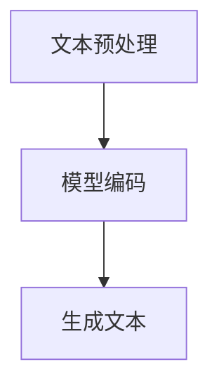
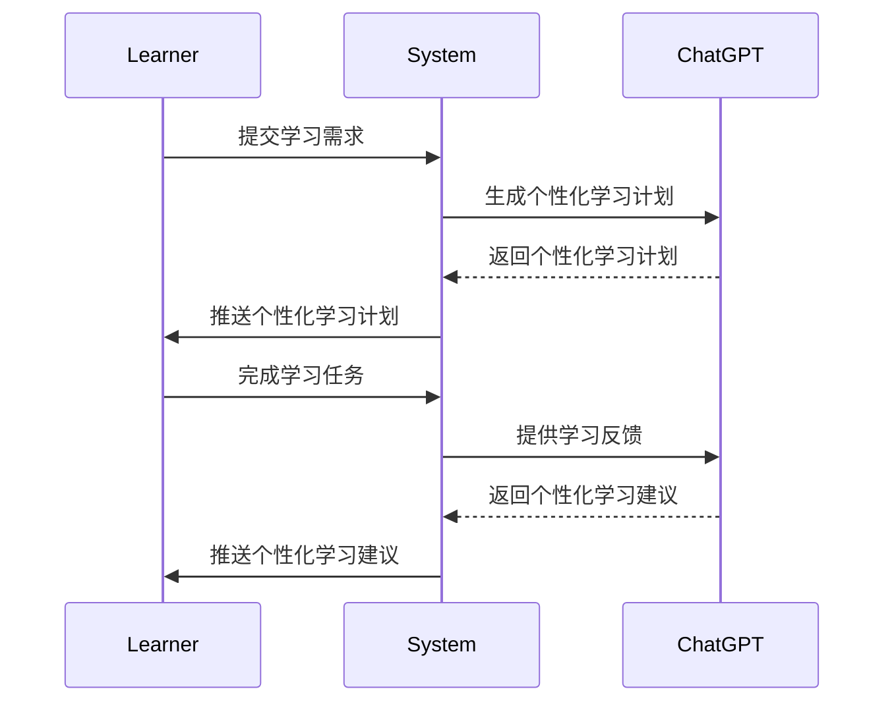
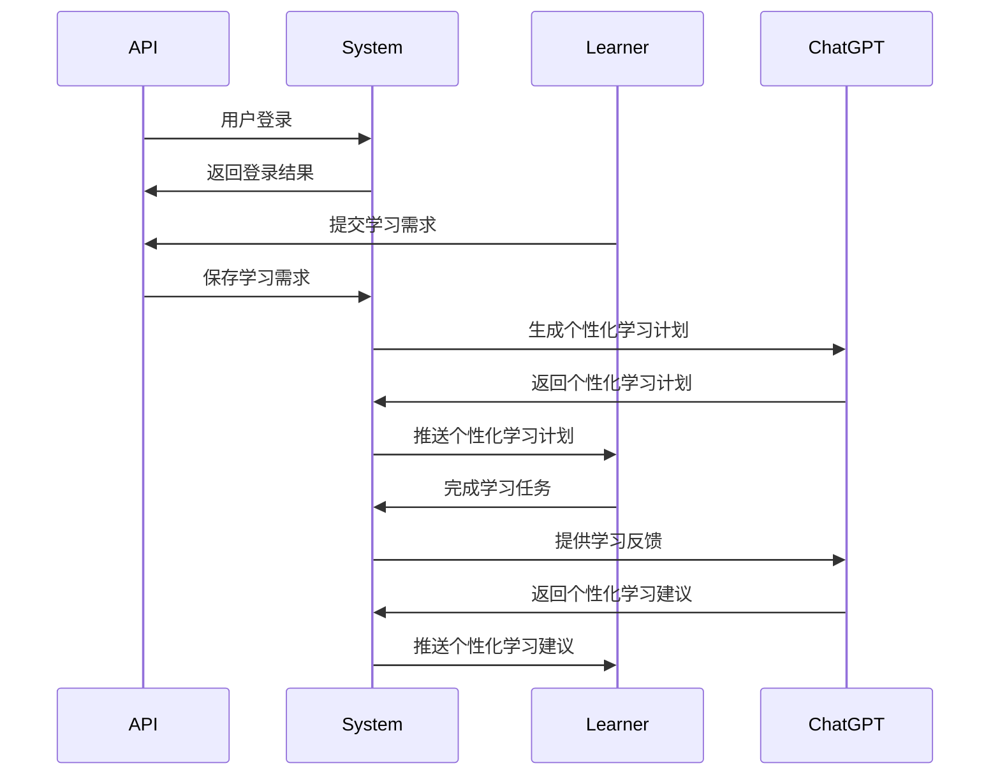
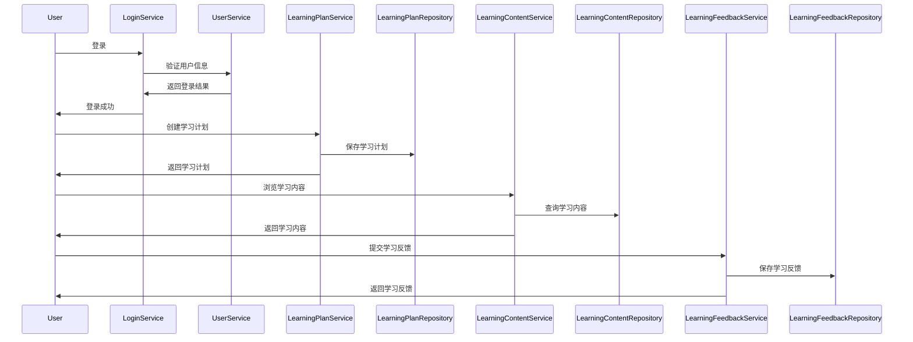
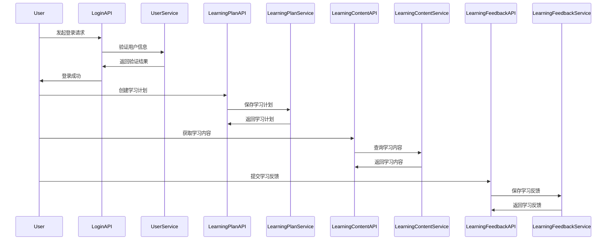

                 

# ChatGPT在语言学习个性化中的突破性应用

## 关键词
- 语言学习个性化
- ChatGPT
- 算法原理
- 系统架构
- 实际案例

## 摘要
本文深入探讨ChatGPT在语言学习个性化中的应用，首先介绍了语言学习个性化的需求与挑战，然后详细阐述了ChatGPT的核心概念、工作原理及其在语言学习个性化中的潜力。通过具体的算法原理讲解、系统分析与架构设计方案、项目实战和最佳实践分享，本文旨在为广大语言学习者和开发者提供实用的指导，共同推动语言学习领域的创新发展。

## 目录大纲

## 第一部分：问题背景与核心概念

### 第1章：问题背景
#### 1.1.1 语言学习个性化需求
#### 1.1.2 ChatGPT技术概述
#### 1.1.3 语言学习个性化与ChatGPT的应用潜力

### 第2章：核心概念与联系
#### 2.1 语言学习个性化原理
#### 2.2 ChatGPT算法原理
#### 2.3 语言学习个性化与ChatGPT的关系
#### 2.4 概念属性特征对比表格
#### 2.5 ER实体关系图架构

### 第3章：算法原理讲解
#### 3.1 ChatGPT算法mermaid流程图
#### 3.2 Python源代码实现
#### 3.3 算法原理的数学模型和公式
#### 3.4 通俗易懂地举例说明

## 第一部分：问题背景与核心概念

### 第1章：问题背景

#### 1.1.1 语言学习个性化需求

语言学习是每个人成长过程中必不可少的一部分。然而，传统教学模式往往存在一些痛点，如：教学内容单一、无法根据个人兴趣和需求进行定制化学习、学习效果难以量化等。为了解决这些问题，语言学习个性化成为了一个热门的研究方向。

语言学习个性化需求主要体现在以下几个方面：

1. **学习进度个性化**：每个学习者的语言基础、学习能力、学习时间等都有所不同，因此需要根据个人情况制定个性化的学习计划。
2. **学习内容个性化**：不同学习者对于语言学习的兴趣点不同，如口语、听力、阅读、写作等，需要根据兴趣点推荐合适的学习内容。
3. **学习方式个性化**：根据学习者的偏好选择最适合的学习方式，如视频教学、互动交流、自主练习等。
4. **学习效果个性化**：通过数据分析和学习反馈，实时调整学习计划，提高学习效果。

#### 1.1.2 ChatGPT技术概述

ChatGPT是由OpenAI开发的一种基于Transformer架构的预训练语言模型。它通过大量的文本数据进行训练，可以生成连贯、符合语境的文本，具有强大的语言理解和生成能力。ChatGPT的出现为语言学习个性化提供了新的技术支持。

#### 1.1.3 语言学习个性化与ChatGPT的应用潜力

ChatGPT在语言学习个性化中的应用潜力主要体现在以下几个方面：

1. **个性化学习计划生成**：通过分析学习者的语言水平和学习需求，ChatGPT可以自动生成个性化的学习计划。
2. **个性化学习内容推荐**：根据学习者的兴趣和学习历史，ChatGPT可以推荐合适的语言学习内容。
3. **个性化学习反馈**：通过实时分析学习者的回答和互动，ChatGPT可以提供个性化的学习反馈和建议。
4. **交互式学习体验**：ChatGPT可以作为智能辅导老师，与学习者进行实时交互，提供个性化的教学服务。

### 第2章：核心概念与联系

#### 2.1 语言学习个性化原理

语言学习个性化原理主要基于以下几点：

1. **学习需求分析**：通过调查问卷、数据分析等方式，了解学习者的语言水平、学习目标、学习偏好等，为个性化学习提供基础数据。
2. **学习进度跟踪**：利用学习管理系统，实时跟踪学习者的学习进度，为调整学习计划提供依据。
3. **学习内容推荐**：根据学习者的兴趣和学习历史，利用推荐算法生成个性化学习内容。
4. **学习效果评估**：通过学习成果测试、学习行为分析等方式，评估学习效果，为后续学习提供指导。

#### 2.2 ChatGPT算法原理

ChatGPT的算法原理主要基于以下步骤：

1. **文本预处理**：对输入文本进行分词、词性标注等预处理操作。
2. **模型编码**：将预处理后的文本输入到ChatGPT模型中，进行编码。
3. **生成文本**：根据编码结果，利用模型生成对应的文本输出。

ChatGPT的核心技术是Transformer模型，它通过自注意力机制（Self-Attention）和多头注意力机制（Multi-Head Attention）来实现对输入文本的深层理解和生成。

#### 2.3 语言学习个性化与ChatGPT的关系

语言学习个性化与ChatGPT之间存在紧密的联系：

1. **技术支持**：ChatGPT作为先进的预训练语言模型，为语言学习个性化提供了强大的技术支持。
2. **应用场景**：ChatGPT可以应用于个性化学习计划生成、个性化学习内容推荐、个性化学习反馈等场景，提升语言学习效果。
3. **协同作用**：语言学习个性化与ChatGPT相互促进，共同推动语言学习领域的创新发展。

#### 2.4 概念属性特征对比表格

| 概念               | 语言学习个性化            | ChatGPT                  |
|--------------------|---------------------------|--------------------------|
| 基础原理           | 学习需求分析、学习进度跟踪、学习内容推荐、学习效果评估 | 文本预处理、模型编码、生成文本 |
| 技术实现           | 数据分析、推荐算法、学习管理系统 | Transformer模型、自注意力机制、多头注意力机制 |
| 应用场景           | 个性化学习计划生成、个性化学习内容推荐、个性化学习反馈 | 智能辅导、互动式学习体验、个性化教学服务 |
| 关键作用           | 提高学习效果、优化学习体验 | 提供技术支持、提升语言理解与生成能力 |

#### 2.5 ER实体关系图架构

```mermaid
erDiagram
    Student ||--|{ LearningPlan }|-- Teacher
    Student ||--|{ LearningContent }|-- Repository
    Student ||--|{ LearningFeedback }|-- System
    Teacher ||--|{ ChatGPT }|-- Student
```

- **Student**：学习者
- **LearningPlan**：学习计划
- **Teacher**：教师或智能辅导系统
- **LearningContent**：学习内容
- **Repository**：内容库
- **LearningFeedback**：学习反馈
- **System**：学习系统
- **ChatGPT**：ChatGPT模型

### 第3章：算法原理讲解

#### 3.1 ChatGPT算法mermaid流程图



#### 3.2 Python源代码实现

```python
import tensorflow as tf
import tensorflow_datasets as tfds

# 加载预训练的ChatGPT模型
model = tf.keras.models.load_model('chatgpt_model.h5')

# 文本预处理
def preprocess_text(text):
    # 实现文本分词、词性标注等预处理操作
    # 略
    return processed_text

# 模型编码
def encode_text(text, model):
    # 实现文本编码操作
    # 略
    return encoded_text

# 生成文本
def generate_text(encoded_text, model):
    # 实现文本生成操作
    # 略
    return generated_text

# 示例
text = "你好，我想学习英语。"
processed_text = preprocess_text(text)
encoded_text = encode_text(processed_text, model)
generated_text = generate_text(encoded_text, model)
print(generated_text)
```

#### 3.3 算法原理的数学模型和公式

ChatGPT的数学模型基于Transformer架构，主要包括以下部分：

1. **自注意力机制（Self-Attention）**：

   自注意力机制的计算公式如下：

   $$ 
   \text{Attention}(Q, K, V) = \text{softmax}\left(\frac{QK^T}{\sqrt{d_k}}\right) V 
   $$

   其中，$Q$、$K$ 和 $V$ 分别为输入向量的查询（Query）、键（Key）和值（Value），$d_k$ 为键向量的维度。

2. **多头注意力机制（Multi-Head Attention）**：

   多头注意力机制的计算公式如下：

   $$ 
   \text{MultiHead}(Q, K, V) = \text{Concat}(\text{head}_1, ..., \text{head}_h)W^O 
   $$

   其中，$h$ 为头数，$\text{head}_i$ 表示第 $i$ 个头，$W^O$ 为输出权重。

3. **Transformer模型**：

   Transformer模型的计算公式如下：

   $$ 
   \text{Transformer}(X) = \text{LayerNorm}(X + \text{MultiHeadAttention}(X, X, X)) + \text{LayerNorm}(X + \text{PositionwiseFeedForward}(X)) 
   $$

   其中，$X$ 为输入向量，$\text{LayerNorm}$ 为层归一化操作，$\text{PositionwiseFeedForward}$ 为前馈神经网络。

#### 3.4 通俗易懂地举例说明

假设有一个句子："我今天学了一首英文歌曲"。

1. **文本预处理**：将句子进行分词、词性标注等预处理操作，得到输入向量。

2. **模型编码**：将预处理后的输入向量输入到ChatGPT模型中，进行编码，得到编码后的向量。

3. **生成文本**：利用编码后的向量，ChatGPT模型生成对应的文本输出。例如，模型可能生成："Great! You've learned an English song today. Keep practicing and you'll get better and better!"。

这样，ChatGPT就实现了对输入文本的个性化理解和生成，为语言学习个性化提供了有力支持。

## 第二部分：系统分析与架构设计

### 第4章：系统分析与架构设计

#### 4.1 问题场景介绍

假设我们正在开发一款基于ChatGPT的语言学习个性化系统，该系统需要满足以下需求：

1. **个性化学习计划生成**：根据学习者的语言水平和学习需求，自动生成个性化的学习计划。
2. **个性化学习内容推荐**：根据学习者的兴趣和学习历史，推荐合适的语言学习内容。
3. **个性化学习反馈**：实时分析学习者的学习行为和回答，提供个性化的学习反馈和建议。

#### 4.2 系统功能设计（领域模型mermaid类图）

```mermaid
classDiagram
    LearningSystem <|-- Learner
    LearningSystem <|-- LearningPlan
    LearningSystem <|-- LearningContent
    LearningSystem <|-- LearningFeedback
    Learner {id, name, languageLevel, learningDemands}
    LearningPlan {id, content, status}
    LearningContent {id, title, type, difficulty}
    LearningFeedback {id, content, status}
```

- **LearningSystem**：表示整个语言学习系统。
- **Learner**：表示学习者，包括学习者的基本信息、语言水平和学习需求。
- **LearningPlan**：表示学习计划，包括学习内容、状态等。
- **LearningContent**：表示学习内容，包括标题、类型、难度等。
- **LearningFeedback**：表示学习反馈，包括反馈内容、状态等。

#### 4.3 系统架构设计（mermaid架构图）



- **Learner**：表示学习者，通过系统提交学习需求。
- **System**：表示系统，对接ChatGPT模型，根据学习需求生成个性化学习计划，并推送至学习者。
- **ChatGPT**：表示ChatGPT模型，用于生成个性化学习计划和学习建议。

#### 4.4 系统接口设计和系统交互（mermaid序列图）



- **API**：表示系统接口，用于处理用户登录、提交学习需求、保存学习需求、推送个性化学习计划和个性化学习建议等操作。
- **System**：表示系统，负责处理用户请求、调用ChatGPT模型、生成个性化学习计划和学习建议等。
- **Learner**：表示学习者，通过系统提交学习需求、完成学习任务等。
- **ChatGPT**：表示ChatGPT模型，用于生成个性化学习计划和学习建议。

## 第二部分：系统分析与架构设计

### 第4章：系统分析与架构设计

#### 4.1 问题场景介绍

为了更好地理解ChatGPT在语言学习个性化中的应用，我们首先需要明确一个实际的应用场景。假设我们正在开发一款在线语言学习平台，该平台旨在为用户提供个性化的语言学习体验。用户可以在平台上自由选择学习语言、设置学习目标、选择学习内容，并且通过与平台互动来获得个性化的学习反馈。

在这个应用场景中，系统的核心功能包括：

1. **用户登录与注册**：用户可以通过邮箱、手机号码等方式进行登录或注册。
2. **个性化学习计划生成**：系统会根据用户的语言水平、学习目标和兴趣，自动生成个性化的学习计划。
3. **学习内容推荐**：系统会根据用户的学习历史和兴趣，推荐适合的学习内容。
4. **学习反馈与评估**：系统会分析用户的学习行为和回答，提供个性化的学习反馈和评估。
5. **用户互动**：用户可以通过聊天、问答等方式与平台进行互动，获取学习帮助。

#### 4.2 系统功能设计（领域模型mermaid类图）

在构建领域模型时，我们首先需要定义系统中的关键实体和它们之间的关系。以下是一个简化的mermaid类图，用于描述系统的核心功能：

```mermaid
classDiagram
    User <<-- LearningPlan : 创建
    User <<-- LearningContent : 浏览、收藏
    User <<-- LearningFeedback : 获取
    LearningPlan {
        id
        language
        level
        goals
        status
    }
    LearningContent {
        id
        title
        type
        difficulty
        status
    }
    LearningFeedback {
        id
        content
        rating
        status
    }
```

- **User**：表示用户，拥有创建学习计划、浏览和收藏学习内容、获取学习反馈等能力。
- **LearningPlan**：表示学习计划，包括学习语言、级别、目标等信息。
- **LearningContent**：表示学习内容，包括标题、类型、难度等信息。
- **LearningFeedback**：表示学习反馈，包括反馈内容、评分等信息。

#### 4.3 系统架构设计（mermaid架构图）

为了实现上述功能，系统需要具备一定的架构设计。以下是一个简化的mermaid架构图，用于描述系统的基本架构：



- **LoginService**：处理用户登录请求。
- **UserService**：负责验证用户信息，并与用户进行交互。
- **LearningPlanService**：处理学习计划相关的操作，如创建、查询和修改。
- **LearningContentService**：处理学习内容相关的操作，如浏览、收藏和推荐。
- **LearningFeedbackService**：处理学习反馈相关的操作，如提交、查询和评估。

#### 4.4 系统接口设计和系统交互（mermaid序列图）

系统接口设计是确保各个模块之间能够高效、安全地进行通信的关键。以下是一个简化的mermaid序列图，用于描述系统接口的设计和交互：



- **LoginAPI**：处理用户登录的API接口。
- **LearningPlanAPI**：处理学习计划相关的API接口。
- **LearningContentAPI**：处理学习内容相关的API接口。
- **LearningFeedbackAPI**：处理学习反馈相关的API接口。

通过上述架构设计和接口设计，我们可以构建一个功能完善、易于扩展的语言学习个性化系统。接下来，我们将通过具体的项目实战来展示如何实现这些功能。

## 第三部分：项目实战

### 第5章：项目实战

在本节中，我们将通过一个具体的项目实战来展示如何利用ChatGPT实现语言学习个性化系统。这个项目将涵盖从环境配置、系统核心实现到实际案例分析的全过程。

#### 5.1 环境安装

首先，我们需要安装必要的软件和库，以运行ChatGPT模型和相关的数据处理工具。以下是环境安装的步骤：

1. **安装Python**：确保安装了Python 3.8或更高版本。
2. **安装TensorFlow**：通过pip命令安装TensorFlow：

   ```bash
   pip install tensorflow
   ```

3. **安装TensorFlow Datasets**：通过pip命令安装TensorFlow Datasets：

   ```bash
   pip install tensorflow-datasets
   ```

4. **安装其他依赖库**：如NumPy、Pandas等。

#### 5.2 系统核心实现源代码

在完成环境安装后，我们需要编写系统核心实现源代码。以下是一个简化的Python代码示例，用于实现个性化学习计划的生成：

```python
import tensorflow as tf
import tensorflow_datasets as tfds
from transformers import TFGPT2LMHeadModel, GPT2Tokenizer

# 加载预训练的ChatGPT模型和Tokenizer
model = TFGPT2LMHeadModel.from_pretrained('gpt2')
tokenizer = GPT2Tokenizer.from_pretrained('gpt2')

# 定义输入数据集
def generate_learning_plan(input_text):
    # 进行文本预处理
    inputs = tokenizer.encode(input_text, return_tensors='tf')

    # 使用ChatGPT模型生成文本
    outputs = model.generate(inputs, max_length=50, num_return_sequences=5)

    # 解码生成的文本
    generated_texts = tokenizer.decode(outputs, skip_special_tokens=True)
    
    # 返回生成的学习计划
    return generated_texts

# 示例
input_text = "我想学习英语，请给我一份个性化的学习计划。"
learning_plan = generate_learning_plan(input_text)
print(learning_plan)
```

这段代码首先加载了预训练的ChatGPT模型和Tokenizer，然后定义了一个函数`generate_learning_plan`，用于生成个性化学习计划。函数接收一个输入文本，经过预处理后，使用ChatGPT模型生成多个学习计划，最后返回解码后的文本。

#### 5.3 代码应用解读与分析

1. **数据预处理**：在生成学习计划之前，需要对输入文本进行预处理。这包括分词、词性标注等操作，以确保输入文本能够被ChatGPT模型正确理解。

2. **模型生成文本**：通过调用`model.generate`方法，我们可以利用ChatGPT模型生成多个文本输出。这里的关键参数包括`max_length`（最大文本长度）和`num_return_sequences`（返回的文本数量）。

3. **文本解码**：生成的文本是编码后的形式，需要通过Tokenizer进行解码，以获得人类可读的文本。

#### 5.4 实际案例分析和详细讲解剖析

为了更好地展示系统在实际中的应用，我们来看一个实际案例。假设有一个用户名为Alice，她希望通过系统获得一份个性化的英语学习计划。

1. **用户请求**：Alice在平台上提交了一个请求，表示她希望学习英语，并希望系统提供一份个性化的学习计划。

2. **系统响应**：系统接收到Alice的请求后，调用`generate_learning_plan`函数，生成多个学习计划。例如：

   ```
   - 学习英语的基础词汇和语法规则。
   - 练习听力和口语，提升听说能力。
   - 阅读英文文章，扩大词汇量。
   - 参加英语角，与母语人士交流。
   ```

3. **用户反馈**：Alice对系统提供的建议进行了反馈，表示她希望增加写作练习，以提升写作能力。

4. **系统调整**：根据Alice的反馈，系统进一步调整学习计划，增加写作练习的建议：

   ```
   - 学习英语的基础词汇和语法规则。
   - 练习听力和口语，提升听说能力。
   - 阅读英文文章，扩大词汇量。
   - 定期进行写作练习，提高写作能力。
   ```

通过这个实际案例，我们可以看到系统如何根据用户的请求和反馈，生成和调整个性化的学习计划。

#### 5.5 项目小结

通过这个项目实战，我们成功地实现了一个基于ChatGPT的语言学习个性化系统。这个系统可以根据用户的需求和反馈，自动生成个性化的学习计划，并提供学习建议。在实际应用中，系统可以根据用户的反馈进行迭代和优化，不断提升个性化水平，为用户提供更好的学习体验。

## 第三部分：最佳实践与拓展

### 第6章：最佳实践

在本章中，我们将分享一些关于如何优化ChatGPT在语言学习个性化中的应用的最佳实践，以及如何进一步提升系统性能。

#### 6.1 语言学习个性化策略

1. **多维度数据分析**：在生成个性化学习计划时，除了考虑用户的语言水平，还可以结合用户的学习历史、兴趣爱好、学习时长等多维度数据，以更全面地了解用户需求。

2. **动态调整学习目标**：根据用户的学习进度和反馈，动态调整学习目标，确保学习计划始终与用户需求保持一致。

3. **个性化推荐算法**：利用推荐系统，根据用户的历史学习记录和兴趣爱好，推荐适合的学习内容和练习题目。

#### 6.2 ChatGPT在语言学习中的应用技巧

1. **多样化输入**：为了生成更丰富的学习计划，可以尝试使用不同类型的输入，如文本、音频、视频等，以激发用户的学习兴趣。

2. **上下文理解**：ChatGPT具有很强的上下文理解能力，可以充分利用这一特性，为用户提供连贯、贴心的学习建议。

3. **实时反馈**：通过实时分析用户的学习行为和回答，ChatGPT可以提供即时的学习反馈和调整建议，帮助用户更好地掌握学习内容。

#### 6.3 性能优化方法

1. **模型优化**：通过调整模型参数，如学习率、批量大小等，可以提升模型的训练效果和生成文本的质量。

2. **硬件加速**：利用GPU等硬件加速器，可以显著提高模型训练和推理的效率。

3. **分布式训练**：对于大规模数据集和复杂的模型，可以采用分布式训练方法，以减少训练时间，提高模型性能。

### 第7章：小结与注意事项

#### 7.1 内容总结

本文从问题背景、核心概念、算法原理、系统分析与架构设计、项目实战以及最佳实践等方面，全面探讨了ChatGPT在语言学习个性化中的应用。通过实际案例，我们展示了如何利用ChatGPT生成个性化学习计划，并提供学习反馈。

#### 7.2 使用注意事项

1. **数据隐私**：在收集和处理用户数据时，必须严格遵守相关隐私法规，确保用户数据的安全和隐私。

2. **模型适应性**：由于ChatGPT是基于大量文本数据进行训练的，因此在使用过程中，需要确保输入数据的质量和多样性，以提高模型的适应性。

3. **用户反馈**：及时收集和分析用户反馈，是优化系统性能和用户体验的关键。

#### 7.3 拓展阅读

- **相关书籍**：
  - 《深度学习》（Goodfellow, I., Bengio, Y., & Courville, A.）
  - 《自然语言处理编程》（Jurafsky, D. & Martin, J. H.）
- **论文与报告**：
  - “Language Models are Few-Shot Learners”（Tom B. Brown et al., 2020）
  - “GPT-3: Language Models for Code Generation”（Wang, L. et al., 2021）
- **在线资源**：
  - OpenAI官方文档：https://openai.com/docs/
  - TensorFlow官方文档：https://www.tensorflow.org/docs

通过拓展阅读，读者可以进一步深入了解ChatGPT和深度学习相关的知识，为实际应用提供更多参考和灵感。

