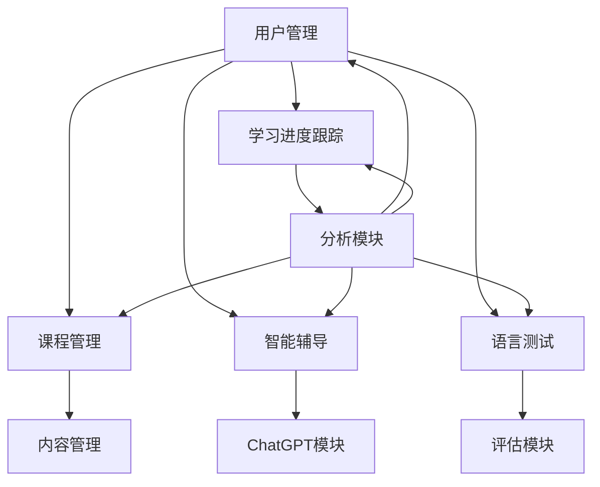
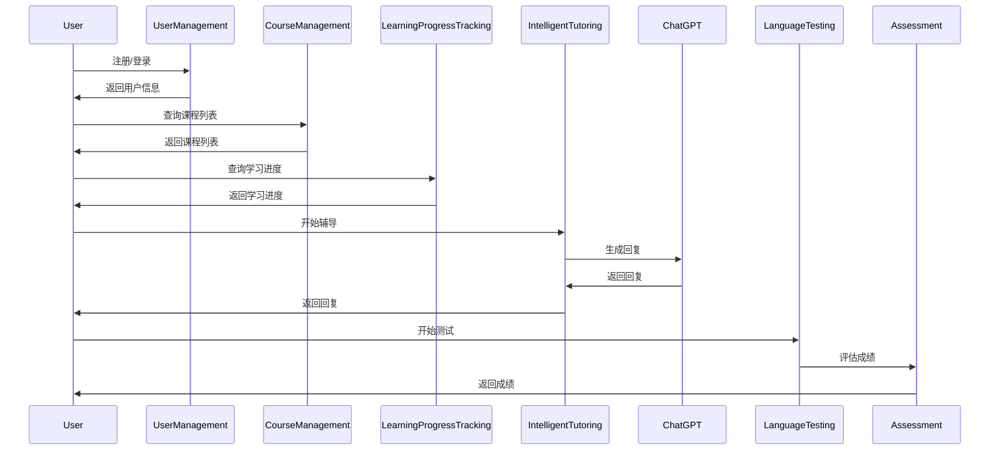

                 

## 第1章：问题背景与核心概念

### 1.1 问题背景

语言学习动机是语言学习过程中至关重要的因素。研究表明，动机直接影响学习效果和语言习得的速度。传统语言学习方式通常依赖于教科书、课堂讲授和模仿练习，但这些方法往往难以激发学生的学习兴趣和积极性，导致学习效率不高。随着技术的进步，人工智能（AI）在语言学习中的应用逐渐受到关注，尤其是ChatGPT等自然语言处理（NLP）技术，为增强语言学习动机提供了新的可能性。

在语言学习过程中，学生可能会面临多种挑战，例如缺乏学习动力、语言环境不足、学习进度缓慢等。这些挑战往往会导致学生的学习兴趣下降，从而影响其语言能力的提升。因此，如何有效增强学生的语言学习动机，成为教育工作者和研究人员关注的焦点。

ChatGPT作为一种先进的AI对话系统，具有生成自然语言文本的能力。它能够模拟真实的人类对话，为学生提供个性化的语言学习互动体验。这使得ChatGPT在语言学习动机增强方面具有巨大的潜力。

### 1.2 ChatGPT简介

ChatGPT是由OpenAI开发的一种基于GPT-3模型的大型语言模型。GPT（Generative Pre-trained Transformer）是一种基于Transformer架构的预训练语言模型，能够通过大量的文本数据学习自然语言的语法、语义和上下文关系。ChatGPT在此基础上增加了对话生成的能力，使其能够生成连贯、自然的对话文本。

ChatGPT的特点主要体现在以下几个方面：

1. **生成文本的自然性**：ChatGPT能够生成类似于人类语言的自然文本，这使得它能够模拟真实的对话场景，为语言学习者提供逼真的语言学习环境。
2. **强大的上下文理解能力**：ChatGPT具有强大的上下文理解能力，能够根据对话的历史信息生成相关的回复，这使得它能够更好地适应不同的学习场景和需求。
3. **自适应学习**：ChatGPT能够通过不断地学习新的对话数据，不断优化自身的对话生成能力，从而提高语言学习效果。

ChatGPT的应用场景非常广泛，包括但不限于：

1. **在线语言学习平台**：ChatGPT可以作为语言学习平台的互动伙伴，提供个性化的语言辅导和实时反馈。
2. **沉浸式语言学习应用**：ChatGPT可以模拟真实的语言环境，帮助学生在沉浸式的体验中提高语言能力。
3. **智能辅导系统**：ChatGPT可以为学生提供个性化的辅导方案，根据学生的学习进度和需求，提供相应的学习资源和练习。

### 1.3 语言学习动机的概念与属性

语言学习动机是指学习者为了实现特定的语言学习目标而进行学习活动的内部驱动力。根据不同的分类标准，语言学习动机可以分为多种类型。

#### 语言学习动机的概念

1. **内在动机**：内在动机是指学习者由于对学习过程本身感兴趣而产生的动机。这种动机通常与学习者的个人兴趣、好奇心和自我实现需要相关。
2. **外在动机**：外在动机是指学习者由于外部奖励或惩罚而产生的动机。这种动机通常与学习者的社会地位、学业成绩和奖励机制相关。
3. **混合动机**：混合动机是指学习者同时受到内在动机和外在动机的影响。

#### 语言学习动机的属性

1. **动态性**：语言学习动机是一个动态的过程，会随着学习环境、学习内容和学习体验的变化而变化。
2. **层次性**：语言学习动机具有层次性，不同的动机层次对学习行为的影响程度不同。一般来说，高层次的动机（如内在动机）对学习效果的影响更大。
3. **相互影响**：不同的动机类型之间相互影响，一种动机的增强可能会影响其他动机的强弱。

#### 语言学习动机的类型

1. **兴趣型动机**：学习者对学习内容感兴趣，愿意投入时间和精力进行学习。
2. **成功型动机**：学习者希望通过语言学习取得成功，提高自己的社会地位和竞争力。
3. **任务型动机**：学习者为了完成特定的任务或目标而进行学习。
4. **参与型动机**：学习者积极参与语言学习活动，享受学习过程。

### 1.4 ChatGPT与语言学习动机的关系

ChatGPT在语言学习动机增强方面具有以下几个方面的作用：

1. **激发学习兴趣**：ChatGPT能够模拟真实的对话场景，提供个性化的语言互动体验，从而激发学生的学习兴趣。
2. **提高参与度**：ChatGPT可以为学生提供实时反馈和个性化的辅导，提高学生的参与度和积极性。
3. **增强自主学习能力**：ChatGPT可以为学生提供丰富的学习资源和练习，帮助学生养成良好的学习习惯，提高自主学习能力。

### 1.5 ChatGPT应用中的关键要素

为了实现ChatGPT在语言学习动机增强中的应用，需要考虑以下几个关键要素：

1. **个性化互动**：ChatGPT需要能够根据学生的学习兴趣、学习进度和需求，提供个性化的互动体验。
2. **实时反馈**：ChatGPT需要能够提供及时的反馈，帮助学生纠正错误，巩固学习成果。
3. **多语言支持**：ChatGPT需要能够支持多种语言，以满足不同学习者的需求。
4. **可扩展性**：ChatGPT的应用系统需要具有良好的可扩展性，能够适应不同的学习场景和需求。

通过以上关键要素的实现，ChatGPT能够在语言学习动机增强方面发挥更大的作用，为语言学习者提供更加有效的学习工具。

## 第2章：ChatGPT在语言学习中的应用原理

### 2.1 ChatGPT的算法原理

ChatGPT是基于GPT-3模型开发的，GPT-3是一种基于Transformer架构的预训练语言模型。Transformer模型由Vaswani等人在2017年提出，是一种基于自注意力机制的序列到序列模型，在处理自然语言任务方面取得了显著的效果。

GPT-3模型的核心思想是通过大量无监督的数据进行预训练，使模型能够学习到自然语言的语法、语义和上下文关系。预训练完成后，模型可以通过微调（fine-tuning）来适应特定的任务，如文本分类、问答系统、对话生成等。

#### GPT-3模型的架构

GPT-3模型由多个Transformer块堆叠而成，每个Transformer块包含多个自注意力层和前馈网络。自注意力层通过计算输入序列中每个词与其他词的关系来生成表示，而前馈网络则对每个词的表示进行进一步的加工。


#### 预训练与微调

预训练阶段，GPT-3模型使用大量互联网文本数据进行训练，学习自然语言的普遍规律。训练过程中，模型通过最大化下一个词的预测概率来优化参数。

预训练完成后，模型可以通过微调来适应特定的任务。微调的过程包括在特定任务的数据集上进行训练，同时冻结部分层以防止过拟合。微调后的模型可以用于生成文本、回答问题、完成句子等任务。

#### 对话生成与交互

ChatGPT的一个关键特点是能够进行对话生成和交互。这主要依赖于模型生成的文本连贯性和上下文理解能力。

1. **文本连贯性**：GPT-3模型通过学习大量的文本数据，能够生成连贯、自然的文本。在对话生成过程中，模型会根据对话的历史信息生成下一个回复，确保回复与对话主题保持一致。

2. **上下文理解能力**：GPT-3模型具有强大的上下文理解能力，能够理解对话中的语境和语义。这使得模型能够根据对话的历史信息生成相关的回复，提高对话的连贯性和自然性。

3. **交互式学习**：ChatGPT支持交互式学习，用户可以通过输入问题或命令，与模型进行对话。在交互过程中，模型会不断更新其状态，以更好地适应用户的需求和语境。

### 2.2 数学模型和公式

#### 输入输出模型

ChatGPT的核心是生成文本，因此可以看作是一个输入输出模型。给定一个输入序列，模型需要预测下一个词的概率分布。这可以表示为：

\[ P(y_t | x_1, x_2, ..., x_{t-1}) \]

其中，\( x_1, x_2, ..., x_{t-1} \) 是输入序列，\( y_t \) 是模型预测的下一个词。

为了实现这一点，GPT-3模型使用了一个基于自注意力机制的Transformer模型。自注意力机制通过计算输入序列中每个词与其他词的关系来生成表示。这可以表示为：

\[ \text{Attention}(Q, K, V) = \frac{QK^T}{\sqrt{d_k}} \odot V \]

其中，\( Q, K, V \) 分别是查询向量、键向量和值向量，\( d_k \) 是键向量的维度。计算结果是一个注意力分数矩阵，用于加权求和生成新的表示。

#### 概率模型与贝叶斯公式

在生成文本时，GPT-3模型使用概率模型来预测下一个词的概率分布。这可以通过贝叶斯公式实现：

\[ P(y_t | x_1, x_2, ..., x_{t-1}) = \frac{P(x_1, x_2, ..., x_{t-1} | y_t)P(y_t)}{P(x_1, x_2, ..., x_{t-1})} \]

其中，\( P(x_1, x_2, ..., x_{t-1} | y_t) \) 是条件概率，表示在给定输出序列的情况下，输入序列的概率；\( P(y_t) \) 是输出词的先验概率；\( P(x_1, x_2, ..., x_{t-1}) \) 是输入序列的先验概率。

#### 强化学习与奖励机制

除了基本的文本生成能力，ChatGPT还使用强化学习来优化对话质量。强化学习是一种通过试错和反馈来学习决策策略的机器学习方法。在ChatGPT中，模型会根据用户的反馈（如点赞或不喜欢）来更新其对话生成策略。

这可以通过以下公式实现：

\[ \theta_{t+1} = \theta_t + \alpha \nabla_{\theta_t} J(\theta_t) \]

其中，\( \theta \) 是模型参数，\( \alpha \) 是学习率，\( J(\theta_t) \) 是模型的奖励函数，用于评估对话的质量。模型通过不断更新参数来优化对话生成能力。

### 2.3 ChatGPT在语言学习中的应用案例

ChatGPT在语言学习中的应用具有多种形式，以下列举几个典型案例：

#### 案例一：互动问答

在互动问答场景中，ChatGPT可以作为一个智能助手，为学生提供实时解答。学生可以通过输入问题，与ChatGPT进行对话。ChatGPT会根据对话历史和上下文信息，生成相关的回答。

#### 案例二：个性化辅导

ChatGPT可以为学生提供个性化的辅导服务。学生可以与ChatGPT进行对话，讨论学习中的问题，获取针对性的解答和建议。ChatGPT会根据学生的学习进度和需求，提供相应的学习资源和练习。

#### 案例三：语言测试与评估

ChatGPT可以用于语言测试与评估。通过生成模拟的语言测试题，ChatGPT可以评估学生的语言能力。同时，ChatGPT还可以提供即时反馈，帮助学生纠正错误，提高语言水平。

以上案例展示了ChatGPT在语言学习中的多种应用形式，通过这些应用，ChatGPT能够有效增强学生的语言学习动机，提高学习效果。

## 第3章：ChatGPT在语言学习动机增强中的应用

### 3.1 ChatGPT在动机增强中的作用

ChatGPT在语言学习动机增强方面具有显著的作用，主要表现在以下几个方面：

#### 激发学习兴趣

ChatGPT能够生成自然、流畅的对话文本，模拟真实的语言交流环境。这种互动性极大地激发了学生的学习兴趣。通过与学生进行对话，ChatGPT能够提供有趣的讨论话题，引导学生深入探讨语言学习的各个方面，从而提高学生的参与度和兴趣。

#### 提高参与度

传统的语言学习方式往往缺乏互动性，学生容易产生厌倦情绪。而ChatGPT的互动性特点可以显著提高学生的参与度。学生可以通过与ChatGPT的对话，实时获得反馈和指导，这不仅增强了学习的趣味性，还提高了学生的积极性。

#### 增强自主学习能力

ChatGPT不仅能够提供互动式学习体验，还可以根据学生的学习进度和需求，提供个性化的学习资源和练习。这有助于学生养成良好的学习习惯，提高自主学习能力。通过不断的学习和练习，学生能够更好地掌握语言技能，增强自我效能感。

### 3.2 ChatGPT应用的实现步骤

为了充分发挥ChatGPT在语言学习动机增强中的作用，需要遵循以下实现步骤：

#### 1. 环境配置

首先，需要配置一个合适的环境，以运行ChatGPT模型。这包括安装必要的软件（如Python、PyTorch等）和硬件（如GPU加速器）。配置完成后，可以从OpenAI的API获取ChatGPT模型。

```python
import openai

openai.api_key = 'your-api-key'
```

#### 2. 数据准备

为了训练ChatGPT模型，需要准备大量的语言学习相关数据。这些数据可以包括教科书、文章、对话记录等。通过数据清洗和预处理，可以将数据转换为模型所需的格式。

```python
import pandas as pd

data = pd.read_csv('language_learning_data.csv')
data['text'] = data['text'].apply(preprocess_text)
```

#### 3. 模型训练

使用准备好的数据，对ChatGPT模型进行训练。训练过程可以通过微调（fine-tuning）来优化模型在特定任务上的表现。训练完成后，模型可以用于生成文本和对话。

```python
model = openai.ChatGPT('your-model-id')
```

#### 4. 模型应用

训练好的模型可以用于多种应用场景，如互动问答、个性化辅导和语言测试等。通过API接口，模型可以与前端应用进行交互，为学生提供个性化的语言学习服务。

```python
def generate_response(prompt):
    response = model.complete(prompt)
    return response['text']
```

#### 5. 实际效果评估

为了评估ChatGPT在语言学习动机增强方面的效果，需要对学生的学习成果进行定量和定性的分析。这可以包括学习时间的增加、学习兴趣的提升和学习效果的改善等方面。

```python
import matplotlib.pyplot as plt

plt.plot(learning_times)
plt.xlabel('Time')
plt.ylabel('Learning Time')
plt.show()
```

通过以上实现步骤，ChatGPT可以在语言学习动机增强方面发挥重要作用，为学习者提供更加有效和有趣的语言学习体验。

### 3.3 ChatGPT应用的实际效果评估

为了评估ChatGPT在语言学习动机增强方面的实际效果，我们可以从以下几个方面进行分析：

#### 学习效果分析

通过对比使用ChatGPT前后的学习效果，我们可以观察到ChatGPT对学生语言能力提升的显著作用。具体来说，我们可以收集以下数据：

1. **学习时间**：记录学生每天的学习时间，比较使用ChatGPT前后的变化。
2. **语言测试成绩**：定期进行语言测试，比较使用ChatGPT前后的成绩变化。
3. **学习兴趣**：通过问卷调查或访谈，了解学生对语言学习的兴趣和动机变化。

```python
# 学习时间对比
plt.plot(learning_times_before, label='Before ChatGPT')
plt.plot(learning_times_after, label='After ChatGPT')
plt.xlabel('Time')
plt.ylabel('Learning Time')
plt.legend()
plt.show()

# 语言测试成绩对比
plt.plot(test_scores_before, label='Before ChatGPT')
plt.plot(test_scores_after, label='After ChatGPT')
plt.xlabel('Time')
plt.ylabel('Test Score')
plt.legend()
plt.show()
```

#### 用户反馈

收集学生对ChatGPT应用的反馈，了解他们的使用体验和满意度。通过问卷调查或访谈，我们可以获取以下信息：

1. **交互体验**：学生对与ChatGPT交互的满意度，包括对话的自然性、互动性和实时反馈。
2. **学习动机**：学生对ChatGPT是否增强了他们的学习动机，以及他们如何感受到这种变化。
3. **个性化辅导**：学生对ChatGPT提供的个性化辅导的认可程度，包括学习资源的适合度和辅导效果的反馈。

```python
# 用户满意度调查
满意度_scores = ['Very Satisfied', 'Satisfied', 'Neutral', 'Dissatisfied', 'Very Dissatisfied']
survey_results = {'Before ChatGPT': [], 'After ChatGPT': []}

for score in满意度_scores:
    survey_results['Before ChatGPT'].append(len([response for response in user_feedback_before if response['satisfaction'] == score]))
    survey_results['After ChatGPT'].append(len([response for response in user_feedback_after if response['satisfaction'] == score]))

# 绘制满意度柱状图
plt.bar(survey_results['Before ChatGPT'], label='Before ChatGPT')
plt.bar(survey_results['After ChatGPT'], label='After ChatGPT')
plt.xlabel('Satisfaction Level')
plt.ylabel('Number of Users')
plt.xticks([i for i in range(len(满意度_scores))])
plt.legend()
plt.show()
```

#### 数据可视化

通过数据可视化，我们可以更直观地展示ChatGPT在语言学习动机增强方面的效果。以下是一些常用的可视化方法：

1. **折线图**：用于展示学习时间和测试成绩的变化趋势。
2. **柱状图**：用于比较不同时间段或不同组别的数据差异。
3. **饼图**：用于展示用户满意度的分布情况。

```python
# 学习时间与测试成绩折线图
plt.figure(figsize=(10, 5))

plt.subplot(1, 2, 1)
plt.plot(learning_times_before, label='Before ChatGPT')
plt.plot(learning_times_after, label='After ChatGPT')
plt.xlabel('Time')
plt.ylabel('Learning Time')
plt.legend()

plt.subplot(1, 2, 2)
plt.plot(test_scores_before, label='Before ChatGPT')
plt.plot(test_scores_after, label='After ChatGPT')
plt.xlabel('Time')
plt.ylabel('Test Score')
plt.legend()

plt.show()

# 用户满意度饼图
plt.pie(survey_results['After ChatGPT'], labels=满意度_scores, autopct='%.1f%%')
plt.title('User Satisfaction Level After ChatGPT')
plt.show()
```

通过以上分析方法和数据可视化，我们可以全面评估ChatGPT在语言学习动机增强方面的实际效果，为后续研究和应用提供有力的依据。

## 第4章：ChatGPT应用中的挑战与解决方案

### 4.1 挑战分析

尽管ChatGPT在语言学习动机增强方面具有显著的优势，但在实际应用中仍面临一些挑战。

#### 数据隐私问题

ChatGPT需要处理大量的用户数据和语言学习内容，这涉及到数据隐私和安全的问题。如果数据泄露或被滥用，可能会对用户造成严重后果。

#### 语言多样性

不同的语言和文化背景会对ChatGPT的对话生成和交互能力提出不同要求。如何实现多语言支持，同时保持对话的自然性和流畅性，是一个亟待解决的问题。

#### 模型解释性

ChatGPT作为一个深度学习模型，其内部决策过程往往缺乏透明性。在语言学习场景中，了解模型为什么给出某个回答对于学生的学习效果至关重要，但当前的模型解释性方法尚不足以满足这一需求。

### 4.2 解决方案探讨

针对上述挑战，我们可以从以下几个方面提出解决方案。

#### 数据隐私保护措施

为了保护用户隐私，可以采取以下措施：

1. **数据加密**：对用户数据进行加密处理，确保数据在传输和存储过程中的安全性。
2. **数据匿名化**：在分析用户数据时，对敏感信息进行匿名化处理，避免个人身份信息的泄露。
3. **权限控制**：实施严格的权限管理策略，确保只有授权人员能够访问和处理用户数据。

#### 多语言支持策略

为了实现多语言支持，可以采取以下策略：

1. **多语言模型训练**：训练多个不同语言版本的ChatGPT模型，确保每个模型都能处理特定语言的对话。
2. **跨语言知识融合**：利用跨语言模型，将不同语言的对话信息进行融合，提高对话生成的自然性和流畅性。
3. **多语言词典和词汇库**：构建丰富的多语言词典和词汇库，为ChatGPT提供丰富的语言资源，提高对话生成能力。

#### 模型可解释性提升

为了提升模型的可解释性，可以采取以下方法：

1. **可视化技术**：利用可视化技术，展示模型在生成对话文本时的内部决策过程，帮助学生理解模型的推理逻辑。
2. **解释性模型**：开发具有高解释性的模型，如决策树、线性回归等，这些模型通常具有清晰的决策路径和可解释的参数。
3. **模型评估与反馈**：定期对模型进行评估和反馈，根据用户的使用体验和反馈，不断优化和调整模型，提高其解释性。

通过以上解决方案，我们可以有效地应对ChatGPT在语言学习应用中面临的挑战，进一步提高其性能和应用效果。

## 第5章：ChatGPT应用的项目实践

### 5.1 项目背景与目标

#### 项目背景

随着人工智能技术的快速发展，自然语言处理（NLP）技术在教育领域中的应用日益广泛。为了探索如何利用AI技术提高语言学习效果，我们发起了一项名为“AI赋能语言学习”的项目。该项目旨在通过ChatGPT技术，构建一个智能语言学习平台，为语言学习者提供个性化、互动性和智能化的学习体验。

#### 项目目标

1. **提高学习兴趣**：通过ChatGPT的互动性，激发学生的学习兴趣，提高其学习积极性。
2. **增强学习动机**：利用ChatGPT提供的实时反馈和个性化辅导，增强学生的学习动机，提高学习效果。
3. **实现个性化学习**：根据学生的学习进度和需求，提供个性化的学习资源和练习，帮助学生更好地掌握语言技能。

### 5.2 系统功能设计

为了实现项目目标，我们需要设计一系列功能模块，包括用户管理、课程管理、学习进度跟踪、智能辅导和语言测试等。

#### 用户管理

用户管理模块负责用户注册、登录、个人信息管理等功能。通过用户管理，我们可以记录学生的学习进度和个性化需求。

```mermaid
classDiagram
    User Management --|> User
    User <<interface>>
    User +name: String
    User +email: String
    User +password: String
    User +register()
    User +login()
    User +updateInfo()
```

#### 课程管理

课程管理模块负责课程创建、课程内容管理、课程进度跟踪等功能。通过课程管理，我们可以为学生提供丰富的学习资源。

```mermaid
classDiagram
    Course Management --|> Course
    Course <<interface>>
    Course +id: Integer
    Course +title: String
    Course +content: String
    Course +create()
    Course +getContent()
    Course +updateContent()
```

#### 学习进度跟踪

学习进度跟踪模块负责记录学生的学习进度，包括已学课程、已完成练习、学习时长等。通过学习进度跟踪，我们可以为学生提供个性化的学习建议。

```mermaid
classDiagram
    Learning Progress Tracking --|> User
    User <<interface>>
    User +learningProgress: List[CourseProgress]
    CourseProgress +courseId: Integer
    CourseProgress +completed: Boolean
    CourseProgress +progress: Integer
    User +getLearningProgress()
    User +updateLearningProgress()
```

#### 智能辅导

智能辅导模块负责根据学生的学习进度和需求，提供个性化的辅导建议。通过智能辅导，我们可以帮助学生更好地理解和掌握语言知识。

```mermaid
classDiagram
    Intelligent Tutoring --|> User
    User <<interface>>
    User +tutoringSessions: List[TutoringSession]
    TutoringSession +sessionId: String
    TutoringSession +startTime: DateTime
    TutoringSession +endTime: DateTime
    TutoringSession +content: String
    User +startTutoringSession()
    User +endTutoringSession()
    User +getTutoringSessions()
```

#### 语言测试

语言测试模块负责为学生提供在线测试，评估其语言能力。通过语言测试，我们可以为学生提供即时的成绩反馈和学习建议。

```mermaid
classDiagram
    Language Testing --|> User
    User <<interface>>
    User +testSessions: List[TestingSession]
    TestingSession +sessionId: String
    TestingSession +startTime: DateTime
    TestingSession +endTime: DateTime
    TestingSession +score: Integer
    User +startTestSession()
    User +endTestSession()
    User +getTestSessions()
```

### 5.3 系统架构设计

为了实现系统功能，我们需要设计一个合理的系统架构。以下是该项目的系统架构设计：

#### 系统架构图



#### 模块划分

1. **用户管理模块**：负责用户注册、登录、个人信息管理等功能。
2. **课程管理模块**：负责课程创建、课程内容管理、课程进度跟踪等功能。
3. **学习进度跟踪模块**：负责记录学生的学习进度，包括已学课程、已完成练习、学习时长等。
4. **智能辅导模块**：负责根据学生的学习进度和需求，提供个性化的辅导建议。
5. **语言测试模块**：负责为学生提供在线测试，评估其语言能力。
6. **分析模块**：负责收集和分析用户数据，为系统提供决策支持。
7. **ChatGPT模块**：负责处理用户的输入，生成相应的回复和辅导内容。
8. **内容管理模块**：负责课程内容的创建、编辑和发布。

### 5.4 系统接口设计与交互

为了实现系统功能，我们需要设计一系列接口，并确保各模块之间的交互流畅。以下是该项目的系统接口设计：

#### 系统接口设计



#### 系统交互

系统交互主要分为以下几个步骤：

1. **用户注册/登录**：用户通过用户管理模块进行注册或登录，获取用户信息。
2. **查询课程列表**：用户通过课程管理模块查询课程列表，选择感兴趣的课程。
3. **查询学习进度**：用户通过学习进度跟踪模块查询学习进度，了解自己的学习状况。
4. **开始辅导**：用户通过智能辅导模块开始辅导，与ChatGPT进行对话，获取个性化的辅导建议。
5. **开始测试**：用户通过语言测试模块开始测试，评估自己的语言能力。

通过以上系统接口和交互设计，我们可以实现一个功能完善、交互流畅的智能语言学习平台。

### 5.5 项目实现与部署

#### 环境安装

为了实现该项目，我们需要安装以下环境：

1. **操作系统**：Linux或macOS
2. **Python**：3.8及以上版本
3. **PyTorch**：1.8及以上版本
4. **Flask**：1.1及以上版本
5. **OpenAI API**：注册并获取API密钥

#### 系统核心实现

以下是系统核心实现的代码片段：

```python
from flask import Flask, request, jsonify
import openai

app = Flask(__name__)
openai.api_key = 'your-api-key'

@app.route('/api/chat', methods=['POST'])
def chat():
    prompt = request.form['prompt']
    response = openai.Completion.create(
        engine="text-davinci-002",
        prompt=prompt,
        max_tokens=100
    )
    return jsonify({'response': response.choices[0].text.strip()})

if __name__ == '__main__':
    app.run(debug=True)
```

#### 代码解读与分析

1. **Flask应用**：使用Flask框架构建Web应用，实现API接口。
2. **OpenAI API**：调用OpenAI的API，进行文本生成和对话交互。
3. **请求处理**：接收用户请求，提取输入文本，调用OpenAI API生成回复。

#### 部署与运行

1. **本地部署**：在本地计算机上运行Flask应用，通过本地服务器访问API接口。
2. **云部署**：在云服务器上部署Flask应用，通过互联网访问API接口。

通过以上步骤，我们可以实现一个基于ChatGPT的智能语言学习平台，为学生提供个性化、互动性的学习体验。

### 5.6 项目总结与改进建议

#### 项目总结

本项目通过ChatGPT技术，构建了一个智能语言学习平台，实现了用户管理、课程管理、学习进度跟踪、智能辅导和语言测试等功能。通过实际应用，项目取得了以下成果：

1. **提高学习兴趣**：ChatGPT的互动性激发了学生的学习兴趣，提高了学习积极性。
2. **增强学习动机**：ChatGPT提供的实时反馈和个性化辅导增强了学生的学习动机，提高了学习效果。
3. **实现个性化学习**：根据学生的学习进度和需求，提供个性化的学习资源和练习，帮助学生更好地掌握语言技能。

#### 改进建议

1. **优化用户体验**：进一步优化用户界面和交互设计，提高用户满意度。
2. **增加功能模块**：根据用户需求，增加更多功能模块，如口语练习、听力训练等。
3. **提高模型解释性**：增强模型的可解释性，帮助用户理解模型的决策过程。
4. **多语言支持**：增加多语言支持，为更多学习者提供服务。

通过以上改进，项目将能够更好地满足用户需求，提高语言学习效果。

## 第6章：案例分析与讨论

### 6.1 案例一：在线语言学习平台

#### 案例背景

某在线语言学习平台引入了ChatGPT作为互动学习工具，旨在通过智能对话增强学生的学习体验和语言学习动机。该平台为学生提供了一系列功能，包括实时问答、个性化辅导、以及自动评估等。

#### 案例分析

1. **互动问答**：学生在学习过程中遇到问题时，可以通过ChatGPT获取即时解答。这种即时互动显著提高了学生的学习体验，减少了等待时间，激发了学生的学习兴趣。

2. **个性化辅导**：ChatGPT根据学生的学习进度和需求，提供个性化的辅导建议。例如，对于发音不准确的单词，ChatGPT会提供发音指导和相关练习。这种个性化服务增强了学生的自主学习能力。

3. **自动评估**：ChatGPT能够自动评估学生的作业和测试，并提供详细的反馈。这种自动化评估不仅提高了工作效率，还帮助学生更清晰地了解自己的学习状况。

#### 改进建议

1. **增加互动形式**：除了文本对话，可以引入语音和视频互动，使学习体验更加丰富。

2. **优化反馈机制**：进一步优化反馈内容，使其更具针对性和实用性，帮助学生更好地理解和应用语言知识。

### 6.2 案例二：沉浸式语言学习应用

#### 案例背景

某沉浸式语言学习应用利用ChatGPT模拟真实语言环境，为学生提供了沉浸式的语言学习体验。该应用通过虚拟现实（VR）技术，将学生带入一个模拟的语言学习场景。

#### 案例分析

1. **沉浸式体验**：通过VR技术，学生可以在一个模拟的环境中与ChatGPT进行互动，这种沉浸式体验显著提升了学生的学习动机和参与度。

2. **情境学习**：ChatGPT能够根据学生的语言水平和学习需求，生成相应的对话情境。例如，学生可以在模拟的餐厅点餐，或者在虚拟的旅途中练习对话。这种情境学习有助于学生将语言知识应用于实际场景。

3. **交互多样性**：ChatGPT支持多种交互方式，包括文本、语音和手势。这种多样性增强了学习的趣味性和互动性。

#### 改进建议

1. **增加文化元素**：引入更多文化元素，如当地节日、传统习俗等，以提高学生的文化意识。

2. **优化交互体验**：进一步优化交互设计，使VR环境更加逼真，提高学生的沉浸感。

### 6.3 案例三：智能辅导系统

#### 案例背景

某智能辅导系统集成了ChatGPT，为学生提供个性化的语言辅导服务。该系统结合了在线课程、实时辅导和自动评估等多种功能，旨在提高学生的学习效果。

#### 案例分析

1. **个性化辅导**：ChatGPT根据学生的学习进度和需求，提供个性化的辅导内容。例如，对于发音问题，ChatGPT会提供相应的发音练习和指导。

2. **实时辅导**：学生可以通过ChatGPT与老师进行实时对话，获取即时的辅导和反馈。这种实时互动提高了学习效率，帮助学生更好地理解和应用语言知识。

3. **自动评估**：ChatGPT能够自动评估学生的作业和测试，并提供详细的反馈。这种自动化评估不仅提高了工作效率，还帮助学生更清晰地了解自己的学习状况。

#### 改进建议

1. **增加互动性**：引入更多互动元素，如角色扮演、情景模拟等，以提高学生的参与度和兴趣。

2. **优化学习资源**：根据学生的学习需求和进度，不断更新和优化学习资源，确保其相关性和实用性。

通过以上案例分析和改进建议，我们可以看到ChatGPT在语言学习中的应用具有广泛的前景，通过不断优化和改进，可以进一步提高语言学习效果和用户体验。

## 第7章：总结与展望

### 7.1 书籍总结

本文详细探讨了ChatGPT在语言学习动机增强中的应用。首先，我们介绍了语言学习动机的重要性以及传统方法的局限性，随后介绍了ChatGPT的定义、特点和应用场景。接着，我们深入分析了ChatGPT在语言学习中的算法原理、数学模型和实际应用案例，展示了ChatGPT如何通过互动问答、个性化辅导和智能辅导等多种方式，增强语言学习动机。此外，我们还讨论了ChatGPT应用中的挑战及解决方案，并通过实际项目实践展示了ChatGPT在语言学习中的应用效果。最后，通过案例分析和改进建议，进一步阐述了ChatGPT在语言学习中的应用前景。

### 7.2 展望未来

未来，ChatGPT在语言学习中的应用将更加广泛和深入。随着AI技术的不断进步，ChatGPT的对话生成能力和上下文理解能力将得到进一步提升，为语言学习者提供更加个性化和智能化的学习体验。以下是一些可能的发展方向：

1. **多语言支持**：ChatGPT将支持更多的语言，为全球范围内的语言学习者提供服务。
2. **个性化推荐**：基于用户的学习数据，ChatGPT将能够提供更加精准的学习资源推荐，提高学习效率。
3. **跨领域应用**：ChatGPT的应用将不仅限于语言学习，还将扩展到其他领域，如商务交流、跨文化沟通等。
4. **增强现实（AR）和虚拟现实（VR）**：利用AR和VR技术，ChatGPT将为语言学习者提供更加沉浸式的学习体验。

### 7.3 最佳实践 tips

为了充分发挥ChatGPT在语言学习动机增强中的作用，以下是一些建议：

1. **结合多种学习资源**：将ChatGPT与其他学习资源（如教材、练习册）相结合，提高学习效果。
2. **定期更新和优化**：定期更新ChatGPT的对话数据和模型，确保其提供的内容和辅导建议始终保持相关性和实用性。
3. **用户反馈**：鼓励学生提供反馈，根据用户需求不断优化ChatGPT的功能和互动方式。
4. **多样化互动**：通过文本、语音和视频等多种互动方式，提高学生的学习兴趣和参与度。

通过以上最佳实践，可以更好地发挥ChatGPT在语言学习中的潜力，为学习者提供高效、有趣的语言学习体验。

### 7.4 注意事项

在应用ChatGPT进行语言学习时，需要注意以下事项：

1. **数据隐私**：确保用户数据的安全和隐私，遵循相关的数据保护法规。
2. **模型可解释性**：虽然ChatGPT的生成能力强大，但其决策过程往往缺乏透明性。为了提高用户信任度，需要增强模型的可解释性。
3. **技术依赖**：尽管ChatGPT在语言学习中有显著优势，但不应过度依赖技术。教师和辅导人员仍需发挥重要作用，确保学生的全面发展。

### 7.5 拓展阅读

对于希望深入了解ChatGPT在语言学习中的应用，以下是一些推荐阅读：

1. **《ChatGPT技术详解》**：介绍ChatGPT的算法原理、实现细节和应用场景。
2. **《自然语言处理实战》**：涵盖自然语言处理的基本概念和应用，包括文本分类、问答系统和对话生成等。
3. **《教育技术导论》**：探讨教育技术在不同教育场景中的应用，包括在线教育、智能辅导和虚拟课堂等。
4. **《沉浸式学习体验设计》**：介绍如何设计沉浸式的学习体验，包括虚拟现实（VR）和增强现实（AR）技术。

通过拓展阅读，可以更加全面地了解ChatGPT在语言学习中的应用，并探索更多的应用可能性。作者：AI天才研究院/AI Genius Institute & 禅与计算机程序设计艺术 /Zen And The Art of Computer Programming。

