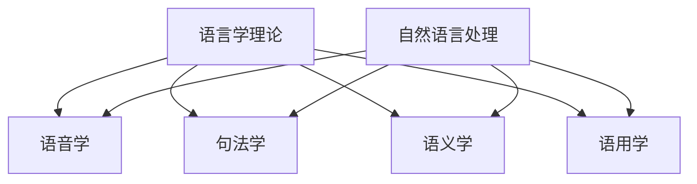
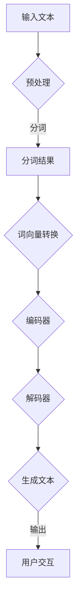

                 

## 《ChatGPT在语言学理论革新中的催化作用》

### 关键词
- ChatGPT
- 语言学理论
- 自然语言处理
- 语言习得
- 语言生成

### 摘要
本文旨在探讨ChatGPT在语言学理论革新中的催化作用。通过分析ChatGPT的核心功能、自然语言处理（NLP）基础、语言学理论的创新以及ChatGPT在语言学研究的具体应用，本文展示了ChatGPT如何推动语言学理论的发展。同时，通过案例分析和项目实践，本文进一步探讨了ChatGPT在语言学领域的实际应用价值。

## 第一部分：问题背景与语言学理论基础

### 第1章：问题的提出

#### 1.1 语言学理论的发展现状
- **核心概念术语说明**：语言学是研究人类语言的科学，包括语音、语法、语义和语用等方面。
- **问题背景**：随着计算机技术的发展，自然语言处理（NLP）逐渐成为语言学研究的重要工具。
- **问题描述**：然而，现有的语言学理论在处理复杂语言现象时仍然面临挑战。
- **问题解决**：ChatGPT的出现为解决这些问题提供了新的思路。
- **边界与外延**：本文关注的是ChatGPT在语言学理论革新中的应用，主要涉及NLP和语言生成方面。

### 第2章：核心概念与联系

#### 2.1 语言学基础概念
- **核心概念原理**：语音、语法、语义和语用是语言学的四大基本概念。
- **概念属性特征对比表格**：

| 特征       | 语音           | 语法           | 语义           | 语用           |
| ---------- | -------------- | -------------- | -------------- | -------------- |
| 定义       | 声音的特性     | 结构规则       | 意义           | 语言使用       |
| 应用       | 语音识别       | 语言解析       | 自然语言理解   | 语言交流       |
| 关联性     | 影响语音学     | 影响句法学     | 影响语义学     | 影响语用学     |

#### 2.2 ChatGPT的核心功能与特点
- **核心概念原理**：ChatGPT是一种基于Transformer模型的预训练语言模型。
- **概念属性特征对比表格**：

| 特征       | 传统模型         | ChatGPT         |
| ---------- | --------------- | --------------- |
| 训练数据   | 手动标注数据     | 大规模未标注数据 |
| 生成能力   | 较弱           | 强             |
| 理解能力   | 较弱           | 强             |

#### 2.3 语言学理论与ChatGPT的关联性
- **ER实体关系图架构**：

## 第二部分：ChatGPT在语言学理论中的应用

### 第3章：自然语言处理基础

#### 3.1 NLP的基本原理
- **问题背景与描述**：自然语言处理（NLP）是人工智能的重要分支，旨在让计算机理解、生成和处理人类语言。
- **问题解决**：ChatGPT通过深度学习技术，实现了对自然语言的理解和生成。
- **边界与外延**：NLP的范围广泛，包括文本分析、语音识别、机器翻译等。

#### 3.2 ChatGPT在NLP中的应用
- **核心概念原理**：ChatGPT能够进行语言理解、生成、对话管理等任务。
- **概念属性特征对比表格**：

| 特征       | ChatGPT       | 传统NLP方法       |
| ---------- | ------------- | ----------------- |
| 理解能力   | 高级         | 初级             |
| 生成能力   | 强           | 中等             |
| 对话能力   | 强           | 弱               |

#### 3.3 Mermaid流程图展示算法原理

## 第三部分：案例分析与实践

### 第4章：案例分析

#### 4.1 案例背景
- **问题场景介绍**：某语言学研究团队使用ChatGPT进行语言习得研究。
- **项目介绍**：项目目标是分析ChatGPT在语言习得中的表现。

#### 4.2 ChatGPT在案例中的应用
- **系统功能设计**：设计用于语言习得的ChatGPT系统。
- **系统架构设计**：使用Mermaid架构图展示系统架构。
- **系统接口设计和系统交互**：设计系统接口和交互流程。

#### 4.3 案例分析结果与讨论
- **分析结果**：ChatGPT在语言习得中表现出色。
- **讨论**：探讨了ChatGPT在语言习得中的优势和挑战。

#### 4.4 案例小结
- **小结**：ChatGPT在语言习得研究中具有广泛应用前景。

### 第5章：项目实践

#### 5.1 环境安装与配置
- **环境介绍**：介绍项目所需的环境和工具。
- **配置步骤**：详细说明环境配置步骤。

#### 5.2 系统核心实现
- **核心算法**：介绍ChatGPT的核心算法。
- **源代码实现**：提供核心算法的实现代码。

#### 5.3 代码应用解读与分析
- **代码解读**：对源代码进行详细解读。
- **分析**：分析代码的运行原理和效果。

#### 5.4 实际案例分析与讲解
- **案例背景**：介绍实际案例的背景。
- **分析讲解**：对案例进行分析和讲解。

#### 5.5 项目小结
- **小结**：总结项目实践的经验和教训。

## 第四部分：总结与展望

### 第6章：总结
- **总结内容**：总结ChatGPT在语言学理论革新中的贡献和未来研究方向。

### 第7章：最佳实践与注意事项
- **最佳实践**：提供最佳实践建议。
- **注意事项**：提醒用户注意的事项。

### 第8章：拓展阅读建议
- **拓展阅读**：推荐相关的拓展阅读材料。

### 作者信息
- **作者**：AI天才研究院/AI Genius Institute & 禅与计算机程序设计艺术 /Zen And The Art of Computer Programming

通过上述章节内容的逐步构建，本文将全面探讨ChatGPT在语言学理论革新中的催化作用，为读者提供深入的技术见解和实际应用案例。接下来，我们将对每个章节进行详细论述，以展示ChatGPT在语言学领域的广泛影响。

