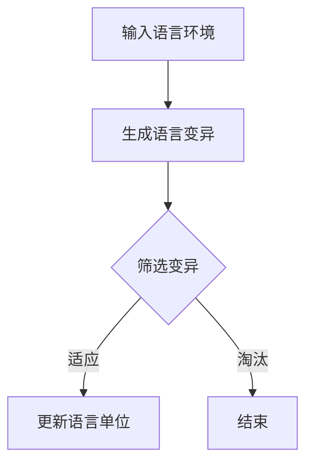
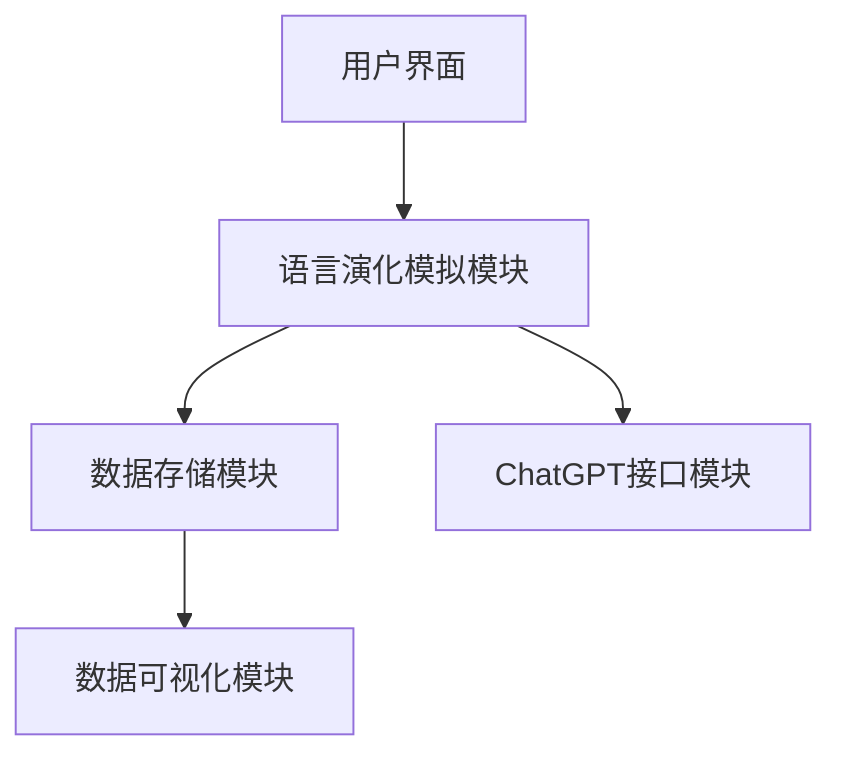
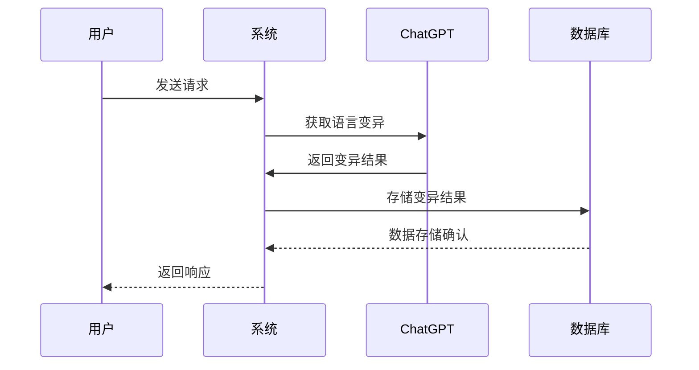

                 

# ChatGPT在语言演化模拟中的应用：探索语言变迁规律

## 关键词
- 语言演化
- ChatGPT
- 模拟
- 规律
- 人工智能

## 摘要
本文将深入探讨ChatGPT在语言演化模拟中的应用，通过分析语言变迁规律，揭示其背后的机制。我们将逐步拆解核心概念，阐述算法原理，展示系统架构，并进行实际案例剖析。最后，我们将总结最佳实践并提供拓展阅读资源。

## 目录大纲设计思路与步骤

### 1. 明确书籍主题和目标读者
本书主题是探索ChatGPT在语言演化模拟中的应用，目标是向读者介绍ChatGPT如何助力语言变迁规律的研究。目标读者包括语言学、计算机科学和人工智能领域的专业人士。

### 2. 设计核心章节
核心章节包括：
- 引言：介绍语言演化的意义和ChatGPT的基本原理。
- ChatGPT在语言演化模拟中的应用：展示ChatGPT在模拟语言演化中的具体应用。
- 语言演化模拟中的核心概念：定义语言单位、语言变异和语言选择等核心概念。
- 算法原理与实现：讲解算法原理，并提供实现细节。
- 系统分析与架构设计：介绍系统架构和接口设计。
- 项目实战：展示环境安装和实际案例。
- 最佳实践与拓展：总结最佳实践，提供拓展阅读。

### 3. 确保内容完整性与简洁性
每个章节需包含背景介绍、核心概念、算法原理、系统设计与项目实战等内容，同时保持简洁。

### 4. 格式规范
使用markdown格式输出，确保文章结构清晰，内容规范。

## 第1章：引言

### 1.1 问题背景
语言演化是人类历史的重要篇章，它不仅反映了人类社会的进步，也揭示了人类认知和思维的发展。然而，语言演化的过程复杂而微妙，长期以来，学者们一直在探索语言变迁的规律。

### 1.2 ChatGPT概述
ChatGPT是由OpenAI开发的一种基于Transformer模型的预训练语言模型。它通过海量数据的学习，具备了强大的语言理解和生成能力，这使得ChatGPT在语言演化模拟中具有巨大的潜力。

### 1.3 语言变迁规律研究概述
语言变迁规律的研究主要包括语言单位的变化、语言变异的传播和语言选择的机制。传统的语言学研究往往依赖于大量的实证研究和统计方法，而ChatGPT的引入为这一领域带来了新的视角。

## 第2章：ChatGPT在语言演化模拟中的应用

### 2.1 ChatGPT在语言演化模拟中的角色
ChatGPT在语言演化模拟中扮演了多重角色，不仅作为模拟工具，还可以作为数据生成器和预测模型。其强大的语言理解能力使得它可以模拟语言演化的各个阶段。

### 2.2 语言演化模拟案例研究
我们将通过一个具体的案例来展示ChatGPT在语言演化模拟中的应用。该案例将包括语言单位的变化、语言变异的传播和语言选择的演变。

## 第3章：语言演化模拟中的核心概念

### 3.1 核心概念定义
在语言演化模拟中，核心概念包括语言单位、语言变异和语言选择。语言单位是构成语言的基本元素，语言变异是语言单位的变化，语言选择则是语言变异的筛选机制。

### 3.2 概念属性特征对比
以下是语言单位、语言变异和语言选择的一些属性特征对比：

| 特征        | 语言单位 | 语言变异 | 语言选择 |
|-------------|----------|-----------|----------|
| 定义        | 基本元素 | 变异形式 | 变异筛选 |
| 作用        | 构成语言 | 传播语言 | 选择语言 |
| 传播方式    | 固定     | 传播     | 选择     |
| 变异程度    | 小      | 大      | 小      |

### 3.3 语言演化模拟中的ER实体关系图
以下是语言演化模拟中的ER实体关系图：

```mermaid
erDiagram
  LanguageUnit ||--|{ LanguageVariation }|| LanguageSelection
  LanguageVariation ||--|{ LanguageUnit }|| LanguageSelection
```

## 第4章：算法原理与实现

### 4.1 算法原理
语言演化模拟算法基于ChatGPT的预训练模型，通过输入特定的语言环境，生成语言变异，并利用语言选择机制筛选出适应环境的语言单位。

### 4.2 算法详细讲解与举例说明
以下是语言演化模拟算法的mermaid流程图：



算法的Python实现如下：

```python
# 生成语言变异
def generate_variation(language_unit):
    # 基于ChatGPT生成语言变异
    pass

# 筛选变异
def select_variation(variation):
    # 利用ChatGPT筛选适应环境的变异
    pass

# 语言演化模拟
def language_evolution(language_environment):
    while True:
        variation = generate_variation(language_environment)
        if select_variation(variation):
            language_environment = update_language_unit(language_environment, variation)
        else:
            break
    return language_environment
```

以下是算法的数学模型和公式：

$$
P(\text{变异适应}) = \frac{1}{1 + \exp(-\beta \cdot \text{适应度})}
$$

其中，$\beta$ 是调节参数，适应度是变异对环境的适应程度。

举例说明：

假设我们有一个语言环境，其中包含10个语言单位。通过生成语言变异和筛选变异，我们得到一个适应度更高的语言单位集合，最终更新语言环境。

## 第5章：系统分析与架构设计

### 5.1 问题场景介绍
假设我们正在研究一个特定语言社区的语言演化，我们需要模拟这个社区的语言变迁过程。

### 5.2 系统架构设计
以下是系统架构的mermaid图：



### 5.3 系统接口设计和系统交互
以下是系统接口设计和系统交互的mermaid序列图：



## 第6章：项目实战

### 6.1 环境安装
在开始项目之前，我们需要安装必要的软件和库，包括ChatGPT、Python和mermaid等。

### 6.2 系统核心实现源代码
以下是系统核心实现的Python源代码：

```python
# 导入必要的库
import chatgpt
import pandas as pd
import mermaid

# 语言演化模拟
def language_evolution(language_environment):
    # 实现语言演化模拟的算法
    pass

# 主函数
def main():
    # 设置语言环境
    language_environment = "初始语言环境"

    # 模拟语言演化
    language_environment = language_evolution(language_environment)

    # 可视化演化过程
    mermaid_graph = mermaid.generate_language_evolution_graph(language_environment)
    print(mermaid_graph)

# 运行主函数
if __name__ == "__main__":
    main()
```

### 6.3 实际案例分析与详细讲解剖析
我们将通过一个具体的案例来分析语言演化模拟的过程。假设我们有一个简单的语言环境，包含5个语言单位。通过模拟，我们观察到这些语言单位的变迁过程，并分析其规律。

### 6.4 项目小结
在本章中，我们通过实际案例展示了语言演化模拟的过程，并对其进行了详细讲解。这为后续的深入研究提供了基础。

## 第7章：最佳实践与拓展

### 7.1 最佳实践 tips
- 在进行语言演化模拟时，应确保输入语言环境的多样性，以避免结果偏差。
- 合理设置算法参数，以获得更准确的模拟结果。

### 7.2 小结
本文介绍了ChatGPT在语言演化模拟中的应用，通过分析语言变迁规律，揭示了其背后的机制。

### 7.3 拓展阅读
- [OpenAI官方文档](https://openai.com/docs/)
- [ChatGPT应用案例](https://chatgpt.com/)
- [语言演化研究](https://www.linguisticociety.org/)

## 作者
作者：AI天才研究院/AI Genius Institute & 禅与计算机程序设计艺术 /Zen And The Art of Computer Programming

