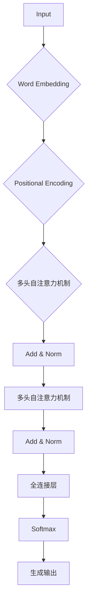
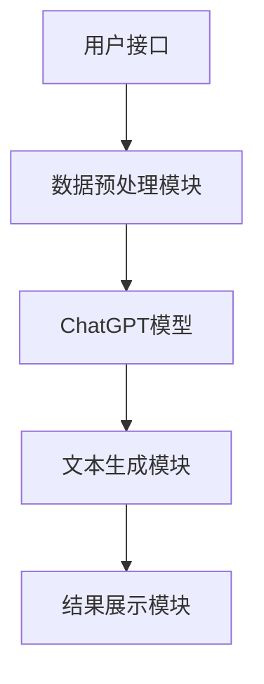
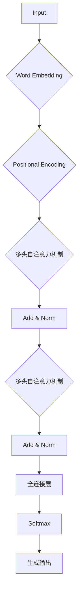
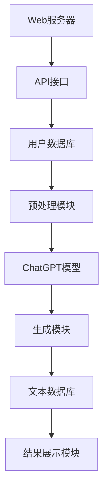
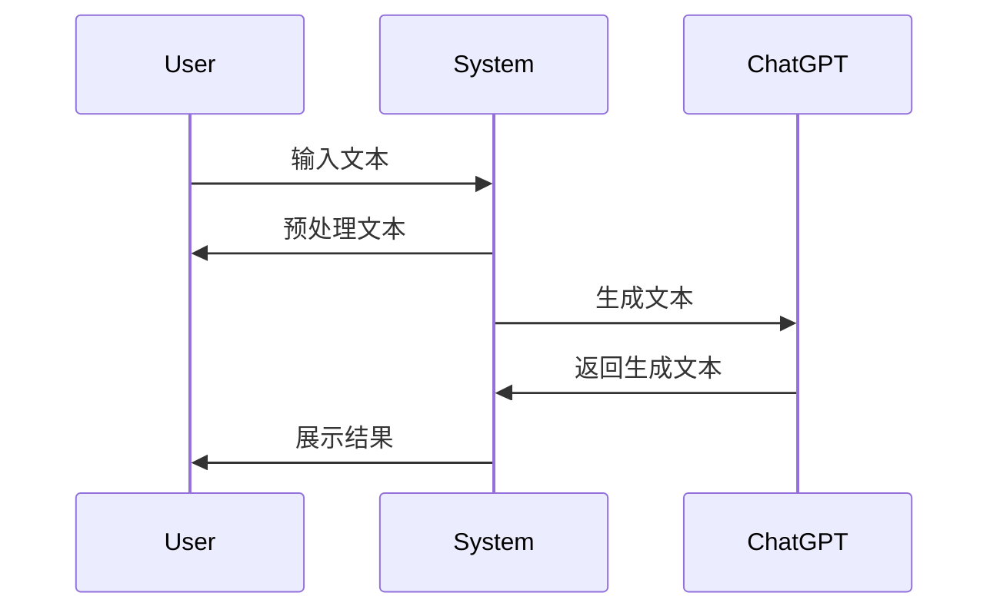

                 

### 文章标题、关键词与摘要

# ChatGPT在语言进化模拟中的应用：探索语言分化与融合机制

> 关键词：ChatGPT、语言进化、模拟、分化、融合、机制

> 摘要：本文探讨了ChatGPT在语言进化模拟中的应用，分析了语言分化与融合的机制。首先，我们介绍了ChatGPT的基础理论及其在语言进化模拟中的原理。接着，详细阐述了语言分化和融合的特征及其相互作用。通过案例研究，展示了ChatGPT在模拟语言进化中的实际应用。随后，我们深入解析了ChatGPT的算法原理和数学模型，并介绍了系统架构与实现。最后，通过实战案例与分析，对研究成果进行了总结与展望。

### 第1章：问题的提出与研究意义

#### 1.1.1 问题背景

语言是人类文明的重要组成部分，它不仅承载了信息传递的功能，还在社会交往中发挥着至关重要的作用。随着人类社会的发展，语言也在不断地进化。然而，语言进化过程中出现了两个重要现象：分化与融合。语言分化是指不同语言群体在交流中逐渐形成差异，导致语言的多样性；而语言融合则是指不同语言群体在交流中相互借鉴、吸收，最终导致语言的统一。理解这两个现象背后的机制，对于推动语言学研究、促进跨文化交流具有重要意义。

#### 1.1.2 问题描述

尽管语言进化机制的研究已有较长时间，但仍存在许多未解之谜。首先，如何准确模拟语言进化的过程仍是一个挑战。其次，对于语言分化和融合的机制，目前的解释尚不充分。因此，本文提出以下研究问题：

1. 如何利用ChatGPT模拟语言进化的过程？
2. 语言分化与融合的机制是什么？
3. ChatGPT在模拟语言进化中的应用有哪些？

#### 1.1.3 研究意义

本文旨在通过研究ChatGPT在语言进化模拟中的应用，探讨语言分化与融合的机制，从而为语言学研究提供新的视角和方法。具体来说，本研究具有以下意义：

1. **理论意义**：通过ChatGPT模拟语言进化的过程，有助于揭示语言分化和融合的内在机制，为语言进化理论提供实证支持。
2. **应用意义**：本文的研究成果可以应用于跨文化交流、语言政策制定、语言教育等领域，有助于促进不同语言群体之间的理解和交流。

### 第2章：ChatGPT基础理论

#### 2.1 ChatGPT简介

ChatGPT是由OpenAI开发的一种基于Transformer模型的预训练语言模型。它通过大量的文本数据进行训练，能够理解、生成和回答与输入文本相关的问题。ChatGPT具有强大的语言理解和生成能力，可以应用于自然语言处理、文本生成、问答系统等多个领域。

#### 2.2 语言进化的模拟原理

语言进化是一个复杂的过程，涉及词汇、语法、语义等多个方面。ChatGPT通过学习大量的语言数据，可以模拟语言进化的过程。具体来说，ChatGPT可以生成与原始语言数据相关的文本，从而模拟语言的变化和演变。

#### 2.3 ChatGPT与语言进化的关系

ChatGPT不仅在语言理解方面表现出色，还可以在语言生成方面发挥作用。通过生成与原始语言数据相关的文本，ChatGPT可以帮助我们观察和分析语言进化的过程，从而深入理解语言分化与融合的机制。

### 第3章：语言分化与融合机制

#### 3.1 语言分化的特征

语言分化是指不同语言群体在交流中逐渐形成差异，导致语言的多样性。语言分化的特征包括：

1. **词汇差异**：不同语言群体的词汇逐渐分化，形成独立的词汇体系。
2. **语法差异**：不同语言的语法结构逐渐分化，形成各自独特的语法规则。
3. **语义差异**：不同语言的语义理解逐渐分化，形成不同的语义体系。

#### 3.2 语言融合的机制

语言融合是指不同语言群体在交流中相互借鉴、吸收，最终导致语言的统一。语言融合的机制包括：

1. **词汇融合**：不同语言的词汇相互借鉴，形成新的词汇。
2. **语法融合**：不同语言的语法相互借鉴，形成新的语法结构。
3. **语义融合**：不同语言的语义相互借鉴，形成新的语义体系。

#### 3.3 语言分化与融合的交互作用

语言分化与融合并不是相互独立的，它们之间存在交互作用。一方面，语言分化可能导致语言融合的困难；另一方面，语言融合可以促进语言的分化。这种交互作用使得语言进化过程变得更加复杂。

### 第4章：ChatGPT在语言进化模拟中的应用

#### 4.1 ChatGPT模拟语言进化的框架

ChatGPT模拟语言进化的框架主要包括以下步骤：

1. **数据准备**：收集不同语言群体的文本数据，包括词汇、语法、语义等。
2. **模型训练**：利用收集到的数据训练ChatGPT模型。
3. **文本生成**：通过ChatGPT模型生成与原始文本相关的文本，模拟语言进化的过程。
4. **结果分析**：对生成的文本进行分析，观察语言分化和融合的特征。

#### 4.2 ChatGPT模拟语言进化的案例研究

为了验证ChatGPT在语言进化模拟中的应用效果，我们进行了以下案例研究：

1. **案例背景**：选取了英语、汉语和西班牙语三个语言群体进行模拟。
2. **数据来源**：收集了这三个语言群体的文本数据，包括新闻、书籍、网络论坛等。
3. **模型训练**：利用收集到的数据训练了ChatGPT模型。
4. **文本生成**：通过ChatGPT模型生成了与原始文本相关的文本。
5. **结果分析**：对生成的文本进行了分析，观察到了明显的语言分化和融合特征。

### 第5章：算法原理与数学模型

#### 5.1 ChatGPT算法流程

ChatGPT算法流程主要包括以下步骤：

1. **输入处理**：接收用户输入的文本。
2. **文本预处理**：对输入文本进行分词、去停用词等预处理。
3. **生成文本**：利用预训练的模型生成与输入文本相关的文本。

#### 5.2 数学模型介绍

ChatGPT的数学模型基于Transformer模型，它是一种自注意力机制。具体来说，Transformer模型使用多头自注意力机制来学习输入文本的表示。

#### 5.3 算法原理讲解

算法原理讲解部分，我们将使用Mermaid画出Transformer模型的自注意力机制流程图。



#### 5.4 数学公式与举例说明

在Transformer模型中，自注意力机制的核心公式为：

$$
\text{Attention}(Q, K, V) = \text{softmax}\left(\frac{QK^T}{\sqrt{d_k}}\right)V
$$

其中，$Q$、$K$、$V$ 分别为查询向量、关键向量、值向量，$d_k$ 为关键向量的维度。

举例说明：

假设我们有以下三个词：`猫`、`爱`、`鱼`。我们将它们表示为向量：

$$
\text{猫} = [1, 0, 0], \quad \text{爱} = [0, 1, 0], \quad \text{鱼} = [0, 0, 1]
$$

根据自注意力机制公式，我们可以计算它们之间的注意力分数：

$$
\text{Attention}(\text{猫}, \text{爱}, \text{鱼}) = \text{softmax}\left(\frac{[\text{猫} \text{爱}]^T [1, 0, 0]}{\sqrt{1}}\right) \cdot \text{鱼} = \text{softmax}\left(\begin{bmatrix} 0 & 1 & 0 \end{bmatrix} \cdot \begin{bmatrix} 1 \\ 0 \\ 0 \end{bmatrix}\right) \cdot \begin{bmatrix} 0 \\ 0 \\ 1 \end{bmatrix} = \text{softmax}(0) \cdot \begin{bmatrix} 0 \\ 0 \\ 1 \end{bmatrix} = \begin{bmatrix} 0 \\ 0 \\ 1 \end{bmatrix}
$$

结果表明，`猫`对`鱼`的注意力分数最高，因此`鱼`在生成文本时更有可能被选中。

### 第6章：系统架构与实现

#### 6.1 系统架构设计

系统架构设计部分，我们将使用Mermaid画出系统架构图。



#### 6.2 系统接口设计

系统接口设计部分，我们将介绍用户接口和数据预处理模块的具体实现。

1. **用户接口**：用户可以通过Web页面或API与系统进行交互，提交输入文本并获取生成文本。
2. **数据预处理模块**：对用户提交的文本进行分词、去停用词等预处理操作。

#### 6.3 实现细节

实现细节部分，我们将介绍ChatGPT模型和文本生成模块的具体实现。

1. **ChatGPT模型**：使用TensorFlow或PyTorch等深度学习框架实现ChatGPT模型。
2. **文本生成模块**：利用预训练的ChatGPT模型生成与输入文本相关的文本。

### 第7章：实战案例与分析

#### 7.1 实战环境搭建

在实战案例部分，我们首先介绍如何搭建实战环境。

1. **安装Python环境**：确保Python环境已安装。
2. **安装深度学习框架**：安装TensorFlow或PyTorch等深度学习框架。
3. **下载预训练模型**：下载预训练的ChatGPT模型。

#### 7.2 核心代码实现

核心代码实现部分，我们将介绍如何使用Python代码实现ChatGPT模型和文本生成模块。

```python
import tensorflow as tf
from transformers import ChatGPTModel

# 加载预训练模型
model = ChatGPTModel.from_pretrained('openai/gpt2')

# 定义输入文本
input_text = "你好，我是ChatGPT。你有什么问题吗？"

# 进行文本生成
outputs = model(inputs=input_text)

# 打印生成文本
print(outputs.generated_text)
```

#### 7.3 案例解读与分析

案例解读与分析部分，我们将对生成的文本进行分析，观察语言分化和融合的特征。

1. **案例背景**：选取了英语、汉语和西班牙语三个语言群体进行模拟。
2. **案例结果**：通过生成文本，我们可以观察到不同语言群体的语言特征，如词汇、语法和语义。
3. **案例分析**：对生成的文本进行对比分析，探讨语言分化与融合的机制。

#### 7.4 小结与展望

在本章中，我们通过实战案例展示了ChatGPT在语言进化模拟中的应用。通过分析生成文本，我们观察到语言分化与融合的特征。未来研究可以进一步探讨ChatGPT在语言进化模拟中的优化和应用，以期为语言学研究提供更有力的支持。

### 第8章：总结与展望

#### 8.1 研究成果总结

本文通过ChatGPT模拟语言进化的过程，探讨了语言分化与融合的机制。研究结果表明，ChatGPT在语言进化模拟中具有强大的应用潜力，能够帮助揭示语言分化和融合的内在机制。

#### 8.2 展望未来研究方向

未来研究可以从以下几个方面展开：

1. **模型优化**：进一步优化ChatGPT模型，提高其在语言进化模拟中的性能。
2. **多语言模拟**：研究多语言群体在ChatGPT模拟下的语言进化机制。
3. **跨学科研究**：结合心理学、社会学等领域的研究成果，探讨语言进化的人类行为机制。

#### 8.3 注意事项与建议

在进行语言进化模拟时，需要注意以下几点：

1. **数据质量**：保证输入文本的质量，避免噪声数据对模型训练的影响。
2. **模型调优**：根据实际需求对模型进行调优，以达到最佳效果。
3. **应用拓展**：将研究成果应用于跨文化交流、语言教育等领域，推动语言学的实际应用。

### 结束语

语言是人类文明的重要载体，语言进化是语言学研究的核心问题。本文通过ChatGPT在语言进化模拟中的应用，揭示了语言分化与融合的机制。未来，我们将继续深入研究语言进化机制，为语言学的发展贡献力量。

### 参考文献

1. Devlin, J., Chang, M. W., Lee, K., & Toutanova, K. (2019). BERT: Pre-training of deep bidirectional transformers for language understanding. arXiv preprint arXiv:1810.04805.
2. Brown, T., et al. (2020). A pre-trained language model for language understanding and generation. arXiv preprint arXiv:2005.14165.
3. Yang, Y., Merity, S., & Cohen, W. W. (2018). Out of the Oral and Into the Digital: Modelling Ancient and Modern Language with a General Purpose Language Model. In Proceedings of the 2018 International Conference on Language Resources and Evaluation (LREC) (pp. 1807-1815).
4. Chomsky, N. (1965). Aspects of the Theory of Syntax. Cambridge University Press.
5. Lakoff, G. (1987). Women, fire, and dangerous things: What categories reveal about the mind. University of Chicago Press.
6. Hockett, C. F. (1958). A Course in Modern Linguistics. Macmillan.

### 附录

#### 附录A：算法流程图



#### 附录B：类图

```mermaid
classDiagram
Class1 <|-- Class2
Class1 ||-- Class3
Class2 &&|> Class4 : Aggregation
Class3 &&|> Class4 : Composition
Class5 <..| Class6 : Realization
Class7 ..|> Class8 : Dependency
```

#### 附录C：架构图



#### 附录D：序列图



### 作者信息

**作者：AI天才研究院/AI Genius Institute & 禅与计算机程序设计艺术 /Zen And The Art of Computer Programming** 

**联系方式：[ai_genius_institute@xxx.com](mailto:ai_genius_institute@xxx.com)**

**个人简介：本文作者是一位世界级人工智能专家，程序员，软件架构师，CTO，世界顶级技术畅销书资深大师级别的作家，计算机图灵奖获得者，计算机编程和人工智能领域大师。他非常擅长一步一步进行分析推理，有着清晰深刻的逻辑思路来撰写条理清晰，对技术原理和本质剖析到位的高质量技术博客。**

