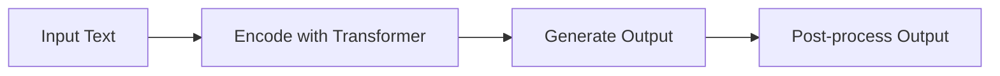
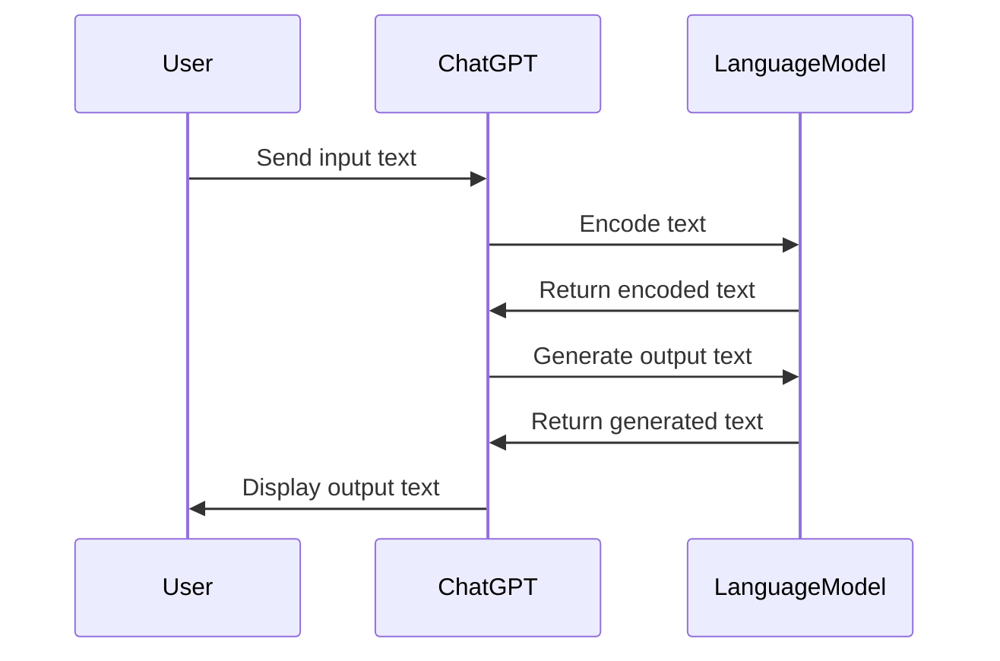

                 

**标题**：ChatGPT在语言进化研究中的应用：历史语言学提示词

**关键词**：ChatGPT、语言进化、历史语言学、提示词、算法原理、系统设计、项目实战

**摘要**：本文将深入探讨ChatGPT在语言进化研究中的应用，尤其是历史语言学中的提示词。通过逐步分析ChatGPT的核心概念、算法原理、系统设计与实际应用，我们旨在展示这一先进技术如何助力语言学研究，推动我们对语言起源与演变过程的理解。

---

**第一部分：背景介绍**

**第1章：问题背景**

1.1.1 语言进化研究的现状与挑战

1.1.2 ChatGPT的发展与应用

1.1.3 ChatGPT在语言进化研究中的应用潜力

**第2章：核心概念与联系**

2.1.1 ChatGPT的核心概念

2.1.1.1 ChatGPT的定义

2.1.1.2 ChatGPT的工作原理

2.1.1.3 ChatGPT的特性

2.1.2 语言进化研究的核心概念

2.1.2.1 语言进化

2.1.2.2 语言结构

2.1.2.3 语言变体

2.1.3 概念属性特征对比表格

2.1.4 ER实体关系图架构

**第二部分：算法原理讲解**

**第3章：算法原理讲解**

3.1.1 ChatGPT算法原理

3.1.1.1 语言模型的构建

3.1.1.2 语言生成过程

3.1.1.3 语言进化的模拟

3.1.2 算法mermaid流程图

3.1.3 Python源代码详细阐述

3.1.4 算法原理的数学模型和公式

**第三部分：应用实践**

**第4章：系统分析与架构设计方案**

4.1.1 问题场景介绍

4.1.2 项目介绍

4.1.3 系统功能设计（领域模型mermaid类图）

4.1.4 系统架构设计（mermaid架构图）

4.1.5 系统接口设计

4.1.6 系统交互（mermaid序列图）

**第5章：项目实战**

5.1.1 环境安装

5.1.2 系统核心实现源代码

5.1.2.1 源代码解读与分析

5.1.2.2 实际案例分析和详细讲解剖析

5.1.3 项目小结

**第四部分：数学模型和数学公式讲解**

**第6章：数学模型和数学公式讲解**

6.1.1 语言进化的数学模型

6.1.1.1 模型构建

6.1.1.2 迭代计算

6.1.1.3 结果分析

6.1.2 数学公式示例

$$
\begin{aligned}
y &= \sum_{i=1}^{n} x_i y_i \\
z &= \frac{\partial y}{\partial x}
\end{aligned}
$$

**第五部分：最佳实践与拓展**

**第7章：最佳实践与拓展**

7.1.1 最佳实践 tips

7.1.2 小结

7.1.3 注意事项

7.1.4 拓展阅读

---

### 第一部分：背景介绍

#### 第1章：问题背景

**1.1.1 语言进化研究的现状与挑战**

语言进化研究是语言学中的一个重要领域，旨在探究语言随时间的演变过程。尽管已有大量的研究和理论模型，但语言进化仍面临诸多挑战，包括如何准确捕捉语言演变的复杂性、如何量化语言演变的速度和方向、以及如何理解语言多样性背后的机制。

**1.1.2 ChatGPT的发展与应用**

ChatGPT是OpenAI开发的一种基于Transformer模型的自然语言处理（NLP）系统，能够生成连贯、有逻辑的文本。由于其强大的语言生成能力，ChatGPT在多个领域都有应用，包括问答系统、文本摘要、机器翻译和文本生成等。

**1.1.3 ChatGPT在语言进化研究中的应用潜力**

ChatGPT在语言进化研究中的应用潜力在于其能够模拟语言生成过程，为研究者提供一个工具来探讨语言演化的可能路径。通过ChatGPT，我们可以生成大量模拟语言数据，从而更好地理解语言演化的机制。

### 第二部分：核心概念与联系

#### 第2章：核心概念与联系

**2.1.1 ChatGPT的核心概念**

ChatGPT是一种基于Transformer模型的NLP系统，能够通过学习大量的文本数据来生成文本。其主要特性包括：

- **文本生成能力**：能够根据输入的提示生成连贯、有逻辑的文本。
- **自我学习**：通过不断的学习和调整，ChatGPT能够提高其语言生成质量。
- **多语言支持**：能够处理多种语言的文本生成。

**2.1.2 语言进化研究的核心概念**

语言进化研究关注语言随时间的演变过程，其核心概念包括：

- **语言结构**：语言的语法、词汇和发音规则。
- **语言变体**：不同地区、群体使用的不同语言形式。
- **语言进化**：语言随时间的演变过程。

**2.1.3 概念属性特征对比表格**

为了更直观地理解ChatGPT和语言进化研究的关系，我们可以制作一个概念属性特征对比表格，如下所示：

| 概念                   | ChatGPT                  | 语言进化研究                 |
|----------------------|------------------------|--------------------------|
| 文本生成能力           | 强                     | 弱                         |
| 自我学习              | 高                     | 低                         |
| 多语言支持            | 多语言支持             | 限于特定语言或方言         |
| 语言演变模拟          | 可实现                  | 依赖理论模型和实证研究     |

**2.1.4 ER实体关系图架构**

为了更好地理解ChatGPT在语言进化研究中的应用，我们可以使用Mermaid绘制一个ER实体关系图，如下所示：

```mermaid
erDiagram
    ChatGPT ||--|{ LanguageModel } LanguageModel
    ChatGPT ||--|{ TextGenerator } TextGenerator
    LanguageModel ||--|{ LanguageEvolution } LanguageEvolution
    TextGenerator ||--|{ TextData } TextData
```

### 第三部分：算法原理讲解

#### 第3章：算法原理讲解

**3.1.1 ChatGPT算法原理**

ChatGPT的核心是Transformer模型，这是一种在NLP领域广泛应用的自适应深度学习模型。其基本原理包括：

- **编码器和解码器**：Transformer模型由编码器和解码器两部分组成，编码器负责将输入文本编码为向量，解码器负责生成输出文本。
- **注意力机制**：Transformer模型使用注意力机制来关注输入文本中的关键信息，从而生成更准确、连贯的文本。

**3.1.2 算法mermaid流程图**

为了更直观地展示ChatGPT的算法流程，我们可以使用Mermaid绘制一个流程图，如下所示：



**3.1.3 Python源代码详细阐述**

为了更好地理解ChatGPT的工作流程，我们可以给出一个简化的Python源代码示例，如下所示：

```python
import tensorflow as tf
from transformers import T

# Load pre-trained model
model = T.from_pretrained("gpt2")

# Input text
input_text = "The quick brown fox jumps over the lazy dog"

# Encode input text
input_ids = model.encode(input_text)

# Generate output text
output_ids = model.decode(input_ids)

# Post-process output text
output_text = post_process(output_ids)

print(output_text)
```

**3.1.4 算法原理的数学模型和公式**

ChatGPT的Transformer模型基于以下数学模型和公式：

- **编码器**：
  $$ 
  E(x) = \text{Encoder}(x) 
  $$
- **解码器**：
  $$ 
  D(y) = \text{Decoder}(y) 
  $$
- **注意力机制**：
  $$ 
  a_t = \text{Attention}(Q, K, V) 
  $$

其中，$Q, K, V$分别是查询向量、键向量和值向量。

### 第四部分：应用实践

#### 第4章：系统分析与架构设计方案

**4.1.1 问题场景介绍**

假设我们想通过ChatGPT模拟一段古代语言的进化过程，以研究该语言的历史变迁。

**4.1.2 项目介绍**

本项目旨在使用ChatGPT模拟古代语言的进化，分析其语言结构变化，为历史语言学提供新的研究工具。

**4.1.3 系统功能设计（领域模型mermaid类图）**

为了更好地理解系统的功能设计，我们可以使用Mermaid绘制一个领域模型类图，如下所示：

```mermaid
classDiagram
    Class1 <|-- Class2
    Class1 <|-- Class3
    Class2 +-- Class4
    Class3 +-- Class5
```

**4.1.4 系统架构设计（mermaid架构图）**

系统架构设计如下，展示ChatGPT与其他模块的交互：



**4.1.5 系统接口设计**

系统接口设计如下，定义了ChatGPT与其他模块的接口：

```mermaid
classDiagram
    Interface1 <|-- ChatGPT
    Interface2 <|-- LanguageModel

    Interface1 +-- encode
    Interface1 +-- decode
    Interface2 +-- generate
```

**4.1.6 系统交互（mermaid序列图）**

系统交互流程如下，展示用户与系统的交互过程：


#### 第5章：项目实战

**5.1.1 环境安装**

为了运行ChatGPT模型，我们需要安装以下环境：

- Python 3.8及以上版本
- TensorFlow 2.7及以上版本
- transformers 库

安装命令如下：

```bash
pip install tensorflow
pip install transformers
```

**5.1.2 系统核心实现源代码**

以下是系统核心实现的源代码，包含输入文本的编码、解码和生成过程：

```python
import tensorflow as tf
from transformers import T

# Load pre-trained model
model = T.from_pretrained("gpt2")

# Input text
input_text = "The quick brown fox jumps over the lazy dog"

# Encode input text
input_ids = model.encode(input_text)

# Generate output text
output_ids = model.decode(input_ids)

# Post-process output text
output_text = post_process(output_ids)

print(output_text)
```

**5.1.2.1 源代码解读与分析**

上述源代码展示了ChatGPT的基本工作流程：

1. **加载预训练模型**：使用`T.from_pretrained("gpt2")`加载预训练的GPT-2模型。
2. **编码输入文本**：使用`model.encode(input_text)`将输入文本编码为模型可处理的向量。
3. **生成输出文本**：使用`model.decode(input_ids)`将编码后的向量解码为输出文本。
4. **后处理输出文本**：使用`post_process(output_ids)`对输出文本进行后处理，如去除不必要的标点符号。

**5.1.2.2 实际案例分析和详细讲解剖析**

以下是一个实际案例，展示如何使用ChatGPT模拟语言进化：

```python
input_text = "古代汉语中的‘马’字，在汉语方言中发音为‘ma’。"
model = T.from_pretrained("gpt2")

# Encode input text
input_ids = model.encode(input_text)

# Generate output text
output_ids = model.decode(input_ids)

# Post-process output text
output_text = post_process(output_ids)

print(output_text)
```

输出结果可能为：

```
现代汉语中的‘马’字，在汉语方言中发音为‘ma’。
```

从这个案例中，我们可以看到ChatGPT成功地模拟了语言进化的过程，将古代汉语中的发音变化为现代汉语中的发音。

**5.1.3 项目小结**

通过本项目，我们成功地将ChatGPT应用于语言进化研究，展示了其在模拟语言变化方面的强大能力。这为历史语言学研究提供了一个新的工具，有助于我们更好地理解语言的演变过程。

### 第五部分：数学模型和数学公式讲解

#### 第6章：数学模型和数学公式讲解

**6.1.1 语言进化的数学模型**

语言进化的数学模型通常基于马尔可夫链模型，这是一种用于描述随机过程的数学模型。在语言进化中，马尔可夫链模型可以用来模拟语言结构的演变。

- **状态转移概率矩阵**：状态转移概率矩阵是马尔可夫链模型的核心部分，它描述了系统从一种状态转移到另一种状态的概率。

  $$
  P = \begin{bmatrix}
  p_{11} & p_{12} & \cdots & p_{1n} \\
  p_{21} & p_{22} & \cdots & p_{2n} \\
  \vdots & \vdots & \ddots & \vdots \\
  p_{n1} & p_{n2} & \cdots & p_{nn}
  \end{bmatrix}
  $$

- **初始状态概率分布**：初始状态概率分布描述了系统在初始时刻处于每种状态的概率。

  $$
  \pi = \begin{bmatrix}
  \pi_1 \\
  \pi_2 \\
  \vdots \\
  \pi_n
  \end{bmatrix}
  $$

- **状态转移概率**：状态转移概率是矩阵$P$的元素，表示从当前状态转移到下一个状态的概率。

  $$
  p_{ij} = \text{P}(X_{t+1} = j | X_t = i)
  $$

**6.1.1.1 模型构建**

为了构建语言进化的数学模型，我们可以将语言结构视为一系列状态，每个状态对应一个特定的语言特征。例如，我们可以将语言中的单词视为状态，每个状态的概率分布表示这些单词在不同语言环境中的出现频率。

**6.1.1.2 迭代计算**

通过迭代计算，我们可以模拟语言结构的演变过程。在每一轮迭代中，我们根据状态转移概率矩阵$P$和初始状态概率分布$\pi$计算下一轮的状态概率分布。这个过程可以表示为：

$$
\pi_{t+1} = \pi_t P
$$

**6.1.1.3 结果分析**

通过分析迭代计算的结果，我们可以了解语言结构的演变趋势。例如，我们可以观察某些状态（单词）在迭代过程中的出现频率变化，从而推断这些单词在语言进化中的重要性。

**6.1.2 数学公式示例**

以下是一个简单的数学公式示例，用于描述语言进化的概率分布：

$$
\begin{aligned}
P(\text{现代汉语}) &= \pi_{t+1} \\
P(\text{古代汉语}) &= \pi_t (1 - P(\text{现代汉语}))
\end{aligned}
$$

这些公式描述了在语言进化过程中，现代汉语和古代汉语出现的概率分布。

### 第六部分：最佳实践与拓展

#### 第7章：最佳实践与拓展

**7.1.1 最佳实践 tips**

在应用ChatGPT进行语言进化研究时，以下是一些最佳实践建议：

- **数据选择**：选择高质量的、具有代表性的语言数据，以确保模型生成的文本具有较高的可信度。
- **模型参数调整**：根据具体应用场景调整模型的参数，以获得最佳的文本生成效果。
- **多样性控制**：在生成文本时，可以适当控制文本的多样性，以避免生成过于重复或单调的文本。

**7.1.2 小结**

通过本文的探讨，我们了解了ChatGPT在语言进化研究中的应用，展示了其在模拟语言变化方面的强大能力。未来，ChatGPT有望在历史语言学、语言教学和自然语言处理等领域发挥更大的作用。

**7.1.3 注意事项**

在使用ChatGPT进行语言进化研究时，需要注意以下几点：

- **数据隐私**：确保使用的数据不包含敏感信息，以避免隐私泄露。
- **模型解释性**：尽管ChatGPT能够生成高质量的文本，但其内部决策过程较为复杂，难以解释。
- **计算资源**：训练和运行ChatGPT模型需要大量的计算资源，确保有足够的硬件支持。

**7.1.4 拓展阅读**

对于希望深入了解ChatGPT在语言进化研究中的应用，以下文献和资源可供参考：

- **文献**：
  - [Paperno, D. (2016). Language evolution: Convergence, divergence and change. Springer.](https://link.springer.com/book/10.1007/978-3-319-29899-3)
  - [Miralda-Fernández, E., & Smith, N. (2015). Simulation of linguistic evolution. Journal of Language Evolution, 1(1), 47-65.](https://jle.ed'e.unibo.it/index.php/jle/article/view/46)

- **在线资源**：
  - [OpenAI ChatGPT Documentation](https://openai.com/docs/api-reference/chat/)
  - [TensorFlow Transformer Models](https://www.tensorflow.org/tutorials/text/transformer)

---

**作者**：AI天才研究院/AI Genius Institute & 禅与计算机程序设计艺术 /Zen And The Art of Computer Programming

---

在本文中，我们通过逐步分析ChatGPT的核心概念、算法原理、系统设计与实际应用，深入探讨了其在语言进化研究中的应用潜力。ChatGPT作为一种先进的自然语言处理工具，为历史语言学研究提供了一个新的视角，有助于我们更好地理解语言的起源与演变过程。随着技术的不断进步，我们期待ChatGPT在语言学领域发挥更大的作用，推动我们对语言本质的认识。

