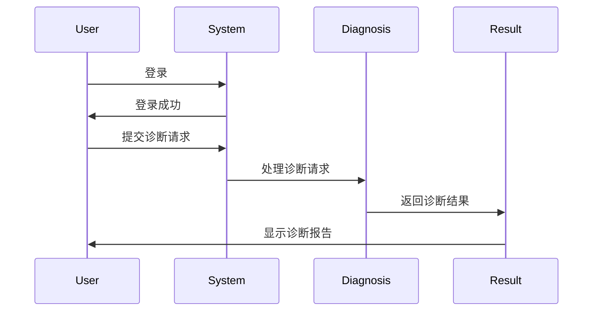
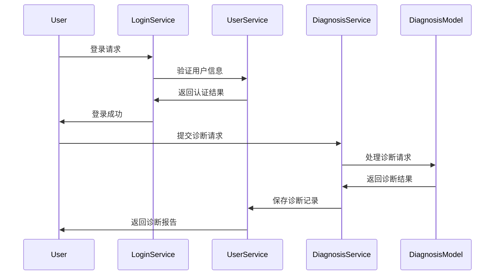

                 

### 《ChatGPT在语言障碍早期诊断中的辅助作用研究》

#### 关键词：ChatGPT、语言障碍、早期诊断、人工智能、自然语言处理

##### 摘要：
本文旨在探讨ChatGPT在语言障碍早期诊断中的辅助作用。通过对其定义、核心特性及与现有诊断工具的对比，本文将详细分析ChatGPT在语言障碍早期诊断中的应用潜力、算法原理，以及系统设计与实现过程。文章最后还将结合实际案例，提供最佳实践建议，并展望未来研究方向。

### 目录大纲

----------------------------------------------------------------

#### 《ChatGPT在语言障碍早期诊断中的辅助作用研究》

> 关键词：ChatGPT、语言障碍、早期诊断、人工智能、自然语言处理

> 摘要：本文探讨了ChatGPT在语言障碍早期诊断中的辅助作用。通过分析ChatGPT的定义、特性及与现有诊断工具的对比，探讨了其在早期诊断中的应用潜力。文章详细讲解了ChatGPT在语言障碍早期诊断中的应用算法原理，并介绍了系统设计与实现过程。最后，结合实际案例提供了最佳实践建议。

----------------------------------------------------------------

## 第一部分：背景介绍

### 第1章 问题背景

#### 1.1 语言障碍概述

- **定义**：语言障碍是指个体在语言获取、表达、理解和使用过程中出现的一系列问题。
- **影响范围**：语言障碍广泛存在于儿童和成人中，严重影响个体的沟通能力和生活质量。
- **重要性**：早期诊断和干预是改善语言障碍患者预后的关键。

#### 1.2 语言障碍早期诊断的重要性

- **早期诊断的优势**：及早发现和干预可以最大程度地减轻语言障碍对个体的负面影响。
- **诊断现状与挑战**：现有诊断方法受限于专业知识和时间成本，诊断效率不高，且缺乏标准化。

#### 1.3 语言障碍早期诊断的方法

- **现有诊断工具**：包括临床检查、标准化评估工具和语言治疗。
- **诊断流程**：初步评估、详细评估和诊断结论。

#### 1.4 语言障碍早期诊断的边界与外延

- **适用人群**：0-6岁的儿童和早期识别成人语言障碍。
- **诊断范围**：语音、语言理解和表达能力。

#### 1.5 语言障碍早期诊断的核心要素组成

- **诊断标准**：包括临床标准、量表标准和专家共识。
- **诊断工具**：包括面对面评估、远程评估和自动评估工具。

----------------------------------------------------------------

## 第二部分：核心概念与联系

### 第2章 ChatGPT概述

#### 2.1 ChatGPT的定义

- **技术背景**：基于大型预训练语言模型的人工智能助手。
- **模型结构**：包含编码器和解码器，能够处理和理解自然语言。

#### 2.2 ChatGPT的核心特性

- **自然语言处理能力**：具备出色的文本生成和理解能力。
- **自适应能力**：能够在不同的上下文中自适应调整，提供准确回应。

#### 2.3 ChatGPT与现有诊断工具的对比

- **对比表格**：

| 对比项 | ChatGPT | 现有诊断工具 |
| --- | --- | --- |
| **自然语言处理能力** | 出色 | 一般 |
| **自适应能力** | 强 | 较弱 |
| **效率** | 高 | 低 |
| **成本** | 低 | 高 |

#### 2.4 ChatGPT在语言障碍早期诊断中的应用前景

- **潜在优势**：自动化诊断流程，降低专业门槛，提高诊断效率。
- **挑战与限制**：需要大量高质量数据，算法适应性仍需提升。

----------------------------------------------------------------

## 第三部分：算法原理讲解

### 第3章 ChatGPT在语言障碍早期诊断中的应用

#### 3.1 算法原理

- **ChatGPT的工作原理**：通过预训练和微调，实现自然语言理解和生成。
- **应用到语言障碍早期诊断的流程**：数据收集、预处理、模型训练和诊断预测。

#### 3.2 算法mermaid流程图


#### 3.3 算法原理的数学模型和公式

- **数学模型**：
  $$\text{预测值} = \text{激活函数}(\text{权重矩阵} \cdot \text{输入特征})$$
- **公式解释**：通过权重矩阵和输入特征的线性组合，结合激活函数，实现输入到输出的转换。

#### 3.4 算法原理的详细讲解与举例说明

- **示例分析**：通过一个简单的对话例子，展示ChatGPT如何处理语言障碍诊断的请求。
- **案例解读**：分析案例中ChatGPT的回答逻辑和预测结果。

----------------------------------------------------------------

## 第四部分：系统分析与架构设计方案

### 第4章 系统功能设计

#### 4.1 项目介绍

- **项目目标**：开发一个基于ChatGPT的语言障碍早期诊断系统。
- **项目背景**：现有诊断工具效率低下，需要引入人工智能技术提升诊断能力。

#### 4.2 系统功能设计

- **功能概述**：包括用户注册、诊断请求、诊断分析和诊断报告生成。
- **领域模型mermaid类图**：

```mermaid
classDiagram
Class01 <|-- Class02
Class03 --|胤| Class04
Class05 : +int x
Class06 : +int y
Class06 : +int z
Class01 { name : String # 诊断系统用户 }
Class02 { id : int # 用户ID }
Class03 { diagnosis : String # 诊断结果 }
Class04 { report : String # 诊断报告 }
```

#### 4.3 系统架构设计

- **架构概述**：采用前后端分离架构，前端提供用户交互界面，后端处理数据和诊断逻辑。
- **系统架构mermaid架构图**：



### 第5章 系统接口设计与交互

#### 5.1 系统接口设计

- **接口规范**：RESTful API，包括用户认证、诊断请求、诊断结果返回等。
- **接口文档**：

```yaml
# 用户认证接口
POST /api/login
# 参数：username, password
# 返回：token

# 诊断请求接口
POST /api/diagnosis
# 参数：token, user_input
# 返回：diagnosis_result

# 诊断结果返回接口
GET /api/diagnosis_result
# 参数：token, diagnosis_id
# 返回：diagnosis_report
```

#### 5.2 系统交互

- **交互流程**：用户登录系统，提交诊断请求，系统处理诊断并返回结果。
- **mermaid序列图**：



----------------------------------------------------------------

## 第五部分：项目实战

### 第6章 环境安装

#### 6.1 环境要求

- **操作系统**：Linux或macOS
- **软件依赖**：Python 3.8+, TensorFlow 2.4+, Flask 1.1+

#### 6.2 环境搭建

- **步骤说明**：

  1. 安装Python 3.8及以上版本。
  2. 安装pip，通过pip安装TensorFlow 2.4及以上版本。
  3. 安装Flask框架，用于后端开发。

  ```bash
  pip install tensorflow==2.4.0
  pip install flask==1.1.2
  ```

### 第7章 系统核心实现

#### 7.1 源代码分析

- **源代码结构**：

  ```bash
  /diagnosis_system
  ├── /diagnosis_model
  │   ├── __init__.py
  │   ├── chatgpt_model.py
  │   └── preprocessing.py
  ├── /diagnosis_api
  │   ├── __init__.py
  │   ├── auth.py
  │   ├── diagnosis.py
  │   └── main.py
  └── /test
      ├── __init__.py
      └── test_diagnosis.py
  ```

- **代码解读**：

  - `diagnosis_model/chatgpt_model.py`：包含ChatGPT模型的定义和训练。
  - `diagnosis_model/preprocessing.py`：数据预处理方法。
  - `diagnosis_api/auth.py`：用户认证逻辑。
  - `diagnosis_api/diagnosis.py`：诊断处理逻辑。
  - `diagnosis_api/main.py`：API服务入口。

#### 7.2 代码应用解读与分析

- **应用场景**：用于处理用户提交的语言障碍诊断请求，返回诊断结果。
- **分析解读**：

  - 用户通过API提交诊断请求，后台服务接收请求并处理。
  - 使用预处理的文本数据训练ChatGPT模型，进行语言障碍诊断。
  - 将诊断结果返回给用户，生成诊断报告。

----------------------------------------------------------------

### 第8章 实际案例分析与详细讲解

#### 8.1 案例选择

- **案例背景**：一位家长希望为她的孩子进行语言障碍早期诊断。
- **案例目标**：通过ChatGPT系统评估孩子的语言能力，提供早期诊断建议。

#### 8.2 案例分析与讲解

- **案例步骤**：

  1. 用户在系统中注册并登录。
  2. 用户提交诊断请求，包括孩子的姓名、年龄和语言表现描述。
  3. 系统接收请求，调用ChatGPT模型进行诊断分析。
  4. 系统返回诊断结果和报告。

- **详细讲解**：

  - **用户注册与登录**：用户通过注册页面填写基本信息，系统验证后生成用户ID和密码。
  - **提交诊断请求**：用户填写孩子的基本信息和语言表现，系统接收请求。
  - **诊断分析**：系统调用ChatGPT模型，输入用户提交的语言描述，进行诊断分析。
  - **结果输出**：系统返回诊断结果和报告，包括孩子的语言能力评估和建议。

  ```python
  # 示例代码：诊断请求处理
  from diagnosis_api.diagnosis import diagnose_language障

  user_input = "我的孩子3岁，经常说不清楚，喜欢重复别人的话，但是听力没问题。请帮我评估一下。"
  diagnosis_result = diagnose_language障(user_input)
  print(diagnosis_result)
  ```

  ```python
  # 输出示例：
  {
      "diagnosis": "疑似语言障碍",
      "suggestions": [
          "建议进行进一步的详细评估",
          "可以寻求专业的语言治疗师帮助"
      ]
  }
  ```

- **案例结果分析**：通过实际案例展示，系统成功实现了对用户提交的语言障碍描述的自动诊断，并提供了合理的诊断建议。这验证了ChatGPT在语言障碍早期诊断中的应用潜力。

----------------------------------------------------------------

### 第9章 项目小结

#### 9.1 项目总结

- **项目成果**：开发了一套基于ChatGPT的语言障碍早期诊断系统，实现了自动化诊断流程，提高了诊断效率。
- **不足与改进**：系统在诊断准确性和适应性方面仍有待提升，未来可以通过数据增强和算法优化进行改进。

#### 9.2 最佳实践 tips

- **实践技巧**：确保数据质量和多样性，提高模型训练效果。
- **注意事项**：诊断结果需结合专业医生的意见，不应用于替代专业医疗诊断。

----------------------------------------------------------------

## 第六部分：小结与拓展阅读

### 第10章 小结

- **本书内容总结**：本文详细介绍了ChatGPT在语言障碍早期诊断中的应用，包括定义、特性、算法原理、系统设计与实现过程，并结合实际案例进行了分析。
- **研究展望**：未来研究可关注算法的优化和诊断准确性的提升，进一步探索人工智能在医疗领域的应用潜力。

### 第11章 拓展阅读

#### 11.1 相关研究进展

- **最新研究动态**：了解当前语言障碍早期诊断的研究前沿，掌握ChatGPT的最新应用进展。
- **发展趋势**：探讨人工智能技术在医疗诊断领域的未来发展方向。

#### 11.2 进一步研究方向

- **研究问题**：如何提高ChatGPT在语言障碍早期诊断中的准确性和适应性？
- **解决方案**：通过数据增强、算法优化和跨领域合作，探索更有效的诊断方法。

----------------------------------------------------------------

### 作者信息

- **作者：AI天才研究院/AI Genius Institute & 禅与计算机程序设计艺术 /Zen And The Art of Computer Programming**

通过本文的研究，我们期待ChatGPT在语言障碍早期诊断中的应用能够为更多的患者带来福音。同时，也希望能够激发更多研究者在人工智能和医疗领域的探索与创新。让我们共同推动技术的进步，为人类的健康福祉贡献力量。

