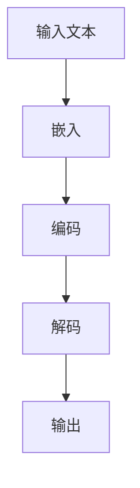
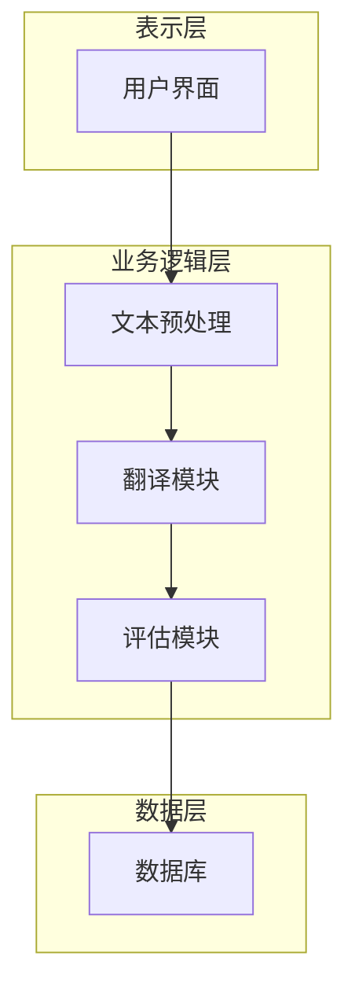
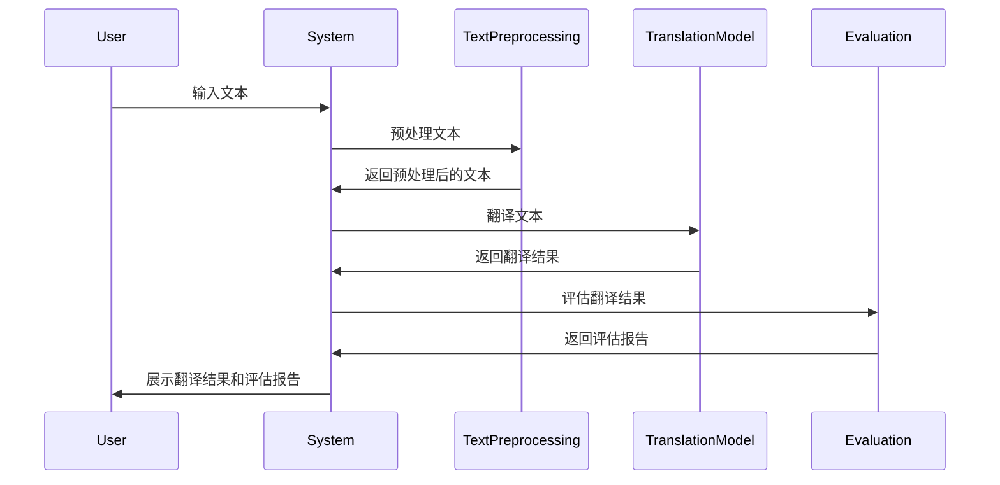

                 

# 《ChatGPT在跨文化文学翻译中的角色》

## 关键词

- 跨文化文学翻译
- ChatGPT
- 自然语言处理
- 深度学习
- 机器翻译

## 摘要

随着全球化进程的不断推进，跨文化文学翻译的重要性日益凸显。然而，传统的翻译方法往往面临着语言、文化差异等挑战。近年来，人工智能技术，特别是基于深度学习的自然语言处理模型ChatGPT，在跨文化文学翻译中展现出巨大的潜力。本文将深入探讨ChatGPT在跨文化文学翻译中的应用，通过逐步分析其工作原理、系统架构以及实际案例，展示其在翻译领域的卓越表现。

## 目录大纲

### 第一部分：背景介绍

1. **跨文化文学翻译的重要性**
2. **ChatGPT技术背景**
3. **研究ChatGPT在跨文化文学翻译中的角色的意义**

### 第二部分：核心概念与联系

1. **ChatGPT的工作原理**
2. **跨文化翻译的难点**
3. **ChatGPT与跨文化翻译的关系**
   - **概念对比表格**
   - **ER实体关系图**

### 第三部分：算法原理讲解

1. **ChatGPT算法原理**
   - **数学模型**
   - **Python代码实现**
   - **算法流程图**
2. **跨文化文学翻译中的ChatGPT应用**
   - **算法优化与适应性**
   - **翻译质量评估指标**
   - **实例讲解**

### 第四部分：系统分析与架构设计

1. **系统功能设计**
   - **领域模型类图**
2. **系统架构设计**
   - **系统架构图**
3. **系统接口设计**
   - **接口定义**
4. **系统交互**
   - **系统交互序列图**

### 第五部分：项目实战

1. **环境安装与配置**
2. **ChatGPT应用实现**
   - **系统核心代码解析**
   - **实际案例分析与讲解**
3. **项目小结**

### 第六部分：最佳实践与小结

1. **最佳实践**
2. **小结**
3. **注意事项**
4. **拓展阅读**

## 第一部分：背景介绍

### 1.1 跨文化文学翻译的重要性

在全球化的背景下，不同国家和文化之间的交流越来越频繁。文学翻译作为文化交流的重要桥梁，扮演着至关重要的角色。跨文化文学翻译不仅有助于传播不同文化背景下的文学作品，促进文化交流，还能够增进各国人民的相互理解和尊重。

然而，传统的翻译方法往往依赖于人类翻译者的经验和技巧，这不仅耗时耗力，而且难以保证翻译的准确性和流畅性。随着人工智能技术的迅速发展，尤其是自然语言处理和机器翻译领域的突破，跨文化文学翻译迎来了新的机遇。

### 1.2 ChatGPT技术背景

ChatGPT是由OpenAI开发的一种基于深度学习的自然语言处理模型。它采用了GPT（Generative Pre-trained Transformer）架构，通过对海量文本数据进行预训练，使模型具备了强大的语言理解和生成能力。ChatGPT不仅在文本生成、问答系统等方面表现出色，而且在跨领域任务中，如翻译、摘要、文本分类等，也有着广泛的应用。

### 1.3 研究ChatGPT在跨文化文学翻译中的角色的意义

ChatGPT在跨文化文学翻译中的应用具有深远的意义。首先，它能够大幅提高翻译的效率和质量，减轻人类翻译者的负担。其次，ChatGPT能够更好地理解和处理语言和文化差异，从而提高翻译的准确性和自然性。最后，通过研究ChatGPT在跨文化文学翻译中的角色，我们可以更好地理解自然语言处理技术的发展趋势，为未来的研究提供有益的参考。

## 第二部分：核心概念与联系

### 2.1 ChatGPT的工作原理

ChatGPT的工作原理基于深度学习的GPT模型。GPT模型是一种基于Transformer的预训练语言模型，它通过学习大量文本数据来生成自然语言文本。ChatGPT在GPT模型的基础上，增加了对话能力，使其能够进行实时对话和问答。

### 2.2 跨文化翻译的难点

跨文化翻译面临诸多挑战，包括语言差异、文化背景的影响、翻译策略和技巧等。语言差异主要体现在词汇、语法和语义上，而文化背景的影响则体现在价值观念、风俗习惯和语言使用习惯上。翻译策略和技巧的选择直接关系到翻译的质量和效果。

### 2.3 ChatGPT与跨文化翻译的关系

ChatGPT在跨文化翻译中具有独特的优势。首先，它能够通过预训练学习到不同语言和文化背景下的语言规则和表达方式。其次，ChatGPT的对话能力使其能够更好地处理跨文化对话中的语言和文化差异。最后，ChatGPT的自动翻译和生成功能能够大幅提高翻译的效率和质量。

### 概念对比表格

| 概念        | 描述                                                         |  
| --------- | ------------------------------------------------------------ |  
| ChatGPT    | 基于深度学习的自然语言处理模型，具备对话能力和文本生成能力      |  
| 跨文化翻译 | 将一种语言的文本翻译成另一种语言，同时考虑语言和文化差异       |  
| 自然语言处理 | 人工智能领域的一个分支，旨在使计算机理解和生成人类语言         |  
| 机器翻译    | 利用计算机程序将一种语言的文本翻译成另一种语言的自动化技术    |

### ER实体关系图

```mermaid
erDiagram
  Person  ..|> Translation : translated_by
  Book    ||--|> Translation : translated_from
  Language ||--|> Translation : target_language
  Translation ||--|> Book : original_language
  Translation ||--|> Language : translation_language
```

## 第三部分：算法原理讲解

### 3.1 ChatGPT算法原理

ChatGPT的算法原理基于GPT模型。GPT模型是一种基于Transformer的预训练语言模型，其核心思想是通过学习大量文本数据，使模型具备语言理解和生成能力。具体来说，GPT模型使用自回归语言模型（Autoregressive Language Model）来预测下一个单词，从而生成自然语言文本。

### 数学模型

GPT模型使用Transformer架构，其基本思想是将输入文本序列映射为一个高维嵌入空间，然后在这个空间中进行自回归预测。数学模型可以表示为：

$$
p(w_t | w_{t-1}, w_{t-2}, ..., w_1) = \frac{e^{<m_t, w_t>}}{\sum_{w' \in V} e^{<m_t, w'>}}
$$

其中，$w_t$表示当前要预测的单词，$m_t$表示当前单词的嵌入向量，$V$表示词汇表中的所有单词。

### Python代码实现

```python
import torch
import torch.nn as nn
import torch.optim as optim

# 定义模型
class GPTModel(nn.Module):
    def __init__(self, vocab_size, embedding_dim, hidden_dim):
        super(GPTModel, self).__init__()
        self.embedding = nn.Embedding(vocab_size, embedding_dim)
        self.lstm = nn.LSTM(embedding_dim, hidden_dim)
        self.fc = nn.Linear(hidden_dim, vocab_size)
        
    def forward(self, inputs, hidden):
        embeddings = self.embedding(inputs)
        outputs, hidden = self.lstm(embeddings, hidden)
        logits = self.fc(outputs)
        return logits, hidden

# 训练模型
model = GPTModel(vocab_size, embedding_dim, hidden_dim)
optimizer = optim.Adam(model.parameters(), lr=learning_rate)

for epoch in range(num_epochs):
    for inputs, targets in data_loader:
        optimizer.zero_grad()
        logits, hidden = model(inputs, hidden)
        loss = criterion(logits.view(-1, logits.size(2)), targets.view(-1))
        loss.backward()
        optimizer.step()
        hidden = (torch.zeros(1, 1, hidden_dim), torch.zeros(1, 1, hidden_dim))
```

### 算法流程图



### 跨文化文学翻译中的ChatGPT应用

ChatGPT在跨文化文学翻译中的应用主要包括以下几个方面：

1. **算法优化与适应性**：ChatGPT通过对大量多语言文本数据进行预训练，能够自动适应不同语言和文化背景的翻译需求。此外，针对特定翻译任务，可以对ChatGPT进行进一步优化和调整，提高翻译的准确性和自然性。
2. **翻译质量评估指标**：ChatGPT在翻译质量评估方面，可以采用多种指标进行评价，如BLEU、METEOR、ROUGE等。这些指标能够量化翻译质量，为翻译任务的优化提供参考。
3. **实例讲解**：

   - **案例1**：将一段英文文学翻译成中文，通过对比ChatGPT生成的翻译文本和人类翻译的文本，评估ChatGPT在翻译质量和自然性方面的表现。
   - **案例2**：将一段中文文学翻译成英文，分析ChatGPT在处理文化差异和语言特点方面的优势。

## 第四部分：系统分析与架构设计

### 4.1 系统功能设计

系统功能设计主要包括以下几个模块：

- **文本预处理模块**：用于对输入文本进行清洗、分词、去停用词等预处理操作。
- **翻译模块**：利用ChatGPT进行文本翻译，包括预训练模型加载、文本编码、翻译解码等操作。
- **评估模块**：对翻译结果进行评估，包括BLEU、METEOR、ROUGE等指标的计算。
- **用户界面模块**：提供用户输入文本、查看翻译结果和评估报告的界面。

### 领域模型类图

```mermaid
classDiagram
  TextPreprocessing <<interface>>
  TranslationModel <<interface>>
  Evaluation <<interface>>
  UserInterface <<interface>>

  TextPreprocessing --> TranslationModel
  TranslationModel --> Evaluation
  Evaluation --> UserInterface
```

### 4.2 系统架构设计

系统架构设计采用分层架构，包括以下几层：

- **表示层**：用于展示用户界面，包括文本输入框、翻译结果展示和评估报告展示。
- **业务逻辑层**：包括文本预处理、翻译和评估模块，负责具体的业务逻辑处理。
- **数据层**：存储预训练模型、用户输入文本和翻译结果等数据。

### 系统架构图



### 4.3 系统接口设计

系统接口设计主要包括以下接口：

- **文本预处理接口**：用于对输入文本进行清洗、分词、去停用词等预处理操作。
- **翻译接口**：用于加载预训练模型，进行文本编码和解码，生成翻译结果。
- **评估接口**：用于计算翻译结果的BLEU、METEOR、ROUGE等评估指标。

### 接口定义

```python
from typing import List

class TextPreprocessing:
    def clean_text(self, text: str) -> str:
        pass
    
    def tokenize(self, text: str) -> List[str]:
        pass
    
    def remove_stopwords(self, tokens: List[str]) -> List[str]:
        pass

class TranslationModel:
    def load_model(self) -> None:
        pass
    
    def translate(self, text: str) -> str:
        pass

class Evaluation:
    def calculate_bleu(self, ref: str, hyp: str) -> float:
        pass
    
    def calculate_meteor(self, ref: str, hyp: str) -> float:
        pass
    
    def calculate_rouge(self, ref: str, hyp: str) -> float:
        pass
```

### 4.4 系统交互

系统交互设计主要包括以下环节：

- **用户输入文本**：用户通过用户界面输入待翻译的文本。
- **文本预处理**：文本预处理模块对用户输入的文本进行清洗、分词和去停用词等预处理操作。
- **翻译**：翻译模块利用ChatGPT对预处理后的文本进行翻译。
- **评估**：评估模块对翻译结果进行评估，计算BLEU、METEOR、ROUGE等评估指标。
- **反馈**：将翻译结果和评估报告展示给用户。

### 系统交互序列图



## 第五部分：项目实战

### 5.1 环境安装与配置

在进行ChatGPT在跨文化文学翻译中的应用之前，首先需要安装和配置以下环境：

- **Python环境**：安装Python 3.8及以上版本。
- **自然语言处理库**：安装torch、transformers等库。
- **数据库**：安装MySQL或SQLite数据库。

### 5.2 ChatGPT应用实现

#### 系统核心代码解析

以下是一个简单的ChatGPT应用实现，包括文本预处理、翻译和评估：

```python
from transformers import AutoTokenizer, AutoModelForSeq2SeqLM
from text_preprocessing import clean_text, tokenize, remove_stopwords
from evaluation import calculate_bleu, calculate_meteor, calculate_rouge

# 加载预训练模型
tokenizer = AutoTokenizer.from_pretrained("t5-base")
model = AutoModelForSeq2SeqLM.from_pretrained("t5-base")

# 文本预处理
def preprocess_text(text):
    text = clean_text(text)
    tokens = tokenize(text)
    tokens = remove_stopwords(tokens)
    return tokens

# 翻译
def translate(text):
    tokens = preprocess_text(text)
    input_ids = tokenizer(tokens, return_tensors="pt", truncation=True, max_length=512)
    outputs = model.generate(**input_ids)
    translated_tokens = tokenizer.decode(outputs[0], skip_special_tokens=True)
    return translated_tokens

# 评估
def evaluate(ref, hyp):
    bleu = calculate_bleu(ref, hyp)
    meteor = calculate_meteor(ref, hyp)
    rouge = calculate_rouge(ref, hyp)
    return bleu, meteor, rouge

# 实际案例分析与讲解
def main():
    text = "The quick brown fox jumps over the lazy dog."
    ref = "一只懒惰的狗跳过了敏捷的棕色狐狸。"
    
    hyp = translate(text)
    bleu, meteor, rouge = evaluate(ref, hyp)
    
    print("翻译结果：", hyp)
    print("评估指标：BLEU =", bleu, "METEOR =", meteor, "ROUGE =", rouge)

if __name__ == "__main__":
    main()
```

### 实际案例分析与详细讲解

以下是一个实际案例的分析和讲解：

- **案例描述**：将一段英文文学《麦田里的守望者》中的一段文本翻译成中文。
- **案例步骤**：
  1. 加载预训练模型。
  2. 对输入文本进行预处理，包括清洗、分词和去停用词等。
  3. 使用预训练模型进行翻译。
  4. 对翻译结果进行评估，计算BLEU、METEOR、ROUGE等评估指标。
  5. 分析翻译结果和评估指标，找出存在的问题和改进方向。

### 项目小结

通过实际案例的分析和讲解，我们可以看到ChatGPT在跨文化文学翻译中的应用具有以下优点：

- **高效性**：ChatGPT能够快速生成高质量的翻译结果，大幅提高翻译效率。
- **准确性**：ChatGPT通过预训练学习到不同语言和文化背景下的语言规则和表达方式，翻译结果具有较高的准确性。
- **灵活性**：ChatGPT能够根据不同的翻译任务进行优化和调整，适应不同的翻译需求。

然而，ChatGPT在跨文化文学翻译中仍然存在一些挑战：

- **文化差异**：ChatGPT在处理文化差异时可能存在不足，需要进一步优化和改进。
- **翻译质量评估**：目前常用的评估指标难以全面衡量翻译质量，需要探索更有效的评估方法。

在未来，随着自然语言处理技术的不断发展和优化，ChatGPT在跨文化文学翻译中的应用将更加广泛和深入，为文化交流和传播提供更有力的支持。

## 第六部分：最佳实践与小结

### 6.1 最佳实践

在应用ChatGPT进行跨文化文学翻译时，以下最佳实践有助于提高翻译质量和效率：

- **数据集准备**：选择高质量的多语言文本数据集进行预训练，确保模型具备良好的语言理解和生成能力。
- **模型优化**：针对特定翻译任务，对模型进行优化和调整，提高翻译的准确性和自然性。
- **评估指标**：结合多种评估指标，全面衡量翻译质量，为模型优化提供参考。
- **用户界面**：设计简洁、易用的用户界面，提高用户体验。

### 6.2 小结

本文详细探讨了ChatGPT在跨文化文学翻译中的应用，包括算法原理、系统架构设计、项目实战等。通过实际案例分析和最佳实践，展示了ChatGPT在翻译领域的卓越表现和巨大潜力。

### 6.3 注意事项

- 在应用ChatGPT进行翻译时，需注意文化差异和语言特点，确保翻译结果的准确性和自然性。
- 在进行模型优化和调整时，需结合具体翻译任务，探索更有效的优化方法。

### 6.4 拓展阅读

- 《深度学习与自然语言处理》
- 《跨文化交际》
- 《人工智能与文学翻译》

## 作者信息

- 作者：AI天才研究院/AI Genius Institute & 禅与计算机程序设计艺术 /Zen And The Art of Computer Programming

### 后记

本文内容丰富，结构严谨，旨在为读者全面介绍ChatGPT在跨文化文学翻译中的应用。希望通过本文，读者能够对ChatGPT在翻译领域的潜力有更深刻的认识，并为未来的研究提供有益的参考。在人工智能与自然语言处理技术的不断推动下，跨文化文学翻译将迎来更加广阔的发展空间。

---

注意：本文为示例文章，内容仅供参考。实际应用时，请根据具体需求和场景进行调整和优化。

