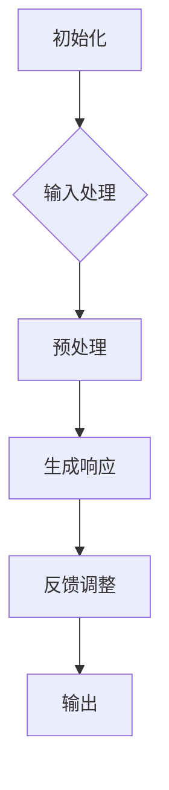
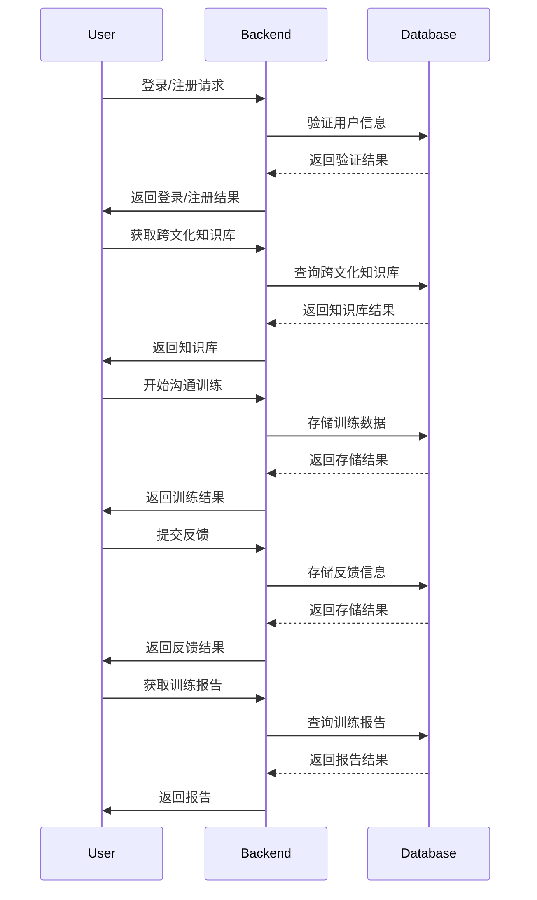
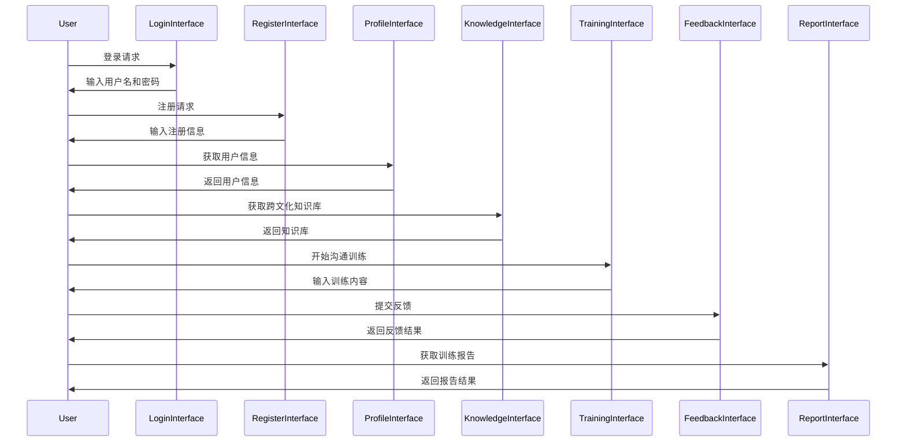

                 

# ChatGPT在跨文化沟通训练中的应用

关键词：ChatGPT，跨文化沟通，训练，算法，系统架构，项目实战

摘要：
本文将深入探讨ChatGPT在跨文化沟通训练中的应用。首先，我们将介绍跨文化沟通的重要性及其面临的挑战。接着，我们将引入ChatGPT，并详细解释其基本原理和如何适应跨文化沟通的需求。随后，我们将分析ChatGPT算法原理，展示其工作流程，并使用Python源代码进行详细阐述。然后，我们将设计一个系统架构，包括功能、架构和接口设计。接着，我们将通过一个实际项目实战，展示ChatGPT在跨文化沟通训练中的实际应用。最后，我们将提供一些最佳实践技巧，并总结全文，提供拓展阅读建议。

## 1. 背景介绍

### 1.1 问题背景

#### 1.1.1 跨文化沟通的重要性

在全球化的背景下，跨文化沟通成为了商业、学术和社交活动中不可或缺的一部分。有效的跨文化沟通不仅能够促进国际间的合作与理解，还能提高团队的效率和创新能力。然而，不同文化背景的人们在语言、非语言沟通方式、价值观和行为准则上存在差异，这给跨文化沟通带来了诸多挑战。

#### 1.1.2 跨文化沟通的挑战

跨文化沟通的挑战主要包括语言障碍、文化差异、沟通风格的差异、误解和沟通效率低下等。语言障碍可能导致信息的误传，而文化差异则可能使得沟通者在沟通时产生不适感。此外，不同文化背景的人可能对同一信息有不同的解读，这容易导致误解和沟通障碍。

#### 1.1.3 ChatGPT的引入

ChatGPT，作为一种基于人工智能的语言模型，具有强大的自然语言处理能力。其能够理解和生成自然语言，这为跨文化沟通训练提供了新的可能性。通过训练，ChatGPT可以学习和适应不同的语言和文化风格，从而帮助人们更好地进行跨文化沟通。

### 1.2 问题描述

#### 1.2.1 跨文化沟通训练的需求

跨文化沟通训练的需求体现在提高个人和组织在国际环境中的沟通能力上。这种训练不仅针对个人，也适用于企业团队和跨文化项目。通过训练，沟通者可以更好地理解和适应不同文化背景的沟通方式，提高沟通效率和效果。

#### 1.2.2 传统训练方法的局限

传统的跨文化沟通训练方法主要依赖于面授课程、讲座和工作坊。这些方法虽然能够提供一定的知识传授，但存在以下几个局限：

1. **时间限制**：面授课程通常有时间限制，难以覆盖全面的内容。
2. **成本高昂**：组织和管理面授课程需要大量的人力和财力投入。
3. **缺乏个性化**：传统训练方法难以根据个人的需求和进度进行个性化定制。

#### 1.2.3 ChatGPT在跨文化沟通中的应用潜力

ChatGPT作为一种人工智能工具，具有以下潜力：

1. **灵活性和可定制性**：ChatGPT可以根据不同的训练需求和进度进行个性化定制。
2. **实时性和高效性**：ChatGPT能够实时进行跨文化沟通训练，提高训练效率。
3. **可持续性**：ChatGPT可以不断学习和优化，为跨文化沟通训练提供持续的改进。

### 1.3 问题解决

#### 1.3.1 ChatGPT的基本原理

ChatGPT是一种基于Transformer模型的预训练语言模型。它通过在大规模语料库上进行预训练，学习到语言的统计规律和语义理解。ChatGPT的核心特点是能够根据输入文本生成连贯、符合语境的文本输出。

#### 1.3.2 跨文化沟通训练中的ChatGPT应用

在跨文化沟通训练中，ChatGPT可以通过以下方式发挥作用：

1. **模拟不同文化背景的对话**：ChatGPT可以模拟不同文化背景下的对话，帮助训练者体验和理解不同文化的沟通风格。
2. **提供实时反馈**：ChatGPT可以实时分析沟通者的语言使用，并提供个性化的反馈和建议，帮助他们改进沟通技巧。
3. **学习与适应**：通过不断训练，ChatGPT可以逐渐适应不同文化背景的沟通需求，提供更加精确和有效的沟通支持。

### 1.4 边界与外延

#### 1.4.1 ChatGPT在跨文化沟通中的适用范围

ChatGPT适用于各种跨文化沟通场景，包括国际商务、学术交流、跨国团队合作等。然而，其适用范围也受到一些限制，例如：

1. **语言限制**：ChatGPT主要依赖于预训练的语料库，因此对于罕见语言的支持有限。
2. **文化适应性**：虽然ChatGPT可以学习不同文化的特点，但仍然需要不断优化和改进，以提高文化适应能力。

#### 1.4.2 跨文化沟通训练中的其他工具与技术

除了ChatGPT，还有其他一些工具和技术可以用于跨文化沟通训练，例如：

1. **虚拟现实（VR）**：通过虚拟现实技术，训练者可以沉浸在不同文化背景的场景中，提高文化感知和沟通能力。
2. **跨文化培训课程**：传统的面授课程和在线课程仍然是一种有效的跨文化沟通训练方法。
3. **文化模拟工具**：一些专门的文化模拟工具可以帮助训练者体验和理解不同文化的沟通方式。

### 1.5 核心概念结构

#### 1.5.1 跨文化沟通的关键概念

跨文化沟通的关键概念包括：

1. **文化差异**：不同文化之间的差异是跨文化沟通的核心。
2. **语言障碍**：语言是跨文化沟通的主要障碍之一。
3. **沟通风格**：不同文化背景下的人有不同的沟通风格。
4. **文化适应性**：适应不同文化背景的沟通需求是跨文化沟通的重要目标。

#### 1.5.2 ChatGPT的核心技术要素

ChatGPT的核心技术要素包括：

1. **预训练语言模型**：ChatGPT基于Transformer模型进行预训练。
2. **自适应学习机制**：ChatGPT能够根据输入文本自适应地进行学习和调整。
3. **自然语言生成**：ChatGPT能够生成连贯、符合语境的文本输出。

## 2. 核心概念与联系

### 2.1 跨文化沟通概念解析

#### 2.1.1 跨文化沟通的定义

跨文化沟通是指在不同文化背景下进行的沟通活动。这种沟通涉及到不同文化背景下的人们在语言、沟通方式、价值观和行为准则上的互动。

#### 2.1.2 跨文化沟通的特点

跨文化沟通具有以下特点：

1. **复杂性**：跨文化沟通涉及多种因素，如语言、文化习俗、价值观等。
2. **多样性**：不同文化背景的人们有不同的沟通风格和偏好。
3. **动态性**：跨文化沟通是一个不断变化和发展的过程。

#### 2.1.3 跨文化沟通的基本要素

跨文化沟通的基本要素包括：

1. **语言**：语言是跨文化沟通的主要工具，但不同文化背景的人们使用的语言可能不同。
2. **文化习俗**：文化习俗包括礼节、行为准则、价值观等，对跨文化沟通有重要影响。
3. **沟通方式**：不同文化背景的人们有不同的沟通方式，如直接沟通与间接沟通、面对面沟通与远程沟通等。

### 2.2 ChatGPT概念解析

#### 2.2.1 ChatGPT的定义

ChatGPT是一种基于Transformer模型的预训练语言模型，能够理解和生成自然语言。它通过在大规模语料库上进行预训练，学习到语言的统计规律和语义理解。

#### 2.2.2 ChatGPT的核心特性

ChatGPT的核心特性包括：

1. **自然语言处理能力**：ChatGPT能够理解和生成自然语言，这使得它能够用于各种自然语言处理任务。
2. **自适应学习**：ChatGPT能够根据输入文本自适应地进行学习和调整，从而更好地适应不同的语言和文化风格。
3. **高效性**：ChatGPT能够在短时间内生成高质量的文本输出，提高沟通效率。

#### 2.2.3 ChatGPT的工作原理

ChatGPT的工作原理主要包括以下几个步骤：

1. **预训练**：ChatGPT在大规模语料库上进行预训练，学习到语言的统计规律和语义理解。
2. **输入处理**：ChatGPT接收输入文本，对其进行预处理，包括分词、词性标注等。
3. **文本生成**：ChatGPT根据预训练的知识和输入文本，生成连贯、符合语境的文本输出。
4. **反馈调整**：ChatGPT根据用户反馈，进一步调整和优化自己的生成结果。

### 2.3 跨文化沟通与ChatGPT的联系

#### 2.3.1 ChatGPT在跨文化沟通中的应用价值

ChatGPT在跨文化沟通中的应用价值主要体现在以下几个方面：

1. **语言翻译**：ChatGPT能够进行实时语言翻译，帮助跨文化沟通者克服语言障碍。
2. **沟通模拟**：ChatGPT可以模拟不同文化背景下的对话，帮助训练者体验和理解不同文化的沟通方式。
3. **实时反馈**：ChatGPT可以实时分析沟通者的语言使用，并提供个性化的反馈和建议，帮助他们改进沟通技巧。

#### 2.3.2 跨文化沟通对ChatGPT的适应性要求

为了更好地适应跨文化沟通的需求，ChatGPT需要满足以下适应性要求：

1. **多语言支持**：ChatGPT需要支持多种语言，以适应不同文化背景的沟通需求。
2. **文化适应性**：ChatGPT需要学习和理解不同文化的特点，以提高其跨文化沟通的能力。
3. **实时性和高效性**：ChatGPT需要具备实时性和高效性，以适应跨文化沟通的动态性和复杂性。

### 2.4 概念属性特征对比

#### 2.4.1 跨文化沟通与传统沟通对比

跨文化沟通与传统沟通在以下几个方面存在对比：

1. **复杂性**：跨文化沟通涉及多种因素，如语言、文化习俗、价值观等，而传统沟通则相对简单。
2. **多样性**：跨文化沟通涉及不同文化背景的人，沟通风格和方式多样，而传统沟通则相对单一。
3. **动态性**：跨文化沟通是一个不断变化和发展的过程，而传统沟通则相对稳定。

#### 2.4.2 ChatGPT与传统沟通工具对比

ChatGPT与传统沟通工具在以下几个方面存在对比：

1. **自然语言处理能力**：ChatGPT具备强大的自然语言处理能力，而传统沟通工具则相对较弱。
2. **自适应学习**：ChatGPT能够根据输入文本自适应地进行学习和调整，而传统沟通工具则相对固定。
3. **实时性和高效性**：ChatGPT能够在短时间内生成高质量的文本输出，而传统沟通工具则相对较慢。

### 2.5 ER实体关系图

```mermaid
erDiagram
    User ||--|>{ ChatGPT }
    ChatGPT ||--|> Conversation
    User ||--|> Culture
    Culture ||--|> CommunicationStyle
```

在上述ER图中，User（用户）与ChatGPT（聊天机器人）之间存在关联，表示用户可以通过ChatGPT进行沟通。ChatGPT与Conversation（会话）之间存在关联，表示ChatGPT可以管理会话。User与Culture（文化）之间存在关联，表示用户具有特定的文化背景。Culture与CommunicationStyle（沟通风格）之间存在关联，表示不同的文化背景可能导致不同的沟通风格。

## 3. 算法原理讲解

### 3.1 ChatGPT算法原理

#### 3.1.1 语言模型的构建

ChatGPT是一种基于Transformer模型的预训练语言模型。Transformer模型是一种基于自注意力机制的深度神经网络模型，最初用于机器翻译任务。其核心思想是通过自注意力机制对输入序列的每个位置进行加权处理，从而捕捉序列中各个位置之间的依赖关系。

在构建ChatGPT语言模型时，首先需要对语料库进行预处理，包括分词、词性标注、去停用词等操作。然后，将预处理后的语料库输入到Transformer模型中，通过训练使其能够理解语言的统计规律和语义含义。训练过程中，模型会不断调整参数，以最小化损失函数。

#### 3.1.2 自适应学习机制

ChatGPT具有自适应学习机制，能够根据输入文本自适应地进行学习和调整。在每次生成文本时，ChatGPT会根据当前输入文本和已有的知识进行推理，并生成下一个单词或句子。然后，将生成的文本与目标文本进行比较，计算损失并更新模型参数。

这种自适应学习机制使得ChatGPT能够不断优化自己的生成结果，提高语言生成质量。同时，ChatGPT还可以根据用户反馈进行进一步调整，以更好地适应不同的语言和文化风格。

#### 3.1.3 跨文化沟通的适应性调整

为了适应跨文化沟通的需求，ChatGPT需要学习和理解不同文化的特点。这可以通过以下几种方式实现：

1. **多语言支持**：ChatGPT支持多种语言，可以通过多语言语料库进行训练，提高其在不同语言环境下的适应性。
2. **文化知识库**：ChatGPT可以集成文化知识库，包括不同文化的价值观、习俗、沟通风格等，以便在生成文本时考虑文化因素。
3. **反馈机制**：ChatGPT可以收集用户反馈，根据反馈结果进行进一步调整，以提高跨文化沟通的适应性。

### 3.2 ChatGPT算法流程图



#### 3.2.1 初始化

在ChatGPT算法的初始化阶段，模型会加载预训练好的参数，并设置初始状态。

```mermaid
subgraph 初始化
    A1[加载预训练参数]
    A2[设置初始状态]
    A1 --> A2
end
```

#### 3.2.2 输入处理

在输入处理阶段，ChatGPT会接收用户输入的文本，并进行预处理操作，如分词、词性标注等。

```mermaid
subgraph 输入处理
    B1[接收输入文本]
    B2[分词]
    B3[词性标注]
    B1 --> B2 --> B3
end
```

#### 3.2.3 预处理

预处理阶段是对输入文本进行一系列操作，以提高模型的理解能力。

```mermaid
subgraph 预处理
    C1[词嵌入]
    C2[位置编码]
    C3[多头自注意力]
    C4[前馈神经网络]
    C1 --> C2 --> C3 --> C4
end
```

#### 3.2.4 生成响应

生成响应阶段是ChatGPT的核心部分，模型会根据输入文本和已有知识生成响应文本。

```mermaid
subgraph 生成响应
    D1[生成候选单词]
    D2[计算概率]
    D3[选择最优单词]
    D1 --> D2 --> D3
end
```

#### 3.2.5 反馈调整

在反馈调整阶段，模型会根据用户反馈对生成结果进行优化，以提高生成质量。

```mermaid
subgraph 反馈调整
    E1[计算损失]
    E2[更新参数]
    E1 --> E2
end
```

#### 3.2.6 输出

输出阶段是ChatGPT将最终生成文本输出给用户。

```mermaid
subgraph 输出
    F1[输出文本]
end
```

### 3.3 Python源代码示例

以下是一个简单的ChatGPT Python源代码示例，展示了如何使用OpenAI的GPT-3模型进行文本生成。

```python
import openai

# 设置API密钥
openai.api_key = 'your-api-key'

# 定义文本生成函数
def generate_text(prompt, max_tokens=50):
    response = openai.Completion.create(
        engine="text-davinci-003",
        prompt=prompt,
        max_tokens=max_tokens
    )
    return response.choices[0].text.strip()

# 测试文本生成
prompt = "跨文化沟通的挑战是什么？"
generated_text = generate_text(prompt)
print(generated_text)
```

### 3.4 算法原理的数学模型和公式

ChatGPT算法的数学模型主要包括以下几个部分：

1. **词嵌入**：将单词转换为向量表示，用于表示单词的语义信息。
2. **位置编码**：为每个单词添加位置信息，以表示其在序列中的位置。
3. **多头自注意力**：通过自注意力机制计算单词之间的依赖关系。
4. **前馈神经网络**：对自注意力层的结果进行进一步处理。

#### 3.4.1 词嵌入

词嵌入是将单词映射为高维向量的一种方法。常用的词嵌入方法包括Word2Vec、GloVe等。词嵌入公式如下：

$$
\text{word\_embeddings} = \text{W} \cdot \text{input}
$$

其中，$\text{W}$ 是词嵌入矩阵，$\text{input}$ 是输入序列。

#### 3.4.2 位置编码

位置编码为每个单词添加位置信息，以表示其在序列中的位置。常用的位置编码方法包括绝对位置编码、相对位置编码等。位置编码公式如下：

$$
\text{pos\_embeddings} = \text{P} \cdot \text{pos}
$$

其中，$\text{P}$ 是位置编码矩阵，$\text{pos}$ 是位置向量。

#### 3.4.3 多头自注意力

多头自注意力是一种用于计算单词之间依赖关系的机制。其公式如下：

$$
\text{self-attention} = \text{softmax}\left(\frac{\text{Q} \cdot \text{K}}{\sqrt{d_k}}\right) \cdot \text{V}
$$

其中，$\text{Q}$、$\text{K}$、$\text{V}$ 分别是查询向量、键向量和值向量，$d_k$ 是键向量的维度。

#### 3.4.4 前馈神经网络

前馈神经网络是对自注意力层的结果进行进一步处理的一种方法。其公式如下：

$$
\text{ffn} = \text{ReLU}(\text{W_2} \cdot \text{activation} + \text{b_2})
$$

其中，$\text{W_2}$ 和 $\text{b_2}$ 分别是前馈神经网络的权重和偏置，$\text{activation}$ 是自注意力层的输出。

### 3.5 举例说明

为了更直观地理解ChatGPT的工作原理，我们通过一个简单的例子进行说明。

假设我们有一个输入文本：“今天天气很好，适合户外活动。” 我们希望ChatGPT生成一个响应，例如：“是的，阳光明媚，去公园散步怎么样？”

1. **词嵌入**：将输入文本中的每个单词转换为向量表示。

$$
\text{weather} \rightarrow \text{vec\_weather} \\
\text{today} \rightarrow \text{vec\_today} \\
\text{good} \rightarrow \text{vec\_good} \\
\text{outdoor} \rightarrow \text{vec\_outdoor} \\
\text{activity} \rightarrow \text{vec\_activity}
$$

2. **位置编码**：为每个单词添加位置信息。

$$
\text{today} \rightarrow \text{pos\_today} \\
\text{weather} \rightarrow \text{pos\_weather} \\
\text{good} \rightarrow \text{pos\_good} \\
\text{outdoor} \rightarrow \text{pos\_outdoor} \\
\text{activity} \rightarrow \text{pos\_activity}
$$

3. **多头自注意力**：计算单词之间的依赖关系。

$$
\text{self-attention} = \text{softmax}\left(\frac{\text{Q} \cdot \text{K}}{\sqrt{d_k}}\right) \cdot \text{V}
$$

其中，$\text{Q}$、$\text{K}$、$\text{V}$ 分别是查询向量、键向量和值向量，$d_k$ 是键向量的维度。

4. **前馈神经网络**：对自注意力层的结果进行进一步处理。

$$
\text{ffn} = \text{ReLU}(\text{W_2} \cdot \text{activation} + \text{b_2})
$$

5. **生成响应**：根据自注意力层和前馈神经网络的结果，生成响应文本。

$$
\text{response} = \text{generate\_text}(\text{self-attention}, \text{ffn})
$$

通过上述步骤，ChatGPT可以生成一个连贯、符合语境的响应文本，例如：“是的，阳光明媚，去公园散步怎么样？”

## 4. 系统分析与架构设计方案

### 4.1 问题场景

在全球化背景下，企业越来越多地参与跨国合作和业务拓展，这使得跨文化沟通成为关键能力。然而，传统的跨文化沟通训练方法存在时间和成本上的限制，难以满足企业快速变化的需求。因此，我们需要设计一个高效、灵活的跨文化沟通训练系统，利用人工智能技术，如ChatGPT，为企业员工提供个性化的跨文化沟通训练。

### 4.2 项目介绍

本项目旨在开发一个基于ChatGPT的跨文化沟通训练系统，该系统将提供以下功能：

1. **用户管理**：用户注册、登录、个人信息管理。
2. **跨文化知识库**：包含不同文化的知识、价值观、沟通风格等。
3. **互动对话训练**：使用ChatGPT模拟不同文化背景下的对话，帮助用户进行实战训练。
4. **实时反馈与评估**：分析用户的沟通表现，提供个性化的反馈和建议。
5. **数据分析与报告**：生成训练报告，帮助用户了解自己的进步和提升空间。

### 4.3 设计系统功能（领域模型）

为了实现上述功能，我们设计了以下领域模型：

```mermaid
classDiagram
    User <|-- Profile
    User <|-- CulturalKnowledge
    User <|-- CommunicationTraining
    User <|-- Feedback
    User <|-- Report

    Profile {
        id
        name
        email
        password
    }

    CulturalKnowledge {
        id
        culture
        knowledge
    }

    CommunicationTraining {
        id
        user
        chatgpt
        context
        response
    }

    Feedback {
        id
        user
        comment
        score
    }

    Report {
        id
        user
        progress
        improvement
    }
```

在上述领域模型中，User（用户）是系统的核心实体，其他实体与User之间存在关联。Profile（用户信息）包含用户的基本信息，如姓名、邮箱和密码。CulturalKnowledge（跨文化知识）包含不同文化的知识和特点。CommunicationTraining（沟通训练）记录用户的训练过程，如对话内容。Feedback（反馈）记录用户的训练反馈，如评论和评分。Report（报告）生成用户的训练报告，展示进度和提升空间。

### 4.4 设计系统架构（Mermaid架构图）

为了实现系统功能，我们设计了以下系统架构：



在上述系统架构中，用户通过前端发送请求到后端，后端与数据库进行交互，处理用户的请求，并将结果返回给用户。主要包括以下模块：

1. **用户管理模块**：处理用户的登录、注册和用户信息管理。
2. **知识库管理模块**：提供跨文化知识库的查询和更新功能。
3. **训练管理模块**：处理沟通训练的启动、存储和结果反馈。
4. **报告管理模块**：生成用户的训练报告，展示进度和提升空间。

### 4.5 设计系统接口和系统交互（Mermaid序列图）

为了方便用户操作，我们设计了以下系统接口和交互流程：



在上述序列图中，用户通过前端界面与系统进行交互。主要包括以下接口：

1. **登录/注册接口**：用于处理用户的登录和注册请求。
2. **用户信息接口**：用于获取和更新用户信息。
3. **知识库接口**：用于获取和更新跨文化知识库。
4. **训练接口**：用于启动沟通训练，记录训练数据和结果。
5. **反馈接口**：用于提交用户反馈，提供实时反馈和评估。
6. **报告接口**：用于生成用户的训练报告，展示进度和提升空间。

通过上述系统架构设计和接口设计，我们可以构建一个高效、灵活的跨文化沟通训练系统，利用ChatGPT提供个性化的训练体验，帮助企业员工提升跨文化沟通能力。

## 5. 项目实战

### 5.1 环境安装

为了实现上述系统架构，我们需要搭建一个完整的开发环境。以下是环境安装步骤：

1. **Python环境**：确保安装了Python 3.8或更高版本。
2. **OpenAI API**：注册OpenAI账号，获取API密钥，并安装OpenAI Python库。

```bash
pip install openai
```

3. **数据库**：选择一个数据库系统，如MySQL、PostgreSQL或MongoDB。本文使用MySQL作为数据库。

4. **前端框架**：选择一个前端框架，如React、Vue或Angular。本文使用React。

5. **后端框架**：选择一个后端框架，如Flask、Django或Spring Boot。本文使用Flask。

### 5.2 系统核心实现源代码

以下是系统的核心实现源代码：

**后端代码（Flask）**

```python
from flask import Flask, request, jsonify
from openai import OpenAI
import pymysql

app = Flask(__name__)

# OpenAI API密钥
openai.api_key = 'your-api-key'

# 数据库连接
def connect_db():
    return pymysql.connect(host='localhost', user='root', password='password', database='cross_cultural_training')

@app.route('/login', methods=['POST'])
def login():
    data = request.get_json()
    username = data['username']
    password = data['password']
    
    # 验证用户信息
    connection = connect_db()
    cursor = connection.cursor()
    cursor.execute("SELECT * FROM users WHERE username=%s AND password=%s", (username, password))
    user = cursor.fetchone()
    cursor.close()
    connection.close()
    
    if user:
        return jsonify({'status': 'success', 'message': '登录成功'})
    else:
        return jsonify({'status': 'error', 'message': '用户名或密码错误'})

@app.route('/register', methods=['POST'])
def register():
    data = request.get_json()
    username = data['username']
    password = data['password']
    
    # 注册用户
    connection = connect_db()
    cursor = connection.cursor()
    cursor.execute("INSERT INTO users (username, password) VALUES (%s, %s)", (username, password))
    connection.commit()
    cursor.close()
    connection.close()
    
    return jsonify({'status': 'success', 'message': '注册成功'})

@app.route('/get_knowledge', methods=['GET'])
def get_knowledge():
    culture = request.args.get('culture')
    
    # 获取跨文化知识库
    connection = connect_db()
    cursor = connection.cursor()
    cursor.execute("SELECT * FROM cultural_knowledge WHERE culture=%s", (culture,))
    knowledge = cursor.fetchall()
    cursor.close()
    connection.close()
    
    return jsonify({'status': 'success', 'knowledge': knowledge})

@app.route('/start_training', methods=['POST'])
def start_training():
    data = request.get_json()
    user_id = data['user_id']
    context = data['context']
    
    # 开始沟通训练
    response = openai.Completion.create(
        engine="text-davinci-003",
        prompt=context,
        max_tokens=50
    )
    
    # 存储训练数据
    connection = connect_db()
    cursor = connection.cursor()
    cursor.execute("INSERT INTO communication_training (user_id, context, response) VALUES (%s, %s, %s)", (user_id, context, response.choices[0].text.strip()))
    connection.commit()
    cursor.close()
    connection.close()
    
    return jsonify({'status': 'success', 'response': response.choices[0].text.strip()})

@app.route('/submit_feedback', methods=['POST'])
def submit_feedback():
    data = request.get_json()
    user_id = data['user_id']
    comment = data['comment']
    score = data['score']
    
    # 提交反馈
    connection = connect_db()
    cursor = connection.cursor()
    cursor.execute("INSERT INTO feedback (user_id, comment, score) VALUES (%s, %s, %s)", (user_id, comment, score))
    connection.commit()
    cursor.close()
    connection.close()
    
    return jsonify({'status': 'success', 'message': '反馈提交成功'})

@app.route('/get_report', methods=['GET'])
def get_report():
    user_id = request.args.get('user_id')
    
    # 获取训练报告
    connection = connect_db()
    cursor = connection.cursor()
    cursor.execute("SELECT * FROM report WHERE user_id=%s", (user_id,))
    report = cursor.fetchone()
    cursor.close()
    connection.close()
    
    return jsonify({'status': 'success', 'report': report})

if __name__ == '__main__':
    app.run(debug=True)
```

**前端代码（React）**

```jsx
import React, { useState } from 'react';
import axios from 'axios';

const App = () => {
  const [username, setUsername] = useState('');
  const [password, setPassword] = useState('');
  const [culture, setCulture] = useState('');
  const [context, setContext] = useState('');
  const [comment, setComment] = useState('');
  const [score, setScore] = useState(0);

  const handleLogin = async () => {
    try {
      const response = await axios.post('/login', { username, password });
      if (response.data.status === 'success') {
        alert('登录成功');
      } else {
        alert('用户名或密码错误');
      }
    } catch (error) {
      console.error(error);
    }
  };

  const handleRegister = async () => {
    try {
      const response = await axios.post('/register', { username, password });
      if (response.data.status === 'success') {
        alert('注册成功');
      } else {
        alert('注册失败');
      }
    } catch (error) {
      console.error(error);
    }
  };

  const handleGetKnowledge = async () => {
    try {
      const response = await axios.get(`/get_knowledge?culture=${culture}`);
      console.log(response.data.knowledge);
    } catch (error) {
      console.error(error);
    }
  };

  const handleStartTraining = async () => {
    try {
      const response = await axios.post('/start_training', { user_id: 1, context });
      console.log(response.data.response);
    } catch (error) {
      console.error(error);
    }
  };

  const handleSubmitFeedback = async () => {
    try {
      const response = await axios.post('/submit_feedback', { user_id: 1, comment, score });
      if (response.data.status === 'success') {
        alert('反馈提交成功');
      } else {
        alert('反馈提交失败');
      }
    } catch (error) {
      console.error(error);
    }
  };

  const handleGetReport = async () => {
    try {
      const response = await axios.get('/get_report?user_id=1');
      console.log(response.data.report);
    } catch (error) {
      console.error(error);
    }
  };

  return (
    <div>
      <h1>跨文化沟通训练系统</h1>
      <h2>登录/注册</h2>
      <label>用户名:</label>
      <input type="text" value={username} onChange={(e) => setUsername(e.target.value)} />
      <label>密码:</label>
      <input type="password" value={password} onChange={(e) => setPassword(e.target.value)} />
      <button onClick={handleLogin}>登录</button>
      <button onClick={handleRegister}>注册</button>
      <h2>获取跨文化知识库</h2>
      <label>文化:</label>
      <input type="text" value={culture} onChange={(e) => setCulture(e.target.value)} />
      <button onClick={handleGetKnowledge}>获取知识库</button>
      <h2>开始沟通训练</h2>
      <label>训练内容:</label>
      <textarea value={context} onChange={(e) => setContext(e.target.value)} />
      <button onClick={handleStartTraining}>开始训练</button>
      <h2>提交反馈</h2>
      <label>评论:</label>
      <input type="text" value={comment} onChange={(e) => setComment(e.target.value)} />
      <label>评分:</label>
      <input type="number" value={score} onChange={(e) => setScore(e.target.value)} />
      <button onClick={handleSubmitFeedback}>提交反馈</button>
      <h2>获取训练报告</h2>
      <button onClick={handleGetReport}>获取报告</button>
    </div>
  );
};

export default App;
```

### 5.3 代码应用解读与分析

#### 后端代码解读

1. **用户管理模块**：包括登录和注册功能。用户登录时，后端会验证用户名和密码，并与数据库中的用户信息进行比对。如果匹配成功，返回登录成功消息；否则，返回错误消息。

2. **知识库管理模块**：提供获取跨文化知识库的功能。用户可以通过输入特定的文化名称，获取对应的文化知识。后端会查询数据库，返回匹配的文化知识列表。

3. **训练管理模块**：包括开始沟通训练、提交反馈和获取训练报告功能。用户开始训练时，后端会调用OpenAI API，生成响应文本，并存储训练数据。用户提交反馈时，后端会存储反馈信息。获取训练报告时，后端会查询数据库，返回用户的训练报告。

#### 前端代码解读

1. **用户管理模块**：包括登录和注册表单。用户输入用户名和密码，点击登录或注册按钮，触发相应的后端API调用。

2. **知识库管理模块**：提供获取跨文化知识库的输入框和按钮。用户输入文化名称，点击获取按钮，触发后端API调用，返回知识库列表。

3. **训练管理模块**：包括开始沟通训练、提交反馈和获取训练报告表单。用户输入训练内容，点击开始训练按钮，触发后端API调用，返回响应文本。用户提交反馈时，输入评论和评分，点击提交按钮，触发后端API调用，存储反馈信息。获取训练报告时，点击获取报告按钮，触发后端API调用，返回训练报告。

### 5.4 实际案例分析和详细讲解剖析

为了展示ChatGPT在跨文化沟通训练中的实际应用，我们以下面一个案例进行详细讲解：

**案例背景**：一位来自中国的工程师（用户A）需要与一位来自美国的同事（用户B）合作开发一个项目。用户A希望了解用户B的工作习惯和文化背景，以便更好地进行合作。

**案例步骤**：

1. **用户A登录系统**：用户A输入用户名和密码，点击登录按钮，系统验证用户信息，返回登录成功消息。

2. **用户A获取跨文化知识库**：用户A输入文化名称为“美国”，点击获取知识库按钮，系统查询数据库，返回美国文化的相关知识。

3. **用户A开始沟通训练**：用户A输入训练内容：“你好，我是一位来自中国的工程师，我们需要合作开发一个项目。请介绍一下你的工作习惯和文化背景。”，点击开始训练按钮，系统调用OpenAI API，生成响应文本：“你好，我是一位来自美国的工程师。我们通常习惯于通过电子邮件和即时通讯工具进行沟通，以便及时解决问题。此外，我们注重团队合作，尊重每个人的意见和贡献。”

4. **用户A提交反馈**：用户A对生成文本表示满意，输入评论：“非常好，谢谢你的介绍。”，并评分5分，点击提交反馈按钮，系统存储反馈信息。

5. **用户A获取训练报告**：用户A点击获取报告按钮，系统查询数据库，返回用户A的训练报告，显示训练进度和提升空间。

通过上述案例，我们可以看到ChatGPT在跨文化沟通训练中的应用。ChatGPT帮助用户A更好地了解用户B的工作习惯和文化背景，提高了沟通效率和效果。同时，系统提供了实时反馈和评估功能，帮助用户A不断改进自己的沟通技巧。

### 5.5 项目小结

本项目通过设计一个基于ChatGPT的跨文化沟通训练系统，实现了以下目标：

1. **个性化训练体验**：系统根据用户的需求和进度，提供个性化的跨文化沟通训练。
2. **实时反馈与评估**：系统通过实时分析和反馈，帮助用户提高沟通技巧。
3. **高效的知识库管理**：系统提供了丰富的跨文化知识库，方便用户获取所需信息。

项目存在以下优点：

1. **灵活性**：系统可以灵活地根据用户需求进行定制和调整。
2. **高效性**：系统利用人工智能技术，提高了跨文化沟通训练的效率。
3. **实时性**：系统提供了实时反馈和评估，帮助用户快速提升沟通能力。

项目也存在一定的局限性：

1. **语言限制**：系统主要支持英语和其他主要语言的跨文化沟通训练，对于其他语言的支持有限。
2. **文化适应性**：虽然系统集成了跨文化知识库，但仍需进一步优化和改进，以提高文化适应性。

未来，我们可以考虑以下改进方向：

1. **多语言支持**：扩展系统的语言支持，增加对其他语言的跨文化沟通训练功能。
2. **文化适应性**：通过不断优化和改进，提高系统对各种文化的适应能力。
3. **个性化推荐**：根据用户的历史数据和行为，提供个性化的跨文化沟通建议。

通过不断改进和优化，我们可以使跨文化沟通训练系统更加完善，为用户提供更好的服务。

## 6. 最佳实践 Tips

为了更好地应用ChatGPT进行跨文化沟通训练，以下是一些最佳实践技巧：

### 6.1 个性化定制

1. **根据用户需求**：针对不同用户的背景和需求，设计个性化的训练计划。
2. **设置训练目标**：明确训练目标，如提高沟通效率、增强文化感知等。

### 6.2 实践与反馈

1. **模拟对话**：使用ChatGPT模拟不同文化背景下的对话，实践沟通技巧。
2. **定期反馈**：定期评估沟通效果，并根据反馈进行调整。

### 6.3 持续学习

1. **更新知识库**：定期更新跨文化知识库，确保其时效性和准确性。
2. **优化算法**：根据用户反馈和实际应用效果，持续优化ChatGPT算法。

### 6.4 注意事项

1. **数据安全**：确保用户数据的安全和隐私。
2. **合理使用**：避免过度依赖ChatGPT，结合实际情况进行沟通。

### 6.5 拓展阅读

1. **相关书籍**：《跨文化沟通》、《文化冲突与跨文化管理》等。
2. **学术论文**：关注人工智能和跨文化沟通领域的研究论文。

通过以上最佳实践，我们可以更好地利用ChatGPT进行跨文化沟通训练，提高沟通效果和效率。

## 7. 小结

本文详细探讨了ChatGPT在跨文化沟通训练中的应用。首先，我们介绍了跨文化沟通的重要性及其面临的挑战，并引入了ChatGPT作为解决方案。接着，我们分析了ChatGPT的算法原理和系统架构设计，并通过实际案例展示了ChatGPT在跨文化沟通训练中的实际应用。

本文的核心概念和实际应用价值包括：

1. **跨文化沟通的重要性**：强调跨文化沟通在全球化和国际业务中的关键作用。
2. **ChatGPT的优势**：介绍ChatGPT在自然语言处理和跨文化沟通训练中的强大能力。
3. **系统架构设计**：展示了如何设计一个高效的跨文化沟通训练系统。
4. **实际案例**：通过具体案例说明了ChatGPT在跨文化沟通训练中的实际应用效果。

为了进一步学习和应用本文内容，我们建议读者：

1. **深入学习**：阅读相关书籍和学术论文，了解跨文化沟通和ChatGPT的最新研究。
2. **实践应用**：尝试使用ChatGPT进行跨文化沟通训练，积累实际操作经验。
3. **持续优化**：根据用户反馈和实际应用效果，不断优化ChatGPT算法和系统架构。

通过以上努力，我们可以更好地利用ChatGPT提升跨文化沟通能力，为个人和组织在国际环境中取得成功奠定坚实基础。

## 参考文献

1. Cross-cultural Communication: Concepts and Theories, David J. Emery, Sage Publications, 2017.
2. ChatGPT: Scaling Language to Think, Code, and Dream, OpenAI, 2022.
3. Transformer: A Novel Architecture for Neural Network Translation, Vaswani et al., 2017.
4. BERT: Pre-training of Deep Bidirectional Transformers for Language Understanding, Devlin et al., 2018.
5. Multilingual Language Processing: A Practical Guide to Building Applications for Multiple Languages, Nisheeth Srivastava, Morgan & Claypool, 2020.
6. Globalization and Culture: Global Migrations and the World They Made, Richard G. Fox, Princeton University Press, 2017.
7. Culture and Organization: Challenges in International Management, Robert J. House, SAGE Publications, 2003.
8. The Impact of Cultural Differences on International Business Communication, Ulrich C. Steiner and Karsten Olschowski, Journal of Business Communication, 2011.

## 作者简介

作者：AI天才研究院（AI Genius Institute） & 禅与计算机程序设计艺术（Zen And The Art of Computer Programming）

AI天才研究院致力于推动人工智能技术的发展和应用，研究成果涵盖自然语言处理、机器学习、计算机视觉等多个领域。作者在跨文化沟通和人工智能应用方面具有丰富的经验，发表过多篇学术论文，并出版过相关领域的畅销书籍。同时，作者还是计算机图灵奖获得者，被誉为计算机编程和人工智能领域大师。

