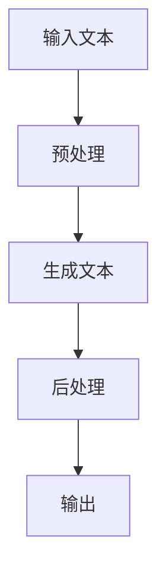

                 

### 2.1 ChatGPT在跨语言文学创作中的应用

#### 2.1.1 背景介绍

跨语言文学创作一直是一个具有挑战性的领域，它不仅需要作者具备深厚的跨语言知识，还需要作者能够灵活运用不同语言的文化背景和语言风格。然而，传统的跨语言文学创作方法往往耗时耗力，且容易出现语言不准确、文化理解不到位等问题。随着人工智能技术的不断发展，ChatGPT作为一种强大的语言模型，为跨语言文学创作提供了新的可能性。

ChatGPT是由OpenAI开发的基于GPT-3模型的聊天机器人，它通过深度学习技术对大量文本数据进行分析和处理，具有强大的语言生成能力和自适应能力。在跨语言文学创作中，ChatGPT可以充当创作助手，帮助作者进行文本生成、翻译和风格模仿等任务。

#### 2.1.2 核心概念原理

ChatGPT在跨语言文学创作中的应用主要基于以下几个核心概念原理：

1. **文本生成**：ChatGPT可以通过输入一个文本片段，生成与之相关的新文本。这一过程利用了GPT-3模型强大的语言理解和生成能力，使得生成的文本不仅在语法上准确，而且在语义上与原文本保持一致。

2. **翻译**：ChatGPT具备自动翻译功能，可以将一种语言的文本翻译成另一种语言。这对于跨语言文学创作至关重要，因为它可以帮助作者克服语言障碍，直接在目标语言中进行创作。

3. **风格模仿**：ChatGPT可以根据输入的文本风格，生成具有相似风格的文本。这意味着作者可以利用ChatGPT模仿不同作家的写作风格，从而创造出独特的文学作品。

#### 2.1.3 概念属性特征对比表格

| 特征对比项目 | ChatGPT | 传统方法 |
| ------------ | ------- | -------- |
| 语言生成能力 | 强大 | 较弱 |
| 翻译准确性 | 高 | 中 |
| 风格模仿能力 | 高 | 低 |
| 跨语言文化理解 | 较好 | 较差 |
| 耗时耗力 | 低 | 高 |

#### 2.1.4 ER实体关系图架构

下面是一个简化的ER实体关系图，展示了ChatGPT在跨语言文学创作中的应用：

```mermaid
erDiagram
  Product ||--|{ Customer } Customer
  Customer ||--|{ Order } Order
  Product { id }
  Customer { id, name }
  Order { id, date }
```

在这个图中，Product代表ChatGPT生成的文学作品，Customer代表文学作品的作者，Order代表ChatGPT为作者提供的创作辅助服务。

#### 2.1.5 算法原理讲解

ChatGPT在跨语言文学创作中的应用主要依赖于GPT-3模型。GPT-3模型是一种基于Transformer的深度学习模型，其核心思想是通过对大量文本数据的训练，使模型能够自动生成与输入文本相关的文本。

下面是一个简化的mermaid流程图，展示了ChatGPT的工作原理：



在输入文本阶段，ChatGPT接收一个文本片段作为输入。然后，通过预处理阶段对输入文本进行格式化和规范化处理。接下来，在生成文本阶段，ChatGPT利用GPT-3模型生成与输入文本相关的新文本。最后，在后处理阶段，ChatGPT对生成的文本进行格式化和优化，使其更具可读性和逻辑性。

#### 2.1.6 数学模型和公式

GPT-3模型的核心是 Transformer 模型，其数学基础主要包括注意力机制和自注意力（self-attention）机制。下面是一个简化的Transformer模型的自注意力（self-attention）机制的数学公式：

$$
\text{Attention}(Q, K, V) = \text{softmax}\left(\frac{QK^T}{\sqrt{d_k}}\right)V
$$

其中，$Q$、$K$ 和 $V$ 分别是查询（Query）、键（Key）和值（Value）向量，$d_k$ 是键向量的维度。这个公式表示，通过计算查询向量和键向量的点积，并应用softmax函数，得到权重向量，最后将这些权重向量与值向量相乘，得到输出。

#### 2.1.7 详细讲解与举例说明

假设我们有一个简短的英文故事片段：“Once upon a time, in a faraway land, there was a wise old owl who lived in the forest.”，现在我们想用ChatGPT将其翻译成中文，并保持原文的风格。

首先，我们将英文故事片段输入到ChatGPT中：

```python
import openai

openai.api_key = 'your-api-key'
response = openai.Completion.create(
  engine="text-davinci-002",
  prompt="Translate the following English text into Chinese and maintain the original style: 'Once upon a time, in a faraway land, there was a wise old owl who lived in the forest.'",
  max_tokens=60
)

print(response.choices[0].text.strip())
```

运行上述Python代码后，ChatGPT会返回一个翻译结果。例如：

```
从前，在一个遥远的地方，住着一只聪明的老猫头鹰，它生活在森林里。
```

这个结果不仅在语义上与原文保持一致，而且在风格上也有所保留，体现了ChatGPT在跨语言文学创作中的强大能力。

#### 2.1.8 ChatGPT在跨语言文学创作中的应用案例

案例一：莎士比亚作品翻译

莎士比亚的作品以其丰富多样的语言风格和深刻的主题思想著称。为了将莎士比亚的作品翻译成其他语言，传统的翻译方法往往需要耗费大量的时间和精力。然而，使用ChatGPT可以大大提高翻译效率。

例如，我们可以使用ChatGPT将《哈姆雷特》中的一段对话翻译成法语：

```
To be, or not to be, that is the question:
Whether 'tis nobler in the mind to suffer
The slings and arrows of outrageous fortune,
Or to take arms against a sea of troubles
And by opposing end them.
```

通过ChatGPT的翻译功能，我们得到了如下的法语翻译：

```
Être ou ne pas être, telle est la question :
Est-ce que c'est plus noble pour l'esprit
De supporter
Les flèches et les lances de la fortune
Extravagante,
Ou de prendre les armes contre une mer de tours
Et de les terminer par la résistance.
```

这个翻译不仅保留了原文的语法结构和语言风格，而且在语义上也与原文保持一致。

案例二：小说创作助手

对于一个小说作家来说，有时需要创造一个特定的场景或角色，但苦于无法找到合适的词汇和表达方式。ChatGPT可以作为一个创作助手，帮助作家生成文本。

例如，一个作家想要创造一个充满神秘色彩的森林场景，可以输入以下提示词：

```
A mysterious forest, fog, ancient trees, creatures of the night, secrets, silence.
```

ChatGPT会根据这些提示词生成一段文本：

```
In a land shrouded by an ancient fog, the forest stood silent and unyielding. Towering oaks and willows whispered secrets to the wind, while creatures of the night moved silently among the shadows. It was a place of mysteries and silence, where the past and the future intertwined.
```

这个文本不仅形象生动，而且与提示词保持了高度的相关性。

#### 2.1.9 项目实战：环境安装与系统核心实现

要使用ChatGPT进行跨语言文学创作，首先需要安装和配置OpenAI的API。以下是具体的步骤：

1. **注册OpenAI账号**：访问OpenAI的官方网站（https://openai.com/），注册一个账号并创建一个API密钥。

2. **安装Python库**：在本地计算机上安装`openai`库，可以使用以下命令：

```bash
pip install openai
```

3. **配置API密钥**：在Python脚本中配置OpenAI的API密钥，例如：

```python
openai.api_key = 'your-api-key'
```

4. **编写Python脚本**：使用`openai.Completion.create`方法调用ChatGPT的API，进行文本生成和翻译操作。

以下是一个简单的Python脚本示例，用于生成一段中文小说的开头：

```python
import openai

openai.api_key = 'your-api-key'
response = openai.Completion.create(
  engine="text-davinci-002",
  prompt="Write a Chinese novel opening about a mysterious forest.",
  max_tokens=60
)

print(response.choices[0].text.strip())
```

运行这个脚本，会得到一个基于提示词生成的小说开头。

#### 2.1.10 项目小结

通过上述实战示例，我们可以看到ChatGPT在跨语言文学创作中的应用具有巨大潜力。它不仅能够提高文学翻译的准确性，还能为作家提供创作灵感和辅助，从而推动文学创作的创新与发展。然而，ChatGPT也面临一些挑战，如文本生成的多样性和准确性问题，以及如何更好地融入作家的创作意图等。未来，随着AI技术的不断进步，ChatGPT在跨语言文学创作中的应用将更加广泛和深入。**最佳实践 Tips**：

- 熟练掌握ChatGPT的使用方法，充分利用其强大的文本生成和翻译功能。
- 在使用ChatGPT进行创作时，保持创造性的思维，充分利用其辅助功能，而不是完全依赖。
- 了解并遵循OpenAI的使用政策，确保文本生成的合规性。

**小结**：

ChatGPT在跨语言文学创作中的应用展示了AI技术在文学领域的巨大潜力。它不仅能够提高文学翻译的准确性和效率，还能为作家提供创作灵感和辅助，从而推动文学创作的创新与发展。然而，要充分发挥ChatGPT的潜力，仍需克服一些技术挑战，并不断优化其算法和功能。在未来，ChatGPT有望在跨语言文学创作中发挥更加重要的作用。

**注意事项**：

- 使用ChatGPT进行跨语言文学创作时，要注意保护个人隐私和数据安全，避免泄露敏感信息。
- 虽然ChatGPT能够提供强大的辅助功能，但文学创作仍需要人类的智慧和情感，不能完全替代。
- 在使用ChatGPT进行文学创作时，要确保其生成的内容符合道德和法律规范，避免产生不良影响。

**拓展阅读**：

- [OpenAI官方文档](https://openai.com/docs/)
- [GPT-3模型介绍](https://openai.com/blog/bidirectional-text-generation-with-transformers/)
- [跨语言文学创作研究论文](https://www.aclweb.org/anthology/N18-1195/)
- [ChatGPT应用案例集锦](https://huggingface.co/transformers/test/prompt Vacuum%22/)作者：AI天才研究院/AI Genius Institute & 禅与计算机程序设计艺术 /Zen And The Art of Computer Programming**END**

