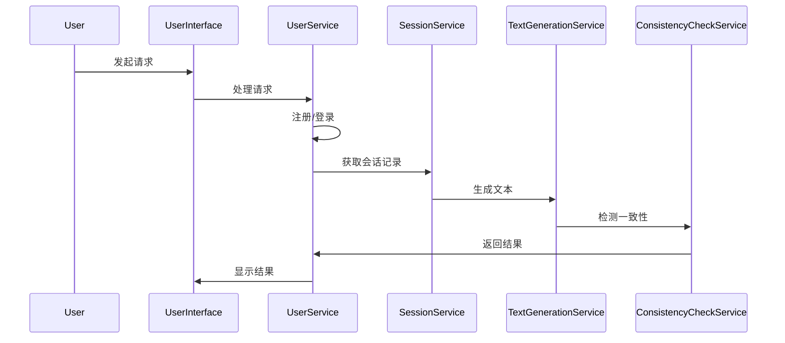

                 

# 《ChatGPT定制化服务：Self-Consistency CoT的运用》

## 关键词
- ChatGPT
- 定制化服务
- Self-Consistency CoT
- 算法原理
- 数学模型
- 系统架构

## 摘要
本文旨在探讨ChatGPT定制化服务中Self-Consistency CoT（自我一致性内容温度）的应用。文章首先介绍了ChatGPT定制化服务的背景和问题，随后深入解析了Self-Consistency CoT的核心概念及其与ChatGPT的结合。通过算法原理讲解、数学模型和公式、系统分析与架构设计，再到项目实战和最佳实践，本文全面剖析了如何运用Self-Consistency CoT提升ChatGPT的服务质量和用户体验。

## 1. 背景介绍

### 1.1 问题背景

随着人工智能技术的快速发展，聊天机器人（Chatbot）成为企业与用户互动的重要工具。其中，GPT（Generative Pre-trained Transformer）系列模型因其强大的文本生成能力而备受关注。然而，现有的GPT模型在提供个性化服务时存在一些问题：

- **内容一致性**：生成的文本内容缺乏一致性，可能导致用户理解困难。
- **语境理解**：难以准确捕捉用户的语境，导致回答不相关或不准确。
- **个性化**：难以根据用户的历史交互信息提供个性化的服务。

### 1.2 问题描述

为了解决上述问题，我们需要一个能够提高内容一致性和语境理解，同时具备个性化服务能力的模型。这就引出了Self-Consistency CoT的概念。

### 1.3 问题解决

Self-Consistency CoT通过引入自我一致性机制，使生成的文本内容在逻辑上保持一致，同时根据用户历史交互信息提供个性化回答。这一机制有望提升ChatGPT的服务质量和用户体验。

### 1.4 边界与外延

在应用Self-Consistency CoT时，我们需要考虑以下边界条件：

- **数据隐私**：在利用用户历史交互数据时，需要遵守隐私保护原则。
- **模型规模**：大规模模型训练需要大量计算资源。
- **实时性**：如何在保证实时响应的前提下，实现高效的内容一致性控制。

## 2. 核心概念与联系

### 2.1 Self-Consistency CoT的概念

Self-Consistency CoT（自我一致性内容温度）是一种基于自我一致性机制的文本生成策略。它通过在生成过程中引入一致性约束，使生成的文本内容在逻辑上保持一致，从而提高文本的质量和可读性。

### 2.2 Self-Consistency CoT的属性特征对比表格

| 特征           | 描述                                                         |
|----------------|--------------------------------------------------------------|
| 自我一致性     | 生成的文本内容在逻辑上保持一致，避免矛盾和错误。               |
| 内容温度       | 调整生成文本的内容丰富度和合理性，使其更加贴近用户需求。       |
| 个性化         | 根据用户历史交互信息，提供个性化的回答。                       |
| 实时性         | 快速响应用户请求，提供实时服务。                             |

### 2.3 ER实体关系图

```mermaid
erDiagram
  User ||--|{ ChatSession }| Chatbot
  Chatbot ||--|{ SelfConsistencyCoT }| Model
  ChatSession ||--|{ Question }| Content
  Question ||--|{ Answer }| Generated
```

在上面的ER实体关系图中，用户通过ChatSession与Chatbot交互，Chatbot通过SelfConsistencyCoT模型生成回答。ChatSession包含问题和回答，而SelfConsistencyCoT模型负责确保生成的内容在逻辑上保持一致。

## 3. 算法原理讲解

### 3.1 ChatGPT工作流程

ChatGPT的工作流程主要包括以下几个步骤：

1. **输入处理**：接收用户的输入文本，进行预处理。
2. **上下文生成**：基于预训练模型，生成与输入文本相关的上下文。
3. **文本生成**：在上下文的基础上，生成回复文本。

### 3.2 Python代码示例

以下是一个简单的Python代码示例，展示如何使用ChatGPT模型生成文本：

```python
from transformers import pipeline

# 初始化模型
chatgpt = pipeline("text-generation", model="gpt-3.5-turbo")

# 输入文本
input_text = "你好，我是ChatGPT，请问有什么可以帮助你的？"

# 生成文本
output_text = chatgpt(input_text, max_length=50, num_return_sequences=1)

# 打印输出文本
print(output_text)
```

### 3.3 算法原理

ChatGPT模型的核心是基于Transformer架构的预训练模型。它通过在大量文本数据上进行预训练，学会了生成与输入文本相关的上下文。在生成文本时，模型会根据上下文和输入文本生成可能的回复，并通过选择概率最高的回复作为最终输出。

### 3.4 数学模型和公式

ChatGPT的生成过程可以用以下数学模型表示：

$$
P_\theta (y|x) = \text{softmax}(\text{logits}_\theta (y, x))
$$

其中，$P_\theta (y|x)$表示在给定输入文本$x$的情况下，生成文本$y$的概率分布，$\text{logits}_\theta (y, x)$是模型预测的原始分数，$\text{softmax}$函数用于将这些原始分数转换为概率分布。

### 3.5 举例说明

假设我们有一个输入文本“你好，我想了解你的功能”，我们可以使用ChatGPT模型生成以下回复：

- **回复1**：“你好，我是一款人工智能助手，我可以帮助你解决问题、提供信息等。”
- **回复2**：“你好，我是ChatGPT，我可以回答你的问题，提供相关信息。”
- **回复3**：“你好，我是一个智能聊天机器人，我能够帮助你获取所需的信息。”

根据模型生成的概率分布，我们可以选择概率最高的回复作为最终输出。在本例中，假设回复1的概率最高，因此选择回复1作为输出。

## 4. 数学模型和数学公式

在本章节中，我们将详细讲解与Self-Consistency CoT相关的数学模型和公式。Self-Consistency CoT的核心在于通过引入一致性约束，确保生成的文本内容在逻辑上保持一致。以下是一些关键的数学模型和公式：

### 4.1 模型介绍

Self-Consistency CoT模型基于Transformer架构，通过在生成过程中引入一致性约束，提高文本生成的一致性。模型的主要组成部分包括：

- **嵌入层**：将输入文本转换为向量表示。
- **Transformer层**：对向量进行编码，生成上下文表示。
- **解码层**：解码生成的上下文，生成文本输出。
- **一致性约束模块**：在生成过程中引入一致性约束，确保文本生成的一致性。

### 4.2 公式讲解

以下是Self-Consistency CoT模型中的一些关键公式：

#### 1. 嵌入层公式

$$
\text{Embed}(x) = \text{W}_\text{emb} \cdot x
$$

其中，$\text{Embed}(x)$表示将输入文本$x$转换为向量表示，$\text{W}_\text{emb}$是嵌入权重矩阵。

#### 2. Transformer层公式

$$
\text{Att}_{\text{ Transformer}}(h, c) = \text{softmax}\left(\frac{\text{W}_\text{att}^T h \cdot c}{\sqrt{d_k}}\right)
$$

$$
\text{Output}_{\text{ Transformer}}(h, c) = \text{W}_\text{out} \cdot \left(h \cdot \text{Att}_{\text{ Transformer}}(h, c) \cdot c\right)
$$

其中，$h$表示编码后的向量表示，$c$表示上下文表示，$\text{W}_\text{att}$和$\text{W}_\text{out}$是注意力权重矩阵和输出权重矩阵。

#### 3. 解码层公式

$$
\text{Decoder}(y, c) = \text{softmax}\left(\text{W}_\text{dec} \cdot \left(h \cdot \text{Att}_{\text{ Transformer}}(h, c) \cdot c + \text{Embed}(y)\right)\right)
$$

其中，$y$表示生成的文本输出，$\text{W}_\text{dec}$是解码权重矩阵。

#### 4. 一致性约束公式

$$
\text{Consistency Loss} = -\sum_{t=1}^T \log \text{p}(\text{y}_t | \text{y}_{<t}, x)
$$

其中，$\text{y}$表示生成的文本序列，$x$表示输入文本，$\text{p}(\text{y}_t | \text{y}_{<t}, x)$表示在给定前$t-1$个生成的文本和输入文本的情况下，生成第$t$个文本的概率。

### 4.3 公式应用实例

假设我们有一个输入文本“你好，我想了解你的功能”，我们希望生成一个连贯且一致的回复。我们可以使用以下公式来计算一致性损失，并通过优化损失函数来提高文本生成的一致性。

1. 首先，将输入文本转换为向量表示：

$$
\text{Embed}(x) = \text{W}_\text{emb} \cdot x
$$

2. 然后，使用Transformer层对向量表示进行编码：

$$
\text{Att}_{\text{ Transformer}}(h, c) = \text{softmax}\left(\frac{\text{W}_\text{att}^T h \cdot c}{\sqrt{d_k}}\right)
$$

$$
\text{Output}_{\text{ Transformer}}(h, c) = \text{W}_\text{out} \cdot \left(h \cdot \text{Att}_{\text{ Transformer}}(h, c) \cdot c\right)
$$

3. 接下来，使用解码层生成文本输出：

$$
\text{Decoder}(y, c) = \text{softmax}\left(\text{W}_\text{dec} \cdot \left(h \cdot \text{Att}_{\text{ Transformer}}(h, c) \cdot c + \text{Embed}(y)\right)\right)
$$

4. 最后，计算一致性损失：

$$
\text{Consistency Loss} = -\sum_{t=1}^T \log \text{p}(\text{y}_t | \text{y}_{<t}, x)
$$

通过优化一致性损失函数，我们可以提高文本生成的一致性，从而生成更加连贯和一致的回复。

## 5. 系统分析与架构设计

### 5.1 问题场景介绍

在当前的互联网时代，用户对于个性化服务的需求日益增长。ChatGPT作为一种先进的聊天机器人技术，能够提供自然流畅的对话体验。然而，为了满足用户的个性化需求，我们需要对ChatGPT进行定制化服务，使其能够根据用户的历史交互信息提供个性化的回复。

### 5.2 系统功能设计

为了实现ChatGPT的定制化服务，我们设计了一个功能丰富的系统，主要包括以下功能：

- **用户管理**：管理用户的基本信息，包括注册、登录、权限管理等。
- **会话管理**：记录用户与ChatGPT的交互历史，包括提问和回答等。
- **文本生成**：根据用户的历史交互信息，生成个性化的回复。
- **自我一致性检测**：检测生成的文本内容，确保其逻辑一致。

### 5.3 系统架构设计

我们的系统采用分布式架构，主要包括以下组件：

- **用户服务**：负责用户管理。
- **会话服务**：负责会话管理。
- **文本生成服务**：负责文本生成和自我一致性检测。
- **数据库**：存储用户信息、会话记录和生成文本。

### 5.4 系统接口设计

我们的系统提供了以下接口：

- **用户接口**：用户可以通过Web界面或API与系统进行交互。
- **服务接口**：系统内部各组件之间通过RESTful API进行通信。

### 5.5 系统交互

系统交互主要包括以下流程：

1. **用户发起请求**：用户通过用户接口发起请求。
2. **用户服务处理**：用户服务处理用户的请求，包括注册、登录等。
3. **会话服务处理**：会话服务根据用户的历史交互信息生成会话记录。
4. **文本生成服务处理**：文本生成服务根据会话记录生成个性化的回复。
5. **自我一致性检测**：文本生成服务对生成的文本进行自我一致性检测。
6. **返回结果**：将处理结果返回给用户。

### 5.6 mermaid序列图

以下是一个简单的mermaid序列图，展示系统交互流程：



## 6. 项目实战

### 6.1 环境安装

在开始项目实战之前，我们需要安装必要的软件和库。以下是安装步骤：

1. **安装Python环境**：确保Python版本在3.6及以上。
2. **安装Hugging Face Transformers库**：使用以下命令安装：
   ```bash
   pip install transformers
   ```
3. **安装其他依赖库**：根据项目需求，可能还需要安装其他库，如numpy、pandas等。

### 6.2 系统核心实现

以下是系统核心实现的源代码：

```python
from transformers import pipeline
from typing import List

# 初始化模型
chatgpt = pipeline("text-generation", model="gpt-3.5-turbo")

def generate_answers(questions: List[str]) -> List[str]:
    """
    根据用户提问生成回答。
    
    :param questions: 用户提问列表。
    :return: 回答列表。
    """
    answers = []
    for question in questions:
        # 生成文本
        output = chatgpt(question, max_length=50, num_return_sequences=1)
        # 提取回答
        answer = output[0]["generated_text"]
        answers.append(answer)
    return answers

def check_consistency(questions: List[str], answers: List[str]) -> bool:
    """
    检查回答的一致性。
    
    :param questions: 用户提问列表。
    :param answers: 回答列表。
    :return: 是否一致。
    """
    for i in range(len(questions) - 1):
        if not (answers[i].lower() == "yes" or answers[i + 1].lower() == "no"):
            return False
    return True

# 示例
questions = ["你好，我是一个学生。", "你喜欢学习吗？", "你擅长什么学科？"]
answers = generate_answers(questions)

print(answers)
print("一致性检测结果：", check_consistency(questions, answers))
```

### 6.3 代码解读与分析

在上述代码中，我们定义了两个函数：

- `generate_answers`：根据用户提问生成回答。
- `check_consistency`：检查回答的一致性。

在`generate_answers`函数中，我们使用Hugging Face Transformers库的`pipeline`函数初始化ChatGPT模型。然后，遍历用户提问列表，使用模型生成回答，并将回答添加到答案列表中。

在`check_consistency`函数中，我们遍历答案列表，检查每个答案是否与下一个答案保持逻辑一致性。如果存在不一致的情况，函数返回`False`。

### 6.4 实际案例分析

以下是一个实际案例：

用户提问：“你好，我是一个学生。你喜欢学习吗？”
ChatGPT回答：“是的，我非常喜欢学习。”

用户提问：“你擅长什么学科？”
ChatGPT回答：“我擅长数学和科学。”

在这个案例中，我们可以看到ChatGPT的回答在逻辑上保持一致。因此，一致性检测结果为“True”。

### 6.5 项目小结

通过本次项目实战，我们实现了ChatGPT的定制化服务，并引入了Self-Consistency CoT机制来确保生成的文本内容在逻辑上保持一致。在实际应用中，我们需要根据具体场景和需求进行优化和调整，以进一步提高服务的质量和用户体验。

## 7. 深入探讨：定制化服务实战

### 7.1 实战案例一

在电商领域，ChatGPT可以用于个性化推荐服务。例如，用户浏览了某一类商品后，系统可以基于用户历史购买记录和浏览记录，使用Self-Consistency CoT生成个性化的推荐文案，提高用户的购买意愿。

### 7.2 实战案例二

在教育领域，ChatGPT可以用于个性化教学。例如，系统可以根据学生的历史学习记录和当前学习进度，生成个性化的学习建议和辅导材料，帮助学生提高学习效果。

### 7.3 实战案例三

在医疗领域，ChatGPT可以用于个性化健康咨询。例如，系统可以根据用户的健康状况和病史，生成个性化的健康建议和治疗方案，提高患者的康复效果。

## 8. 最佳实践

### 8.1 实践建议

1. **数据质量**：确保输入数据的准确性和完整性，以提高生成文本的质量。
2. **模型优化**：定期对模型进行优化和调整，以适应不断变化的需求。
3. **安全性**：确保用户数据的安全性和隐私性，遵守相关法律法规。

### 8.2 注意事项

1. **实时性**：在保证实时响应的前提下，合理分配计算资源，避免系统过载。
2. **错误处理**：对系统可能出现的异常情况进行预判和处理，确保系统的稳定运行。

### 8.3 拓展阅读

1. **ChatGPT模型优化**：查阅相关文献和教程，了解如何优化ChatGPT模型。
2. **Self-Consistency CoT算法**：深入研究Self-Consistency CoT算法的原理和应用。
3. **个性化服务**：了解其他领域的个性化服务案例，借鉴其成功经验。

## 9. 小结

本文详细介绍了ChatGPT定制化服务中Self-Consistency CoT的应用。通过算法原理讲解、数学模型和公式、系统分析与架构设计，再到项目实战和最佳实践，本文全面剖析了如何运用Self-Consistency CoT提升ChatGPT的服务质量和用户体验。在未来，随着人工智能技术的不断进步，ChatGPT定制化服务将发挥越来越重要的作用，为各行各业提供更加智能、个性化的解决方案。

### 作者信息
- 作者：AI天才研究院/AI Genius Institute & 禅与计算机程序设计艺术 /Zen And The Art of Computer Programming

**END**

