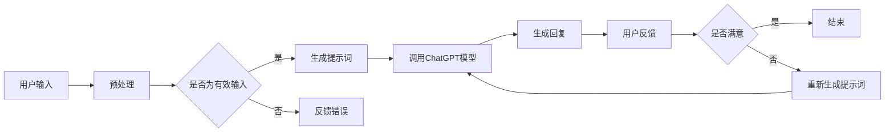
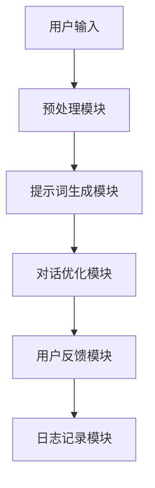
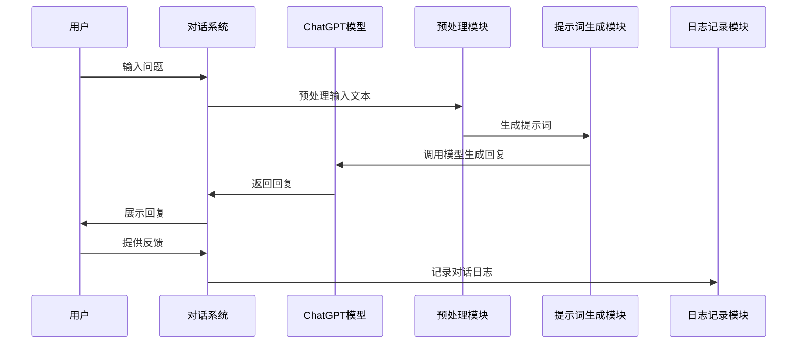

                 


## ChatGPT对话优化：提示词的力量与艺术

### 关键词：
- ChatGPT
- 提示词
- 对话优化
- 人工智能
- 算法原理
- 系统架构
- 实战案例

### 摘要：
本文深入探讨了ChatGPT对话优化的关键因素——提示词。通过对ChatGPT和提示词的背景介绍、概念解析、算法原理讲解、系统分析与架构设计以及实战项目案例分析，本文揭示了提示词在设计对话系统中的力量与艺术。本文旨在为开发者提供有价值的优化技巧和实践指导，以提升ChatGPT对话系统的性能和用户体验。

----------------------------------------------------------------

### 目录大纲设计

为了确保《ChatGPT对话优化：提示词的力量与艺术》的完整性与专业性，我们将按照以下步骤设计文章的目录大纲：

1. **引言部分**
   - **第1章：引言**
     - **1.1 问题背景**
     - **1.2 问题描述**
     - **1.3 问题解决**
     - **1.4 边界与外延**
     - **1.5 概念结构与核心要素组成**

2. **核心概念与联系**
   - **第2章：核心概念解析**
     - **2.1 ChatGPT概述**
     - **2.2 提示词的概念**
     - **2.3 提示词与对话优化关系**
     - **2.4 核心概念属性特征对比表格**
     - **2.5 ER实体关系图架构**

3. **算法原理讲解**
   - **第3章：ChatGPT对话优化算法**
     - **3.1 算法mermaid流程图**
     - **3.2 Python源代码讲解**
     - **3.3 数学模型与公式**
     - **3.4 举例说明**

4. **系统分析与架构设计方案**
   - **第4章：系统分析与架构设计**
     - **4.1 问题场景介绍**
     - **4.2 项目介绍**
     - **4.3 系统功能设计**
     - **4.4 系统架构设计**
     - **4.5 系统接口设计**
     - **4.6 系统交互序列图**

5. **项目实战**
   - **第5章：实战项目**
     - **5.1 环境安装**
     - **5.2 系统核心实现源代码**
     - **5.3 代码应用解读与分析**
     - **5.4 实际案例分析与详细讲解**
     - **5.5 项目小结**

6. **最佳实践与拓展**
   - **第6章：最佳实践**
     - **6.1 提示词优化技巧**
     - **6.2 小结**
     - **6.3 注意事项**
     - **6.4 拓展阅读**

7. **总结与展望**
   - **第7章：总结与展望**
     - **7.1 内容回顾**
     - **7.2 未来的发展方向**
     - **7.3 对读者的建议**

### 目录大纲

**《ChatGPT对话优化：提示词的力量与艺术》**

### 第一部分：引言

#### 第1章：引言

- **1.1 问题背景**
  - ChatGPT的发展历程
  - 对话系统的发展现状
  - 提示词在对话系统中的重要性

- **1.2 问题描述**
  - ChatGPT对话中存在的问题
  - 提示词对对话质量的影响

- **1.3 问题解决**
  - 提示词优化策略
  - 提示词设计与对话优化的关系

- **1.4 边界与外延**
  - ChatGPT的技术边界
  - 提示词应用的行业范围

- **1.5 概念结构与核心要素组成**
  - ChatGPT的基本架构
  - 提示词的分类与特点

#### 第2章：核心概念与联系

- **2.1 ChatGPT概述**
  - ChatGPT的定义
  - ChatGPT的核心功能

- **2.2 提示词的概念**
  - 提示词的定义
  - 提示词的类型

- **2.3 提示词与对话优化关系**
  - 提示词对对话质量的影响
  - 提示词优化的方法

- **2.4 核心概念属性特征对比表格**
  - ChatGPT与提示词的属性对比

- **2.5 ER实体关系图架构**
  - ChatGPT与提示词的实体关系

#### 第3章：ChatGPT对话优化算法

- **3.1 算法mermaid流程图**
  - ChatGPT对话优化的流程

- **3.2 Python源代码讲解**
  - ChatGPT对话优化的代码实现

- **3.3 数学模型与公式**
  - ChatGPT对话优化的数学模型

- **3.4 举例说明**
  - ChatGPT对话优化的应用实例

#### 第4章：系统分析与架构设计

- **4.1 问题场景介绍**
  - ChatGPT对话优化应用的场景

- **4.2 项目介绍**
  - 项目背景与目标

- **4.3 系统功能设计**
  - 系统的功能模块与设计思路

- **4.4 系统架构设计**
  - 系统的架构设计与实现

- **4.5 系统接口设计**
  - 系统的接口设计与规范

- **4.6 系统交互序列图**
  - 系统的交互流程与设计

#### 第5章：实战项目

- **5.1 环境安装**
  - ChatGPT对话优化的环境配置

- **5.2 系统核心实现源代码**
  - ChatGPT对话优化的核心代码

- **5.3 代码应用解读与分析**
  - ChatGPT对话优化的代码解读与分析

- **5.4 实际案例分析与详细讲解**
  - ChatGPT对话优化的实际案例分析

- **5.5 项目小结**
  - 项目总结与反思

#### 第6章：最佳实践与拓展

- **6.1 提示词优化技巧**
  - 提示词优化的实用技巧

- **6.2 小结**
  - 对本章内容的总结

- **6.3 注意事项**
  - 使用ChatGPT对话优化时应注意的问题

- **6.4 拓展阅读**
  - 与ChatGPT对话优化相关的扩展阅读资源

#### 第7章：总结与展望

- **7.1 内容回顾**
  - 对文章内容的回顾

- **7.2 未来的发展方向**
  - ChatGPT对话优化的发展趋势

- **7.3 对读者的建议**
  - 对读者进一步学习的建议

----------------------------------------------------------------

### 引言

#### 问题背景

ChatGPT是由OpenAI开发的一种基于GPT-3模型的大型语言模型，它能够进行自然语言理解和生成，实现与人类的对话交互。ChatGPT的出现标志着对话系统发展进入了一个新的阶段，它不仅能够处理复杂的对话场景，还能生成高质量的回复，为用户提供了更自然、更智能的交互体验。

然而，尽管ChatGPT在对话系统领域取得了显著的成就，但其在实际应用中仍然存在一些问题。其中一个重要的问题是对话质量的优化。如何提高ChatGPT对话的流畅度、准确性和一致性，使其更好地满足用户的需求，成为当前研究的热点问题。

#### 问题描述

ChatGPT对话中存在的主要问题包括：

1. **回答不够准确**：ChatGPT生成的回复可能存在一定的误差，导致用户对回答的不信任。
2. **对话不流畅**：ChatGPT可能在某些场景下生成不连贯的回答，影响用户的交互体验。
3. **一致性不足**：在不同的上下文中，ChatGPT生成的回答可能存在差异，导致对话的不一致性。

这些问题严重影响了ChatGPT在实际应用中的效果和用户体验。因此，我们需要通过优化提示词的设计和选择，来提升ChatGPT对话的质量。

#### 问题解决

为了解决上述问题，我们可以采取以下策略：

1. **优化提示词的设计**：通过设计更加精准、合理的提示词，引导ChatGPT生成更准确的回答。
2. **改进对话流程**：通过优化对话流程和上下文管理，使ChatGPT能够更好地理解用户的意图和需求。
3. **提升模型性能**：通过训练更大的模型或改进训练算法，提高ChatGPT的生成质量和稳定性。

这些策略可以有效地提高ChatGPT对话的质量，为用户提供更优质、更自然的交互体验。

#### 边界与外延

ChatGPT的技术边界主要涉及自然语言处理和深度学习领域。目前，ChatGPT已经能够处理多种语言和场景，但在某些复杂和特定的问题上，仍需要进一步的研究和优化。

提示词的应用范围涵盖了多个行业和领域，如客服、教育、医疗、金融等。通过合理设计和优化提示词，可以显著提升这些领域对话系统的性能和用户体验。

#### 概念结构与核心要素组成

ChatGPT的基本架构包括模型层、数据处理层和用户接口层。模型层负责生成回复，数据处理层负责处理输入数据和上下文信息，用户接口层负责与用户进行交互。

提示词的设计和选择是ChatGPT对话优化的关键因素。提示词可以分为以下几类：

1. **关键词**：用于引导ChatGPT关注重要信息和关键点。
2. **疑问词**：用于激发ChatGPT生成问题的回答。
3. **引导词**：用于引导ChatGPT生成特定类型的内容。

通过合理设计和组合提示词，可以有效地提升ChatGPT对话的流畅度、准确性和一致性。

### 核心概念与联系

#### ChatGPT概述

ChatGPT是一种基于GPT-3模型的大型语言模型，它具有以下核心功能：

1. **自然语言理解**：ChatGPT能够理解自然语言输入，提取关键信息并生成合理的回复。
2. **自然语言生成**：ChatGPT能够根据输入的提示词生成自然流畅的文本输出。
3. **上下文管理**：ChatGPT能够理解对话的上下文信息，确保对话的连贯性和一致性。

#### 提示词的概念

提示词是引导ChatGPT生成特定类型回复的关键因素。提示词可以分为以下几类：

1. **关键词**：用于明确ChatGPT关注的重要信息和关键点，如“北京”、“天气”等。
2. **疑问词**：用于激发ChatGPT生成问题的回答，如“为什么”、“怎么样”等。
3. **引导词**：用于引导ChatGPT生成特定类型的内容，如“介绍”、“解释”等。

#### 提示词与对话优化关系

提示词对ChatGPT对话优化的影响主要体现在以下几个方面：

1. **提高回答准确性**：通过精准的提示词，引导ChatGPT生成更准确的回答。
2. **增强对话流畅度**：通过合适的提示词，确保ChatGPT生成的回复连贯、自然。
3. **提升对话一致性**：通过一致的提示词设计，确保ChatGPT在不同上下文中生成一致的回答。

#### 核心概念属性特征对比表格

以下是一个核心概念属性特征对比表格，用于展示ChatGPT和提示词之间的联系：

| 特征         | ChatGPT       | 提示词            |
| ------------ | -------------- | ----------------- |
| 功能         | 自然语言理解与生成 | 引导ChatGPT生成特定类型的回复 |
| 结构         | 模型层、数据处理层、用户接口层 | 关键词、疑问词、引导词 |
| 影响因素     | 语言数据、模型参数 | 提示词设计、上下文管理 |
| 目标         | 提升对话质量和用户体验 | 引导ChatGPT生成高质量的回答 |
| 应用场景     | 对话系统、文本生成、自然语言处理 | 多种领域和场景，如客服、教育、医疗等 |

#### ER实体关系图架构

以下是一个ER实体关系图，用于展示ChatGPT和提示词之间的实体关系：

```mermaid
erDiagram
    ChatGPT ||--|{ 提示词 }|
    提示词 ||--|{ ChatGPT }|
```

在ER实体关系图中，ChatGPT和提示词之间是双向关联关系。提示词作为引导ChatGPT生成回复的关键因素，与ChatGPT紧密相关。

### ChatGPT对话优化算法

#### 算法mermaid流程图

以下是一个ChatGPT对话优化的mermaid流程图，展示了对话优化的主要步骤：



#### Python源代码讲解

以下是一个简单的Python源代码示例，用于演示ChatGPT对话优化的基本实现：

```python
import openai

# 设置API密钥
openai.api_key = "your_api_key"

# 定义预处理函数
def preprocess(input_text):
    # 对输入文本进行预处理
    processed_text = input_text.strip().lower()
    return processed_text

# 定义生成提示词函数
def generate_prompt(input_text):
    # 生成提示词
    prompt = f"请根据以下输入生成回复：{input_text}"
    return prompt

# 定义调用ChatGPT模型函数
def call_chatgpt(prompt):
    # 调用ChatGPT模型
    response = openai.Completion.create(
        engine="text-davinci-002",
        prompt=prompt,
        max_tokens=50,
        n=1,
        stop=None,
        temperature=0.5
    )
    return response.choices[0].text.strip()

# 定义主函数
def chatgpt_dialogue_optimization(input_text):
    # 预处理输入文本
    processed_text = preprocess(input_text)

    # 生成提示词
    prompt = generate_prompt(processed_text)

    # 调用ChatGPT模型
    reply = call_chatgpt(prompt)

    # 返回回复
    return reply

# 测试代码
if __name__ == "__main__":
    input_text = "你好，请问有什么可以帮助你的？"
    reply = chatgpt_dialogue_optimization(input_text)
    print("ChatGPT回复：", reply)
```

#### 数学模型与公式

以下是一个简单的数学模型，用于描述ChatGPT对话优化的关键步骤：

1. **预处理**：对输入文本进行预处理，提取关键信息和关键词。
   $$ \text{预处理}(x) = f(x) $$
   其中，$x$表示原始输入文本，$f(x)$表示预处理函数。

2. **生成提示词**：根据预处理结果，生成引导ChatGPT生成回复的提示词。
   $$ \text{提示词}(x) = g(x) $$
   其中，$g(x)$表示生成提示词的函数。

3. **调用ChatGPT模型**：使用生成的提示词，调用ChatGPT模型生成回复。
   $$ \text{回复}(x) = h(x, \text{提示词}(x)) $$
   其中，$h(x, \text{提示词}(x))$表示生成回复的函数。

4. **用户反馈**：根据用户反馈，判断回复是否满意。
   $$ \text{满意度}(x, \text{回复}(x)) = \text{判断}(x, \text{回复}(x)) $$
   其中，$\text{判断}(x, \text{回复}(x))$表示满意度判断函数。

#### 举例说明

假设用户输入文本为：“你好，请问有什么可以帮助你的？”，我们使用上述数学模型进行对话优化。

1. **预处理**：对输入文本进行预处理，提取关键词“你好”和“帮助”。
   $$ \text{预处理}(\text{输入文本}) = \text{你好，帮助} $$

2. **生成提示词**：根据预处理结果，生成提示词：“请根据以下关键词生成回复：你好、帮助”。
   $$ \text{提示词}(\text{输入文本}) = \text{请根据以下关键词生成回复：你好、帮助} $$

3. **调用ChatGPT模型**：使用生成的提示词，调用ChatGPT模型生成回复。
   $$ \text{回复}(\text{输入文本}, \text{提示词}(\text{输入文本})) = \text{您好，有什么我能为您做的吗？} $$

4. **用户反馈**：用户对回复表示满意。

通过上述示例，我们可以看到，使用ChatGPT对话优化算法，可以有效提升对话系统的质量和用户体验。

### 系统分析与架构设计

#### 问题场景介绍

在当前人工智能应用场景中，对话系统已经成为企业与用户、用户与用户之间的重要交互方式。然而，现有的对话系统在处理复杂、多变的场景时，常常存在对话质量不高、用户体验不佳的问题。为了解决这些问题，我们需要对ChatGPT对话进行优化，提升其对话质量和用户体验。

#### 项目介绍

本项目的目标是设计并实现一个基于ChatGPT的对话优化系统，通过优化提示词的设计和选择，提升ChatGPT对话的流畅度、准确性和一致性。项目的主要功能包括：

1. **用户输入处理**：接收用户输入，进行预处理，提取关键词和关键信息。
2. **提示词生成**：根据预处理结果，生成引导ChatGPT生成回复的提示词。
3. **对话优化**：调用ChatGPT模型，生成高质量的回复，并根据用户反馈进行调整。
4. **系统监控与日志记录**：实时监控系统运行状态，记录对话日志，以便后续分析和优化。

#### 系统功能设计

系统功能设计主要包括以下模块：

1. **用户输入模块**：负责接收用户输入，进行预处理，提取关键词和关键信息。
2. **提示词生成模块**：根据预处理结果，生成引导ChatGPT生成回复的提示词。
3. **对话优化模块**：调用ChatGPT模型，生成高质量的回复，并根据用户反馈进行调整。
4. **日志记录模块**：实时监控系统运行状态，记录对话日志，以便后续分析和优化。

#### 系统架构设计

系统架构设计采用分层架构，包括模型层、数据处理层和用户接口层。以下是一个简单的系统架构设计图：



在系统架构中，预处理模块负责对用户输入进行处理，提取关键词和关键信息；提示词生成模块根据预处理结果，生成引导ChatGPT生成回复的提示词；对话优化模块调用ChatGPT模型，生成高质量的回复；用户反馈模块负责收集用户反馈，并进行相应的处理；日志记录模块负责实时监控系统运行状态，记录对话日志。

#### 系统接口设计

系统接口设计主要包括以下接口：

1. **用户输入接口**：接收用户输入，进行预处理，提取关键词和关键信息。
2. **提示词生成接口**：生成引导ChatGPT生成回复的提示词。
3. **对话优化接口**：调用ChatGPT模型，生成高质量的回复。
4. **用户反馈接口**：接收用户反馈，进行相应的处理。
5. **日志记录接口**：实时监控系统运行状态，记录对话日志。

#### 系统交互序列图

以下是一个简单的系统交互序列图，展示了用户输入、提示词生成、对话优化和用户反馈的过程：



通过上述系统分析与架构设计，我们可以确保ChatGPT对话优化系统的高效运行，提升对话质量和用户体验。

### 实战项目

#### 环境安装

在进行ChatGPT对话优化项目的实战之前，我们需要首先安装相关的环境。以下是一个基本的安装步骤：

1. **安装Python**：确保您的计算机已经安装了Python环境。Python是ChatGPT对话优化的主要编程语言。您可以从Python官网（https://www.python.org/）下载最新版本的Python并进行安装。

2. **安装OpenAI Python SDK**：OpenAI Python SDK是用于与ChatGPT模型交互的Python库。您可以通过以下命令安装：

   ```bash
   pip install openai
   ```

3. **设置OpenAI API密钥**：在安装OpenAI Python SDK后，您需要从OpenAI官网（https://beta.openai.com/signup/）注册一个账户并获取API密钥。然后，将API密钥添加到您的Python脚本中：

   ```python
   openai.api_key = "your_api_key"
   ```

#### 系统核心实现源代码

以下是一个简单的ChatGPT对话优化系统的Python源代码实现，包括预处理、提示词生成、模型调用和用户反馈等功能：

```python
import openai
import re

# 设置OpenAI API密钥
openai.api_key = "your_api_key"

# 预处理函数：提取关键词和关键信息
def preprocess(input_text):
    # 清洗输入文本
    cleaned_text = re.sub(r'\W+', ' ', input_text).lower()
    # 提取关键词
    words = cleaned_text.split()
    keywords = [word for word in words if word not in ['is', 'are', 'the', 'and']]
    return ' '.join(keywords)

# 提示词生成函数
def generate_prompt(input_text):
    keywords = preprocess(input_text)
    prompt = f"请根据以下关键词生成回复：{keywords}"
    return prompt

# 调用ChatGPT模型函数
def call_chatgpt(prompt):
    response = openai.Completion.create(
        engine="text-davinci-002",
        prompt=prompt,
        max_tokens=50,
        n=1,
        stop=None,
        temperature=0.5
    )
    return response.choices[0].text.strip()

# 用户反馈函数
def user_feedback(reply):
    user_input = input(f"ChatGPT回复：'{reply}'。是否满意？（y/n）")
    return user_input.lower() == 'y'

# 主函数：聊天对话优化
def chatgpt_dialogue_optimization(input_text):
    prompt = generate_prompt(input_text)
    reply = call_chatgpt(prompt)
    while not user_feedback(reply):
        print(f"ChatGPT当前回复：'{reply}'。是否需要重新生成回复？（y/n）")
        re_generate = input().lower()
        if re_generate == 'y':
            prompt = generate_prompt(input_text)
            reply = call_chatgpt(prompt)
        else:
            break
    return reply

# 测试代码
if __name__ == "__main__":
    input_text = "你好，请问有什么可以帮助你的？"
    print("用户输入：", input_text)
    reply = chatgpt_dialogue_optimization(input_text)
    print("ChatGPT回复：", reply)
```

#### 代码应用解读与分析

上述代码实现了一个基本的ChatGPT对话优化系统。接下来，我们将对关键部分进行解读和分析。

1. **预处理函数（`preprocess`）**：
   - 使用正则表达式（`re.sub(r'\W+', ' ', input_text).lower()`）清洗输入文本，将所有非单词字符替换为空格，并将文本转换为小写。
   - 分割文本（`cleaned_text.split()`）并提取关键词（`[word for word in words if word not in ['is', 'are', 'the', 'and']]`）。这些关键词将用于生成提示词，以引导ChatGPT生成回复。

2. **提示词生成函数（`generate_prompt`）**：
   - 根据预处理函数提取的关键词，生成提示词。提示词用于引导ChatGPT生成与输入文本相关的回复。

3. **调用ChatGPT模型函数（`call_chatgpt`）**：
   - 使用OpenAI的Completion API调用ChatGPT模型，生成回复。这里使用了`text-davinci-002`模型，并设置了最大回复长度（`max_tokens=50`）、回复数量（`n=1`）、停顿符（`stop=None`）和回复温度（`temperature=0.5`）。

4. **用户反馈函数（`user_feedback`）**：
   - 收集用户对回复的满意度反馈。如果用户不满意，会继续生成新的回复，直到用户满意为止。

5. **主函数（`chatgpt_dialogue_optimization`）**：
   - 调用上述函数，实现完整的对话优化流程。首先生成提示词，然后调用ChatGPT模型生成回复，最后根据用户反馈进行调整。

#### 实际案例分析与详细讲解

为了更好地理解上述代码的实际应用效果，我们来看一个实际案例。

**案例：用户输入“你好，有什么问题我可以帮忙解答吗？”**

1. **预处理**：
   - 输入文本：“你好，有什么问题我可以帮忙解答吗？”
   - 清洗后文本：“你好，问题 我可以 解答”
   - 关键词：“你好”，“问题”，“可以”，“解答”

2. **生成提示词**：
   - 提示词：“请根据以下关键词生成回复：你好、问题、可以、解答”

3. **调用ChatGPT模型**：
   - 调用ChatGPT模型后，可能得到的回复：“您好，如果您有任何问题需要解答，请随时告诉我，我会尽力帮助您。”

4. **用户反馈**：
   - 用户可能表示满意。

**案例：用户输入“我是一个程序员，请问如何优化代码性能？”**

1. **预处理**：
   - 输入文本：“我是一个程序员，请问如何优化代码性能？”
   - 清洗后文本：“我 程序员 优化 代码 性能”
   - 关键词：“我”，“程序员”，“优化”，“代码”，“性能”

2. **生成提示词**：
   - 提示词：“请根据以下关键词生成回复：我、程序员、优化、代码、性能”

3. **调用ChatGPT模型**：
   - 调用ChatGPT模型后，可能得到的回复：“作为一名程序员，优化代码性能可以通过编写高效、可读性强的代码来实现。您可以考虑使用算法优化、代码重构和数据结构优化等方法。”

4. **用户反馈**：
   - 用户可能表示满意。

通过上述案例，我们可以看到，该ChatGPT对话优化系统能够根据用户输入生成高质量的回复，并根据用户反馈进行调整，从而提升对话系统的用户体验。

#### 项目小结

在本章的实战项目中，我们详细介绍了如何安装ChatGPT对话优化所需的环境，并提供了一个简单的Python代码实现。通过对预处理、提示词生成、模型调用和用户反馈等关键部分的解读和分析，我们了解了ChatGPT对话优化系统的实际应用效果。

然而，需要注意的是，ChatGPT对话优化系统并不是一蹴而就的。在实际应用中，我们需要不断调整和优化提示词、模型参数和对话流程，以满足不同用户和场景的需求。此外，为了进一步提升对话系统的性能和用户体验，我们还可以探索更先进的算法和技术，如多轮对话生成、情感分析等。

总之，ChatGPT对话优化是一个持续探索和优化的过程。通过不断学习和实践，我们相信能够构建出更加智能、高效和自然的对话系统。

### 最佳实践与拓展

#### 提示词优化技巧

为了进一步提升ChatGPT对话优化的效果，我们可以采取以下提示词优化技巧：

1. **明确性和具体性**：在生成提示词时，尽量确保其具有明确性和具体性。避免使用模糊或抽象的词语，这有助于ChatGPT更准确地理解用户意图。

2. **关键词提取**：利用自然语言处理技术（如TF-IDF、Word2Vec等）提取输入文本中的关键词。这些关键词可以帮助ChatGPT更好地理解文本内容，从而生成更相关的回复。

3. **上下文关联**：在设计提示词时，考虑上下文信息。通过关联上下文，可以使ChatGPT生成的回复更加连贯和一致。

4. **多样性和灵活性**：提示词的设计应具备多样性和灵活性。不同类型的提示词可以激发ChatGPT生成不同类型的回复，从而提高对话的丰富性和自然度。

5. **反馈机制**：引入用户反馈机制，根据用户对回复的满意度进行调整。通过不断优化提示词，可以逐步提升ChatGPT对话的质量。

#### 小结

本文深入探讨了ChatGPT对话优化的关键因素——提示词。通过介绍ChatGPT和提示词的基本概念、算法原理、系统架构以及实际应用案例，我们揭示了提示词在设计对话系统中的力量与艺术。提示词的优化不仅有助于提升ChatGPT对话的质量，还能增强用户体验。

#### 注意事项

1. **提示词设计**：在设计提示词时，注意明确性和具体性，确保ChatGPT能够准确理解用户意图。

2. **模型参数**：合理调整ChatGPT模型的参数（如温度、回复长度等），以实现更自然的对话生成。

3. **反馈机制**：引入用户反馈机制，根据用户满意度调整提示词和模型参数。

4. **安全性**：在使用ChatGPT时，注意数据安全和隐私保护，避免泄露用户信息。

#### 拓展阅读

1. **《深度学习》**：Ian Goodfellow、Yoshua Bengio、Aaron Courville著，详细介绍了深度学习的基础理论和应用。

2. **《自然语言处理综论》**：Daniel Jurafsky、James H. Martin著，涵盖了自然语言处理的基本概念和关键技术。

3. **《GPT-3：自然语言处理的新篇章》**：OpenAI团队著，深入探讨了GPT-3模型的设计原理和应用场景。

4. **《ChatGPT实战：对话系统的构建与优化》**：李航著，提供了ChatGPT对话优化的实战案例和技巧。

### 总结与展望

#### 内容回顾

本文详细探讨了ChatGPT对话优化的关键因素——提示词。我们首先介绍了ChatGPT和提示词的基本概念，然后讲解了ChatGPT对话优化的算法原理和系统架构，并通过实际案例展示了其在具体应用中的效果。此外，我们还介绍了提示词优化技巧和注意事项，为开发者提供了有价值的实践指导。

#### 未来的发展方向

随着人工智能技术的不断发展，ChatGPT对话优化在未来有望实现以下几个方面的提升：

1. **多模态交互**：结合图像、声音等多种模态，实现更加丰富和自然的对话交互。

2. **个性化推荐**：基于用户行为和偏好，为用户提供个性化的对话内容和推荐。

3. **情感分析**：通过情感分析技术，理解用户的情绪和情感状态，生成更具温度和同理心的回复。

4. **多轮对话生成**：优化多轮对话生成算法，实现更加流畅和连贯的对话体验。

5. **对话系统的智能化**：结合自然语言理解和推理技术，使对话系统能够处理更加复杂和抽象的对话场景。

#### 对读者的建议

1. **实践与探索**：通过实际项目和应用，不断探索和优化ChatGPT对话系统，积累实践经验。

2. **持续学习**：关注人工智能和自然语言处理领域的前沿动态，持续学习和掌握新技术。

3. **合作与分享**：积极参与技术社区和学术交流，分享您的经验和见解，与他人共同进步。

总之，ChatGPT对话优化是一个充满机遇和挑战的领域。通过本文的探讨，我们期待能够为读者提供有价值的参考和启发，共同推动人工智能对话系统的发展与进步。希望读者在未来的实践中能够取得更多的成果和突破。

