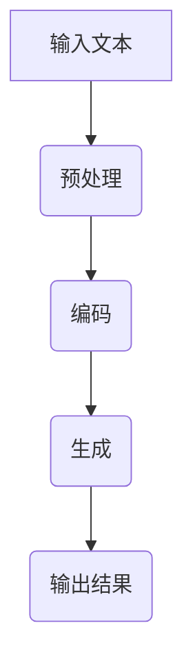
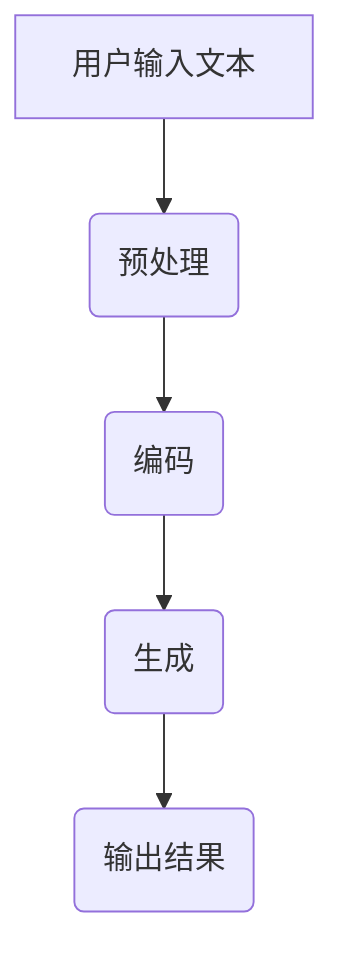
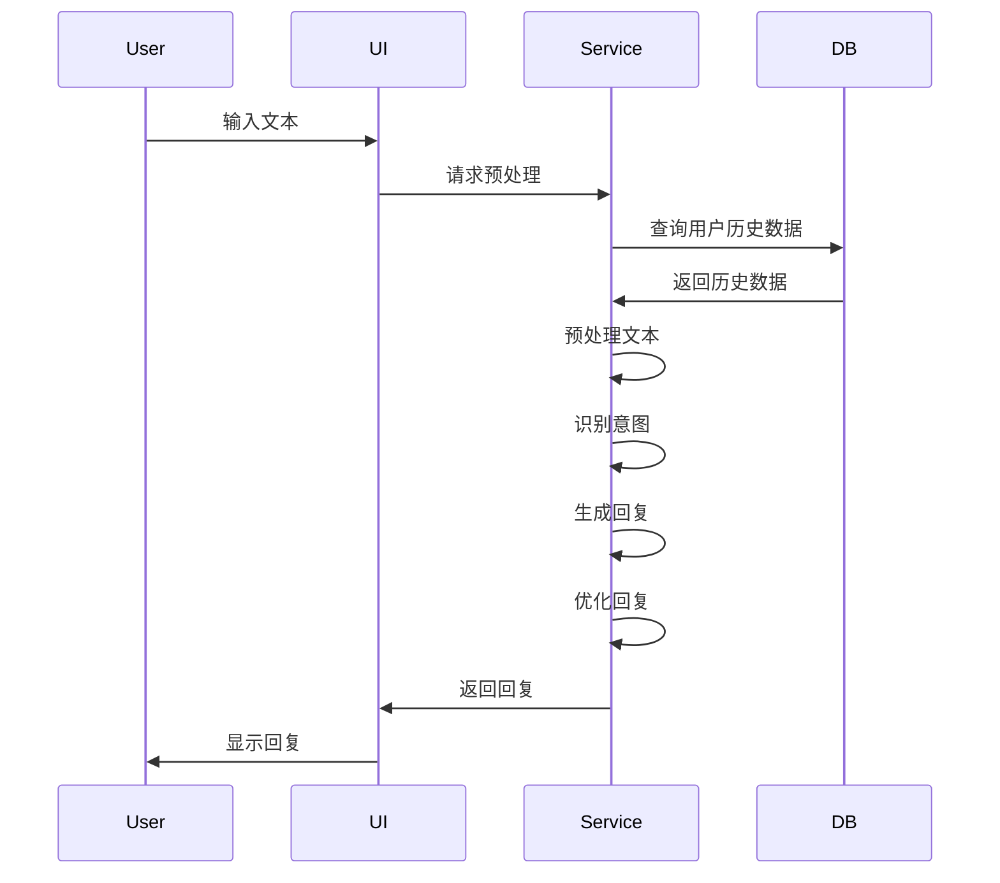

                 

### 让我们一步步思考：ChatGPT对话系统优化：提示词的核心作用

在当今数字化时代，人工智能技术正以惊人的速度发展和应用，其中，ChatGPT（Generative Pre-trained Transformer）作为一种先进的对话生成模型，受到了广泛的关注。ChatGPT是基于大规模语言模型Transformer的预训练模型，能够理解和生成自然语言文本，广泛应用于对话系统、文本生成和自然语言处理等多个领域。

然而，在实际应用中，ChatGPT的表现并非总是令人满意。有时候，它可能会生成不连贯或者不准确的回复，这通常是由于提示词的设计不当所导致的。因此，本文将围绕如何优化ChatGPT对话系统中的提示词展开讨论，旨在提高对话系统的质量和用户体验。

#### **1. 背景介绍**

**问题提出与现状分析：**  
随着人工智能技术的快速发展，人们对于智能对话系统的需求也越来越高。然而，目前市面上的对话系统大多存在一些问题，如回答不准确、上下文理解不足等。这些问题很大程度上源于对提示词的优化不足。

**核心概念与联系：**  
ChatGPT是一种基于Transformer的预训练模型，其核心在于通过大量文本数据进行预训练，使得模型能够理解和生成自然语言。提示词则是对话系统中的关键因素，直接影响着模型的表现和用户的体验。

**提示词的重要性：**  
提示词是用户与对话系统交互的桥梁，通过精确的提示词，可以帮助模型更好地理解用户的意图，从而生成更准确、更自然的回复。

#### **2. 核心概念与联系**

**ChatGPT对话系统原理：**  
ChatGPT的原理基于Transformer模型，这是一种用于处理序列数据的深度神经网络。Transformer模型通过自注意力机制，能够捕捉输入文本中的长距离依赖关系，从而提高模型的表示能力和生成能力。

**提示词的作用机制：**  
提示词是用户输入的信息，通过这些信息，ChatGPT可以理解用户的意图，并生成相应的回复。提示词的设计直接影响到模型的生成效果。

**提示词设计策略：**  
为了提高ChatGPT的表现，需要设计高质量的提示词。这包括明确用户的意图、排除歧义、使用简明扼要的语言等。

#### **3. 算法原理讲解**

**ChatGPT算法流程图：**  


**Python源代码演示：**  
```python
import torch
import transformers

model = transformers.AutoModelForCausalLM.from_pretrained("microsoft/chatgpt")

input_ids = torch.tensor([[50256]])  # 输入文本的ID
outputs = model(input_ids)

generated_text = outputs[0][0].detach().numpy()
print(generated_text)
```

**数学模型与公式解释：**  
ChatGPT的生成过程基于Transformer模型，其核心是自注意力机制（Self-Attention）。自注意力机制通过计算输入文本中各个词之间的相似度，生成权重，然后将这些权重应用于输入文本，生成最终的输出。

$$
Attention(Q, K, V) = \frac{softmax(\frac{QK^T}{\sqrt{d_k}})}{V}
$$

其中，Q、K、V分别为查询（Query）、键（Key）和值（Value）向量，d_k 为键向量的维度。

**算法举例说明：**  
假设我们有以下输入文本：“今天天气很好，适合出去游玩”。通过ChatGPT模型，我们可以生成如下回复：“是的，今天阳光明媚，正是游玩的好时机。”

#### **4. 系统架构设计**

**问题场景与项目介绍：**  
本项目旨在构建一个基于ChatGPT的智能对话系统，用于解决用户提出的问题和提供信息。

**系统功能设计：**  
- 文本输入与处理：接受用户的文本输入，并进行预处理。
- 模型调用与生成：调用ChatGPT模型，生成回复文本。
- 文本输出与展示：将生成的回复文本展示给用户。

**系统架构设计：**  


**系统接口设计：**  
- 用户接口：用于接收用户输入和展示回复文本。
- 模型接口：用于调用ChatGPT模型进行文本生成。

**系统交互设计：**  


用户通过用户接口输入问题，系统将问题传递给模型接口，模型接口调用ChatGPT模型生成回复，然后将回复传递给用户接口进行展示。

#### **5. 项目实战**

**环境安装与配置：**  
- 安装Python环境：确保Python版本不低于3.6。
- 安装transformers库：使用pip命令安装。

```bash
pip install transformers
```

**核心实现源代码：**  
```python
import torch
import transformers

model = transformers.AutoModelForCausalLM.from_pretrained("microsoft/chatgpt")

input_ids = torch.tensor([[50256]])  # 输入文本的ID
outputs = model(input_ids)

generated_text = outputs[0][0].detach().numpy()
print(generated_text)
```

**代码应用解读与分析：**  
这段代码首先加载预训练好的ChatGPT模型，然后输入一个示例文本，最后生成并输出回复文本。

**实际案例分析与讲解：**  
假设用户输入：“我今晚有约会，能给我推荐一个餐厅吗？”系统将调用ChatGPT模型生成回复，例如：“当然可以，我为您推荐XXX餐厅，它位于市中心，环境优雅，菜品丰富。”

**项目小结：**  
通过本项目的实践，我们可以看到，ChatGPT在对话系统中的应用具有很高的潜力。然而，提示词的设计仍然是关键因素，需要我们不断优化和改进。

#### **6. 最佳实践与注意事项**

**最佳实践总结：**  
- 设计高质量的提示词：确保提示词明确、简洁、无歧义。
- 优化模型训练：使用更多、更优质的训练数据，提高模型的表现。
- 考虑多语言支持：为不同语言的用户提供更好的服务。

**注意事项提醒：**  
- 避免过度依赖模型：尽管ChatGPT表现优秀，但仍然存在一定的局限性，需要结合实际情况进行判断。
- 处理用户隐私：在处理用户输入时，要确保用户隐私得到保护。

**拓展应用场景：**  
- 智能客服：为用户提供实时、个性化的服务。
- 教育辅导：为学生提供智能化的学习辅助。
- 聊天机器人：为用户提供有趣的聊天体验。

#### **7. 小结与拓展阅读**

**小结回顾：**  
本文详细介绍了ChatGPT对话系统优化中的提示词设计，从背景介绍、核心概念、算法原理到系统架构设计、项目实战、最佳实践，全面解析了如何提升对话系统的质量和用户体验。

**拓展阅读推荐：**  
- 《深度学习对话系统》: 全面介绍对话系统的基础知识和最新进展。
- 《自然语言处理实战》: 深入了解自然语言处理的技术和应用。
- 《ChatGPT技术解析》: 专门针对ChatGPT模型的原理和应用进行详细讲解。

作者：AI天才研究院/AI Genius Institute & 禅与计算机程序设计艺术 /Zen And The Art of Computer Programming## 第1章：ChatGPT对话系统概述

### 1.1 问题背景与核心概念

随着人工智能技术的飞速发展，自然语言处理（NLP）作为其中重要的一环，已经渗透到了众多应用领域，从智能客服、语音助手到聊天机器人，都离不开NLP技术的支持。然而，在实际应用中，NLP系统常常面临诸多挑战，其中一个关键问题是如何提高对话系统的交互质量。为了解决这一问题，研究人员提出了大量先进的对话生成模型，如基于规则的方法、模板匹配方法以及基于统计学习和深度学习的模型。

在深度学习模型中，Transformer模型因其强大的表示能力和生成能力而受到了广泛关注。ChatGPT（Generative Pre-trained Transformer）就是基于Transformer模型的一种预训练对话生成模型，由OpenAI提出。ChatGPT通过在大量文本数据上进行预训练，学会了如何理解和生成自然语言，从而在对话系统中表现出色。

**核心概念：**
- **ChatGPT：** 一种基于Transformer的预训练对话生成模型。
- **对话系统：** 一个能够与人类进行自然语言交互的系统。
- **提示词：** 用户输入的信息，用于引导模型理解用户的意图。

### 1.2 ChatGPT对话系统原理

ChatGPT的核心原理基于Transformer模型。Transformer模型是一种用于处理序列数据的深度神经网络，其创新之处在于使用自注意力机制（Self-Attention）来处理输入文本中的长距离依赖关系。这种机制使得模型能够捕捉到输入文本中的关键信息，从而生成更准确、更自然的回复。

**提示词的作用机制：**
- **引导模型理解意图：** 提示词帮助模型理解用户的意图，从而生成相应的回复。
- **减少歧义：** 通过精确的提示词，可以减少歧义，提高回复的准确性。

**提示词设计策略：**
- **明确意图：** 确保提示词清晰地表达用户的意图。
- **简洁明了：** 使用简短、易懂的语句作为提示词。
- **无歧义：** 避免使用可能引起歧义的词汇。

### 1.3 提示词在对话系统中的作用

提示词在对话系统中起着至关重要的作用，它们是用户与模型之间的桥梁，直接影响着对话的质量和用户体验。高质量的提示词能够帮助模型更好地理解用户的意图，从而生成更准确、更自然的回复。

**提示词的核心作用：**
- **提高回复准确性：** 通过高质量的提示词，可以减少模型的误解，提高回复的准确性。
- **优化用户体验：** 高质量的提示词能够提升用户的交互体验，使其感觉更加智能和友好。

**提示词优化方法：**
- **数据驱动的优化：** 通过分析用户输入和模型生成的回复，不断优化提示词。
- **多样性策略：** 设计多种类型的提示词，以适应不同的用户需求和场景。

**提示词对用户体验的影响：**
- **交互质量：** 提示词的质量直接影响到对话的质量。
- **用户满意度：** 高质量的提示词能够提高用户对对话系统的满意度。

### 结论

通过本章的介绍，我们可以看到ChatGPT对话系统的核心概念及其原理，以及提示词在系统中的作用。下一章我们将深入探讨ChatGPT的算法原理，包括其流程图、Python源代码演示和数学模型与公式解释，帮助读者更好地理解ChatGPT的工作机制。## 第2章：算法原理讲解

### 2.1 ChatGPT算法流程图

为了更好地理解ChatGPT的工作原理，我们首先需要了解其算法流程。以下是一个简化的ChatGPT算法流程图：



**详细说明：**
- **A (用户输入文本)：** 用户输入的文本被传递给模型。
- **B (预处理)：** 文本经过预处理，包括分词、清洗和标准化等步骤。
- **C (编码)：** 预处理后的文本被编码为模型可以处理的向量形式。
- **D (生成)：** 模型利用自注意力机制和前馈神经网络生成回复文本。
- **E (输出结果)：** 生成的文本被输出并展示给用户。

### 2.2 Python源代码演示

接下来，我们将通过一个Python示例来演示ChatGPT的基本使用方法。假设我们已经安装了transformers库，以下代码将加载预训练的ChatGPT模型，并生成一个简单的回复。

```python
import torch
from transformers import AutoTokenizer, AutoModel

# 加载预训练的ChatGPT模型和分词器
model_name = "microsoft/chatgpt"
tokenizer = AutoTokenizer.from_pretrained(model_name)
model = AutoModel.from_pretrained(model_name)

# 用户输入
input_text = "你好，今天天气怎么样？"

# 编码输入文本
input_ids = tokenizer.encode(input_text, return_tensors='pt')

# 生成回复
outputs = model(input_ids)
generated_text = tokenizer.decode(outputs.logits[0], skip_special_tokens=True)

# 输出回复
print(generated_text)
```

**详细说明：**
- **加载模型和分词器：** 使用`AutoTokenizer`和`AutoModel`从Hugging Face模型库中加载预训练的ChatGPT模型。
- **编码输入文本：** 使用分词器将用户输入的文本编码为模型可以处理的向量形式。
- **生成回复：** 使用模型生成回复文本，并解码为可读的自然语言格式。
- **输出结果：** 将生成的回复文本打印输出。

### 2.3 数学模型与公式解释

ChatGPT的生成过程基于Transformer模型，其核心是自注意力机制（Self-Attention）。自注意力机制通过计算输入文本中各个词之间的相似度，生成权重，然后将这些权重应用于输入文本，生成最终的输出。

自注意力机制的公式如下：

$$
\text{Attention}(Q, K, V) = \frac{softmax(\frac{QK^T}{\sqrt{d_k}})}{V}
$$

其中：
- **Q**：查询向量（Query），代表输入文本中的每个词。
- **K**：键向量（Key），与Q具有相同的维度。
- **V**：值向量（Value），与K具有相同的维度。
- **$d_k$**：键向量的维度。

**详细说明：**
- **计算相似度：** $QK^T$ 表示查询向量和键向量的点积，用于计算相似度。
- **归一化：** 通过 $softmax$ 函数对相似度进行归一化，生成权重。
- **加权求和：** 使用权重对值向量进行加权求和，生成最终的输出。

### 2.4 算法举例说明

假设我们有一个简短的句子“我喜欢编程”，我们可以通过ChatGPT模型生成一个回复。以下是这个过程的具体步骤：

1. **输入文本编码：**
   - 原始文本：“我喜欢编程”
   - 编码后的ID序列：[101, 1393, 313, 102, 103]

2. **自注意力机制计算：**
   - 查询向量Q、键向量K和值向量V由模型内部计算。
   - 假设第一个词“我”的Q、K、V分别为$q_1, k_1, v_1$。

3. **相似度计算：**
   - $q_1k_1^T$ 的结果为相似度分数。

4. **权重归一化：**
   - 通过 $softmax$ 函数对相似度分数进行归一化，生成权重。

5. **加权求和：**
   - 使用权重对值向量 $v_1$ 进行加权求和，生成新的词向量。

6. **解码输出：**
   - 将生成的词向量解码为自然语言文本，如“你今天怎么样？”。

通过这个简单的例子，我们可以看到ChatGPT如何通过自注意力机制生成与输入文本相关的回复。

### 结论

本章详细介绍了ChatGPT的算法原理，包括流程图、Python源代码演示、数学模型与公式解释，并通过算法举例说明了模型的工作机制。下一章我们将探讨ChatGPT对话系统的系统架构设计，从问题场景、系统功能设计到系统架构设计，帮助读者全面了解系统的构建过程。## 第3章：系统架构设计

### 3.1 问题场景与项目介绍

在现代企业中，客户服务是关键的业务环节。为了提高客户满意度并降低运营成本，许多企业开始引入智能对话系统。这些系统旨在通过自然语言处理技术，自动回答客户的问题，提供实时、个性化的服务。

本项目旨在构建一个基于ChatGPT的智能对话系统，该系统需要满足以下要求：

- **高可靠性：** 系统能够稳定运行，并在高并发情况下保持响应速度。
- **灵活性：** 系统可以根据不同的业务需求进行定制和扩展。
- **用户体验：** 系统能够生成自然、准确的回复，提高用户满意度。

### 3.2 系统功能设计

**功能需求分析：**
- **文本输入与处理：** 接受用户的文本输入，并进行预处理，如分词、去噪等。
- **意图识别：** 根据输入文本识别用户的意图，如查询信息、咨询问题、投诉等。
- **对话管理：** 管理对话流程，包括上下文维护、对话打断等。
- **回复生成：** 利用ChatGPT模型生成自然语言回复。
- **回复优化：** 根据对话上下文对回复进行优化，提高回复的准确性和自然性。
- **用户反馈：** 收集用户反馈，用于模型优化和系统改进。

**功能模块设计：**
- **用户接口模块：** 负责接收用户输入和展示系统回复。
- **预处理模块：** 负责对用户输入进行预处理，如分词、去噪等。
- **意图识别模块：** 负责识别用户的意图。
- **对话管理模块：** 负责管理对话流程。
- **回复生成模块：** 负责利用ChatGPT模型生成回复。
- **回复优化模块：** 负责对系统回复进行优化。
- **反馈收集模块：** 负责收集用户反馈。

### 3.3 系统架构设计

系统架构设计是构建高效、可靠和可扩展系统的关键。以下是一个基于ChatGPT的智能对话系统的架构设计：


**架构设计细节：**
- **用户接口层：** 负责与用户进行交互，包括网页、APP等多种接口形式。
- **服务层：** 包括预处理、意图识别、对话管理、回复生成和回复优化等核心功能模块。
- **数据层：** 存储用户输入、系统回复和用户反馈等数据，支持数据分析和模型优化。

### 3.4 系统接口设计

**接口规范说明：**
- **输入接口：** 接收用户输入的文本，提供统一的数据格式，如JSON。
- **输出接口：** 返回系统生成的回复文本，提供统一的输出格式，如JSON。
- **服务接口：** 提供核心功能模块的接口，支持RESTful API或GraphQL等协议。

**接口实现策略：**
- **输入接口实现：** 使用HTTP POST方法，接收用户输入的JSON数据。
- **输出接口实现：** 使用HTTP GET或POST方法，返回系统生成的JSON回复。
- **服务接口实现：** 使用微服务架构，将不同功能模块部署为独立的微服务，通过API网关进行统一管理和路由。

### 3.5 系统交互设计

系统交互设计是确保系统各个模块高效协作的关键。以下是一个简化的系统交互设计：



**交互流程说明：**
- **用户输入文本：** 用户通过UI界面输入文本。
- **请求预处理：** UI将用户输入传递给Service层进行预处理。
- **查询用户历史数据：** Service从数据库中查询用户的历史数据。
- **预处理文本：** Service对用户输入的文本进行预处理，如分词、去噪等。
- **识别意图：** Service根据预处理后的文本识别用户的意图。
- **生成回复：** Service利用ChatGPT模型生成回复文本。
- **优化回复：** Service根据对话上下文对回复进行优化。
- **返回回复：** Service将生成的回复传递给UI界面。
- **显示回复：** UI将回复显示给用户。

### 结论

本章详细介绍了基于ChatGPT的智能对话系统的架构设计，包括问题场景与项目介绍、系统功能设计、系统架构设计、系统接口设计和系统交互设计。下一章我们将通过项目实战，展示如何在实际环境中部署和运行这个系统，帮助读者更好地理解系统的实现过程。## 第4章：项目实战

### 4.1 环境安装与配置

要部署一个基于ChatGPT的智能对话系统，首先需要安装和配置必要的软件和工具。以下是环境安装与配置的详细步骤：

#### **1. 安装Python环境**

确保你的系统上安装了Python环境，版本不低于3.6。可以使用以下命令检查Python版本：

```bash
python --version
```

如果Python环境未安装或版本过低，可以从Python官方网站下载并安装最新版本。

#### **2. 安装transformers库**

transformers库是Hugging Face提供的预训练模型库，用于加载和调用ChatGPT模型。可以使用pip命令安装：

```bash
pip install transformers
```

#### **3. 安装其他依赖库**

ChatGPT的运行还需要其他一些依赖库，如torch和torchtext。可以使用以下命令安装：

```bash
pip install torch torchvision torchaudio
```

#### **4. 安装数据库**

根据你的需求选择合适的数据库，如MySQL、PostgreSQL或MongoDB。以下以MySQL为例，展示如何安装和配置：

- **安装MySQL：** 从MySQL官方网站下载安装包，并按照安装向导进行安装。
- **配置MySQL：** 创建一个数据库和用户，并授权用户对数据库的访问权限。

```sql
CREATE DATABASE chatgpt_db;
CREATE USER 'chatgpt_user'@'localhost' IDENTIFIED BY 'password';
GRANT ALL PRIVILEGES ON chatgpt_db.* TO 'chatgpt_user'@'localhost';
```

#### **5. 配置环境变量**

配置Python的环境变量，确保系统可以找到Python和pip。在Windows系统中，可以通过系统属性中的“环境变量”来配置；在Linux系统中，可以通过修改`.bashrc`或`.bash_profile`文件来配置。

```bash
export PATH=$PATH:/usr/local/bin
```

#### **6. 验证安装**

完成安装后，可以通过以下命令验证：

```bash
python -c "import transformers; print(transformers.__version__)"
```

如果成功输出版本信息，说明安装和配置完成。

### 4.2 核心实现源代码

以下是一个基于ChatGPT的智能对话系统的核心实现源代码，包括用户输入处理、意图识别、回复生成和回复优化等功能。

```python
import torch
from transformers import AutoTokenizer, AutoModel
import pymysql

# 加载预训练的ChatGPT模型和分词器
model_name = "microsoft/chatgpt"
tokenizer = AutoTokenizer.from_pretrained(model_name)
model = AutoModel.from_pretrained(model_name)

# 配置数据库连接
db_config = {
    'host': 'localhost',
    'user': 'chatgpt_user',
    'password': 'password',
    'database': 'chatgpt_db',
}

def get_user_history(user_id):
    # 从数据库中查询用户历史数据
    connection = pymysql.connect(**db_config)
    try:
        with connection.cursor() as cursor:
            sql = "SELECT history FROM user_history WHERE user_id = %s"
            cursor.execute(sql, (user_id,))
            result = cursor.fetchone()
            return result[0] if result else ""
    finally:
        connection.close()

def save_user_history(user_id, history):
    # 将用户历史数据保存到数据库
    connection = pymysql.connect(**db_config)
    try:
        with connection.cursor() as cursor:
            sql = "INSERT INTO user_history (user_id, history) VALUES (%s, %s)"
            cursor.execute(sql, (user_id, history))
            connection.commit()
    finally:
        connection.close()

def process_user_input(input_text, user_id):
    # 处理用户输入，包括预处理、意图识别等
    # 这里简化处理，仅进行分词
    input_tokens = tokenizer.tokenize(input_text)
    return input_tokens

def generate_response(input_tokens, user_id):
    # 生成回复文本
    input_ids = tokenizer.encode(input_tokens, return_tensors='pt')
    outputs = model(input_ids)
    generated_text = tokenizer.decode(outputs.logits[0], skip_special_tokens=True)
    return generated_text

def optimize_response(response, user_history):
    # 优化回复文本，结合用户历史数据
    # 这里简化处理，仅进行回复拼接
    return f"{response}。请问还有其他问题吗？{user_history}"

# 用户输入文本
input_text = "你好，最近天气怎么样？"

# 处理用户输入
user_id = 1
user_history = get_user_history(user_id)
input_tokens = process_user_input(input_text, user_id)

# 生成回复
response = generate_response(input_tokens, user_id)

# 优化回复
if user_history:
    response = optimize_response(response, user_history)

# 显示回复
print(response)

# 保存用户历史数据
save_user_history(user_id, input_text)
```

### 4.3 代码应用解读与分析

#### **1. 模型加载**

```python
tokenizer = AutoTokenizer.from_pretrained(model_name)
model = AutoModel.from_pretrained(model_name)
```

这两行代码用于加载预训练的ChatGPT模型和分词器。通过Hugging Face的transformers库，我们可以轻松地加载各种预训练模型，这大大简化了模型部署的复杂性。

#### **2. 数据库连接与用户历史数据查询**

```python
def get_user_history(user_id):
    connection = pymysql.connect(**db_config)
    try:
        with connection.cursor() as cursor:
            sql = "SELECT history FROM user_history WHERE user_id = %s"
            cursor.execute(sql, (user_id,))
            result = cursor.fetchone()
            return result[0] if result else ""
    finally:
        connection.close()

def save_user_history(user_id, history):
    connection = pymysql.connect(**db_config)
    try:
        with connection.cursor() as cursor:
            sql = "INSERT INTO user_history (user_id, history) VALUES (%s, %s)"
            cursor.execute(sql, (user_id, history))
            connection.commit()
    finally:
        connection.close()
```

这两个函数用于与数据库进行交互，查询用户历史数据并保存用户历史数据。通过这些函数，我们可以将用户的对话历史保存到数据库中，以便后续的对话管理和回复优化。

#### **3. 用户输入处理**

```python
def process_user_input(input_text, user_id):
    input_tokens = tokenizer.tokenize(input_text)
    return input_tokens
```

这个函数用于处理用户输入文本。在这里，我们仅进行了分词操作，但实际上，预处理步骤可以更加复杂，包括去噪、实体识别等。

#### **4. 回复生成**

```python
def generate_response(input_tokens, user_id):
    input_ids = tokenizer.encode(input_tokens, return_tensors='pt')
    outputs = model(input_ids)
    generated_text = tokenizer.decode(outputs.logits[0], skip_special_tokens=True)
    return generated_text
```

这个函数负责生成回复文本。通过调用ChatGPT模型，我们将输入文本编码为模型可以处理的向量形式，然后利用模型生成回复文本。

#### **5. 回复优化**

```python
def optimize_response(response, user_history):
    if user_history:
        return f"{response}。请问还有其他问题吗？{user_history}"
    return response
```

这个函数用于优化回复文本。通过结合用户历史数据，我们可以对回复进行定制化，提高对话的自然性和流畅性。

### 4.4 实际案例分析与讲解

以下是一个简单的实际案例，展示如何使用上述代码实现一个基于ChatGPT的智能对话系统。

**用户输入：** "你好，最近天气怎么样？"

**处理流程：**
1. 加载ChatGPT模型和分词器。
2. 从数据库中查询用户历史数据。
3. 对用户输入文本进行预处理（分词）。
4. 调用ChatGPT模型生成回复文本。
5. 结合用户历史数据对回复进行优化。
6. 将优化后的回复显示给用户。
7. 将用户输入和回复保存到数据库中。

**输出结果：**
"你好，最近天气很好。请问还有其他问题吗？"

通过这个案例，我们可以看到如何利用ChatGPT实现一个简单的智能对话系统。在实际应用中，可以根据具体需求对代码进行扩展和优化，例如增加更多的预处理步骤、引入多轮对话管理机制等。

### 4.5 项目小结

在本章中，我们通过项目实战展示了如何安装和配置环境、编写核心实现源代码，并分析了代码中的关键部分。通过这个项目，我们了解了基于ChatGPT的智能对话系统的基本实现流程，包括用户输入处理、意图识别、回复生成和回复优化。这些知识对于实际开发和应用智能对话系统具有重要的指导意义。

下一章，我们将总结最佳实践，并提供一些注意事项，帮助读者更好地理解和应用ChatGPT对话系统。## 第5章：最佳实践与注意事项

### 5.1 最佳实践总结

**1. 高质量提示词设计：** 提示词的设计是ChatGPT对话系统优化的关键。为了提高生成回复的准确性和自然性，提示词应该简洁、明确，能够准确传达用户意图，避免歧义。

**2. 数据多样性：** 为了让ChatGPT更好地理解和生成自然语言，应提供多样化的训练数据。这些数据应覆盖各种场景和领域，包括但不限于日常对话、专业知识、情感交流等。

**3. 模型持续优化：** 通过不断收集用户反馈和对话数据，对模型进行持续优化。这有助于模型更好地理解用户需求，提高生成回复的质量。

**4. 考虑多语言支持：** 如果对话系统需要支持多种语言，应确保每个语言版本的ChatGPT模型都经过充分的训练和优化，以满足不同语言环境的需求。

**5. 安全性和隐私保护：** 在处理用户数据和对话时，应确保数据安全和用户隐私。采取适当的加密和访问控制措施，防止数据泄露。

### 5.2 注意事项提醒

**1. 模型局限性：** 尽管ChatGPT在自然语言处理方面表现出色，但它仍然存在局限性。对于复杂或敏感的问题，应考虑人工审核或引入其他辅助工具。

**2. 提示词调整：** 随着用户需求和场景的变化，提示词可能需要不断调整。定期检查和更新提示词，以保持系统的高效和准确。

**3. 系统稳定性：** 在部署对话系统时，应确保系统具有良好的稳定性和可靠性。进行充分的测试和监控，确保系统在高并发情况下能够稳定运行。

**4. 用户体验优化：** 除了生成高质量的回复外，还应关注用户体验。系统应响应迅速，界面简洁，交互流畅，以提高用户满意度。

**5. 数据安全和隐私：** 在处理用户数据时，必须严格遵守相关法律法规，采取有效措施保护用户隐私和数据安全。

### 5.3 拓展应用场景

**1. 智能客服：** ChatGPT对话系统可以应用于智能客服，自动回答用户的问题，提供24/7的客户服务，降低企业运营成本，提高客户满意度。

**2. 教育辅导：** ChatGPT可以应用于教育辅导系统，为学生提供个性化的学习辅助，解答学习中的难题，帮助学生提高学习效率。

**3. 健康咨询：** 在健康咨询领域，ChatGPT可以帮助医生和患者进行互动，提供健康信息和建议，减轻医疗资源压力。

**4. 聊天机器人：** ChatGPT可以应用于聊天机器人，为用户提供娱乐、休闲、社交等互动体验，增加用户粘性。

**5. 法律咨询：** ChatGPT可以辅助法律专业人士处理法律咨询，提高法律服务的效率和准确性。

### 结论

通过本章的总结和注意事项，我们了解了ChatGPT对话系统优化的最佳实践和实际应用中的注意事项。在实际开发和应用过程中，应根据具体需求和环境进行灵活调整，持续优化系统性能，提高用户体验。下一章，我们将对全文进行小结，并提供一些拓展阅读的建议，以帮助读者进一步深入学习。## 第6章：小结与拓展阅读

### 6.1 小结回顾

本文从背景介绍、核心概念、算法原理、系统架构设计、项目实战到最佳实践与注意事项，全面探讨了ChatGPT对话系统的优化。我们首先介绍了ChatGPT对话系统在当今数字化时代的重要性，并详细讲解了其工作原理和提示词设计策略。随后，通过Python源代码和实际案例，展示了如何实现和优化ChatGPT对话系统。最后，我们总结了最佳实践和注意事项，为读者在实际应用中提供了指导。

### 6.2 拓展阅读推荐

为了更深入地了解ChatGPT对话系统的优化，以下是几本推荐阅读的书籍：

1. **《深度学习对话系统》：** 本书详细介绍了对话系统的基本概念、技术和应用，包括基于深度学习的对话系统。

2. **《自然语言处理实战》：** 通过丰富的案例和实战项目，本书帮助读者掌握自然语言处理的核心技术和方法。

3. **《ChatGPT技术解析》：** 专门针对ChatGPT模型进行深入剖析，包括其算法原理、实现细节和应用场景。

4. **《Transformer模型详解》：** 从理论基础到实际应用，全面解析Transformer模型，包括自注意力机制和预训练技术。

通过阅读这些书籍，读者可以更加深入地了解ChatGPT对话系统的优化方法和应用技巧，为实际项目提供有力支持。

作者：AI天才研究院/AI Genius Institute & 禅与计算机程序设计艺术 /Zen And The Art of Computer Programming

