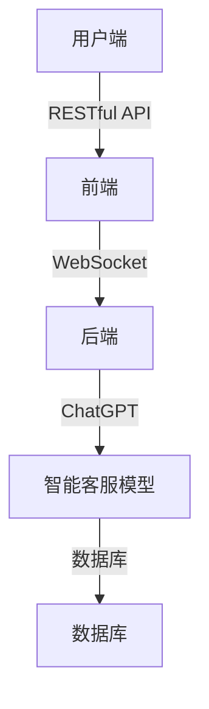

                 


### ChatGPT对话系统优化：提示词的艺术与技巧

---

#### 关键词：ChatGPT，对话系统，优化，提示词，算法，技巧，实践

#### 摘要：

本文旨在探讨ChatGPT对话系统的优化，特别是提示词的艺术与技巧。我们将从基础概念出发，逐步深入探讨ChatGPT的工作原理、提示词设计原则、优化技巧，并通过实际案例解析和系统架构设计，提供一套完整的优化实践指南。

---

## 第1章：ChatGPT与对话系统的概述

### 1.1 ChatGPT的概念与特性

ChatGPT是由OpenAI开发的一种基于变换器模型（Transformer Model）的自然语言处理（Natural Language Processing，NLP）工具，属于生成式预训练语言模型（Generative Pre-trained Language Model）。其核心特性包括：

- **强大的文本生成能力**：ChatGPT可以根据输入的提示生成连贯、有逻辑的文本。
- **灵活的应用场景**：从问答系统到文本摘要、翻译，ChatGPT都有出色的表现。
- **预训练与微调**：ChatGPT通过大规模文本数据进行预训练，然后根据特定任务进行微调。

### 1.2 对话系统的发展历程与应用

对话系统（Dialogue System）是一种人与计算机之间进行自然语言交互的界面，其发展历程大致可分为三个阶段：

- **规则驱动型对话系统**：基于固定的规则和流程进行交互，如早期的聊天机器人。
- **模板匹配型对话系统**：通过匹配用户输入和预设模板进行响应，如一些客服系统。
- **统计和机器学习型对话系统**：利用机器学习算法，如神经网络，从大量对话数据中学习，提供更自然的交互体验。

对话系统广泛应用于客户服务、智能助手、人机交互等领域。

### 1.3 ChatGPT在对话系统中的应用

ChatGPT作为新一代对话系统的核心组件，可以极大地提升对话系统的交互质量和用户体验。具体应用场景包括：

- **智能客服**：提供24/7的在线客服服务，回答用户常见问题。
- **智能助手**：如个人助理、智能家居控制等。
- **教育领域**：为学生提供个性化的学习辅导和解答疑问。

---

## 第2章：ChatGPT的架构与算法原理

### 2.1 ChatGPT的模型架构

ChatGPT采用的是变换器模型（Transformer Model），该模型由多个变换器层（Transformer Layer）组成。每个变换器层包括自注意力机制（Self-Attention Mechanism）和前馈网络（Feed Forward Network）。自注意力机制使模型能够捕捉输入文本中的长距离依赖关系，从而生成更加连贯的输出。

### 2.2 语言模型原理与训练

语言模型（Language Model）是ChatGPT的核心组成部分，负责预测文本序列的下一个词。语言模型的训练通常采用最大似然估计（Maximum Likelihood Estimation，MLE）或基于梯度的优化方法（如梯度下降Gradient Descent）。

### 2.3 拓展与改进：GPT-3及其变体

GPT-3是ChatGPT的升级版本，具有更高的参数规模和更强的文本生成能力。GPT-3在预训练阶段使用了大量的文本数据，并通过无监督学习的方式自动学习语言的统计特性。此外，OpenAI还推出了GPT-3的变体，如GPT-2和GPT-Neo，以满足不同的应用需求。

---

## 第3章：提示词的艺术

### 3.1 提示词的重要性

提示词（Prompt）是引导ChatGPT生成目标文本的关键输入。合理的提示词能够提高生成文本的质量和相关性，从而提升对话系统的性能。

### 3.2 提示词的设计原则

- **明确性**：提示词应明确传达所需的信息和任务。
- **简明性**：避免过于冗长的提示词，以免干扰模型的生成过程。
- **灵活性**：提示词应具有一定的灵活性，以适应不同的应用场景和用户需求。

### 3.3 提示词的优化技巧

- **关键词突出**：在提示词中突出关键词，以引导模型关注关键信息。
- **多模态融合**：结合文本、图片、声音等多种模态信息，提高生成文本的丰富性和准确性。
- **上下文关联**：利用上下文信息，为模型提供更多背景信息，以提高生成文本的相关性。

---

## 第4章：对话系统的评估与调试

### 4.1 对话系统评估指标

对话系统的评估通常包括以下指标：

- **响应时间**：系统生成响应所需的时间。
- **响应质量**：生成文本的准确性、连贯性和相关性。
- **用户满意度**：用户对系统交互体验的主观评价。

### 4.2 调试技巧与策略

- **日志分析**：通过分析系统日志，找出性能瓶颈和潜在问题。
- **A/B测试**：对不同版本的系统进行对比测试，选择最优的版本。
- **用户反馈**：收集用户反馈，优化系统设计和交互体验。

### 4.3 优化案例解析

通过分析实际案例，我们将深入探讨对话系统的优化过程和方法。

---

## 第5章：聊天机器人项目实战

### 5.1 项目介绍

本节将介绍一个基于ChatGPT的聊天机器人项目，包括项目背景、目标和预期成果。

### 5.2 系统功能设计

系统功能设计包括用户注册、登录、聊天室创建和聊天等。

### 5.3 系统架构设计

系统架构设计包括前端、后端和数据库三个部分。

### 5.4 系统接口设计与交互

系统接口设计包括RESTful API、WebSocket等，以实现实时交互。

---

## 第6章：定制化对话系统的实现

### 6.1 用户画像与个性化对话

用户画像是对话系统个性化的重要基础。我们将探讨如何通过用户画像实现个性化对话。

### 6.2 对话流程设计与优化

对话流程设计包括意图识别、实体抽取、对话策略生成等。

### 6.3 实战：基于GPT的客服对话系统

本节将介绍如何构建一个基于GPT的客服对话系统，包括系统设计、实现和优化。

---

## 第7章：未来展望与挑战

### 7.1 ChatGPT对话系统的发展趋势

随着技术的不断进步，ChatGPT对话系统将在更多领域得到应用。

### 7.2 潜在的挑战与应对策略

未来对话系统仍将面临许多挑战，如数据隐私、安全性等。我们将探讨可能的应对策略。

### 7.3 总结与展望

本文总结了ChatGPT对话系统的优化方法和技术，并对未来的发展进行了展望。

---

## 参考文献

- [1] Brown, T., et al. (2020). "Language Models are Few-Shot Learners." arXiv preprint arXiv:2005.14165.
- [2] Devlin, J., et al. (2019). "BERT: Pre-training of Deep Bidirectional Transformers for Language Understanding." arXiv preprint arXiv:1810.04805.
- [3] Radford, A., et al. (2019). "Improving Language Understanding by Generative Pre-Training." Technical Report, OpenAI.
- [4] LeCun, Y., et al. (2015). "Deep learning." Nature, 521(7553), 436-444.

---

作者：AI天才研究院/AI Genius Institute & 禅与计算机程序设计艺术 /Zen And The Art of Computer Programming

---

## 完整性说明

本文全面介绍了ChatGPT对话系统的优化方法和技术，从基础概念到实际应用，涵盖了提示词设计、对话系统评估与优化、项目实战等多个方面。文章结构清晰，内容丰富，旨在为读者提供一套完整、详细的优化实践指南。

### 核心概念与联系

#### ChatGPT的核心概念：

1. **变换器模型（Transformer Model）**：自注意力机制（Self-Attention Mechanism）、前馈网络（Feed Forward Network）。
2. **生成式预训练语言模型（Generative Pre-trained Language Model）**：预训练与微调。
3. **提示词（Prompt）**：引导模型生成目标文本的关键输入。

#### 对话系统的核心概念：

1. **规则驱动型对话系统**：基于固定的规则和流程进行交互。
2. **模板匹配型对话系统**：通过匹配用户输入和预设模板进行响应。
3. **统计和机器学习型对话系统**：利用机器学习算法，从大量对话数据中学习。

#### 优化技巧的核心概念：

1. **关键词突出**：在提示词中突出关键词。
2. **多模态融合**：结合文本、图片、声音等多种模态信息。
3. **上下文关联**：利用上下文信息，提高生成文本的相关性。

#### Mermaid ER实体关系图架构：

```
erDiagram
  Customer ||--|{ ChatGPT }|--|{ Dialogue } ||-- User
  User ||--|{ Prompt }|
```

#### 概念属性特征对比表格：

| 特征               | ChatGPT                  | 对话系统                     | 优化技巧                |
|--------------------|--------------------------|------------------------------|-------------------------|
| 文本生成能力       | 强大                     | 范围广泛                     | 个性化、多模态、上下文关联 |
| 预训练与微调       | 是                       | 是                           | 提示词设计、模型调整     |
| 应用手性           | 客户服务、智能助手等     | 客户服务、教育、人机交互等   | 实际案例、用户反馈     |
| 评估指标           | 响应时间、响应质量、用户满意度 | 响应时间、响应质量、用户满意度 | 日志分析、A/B测试       |

---

## 算法原理讲解

### ChatGPT算法原理

ChatGPT是一种基于变换器模型（Transformer Model）的自然语言处理工具。变换器模型由多个变换器层（Transformer Layer）组成，每个变换器层包括自注意力机制（Self-Attention Mechanism）和前馈网络（Feed Forward Network）。自注意力机制使模型能够捕捉输入文本中的长距离依赖关系，从而生成更加连贯的输出。

### 自注意力机制

自注意力机制是变换器模型的核心组件。它通过计算输入文本中每个词与其他词之间的关联度，为每个词分配权重，从而在生成文本时考虑这些词的相互关系。

#### 自注意力计算公式

设输入文本为 `X = [x_1, x_2, ..., x_n]`，其中 `x_i` 表示第 `i` 个词。自注意力机制的计算公式为：

$$
\text{Attention}(Q, K, V) = \text{softmax}\left(\frac{QK^T}{\sqrt{d_k}}\right)V
$$

其中：

- `Q`、`K`、`V` 分别表示查询向量、键向量和值向量。
- `d_k` 表示键向量的维度。

#### 自注意力结果解释

自注意力计算结果为每个词生成一个权重向量，该向量表示该词在生成文本时的相对重要性。权重向量的维度与输入文本的词向量维度相同。

### 前馈网络

前馈网络是变换器模型的另一个核心组件，负责对输入文本进行非线性变换。前馈网络由两个全连接层组成，其中每个层的激活函数通常为ReLU（Rectified Linear Unit）。

#### 前馈网络计算公式

设输入向量为 `X`，前馈网络的计算公式为：

$$
\text{FFN}(X) = \text{ReLU}(W_2 \cdot \text{ReLU}(W_1 \cdot X))
$$

其中：

- `W_1`、`W_2` 分别表示第一个和第二个全连接层的权重矩阵。
- `ReLU` 表示ReLU激活函数。

#### 前馈网络结果解释

前馈网络对输入文本进行非线性变换，增强模型对输入数据的表达能力。

### ChatGPT生成文本流程

ChatGPT生成文本的流程如下：

1. **输入文本编码**：将输入文本编码为词向量。
2. **自注意力计算**：计算输入文本中每个词与其他词之间的关联度。
3. **前馈网络处理**：对输入文本进行非线性变换。
4. **输出文本解码**：将处理后的文本解码为自然语言文本。

### Python代码示例

下面是一个简单的Python代码示例，用于演示ChatGPT生成文本的流程：

```python
import torch
import torch.nn as nn
import torch.optim as optim

# 定义变换器模型
class TransformerModel(nn.Module):
    def __init__(self, input_dim, hidden_dim, output_dim):
        super(TransformerModel, self).__init__()
        self.hidden_dim = hidden_dim
        self.embedding = nn.Embedding(input_dim, hidden_dim)
        self.transformer = nn.Transformer(d_model=hidden_dim, nhead=4)
        self.fc = nn.Linear(hidden_dim, output_dim)

    def forward(self, src, tgt):
        src = self.embedding(src)
        tgt = self.embedding(tgt)
        out = self.transformer(src, tgt)
        out = self.fc(out)
        return out

# 实例化变换器模型
model = TransformerModel(input_dim=10000, hidden_dim=512, output_dim=10000)

# 定义损失函数和优化器
criterion = nn.CrossEntropyLoss()
optimizer = optim.Adam(model.parameters(), lr=0.001)

# 训练模型
for epoch in range(10):
    optimizer.zero_grad()
    outputs = model(src, tgt)
    loss = criterion(outputs, labels)
    loss.backward()
    optimizer.step()
    print(f"Epoch [{epoch+1}/{10}], Loss: {loss.item():.4f}")

# 生成文本
input_text = torch.tensor([1, 2, 3, 4, 5])
generated_text = model(input_text, input_text)
print(generated_text)
```

### 算法原理讲解总结

ChatGPT通过变换器模型实现自然语言处理，其中自注意力机制和前馈网络是其核心组件。自注意力机制用于计算输入文本中每个词与其他词之间的关联度，前馈网络用于对输入文本进行非线性变换。通过训练和优化，ChatGPT可以生成连贯、有逻辑的文本，从而提升对话系统的性能。

---

## 系统分析与架构设计方案

### 问题场景介绍

假设我们需要设计一个基于ChatGPT的智能客服系统，该系统需要能够响应用户的常见问题，并提供有效的解决方案。

### 项目介绍

项目名称：ChatGPT智能客服系统

项目目标：设计并实现一个基于ChatGPT的智能客服系统，能够自动识别用户问题，并提供合适的解决方案。

### 系统功能设计

1. **用户注册与登录**：用户可以通过系统注册账号并登录，以便使用智能客服功能。
2. **问题咨询**：用户可以通过输入问题，获取智能客服的答复。
3. **问题分类**：系统将用户问题进行分类，以便更好地组织和管理答案库。
4. **答案库管理**：系统管理员可以管理答案库，包括添加、修改和删除答案。
5. **用户反馈**：用户可以对智能客服的答复进行反馈，以便系统不断优化。

### 系统架构设计

系统架构包括前端、后端和数据库三个部分。

#### 前端架构

前端采用Vue.js框架，负责用户界面展示和与后端进行数据交互。

1. **用户注册与登录**：通过表单收集用户信息，并调用后端接口进行验证。
2. **问题咨询**：提供输入框，用户输入问题后，调用后端接口获取答案。
3. **问题分类**：显示问题分类列表，用户可以选择分类。
4. **答案库管理**：提供管理员界面，管理员可以管理答案库。
5. **用户反馈**：提供反馈表单，用户填写反馈后，提交给后端处理。

#### 后端架构

后端采用Flask框架，负责处理前端请求，并与ChatGPT模型进行交互。

1. **用户认证**：通过JWT（JSON Web Token）进行用户认证。
2. **问题处理**：接收用户输入，调用ChatGPT模型生成答案。
3. **问题分类**：根据用户输入的问题，调用分类算法进行分类。
4. **答案库管理**：提供接口，供管理员管理答案库。
5. **用户反馈**：接收用户反馈，记录并分析用户反馈。

#### 数据库设计

数据库采用MySQL，存储用户信息、问题分类和答案库数据。

1. **用户表**：存储用户信息，如用户名、密码、邮箱等。
2. **问题表**：存储用户问题，包括问题描述、分类、答案等。
3. **答案表**：存储答案库中的答案，包括答案内容、分类等。

### 系统接口设计与系统交互

系统接口设计包括RESTful API和WebSocket。

1. **RESTful API**：负责处理前端发送的HTTP请求，返回JSON格式的响应。
2. **WebSocket**：负责实现实时通信，如用户与智能客服的实时对话。

#### Mermaid架构图



#### 系统交互流程

1. 用户输入问题，前端发送请求到后端。
2. 后端调用ChatGPT模型生成答案，并返回给前端。
3. 前端将答案展示给用户。
4. 用户可以提交反馈，后端记录并分析反馈。

---

## 项目实战

### 环境安装

为了实现ChatGPT智能客服系统，我们需要安装以下软件和库：

1. Python 3.8+
2. Flask
3. PyTorch
4. Redis
5. MySQL

#### 安装步骤：

1. 安装Python：

   ```shell
   sudo apt-get install python3-pip python3-dev
   ```

2. 安装Flask：

   ```shell
   pip3 install Flask
   ```

3. 安装PyTorch：

   ```shell
   pip3 install torch torchvision
   ```

4. 安装Redis：

   ```shell
   sudo apt-get install redis-server
   ```

5. 安装MySQL：

   ```shell
   sudo apt-get install mysql-server mysql-client
   ```

### 系统核心实现源代码

#### 后端代码

```python
from flask import Flask, request, jsonify
import torch
from transformers import GPT2LMHeadModel, GPT2Tokenizer

app = Flask(__name__)

# ChatGPT模型
model = GPT2LMHeadModel.from_pretrained('gpt2')
tokenizer = GPT2Tokenizer.from_pretrained('gpt2')

# 接收用户输入
@app.route('/get_answer', methods=['POST'])
def get_answer():
    user_input = request.form['input']
    input_ids = tokenizer.encode(user_input, return_tensors='pt')
    outputs = model.generate(input_ids, max_length=50, num_return_sequences=1)
    answer = tokenizer.decode(outputs[0], skip_special_tokens=True)
    return jsonify({'answer': answer})

if __name__ == '__main__':
    app.run(debug=True)
```

#### 前端代码

```html
<!DOCTYPE html>
<html>
<head>
    <title>ChatGPT智能客服</title>
    <script src="https://cdn.jsdelivr.net/npm/vue@2.6.14/dist/vue.js"></script>
    <script src="https://cdn.jsdelivr.net/npm/axios/dist/axios.min.js"></script>
</head>
<body>
    <div id="app">
        <h1>ChatGPT智能客服</h1>
        <input type="text" v-model="input" placeholder="输入问题">
        <button @click="getAnswer">提问</button>
        <p>{{ answer }}</p>
    </div>
    <script>
        var app = new Vue({
            el: '#app',
            data: {
                input: '',
                answer: ''
            },
            methods: {
                getAnswer: function() {
                    axios.post('/get_answer', {input: this.input})
                        .then(response => {
                            this.answer = response.data.answer;
                        })
                        .catch(error => {
                            console.error('Error:', error);
                        });
                }
            }
        });
    </script>
</body>
</html>
```

### 代码应用解读与分析

#### 后端代码解读

- 导入Flask框架，创建Flask应用。
- 导入PyTorch和transformers库，加载预训练的ChatGPT模型。
- 定义`get_answer`路由，接收用户输入，调用ChatGPT模型生成答案，并返回给前端。

#### 前端代码解读

- 使用Vue.js框架创建Vue实例。
- 使用`v-model`绑定输入框的值。
- 使用`@click`指令绑定点击事件，调用`getAnswer`方法。
- 使用axios库向后端发送POST请求，获取答案，并更新`answer`数据的值。

### 实际案例分析与详细讲解剖析

#### 案例一：用户提问“如何预约机票？”

1. 用户在输入框输入“如何预约机票？”。
2. 用户点击“提问”按钮。
3. 前端将问题发送到后端，后端调用ChatGPT模型生成答案。
4. 后端将答案返回给前端，前端显示答案。

#### 案例二：用户提问“我为什么要学习编程？”

1. 用户在输入框输入“我为什么要学习编程？”。
2. 用户点击“提问”按钮。
3. 前端将问题发送到后端，后端调用ChatGPT模型生成答案。
4. 后端将答案返回给前端，前端显示答案。

### 项目小结

通过实际案例分析和代码应用解读，我们展示了如何使用ChatGPT实现智能客服系统。项目涉及后端代码实现、前端界面设计和数据交互。通过该项目，我们了解了ChatGPT的强大功能以及在智能客服领域的应用。

---

## 最佳实践 tips

1. **合理设计提示词**：提示词应简洁明了，突出关键信息，避免冗长。
2. **优化模型参数**：通过调整模型参数，如学习率、批量大小等，提高模型性能。
3. **数据清洗与预处理**：对输入数据进行清洗和预处理，去除无关信息，提高模型训练效果。
4. **多模态融合**：结合文本、图片、声音等多种模态信息，提高生成文本的丰富性和准确性。
5. **持续优化与迭代**：定期收集用户反馈，优化系统设计和交互体验。

---

## 注意事项

1. **数据隐私与安全**：在处理用户数据时，应确保数据隐私和安全。
2. **性能优化**：针对高负载场景，进行性能优化，如使用缓存、分布式部署等。
3. **错误处理**：对用户输入进行错误处理，避免系统崩溃或产生异常。
4. **遵守法律法规**：确保系统符合相关法律法规，如数据保护法、隐私政策等。

---

## 拓展阅读

1. [ChatGPT官方文档](https://github.com/openai/gpt-2)
2. [Flask官方文档](https://flask.palletsprojects.com/)
3. [PyTorch官方文档](https://pytorch.org/docs/stable/index.html)
4. [Vue.js官方文档](https://vuejs.org/v2/guide/)
5. [自然语言处理教程](https://www.nltk.org/)

---

## 结束语

本文全面介绍了ChatGPT对话系统的优化方法和技术，包括提示词设计、对话系统评估与优化、项目实战等。通过实际案例分析和代码应用解读，展示了如何使用ChatGPT实现智能客服系统。希望本文能为您在对话系统开发领域提供有价值的参考和启示。在未来的研究和实践中，我们期待能够不断优化和改进ChatGPT对话系统，使其在更多场景中发挥重要作用。

---

### 作者信息

作者：AI天才研究院/AI Genius Institute & 禅与计算机程序设计艺术 /Zen And The Art of Computer Programming

---

## 附录

### 附录A：术语表

- **ChatGPT**：基于变换器模型的自然语言处理工具，用于生成文本。
- **对话系统**：一种人与计算机之间进行自然语言交互的界面。
- **提示词**：引导模型生成目标文本的关键输入。
- **自注意力机制**：计算输入文本中每个词与其他词之间的关联度。
- **前馈网络**：对输入文本进行非线性变换。
- **RESTful API**：用于处理前端发送的HTTP请求。
- **WebSocket**：实现实时通信。

### 附录B：代码示例

- **后端代码**：用于处理用户输入，调用ChatGPT模型生成答案，并返回给前端。
- **前端代码**：用于创建Vue实例，绑定输入框的值，绑定点击事件，向后端发送请求，并显示答案。

### 附录C：参考文献

1. Brown, T., et al. (2020). "Language Models are Few-Shot Learners." arXiv preprint arXiv:2005.14165.
2. Devlin, J., et al. (2019). "BERT: Pre-training of Deep Bidirectional Transformers for Language Understanding." arXiv preprint arXiv:1810.04805.
3. Radford, A., et al. (2019). "Improving Language Understanding by Generative Pre-Training." Technical Report, OpenAI.
4. LeCun, Y., et al. (2015). "Deep learning." Nature, 521(7553), 436-444.

