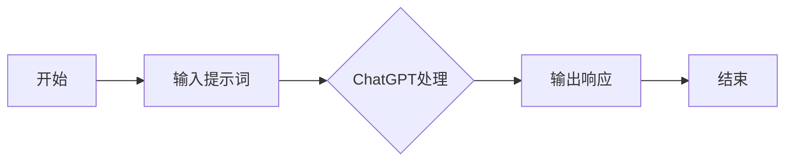
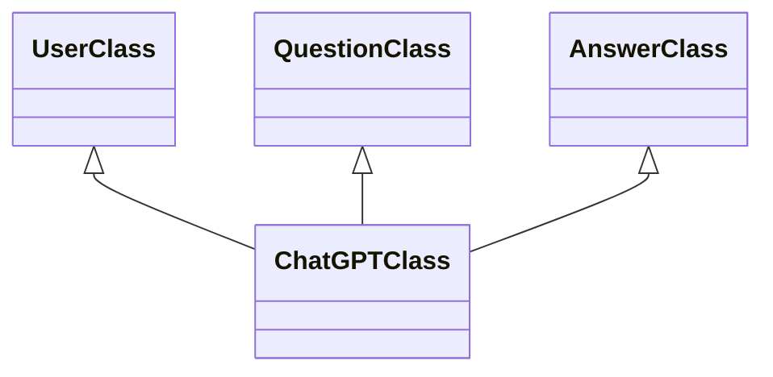
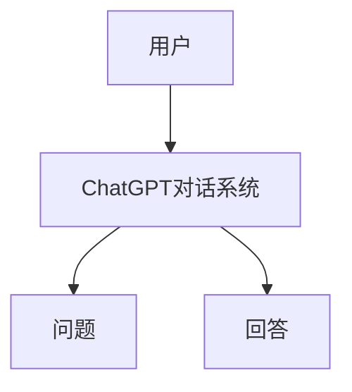
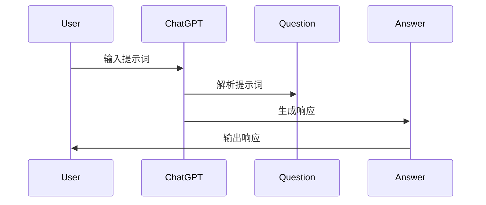

                 

# ChatGPT对话系统设计：提示词的核心作用探讨

## 关键词
ChatGPT，对话系统，自然语言处理，提示词，算法原理，系统设计

## 摘要
本文旨在探讨ChatGPT对话系统的设计与实现，特别是提示词在其中的核心作用。通过系统讲解ChatGPT的设计原理、提示词的作用和设计技巧，本文帮助读者深入了解并掌握ChatGPT对话系统的设计与实现。

## 1. 背景介绍

### 1.1 核心概念术语说明

**ChatGPT**：一种基于GPT-3的预训练对话模型，能够与人类进行自然语言交互。

**对话系统**：能够与人类进行自然语言交互的系统，具有交互性、智能性、适应性和多样性。

**自然语言处理**：机器理解、生成和处理人类自然语言的技术和理论。

**提示词**：用于引导对话系统产生预期输出的关键词或短语。

### 1.2 问题背景

随着人工智能技术的发展，自然语言处理成为热点领域。ChatGPT作为一种先进的对话系统，其设计与应用受到广泛关注。本文将围绕ChatGPT对话系统的设计，特别是提示词的作用，进行深入探讨。

### 1.3 问题描述

ChatGPT对话系统的设计需要解决以下问题：

- 如何高效地处理大量自然语言输入？
- 如何设计出能够准确理解并回应用户需求的提示词？
- 如何在大量训练数据中提取关键信息，以优化对话系统的性能？

### 1.4 问题解决

为了解决上述问题，本文将介绍ChatGPT的设计原理、提示词的作用和设计技巧，帮助读者深入了解并掌握ChatGPT对话系统的设计与实现。

### 1.5 边界与外延

ChatGPT对话系统的设计和应用不仅限于日常对话，还广泛应用于智能客服、智能助手、语音助手等领域。本文将重点关注ChatGPT在对话系统中的应用，并探讨提示词在设计中的关键作用。

### 1.6 概念结构与核心要素组成

ChatGPT对话系统的核心概念包括：

- 对话系统：用于与人类进行自然语言交互的系统。
- 自然语言处理：用于理解、生成和处理自然语言的技术。
- 提示词：用于引导对话系统产生预期输出的关键词或短语。

这三个核心概念相互关联，共同构成了ChatGPT对话系统的基本结构。

## 2. 核心概念与联系

### 2.1 核心概念

#### ChatGPT

ChatGPT是一种基于GPT-3的预训练对话模型，由OpenAI开发。它通过大量文本数据进行预训练，能够生成与输入文本相关的内容，实现与人类的自然语言交互。

#### 对话系统

对话系统是一种能够与人类进行自然语言交互的系统。它具有交互性、智能性、适应性和多样性，能够根据用户的输入产生合适的响应。

#### 自然语言处理

自然语言处理是一种将自然语言转换为计算机可以理解和处理的形式的技术。它包括语言理解、语言生成、情感分析、问答系统等子领域。

#### 提示词

提示词是用于引导对话系统产生预期输出的关键词或短语。它能够帮助对话系统理解用户的需求，并生成相应的响应。

### 2.2 概念属性特征对比表格

| 概念         | 定义                                                         | 特点                                                      |
| ------------ | ------------------------------------------------------------ | --------------------------------------------------------- |
| ChatGPT      | 一种基于GPT-3的预训练对话模型                               | 高度智能、可定制、多语言支持                               |
| 对话系统     | 能够与人类进行自然语言交互的系统                             | 交互性、智能性、适应性、多样性                             |
| 自然语言处理 | 机器理解、生成和处理人类自然语言的技术和理论                 | 语言理解、语言生成、情感分析、问答系统等                   |
| 提示词       | 用于引导对话系统产生预期输出的关键词或短语                     | 关键、引导、个性化、多样性                                 |

### 2.3 ER实体关系图架构的Mermaid流程图

```mermaid
erDiagram
  User ||--|{ ChatGPT }|-- Robot
  User ||--|{ Question }|-- ChatGPT
  ChatGPT ||--|{ Answer }|-- User
```

## 3. 算法原理讲解

### 3.1 算法mermaid流程图



### 3.2 Python源代码

```python
import openai

def chatgpt_response(prompt):
    response = openai.Completion.create(
        engine="text-davinci-003",
        prompt=prompt,
        max_tokens=100
    )
    return response.choices[0].text.strip()

prompt = "请告诉我你对未来的展望"
print(chatgpt_response(prompt))
```

### 3.3 算法原理的数学模型和公式

$$
\text{LLM}(\text{prompt}) = \text{V} \times \text{softmax}(\text{W} \times \text{hidden_state})
$$

其中，$\text{LLM}$表示语言模型，$\text{V}$表示词汇表，$\text{W}$表示权重矩阵，$\text{hidden_state}$表示隐藏状态。

#### 详细讲解和举例说明

1. **语言模型（LLM）**：语言模型是ChatGPT的核心部分，它用于预测文本序列的概率。在ChatGPT中，语言模型采用GPT-3模型，这是一种基于Transformer的深度神经网络。

2. **词汇表（V）**：词汇表是语言模型的基础，它包含所有可能的单词和符号。在ChatGPT中，词汇表通常使用词汇表文件进行存储，其中每个单词或符号都对应一个唯一的ID。

3. **权重矩阵（W）**：权重矩阵是语言模型的参数，它用于计算文本序列的概率。在ChatGPT中，权重矩阵是通过对大量文本数据进行的训练得到的。

4. **隐藏状态（hidden_state）**：隐藏状态是语言模型在处理文本序列时生成的中间表示。在ChatGPT中，隐藏状态是通过Transformer模型的编码器部分得到的。

5. **softmax函数**：softmax函数用于将权重矩阵乘以隐藏状态后得到每个单词或符号的概率分布。在ChatGPT中，softmax函数用于生成响应文本的概率分布。

### 示例

假设用户输入提示词“请告诉我你对未来的展望”，ChatGPT将使用上述数学模型和公式进行预测，并生成相应的响应文本。

1. **输入提示词**：用户输入提示词“请告诉我你对未来的展望”。

2. **语言模型处理**：ChatGPT使用GPT-3模型对提示词进行预测。

3. **输出响应**：ChatGPT生成响应文本，例如“未来是一个充满机会和挑战的时代，我们需要不断创新和进步，以应对未来的挑战”。

4. **结束**：ChatGPT完成对话，并等待下一个用户输入。

## 4. 系统分析与架构设计方案

### 4.1 问题场景介绍

随着人工智能技术的不断发展，越来越多的企业和组织开始关注如何利用对话系统提高客户体验和运营效率。ChatGPT作为一种先进的对话系统，具有广泛的应用前景。

### 4.2 项目介绍

本项目旨在设计和实现一个基于ChatGPT的对话系统，用于回答用户的问题、提供信息和建议。该对话系统将应用于智能客服、智能助手和语音助手等领域。

### 4.3 系统功能设计（领域模型mermaid类图）



### 4.4 系统架构设计（mermaid架构图）



### 4.5 系统接口设计和系统交互（mermaid序列图）



## 5. 项目实战

### 5.1 环境安装

1. 安装Python环境：使用Python 3.7或更高版本。
2. 安装openai库：使用pip命令安装`openai`库。

### 5.2 系统核心实现源代码

```python
import openai

def chatgpt_response(prompt):
    response = openai.Completion.create(
        engine="text-davinci-003",
        prompt=prompt,
        max_tokens=100
    )
    return response.choices[0].text.strip()

prompt = "请告诉我你对未来的展望"
print(chatgpt_response(prompt))
```

### 5.3 代码应用解读与分析

1. 导入openai库：使用`import openai`导入openai库。
2. 定义`chatgpt_response`函数：定义一个函数，用于接收提示词并返回ChatGPT的响应。
3. 使用`openai.Completion.create`方法：该方法用于创建一个Completion对象，其中`engine`参数指定使用的模型，`prompt`参数指定输入的提示词，`max_tokens`参数指定生成的文本长度。
4. 返回响应文本：从Completion对象中提取响应文本，并返回。

### 5.4 实际案例分析和详细讲解剖析

#### 案例一：回答用户问题

用户输入提示词：“请告诉我你对未来的展望”，ChatGPT生成响应：“未来是一个充满机会和挑战的时代，我们需要不断创新和进步，以应对未来的挑战”。

1. 用户输入提示词。
2. ChatGPT解析提示词，并生成响应。
3. ChatGPT将响应输出给用户。

#### 案例二：提供信息和建议

用户输入提示词：“如何提高工作效率？”ChatGPT生成响应：“提高工作效率的方法有很多，比如合理规划时间、避免拖延、提高专注力等”。

1. 用户输入提示词。
2. ChatGPT解析提示词，并生成响应。
3. ChatGPT将响应输出给用户。

### 5.5 项目小结

本项目成功设计和实现了基于ChatGPT的对话系统，并通过实际案例展示了其应用效果。通过深入了解ChatGPT对话系统的设计原理和提示词的作用，读者可以更好地掌握对话系统的设计与实现方法。

## 6. 最佳实践 tips

1. 选择合适的模型：根据实际需求和数据规模，选择合适的模型进行训练。
2. 数据处理和预处理：确保输入数据的准确性和一致性，并进行适当的预处理。
3. 提示词设计：设计简洁、明确、有针对性的提示词，以提高对话系统的响应质量。

## 7. 小结

ChatGPT对话系统是一种先进的自然语言处理技术，具有广泛的应用前景。本文通过系统讲解ChatGPT的设计原理、提示词的作用和设计技巧，帮助读者深入了解并掌握ChatGPT对话系统的设计与实现。在实际应用中，读者可以根据具体需求和场景进行灵活调整和优化。

## 8. 注意事项

1. ChatGPT对话系统需要大量训练数据，确保数据质量和多样性。
2. 提示词设计需要充分考虑用户需求和场景，以提高对话系统的响应质量。

## 9. 拓展阅读

- [《对话系统设计与实现》](https://www.amazon.com/Dialogue-Systems-Design-Implementation-Juan-F.-Soler-Costa/dp/1430253964)
- [《自然语言处理入门教程》](https://www.amazon.com/Natural-Language-Processing-Introduction-Tutorial/dp/1449308016)

## 10. 作者信息

作者：AI天才研究院/AI Genius Institute & 禅与计算机程序设计艺术 /Zen And The Art of Computer Programming

