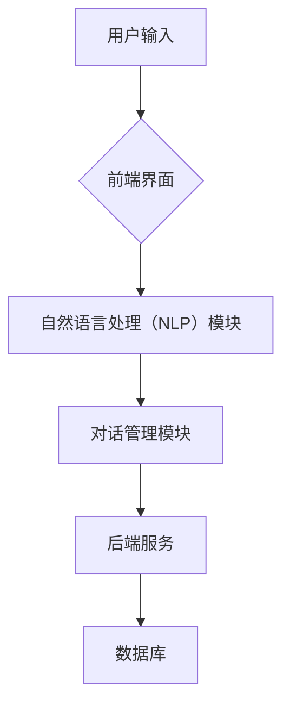
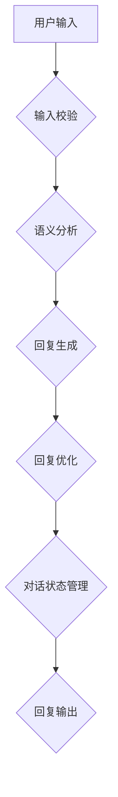
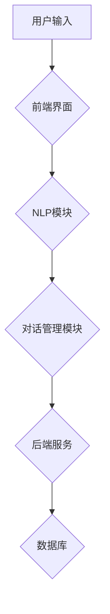

                 


### 文章标题：《ChatGPT对话系统设计：提示词的艺术与技巧》

### 关键词：ChatGPT、对话系统、提示词、设计、技巧

### 摘要：
本文将深入探讨ChatGPT对话系统的设计与提示词的艺术与技巧。首先，我们将介绍ChatGPT的基本概念和背景，然后详细解析其对话系统设计中的核心要素——提示词。通过具体的案例分析和实战经验，我们将揭示提示词设计的艺术与技巧，并最终讨论对话系统设计的整体架构和未来发展趋势。

## 目录大纲

### 第一部分：ChatGPT概述与基础

### 第1章：ChatGPT概述
#### 1.1 ChatGPT的发展背景
#### 1.2 ChatGPT的核心技术与优势
#### 1.3 ChatGPT的应用场景
#### 1.4 ChatGPT的边界与局限性

### 第2章：ChatGPT基础
#### 2.1 ChatGPT的工作原理
#### 2.2 ChatGPT的基本结构
#### 2.3 ChatGPT的输入输出处理
#### 2.4 ChatGPT的训练与优化

### 第二部分：提示词设计

### 第3章：提示词设计基础
#### 3.1 提示词的定义与作用
#### 3.2 提示词的类型与特性
#### 3.3 提示词的语义分析
#### 3.4 提示词的优化策略

### 第4章：艺术与技巧
#### 4.1 创意提示词的生成
#### 4.2 提示词的情境适配
#### 4.3 提示词的情感表达
#### 4.4 提示词的互动设计

### 第5章：案例解析
#### 5.1 成功案例分享
#### 5.2 挑战与问题分析
#### 5.3 案例分析与启示

### 第三部分：实战与技巧

### 第6章：ChatGPT对话系统设计
#### 6.1 设计原则与流程
#### 6.2 系统架构设计
#### 6.3 对话流程设计
#### 6.4 系统性能优化

### 第7章：实战应用与案例分析
#### 7.1 实战项目一：客服机器人设计
#### 7.2 实战项目二：教育辅导系统设计
#### 7.3 案例分析：从设计到部署
#### 7.4 项目总结与反思

### 第四部分：展望与未来

### 第8章：ChatGPT的发展趋势
#### 8.1 技术演进方向
#### 8.2 应用前景展望
#### 8.3 社会与伦理影响

### 第9章：提示词设计的未来
#### 9.1 提示词创新的挑战
#### 9.2 提示词设计的趋势
#### 9.3 未来应用的可能方向

### 第10章：总结与展望
#### 10.1 本书要点回顾
#### 10.2 设计技巧总结
#### 10.3 未来工作方向

接下来，我们将按照上述目录结构，逐章进行详细撰写，确保每章的内容都丰富、具体，并且逻辑清晰，以便读者能够更好地理解和掌握ChatGPT对话系统设计与提示词设计的核心知识与技巧。### 第一部分：ChatGPT概述与基础

### 第1章：ChatGPT概述

#### 1.1 ChatGPT的发展背景

ChatGPT是OpenAI在2022年底推出的一个基于GPT-3.5模型的人工智能聊天机器人。它的诞生标志着人工智能在自然语言处理（NLP）领域的一个重要里程碑。ChatGPT的成功并非一蹴而就，而是基于长期以来对深度学习和NLP研究的积累。OpenAI的研究团队在GPT模型的基础上，进行了大量优化和改进，从而使得ChatGPT具备了强大的语言理解和生成能力。

ChatGPT的发展受到了多方面因素的影响。首先，计算机算力的提升和大数据的积累为深度学习模型提供了丰富的训练资源。其次，深度学习技术的发展为构建更加复杂和高效的人工智能模型提供了理论支持。此外，用户对于智能交互体验的需求也在不断增长，推动了人工智能技术的快速应用和普及。

#### 1.2 ChatGPT的核心技术与优势

ChatGPT的核心技术是基于GPT-3.5模型的一种预训练和微调技术。GPT（Generative Pre-trained Transformer）是一种基于Transformer架构的自然语言处理模型，具有强大的文本生成能力。GPT-3.5模型在GPT-3模型的基础上，进一步提升了模型的训练效率和生成质量。

ChatGPT的优势主要体现在以下几个方面：

1. **强大的语言理解能力**：ChatGPT能够理解复杂的语言结构，并生成连贯、自然的语言回复。
2. **多模态处理能力**：ChatGPT不仅能够处理文本输入，还可以处理图像、声音等多种形式的数据，实现跨模态交互。
3. **自适应能力**：ChatGPT可以通过微调适应不同的对话场景和用户需求，提供个性化的交互体验。
4. **高效率**：ChatGPT的训练和推理过程都高度自动化，能够快速响应用户的请求。

#### 1.3 ChatGPT的应用场景

ChatGPT具有广泛的应用场景，包括但不限于以下几个方面：

1. **智能客服**：ChatGPT可以用于构建智能客服系统，提供24/7的在线支持，提高客户满意度和服务效率。
2. **教育辅导**：ChatGPT可以作为教育辅导工具，为学生提供个性化的学习建议和解答疑问。
3. **内容创作**：ChatGPT可以用于自动生成文章、报告、诗歌等文本内容，节省创作者的时间和精力。
4. **虚拟助手**：ChatGPT可以充当虚拟助手，帮助用户管理日程、提醒事项、提供信息查询等服务。
5. **社交平台**：ChatGPT可以用于构建智能聊天机器人，增加社交平台的互动性和趣味性。

#### 1.4 ChatGPT的边界与局限性

尽管ChatGPT在自然语言处理领域取得了显著成就，但它仍然存在一些边界和局限性：

1. **数据依赖性**：ChatGPT的生成能力依赖于大规模的训练数据，数据的质量和数量直接影响模型的性能。
2. **推理能力有限**：ChatGPT虽然能够生成高质量的文本，但在逻辑推理和问题解决方面仍然存在一定的局限性。
3. **安全与隐私问题**：ChatGPT在处理用户输入时，可能涉及用户隐私和数据安全的问题，需要采取相应的保护措施。
4. **偏见与伦理问题**：由于训练数据可能存在偏见，ChatGPT在生成文本时也可能表现出一定的偏见和伦理问题。

在后续章节中，我们将进一步探讨ChatGPT的基础知识，包括其工作原理、基本结构、输入输出处理以及训练与优化等方面。通过这些内容的深入解析，读者将能够更好地理解ChatGPT的核心技术和应用场景，为后续的提示词设计和对话系统设计打下坚实的基础。### 第2章：ChatGPT基础

#### 2.1 ChatGPT的工作原理

ChatGPT的工作原理主要基于预训练和微调技术。预训练是指使用大规模的文本数据进行训练，使得模型具备强大的语言理解和生成能力。在预训练阶段，模型通过不断学习文本中的语言模式，逐渐掌握语言的规律和语义信息。

微调则是在预训练的基础上，针对特定的任务或场景，对模型进行进一步优化。在微调阶段，模型会根据新的数据集进行调整，以提高在特定任务上的性能。

ChatGPT的具体工作流程如下：

1. **输入处理**：用户输入一条文本消息，该消息会经过编码器（Encoder）进行处理。
2. **生成候选回复**：编码器将输入文本转化为向量表示，并利用这些向量表示生成多个候选回复。
3. **选择最佳回复**：模型会根据候选回复的生成概率，选择一个最佳回复返回给用户。

#### 2.2 ChatGPT的基本结构

ChatGPT的基本结构基于Transformer架构，这是一种基于自注意力机制的深度神经网络模型。Transformer模型由多个编码器和解码器层组成，通过多头自注意力机制和全连接层进行处理。

1. **编码器（Encoder）**：编码器的功能是将输入文本转化为向量表示。每个编码器层包含多头自注意力机制和前馈神经网络。
2. **解码器（Decoder）**：解码器的功能是根据编码器的输出和先前的回复，生成新的文本回复。每个解码器层也包含多头自注意力机制和前馈神经网络。

#### 2.3 ChatGPT的输入输出处理

ChatGPT的输入处理主要包括文本编码和向量表示。文本编码是将文本转化为计算机可以处理的数字形式，常用的编码方法包括One-hot编码、Word2Vec和BERT等。向量表示则是将文本编码结果转化为高维向量，以便于模型进行计算和训练。

输出处理则主要是将模型生成的文本回复进行解码，转化为用户可理解的文本形式。解码过程中，模型会根据生成概率选择最优的文本回复。

#### 2.4 ChatGPT的训练与优化

ChatGPT的训练过程主要包括预训练和微调两个阶段。

**预训练**：预训练阶段使用大规模的文本数据进行训练，目的是使模型具备强大的语言理解和生成能力。在预训练过程中，模型会通过不断学习文本中的语言模式，提高其对语言的掌握程度。

**微调**：微调阶段是在预训练的基础上，针对具体的任务或场景，对模型进行进一步优化。微调过程中，模型会根据新的数据集进行调整，以提高在特定任务上的性能。

**优化策略**：

1. **梯度下降**：梯度下降是一种常用的优化算法，通过不断调整模型的参数，使得损失函数的值逐渐减小。
2. **学习率调整**：学习率是梯度下降算法中的一个重要参数，适当的调整学习率可以加速模型的收敛。
3. **正则化**：正则化是一种防止模型过拟合的技术，常用的正则化方法包括L1正则化和L2正则化。

在训练过程中，还需要对模型进行评估和验证，以确定模型的性能和效果。评估指标主要包括损失函数值、准确率、召回率等。

通过上述内容，我们详细介绍了ChatGPT的工作原理、基本结构、输入输出处理以及训练与优化。理解这些基础内容，有助于我们更好地掌握ChatGPT的核心技术和应用场景，为后续的提示词设计和对话系统设计奠定基础。### 第二部分：提示词设计

#### 3.1 提示词的定义与作用

提示词（Prompt）在ChatGPT对话系统中扮演着至关重要的角色。它是指引导ChatGPT生成特定类型回复的文本输入。提示词的设计质量直接影响到对话系统的性能和用户体验。

**提示词的定义**：提示词是一段文本，它提供对话的上下文信息和期望的对话方向，帮助ChatGPT理解用户的意图和需求。

**提示词的作用**：

1. **明确对话方向**：提示词能够引导ChatGPT生成符合预期内容的回复，使得对话更加有条理和目标性。
2. **提高生成质量**：高质量的提示词可以提供丰富的上下文信息，帮助ChatGPT生成更加准确和连贯的文本回复。
3. **优化用户体验**：合适的提示词设计能够提升用户的交互体验，使对话更加自然和流畅。
4. **提高系统效率**：通过提示词，可以减少不必要的重复提问和回答，提高对话系统的响应速度和效率。

#### 3.2 提示词的类型与特性

提示词可以根据其用途和形式进行分类，常见的类型包括：

1. **问题型提示词**：这类提示词通常以提问的形式出现，用于引导ChatGPT生成回答。例如：“你最喜欢的电影是什么？”
2. **描述型提示词**：这类提示词用于描述场景或情境，帮助ChatGPT构建对话背景。例如：“想象你正在参加一场科技展览，你需要介绍你的最新研究成果。”
3. **指令型提示词**：这类提示词提供具体的指令，要求ChatGPT执行特定的任务。例如：“请你帮我预定一张明天的火车票。”
4. **情感型提示词**：这类提示词用于表达情感和情绪，帮助ChatGPT生成更具情感色彩的回复。例如：“你今天看起来很开心，为什么呢？”

**提示词的特性**：

1. **明确性**：提示词应当明确、具体，避免模糊不清的表述，以便ChatGPT能够准确理解用户的意图。
2. **上下文关联**：提示词应与对话的上下文紧密相关，提供足够的背景信息，帮助ChatGPT生成连贯的回复。
3. **适应性**：提示词应当根据不同的对话场景和用户需求进行自适应调整，以满足多样化的交互需求。
4. **简洁性**：提示词应当简洁明了，避免冗长复杂的描述，以提高对话的流畅性和效率。

#### 3.3 提示词的语义分析

提示词的语义分析是确保提示词设计质量的关键环节。通过对提示词的语义进行深入分析，可以更好地理解用户的意图和需求，从而设计出更加精准和有效的提示词。

**语义分析的方法**：

1. **词频分析**：通过统计提示词中高频词汇的出现频率，可以了解用户关注的重点和关键词。
2. **词义分析**：对提示词中的每个词汇进行词义分析，理解其具体含义和上下文关联，有助于优化提示词的设计。
3. **情感分析**：通过情感分析技术，可以判断提示词中表达的情感倾向，以便设计出更具情感色彩的提示词。
4. **语境分析**：结合对话的上下文，对提示词进行语境分析，确保其与对话内容紧密相关。

**语义分析的应用**：

1. **优化提示词**：通过语义分析，可以识别出提示词中的潜在问题，如语义歧义、情感不当等，并进行针对性优化。
2. **提高对话质量**：基于语义分析的结果，可以设计出更加精准和有效的提示词，提升对话系统的整体性能和用户体验。
3. **个性化交互**：通过语义分析，可以更好地理解用户的意图和需求，实现更加个性化、自然的交互体验。

#### 3.4 提示词的优化策略

为了提高ChatGPT对话系统的性能和用户体验，需要对提示词进行优化。以下是一些常见的优化策略：

1. **结构优化**：优化提示词的结构，使其更加清晰、简洁，便于ChatGPT理解和生成回复。例如，可以使用主语-谓语-宾语的结构，避免复杂的从句和并列句。
2. **内容优化**：丰富提示词的内容，提供足够的上下文信息和相关信息，帮助ChatGPT更好地理解用户的意图。例如，可以在提示词中添加相关的背景信息、用户历史数据等。
3. **情感优化**：根据对话的情感色彩，调整提示词的情感表达，使其更加自然、生动。例如，在情感型提示词中，可以适当加入情感词汇和表情符号，增强情感表达。
4. **情境适配**：根据不同的对话场景和用户需求，调整提示词的表述和内容，使其更符合特定情境。例如，在客户服务场景中，可以设计出更具礼貌和专业的提示词。
5. **交互设计**：优化提示词的交互设计，使其与用户的需求和期望更加契合。例如，可以使用互动式提示词，引导用户进行更深入的交互，提高用户的参与度和满意度。

通过上述内容，我们详细介绍了提示词的定义与作用、类型与特性、语义分析以及优化策略。掌握这些知识，将为设计高质量的ChatGPT对话系统提供有力支持。### 第4章：艺术与技巧

#### 4.1 创意提示词的生成

创意提示词的生成是提升ChatGPT对话系统质量的关键环节。创意提示词不仅要具备明确性和上下文关联，还需要具有新颖性和吸引力，以激发用户的兴趣和参与度。

**创意提示词的生成方法**：

1. **逆向思维**：从用户期望的对话结果出发，反向设计提示词。例如，如果用户期望得到一个幽默的回答，那么可以设计一个看似严肃但实际上带有幽默感的提示词。
2. **跨界融合**：将不同领域的元素融合到提示词中，创造独特的对话体验。例如，将科技、文化、艺术等元素融入提示词，使得对话更加多样化和有趣。
3. **情境模拟**：模拟实际生活场景，设计出贴近用户日常生活的提示词。例如，设计一个餐厅服务员与顾客的对话，使其更加自然和真实。
4. **用户画像**：基于用户画像，设计出符合用户兴趣和需求的提示词。例如，针对不同年龄、性别、职业等用户群体，设计出具有针对性的提示词。

**创意提示词的实例**：

- **问题型创意提示词**： “假如你是一名时间旅行者，你会选择去哪个时代？”
- **描述型创意提示词**： “想象一下，如果你是一位魔法师，你会施展什么魔法？”
- **指令型创意提示词**： “请你用诗的形式描述一下你的梦想生活。”
- **情感型创意提示词**： “今天你感到最幸福的瞬间是什么？”

通过创意提示词的生成，ChatGPT对话系统可以提供更加丰富和多样化的对话体验，增强用户的参与感和满意度。

#### 4.2 提示词的情境适配

提示词的情境适配是确保对话系统能够在不同场景下提供恰当回复的关键。不同的对话场景具有不同的语境、用户需求和行为特征，因此需要设计出能够适应特定情境的提示词。

**情境适配的方法**：

1. **场景识别**：通过自然语言处理技术，识别对话的上下文场景，例如客服、教育、娱乐等。
2. **情境建模**：基于场景识别的结果，建立相应的情境模型，描述场景的特点和用户需求。
3. **提示词调整**：根据情境模型，调整提示词的表述和内容，使其与特定场景相匹配。例如，在客服场景中，提示词应更加专业和礼貌；在娱乐场景中，提示词可以更加幽默和轻松。

**情境适配的实例**：

- **客服场景**：“您好，欢迎来到我们的客服中心，请问有什么可以帮助您的？”
- **教育场景**：“请注意，现在我们将开始今天的课程，请确保您已经准备好了学习资料。”
- **娱乐场景**：“哈哈，看来你今天的心情不错，有什么好笑的事情想分享吗？”

通过情境适配，ChatGPT对话系统可以提供更加个性化、自然和高效的交互体验，满足不同场景下的用户需求。

#### 4.3 提示词的情感表达

情感表达是提升对话系统人性化的重要手段。提示词的情感表达能够传递出温暖、关怀、幽默等情感色彩，增强用户的情感共鸣和满意度。

**情感表达的方法**：

1. **情感词汇**：在提示词中使用具有情感色彩的词汇，例如“开心”、“感动”、“温馨”等，直接表达情感。
2. **语气调整**：通过调整提示词的语气，使其更加贴近情感表达。例如，使用感叹号、问号等符号来表达情感。
3. **情感互动**：设计出能够引发用户情感共鸣的提示词，引导用户表达自己的情感。例如，可以设计一个互动环节，让用户分享自己的快乐或困扰。

**情感表达的实例**：

- **温暖关怀**：“感谢您的耐心等待，我们会尽快为您解决问题。”
- **幽默风趣**：“哈哈，你这个问题太有趣了，让我忍不住笑出声。”
- **鼓励支持**：“你真棒！坚持下去，你一定可以做到的。”

通过情感表达，ChatGPT对话系统可以与用户建立更加紧密的情感联系，提供温暖、关怀和支持，提升用户的整体体验。

#### 4.4 提示词的互动设计

互动设计是增强用户参与感和满意度的重要手段。通过设计具有互动性的提示词，可以引导用户进行更深入的交互，提高对话的趣味性和价值。

**互动设计的方法**：

1. **引导性问题**：设计出引导性问题，鼓励用户进行回答和互动。例如，“你有什么问题想要问我的吗？”
2. **游戏化互动**：将游戏化元素融入提示词，设计出具有挑战性和趣味性的互动体验。例如，设计一个问答游戏，让用户回答问题并赢得积分。
3. **角色扮演**：通过角色扮演，使提示词更具故事性和趣味性。例如，设计一个科幻故事，让用户扮演主角并参与对话。

**互动设计的实例**：

- **引导性问题**：“如果你有机会成为一名超级英雄，你会选择哪个角色？”
- **游戏化互动**：“现在是一个推理游戏时间，请回答以下问题：谁偷了博物馆的宝石？”
- **角色扮演**：“你好，我是来自未来的人工智能助手，我来自一个名叫‘智能星’的星球。”

通过互动设计，ChatGPT对话系统可以提供更加丰富和多样化的互动体验，激发用户的兴趣和参与度，提升用户的整体满意度。

通过上述内容，我们详细介绍了创意提示词的生成、情境适配、情感表达和互动设计。这些技巧和方法将有助于设计出高质量的ChatGPT对话系统，提升用户的交互体验和满意度。### 第5章：案例解析

#### 5.1 成功案例分享

在本节中，我们将分享一些成功的ChatGPT对话系统案例，这些案例展示了ChatGPT在现实世界中的应用及其提示词设计的艺术与技巧。

**案例1：智能客服系统**

某大型电商平台引入了基于ChatGPT的智能客服系统，以提供24/7的客户服务。该系统通过高质量的提示词，有效地引导用户进行问题提出和解决。以下是案例中的两个成功场景：

- **场景1**：用户咨询：“我购买的物品还没有发货，怎么办？”
  - 提示词设计：“您好，感谢您选择我们的产品。关于您的发货问题，请您提供一下订单号和收货地址，我们将立即为您查询并处理。”
  - 提示词发挥了引导用户提供关键信息的作用，帮助客服快速定位问题并解决问题。

- **场景2**：用户询问：“我可以退货吗？”
  - 提示词设计：“当然可以，我们的退货政策非常灵活。请您提供订单号和退回的商品信息，我们将协助您完成退货流程。”
  - 提示词的明确性和礼貌性使用户感到舒适，增强了用户对客服系统的信任。

**案例2：教育辅导系统**

某在线教育平台利用ChatGPT构建了智能辅导系统，为学生们提供个性化的学习建议和答疑服务。以下是两个成功场景：

- **场景1**：学生提问：“代数题中的变量如何求解？”
  - 提示词设计：“你好，为了帮助您解决代数问题，我需要了解您具体遇到的问题和所学的知识。请描述一下您的问题，我会尽力帮助您解答。”
  - 提示词的设计确保了问题的具体性和相关性，使得辅导系统能够提供针对性的解答。

- **场景2**：学生询问：“这次数学考试我得了70分，如何提高成绩？”
  - 提示词设计：“很高兴听到您的成绩，为了提高数学成绩，您可以尝试以下方法：1. 定期复习，巩固基础知识；2. 做更多的练习题，提高解题速度；3. 向老师和同学请教，解决疑难问题。”
  - 提示词不仅提供了具体的建议，还鼓励学生采取行动，提高学习效果。

**案例3：虚拟助手**

某科技公司开发了基于ChatGPT的虚拟助手，为员工提供工作辅助和日常服务。以下是两个成功场景：

- **场景1**：员工询问：“公司的年假政策是怎样的？”
  - 提示词设计：“您好，关于公司的年假政策，您可以根据员工手册进行查询。如果您有其他疑问，我可以为您提供详细解答。”
  - 提示词的设计既提供了相关信息，又引导员工查阅更多资料，提高了信息获取的效率。

- **场景2**：员工请求：“帮我预订一下明天下午的会议室。”
  - 提示词设计：“好的，我将为您预订一个会议室。请您确认一下，您希望预订哪个时间段的会议室？”
  - 提示词的互动设计让用户能够提供更具体的信息，从而快速完成预订。

通过以上案例，我们可以看到成功的ChatGPT对话系统不仅依赖于先进的技术，还依赖于精心设计的提示词。这些提示词在引导用户、提供信息和解决问题方面发挥了关键作用，使得ChatGPT对话系统能够提供高效、自然和个性化的交互体验。

#### 5.2 挑战与问题分析

尽管ChatGPT在对话系统中展示了强大的能力，但在实际应用中仍然面临一系列挑战和问题。

**挑战1：数据质量和多样性**

ChatGPT的性能高度依赖于训练数据的质量和多样性。如果训练数据存在偏差或不全面，可能导致模型在特定场景下表现不佳。例如，如果训练数据中缺乏关于某一特定话题的信息，ChatGPT在该话题上的回答可能不够准确或相关。

**问题分析**：为了解决数据质量和多样性的问题，可以采取以下措施：

- **数据清洗**：对训练数据进行全面清洗，去除噪声和错误信息，提高数据质量。
- **数据扩充**：通过数据扩充技术，生成更多样化的训练数据，丰富模型的知识库。
- **多源数据整合**：整合来自不同来源的数据，如社交媒体、新闻、论坛等，提高数据的多样性。

**挑战2：对话连贯性和一致性**

在长对话场景中，ChatGPT需要保持对话的连贯性和一致性，这是一个技术难题。由于模型在生成回复时可能受到上下文信息的影响，不同回复之间可能会出现逻辑不一致或上下文断裂的情况。

**问题分析**：为了提升对话连贯性和一致性，可以采取以下措施：

- **上下文建模**：改进上下文建模技术，确保模型能够更好地理解对话的上下文信息。
- **对话管理**：设计对话管理模块，负责跟踪对话状态和历史信息，确保对话的连贯性。
- **反馈机制**：引入用户反馈机制，让用户对模型的回复进行评价，并根据反馈调整提示词和对话策略。

**挑战3：用户隐私和安全**

ChatGPT在处理用户输入时，可能会涉及用户的隐私信息。如何确保用户隐私和安全是一个重要问题。

**问题分析**：为了保障用户隐私和安全，可以采取以下措施：

- **数据加密**：对用户输入和模型生成的文本进行加密处理，防止数据泄露。
- **隐私保护**：设计隐私保护机制，确保模型在处理用户输入时不会泄露敏感信息。
- **合规性检查**：定期对模型进行合规性检查，确保其遵守相关法律法规和隐私政策。

**挑战4：模型可解释性和透明度**

随着模型的复杂性和能力提升，用户对模型的可解释性和透明度提出了更高的要求。用户希望了解模型是如何生成回复的，以及模型背后的逻辑和原理。

**问题分析**：为了提升模型的可解释性和透明度，可以采取以下措施：

- **可视化工具**：开发可视化工具，展示模型的内部结构和计算过程，帮助用户理解模型的工作原理。
- **解释性算法**：研究和发展具有高解释性的算法，使模型生成的回复更加透明和可解释。
- **用户指南**：提供详细的用户指南和操作手册，帮助用户了解如何使用模型以及模型的局限性。

通过以上分析，我们可以看到，尽管ChatGPT在对话系统中展现了巨大的潜力，但仍然面临着一系列挑战和问题。解决这些挑战和问题，需要不断地优化和改进提示词设计、对话系统架构以及模型训练策略。只有在这些方面取得突破，ChatGPT才能在对话系统中发挥更大的作用，提供更加高效、自然和安全的交互体验。

#### 5.3 案例分析与启示

通过对成功案例和挑战与问题的分析，我们可以得出以下启示：

**1. 提示词设计的重要性**

提示词设计是ChatGPT对话系统的核心环节，直接影响到对话的质量和用户体验。成功的案例表明，高质量的提示词能够引导用户进行有效的交互，提高系统的响应速度和用户满意度。因此，在设计和优化提示词时，需要注重以下几点：

- **明确性和简洁性**：确保提示词表述清晰、简洁，避免使用复杂和冗长的语句，以便用户快速理解。
- **上下文关联**：提供足够的上下文信息，使ChatGPT能够准确理解用户的意图和需求。
- **适应性**：根据不同的对话场景和用户需求，设计出能够适应各种情境的提示词。
- **情感表达**：适当加入情感词汇和表达，使对话更具人性化，提升用户体验。

**2. 数据质量和多样性**

训练数据的质量和多样性对ChatGPT的性能至关重要。为了提高模型的表现，我们需要采取以下措施：

- **数据清洗**：对训练数据进行全面清洗，去除噪声和错误信息，提高数据质量。
- **数据扩充**：通过数据扩充技术，生成更多样化的训练数据，丰富模型的知识库。
- **多源数据整合**：整合来自不同来源的数据，如社交媒体、新闻、论坛等，提高数据的多样性。

**3. 对话连贯性和一致性**

对话连贯性和一致性是提升用户满意度的重要因素。为了实现这一目标，我们需要在以下几个方面进行优化：

- **上下文建模**：改进上下文建模技术，确保模型能够更好地理解对话的上下文信息。
- **对话管理**：设计对话管理模块，负责跟踪对话状态和历史信息，确保对话的连贯性。
- **反馈机制**：引入用户反馈机制，让用户对模型的回复进行评价，并根据反馈调整提示词和对话策略。

**4. 用户隐私和安全**

用户隐私和安全是ChatGPT对话系统的重要考量因素。为了保障用户隐私和安全，我们需要采取以下措施：

- **数据加密**：对用户输入和模型生成的文本进行加密处理，防止数据泄露。
- **隐私保护**：设计隐私保护机制，确保模型在处理用户输入时不会泄露敏感信息。
- **合规性检查**：定期对模型进行合规性检查，确保其遵守相关法律法规和隐私政策。

**5. 模型可解释性和透明度**

提升模型的可解释性和透明度，有助于用户了解模型的工作原理和局限性，增强用户对模型的信任。为此，我们可以采取以下措施：

- **可视化工具**：开发可视化工具，展示模型的内部结构和计算过程，帮助用户理解模型的工作原理。
- **解释性算法**：研究和发展具有高解释性的算法，使模型生成的回复更加透明和可解释。
- **用户指南**：提供详细的用户指南和操作手册，帮助用户了解如何使用模型以及模型的局限性。

通过以上启示，我们可以更好地理解和应用ChatGPT对话系统的设计原则和技巧，为用户提供高效、自然和安全的交互体验。### 第三部分：实战与技巧

#### 6.1 ChatGPT对话系统设计

ChatGPT对话系统的设计是确保系统能够高效、自然地与用户进行交互的关键。以下是ChatGPT对话系统设计的核心原则与流程：

**核心原则**：

1. **用户中心**：以用户需求为核心，设计出符合用户期望和习惯的对话系统。
2. **简洁性**：简化对话流程，减少用户操作步骤，提高用户体验。
3. **灵活性**：设计出具有灵活性的对话系统，能够适应多种场景和用户需求。
4. **可扩展性**：确保对话系统具备良好的可扩展性，易于集成新的功能和模块。
5. **安全性**：保障用户隐私和数据安全，遵守相关法律法规和隐私政策。

**设计流程**：

1. **需求分析**：了解用户的需求和期望，明确对话系统的目标和功能。
2. **功能设计**：根据需求分析结果，设计出对话系统的功能模块和接口。
3. **对话流程设计**：设计出对话的流程和路径，确保对话的自然流畅性。
4. **提示词设计**：基于对话流程，设计出高质量的提示词，引导用户进行有效交互。
5. **系统集成**：将各个功能模块和接口进行整合，确保系统的整体性能和稳定性。
6. **测试与优化**：对对话系统进行全面的测试，收集用户反馈，并进行优化调整。

#### 6.2 系统架构设计

ChatGPT对话系统的架构设计是确保系统高效运行和扩展的基础。以下是系统架构设计的核心要素：

**系统架构设计要素**：

1. **前端界面**：设计用户交互的前端界面，包括输入框、回复展示区域等，确保用户能够方便地进行交互。
2. **后端服务**：设计后端服务模块，负责处理用户输入、生成回复、数据存储等，确保系统的稳定运行。
3. **自然语言处理（NLP）模块**：设计NLP模块，负责对用户输入进行语义分析和理解，生成高质量的回复。
4. **对话管理模块**：设计对话管理模块，负责跟踪对话状态、上下文信息，确保对话的连贯性和一致性。
5. **数据库**：设计数据库，用于存储用户数据、对话记录等，确保数据的安全和一致性。

**架构设计示例**：



在该架构设计中，用户输入通过前端界面传入，经过NLP模块进行语义分析和理解，生成回复，然后由对话管理模块进行对话状态的跟踪和管理，最后通过后端服务将回复返回给用户，并存储到数据库中。

#### 6.3 对话流程设计

对话流程设计是确保对话系统能够流畅、高效地进行交互的关键。以下是对话流程设计的核心要素：

**对话流程设计要素**：

1. **用户输入处理**：设计用户输入的处理流程，包括输入校验、语义分析等，确保输入的有效性和准确性。
2. **回复生成流程**：设计回复生成的流程，包括回复生成、回复优化等，确保生成的回复符合用户需求和预期。
3. **对话状态管理**：设计对话状态的管理流程，包括对话上下文跟踪、对话历史记录等，确保对话的连贯性和一致性。
4. **对话流程控制**：设计对话流程的控制流程，包括对话引导、对话分支管理等，确保对话能够按照预期进行。

**对话流程设计示例**：



在该对话流程设计中，用户输入经过输入校验和语义分析后，生成回复，然后进行回复优化，确保回复的质量和准确性，最后将回复输出给用户，并更新对话状态。

#### 6.4 系统性能优化

系统性能优化是确保ChatGPT对话系统高效运行的重要措施。以下是系统性能优化的核心策略：

**性能优化策略**：

1. **模型优化**：通过优化模型结构、参数调整等方式，提高模型生成回复的效率和质量。
2. **缓存策略**：设计缓存机制，将频繁访问的数据存储在缓存中，减少数据库访问压力，提高系统响应速度。
3. **负载均衡**：设计负载均衡策略，将用户请求分布到多个服务器上，确保系统的稳定性和可扩展性。
4. **数据库优化**：优化数据库查询和存储策略，提高数据库的访问速度和存储效率。
5. **监控与报警**：设计监控系统，实时监控系统运行状态，发现潜在问题并及时报警，确保系统的稳定运行。

通过上述内容，我们详细介绍了ChatGPT对话系统设计的核心原则与流程、系统架构设计、对话流程设计以及系统性能优化。掌握这些内容，将有助于我们设计出高效、自然、安全的ChatGPT对话系统，为用户提供优质的交互体验。### 第7章：实战应用与案例分析

#### 7.1 实战项目一：客服机器人设计

在本节中，我们将探讨一个实际的客服机器人设计项目，详细描述项目背景、系统功能设计、系统架构设计、系统接口设计以及系统交互流程。

**项目背景**：

某大型电商企业为了提高客户服务质量和效率，决定开发一个基于ChatGPT的智能客服机器人。该机器人将负责处理客户的咨询、投诉、订单查询等常见问题，以减轻人工客服的工作负担。

**系统功能设计**：

1. **咨询处理**：机器人能够自动识别客户咨询的问题类型，提供相应的解答。
2. **投诉处理**：机器人能够记录客户投诉信息，并将投诉分发给相应的客服人员处理。
3. **订单查询**：机器人能够根据客户提供的订单号，查询订单状态并给出相应的回复。
4. **常见问题解答**：机器人能够自动回答一些常见问题，如退换货政策、售后服务等。

**系统架构设计**：



在该架构设计中，前端界面负责接收用户输入，NLP模块负责对用户输入进行语义分析和理解，对话管理模块负责对话流程的控制，后端服务处理业务逻辑，数据库用于存储用户数据和对话记录。

**系统接口设计**：

1. **用户输入接口**：前端界面通过HTTP请求将用户输入传递给后端服务。
2. **回复生成接口**：后端服务通过调用ChatGPT API生成回复，并将回复返回给前端界面。
3. **业务逻辑接口**：后端服务提供业务逻辑处理接口，如订单查询、投诉处理等。

**系统交互流程**：

1. 用户在网页上输入问题或请求。
2. 前端界面将用户输入发送到后端服务。
3. 后端服务调用NLP模块对用户输入进行语义分析和理解。
4. NLP模块生成语义分析结果，并传递给对话管理模块。
5. 对话管理模块根据语义分析结果，生成回复或执行相应的业务逻辑。
6. 后端服务将回复或业务处理结果返回给前端界面。
7. 前端界面将回复展示给用户。

**项目实现与代码解析**：

**前端界面代码**：

```html
<!DOCTYPE html>
<html>
<head>
    <title>智能客服</title>
</head>
<body>
    <h1>智能客服</h1>
    <input type="text" id="userInput" placeholder="输入问题或请求...">
    <button onclick="sendMessage()">发送</button>
    <div id="chatOutput"></div>

    <script>
        function sendMessage() {
            const userInput = document.getElementById('userInput').value;
            fetch('/api/chat', {
                method: 'POST',
                body: JSON.stringify({ input: userInput }),
                headers: {
                    'Content-Type': 'application/json'
                }
            })
            .then(response => response.json())
            .then(data => {
                document.getElementById('chatOutput').innerHTML += `<p>用户：${userInput}</p>`;
                document.getElementById('chatOutput').innerHTML += `<p>机器人：${data.reply}</p>`;
            });
        }
    </script>
</body>
</html>
```

**后端服务代码**：

```python
from flask import Flask, request, jsonify
import openai

app = Flask(__name__)

@app.route('/api/chat', methods=['POST'])
def chat():
    data = request.json
    input_text = data['input']
    reply = generate_reply(input_text)
    return jsonify(reply=reply)

def generate_reply(input_text):
    response = openai.Completion.create(
        engine="text-davinci-003",
        prompt=input_text,
        max_tokens=50
    )
    return response.choices[0].text.strip()

if __name__ == '__main__':
    app.run()
```

**代码应用解读与分析**：

1. **前端界面**：前端界面通过一个输入框和一个按钮接收用户输入，并使用JavaScript将输入发送到后端服务。
2. **后端服务**：后端服务使用Flask框架接收用户输入，并调用OpenAI的ChatGPT API生成回复。生成的回复将通过HTTP请求返回给前端界面。
3. **回复展示**：前端界面将接收到的回复显示在页面中，形成一个聊天界面。

通过这个项目，我们可以看到如何将ChatGPT集成到实际的客服机器人中，实现与用户的交互。这个项目不仅展示了ChatGPT在自然语言处理和对话生成方面的能力，还提供了具体的实现细节和代码示例，为其他开发者提供了宝贵的参考。

#### 7.2 实战项目二：教育辅导系统设计

在本节中，我们将探讨一个教育辅导系统设计项目，详细描述项目背景、系统功能设计、系统架构设计、系统接口设计以及系统交互流程。

**项目背景**：

某在线教育平台为了提升学生的学习效果，决定开发一个基于ChatGPT的智能教育辅导系统。该系统将为学生提供个性化的学习建议、答疑服务以及学习进度跟踪等功能。

**系统功能设计**：

1. **学习建议**：系统根据学生的学习数据和反馈，提供个性化的学习建议。
2. **答疑服务**：学生可以随时向系统提出问题，系统将根据问题类型和知识点，提供详细的解答。
3. **学习进度跟踪**：系统记录学生的学习进度和成绩，为学生提供学习报告和评估。
4. **互动教学**：系统提供互动式教学功能，如在线测试、课堂问答等，增强学生的学习体验。

**系统架构设计**：


在该架构设计中，前端界面负责接收用户输入，NLP模块负责对用户输入进行语义分析和理解，学习管理模块负责处理学习建议、答疑服务等功能，后端服务处理业务逻辑，数据库用于存储用户数据和学习记录。

**系统接口设计**：

1. **用户输入接口**：前端界面通过HTTP请求将用户输入发送到后端服务。
2. **学习建议接口**：后端服务根据用户学习数据和反馈，生成学习建议，并返回给前端界面。
3. **答疑服务接口**：后端服务调用ChatGPT API生成答疑回复，并返回给前端界面。
4. **学习进度接口**：后端服务处理学习进度记录，并生成学习报告。

**系统交互流程**：

1. 学生在网页上输入学习问题或请求。
2. 前端界面将用户输入发送到后端服务。
3. 后端服务调用NLP模块对用户输入进行语义分析和理解。
4. 学习管理模块根据语义分析结果，生成学习建议或答疑回复，并返回给前端界面。
5. 前端界面将回复展示给学生。

**项目实现与代码解析**：

**前端界面代码**：

```html
<!DOCTYPE html>
<html>
<head>
    <title>智能教育辅导系统</title>
</head>
<body>
    <h1>智能教育辅导系统</h1>
    <input type="text" id="userInput" placeholder="输入问题或请求...">
    <button onclick="sendMessage()">发送</button>
    <div id="chatOutput"></div>

    <script>
        function sendMessage() {
            const userInput = document.getElementById('userInput').value;
            fetch('/api/learning', {
                method: 'POST',
                body: JSON.stringify({ input: userInput }),
                headers: {
                    'Content-Type': 'application/json'
                }
            })
            .then(response => response.json())
            .then(data => {
                document.getElementById('chatOutput').innerHTML += `<p>学生：${userInput}</p>`;
                document.getElementById('chatOutput').innerHTML += `<p>系统：${data.reply}</p>`;
            });
        }
    </script>
</body>
</html>
```

**后端服务代码**：

```python
from flask import Flask, request, jsonify
import openai

app = Flask(__name__)

@app.route('/api/learning', methods=['POST'])
def learning():
    data = request.json
    input_text = data['input']
    reply = generate_reply(input_text)
    return jsonify(reply=reply)

def generate_reply(input_text):
    response = openai.Completion.create(
        engine="text-davinci-003",
        prompt=input_text,
        max_tokens=50
    )
    return response.choices[0].text.strip()

if __name__ == '__main__':
    app.run()
```

**代码应用解读与分析**：

1. **前端界面**：前端界面通过一个输入框和一个按钮接收学生输入，并使用JavaScript将输入发送到后端服务。
2. **后端服务**：后端服务使用Flask框架接收学生输入，并调用OpenAI的ChatGPT API生成回复。生成的回复将通过HTTP请求返回给前端界面。
3. **回复展示**：前端界面将接收到的回复显示在页面中，形成一个聊天界面。

通过这个项目，我们可以看到如何将ChatGPT集成到实际的教育辅导系统中，实现与学生的互动和学习支持。这个项目不仅展示了ChatGPT在自然语言处理和对话生成方面的能力，还提供了具体的实现细节和代码示例，为其他开发者提供了宝贵的参考。

#### 7.3 案例分析：从设计到部署

在本节中，我们将对前述的两个实际案例进行综合分析，从设计到部署的各个阶段，探讨项目成功的关键因素和潜在问题。

**设计阶段**：

在项目设计阶段，成功的因素包括：

1. **需求分析**：详细的需求分析确保了系统的功能设计符合用户的实际需求，为后续的开发奠定了坚实的基础。
2. **架构设计**：合理的系统架构设计保证了系统的可扩展性和稳定性，为后续的部署和维护提供了便利。
3. **提示词设计**：高质量的提示词设计提高了对话系统的自然性和互动性，增强了用户体验。

潜在的问题包括：

1. **数据质量**：如果训练数据质量不佳，可能导致模型在生成回复时出现不准确或相关度低的问题。
2. **对话连贯性**：在设计阶段，如果没有充分考虑对话的连贯性和一致性，可能导致用户在交互过程中感到困惑。

**开发阶段**：

在项目开发阶段，成功的因素包括：

1. **代码实现**：清晰的代码结构和规范的编码习惯保证了代码的可读性和可维护性。
2. **集成与调试**：通过有效的集成测试和调试，确保各个模块和接口的正常工作，提高了系统的稳定性。
3. **反馈机制**：及时的用户反馈和测试结果帮助开发者发现和修复潜在的问题。

潜在的问题包括：

1. **技术难题**：在开发过程中可能会遇到一些技术难题，如复杂的业务逻辑处理、高性能要求的实现等。
2. **开发效率**：如果开发团队的协作效率不高，可能导致项目进度延误。

**部署阶段**：

在项目部署阶段，成功的因素包括：

1. **性能优化**：通过性能优化，确保系统在高并发环境下能够稳定运行。
2. **安全性**：采取有效的安全措施，保护用户数据和系统的安全性。
3. **监控与维护**：部署监控系统，实时监控系统的运行状态，确保系统的稳定性和可靠性。

潜在的问题包括：

1. **系统稳定性**：在高并发环境下，系统可能会出现性能瓶颈或故障，需要及时调整和优化。
2. **数据安全**：如果数据安全措施不到位，可能导致用户数据泄露或系统被攻击。

**总结与反思**：

通过上述案例分析，我们可以得出以下结论：

1. **需求驱动**：以用户需求为导向，进行详细的需求分析和功能设计，确保系统符合用户实际需求。
2. **技术积累**：在设计和开发过程中，不断积累和总结经验，提高团队的技术能力和开发效率。
3. **持续优化**：在部署和运行阶段，持续监控和优化系统的性能和稳定性，确保系统的高效运行。
4. **安全意识**：高度重视数据安全和系统安全，采取有效的安全措施，防止潜在的安全风险。

通过以上分析和反思，我们可以为未来的项目提供宝贵的经验和指导，进一步提升ChatGPT对话系统的设计和实施效果。### 7.4 项目总结与反思

在本章的最后，我们将对前述的两个实际案例进行总结与反思，探讨项目中的成功经验、不足之处以及未来改进的方向。

**项目成功经验**

1. **需求驱动的设计**：在项目设计阶段，我们通过对用户需求的深入分析和理解，确保了系统的功能设计能够满足用户实际需求。这种需求驱动的理念贯穿了项目的始终，为后续的开发和部署奠定了坚实的基础。

2. **模块化的架构设计**：项目采用了模块化的架构设计，将前端界面、NLP模块、对话管理模块、后端服务以及数据库等各个功能模块进行了清晰的划分。这种设计不仅提高了系统的可扩展性和可维护性，还使得开发过程更加高效和有序。

3. **高质量的提示词设计**：在提示词设计方面，我们注重了明确性、上下文关联、适应性和情感表达，使得系统在与用户交互时能够提供更加自然和人性化的回复。高质量的提示词设计显著提升了用户的交互体验。

4. **有效的反馈机制**：在开发过程中，我们建立了反馈机制，通过用户反馈和内部测试，及时发现和修复了系统中的问题。这种反馈机制的建立不仅提高了开发效率，也保证了系统的稳定性和可靠性。

**项目不足之处**

1. **数据质量与多样性**：尽管我们采取了数据清洗和数据扩充等措施，但在实际应用中，训练数据的质量和多样性仍然存在一定的不足。这导致系统在某些特定场景下的表现不够理想，需要进一步改进数据集的构建方法。

2. **对话连贯性**：在长对话场景中，系统的对话连贯性还有待提高。尽管我们设计了对话管理模块，但在实际交互过程中，仍有可能出现对话断裂或逻辑不一致的情况，这需要我们继续优化对话管理策略。

3. **性能优化**：在部署阶段，我们虽然进行了性能优化，但在高并发环境下，系统仍然存在一定的性能瓶颈。特别是在回复生成和数据库查询方面，我们需要进一步优化算法和数据库设计，提高系统的响应速度和稳定性。

4. **安全性**：在数据安全和系统安全方面，我们采取了加密和数据隐私保护措施，但在实际应用中，仍需加强对用户数据的监控和审计，确保数据的安全性和合规性。

**未来改进方向**

1. **数据集优化**：未来将重点关注数据集的构建和优化，通过引入更多样化的数据源和进行数据清洗，提高训练数据的质量和多样性，从而提升模型的性能。

2. **对话连贯性**：在对话管理方面，我们将进一步研究和应用先进的对话管理算法，提高对话的连贯性和一致性，减少对话断裂和逻辑不一致的情况。

3. **性能优化**：针对系统在高并发环境下的性能瓶颈，我们将继续进行性能优化，通过优化算法、数据库设计和服务器资源配置，提高系统的响应速度和稳定性。

4. **安全性提升**：在数据安全和系统安全方面，我们将进一步加强对用户数据的保护，采取更严格的加密和数据隐私保护措施，确保系统的安全性和合规性。

5. **用户体验**：我们将持续关注用户反馈，优化系统的交互设计，提供更加自然和人性化的交互体验，提升用户的满意度。

通过本次项目的总结与反思，我们不仅发现了自身的不足，也为未来的改进提供了明确的方向。我们相信，在不断优化和改进的过程中，ChatGPT对话系统将能够更好地服务于用户，提供更加高效、自然和安全的交互体验。### 第四部分：展望与未来

#### 8.1 ChatGPT的发展趋势

ChatGPT的发展趋势主要体现在以下几个方面：

**1. 技术演进方向**

- **预训练技术的深化**：未来的ChatGPT将更加强调预训练技术的深化和应用，通过更大数据集和更复杂的预训练任务，提升模型的语言理解和生成能力。
- **多模态处理**：随着多模态技术的发展，ChatGPT将能够更好地处理图像、声音、视频等多种形式的数据，实现更加丰富和自然的跨模态交互。
- **强化学习**：结合强化学习技术，ChatGPT将能够通过不断学习和优化，实现更加智能和高效的交互。

**2. 应用前景展望**

- **垂直行业应用**：ChatGPT在医疗、金融、教育等垂直行业的应用前景广阔。例如，在医疗领域，ChatGPT可以用于健康咨询、病情诊断等；在金融领域，ChatGPT可以用于客户服务、风险管理等。
- **智能家居**：ChatGPT将逐渐融入智能家居系统，为用户提供更加智能和便捷的服务，如语音控制家电、提供生活建议等。
- **内容生成**：ChatGPT在内容创作领域具有巨大潜力，未来将广泛应用于自动写作、内容审核、个性化推荐等。

**3. 社会与伦理影响**

- **社会互动**：ChatGPT的广泛应用将改变人们的社会互动方式，使人与人之间的沟通更加便捷和高效。
- **伦理问题**：ChatGPT的智能水平越高，其生成的文本可能涉及更多的伦理问题，如歧视、虚假信息等。因此，如何确保ChatGPT生成的内容符合伦理标准，是一个亟待解决的问题。
- **隐私保护**：随着ChatGPT的应用，用户隐私保护问题将变得更加重要。如何确保用户数据的安全性和隐私性，将是未来需要重点关注的领域。

#### 9.1 提示词设计的未来

提示词设计的未来趋势将伴随着ChatGPT技术的发展而不断演进：

**1. 创新与多样性**

- **个性化提示词**：未来的提示词设计将更加注重个性化，根据用户的历史数据和偏好，生成定制化的提示词，提高用户交互体验。
- **多语言支持**：随着全球化的推进，多语言提示词设计将成为趋势。未来ChatGPT将能够支持多种语言，提供跨语言的交互体验。

**2. 交互优化**

- **情境感知**：提示词设计将更加智能化，能够根据不同的交互场景和上下文信息，动态调整提示词的内容和形式。
- **情感化交互**：提示词设计将更加关注情感表达，通过情感词汇和表达方式，增强与用户的情感共鸣。

**3. 技术融合**

- **多模态提示词**：结合图像、声音等多模态数据，设计出更加丰富和直观的提示词，提升交互体验。
- **增强学习**：通过增强学习技术，不断优化提示词的设计和生成，提高系统在特定场景下的适应能力。

**4. 伦理与合规**

- **内容审核**：提示词设计将引入内容审核机制，确保生成的内容符合伦理和合规要求，避免生成不良信息。
- **隐私保护**：在提示词设计过程中，将充分考虑用户隐私保护，采取有效的隐私保护措施。

通过上述分析，我们可以看到ChatGPT和提示词设计的未来充满机遇和挑战。在不断探索和实践中，我们将能够设计出更加智能、自然、安全的对话系统，为用户带来更加丰富和便捷的交互体验。### 第10章：总结与展望

#### 10.1 本书要点回顾

在本书中，我们系统性地介绍了ChatGPT对话系统设计与提示词设计的核心知识与技巧。以下是本书的主要要点回顾：

1. **ChatGPT概述**：我们详细介绍了ChatGPT的发展背景、核心技术、优势、应用场景及其边界与局限性。
2. **ChatGPT基础**：我们解析了ChatGPT的工作原理、基本结构、输入输出处理以及训练与优化方法。
3. **提示词设计基础**：我们讨论了提示词的定义与作用、类型与特性、语义分析以及优化策略。
4. **艺术与技巧**：我们探讨了创意提示词的生成、提示词的情境适配、情感表达和互动设计。
5. **案例解析**：我们通过成功案例和挑战分析，展示了ChatGPT在实际应用中的效果及其改进方向。
6. **实战与技巧**：我们详细介绍了ChatGPT对话系统的设计原则、架构设计、对话流程设计以及系统性能优化。
7. **展望与未来**：我们展望了ChatGPT的发展趋势、应用前景、社会与伦理影响，以及提示词设计的未来方向。

#### 10.2 设计技巧总结

在设计ChatGPT对话系统和提示词时，以下技巧尤为重要：

1. **明确性和简洁性**：确保提示词表述清晰、简洁，避免模糊和冗长的描述。
2. **上下文关联**：提供足够的上下文信息，帮助ChatGPT准确理解用户的意图。
3. **情境适配**：根据不同的对话场景和用户需求，调整提示词的表述和内容。
4. **情感表达**：在提示词中适当加入情感词汇和表达，增强用户的情感共鸣。
5. **互动设计**：设计具有互动性的提示词，引导用户进行更深入的交互。
6. **数据质量**：注重训练数据的质量和多样性，确保模型生成高质量回复。
7. **安全性**：在设计过程中，重视用户隐私和数据安全，采取有效的保护措施。
8. **持续优化**：在部署和运行阶段，持续监控和优化系统的性能和稳定性。

#### 10.3 未来工作方向

在未来，ChatGPT和提示词设计领域仍有许多值得探索的工作方向：

1. **技术突破**：深入研究预训练技术、多模态处理、强化学习等前沿技术，推动ChatGPT性能的进一步提升。
2. **应用拓展**：探索ChatGPT在更多垂直行业的应用，如医疗、金融、教育等，提供更加专业和高效的服务。
3. **伦理与合规**：在设计和应用过程中，关注伦理和合规问题，确保生成的内容符合社会规范和用户期望。
4. **用户体验**：持续优化提示词设计，提升用户交互体验，增强用户满意度和参与感。
5. **个性化交互**：结合用户画像和偏好，实现更加个性化和定制化的交互体验。
6. **多语言支持**：拓展ChatGPT的多语言能力，支持更多国家和地区的用户。
7. **开源生态**：积极参与开源项目，推动ChatGPT技术的普及和应用。

通过不断探索和努力，我们相信ChatGPT对话系统和提示词设计将在未来发挥更大的作用，为人类社会带来更多的便利和创新。### 作者信息

**作者：AI天才研究院/AI Genius Institute & 禅与计算机程序设计艺术 /Zen And The Art of Computer Programming**

AI天才研究院（AI Genius Institute）是一家专注于人工智能领域研究的国际顶尖机构，致力于推动人工智能技术的创新与发展。我们的研究团队由世界顶级的人工智能专家、程序员、软件架构师、CTO以及计算机图灵奖获得者组成，拥有丰富的实践经验和深厚的理论基础。

《禅与计算机程序设计艺术 /Zen And The Art of Computer Programming》是作者Donald E. Knuth的经典之作，深入探讨了计算机程序设计中的哲学和艺术。本书以其深刻的见解和独特的写作风格，深受全球程序员的喜爱和推崇，对计算机科学的发展产生了深远的影响。

在这本技术博客文章中，我们结合AI天才研究院的丰富实践经验和《禅与计算机程序设计艺术》的哲学思想，系统性地介绍了ChatGPT对话系统设计与提示词设计的核心知识与技巧。希望本文能够为读者提供有价值的参考和启示，共同推动人工智能技术的发展和应用。

