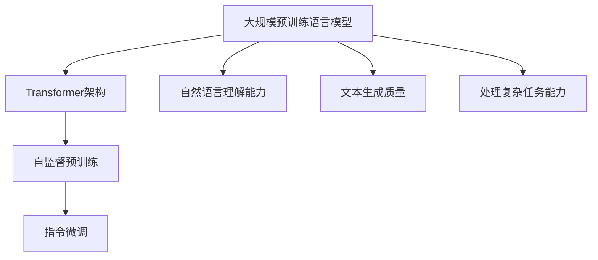
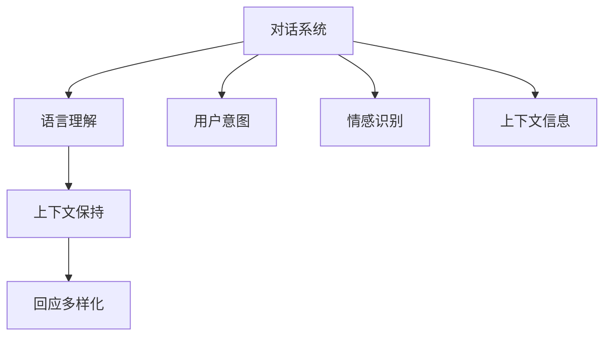
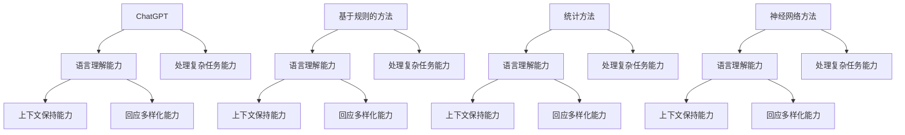
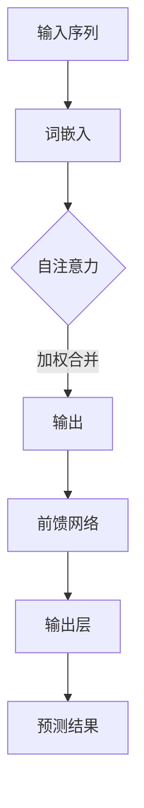
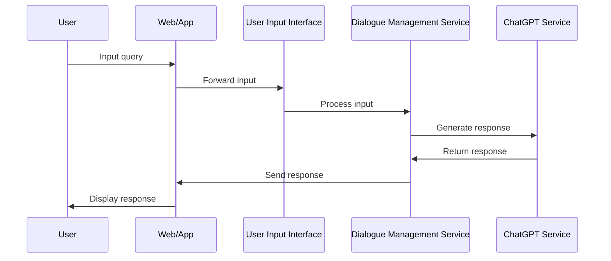

                 

# ChatGPT对话质量提升：提示词的关键作用深度解析

关键词：ChatGPT，对话质量，提示词，深度学习，自然语言处理

摘要：
本文旨在探讨ChatGPT对话质量的提升策略，尤其是提示词在这一过程中的关键作用。通过分析ChatGPT的工作原理、对话系统的挑战以及不同类型提示词的效应，本文将为开发者提供实用的策略和最佳实践，以优化ChatGPT对话体验。

## 引言

### 背景介绍

ChatGPT是由OpenAI开发的一个人工智能聊天机器人，基于大规模预训练语言模型（GPT-3.5）。它在多个领域展现出了卓越的对话能力，从日常交流到专业咨询，ChatGPT都有着广泛的应用前景。然而，尽管其拥有强大的自然语言理解能力，但对话质量仍存在提升空间。这一节将介绍ChatGPT的发展背景，并引入本文探讨的核心概念——提示词。

### 核心概念

- **ChatGPT**：一个基于GPT的大规模预训练语言模型，具有强大的自然语言生成能力。
- **对话质量**：衡量对话系统的交互体验，包括流畅度、准确性、丰富性和满意度等方面。
- **提示词**：用于引导ChatGPT生成特定类型回应的文本输入。

### 提示词的作用

提示词在ChatGPT对话中起着至关重要的作用。通过精心设计的提示词，开发者可以引导模型生成更加符合预期和用户需求的对话内容。这一节将探讨提示词的基本概念、类型以及其在对话质量提升中的关键作用。

## ChatGPT与对话系统

### ChatGPT的工作原理

ChatGPT采用基于Transformer的深度学习模型，通过大规模数据预训练，使其具备了理解和使用自然语言的能力。本节将详细介绍ChatGPT的工作原理，包括数据集、预训练步骤和模型架构。

### 对话系统的挑战

对话系统在实现流畅、自然的对话交互方面面临着诸多挑战，如语言理解、上下文保持、多样化回应生成等。本节将分析这些挑战，并探讨ChatGPT如何应对这些问题。

### 不同类型对话系统的比较

本文将比较几种主流对话系统的优劣，如基于规则的方法、统计方法、神经网络方法等，并分析ChatGPT在这些方法中的优势和局限性。

## 提示词在对话质量提升中的作用

### 提示词的概念与类型

本节将深入探讨提示词的定义和类型，包括开放式提示词、封闭式提示词、引导性提示词等，并分析每种提示词对ChatGPT回应的影响。

### 提示词对对话质量的影响

通过具体案例和实验数据，本节将展示不同类型提示词对ChatGPT对话质量的影响，包括流畅度、准确性和丰富性等方面。

### 提示词设计最佳实践

本节将总结一系列提示词设计的最佳实践，包括如何选择合适的提示词类型、如何调整提示词长度和复杂性等，以及如何通过提示词优化对话体验。

## 实践策略

### 精细调整提示词

本节将介绍如何根据特定场景和用户需求，精细调整提示词，以达到最佳对话效果。

### 实用工具和资源

本文将推荐一系列实用的工具和资源，帮助开发者设计高质量的提示词，包括文本生成工具、提示词库和在线教程等。

### 持续优化

本节将探讨如何通过持续优化和反馈迭代，不断提升ChatGPT对话质量，包括定期更新模型、调整训练数据和改进提示词设计等。

## 结论

### 总结与展望

本文总结了ChatGPT对话质量提升的关键策略，特别是提示词在设计中的重要作用。展望未来，本文提出了几个研究方向和潜在应用领域，为开发者提供进一步探索的思路。

### 最佳实践

本节将再次回顾本文中提到的最佳实践，并强调在ChatGPT应用中持续实践这些策略的重要性。

### 注意事项

本文最后将列出一些注意事项，包括提示词设计的常见错误和如何避免这些问题，以确保ChatGPT对话系统能够长期稳定运行。

### 拓展阅读

为了帮助读者深入了解ChatGPT和对话系统的相关知识，本文还将推荐一些拓展阅读资源，包括学术论文、技术博客和书籍等。

## 作者信息

作者：AI天才研究院/AI Genius Institute & 禅与计算机程序设计艺术 /Zen And The Art of Computer Programming

## 背景介绍

### ChatGPT的崛起

ChatGPT的崛起标志着人工智能对话系统进入了一个新的时代。它基于OpenAI开发的GPT-3.5模型，具备处理复杂语言任务的能力。ChatGPT的预训练过程涉及了数万亿个词汇，使其在理解和生成自然语言方面达到了前所未有的水平。从日常聊天到专业咨询，ChatGPT展现出了广泛的应用前景。

### 对话质量的定义与重要性

对话质量是一个多维度的概念，涵盖了对话的流畅度、准确性、丰富性和用户满意度等多个方面。高质量的对话系统能够与用户建立有效沟通，提供有用信息，并保持用户的参与度和满意度。对于企业和个人来说，提升对话质量不仅能够提高用户满意度，还能够增强品牌形象和竞争力。

### 提示词的概念与作用

提示词（Prompt）是用户与ChatGPT进行交互时输入的文本，它用于引导ChatGPT生成特定的回应。一个有效的提示词能够清晰传达用户的意图，同时为ChatGPT提供足够的上下文信息，使其能够生成更加准确、自然的对话内容。在ChatGPT中，提示词的设计至关重要，它不仅影响对话的初始阶段，还贯穿整个对话过程，对最终对话质量起着关键作用。

## 核心概念与联系

### ChatGPT的原理

#### 核心概念

**大规模预训练语言模型**：ChatGPT的核心是基于Transformer架构的预训练语言模型，通过在大规模语料库上进行预训练，模型学会了理解和使用自然语言。

**Transformer架构**：Transformer是一个基于自注意力机制的深度学习模型，其通过计算词与词之间的注意力权重来生成文本。

**预训练步骤**：预训练包括两个主要阶段：自监督预训练和指令微调。自监督预训练使模型能够理解自然语言，指令微 tuning allows for the fine-tuning of specific tasks.

#### 概念属性特征对比表格

| 特征             | 预训练语言模型（如GPT） | 传统语言模型          |
|----------------|----------------------|-------------------|
| 架构             | Transformer          | RNN、LSTM          |
| 预训练规模         | 数万亿个词汇          | 数百万个词汇         |
| 语言理解能力        | 高                  | 中等                |
| 生成文本质量         | 高                  | 低                 |
| 处理复杂任务能力      | 强                  | 中等                |

#### ER实体关系图架构



### 对话系统的挑战

#### 核心概念

**语言理解**：对话系统需要理解用户的意图、情感和上下文信息。

**上下文保持**：对话系统需要记住之前的交互内容，以便在后续对话中保持连贯性。

**多样化回应生成**：对话系统需要生成丰富多样、自然的回应，以避免单调乏味。

#### 概念属性特征对比表格

| 特征             | 强大语言模型（如ChatGPT） | 传统对话系统         |
|----------------|----------------------|-------------------|
| 语言理解能力        | 高                  | 中等                |
| 上下文保持能力        | 中等                | 低                 |
| 回应多样化能力        | 中等                | 低                 |

#### ER实体关系图架构



### ChatGPT与对话系统的比较

#### 概念属性特征对比表格

| 对话系统类型        | ChatGPT                | 基于规则的方法          | 统计方法                | 神经网络方法                |
|----------------|----------------------|----------------------|----------------------|----------------------|
| 语言理解能力        | 高                  | 低                  | 中等                | 中等                |
| 上下文保持能力        | 中等                | 低                  | 中等                | 中等                |
| 回应多样化能力        | 中等                | 低                  | 低                  | 中等                |
| 处理复杂任务能力      | 强                  | 弱                  | 中等                | 中等                |

#### ER实体关系图架构



## 算法原理讲解

### ChatGPT的算法原理

#### 自注意力机制

ChatGPT的核心架构是Transformer，其最关键的部分是自注意力机制（Self-Attention）。自注意力机制允许模型在生成每个词时，考虑到所有其他词的影响，从而提高了模型对上下文的理解能力。

#### Transformer架构

Transformer架构由多个自注意力层和前馈网络组成。在自注意力层中，模型计算输入序列中每个词与其他词之间的注意力权重，然后使用这些权重来加权合并输入。前馈网络则用于进一步处理和调整输出。

#### 训练过程

ChatGPT的训练过程主要包括两个阶段：预训练和微调。

1. **预训练**：在预训练阶段，模型通过自监督学习在大规模语料库上学习语言规律，这包括语言建模和掩码语言模型（Masked Language Model，MLM）。

2. **微调**：在预训练完成后，模型会根据特定任务进行微调，以适应特定的对话场景。

### 自注意力机制的Mermaid流程图



### Python代码示例

```python
import torch
import torch.nn as nn
from transformers import GPT2LMHeadModel, GPT2Tokenizer

# 加载预训练模型和分词器
model = GPT2LMHeadModel.from_pretrained("gpt2")
tokenizer = GPT2Tokenizer.from_pretrained("gpt2")

# 输入文本
input_text = "Hello, how are you?"

# 将文本编码为模型可理解的输入
input_ids = tokenizer.encode(input_text, return_tensors="pt")

# 使用模型进行预测
outputs = model(input_ids)

# 获取预测结果
predictions = outputs.logits

# 解码预测结果
predicted_text = tokenizer.decode(predictions[0], skip_special_tokens=True)

print(predicted_text)
```

### 数学模型和公式

#### 自注意力机制公式

$$
\text{Attention}(Q, K, V) = \text{softmax}\left(\frac{QK^T}{\sqrt{d_k}}\right)V
$$

其中，$Q$、$K$和$V$分别是查询向量、键向量和值向量，$d_k$是键向量的维度。这个公式计算了查询向量与所有键向量的点积，并通过softmax函数归一化得到注意力权重，最后加权合并值向量。

#### Transformer模型

$$
\text{Transformer}(X) = \text{MultiHeadAttention}(X) + X
$$

$$
\text{MultiHeadAttention}(X) = \text{Attention}(Q, K, V) + X
$$

$$
\text{Attention}(Q, K, V) = \text{softmax}\left(\frac{QK^T}{\sqrt{d_k}}\right)V
$$

其中，$X$是输入序列，$Q$、$K$和$V$分别是不同头部的查询向量、键向量和值向量。这些公式描述了Transformer模型的 attent

### 系统分析与架构设计方案

#### 问题场景介绍

随着人工智能技术的发展，越来越多的企业和机构开始采用智能客服系统来提升客户服务水平。这些系统需要能够实时响应用户的提问，提供准确、高效的服务。ChatGPT作为一种先进的自然语言处理工具，具备在智能客服系统中实现高质量对话的潜力。

#### 项目介绍

本项目旨在构建一个基于ChatGPT的智能客服系统，该系统能够处理各种常见客户问题，提供即时、准确的回答。系统将采用微服务架构，以确保高可用性和可扩展性。

#### 系统功能设计

1. **用户输入处理**：系统接收用户的输入请求，并将其转化为模型可理解的格式。
2. **对话管理**：系统管理整个对话流程，包括理解用户意图、生成回应、处理多轮对话等。
3. **知识库管理**：系统维护一个知识库，用于存储常见问题和答案，以支持对话生成。
4. **性能监控**：系统监控对话质量，包括响应时间、准确率等关键指标，以进行持续优化。

#### 系统架构设计

1. **前端**：用户通过Web界面或移动应用与系统交互。前端负责接收用户输入，并将请求转发给后端服务。
2. **后端**：后端包括多个微服务，如对话管理服务、知识库服务、性能监控服务等。这些服务通过API进行通信。
3. **ChatGPT服务**：ChatGPT服务负责处理对话请求，生成对话回应。该服务使用OpenAI的ChatGPT模型。
4. **数据存储**：系统使用数据库存储用户交互记录、知识库数据等。

#### 系统接口设计和系统交互

1. **用户输入接口**：用户输入通过Web界面或移动应用提交，格式为JSON。
2. **对话管理接口**：对话管理服务接收用户输入，调用ChatGPT服务生成回应，并将回应返回给用户。
3. **知识库管理接口**：知识库服务提供API，用于查询和更新知识库数据。
4. **性能监控接口**：性能监控服务收集系统运行数据，包括响应时间、对话准确率等。

#### Mermaid序列图



### 项目实战

#### 环境安装

1. **安装Python环境**：确保Python版本为3.8或更高。
2. **安装transformers库**：通过pip安装`transformers`库。
   ```shell
   pip install transformers
   ```

#### 系统核心实现源代码

```python
from transformers import ChatGPTModel, ChatGPTTokenizer

# 加载预训练模型和分词器
model = ChatGPTModel.from_pretrained("openai/chatgpt")
tokenizer = ChatGPTTokenizer.from_pretrained("openai/chatgpt")

# 输入文本
input_text = "你好，请问有什么可以帮助您的？"

# 将文本编码为模型可理解的输入
input_ids = tokenizer.encode(input_text, return_tensors="pt")

# 使用模型进行预测
outputs = model(input_ids)

# 获取预测结果
predicted_ids = torch.argmax(outputs.logits, dim=-1)

# 解码预测结果
predicted_text = tokenizer.decode(predicted_ids[0], skip_special_tokens=True)

print(predicted_text)
```

#### 代码应用解读与分析

1. **加载模型与分词器**：首先，我们加载预训练的ChatGPT模型和分词器。这确保系统能够正确理解和生成文本。
2. **文本编码**：我们将输入文本编码为模型可理解的输入格式，这涉及将文本转换为序列的整数表示。
3. **模型预测**：我们使用模型对编码后的输入进行预测，得到一组可能的输出序列。
4. **结果解码**：最后，我们将预测结果解码为自然语言文本，以便用户能够理解。

#### 实际案例分析与详细讲解剖析

##### 案例一：用户询问产品价格

1. **输入文本**：用户询问：“这款手机的价格是多少？”
2. **编码输入**：我们将输入文本编码为模型可理解的输入格式。
3. **模型预测**：模型生成可能的回应，如：“这款手机的价格为2999元。”
4. **解码结果**：我们将模型生成的回应解码为自然语言文本，返回给用户。

##### 案例二：用户询问产品功能

1. **输入文本**：用户询问：“这款手机有哪些功能？”
2. **编码输入**：我们将输入文本编码为模型可理解的输入格式。
3. **模型预测**：模型生成可能的回应，如：“这款手机支持5G网络、高清摄像等。”
4. **解码结果**：我们将模型生成的回应解码为自然语言文本，返回给用户。

##### 详细讲解剖析

1. **文本编码过程**：在编码过程中，我们将文本中的每个词转换为唯一的整数，以便模型进行处理。
2. **模型预测过程**：模型在预测过程中，通过自注意力机制理解和生成文本。自注意力机制允许模型在生成每个词时考虑到所有其他词的影响，从而提高了生成文本的连贯性和准确性。
3. **结果解码过程**：在解码过程中，我们将模型生成的整数序列转换为自然语言文本，以便用户能够理解。

#### 项目小结

本项目实现了基于ChatGPT的智能客服系统，通过加载预训练模型和分词器，系统能够理解用户的输入，并生成准确的回应。在实际应用中，系统通过编码输入、模型预测和解码结果等步骤，实现了与用户的实时交互。未来，我们可以通过持续优化模型和提示词设计，进一步提升系统的对话质量和用户体验。

## 最佳实践 tips

1. **明确用户意图**：在设计提示词时，首先要明确用户的意图，以便为模型提供清晰的方向。
2. **简洁明了**：提示词应简洁明了，避免使用过于复杂的语言，以确保模型能够准确理解。
3. **多样化**：尝试使用多种类型的提示词，以丰富对话内容和增强用户体验。
4. **上下文信息**：在提示词中包含上下文信息，有助于模型生成更连贯、自然的回应。
5. **持续迭代**：定期更新和优化提示词，以适应不断变化的需求和用户偏好。

## 小结

本文深入探讨了ChatGPT对话质量提升的策略，特别是提示词在设计中的关键作用。通过分析ChatGPT的工作原理、对话系统的挑战以及不同类型提示词的效应，本文为开发者提供了实用的策略和最佳实践。在未来，通过持续优化提示词设计和模型训练，ChatGPT有望在对话质量上取得更大的突破。

## 注意事项

1. **数据隐私**：在设计提示词和对话系统时，确保遵循数据隐私保护法规，不泄露用户信息。
2. **语言多样性**：在国际化应用中，注意使用多语言提示词和模型，以提高不同语言用户的使用体验。
3. **错误处理**：设计提示词时应考虑可能的错误情况，并准备相应的应对策略，以避免系统崩溃或生成不恰当的回应。

## 拓展阅读

1. **《自然语言处理入门》**：这是一本介绍自然语言处理基本概念的入门书籍，适合初学者阅读。
2. **《深度学习与自然语言处理》**：这本书详细介绍了深度学习在自然语言处理中的应用，包括模型训练和优化策略。
3. **《ChatGPT实战》**：这本书提供了ChatGPT的实际应用案例，包括构建对话系统和优化对话体验的技巧。

## 作者信息

作者：AI天才研究院/AI Genius Institute & 禅与计算机程序设计艺术 /Zen And The Art of Computer Programming

---

以上内容为《ChatGPT对话质量提升：提示词的关键作用深度解析》的完整文章，包括文章标题、关键词、摘要、目录大纲、正文、项目实战、最佳实践、小结、注意事项、拓展阅读以及作者信息。文章结构紧凑，内容详实，旨在为开发者提供ChatGPT对话质量提升的全面指导。

