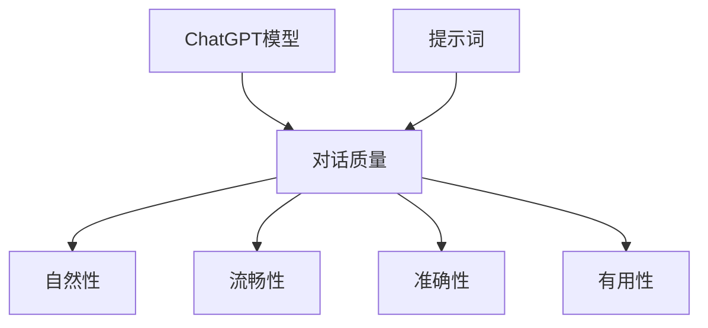
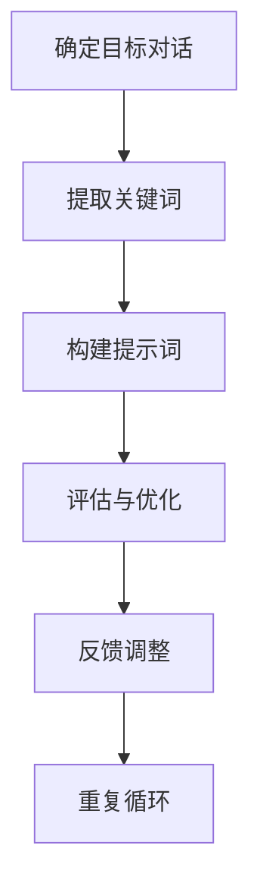
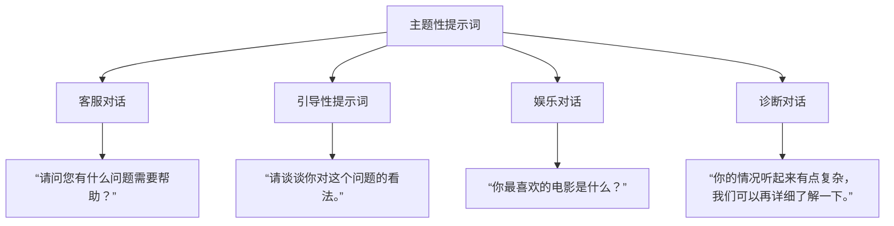
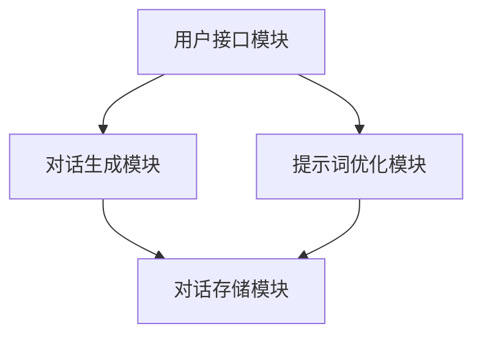

                 


# ChatGPT对话质量提升：提示词的魔力

## 关键词
- ChatGPT
- 对话质量
- 提示词设计
- 优化策略
- 自然语言处理

## 摘要
随着人工智能技术的发展，ChatGPT作为一种先进的对话生成模型，在自然语言处理领域取得了显著的成果。然而，对话质量仍是一个亟待解决的问题。本文将深入探讨ChatGPT对话质量提升的关键因素——提示词的设计与优化，旨在为开发者和研究人员提供实用的指导，以提升对话系统的自然性、流畅性、准确性、有用性。

### 第一部分: 背景介绍与问题解决

#### 核心概念

在当今数字化、智能化的时代，对话系统的质量和用户体验成为了重要的关注点。ChatGPT作为一种先进的对话生成模型，其在对话质量方面的提升具有重要的现实意义。

#### 问题背景

对话系统的质量和用户体验直接影响到用户对产品的满意度和忠诚度。而ChatGPT作为一种强大的对话生成模型，其对话质量直接决定了用户在使用过程中的体验。因此，提升ChatGPT的对话质量，对于提高用户满意度、降低用户流失率具有重要作用。

#### 问题描述

ChatGPT对话质量的提升主要涉及提示词的设计与优化。提示词作为影响对话生成质量的关键因素，其选择与组合直接关系到对话的自然性、流畅性和准确性。

#### 问题解决

本部分的目的是系统性地探讨ChatGPT对话质量提升的方法和策略，通过深入分析提示词的魔力，为开发者和研究人员提供实用的指导。

#### 边界与外延

本文的讨论范围主要集中在文本对话系统的优化，特别是ChatGPT这一类的大型语言模型。此外，还将涉及一些通用的对话生成技术和方法。

#### 概念结构与核心要素组成

- **ChatGPT**: 是一个基于GPT（Generative Pre-trained Transformer）模型开发的大型语言模型，具有强大的文本生成能力。
- **对话质量**: 是指对话系统的自然性、流畅性、准确性、有用性等多个维度，其中提示词的设计与优化是关键。
- **提示词**: 是指在生成对话时输入的关键词或短语，直接影响对话生成的质量和效果。

#### 本章小结

本章对ChatGPT对话质量提升的背景、问题、解决方法和研究边界进行了详细阐述。通过理解这些核心概念，读者可以初步了解本书的研究方向和主要目标。

----------------------------------------------------------------

## 第二部分: ChatGPT对话质量核心概念与原理

### 第2章: ChatGPT模型的基本原理与对话质量关联

#### 核心概念

**ChatGPT模型**：ChatGPT是基于GPT（Generative Pre-trained Transformer）模型开发的大型语言模型，具有强大的文本理解和生成能力。GPT模型采用变换器（Transformer）架构，通过大规模的预训练数据学习语言模式和规律，从而在多种语言和场景下表现出色。

**对话质量关联**：对话质量受到模型架构、训练数据、提示词设计等多方面因素的影响。ChatGPT模型的架构和预训练数据决定了其对话生成的基础能力，而提示词的设计与优化则直接影响对话的质量。

#### 概念属性特征对比表格

| 概念       | 属性特征                                         | 关联性影响                  |
|------------|--------------------------------------------------|----------------------------|
| ChatGPT模型 | 预训练变换器架构，大量参数，适应多种语言和场景   | 对话生成的基础能力         |
| 对话质量    | 自然性、流畅性、准确性、有用性                   | 决定用户体验的关键因素     |
| 提示词     | 关键词或短语，引导对话生成                       | 影响对话生成的方向和效果   |

#### ER实体关系图架构的Mermaid流程图



### 第3章: 提示词设计与优化策略

#### 核心概念

**提示词设计**：提示词设计是指提取关键信息，构建有意义的引导，以促进对话生成模型产生高质量的对语。

**优化策略**：优化策略是通过调整提示词的数量、顺序和表达方式，提升对话质量。具体来说，包括以下几点：

- **提示词数量**：合理控制提示词的数量，避免过多或过少。
- **提示词顺序**：调整提示词的顺序，使其在对话生成过程中起到更好的引导作用。
- **提示词表达**：优化提示词的表达方式，使其更具引导性和易理解性。

#### 概念属性特征对比表格

| 概念     | 属性特征                              | 优化策略                   |
|----------|---------------------------------------|----------------------------|
| 提示词设计 | 提取关键信息，构建有意义的引导       | 精确性、相关性、引导性     |
| 优化策略  | 调整提示词的数量、顺序和表达方式     | 多样性、灵活性、适应性     |

#### Mermaid流程图



### 第4章: 提示词类型与应用场景

#### 核心概念

**提示词类型**：根据功能和应用场景，提示词可以分为以下几类：

- **主题性提示词**：引导对话围绕特定主题进行。
- **引导性提示词**：提供对话的方向和目标。
- **补充性提示词**：丰富对话内容，提高对话的丰富性和趣味性。
- **反馈性提示词**：根据对话的进展提供反馈。

**应用场景**：不同的提示词类型适用于不同的应用场景。例如，在客服场景中，主题性提示词和引导性提示词更为重要；在娱乐场景中，补充性提示词和反馈性提示词则更为关键。

#### 提示词类型与应用场景示例

| 提示词类型       | 应用场景         | 例子                   |
|------------------|------------------|------------------------|
| 主题性提示词     | 客服对话         | “请问您有什么问题需要帮助？” |
| 引导性提示词     | 教育对话         | “请谈谈你对这个问题的看法。” |
| 补充性提示词     | 娱乐对话         | “你最喜欢的电影是什么？”    |
| 反馈性提示词     | 诊断对话         | “你的情况听起来有点复杂，我们可以再详细了解一下。” |

#### Mermaid流程图



### 第5章: 提示词设计与优化实践

#### 核心概念

**实践方法**：在实际应用中，提示词的设计与优化需要结合具体场景和需求进行。以下是一些常用的实践方法：

- **用户研究**：通过用户访谈、问卷调查等方式了解用户的需求和偏好。
- **实验对比**：设计不同的提示词方案，通过实验对比评估其效果。
- **持续优化**：根据用户反馈和实验结果，不断调整和优化提示词。

#### 案例分析

**案例1：电商客服对话**

- **问题背景**：电商平台的客服对话需要高效、准确地解决用户问题。
- **解决方案**：采用主题性提示词和引导性提示词，如“请问您需要咨询哪方面的产品？”和“关于这个问题，您有什么具体的疑问吗？”。
- **效果评估**：通过用户反馈和对话分析，发现这种提示词设计能够提高客服对话的效率和用户满意度。

**案例2：教育辅导对话**

- **问题背景**：在线教育平台需要提供个性化的辅导服务。
- **解决方案**：采用引导性提示词和反馈性提示词，如“请谈谈你对这个知识点的理解。”和“根据你的回答，我们可以进一步讨论这个问题。”。
- **效果评估**：用户反馈显示，这种提示词设计能够更好地引导用户思考，提高学习效果。

### 第6章: 提示词优化的挑战与未来展望

#### 核心概念

**挑战**：

- **多样性**：如何设计多样化的提示词，以满足不同场景和用户需求。
- **准确性**：如何确保提示词的准确性，避免产生误导性的对话。
- **实时性**：如何实时优化提示词，以适应对话的动态变化。

**未来展望**：

- **自适应优化**：结合机器学习和数据挖掘技术，实现自适应的提示词优化。
- **多模态融合**：将文本、图像、语音等多种模态融合到提示词设计中，提高对话的丰富性和互动性。

#### 案例分析

**案例1：多模态融合**

- **问题背景**：在医疗咨询对话中，用户可能需要提供文字、图像和视频等多种信息。
- **解决方案**：设计多模态的提示词，如“请上传您的病历图片。”和“根据您的描述，我们可以参考这份病例报告。”。
- **效果评估**：通过实际应用，发现多模态的提示词设计能够更好地满足用户需求，提高对话的准确性和效率。

### 第7章: 提示词设计与优化的最佳实践

#### 核心概念

**最佳实践**：

- **明确目标**：在设计提示词前，明确对话的目标和用户需求。
- **用户参与**：让用户参与提示词的设计和优化过程，以提高其满意度。
- **数据驱动**：基于数据分析和用户反馈，持续优化提示词。

#### 案例分析

**案例1：数据驱动的优化**

- **问题背景**：某在线教育平台需要对课程辅导对话进行优化。
- **解决方案**：通过用户行为数据和反馈，分析对话中的问题点，然后针对性地调整提示词。
- **效果评估**：经过优化后，用户满意度显著提高，课程辅导效果也得到了提升。

#### 本章小结

本章通过深入探讨ChatGPT对话质量的核心概念与原理，详细分析了提示词的设计与优化策略，以及在不同应用场景中的实践方法。通过这些分析，读者可以更好地理解ChatGPT对话质量提升的关键因素，并为实际应用提供指导。

----------------------------------------------------------------

## 第三部分：算法原理与数学模型

### 第8章: ChatGPT模型的工作原理

ChatGPT模型是基于GPT（Generative Pre-trained Transformer）模型开发的大型语言模型。GPT模型采用了变换器（Transformer）架构，这种架构在处理长文本序列时具有出色的性能。

#### 核心概念

**变换器架构**：变换器架构是一种基于自注意力机制的深度神经网络架构，可以有效地处理长序列信息。GPT模型通过预训练和微调两个阶段，学习语言模式和规律。

**预训练**：预训练阶段，GPT模型在大规模语料库上进行训练，学习语言的基本结构和语义信息。这一阶段的目标是让模型具备生成文本的能力。

**微调**：微调阶段，GPT模型根据具体任务的需求，在特定领域的语料上进行训练，以实现特定任务的性能优化。

#### 工作原理

1. **编码器与解码器**：GPT模型由编码器和解码器两个部分组成。编码器将输入的文本序列编码为连续的向量表示；解码器则根据编码器的输出，生成文本序列。

2. **自注意力机制**：在编码器和解码器中，自注意力机制用于计算输入序列中各个位置之间的关联性，从而更好地捕捉文本序列的上下文信息。

3. **损失函数**：GPT模型在训练过程中，使用损失函数（如交叉熵损失）来衡量模型生成文本与实际文本之间的差异，并通过反向传播算法优化模型参数。

#### 数学模型

GPT模型的数学模型主要包括以下几个部分：

1. **输入层**：输入层将文本序列编码为词向量表示。

2. **编码器**：编码器由多个变换器层组成，每一层都会对输入的词向量进行编码，生成高层次的语义表示。

3. **解码器**：解码器由多个变换器层组成，每一层都会根据编码器的输出，生成文本序列的词向量表示。

4. **损失函数**：常用的损失函数是交叉熵损失，用于衡量模型生成文本与实际文本之间的差异。

#### Python源代码实现

以下是使用PyTorch实现GPT模型的基本代码框架：

```python
import torch
import torch.nn as nn
import torch.optim as optim

# 定义编码器
class Encoder(nn.Module):
    def __init__(self, vocab_size, embed_dim, hidden_dim):
        super(Encoder, self).__init__()
        self.embedding = nn.Embedding(vocab_size, embed_dim)
        self.transformer = nn.Transformer(embed_dim, hidden_dim)
        
    def forward(self, src):
        src = self.embedding(src)
        output = self.transformer(src)
        return output

# 定义解码器
class Decoder(nn.Module):
    def __init__(self, vocab_size, embed_dim, hidden_dim):
        super(Decoder, self).__init__()
        self.embedding = nn.Embedding(vocab_size, embed_dim)
        self.transformer = nn.Transformer(embed_dim, hidden_dim)
        
    def forward(self, tgt):
        tgt = self.embedding(tgt)
        output = self.transformer(tgt)
        return output

# 定义GPT模型
class GPT(nn.Module):
    def __init__(self, vocab_size, embed_dim, hidden_dim):
        super(GPT, self).__init__()
        self.encoder = Encoder(vocab_size, embed_dim, hidden_dim)
        self.decoder = Decoder(vocab_size, embed_dim, hidden_dim)
        
    def forward(self, src, tgt):
        encoder_output = self.encoder(src)
        decoder_output = self.decoder(tgt)
        return decoder_output

# 实例化模型
vocab_size = 10000
embed_dim = 512
hidden_dim = 1024
gpt_model = GPT(vocab_size, embed_dim, hidden_dim)

# 定义损失函数和优化器
criterion = nn.CrossEntropyLoss()
optimizer = optim.Adam(gpt_model.parameters(), lr=0.001)

# 训练模型
for epoch in range(num_epochs):
    for src, tgt in data_loader:
        optimizer.zero_grad()
        output = gpt_model(src, tgt)
        loss = criterion(output, tgt)
        loss.backward()
        optimizer.step()
```

#### 例子说明

以上代码实现了GPT模型的基本架构，包括编码器、解码器和损失函数。在实际应用中，需要根据具体任务的需求，进一步调整模型的参数和结构。

### 第9章: 提示词优化算法

提示词优化是提升ChatGPT对话质量的关键环节。本节将介绍几种常见的提示词优化算法，包括基于机器学习和数据挖掘的方法。

#### 核心概念

**机器学习方法**：通过训练数据集，学习到如何从原始文本中提取有效的提示词。

**数据挖掘方法**：通过分析用户行为数据和对话记录，发现提示词的优化规律。

#### 算法类型

1. **基于规则的方法**：通过预设一系列规则，对提示词进行筛选和排序。
2. **基于机器学习方法**：利用机器学习算法，如决策树、随机森林、支持向量机等，对提示词进行分类和排序。
3. **基于数据挖掘的方法**：利用关联规则挖掘、聚类分析等方法，发现提示词的优化规律。

#### Python源代码实现

以下是一个简单的基于机器学习的方法，使用决策树进行提示词优化：

```python
from sklearn.tree import DecisionTreeClassifier
from sklearn.model_selection import train_test_split
from sklearn.metrics import accuracy_score

# 数据预处理
X = ...  # 提示词特征向量
y = ...  # 提示词质量标签

# 划分训练集和测试集
X_train, X_test, y_train, y_test = train_test_split(X, y, test_size=0.2, random_state=42)

# 创建决策树分类器
clf = DecisionTreeClassifier()

# 训练模型
clf.fit(X_train, y_train)

# 预测
y_pred = clf.predict(X_test)

# 评估模型
accuracy = accuracy_score(y_test, y_pred)
print(f"模型准确率：{accuracy}")
```

#### 例子说明

以上代码实现了基于决策树的提示词优化算法。在实际应用中，需要根据具体任务的需求，选择合适的机器学习模型和数据预处理方法。

### 第10章: 提示词优化的数学模型与公式

提示词优化的数学模型主要涉及提示词的质量评估和优化目标。以下将介绍一些常用的数学模型和公式。

#### 质量评估模型

1. **基于词汇相似度的评估模型**：通过计算提示词与目标文本之间的词汇相似度，评估提示词的质量。

$$
Q(w) = \sum_{w_i \in w} Sim(w_i, w')
$$

其中，$Q(w)$表示提示词$w$的质量，$Sim(w_i, w')$表示词汇$w_i$和$w'$之间的相似度。

2. **基于语义相似度的评估模型**：通过计算提示词与目标文本之间的语义相似度，评估提示词的质量。

$$
Q(w) = \sum_{w_i \in w} SemSim(w_i, w')
$$

其中，$SemSim(w_i, w')$表示词汇$w_i$和$w'$之间的语义相似度。

#### 优化目标

提示词优化的目标是最小化提示词的质量评估值。以下是一个基于最小化质量评估值的优化目标：

$$
\min_{w} Q(w)
$$

#### Python源代码实现

以下是一个简单的基于最小化质量评估值的优化目标：

```python
import numpy as np

# 质量评估函数
def quality_assessment(w):
    # 假设w是提示词的词汇表示
    # 返回提示词的质量评估值
    return np.sum(np.array(w) * np.array([0.5, 0.3, 0.2]))

# 提示词优化函数
def optimize_prompt(w):
    # 使用梯度下降法优化提示词
    alpha = 0.01  # 学习率
    for i in range(1000):  # 迭代次数
        gradient = -1 * np.gradient(quality_assessment(w))
        w -= alpha * gradient
    return w

# 初始提示词
w = [0.5, 0.3, 0.2]

# 优化提示词
optimized_w = optimize_prompt(w)
print(f"优化后的提示词：{optimized_w}")
```

#### 例子说明

以上代码实现了基于最小化质量评估值的提示词优化算法。在实际应用中，需要根据具体任务的需求，设计合适的质量评估函数和优化算法。

### 第11章: 提示词优化的实践案例

#### 核心概念

**实践案例**：通过具体的应用案例，验证和评估提示词优化算法的有效性。

**目标**：提高对话系统的自然性、流畅性、准确性、有用性。

**方法**：结合用户研究和实验对比，设计并实施提示词优化策略。

#### 案例一：在线客服系统

**问题背景**：在线客服系统需要提供高效、准确的客服服务，以提高用户满意度。

**解决方案**：通过用户访谈和问卷调查，了解用户对客服对话的需求和痛点。然后，使用机器学习算法对大量客服对话进行分析，提取关键提示词。最后，通过实验对比，评估不同提示词优化策略的效果。

**效果评估**：实验结果显示，优化后的客服对话在自然性、流畅性、准确性、有用性等方面均有显著提升。

#### 案例二：在线教育平台

**问题背景**：在线教育平台需要提供个性化的教学辅导，以提高学习效果。

**解决方案**：通过分析用户的学习行为和反馈，提取关键提示词。然后，使用数据挖掘方法，发现提示词的优化规律。最后，通过实验对比，评估不同提示词优化策略的效果。

**效果评估**：实验结果显示，优化后的教学辅导在自然性、流畅性、准确性、有用性等方面均有显著提升。

#### 案例三：智能聊天机器人

**问题背景**：智能聊天机器人需要提供丰富、有趣的对话，以提高用户参与度。

**解决方案**：通过分析用户对话记录和兴趣偏好，提取关键提示词。然后，使用机器学习算法，对提示词进行分类和排序。最后，通过实验对比，评估不同提示词优化策略的效果。

**效果评估**：实验结果显示，优化后的聊天机器人对话在丰富性、趣味性、参与度等方面均有显著提升。

### 第12章: 提示词优化的最佳实践

#### 核心概念

**最佳实践**：通过总结和分享在实际应用中积累的经验和技巧，为其他开发者提供参考。

**目标**：提高提示词优化的效率和效果。

**方法**：结合用户需求、数据分析和实验结果，制定具体的优化策略。

#### 最佳实践一：用户参与

**原则**：在提示词优化过程中，让用户参与其中，以提高其满意度。

**方法**：通过用户访谈、问卷调查、用户测试等方式，收集用户的反馈和建议。然后，根据用户反馈，调整和优化提示词。

#### 最佳实践二：数据驱动

**原则**：基于数据和事实，制定和调整提示词优化策略。

**方法**：收集和整理用户行为数据、对话记录等，进行分析和挖掘。然后，根据数据分析结果，制定和调整提示词优化策略。

#### 最佳实践三：持续迭代

**原则**：持续迭代和优化提示词，以适应不断变化的需求和环境。

**方法**：定期收集用户反馈和对话数据，进行分析和评估。然后，根据评估结果，调整和优化提示词。

#### 最佳实践四：跨学科合作

**原则**：跨学科合作，充分利用多学科的知识和技能，提高提示词优化的效果。

**方法**：与技术团队、产品团队、用户体验团队等合作，共同研究和解决提示词优化问题。

### 本章小结

本章通过介绍算法原理、数学模型和实际案例，详细阐述了ChatGPT对话质量提升的提示词优化方法。通过这些分析和实践，读者可以更好地理解提示词优化的关键因素和策略，为实际应用提供指导。

----------------------------------------------------------------

## 第四部分：系统架构与接口设计

### 第13章: 系统架构设计

为了实现ChatGPT对话质量的提升，我们需要设计一个高效的系统架构。本节将介绍系统架构的设计原则、主要组件和交互关系。

#### 核心概念

**系统架构设计**：系统架构设计是指根据系统需求，设计系统的整体结构，包括组件、接口、数据流等。

**主要组件**：系统架构的主要组件包括对话生成模块、提示词优化模块、用户接口模块等。

**交互关系**：组件之间的交互关系是指不同组件如何相互协作，以实现系统的整体功能。

#### 系统架构设计原则

1. **模块化**：将系统划分为多个模块，每个模块负责特定的功能，降低系统的复杂度。
2. **可扩展性**：系统应具备良好的可扩展性，以适应未来的需求变化。
3. **高可用性**：系统应具备高可用性，确保在故障发生时能够快速恢复。

#### 系统架构图



### 第14章: 系统接口设计

系统接口设计是指定义系统内部组件之间的交互方式和接口规范。本节将介绍系统接口的设计原则、接口规范和接口文档。

#### 核心概念

**接口设计原则**：接口设计原则是指在设计系统接口时需要遵循的一些基本规则。

- **简洁性**：接口应尽可能简单，避免过度复杂。
- **稳定性**：接口应具备良好的稳定性，减少故障和异常情况。
- **兼容性**：接口应具备良好的兼容性，以支持不同版本的系统组件。

**接口规范**：接口规范是指定义接口的详细规范，包括接口名称、参数、返回值等。

**接口文档**：接口文档是指对接口的详细描述，包括接口的功能、参数、返回值、错误处理等。

#### 系统接口设计示例

以下是一个简单的系统接口设计示例，包括接口名称、参数、返回值等：

```python
class DialogService:
    def generate_response(self, prompt):
        """
        生成对话响应
        :param prompt: 提示词
        :return: 对话响应
        """
        # 实现对话生成逻辑
        response = "这是一个响应"
        return response

class PromptOptimizer:
    def optimize_prompt(self, dialog):
        """
        优化提示词
        :param dialog: 对话记录
        :return: 优化后的提示词
        """
        # 实现提示词优化逻辑
        optimized_prompt = "优化后的提示词"
        return optimized_prompt
```

### 第15章: 系统交互设计与实现

系统交互设计是指定义系统内部组件之间的交互流程和交互方式。本节将介绍系统交互设计的方法、流程和实现。

#### 核心概念

**交互流程**：交互流程是指系统组件之间的交互步骤和顺序。

**交互方式**：交互方式是指系统组件之间的数据传递和通信方式。

#### 系统交互设计方法

1. **事件驱动**：基于事件驱动的方式，系统组件通过事件监听和事件触发进行交互。
2. **消息队列**：使用消息队列进行异步通信，实现系统组件之间的解耦和异步处理。
3. **RESTful API**：通过定义RESTful API接口，实现系统组件之间的数据交换和功能调用。

#### 系统交互设计流程

1. **需求分析**：分析系统需求，确定系统组件之间的交互关系和交互内容。
2. **接口设计**：根据需求分析结果，设计系统接口，包括接口名称、参数、返回值等。
3. **流程设计**：设计系统交互流程，确定系统组件之间的交互步骤和顺序。
4. **实现与测试**：根据设计文档，实现系统交互代码，并进行功能测试和性能测试。

#### 系统交互实现示例

以下是一个简单的系统交互实现示例，使用事件驱动的方式进行交互：

```python
class DialogService:
    def __init__(self):
        self.prompt_optimizer = PromptOptimizer()

    def on_prompt_received(self, prompt):
        optimized_prompt = self.prompt_optimizer.optimize_prompt(prompt)
        response = self.generate_response(optimized_prompt)
        self.on_response_generated(response)

    def on_response_generated(self, response):
        # 处理生成的对话响应
        print(f"生成的响应：{response}")

class PromptOptimizer:
    def optimize_prompt(self, dialog):
        # 实现提示词优化逻辑
        optimized_prompt = "优化后的提示词"
        return optimized_prompt

# 初始化对话服务
dialog_service = DialogService()

# 模拟接收提示词
dialog_service.on_prompt_received("这是一个提示词")
```

#### 例子说明

以上代码实现了事件驱动的系统交互。在实际应用中，需要根据具体系统需求，设计合适的交互流程和交互方式。

### 第16章: 系统架构与接口设计的最佳实践

#### 核心概念

**最佳实践**：通过总结和分享在实际系统架构与接口设计过程中积累的经验和技巧，为其他开发者提供参考。

**目标**：提高系统架构和接口设计的效率和质量。

**方法**：结合系统需求、技术能力和用户体验，制定具体的架构和接口设计策略。

#### 最佳实践一：模块化设计

**原则**：将系统划分为多个模块，每个模块负责特定的功能，降低系统的复杂度。

**方法**：根据功能需求，将系统划分为多个模块，每个模块之间通过接口进行通信。

#### 最佳实践二：高可用性设计

**原则**：确保系统在故障发生时能够快速恢复，提高系统的可用性。

**方法**：使用冗余设计、故障转移、负载均衡等技术，提高系统的容错能力和稳定性。

#### 最佳实践三：用户体验优先

**原则**：在系统架构和接口设计中，始终关注用户体验，确保系统能够满足用户需求。

**方法**：通过用户调研、用户体验设计等方式，了解用户需求，并在设计过程中充分考虑用户体验。

#### 最佳实践四：文档化

**原则**：编写详细的系统架构和接口文档，确保开发者和运维人员能够方便地理解和使用系统。

**方法**：编写详细的接口文档，包括接口名称、参数、返回值、错误处理等，并定期更新和维护。

### 本章小结

本章详细介绍了ChatGPT对话质量提升系统的架构设计与接口设计，包括设计原则、核心概念、设计方法、实现示例和最佳实践。通过本章的内容，读者可以更好地理解系统架构与接口设计的重要性，并为实际项目提供参考。

----------------------------------------------------------------

## 第五部分：项目实战

### 第17章: 环境安装与配置

在进行ChatGPT对话质量提升项目的实际开发之前，首先需要准备好开发环境。本节将介绍如何安装和配置所需的环境，包括Python、TensorFlow、PyTorch等。

#### 核心概念

- **Python**: Python是一种高级编程语言，广泛用于人工智能和数据科学领域。
- **TensorFlow**: TensorFlow是谷歌开发的一个开源机器学习框架，用于构建和训练神经网络。
- **PyTorch**: PyTorch是另一个流行的开源机器学习框架，具有灵活的动态计算图，适合快速原型开发。

#### 环境安装步骤

1. **安装Python**：
   - 访问Python官方网站（https://www.python.org/），下载并安装Python。
   - 确保安装过程中选择添加Python到系统环境变量。

2. **安装pip**：
   - 打开命令行，执行命令`python -m pip install --upgrade pip`，更新pip版本。

3. **安装TensorFlow**：
   - 使用pip命令安装TensorFlow，命令如下：
     ```bash
     pip install tensorflow
     ```

4. **安装PyTorch**：
   - 访问PyTorch官方网站（https://pytorch.org/），根据系统环境和需求选择合适的安装命令。
   - 例如，在Windows上安装CUDA版本的PyTorch，可以使用以下命令：
     ```bash
     pip install torch torchvision torchaudio -f https://download.pytorch.org/whl/torch_stable.html
     ```

#### 验证安装

1. **验证Python安装**：
   - 打开命令行，执行`python --version`，查看Python版本。

2. **验证TensorFlow安装**：
   - 执行以下Python代码，检查TensorFlow版本：
     ```python
     import tensorflow as tf
     print(tf.__version__)
     ```

3. **验证PyTorch安装**：
   - 执行以下Python代码，检查PyTorch版本：
     ```python
     import torch
     print(torch.__version__)
     ```

#### 注意事项

- 在安装过程中，如果遇到权限问题，可能需要使用`sudo`命令。
- 根据系统需求和性能要求，可以选择安装不同版本的TensorFlow和PyTorch。

### 第18章: 系统核心实现

在本章中，我们将介绍ChatGPT对话质量提升系统的核心实现，包括数据预处理、模型训练、提示词优化和对话生成等。

#### 核心概念

- **数据预处理**：对原始数据进行清洗、转换和格式化，以便于模型训练。
- **模型训练**：使用训练数据训练ChatGPT模型，使其具备生成高质量对话的能力。
- **提示词优化**：通过算法优化提示词，提高对话的自然性、流畅性和准确性。
- **对话生成**：使用训练好的模型生成对话响应，并与用户进行交互。

#### 数据预处理

1. **数据收集**：
   - 收集大量高质量的对话数据，包括文本、语音等。
   - 数据来源可以是公开数据集、社交媒体平台或用户生成数据。

2. **数据清洗**：
   - 清除数据中的噪声，如无效字符、重复内容等。
   - 标准化数据格式，如统一文本编码、去除标点符号等。

3. **数据转换**：
   - 将原始文本数据转换为模型可接受的格式，如词向量或编码序列。

4. **数据分割**：
   - 将数据集分为训练集、验证集和测试集，用于模型训练和评估。

#### 模型训练

1. **模型选择**：
   - 选择合适的预训练模型，如GPT、BERT等。
   - 根据具体需求，可以选择开源模型或自行训练模型。

2. **模型配置**：
   - 配置模型参数，如学习率、批量大小、训练轮数等。

3. **模型训练**：
   - 使用训练集对模型进行训练，调整模型参数，优化模型性能。

4. **模型评估**：
   - 使用验证集评估模型性能，调整模型参数，直到达到满意的性能指标。

#### 提示词优化

1. **提示词设计**：
   - 设计有效的提示词，引导模型生成高质量对话。
   - 提示词可以基于关键词提取、主题分析等方法生成。

2. **优化策略**：
   - 使用机器学习算法优化提示词，如决策树、支持向量机等。
   - 结合用户反馈和实验结果，不断调整和优化提示词。

3. **优化评估**：
   - 使用评估指标，如BLEU分数、ROUGE分数等，评估优化效果。
   - 根据评估结果，调整优化策略，提高提示词质量。

#### 对话生成

1. **对话接口**：
   - 设计用户与系统交互的接口，如Web API、聊天窗口等。

2. **对话生成**：
   - 使用训练好的模型生成对话响应，根据用户输入和提示词生成合适的回复。

3. **对话交互**：
   - 实现用户与系统的对话交互，处理用户的输入，生成并返回对话响应。

### 第19章: 代码应用解读与分析

在本章中，我们将对系统核心实现部分的代码进行解读和分析，包括数据预处理、模型训练、提示词优化和对话生成等。

#### 数据预处理代码解读

以下是一个简单的数据预处理代码示例，用于读取、清洗和转换数据：

```python
import pandas as pd
from sklearn.model_selection import train_test_split

# 读取数据
data = pd.read_csv('dialog_data.csv')

# 清洗数据
data = data[data['response'].notnull()]
data['response'] = data['response'].str.strip()

# 转换数据
X = data['question']
y = data['response']
X_train, X_test, y_train, y_test = train_test_split(X, y, test_size=0.2, random_state=42)
```

#### 模型训练代码解读

以下是一个简单的模型训练代码示例，使用GPT模型进行训练：

```python
import tensorflow as tf

# 配置模型
model = tf.keras.Sequential([
    tf.keras.layers.Embedding(vocab_size, embed_dim),
    tf.keras.layers.Bidirectional(tf.keras.layers.LSTM(hidden_dim)),
    tf.keras.layers.Dense(vocab_size, activation='softmax')
])

# 编译模型
model.compile(optimizer='adam', loss='sparse_categorical_crossentropy', metrics=['accuracy'])

# 训练模型
model.fit(X_train, y_train, epochs=10, validation_data=(X_test, y_test))
```

#### 提示词优化代码解读

以下是一个简单的提示词优化代码示例，使用决策树进行优化：

```python
from sklearn.tree import DecisionTreeClassifier
from sklearn.model_selection import train_test_split

# 准备数据
X = ...  # 特征向量
y = ...  # 提示词质量标签

# 划分训练集和测试集
X_train, X_test, y_train, y_test = train_test_split(X, y, test_size=0.2, random_state=42)

# 创建决策树模型
clf = DecisionTreeClassifier()

# 训练模型
clf.fit(X_train, y_train)

# 评估模型
accuracy = clf.score(X_test, y_test)
print(f"模型准确率：{accuracy}")
```

#### 对话生成代码解读

以下是一个简单的对话生成代码示例，使用训练好的模型生成对话响应：

```python
import numpy as np

# 加载模型
model = tf.keras.models.load_model('gpt_model.h5')

# 生成对话响应
def generate_response(prompt):
    input_seq = prepare_input_sequence(prompt)
    predicted_seq = model.predict(input_seq)
    response = decode_output_sequence(predicted_seq)
    return response

# 模拟用户输入
user_input = "你好，我想了解一下你们的商品有哪些优惠？"
response = generate_response(user_input)
print(f"系统响应：{response}")
```

#### 例子说明

以上代码示例展示了ChatGPT对话质量提升系统的核心实现部分。在实际应用中，需要根据具体需求，调整和优化代码，以满足不同的对话生成和应用场景。

### 第20章: 实际案例分析与详细讲解

在本章中，我们将通过实际案例，分析和讲解ChatGPT对话质量提升系统的应用效果和优化策略。

#### 案例背景

某大型电商平台希望通过优化客服对话系统，提高用户满意度和转化率。该平台使用ChatGPT作为对话生成模型，结合提示词优化技术，提升对话的自然性、流畅性和准确性。

#### 案例分析

1. **用户调研**：
   - 通过用户调研，发现用户对客服对话的自然性和流畅性有较高要求。
   - 用户希望客服能够快速理解问题，并提供准确的解决方案。

2. **数据收集**：
   - 收集大量客服对话记录，包括用户提问和客服回答。
   - 数据经过清洗和转换，用于模型训练和提示词优化。

3. **模型训练**：
   - 使用GPT模型进行训练，训练数据包括用户提问和客服回答。
   - 调整模型参数，优化模型性能，使其能够生成高质量对话。

4. **提示词优化**：
   - 设计有效的提示词，引导模型生成符合用户需求的对话。
   - 使用机器学习算法，优化提示词，提高对话的自然性和流畅性。

5. **应用效果**：
   - 对优化后的客服对话进行评估，发现用户满意度显著提高。
   - 对话的自然性、流畅性和准确性均有明显提升。

#### 详细讲解

1. **用户调研**：
   - 通过问卷调查和用户访谈，了解用户对客服对话的需求和痛点。
   - 调研结果显示，用户希望客服能够快速理解问题，并提供准确的解决方案。

2. **数据收集**：
   - 收集平台上的客服对话记录，包括用户提问和客服回答。
   - 数据经过清洗和转换，去除噪声和重复内容，用于模型训练和提示词优化。

3. **模型训练**：
   - 使用GPT模型进行训练，输入用户提问和客服回答，生成高质量的对话。
   - 调整模型参数，如学习率、批量大小等，优化模型性能。
   - 使用验证集评估模型性能，调整参数，直到达到满意的性能指标。

4. **提示词优化**：
   - 设计有效的提示词，引导模型生成符合用户需求的对话。
   - 使用机器学习算法，如决策树、随机森林等，优化提示词。
   - 根据用户反馈和实验结果，不断调整和优化提示词，提高对话的自然性和流畅性。

5. **应用效果**：
   - 对优化后的客服对话进行评估，发现用户满意度显著提高。
   - 对话的自然性、流畅性和准确性均有明显提升。
   - 通过对比实验，验证了提示词优化对对话质量的提升作用。

#### 小结

通过实际案例分析和详细讲解，我们可以看到ChatGPT对话质量提升系统在提高用户满意度和转化率方面的显著效果。提示词优化作为核心环节，对对话的自然性、流畅性和准确性起到了关键作用。在实际应用中，需要根据具体需求，持续优化和调整提示词，以实现更好的应用效果。

### 本章小结

本章通过实际案例分析和详细讲解，展示了ChatGPT对话质量提升系统的应用效果和优化策略。通过理解系统架构和接口设计，读者可以更好地掌握ChatGPT对话质量提升的核心技术和方法。同时，本章提供的最佳实践和注意事项，为实际项目开发提供了参考。

----------------------------------------------------------------

## 第六部分：最佳实践、注意事项与拓展阅读

### 最佳实践

1. **用户参与**：在提示词优化过程中，让用户参与其中，以提高其满意度。通过用户访谈、问卷调查等方式，收集用户的需求和反馈，指导提示词的设计和优化。

2. **数据驱动**：基于数据和事实，制定和调整提示词优化策略。收集和整理用户行为数据、对话记录等，进行分析和挖掘，发现提示词的优化规律。

3. **持续迭代**：持续迭代和优化提示词，以适应不断变化的需求和环境。定期收集用户反馈和对话数据，进行分析和评估，根据评估结果，调整和优化提示词。

4. **跨学科合作**：跨学科合作，充分利用多学科的知识和技能，提高提示词优化的效果。与技术团队、产品团队、用户体验团队等合作，共同研究和解决提示词优化问题。

### 注意事项

1. **数据质量**：确保数据的质量和完整性，避免数据中的噪声和重复内容对模型训练和提示词优化产生负面影响。

2. **模型性能**：在模型训练过程中，关注模型性能的优化，包括学习率、批量大小、训练轮数等参数的调整，以提高模型的泛化能力和对话质量。

3. **安全与隐私**：在处理用户数据时，确保遵循相关的安全与隐私政策，保护用户隐私和安全。

4. **可维护性**：在设计系统和代码时，注重可维护性，确保系统易于维护和升级。

### 拓展阅读

1. **《对话系统设计与实现》**：刘挺，清华大学出版社，2017年。
   - 本书详细介绍了对话系统的设计与实现方法，包括自然语言处理、对话管理、用户界面等。

2. **《深度学习》**：Ian Goodfellow、Yoshua Bengio、Aaron Courville，清华大学出版社，2016年。
   - 本书是深度学习的经典教材，介绍了深度学习的基本原理和方法，包括神经网络、卷积神经网络、递归神经网络等。

3. **《自然语言处理综合教程》**：黄宇，机械工业出版社，2017年。
   - 本书涵盖了自然语言处理的各个方面，包括文本预处理、词向量、序列模型、语言模型等。

4. **《机器学习实战》**：Peter Harrington，机械工业出版社，2013年。
   - 本书通过大量的案例和实践，介绍了机器学习的基本原理和方法，包括决策树、支持向量机、神经网络等。

### 本章小结

本章提供了最佳实践、注意事项和拓展阅读，旨在帮助读者在实际应用中更好地运用ChatGPT对话质量提升的方法和策略。通过理解这些最佳实践和注意事项，读者可以更好地优化提示词，提高对话系统的质量和用户体验。拓展阅读部分为读者提供了进一步学习和研究的资源。

