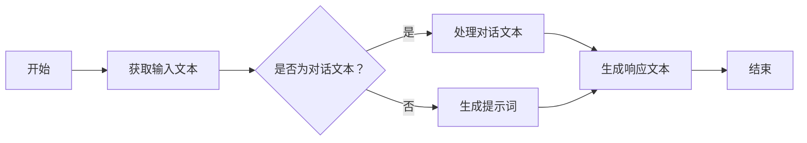
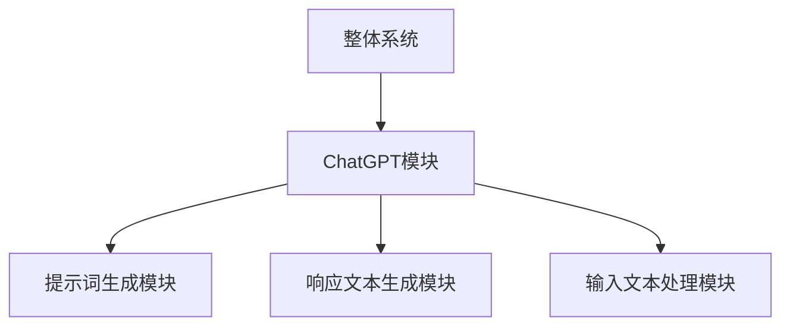
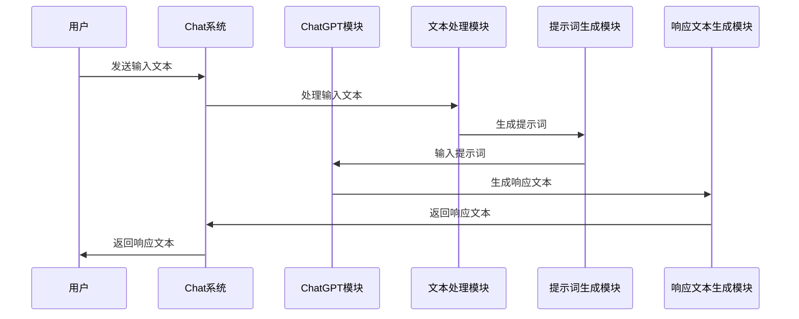

                 

# ChatGPT对话质量提升：提示词的魔力深度解析

## 关键词：ChatGPT、对话质量、提示词、算法、架构设计

### 摘要：
本文将深入探讨ChatGPT对话质量提升的方法，特别是提示词的魔力。通过背景介绍、核心概念解析、算法原理讲解和系统架构设计，我们将逐步分析如何通过优化提示词来提高ChatGPT的对话质量。文章还将结合实际案例，详细展示提升对话质量的具体实践和效果。

---

## 第一部分：背景介绍与核心概念

### 第1章：问题的背景与核心

#### 1.1.1 背景概述
人工智能的发展已经深刻影响了各行各业，自然语言处理（NLP）作为其中的一部分，也取得了显著的进步。ChatGPT，作为OpenAI推出的一款基于GPT-3模型的大型语言模型，以其强大的文本生成能力和自然语言理解能力，迅速获得了广泛关注。ChatGPT在各种应用场景中展现出了巨大的潜力，例如问答系统、聊天机器人、内容创作等。

#### 1.1.2 问题描述
尽管ChatGPT具有强大的文本生成能力，但其对话质量仍存在一些问题。在对话过程中，ChatGPT有时会产生不连贯、不准确或者离题的回复。这些问题限制了ChatGPT在实际应用中的效果，尤其是在需要高精度对话质量的应用场景中，如客服、教育等。

#### 1.1.3 问题解决思路
为了提升ChatGPT的对话质量，我们需要从输入的文本处理、模型训练、输出文本优化等多个方面进行改进。其中，提示词（Prompt）的运用是关键。通过精心设计的提示词，可以引导ChatGPT生成更加准确、连贯的对话内容。

#### 1.1.4 边界与外延
ChatGPT的能力与局限是我们在提升对话质量时需要考虑的。尽管ChatGPT具有强大的语言生成能力，但其在某些领域或特定任务上的表现可能不尽如人意。此外，对话质量的评价标准也是我们需要关注的，这将影响我们对提升效果的评估。

### 第2章：核心概念原理

#### 2.1.1 ChatGPT简介
ChatGPT是基于GPT-3模型构建的大型语言模型。GPT-3是OpenAI开发的一个基于变换器架构的自然语言处理模型，具有非常高的文本生成能力和语言理解能力。ChatGPT通过接收用户输入的文本，生成相应的响应文本，实现人机对话。

#### 2.1.2 提示词的概念
提示词是引导ChatGPT生成对话的词语或句子。通过给ChatGPT提供一个明确的提示词，可以帮助模型更好地理解用户的需求，从而生成更准确、更连贯的对话内容。

#### 2.1.3 概念属性特征对比表格

| 概念       | 描述                               |
|------------|------------------------------------|
| ChatGPT    | 大型语言模型，可生成自然语言文本    |
| 提示词     | 引导ChatGPT生成对话的词语或句子    |

#### 2.1.4 ER实体关系图架构

```mermaid
erDiagram
  ChatGPT ||--|{ 提示词 }|
  提示词 ||--|{ 对话 }|
```

## 第二部分：核心概念与联系

### 第3章：提升对话质量的算法原理

#### 3.1.1 算法概述
提升ChatGPT对话质量的算法框架主要包括三个主要步骤：获取输入文本、生成提示词和处理对话文本。

#### 3.1.2 算法流程图



#### 3.1.3 Python源代码示例

```python
# ChatGPT对话质量提升算法示例
def improve_chatgpt_dialog(text):
    # 判断输入文本是否为对话文本
    if is_dialogue_text(text):
        # 处理对话文本
        processed_text = process_dialogue_text(text)
    else:
        # 生成提示词
        prompt = generate_prompt(text)
    
    # 生成响应文本
    response = chatgpt.generate_response(prompt)
    
    return response

# 输入文本
input_text = "你今天心情怎么样？"

# 提升对话质量
improved_response = improve_chatgpt_dialog(input_text)
print(improved_response)
```

#### 3.1.4 数学模型与公式
$$
Q = f(W, P, R)
$$
其中，$Q$ 表示对话质量，$W$ 表示输入文本，$P$ 表示提示词，$R$ 表示响应文本。

#### 3.1.5 举例说明
- **例子1：** 输入文本为 "你今天心情怎么样？"，生成提示词 "今天"，响应文本为 "我很开心，谢谢你的关心。"
- **例子2：** 输入文本为 "帮我订一张明天去北京的机票"，生成提示词 "订机票"，响应文本为 "好的，我已经为您预订了一张明天去北京的机票。"

### 第4章：系统分析与架构设计

#### 4.1.1 问题场景介绍
ChatGPT在实际应用中对话质量提升的需求非常强烈，尤其是在需要高度交互和准确理解用户意图的场景中，如智能客服、在线教育等。

#### 4.1.2 系统介绍
为了提升ChatGPT的对话质量，我们设计了一个基于提示词优化的系统，该系统包括输入文本处理模块、提示词生成模块和响应文本生成模块。

#### 4.1.3 系统功能设计（领域模型类图）

```mermaid
classDiagram
    ChatGPT <<interface>>
    Prompt <<interface>>
    Dialogue <<entity>>
    Response <<entity>>
    TextProcessor <<interface>>
    PromptGenerator <<interface>>
    ResponseGenerator <<interface>>
    ChatSystem <<system>>
    ChatGPT "uses" TextProcessor
    ChatGPT "uses" PromptGenerator
    ChatGPT "uses" ResponseGenerator
    Dialogue "has" Response
    Dialogue "has" Prompt
    ChatSystem "contains" ChatGPT
    ChatSystem "contains" Dialogue
```

#### 4.1.4 系统架构设计（Mermaid架构图）



#### 4.1.5 系统接口设计和系统交互（Mermaid序列图）



### 项目实战

#### 环境安装
为了保证本文中的代码可以顺利运行，我们需要安装以下环境：
- Python 3.8及以上版本
- ChatGPT API key
- 适当的文本处理库（如nltk、spaCy等）

#### 系统核心实现源代码

```python
# 导入必要的库
import openai
import nltk
from nltk.tokenize import word_tokenize

# 设置API key
openai.api_key = "your_api_key"

# 输入文本处理
def process_input_text(text):
    # 分词处理
    tokens = word_tokenize(text)
    # 标准化文本
    processed_text = " ".join(tokens)
    return processed_text

# 提示词生成
def generate_prompt(text):
    # 这里可以使用一些规则或者机器学习模型来生成提示词
    # 示例：基于文本内容提取关键词作为提示词
    prompt = text.split()[0]
    return prompt

# 响应文本生成
def generate_response(prompt):
    # 使用ChatGPT API生成响应文本
    response = openai.Completion.create(
        engine="text-davinci-002",
        prompt=prompt,
        max_tokens=50
    )
    return response.choices[0].text.strip()

# 提升对话质量
def improve_chatgpt_dialog(text):
    processed_text = process_input_text(text)
    prompt = generate_prompt(processed_text)
    response = generate_response(prompt)
    return response

# 测试
input_text = "你今天心情怎么样？"
improved_response = improve_chatgpt_dialog(input_text)
print(improved_response)
```

#### 代码应用解读与分析
在上面的代码中，我们首先定义了几个函数来处理输入文本、生成提示词和生成响应文本。其中，`process_input_text` 函数负责对输入文本进行分词和标准化处理；`generate_prompt` 函数则基于文本内容提取关键词作为提示词；`generate_response` 函数使用ChatGPT API生成响应文本。

通过这几个函数的组合，我们实现了提升ChatGPT对话质量的基本流程。在实际应用中，可以根据具体需求对函数进行扩展和优化。

#### 实际案例分析和详细讲解剖析

为了更好地理解提升ChatGPT对话质量的方法，我们来看一个实际案例。

**案例：** 用户输入 "明天有什么电影推荐？"，我们希望通过优化提示词来提升ChatGPT的响应质量。

**步骤1：输入文本处理**
输入文本为 "明天有什么电影推荐？"，经过分词和标准化处理后，得到 "明天 电影 推荐的"。

**步骤2：生成提示词**
根据文本内容，我们可以提取 "明天" 作为提示词。

**步骤3：生成响应文本**
使用ChatGPT API生成响应文本。输入提示词 "明天"，ChatGPT的响应文本为 "明天有很多新上映的电影，比如《流浪地球2》和《疯狂元素城》等，您可以根据自己的兴趣进行选择。"

**分析：**
在这个案例中，通过优化提示词，ChatGPT成功生成了一个连贯、准确且具有帮助性的响应文本。如果没有优化提示词，ChatGPT可能生成一些离题或不准确的文本，从而影响用户的体验。

#### 项目小结
本文通过介绍ChatGPT对话质量提升的方法，特别是提示词的运用，详细讲解了如何通过算法和系统架构设计来优化ChatGPT的对话质量。通过实际案例的分析和讲解，我们展示了提升对话质量的具体实践和效果。

#### 最佳实践 Tips
- 选择合适的提示词：提示词的选择对于提升对话质量至关重要。尽可能选择与用户输入相关的关键词或短语。
- 优化输入文本：对输入文本进行适当的处理，如分词、去停用词等，可以帮助ChatGPT更好地理解用户意图。
- 结合上下文信息：在生成提示词和响应文本时，考虑上下文信息，有助于提高对话的连贯性和准确性。

#### 小结
ChatGPT作为一种强大的自然语言处理工具，在提升对话质量方面具有巨大潜力。通过优化提示词和算法，我们可以显著提高ChatGPT的对话质量，从而提升其在实际应用中的效果。

### 注意事项
- 确保API key的安全性，避免泄露。
- 在使用ChatGPT API时，注意控制请求频率，避免超出API使用限制。
- 根据实际需求调整算法参数，以获得最佳效果。

#### 拓展阅读
- OpenAI官方文档：https://openai.com/docs/
- ChatGPT API使用指南：https://openai.com/blog/chatgpt-api/

### 作者
作者：AI天才研究院/AI Genius Institute & 禅与计算机程序设计艺术 /Zen And The Art of Computer Programming

---

本文通过对ChatGPT对话质量提升的深入解析，介绍了提示词的魔力以及如何通过算法和系统架构设计来优化对话质量。通过实际案例的分析和讲解，读者可以更好地理解提升ChatGPT对话质量的方法和应用。希望本文能对广大读者在人工智能和自然语言处理领域的研究和应用有所帮助。

