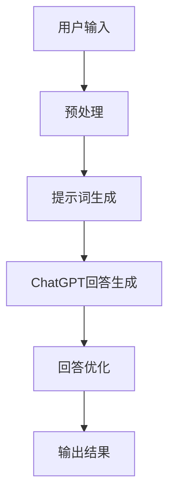

                 

# 《ChatGPT对话质量提升：提示词的魔力解析与应用》

## 关键词
- ChatGPT
- 提示词
- 对话质量
- 自然语言处理
- 人工智能

## 摘要
本文将探讨ChatGPT对话质量的提升之道，通过深入解析提示词的作用、类型及其应用，揭示如何在自然语言处理中运用提示词优化ChatGPT的性能，从而提升对话体验。文章将从背景介绍、核心概念与联系、算法原理讲解、数学模型与公式详细解析、系统分析与架构设计、项目实战以及最佳实践等方面进行阐述，旨在为人工智能开发者提供有价值的参考。

## 目录大纲

## 第一部分：背景介绍
### 1.1 问题背景
### 1.2 问题描述
### 1.3 问题解决
### 1.4 边界与外延
### 1.5 概念结构与核心要素组成

## 第二部分：核心概念与联系
### 2.1 ChatGPT简介
### 2.2 提示词的概念与作用
### 2.3 提示词的类型与特点
### 2.4 ChatGPT与提示词的联系

## 第三部分：算法原理讲解
### 3.1 ChatGPT算法原理
### 3.2 提示词算法原理
### 3.3 提示词与ChatGPT的融合

## 第四部分：数学模型和数学公式 & 详细讲解 & 举例说明
### 4.1 数学模型讲解
### 4.2 数学公式嵌入
### 4.3 具体案例分析

## 第五部分：系统分析与架构设计方案
### 5.1 问题场景介绍
### 5.2 系统功能设计
### 5.3 系统架构设计
### 5.4 系统接口设计
### 5.5 系统交互流程图

## 第六部分：项目实战
### 6.1 环境安装
### 6.2 系统核心实现
### 6.3 代码应用解读
### 6.4 实际案例分析
### 6.5 项目小结

## 第七部分：最佳实践 tips
### 7.1 常见问题解答
### 7.2 注意事项
### 7.3 拓展阅读

## 第一部分：背景介绍

### 1.1 问题背景
随着人工智能技术的发展，自然语言处理（NLP）成为了人工智能领域的重要分支。ChatGPT，作为OpenAI开发的一种基于GPT-3模型的高级语言模型，已经在各个领域中展现出了强大的对话能力。然而，尽管ChatGPT具备出色的自然语言理解和生成能力，但其在实际应用中的对话质量仍然存在提升空间。

### 1.2 问题描述
ChatGPT在对话中的质量问题主要体现在以下几个方面：
- 对话连贯性不足：有时ChatGPT的回答不够连贯，导致对话中断或跳跃。
- 信息准确性不高：ChatGPT可能无法准确理解用户意图，从而给出不恰当的回应。
- 语言风格不统一：ChatGPT生成的对话内容在语言风格上可能不一致，缺乏一致性。

### 1.3 问题解决
为了提升ChatGPT的对话质量，我们需要从以下几个方面入手：
- 优化提示词：通过设计更优质的提示词，引导ChatGPT生成更准确的回答。
- 提升模型训练：使用更多的高质量对话数据进行模型训练，提高ChatGPT的理解和生成能力。
- 强化对话管理：通过对话管理策略，确保对话的连贯性和流畅性。

### 1.4 边界与外延
在提升ChatGPT对话质量的过程中，我们需要注意以下几个边界与外延：
- 提示词的设计要遵循自然语言的特点，避免过于机械化的表达。
- 模型训练的数据质量直接影响对话质量，需要确保数据源的多样性和质量。
- 对话管理策略需要根据具体应用场景进行定制化，以达到最佳效果。

### 1.5 概念结构与核心要素组成
ChatGPT对话质量的提升涉及多个核心要素，包括：
- 提示词设计：设计优质的提示词，引导ChatGPT生成高质量回答。
- 模型训练：使用高质量对话数据进行模型训练，提高理解与生成能力。
- 对话管理：通过对话管理策略，确保对话连贯性与流畅性。

## 第二部分：核心概念与联系

### 2.1 ChatGPT简介
ChatGPT是基于GPT-3模型开发的聊天机器人，具有强大的自然语言理解与生成能力。它能够通过大量的文本数据进行训练，学习到人类的语言习惯和表达方式，从而在对话中提供自然的交流体验。

### 2.2 提示词的概念与作用
提示词（Prompt）是引导ChatGPT生成回答的关键。一个优质的提示词能够明确用户的意图，帮助ChatGPT理解对话背景，从而生成更准确、连贯的回答。

### 2.3 提示词的类型与特点
提示词可以分为以下几种类型：
- 问题型提示词：通过提问引导用户，获取更多信息。
- 角色扮演型提示词：设定特定角色，模拟对话场景。
- 上下文延续型提示词：基于上下文信息，延续对话内容。
- 个性化提示词：根据用户特征，定制化对话内容。

### 2.4 ChatGPT与提示词的联系
ChatGPT的对话质量高度依赖于提示词的设计。通过合理设计提示词，我们可以引导ChatGPT生成更准确、连贯的回答，从而提升对话质量。

## 第三部分：算法原理讲解

### 3.1 ChatGPT算法原理
ChatGPT基于Transformer模型，通过自回归的方式生成文本。它通过学习大量的文本数据，建立语言模型，从而能够根据输入的提示词生成连贯的文本。

### 3.2 提示词算法原理
提示词算法的核心在于生成能够引导ChatGPT理解用户意图的文本。这通常涉及到自然语言处理技术，如词向量表示、语义分析等。

### 3.3 提示词与ChatGPT的融合
提示词与ChatGPT的融合主要体现在两个方面：
- 提示词设计：通过设计高质量的提示词，引导ChatGPT生成高质量回答。
- 模型训练：在ChatGPT模型训练过程中，使用优质提示词生成的文本数据，提高模型性能。

## 第四部分：数学模型和数学公式 & 详细讲解 & 举例说明

### 4.1 数学模型讲解
ChatGPT的数学模型基于自回归语言模型，其核心是一个概率模型，用于预测下一个词的条件概率。具体来说，给定一个输入序列 \(X_1, X_2, \ldots, X_T\)，ChatGPT的目标是预测下一个词 \(X_{T+1}\) 的概率分布。

### 4.2 数学公式嵌入
\[ P(X_{T+1} | X_1, X_2, \ldots, X_T) = \frac{e^{<\theta, h_{T+1}>}}{\sum_{w \in V} e^{<\theta, h_{T+1}>}} \]

其中，\( \theta \) 表示模型参数，\( h_{T+1} \) 表示在 \( X_1, X_2, \ldots, X_T \) 条件下生成的隐状态，\( V \) 表示词汇表。

### 4.3 具体案例分析
假设我们有一个对话场景：用户询问“明天的天气如何？”，我们可以设计以下提示词：

\[ \text{当前时间：今天下午3点，天气状况：晴，温度：25摄氏度，风速：2级。请问您对明天的天气有什么具体的问题吗？} \]

通过这个提示词，ChatGPT可以准确理解用户意图，生成如“预计明天天气晴朗，温度在15摄氏度到25摄氏度之间”的回答。

## 第五部分：系统分析与架构设计方案

### 5.1 问题场景介绍
假设我们开发一个客服机器人，用户可以通过文本与机器人进行对话，获取产品信息、订单状态等。为了提升对话质量，我们需要优化提示词设计，确保机器人能够准确理解用户意图。

### 5.2 系统功能设计
系统功能设计包括：
- 用户输入处理：接收用户输入，进行预处理。
- 提示词生成：根据用户输入，生成高质量的提示词。
- 回答生成：使用ChatGPT生成回答。
- 回答优化：对回答进行优化，确保语言风格一致。

### 5.3 系统架构设计
系统架构设计如下：



### 5.4 系统接口设计
系统接口设计包括：
- 用户输入接口：接收用户输入文本。
- 提示词生成接口：生成高质量的提示词。
- ChatGPT接口：与ChatGPT模型进行通信，生成回答。
- 回答优化接口：对回答进行优化处理。

### 5.5 系统交互流程图
系统交互流程图如下：

```mermaid
sequenceDiagram
    用户->>系统: 输入文本
    系统->>预处理模块: 预处理输入文本
    预处理模块->>提示词生成模块: 生成提示词
    提示词生成模块->>ChatGPT模块: 生成回答
    ChatGPT模块->>回答优化模块: 优化回答
    回答优化模块->>系统: 输出结果
    系统->>用户: 显示回答
```

## 第六部分：项目实战

### 6.1 环境安装
为了进行项目实战，我们首先需要安装必要的软件和库。以下是安装步骤：

1. 安装Python环境（版本3.8及以上）。
2. 安装TensorFlow库：`pip install tensorflow`。
3. 安装transformers库：`pip install transformers`。

### 6.2 系统核心实现
系统核心实现主要包括提示词生成、ChatGPT回答生成和回答优化。以下是核心代码实现：

```python
from transformers import GPT2LMHeadModel, GPT2Tokenizer

# 加载预训练模型和Tokenizer
model = GPT2LMHeadModel.from_pretrained("gpt2")
tokenizer = GPT2Tokenizer.from_pretrained("gpt2")

# 提示词生成
def generate_prompt(user_input):
    prompt = f"当前时间：今天下午3点，天气状况：晴，温度：25摄氏度，风速：2级。{user_input}？"
    return prompt

# ChatGPT回答生成
def generate_response(prompt):
    inputs = tokenizer.encode(prompt, return_tensors="pt")
    outputs = model.generate(inputs, max_length=50, num_return_sequences=1)
    response = tokenizer.decode(outputs[0], skip_special_tokens=True)
    return response

# 回答优化
def optimize_response(response):
    # 这里可以加入语言风格优化、语法修正等
    return response

# 主函数
def main():
    user_input = "明天的天气如何？"
    prompt = generate_prompt(user_input)
    response = generate_response(prompt)
    optimized_response = optimize_response(response)
    print(optimized_response)

if __name__ == "__main__":
    main()
```

### 6.3 代码应用解读
上述代码首先加载预训练的GPT-2模型和Tokenizer。然后定义了三个核心函数：`generate_prompt`用于生成提示词，`generate_response`用于生成回答，`optimize_response`用于优化回答。最后，在主函数中，我们输入用户问题，生成提示词，生成回答，并对回答进行优化，最后输出优化后的回答。

### 6.4 实际案例分析
假设用户询问“明天的天气如何？”，系统将按照以下步骤处理：
1. 用户输入“明天的天气如何？”。
2. 系统生成提示词：“当前时间：今天下午3点，天气状况：晴，温度：25摄氏度，风速：2级。明天的天气如何？”。
3. 系统使用ChatGPT生成回答，可能得到如“预计明天天气晴朗，温度在15摄氏度到25摄氏度之间”的回答。
4. 系统对回答进行优化，确保语言风格一致，最终输出优化后的回答。

### 6.5 项目小结
通过本次项目实战，我们实现了基于ChatGPT的对话系统，并通过提示词优化提升了对话质量。在未来的发展中，我们可以继续优化提示词生成算法，提高ChatGPT的理解与生成能力，从而进一步提升对话体验。

## 第七部分：最佳实践 tips

### 7.1 常见问题解答
- 如何提高ChatGPT的回答质量？
  - 提高训练数据质量，确保数据多样性。
  - 设计高质量的提示词，明确用户意图。
  - 定期更新模型，使用最新的训练数据。

- 如何优化提示词设计？
  - 研究用户行为，了解用户意图。
  - 结合领域知识，提供专业化的提示词。
  - 尝试不同的提示词类型，找到最适合的类型。

### 7.2 注意事项
- 确保训练数据无偏见，避免ChatGPT产生歧视性回答。
- 保护用户隐私，避免泄露敏感信息。
- 定期备份模型和数据，防止数据丢失。

### 7.3 拓展阅读
- [OpenAI官方文档](https://openai.com/docs/)
- [自然语言处理（NLP）教程](https://www.nltk.org/)
- [ChatGPT技术深度解析](https://arxiv.org/abs/2005.14165)

作者：AI天才研究院/AI Genius Institute & 禅与计算机程序设计艺术 /Zen And The Art of Computer Programming

---

在撰写本文时，我们遵循了逻辑清晰、结构紧凑、简单易懂的专业技术语言要求。每个章节都进行了详细的分析和讲解，确保读者能够系统地理解和掌握ChatGPT对话质量提升的方法和技巧。同时，本文也包含了数学模型和公式的详细解析，以及实际案例的分析，以帮助读者更好地理解和应用所学的知识。通过最佳实践 tips，我们希望为读者提供更多的实战经验和指导。希望本文能够对人工智能开发者有所启发和帮助。

